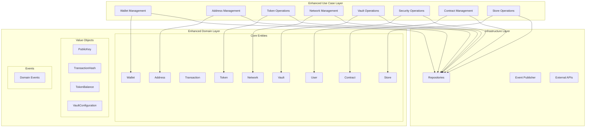
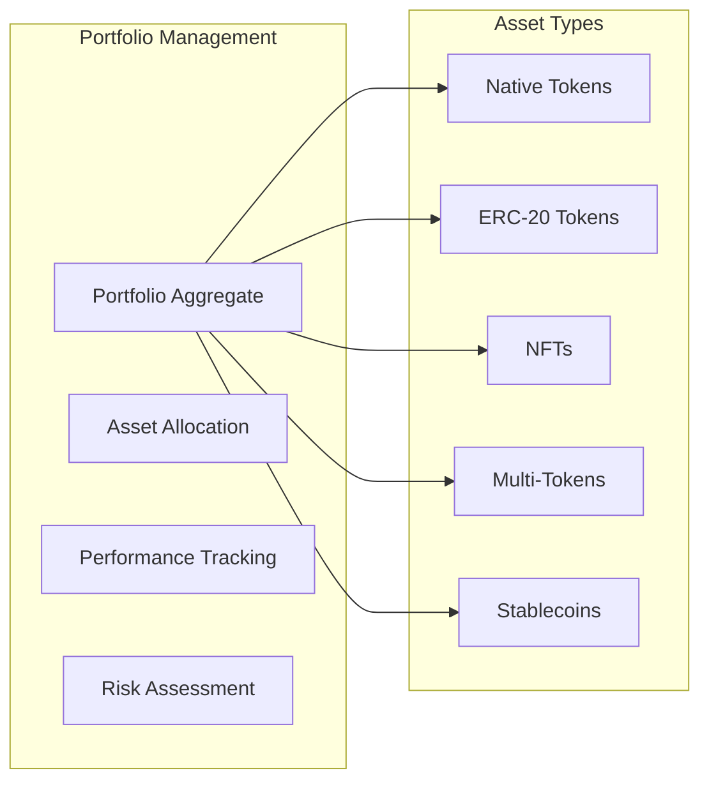
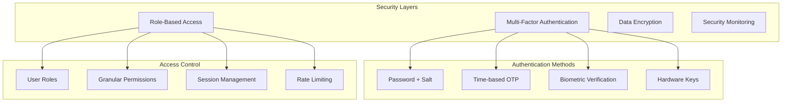
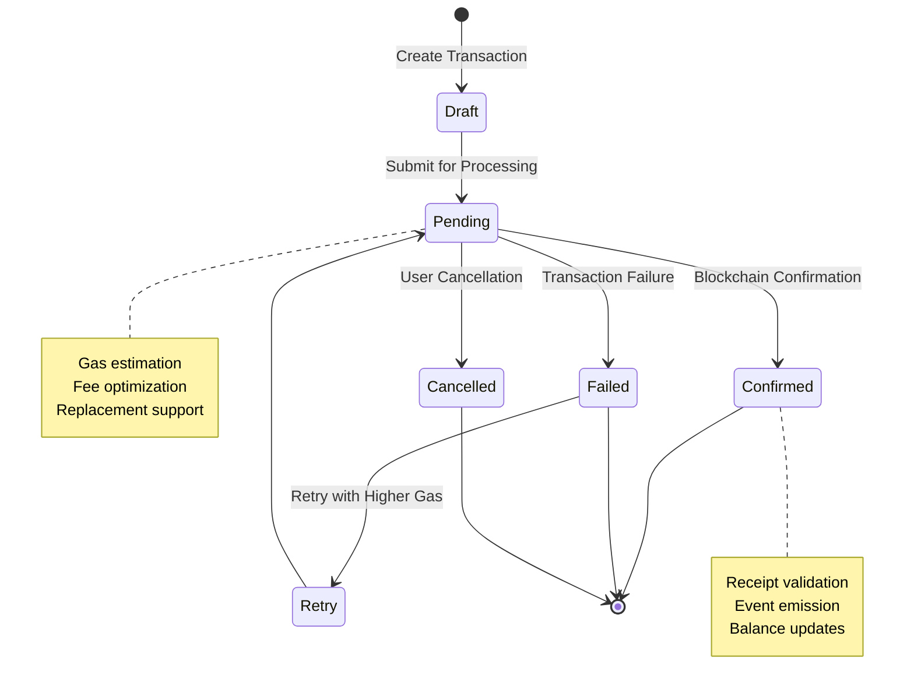
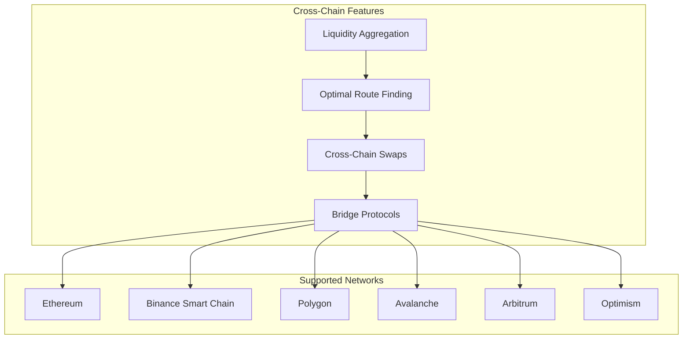
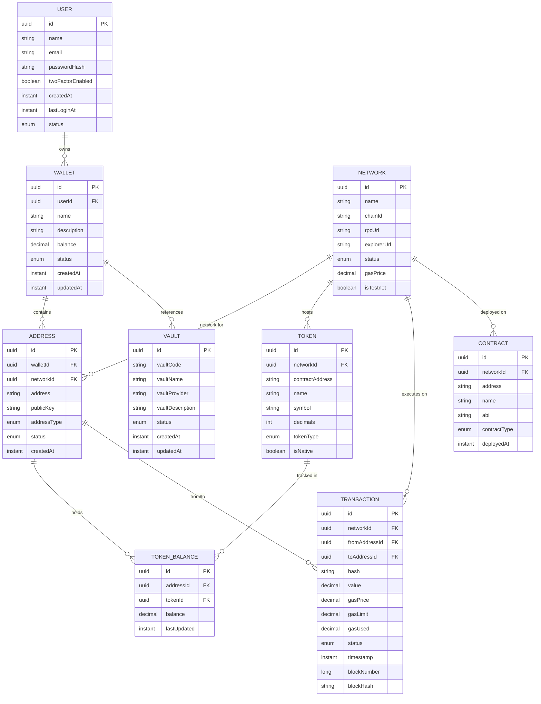
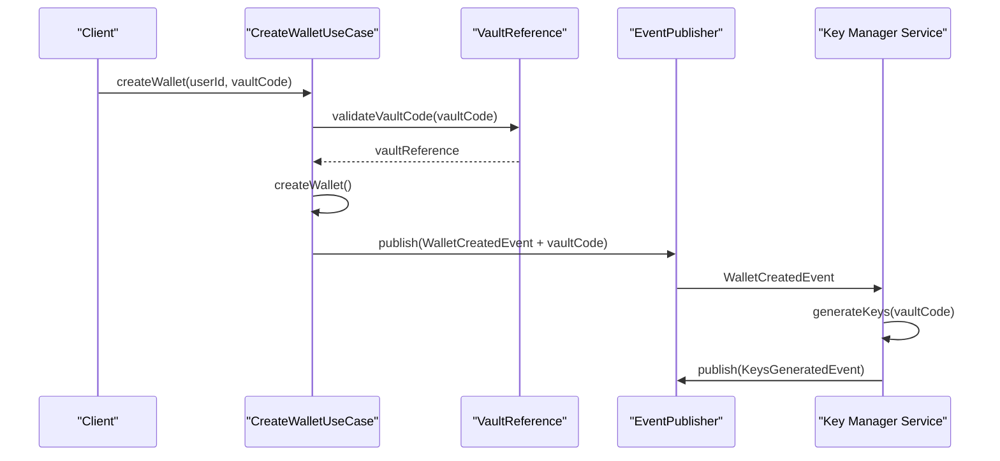
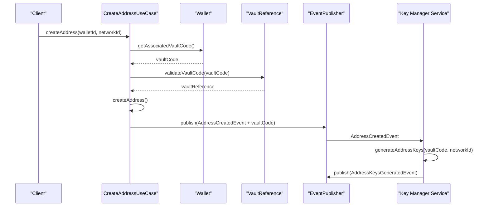

# Domain Feature Enhancement Design

## Overview

This design document outlines the strategic enhancements required to complete the domain functionality of the bloco-wallet-java system. The current implementation provides a solid foundation with core wallet operations, transaction management, and event-driven architecture. However, several critical domain features and use cases are missing to achieve full domain coverage and provide comprehensive wallet management capabilities.

The proposed enhancements focus on completing the domain model implementation, adding missing use cases, improving security features, and expanding multi-asset support. These improvements will transform the system from a basic wallet service into a comprehensive blockchain wallet management platform.

## Architecture

The system follows Clean Architecture principles with distinct layers for domain logic, use cases, and infrastructure. The enhancements will maintain this architectural integrity while expanding capabilities across all domain entities.

## Missing Use Cases Analysis

Based on the domain model analysis, the following critical use cases are missing and must be implemented to achieve complete domain functionality:

### Wallet Domain Use Cases

| Missing Use Case | Priority | Description |
|-----------------|----------|-------------|
| UpdateWalletUseCase | High | Update wallet metadata (name, description) |
| ActivateWalletUseCase | High | Activate inactive wallets |
| DeactivateWalletUseCase | High | Deactivate wallets for security |
| DeleteWalletUseCase | Medium | Soft delete wallets with balance validation |
| ListWalletsUseCase | High | Retrieve wallets by user with pagination |
| GetWalletDetailsUseCase | High | Get comprehensive wallet information |
| RecoverWalletUseCase | Medium | Recover wallet from seed phrase |

### Address Management Use Cases

| Missing Use Case | Priority | Description |
|-----------------|----------|-------------|
| CreateAddressUseCase | High | Generate new addresses for wallets |
| ValidateAddressUseCase | High | Validate address format and network compatibility |
| GetAddressBalanceUseCase | High | Retrieve balance for specific addresses |
| ListAddressesByWalletUseCase | High | Get all addresses associated with a wallet |
| UpdateAddressStatusUseCase | Medium | Change address status (active/inactive) |
| ImportAddressUseCase | Medium | Import existing addresses |

### Token Management Use Cases

| Missing Use Case | Priority | Description |
|-----------------|----------|-------------|
| AddTokenToWalletUseCase | High | Add supported tokens to wallet |
| RemoveTokenFromWalletUseCase | Medium | Remove tokens from wallet |
| GetTokenBalanceUseCase | High | Get specific token balance |
| ListSupportedTokensUseCase | High | List available tokens by network |
| ImportCustomTokenUseCase | Medium | Add custom ERC-20 tokens |
| UpdateTokenInfoUseCase | Low | Update token metadata |

### Network Management Use Cases

| Missing Use Case | Priority | Description |
|-----------------|----------|-------------|
| AddNetworkUseCase | High | Add new blockchain networks |
| UpdateNetworkStatusUseCase | High | Update network operational status |
| ValidateNetworkConfigUseCase | High | Validate network configuration |
| ListActiveNetworksUseCase | High | Get operational networks |
| GetNetworkDetailsUseCase | High | Retrieve network information |

### Vault Reference Management Use Cases

| Missing Use Case | Priority | Description |
|-----------------|----------|-------------|
| CreateVaultReferenceUseCase | High | Create vault reference for Key Manager integration |
| UpdateVaultReferenceUseCase | Medium | Update vault reference metadata |
| ValidateVaultProviderUseCase | High | Validate vault provider configuration |
| ListAvailableVaultsUseCase | Medium | List configured vault references |
| GetVaultReferenceUseCase | High | Retrieve vault reference details |
| DeactivateVaultReferenceUseCase | Low | Deactivate vault reference |

### Security & User Management Use Cases

| Missing Use Case | Priority | Description |
|-----------------|----------|-------------|
| CreateUserUseCase | High | Register new users |
| AuthenticateUserUseCase | High | Validate user credentials |
| UpdateUserProfileUseCase | Medium | Modify user information |
| ChangePasswordUseCase | High | Update user password |
| EnableTwoFactorAuthUseCase | High | Enable 2FA security |
| GenerateRecoveryCodesUseCase | High | Create backup codes |
| ValidateSecurityQuestionUseCase | Medium | Verify security questions |

### Contract Management Use Cases

| Missing Use Case | Priority | Description |
|-----------------|----------|-------------|
| DeployContractUseCase | Medium | Deploy smart contracts |
| InteractWithContractUseCase | High | Execute contract functions |
| GetContractDetailsUseCase | High | Retrieve contract information |
| ValidateContractABIUseCase | Medium | Validate contract interface |
| EstimateGasForContractUseCase | High | Calculate gas requirements |

### Store Operations Use Cases

| Missing Use Case | Priority | Description |
|-----------------|----------|-------------|
| CreateStoreUseCase | Low | Create marketplace stores |
| UpdateStoreStatusUseCase | Low | Manage store operational status |
| ListStoreItemsUseCase | Low | Browse store inventory |
| ProcessPurchaseUseCase | Low | Handle store transactions |

## Enhanced Domain Features

### Multi-Asset Portfolio Management

The system requires comprehensive multi-asset support beyond basic token management:

**Portfolio Features:**
- Aggregate balance calculation across all assets
- Portfolio performance tracking and analytics
- Asset allocation recommendations
- Risk assessment based on volatility
- Historical balance tracking
- Profit/loss calculations

### Advanced Security Framework

Enhanced security measures are essential for production wallet management:

**Security Requirements:**
- Multi-factor authentication with TOTP support
- Biometric authentication integration
- Hardware security module (HSM) support
- Role-based access control with granular permissions
- Session management with timeout policies
- Rate limiting for sensitive operations
- Audit trail for all security events
- Encrypted private key storage
- Secure backup and recovery mechanisms

### Transaction Lifecycle Enhancement

Complete transaction management with advanced features:

**Transaction Features:**
- Transaction drafting and estimation
- Dynamic gas price optimization
- Transaction replacement (speed up/cancel)
- Batch transaction processing
- Transaction scheduling
- Cross-chain transaction support
- Transaction history with detailed analytics
- Fee tracking and optimization recommendations

### Cross-Chain Interoperability

Support for multiple blockchain networks with seamless interaction:

## API Endpoints Reference

### Wallet Management Endpoints

| Endpoint | Method | Description | Request Schema | Response Schema |
|----------|---------|-------------|----------------|-----------------|
| `/wallets` | POST | Create new wallet | `{userId, name, description}` | `{walletId, status, timestamp}` |
| `/wallets/{id}` | GET | Get wallet details | - | `{wallet, addresses, balances}` |
| `/wallets/{id}` | PUT | Update wallet info | `{name, description}` | `{status, timestamp}` |
| `/wallets/{id}/activate` | POST | Activate wallet | - | `{status, timestamp}` |
| `/wallets/{id}/deactivate` | POST | Deactivate wallet | - | `{status, timestamp}` |
| `/wallets/user/{userId}` | GET | List user wallets | `?page=0&size=20` | `{wallets[], pagination}` |

### Address Management Endpoints

| Endpoint | Method | Description | Request Schema | Response Schema |
|----------|---------|-------------|----------------|-----------------|
| `/addresses` | POST | Create address | `{walletId, networkId, type}` | `{addressId, address, publicKey}` |
| `/addresses/{id}/validate` | POST | Validate address | `{address, networkId}` | `{valid, format, network}` |
| `/addresses/{id}/balance` | GET | Get address balance | - | `{balances[], timestamp}` |
| `/wallets/{id}/addresses` | GET | List wallet addresses | - | `{addresses[], count}` |

### Token Management Endpoints

| Endpoint | Method | Description | Request Schema | Response Schema |
|----------|---------|-------------|----------------|-----------------|
| `/tokens` | GET | List supported tokens | `?networkId=uuid` | `{tokens[], count}` |
| `/tokens/custom` | POST | Add custom token | `{contractAddress, networkId}` | `{tokenId, metadata}` |
| `/wallets/{id}/tokens` | POST | Add token to wallet | `{tokenId}` | `{status, timestamp}` |
| `/wallets/{id}/tokens/{tokenId}/balance` | GET | Get token balance | - | `{balance, decimals, value}` |

## Data Models & Domain Relationships

### Enhanced Entity Relationship Model

### Domain Events Enhancement

| Domain | Event Type | Event Data | Triggers |
|---------|------------|------------|----------|
| **User** | UserCreatedEvent | userId, email, timestamp | User registration |
| **User** | UserAuthenticatedEvent | userId, ipAddress, timestamp | Successful login |
| **User** | TwoFactorEnabledEvent | userId, method, timestamp | 2FA activation |
| **Wallet** | WalletCreatedEvent | walletId, userId, correlationId | Wallet creation |
| **Wallet** | WalletActivatedEvent | walletId, timestamp | Wallet activation |
| **Wallet** | WalletDeactivatedEvent | walletId, reason, timestamp | Wallet deactivation |
| **Address** | AddressCreatedEvent | addressId, walletId, networkId | Address generation |
| **Address** | AddressStatusChangedEvent | addressId, oldStatus, newStatus | Status update |
| **Token** | TokenAddedToWalletEvent | walletId, tokenId, timestamp | Token addition |
| **Token** | CustomTokenCreatedEvent | tokenId, contractAddress, metadata | Custom token |
| **Transaction** | TransactionCreatedEvent | transactionId, details | Transaction creation |
| **Transaction** | TransactionConfirmedEvent | transactionId, blockDetails | Confirmation |
| **Transaction** | TransactionFailedEvent | transactionId, reason | Failure |
| **Vault** | VaultReferenceCreatedEvent | vaultId, vaultCode, provider | Vault reference creation |
| **Vault** | VaultReferenceUpdatedEvent | vaultId, changes, timestamp | Reference update |
| **Vault** | VaultProviderValidatedEvent | vaultId, provider, status | Provider validation |

## Business Logic Enhancement

### Wallet Operations Business Rules

**Wallet Creation Rules:**
- User must be authenticated and verified
- Default wallet name generated if not provided
- Initial balance set to zero for all supported tokens
- Primary address automatically generated for default network
- Wallet status set to ACTIVE upon creation
- Correlation ID required for event tracking

**Balance Management Rules:**
- Balance updates must be atomic across all related entities
- Insufficient balance validation before fund operations
- Multi-token balance tracking with decimal precision
- Historical balance snapshots for analytics
- Real-time balance synchronization across addresses

**Vault Reference Management Rules:**
- Vault references must specify valid provider configurations
- VaultCode must be unique within the system
- Vault provider validation required before reference creation
- Integration with Key Manager service through event publication
- Vault references associated with wallet or address creation requests

### Vault Reference Integration Rules

**Key Manager Integration:**
- Vault references serve as configuration for external Key Manager service
- VaultCode transmitted in wallet/address creation events
- Key Manager service responsible for actual key generation and storage
- Vault provider validation ensures Key Manager compatibility
- Event-driven communication for vault operations

**Reference Management:**
- Vault references maintain metadata only, no actual keys
- Provider-specific configuration validation
- Vault availability monitoring through health checks
- Integration status tracking for operational visibility
- Graceful degradation when vault providers are unavailable

### Transaction Processing Business Rules

**Transaction Validation:**
- Address format validation for target network
- Sufficient balance verification including gas fees
- Gas price optimization based on network conditions
- Duplicate transaction detection and prevention
- Cross-chain compatibility validation

**Fee Calculation:**
- Dynamic gas price estimation based on network congestion
- Fee optimization recommendations for users
- Maximum fee limits to prevent excessive charges
- Gas price prediction for transaction timing
- Multi-tier fee options (slow, standard, fast)

**Transaction Lifecycle:**
- Draft transactions for user review before submission
- Pending state with estimated confirmation time
- Automatic retry mechanisms for failed transactions
- Transaction replacement support for speed adjustment
- Comprehensive error handling with user-friendly messages

### Security Business Rules

**Authentication Requirements:**
- Strong password policy enforcement
- Multi-factor authentication for sensitive operations
- Session timeout based on activity level
- Device registration and verification
- IP address monitoring for suspicious activity

**Authorization Framework:**
- Role-based access control with granular permissions
- Operation-specific authorization checks
- Resource-level access control
- Administrative override capabilities with audit
- Time-based access restrictions

### Vault Reference Integration Workflow

**Wallet Creation with Vault Reference:**

**Address Creation with Vault Reference:**

### Data Protection:**
- Private key encryption with user-derived keys
- Secure backup mechanisms with redundancy
- Data anonymization for analytics
- GDPR compliance for user data handling
- Secure deletion of sensitive information

## Testing Strategy

### Domain Testing Framework

**Unit Testing Coverage:**
- Domain entity behavior validation
- Business rule enforcement verification
- Value object immutability testing
- Event publication verification
- Exception handling validation

**Integration Testing Scope:**
- Use case orchestration testing
- Repository integration verification
- Event publishing and consumption
- External API integration testing
- Database transaction consistency

**End-to-End Testing Scenarios:**
- Complete wallet creation and management workflows
- Multi-asset transaction processing
- Cross-chain operation validation
- Security feature verification
- Performance and scalability testing

### Test Data Management

**Test Data Categories:**
- Valid domain entity fixtures
- Invalid input boundary testing
- Edge case scenario data
- Performance testing datasets
- Security testing attack vectors

**Test Environment Setup:**
- Isolated test databases for each domain
- Mock external service dependencies
- Configurable test network environments
- Automated test data cleanup
- Reproducible test scenarios

## Migration Strategy

### Implementation Phases

**Phase 1: Core Use Cases (Priority: High)**
- Wallet management use cases
- Address management operations
- Basic token support
- User authentication framework
- Essential security features

**Phase 2: Advanced Features (Priority: Medium)**
- Multi-asset portfolio management
- Transaction lifecycle enhancements
- Vault operations
- Contract interaction capabilities
- Cross-chain basic support

**Phase 3: Platform Features (Priority: Low)**
- Store operations
- Advanced analytics
- Marketplace functionality
- Third-party integrations
- Advanced cross-chain features

### Technical Migration Approach

**Database Schema Evolution:**
- Incremental schema migrations with backward compatibility
- Data migration scripts for existing entities
- Performance optimization during migration
- Rollback procedures for each migration step
- Data integrity validation post-migration

**API Versioning Strategy:**
- Gradual API endpoint introduction
- Backward compatibility maintenance
- Deprecation notices for legacy endpoints
- Client migration guidance
- Feature flag support for gradual rollout

**Event System Enhancement:**
- New event types introduction
- Existing event schema evolution
- Consumer compatibility maintenance
- Event replay capabilities for testing
- Dead letter queue handling for failed events