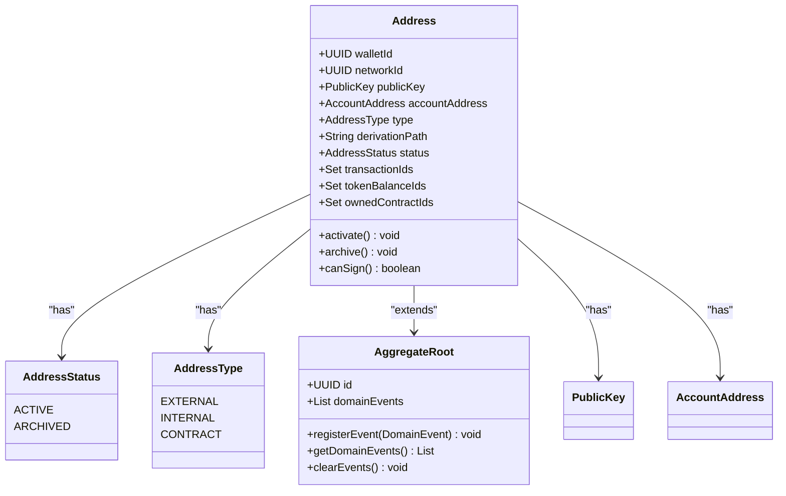
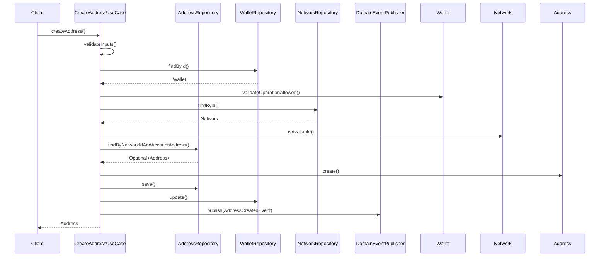
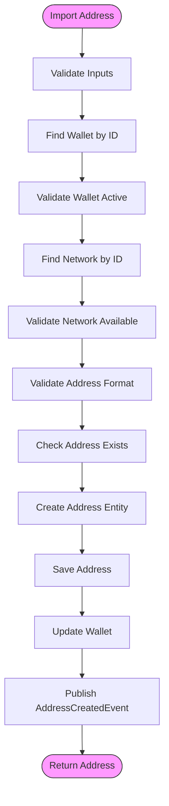
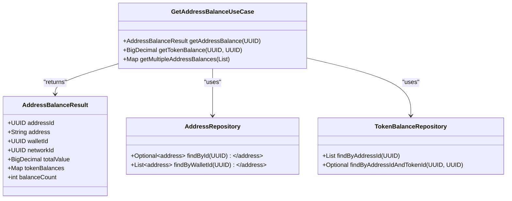
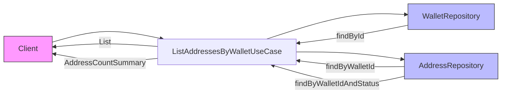
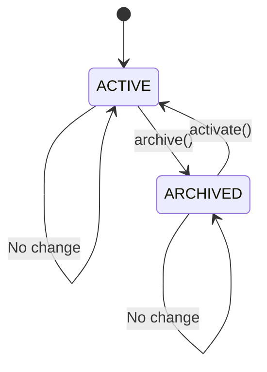
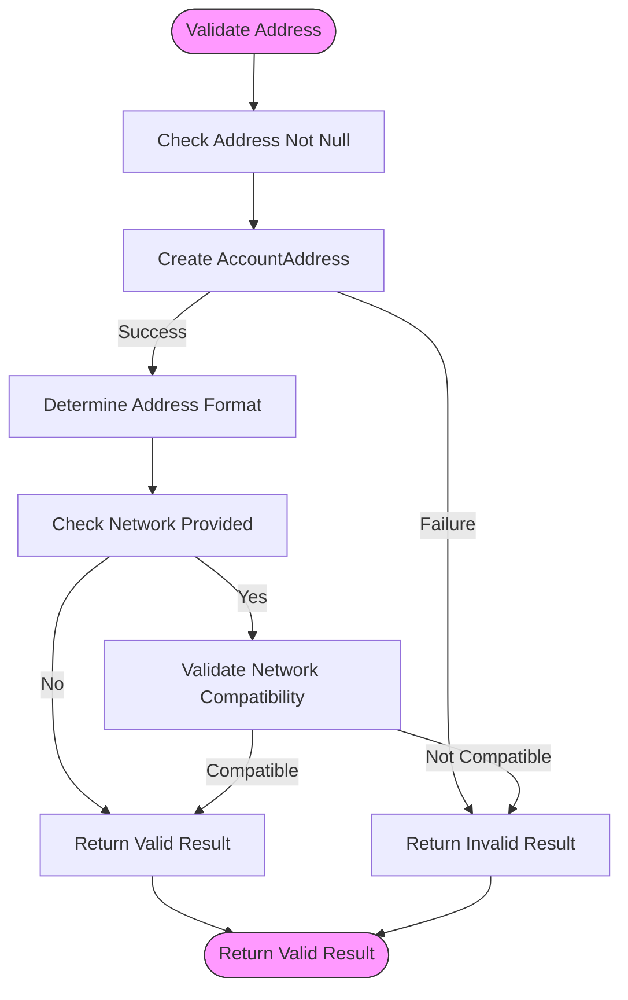

# Address Management

<cite>
**Referenced Files in This Document**   
- [Address.java](file://src/main/java/dev/bloco/wallet/hub/domain/model/address/Address.java)
- [AddressRepository.java](file://src/main/java/dev/bloco/wallet/hub/domain/gateway/AddressRepository.java)
- [AddressStatus.java](file://src/main/java/dev/bloco/wallet/hub/domain/model/address/AddressStatus.java)
- [AddressType.java](file://src/main/java/dev/bloco/wallet/hub/domain/model/address/AddressType.java)
- [CreateAddressUseCase.java](file://src/main/java/dev/bloco/wallet/hub/usecase/CreateAddressUseCase.java)
- [ImportAddressUseCase.java](file://src/main/java/dev/bloco/wallet/hub/usecase/ImportAddressUseCase.java)
- [GetAddressBalanceUseCase.java](file://src/main/java/dev/bloco/wallet/hub/usecase/GetAddressBalanceUseCase.java)
- [ListAddressesByWalletUseCase.java](file://src/main/java/dev/bloco/wallet/hub/usecase/ListAddressesByWalletUseCase.java)
- [UpdateAddressStatusUseCase.java](file://src/main/java/dev/bloco/wallet/hub/usecase/UpdateAddressStatusUseCase.java)
- [ValidateAddressUseCase.java](file://src/main/java/dev/bloco/wallet/hub/usecase/ValidateAddressUseCase.java)
</cite>

## Table of Contents
1. [Introduction](#introduction)
2. [Core Components](#core-components)
3. [Address Creation](#address-creation)
4. [Address Import](#address-import)
5. [Balance Retrieval](#balance-retrieval)
6. [Address Listing](#address-listing)
7. [Status Management](#status-management)
8. [Address Validation](#address-validation)
9. [Integration Patterns](#integration-patterns)
10. [Troubleshooting Guide](#troubleshooting-guide)

## Introduction
This document provides comprehensive documentation for the Address Management system in the Bloco Wallet Java application. It covers the complete lifecycle of blockchain addresses including creation, import, validation, balance retrieval, listing, and status updates. The system is designed to support multiple blockchain networks and address types while maintaining security and auditability through domain-driven design principles.

The address management functionality is implemented using a clean architecture with clear separation between use cases, domain models, and infrastructure components. All operations follow consistent patterns for validation, error handling, and event publishing.

## Core Components

The address management system consists of several key components that work together to provide a robust and scalable solution:

- **Address Entity**: Represents a blockchain address with its metadata and lifecycle state
- **AddressRepository**: Provides persistence operations for address entities
- **Use Cases**: Encapsulate business logic for all address operations
- **Domain Events**: Capture significant state changes for audit and integration purposes

The Address entity extends AggregateRoot, ensuring consistency and transactional integrity. Each address is associated with a wallet and network, has a type (EXTERNAL, INTERNAL, CONTRACT), and maintains a status (ACTIVE, ARCHIVED).



**Diagram sources**
- [Address.java](file://src/main/java/dev/bloco/wallet/hub/domain/model/address/Address.java#L11-L132)
- [AddressStatus.java](file://src/main/java/dev/bloco/wallet/hub/domain/model/address/AddressStatus.java#L2-L5)
- [AddressType.java](file://src/main/java/dev/bloco/wallet/hub/domain/model/address/AddressType.java#L2-L6)

**Section sources**
- [Address.java](file://src/main/java/dev/bloco/wallet/hub/domain/model/address/Address.java#L11-L132)
- [AddressRepository.java](file://src/main/java/dev/bloco/wallet/hub/domain/gateway/AddressRepository.java#L9-L31)

## Address Creation

The CreateAddressUseCase handles the creation of new blockchain addresses within the system. This operation generates a new address associated with a specific wallet and network.

### Key Features
- Validates wallet and network existence and status
- Ensures address uniqueness within the network
- Supports different address types (EXTERNAL, INTERNAL, CONTRACT)
- Generates BIP44-compliant derivation paths
- Publishes AddressCreatedEvent upon successful creation

### Usage Example
```java
Address address = createAddressUseCase.createAddress(
    walletId,
    networkId,
    "public-key-value",
    "0x742d35Cc6634C0532925a3b8D4C701E7B6D6D36E",
    AddressType.EXTERNAL,
    "m/44'/60'/0'/0/1",
    "correlation-123"
);
```

### Business Rules
- Wallet must exist and be active
- Network must exist and be available
- Address must be unique within the network
- Public key must be provided and valid
- All input parameters must be non-null



**Diagram sources**
- [CreateAddressUseCase.java](file://src/main/java/dev/bloco/wallet/hub/usecase/CreateAddressUseCase.java#L38-L122)
- [Address.java](file://src/main/java/dev/bloco/wallet/hub/domain/model/address/Address.java#L14-L37)

**Section sources**
- [CreateAddressUseCase.java](file://src/main/java/dev/bloco/wallet/hub/usecase/CreateAddressUseCase.java#L1-L122)

## Address Import

The ImportAddressUseCase enables users to import existing blockchain addresses into their wallet management system. This is particularly useful for watch-only addresses or migrating addresses from other wallets.

### Key Features
- Supports both regular and watch-only addresses
- Validates address format for the target network
- Allows batch import of multiple addresses
- Creates placeholder public keys for watch-only addresses
- Publishes AddressCreatedEvent upon successful import

### Usage Example
```java
// Import single address
Address address = importAddressUseCase.importAddress(
    walletId,
    networkId,
    "0x742d35Cc6634C0532925a3b8D4C701E7B6D6D36E",
    "public-key-value",
    "My Ethereum Address",
    false,
    "correlation-123"
);

// Batch import
BatchImportResult result = importAddressUseCase.importAddresses(
    walletId,
    networkId,
    new AddressImport[]{
        new AddressImport("0x742d...D36E", "pk1", "Address 1", false),
        new AddressImport("0x853e...E47F", null, "Watch-only", true)
    },
    "batch-456"
);
```

### Business Rules
- Wallet must exist and be active
- Network must exist and be available
- Address must not already exist in the system
- Address format must be valid for the target network
- Public key is optional for watch-only addresses



**Diagram sources**
- [ImportAddressUseCase.java](file://src/main/java/dev/bloco/wallet/hub/usecase/ImportAddressUseCase.java#L38-L204)
- [ValidateAddressUseCase.java](file://src/main/java/dev/bloco/wallet/hub/usecase/ValidateAddressUseCase.java#L1-L178)

**Section sources**
- [ImportAddressUseCase.java](file://src/main/java/dev/bloco/wallet/hub/usecase/ImportAddressUseCase.java#L1-L204)

## Balance Retrieval

The GetAddressBalanceUseCase provides comprehensive balance information for blockchain addresses, including both native cryptocurrency and token balances.

### Key Features
- Retrieves all token balances for an address
- Calculates total value across all tokens
- Returns zero balances for completeness
- Supports single address, specific token, and batch queries
- No domain events are published (read-only operation)

### Usage Example
```java
// Get all balances for an address
AddressBalanceResult result = getAddressBalanceUseCase.getAddressBalance(addressId);

// Get balance for specific token
BigDecimal tokenBalance = getAddressBalanceUseCase.getTokenBalance(addressId, tokenId);

// Get balances for multiple addresses
Map<UUID, AddressBalanceResult> balances = getAddressBalanceUseCase.getMultipleAddressBalances(addressIds);
```

### Response Structure
```json
{
  "addressId": "uuid",
  "address": "0x742d...D36E",
  "walletId": "uuid",
  "networkId": "uuid",
  "totalValue": "12.50",
  "tokenBalances": {
    "token-id-1": "10.00",
    "token-id-2": "2.50"
  },
  "balanceCount": 2
}
```



**Diagram sources**
- [GetAddressBalanceUseCase.java](file://src/main/java/dev/bloco/wallet/hub/usecase/GetAddressBalanceUseCase.java#L38-L166)
- [AddressBalanceResult.java](file://src/main/java/dev/bloco/wallet/hub/usecase/GetAddressBalanceUseCase.java#L118-L166)

**Section sources**
- [GetAddressBalanceUseCase.java](file://src/main/java/dev/bloco/wallet/hub/usecase/GetAddressBalanceUseCase.java#L1-L166)

## Address Listing

The ListAddressesByWalletUseCase retrieves addresses associated with a specific wallet, with optional filtering by status.

### Key Features
- Lists all addresses for a wallet
- Filters by status (ACTIVE, ARCHIVED)
- Provides address count summaries
- Supports audit requirements by including deleted wallets
- No domain events are published (read-only operation)

### Usage Example
```java
// List all addresses
List<Address> addresses = listAddressesByWalletUseCase.listAddresses(walletId);

// List active addresses only
List<Address> activeAddresses = listAddressesByWalletUseCase.listActiveAddresses(walletId);

// Get address count summary
AddressCountSummary summary = listAddressesByWalletUseCase.getAddressCountSummary(walletId);
```

### Response Structure
```json
{
  "walletId": "uuid",
  "walletName": "Main Wallet",
  "totalAddresses": 15,
  "activeAddresses": 12,
  "archivedAddresses": 3
}
```



**Diagram sources**
- [ListAddressesByWalletUseCase.java](file://src/main/java/dev/bloco/wallet/hub/usecase/ListAddressesByWalletUseCase.java#L38-L132)
- [AddressRepository.java](file://src/main/java/dev/bloco/wallet/hub/domain/gateway/AddressRepository.java#L9-L31)

**Section sources**
- [ListAddressesByWalletUseCase.java](file://src/main/java/dev/bloco/wallet/hub/usecase/ListAddressesByWalletUseCase.java#L1-L132)

## Status Management

The UpdateAddressStatusUseCase manages the lifecycle transitions of addresses by changing their status between ACTIVE and ARCHIVED states.

### Key Features
- Activates archived addresses
- Archives active addresses
- Supports individual and batch operations
- Publishes AddressStatusChangedEvent for audit purposes
- Prevents invalid status transitions

### Usage Example
```java
// Activate an address
Address activated = updateAddressStatusUseCase.activateAddress(addressId, "correlation-123");

// Archive an address
Address archived = updateAddressStatusUseCase.archiveAddress(addressId, "correlation-123");

// Update status explicitly
Address updated = updateAddressStatusUseCase.updateStatus(addressId, AddressStatus.ARCHIVED, "correlation-123");

// Batch update
int updatedCount = updateAddressStatusUseCase.batchUpdateStatus(
    new UUID[]{addr1, addr2}, 
    AddressStatus.ARCHIVED, 
    "batch-456"
);
```

### State Transitions


**Diagram sources**
- [UpdateAddressStatusUseCase.java](file://src/main/java/dev/bloco/wallet/hub/usecase/UpdateAddressStatusUseCase.java#L38-L143)
- [Address.java](file://src/main/java/dev/bloco/wallet/hub/domain/model/address/Address.java#L102-L117)

**Section sources**
- [UpdateAddressStatusUseCase.java](file://src/main/java/dev/bloco/wallet/hub/usecase/UpdateAddressStatusUseCase.java#L1-L143)

## Address Validation

The ValidateAddressUseCase provides comprehensive validation of blockchain address formats and network compatibility.

### Key Features
- Validates address format (Ethereum, Bitcoin, etc.)
- Checks network compatibility
- Supports batch validation
- Determines address format automatically
- No domain events are published (validation operation)

### Usage Example
```java
// Validate single address
AddressValidationResult result = validateAddressUseCase.validateAddress(
    "0x742d35Cc6634C0532925a3b8D4C701E7B6D6D36E", 
    networkId
);

// Batch validate
AddressValidationResult[] results = validateAddressUseCase.validateAddresses(
    new String[]{"0x742d...D36E", "1A1zP1eP5QGefi2DMPTfTL5SLmv7DivfNa"}, 
    networkId
);
```

### Validation Rules
| Format | Pattern | Example |
|--------|-------|-------|
| Ethereum | `^0x[a-fA-F0-9]{40}$` | `0x742d...D36E` |
| Bitcoin Legacy | `^[13][a-km-zA-HJ-NP-Z1-9]{25,34}$` | `1A1zP1...` |
| Bitcoin Bech32 | `^bc1[a-z0-9]{39,59}$` | `bc1qar...` |
| Hexadecimal | `^[a-fA-F0-9]+$` | `a1b2c3...` |



**Diagram sources**
- [ValidateAddressUseCase.java](file://src/main/java/dev/bloco/wallet/hub/usecase/ValidateAddressUseCase.java#L38-L178)
- [Address.java](file://src/main/java/dev/bloco/wallet/hub/domain/model/address/Address.java#L58-L65)

**Section sources**
- [ValidateAddressUseCase.java](file://src/main/java/dev/bloco/wallet/hub/usecase/ValidateAddressUseCase.java#L1-L178)

## Integration Patterns

The address management system follows consistent integration patterns across all use cases:

### Event-Driven Architecture
All state-changing operations publish domain events that can be consumed by other services:
- **AddressCreatedEvent**: Published when a new address is created or imported
- **AddressStatusChangedEvent**: Published when an address status changes

### Repository Pattern
All data access is abstracted through repository interfaces, enabling:
- Easy testing with mock implementations
- Flexibility to change persistence mechanisms
- Clear separation between business logic and data access

### Record-Based Use Cases
Use cases are implemented as Java records, providing:
- Immutability and thread safety
- Clear dependency injection
- Concise syntax for functional components

### Validation Pipeline
A consistent validation pipeline is applied to all operations:
1. Input parameter validation
2. Business rule validation
3. State validation
4. External dependency validation

### Error Handling
Standardized error handling with:
- IllegalArgumentException for invalid inputs
- IllegalStateException for invalid state transitions
- Descriptive error messages for troubleshooting

## Troubleshooting Guide

### Common Issues and Solutions

#### Address Creation Fails
**Symptom**: `IllegalArgumentException` with "Address already exists on network"
**Cause**: Attempting to create an address that already exists
**Solution**: Use `ValidateAddressUseCase` to check existence before creation, or use `ImportAddressUseCase` for existing addresses

#### Validation Fails for Valid Address
**Symptom**: `AddressValidationResult` shows invalid format
**Cause**: Address format doesn't match expected patterns
**Solution**: Verify the address format against supported patterns in `determineAddressFormat`

#### Balance Retrieval Returns Zero
**Symptom**: Balance is zero despite known transactions
**Cause**: Token balances not yet synchronized
**Solution**: Ensure the balance synchronization process has completed for the address

#### Status Update Has No Effect
**Symptom**: Address status remains unchanged after update
**Cause**: Attempting to change to current status
**Solution**: Check current status with `ListAddressesByWalletUseCase` before updating

### Debugging Tips
1. Check correlation IDs in logs for end-to-end operation tracing
2. Verify wallet and network status before address operations
3. Use `ValidateAddressUseCase` to verify address format before other operations
4. Monitor domain events to confirm state changes were published
5. Check repository methods for data consistency issues

**Section sources**
- [CreateAddressUseCase.java](file://src/main/java/dev/bloco/wallet/hub/usecase/CreateAddressUseCase.java#L1-L122)
- [ImportAddressUseCase.java](file://src/main/java/dev/bloco/wallet/hub/usecase/ImportAddressUseCase.java#L1-L204)
- [ValidateAddressUseCase.java](file://src/main/java/dev/bloco/wallet/hub/usecase/ValidateAddressUseCase.java#L1-L178)