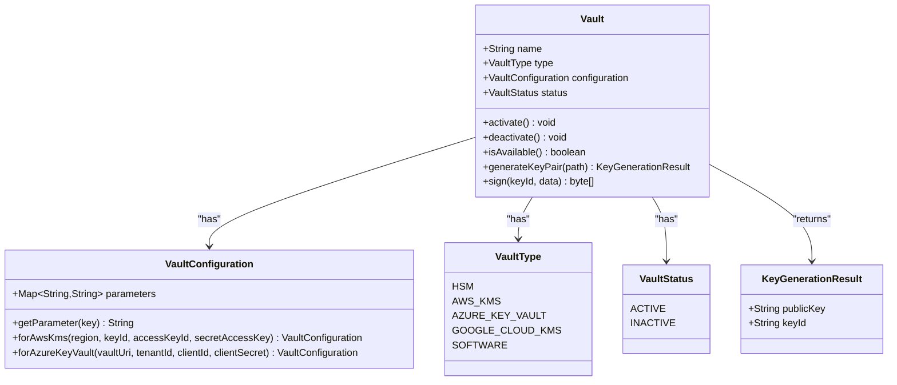

# Configuration & Environment

<cite>
**Referenced Files in This Document**   
- [application.yml](file://src/main/resources/application.yml)
- [compose.yaml](file://compose.yaml)
- [pom.xml](file://pom.xml)
- [VaultConfiguration.java](file://src/main/java/dev/bloco/wallet/hub/domain/model/vault/VaultConfiguration.java)
- [Vault.java](file://src/main/java/dev/bloco/wallet/hub/domain/model/vault/Vault.java)
- [VaultType.java](file://src/main/java/dev/bloco/wallet/hub/domain/model/vault/VaultType.java)
</cite>

## Table of Contents
1. [Configuration & Environment](#configuration--environment)
2. [Application Configuration](#application-configuration)
3. [Database Configuration](#database-configuration)
4. [Kafka Event Streaming](#kafka-event-streaming)
5. [Security & Vault Configuration](#security--vault-configuration)
6. [Docker Compose Setup](#docker-compose-setup)
7. [Environment-Specific Configuration](#environment-specific-configuration)
8. [Externalized Configuration & Secrets Management](#externalized-configuration--secrets-management)
9. [Health Checks & Actuator Endpoints](#health-checks--actuator-endpoints)

## Application Configuration

The application uses Spring Boot's configuration mechanism with `application.yml` as the primary configuration file. The core application settings include:

- **Application Name**: Configured as `wallet-hub` via `spring.application.name`
- **Caching**: Enabled with cache name `wallet-hub` through `spring.cache.cache-names`
- **Development Tools**: Spring DevTools is configured with `spring.devtools.add-properties: true` for enhanced development experience
- **Actuator**: Spring Boot Actuator is included in dependencies for monitoring and management endpoints

The configuration follows Spring Boot conventions where properties can be overridden via environment variables using uppercase format (e.g., `SPRING_APPLICATION_NAME=wallet-hub`). The H2 database is used as the default embedded database for development purposes with file-based persistence.

**Section sources**
- [application.yml](file://src/main/resources/application.yml#L1-L10)
- [pom.xml](file://pom.xml#L35-L68)

## Database Configuration

The application supports multiple database systems through Spring Data with reactive programming models. The default configuration uses H2 as an embedded database, but production environments typically use PostgreSQL, MongoDB, and Redis.

### Default H2 Configuration
The default `application.yml` configures an embedded H2 database with file-based persistence:
- URL: `jdbc:h2:file:./db/wallet;DB_CLOSE_ON_EXIT=FALSE;AUTO_RECONNECT=TRUE`
- Driver: `org.h2.Driver`
- Username: `sa`
- Password: empty

H2 console is enabled at `http://localhost:8080/h2-console` for database inspection during development.

### Production Database Support
The application is configured to work with multiple databases:
- **PostgreSQL**: Used for relational data with JPA/Hibernate and R2DBC for reactive operations
- **MongoDB**: Used for document storage with reactive MongoDB driver
- **Redis**: Used for caching and potentially as a message broker

The `pom.xml` includes dependencies for all database systems:
- `spring-boot-starter-data-jpa` and `spring-boot-starter-data-r2dbc` for PostgreSQL
- `spring-boot-starter-data-mongodb-reactive` for MongoDB
- `spring-boot-starter-data-redis-reactive` for Redis

Environment variables can override the datasource configuration:
- `SPRING_DATASOURCE_URL` for database connection URL
- `SPRING_DATASOURCE_USERNAME` for database username
- `SPRING_DATASOURCE_PASSWORD` for database password

JPA is configured with `ddl-auto: update` to automatically manage schema changes, and SQL logging is enabled for debugging purposes.

**Section sources**
- [application.yml](file://src/main/resources/application.yml#L11-L20)
- [pom.xml](file://pom.xml#L66-L98)

## Kafka Event Streaming

The application uses Spring Cloud Stream with Kafka binder for event-driven architecture. Events are published to Kafka topics through the outbox pattern, ensuring reliable message delivery.

### Stream Bindings Configuration
The `application.yml` defines bindings for various domain events:
- `walletCreatedEventProducer-out-0` → `wallet-created-topic`
- `fundsAddedEventProducer-out-0` → `funds-added-topic`
- `fundsWithdrawnEventProducer-out-0` → `funds-withdrawn-topic`
- `fundsTransferredEventProducer-out-0` → `funds-transferred-topic`

The Kafka broker is configured to connect to `localhost:9092` by default via `spring.cloud.stream.kafka.binder.brokers`.

### Event Processing Architecture
The application implements an outbox pattern for reliable event publishing:
1. Domain events are stored in the database outbox table when transactions are committed
2. A scheduled worker (`OutboxWorker`) periodically processes unsent events
3. Events are sent to Kafka using `StreamBridge` and marked as sent upon successful delivery

The `KafkaEventProducer` component handles the actual event publishing with a fixed rate of 5000ms (5 seconds) between processing cycles, ensuring eventual consistency in event delivery.

**Section sources**
- [application.yml](file://src/main/resources/application.yml#L21-L34)
- [pom.xml](file://pom.xml#L96-L131)
- [OutboxWorker.java](file://src/main/java/dev/bloco/wallet/hub/infra/provider/data/OutboxWorker.java#L80-L93)

## Security & Vault Configuration

The application includes comprehensive security features with support for various vault systems to manage cryptographic keys and secrets.

### Security Dependencies
The security stack includes:
- `spring-boot-starter-security` for authentication and authorization
- `spring-boot-starter-oauth2-client` for OAuth2 integration
- Reactive security support for WebFlux applications

### Vault System
The vault system is designed to support multiple key management systems through the `Vault` domain model:
- **Vault Types**: HSM, AWS KMS, Azure Key Vault, Google Cloud KMS, and SOFTWARE
- **Vault Configuration**: Encapsulated in `VaultConfiguration` class with type-specific factory methods
- **Key Operations**: Key pair generation and digital signing capabilities

The `VaultConfiguration` class uses a parameterized approach to store configuration details for different vault types:
- AWS KMS: region, keyId, accessKeyId, secretAccessKey
- Azure Key Vault: vaultUri, tenantId, clientId, clientSecret

Vaults can be activated and deactivated, with status changes published as domain events (`VaultStatusChangedEvent`). The system ensures that cryptographic operations can only be performed on active vaults.



**Diagram sources**
- [Vault.java](file://src/main/java/dev/bloco/wallet/hub/domain/model/vault/Vault.java#L0-L96)
- [VaultConfiguration.java](file://src/main/java/dev/bloco/wallet/hub/domain/model/vault/VaultConfiguration.java#L0-L40)
- [VaultType.java](file://src/main/java/dev/bloco/wallet/hub/domain/model/vault/VaultType.java#L0-L8)

**Section sources**
- [Vault.java](file://src/main/java/dev/bloco/wallet/hub/domain/model/vault/Vault.java#L0-L96)
- [VaultConfiguration.java](file://src/main/java/dev/bloco/wallet/hub/domain/model/vault/VaultConfiguration.java#L0-L40)

## Docker Compose Setup

The `compose.yaml` file provides a local development environment with all required services.

### Services Configuration
The Docker Compose setup includes:
- **MongoDB**: Latest version with root credentials and database initialization
  - Environment variables set for database name, root username, and password
  - Port 27017 exposed (container only)
- **PostgreSQL**: Latest version with custom user and database
  - POSTGRES_DB=mydatabase
  - POSTGRES_USER=myuser
  - POSTGRES_PASSWORD=secret
  - Port 5432 exposed (container only)
- **Redis**: Latest version for caching
  - Port 6379 exposed (container only)

### Network and Dependencies
The services are defined without explicit network configuration, relying on Docker's default bridge network. No host port mappings are defined, meaning services are accessible only within the Docker network unless explicitly mapped.

To enable host access, port mappings should be added:
```yaml
ports:
  - "27017:27017"
  - "5432:5432"
  - "6379:6379"
```

The services can be started with `docker-compose up -d` and stopped with `docker-compose down`. For development, this setup provides isolated database instances that can be easily reset by removing containers and volumes.

**Section sources**
- [compose.yaml](file://compose.yaml#L0-L20)

## Environment-Specific Configuration

The application supports environment-specific configuration through Spring Profiles, allowing different settings for development, staging, and production environments.

### Profile-Based Configuration
While the base `application.yml` provides default settings, environment-specific overrides can be implemented through:
- `application-dev.yml` for development environment
- `application-staging.yml` for staging environment
- `application-prod.yml` for production environment

Configuration properties can be overridden through environment variables following Spring Boot's naming convention (e.g., `SPRING_DATASOURCE_URL` for `spring.datasource.url`).

### Deployment Stage Examples
**Development Environment:**
- H2 database for rapid development
- In-memory configurations
- Detailed logging enabled
- Security disabled or using test credentials

**Staging Environment:**
- PostgreSQL database with staging data
- Kafka cluster with staging topics
- Redis cache with staging configuration
- Security enabled with staging certificates

**Production Environment:**
- Production-grade PostgreSQL cluster
- MongoDB replica set
- Redis cluster for high availability
- Kafka cluster with proper partitioning and replication
- Vault integration for secret management

Environment variables should be used to override sensitive configuration in production:
```bash
SPRING_DATASOURCE_URL=jdbc:postgresql://prod-db:5432/walletdb
SPRING_DATASOURCE_USERNAME=prod_user
SPRING_DATASOURCE_PASSWORD=${DB_PASSWORD}
SPRING_CLOUD_STREAM_KAFKA_BINDER_BROKERS=kafka1:9092,kafka2:9092
```

**Section sources**
- [application.yml](file://src/main/resources/application.yml)
- [README.md](file://README.md#L58-L90)

## Externalized Configuration & Secrets Management

The application supports externalized configuration and secret management for secure deployment in various environments.

### Spring Cloud Vault Integration
The application includes Spring Cloud Vault dependencies for secure secret management:
- `spring-cloud-starter-vault-config` for Vault configuration
- `spring-vault-core` for Vault operations

This allows the application to retrieve configuration properties and secrets from HashiCorp Vault, providing:
- Dynamic secret generation
- Lease management
- Audit logging
- High availability

Configuration in `pom.xml` shows explicit version management for Vault components:
```xml
<spring-cloud-vault.version>4.3.0</spring-cloud-vault.version>
<spring-vault.version>3.2.0</spring-vault.version>
```

### Configuration Best Practices
The application follows Spring Boot externalized configuration best practices:
- Default values in `application.yml`
- Environment-specific overrides through profiles
- Secure property management through environment variables
- Support for cloud platform configuration (Kubernetes, Cloud Foundry)

The `spring-boot-configuration-processor` dependency generates metadata for IDE support, providing auto-completion and documentation for custom configuration properties.

External configuration sources are processed in the following order (highest precedence first):
1. Command line arguments
2. Java System properties
3. OS environment variables
4. Application properties outside the jar
5. Application properties inside the jar
6. Default properties

**Section sources**
- [pom.xml](file://pom.xml#L128-L161)
- [application.yml](file://src/main/resources/application.yml)

## Health Checks & Actuator Endpoints

The application includes comprehensive health monitoring through Spring Boot Actuator.

### Actuator Configuration
The `pom.xml` includes `spring-boot-starter-actuator` dependency, providing production-ready features:
- Health checks
- Metrics collection
- Environment information
- Thread dumps
- Heap dumps
- Log file access

Key endpoints include:
- `/actuator/health`: Application health status
- `/actuator/info`: Application information
- `/actuator/metrics`: Application metrics
- `/actuator/env`: Environment properties
- `/actuator/beans`: Spring beans in the application context

### Health Indicators
The application automatically includes health indicators for:
- Database connectivity (PostgreSQL, MongoDB, Redis)
- Disk space
- Kafka connectivity
- Custom vault status

Health checks can be customized for production environments to provide detailed system status without exposing sensitive information. The actuator endpoints can be secured with Spring Security to restrict access to authorized personnel.

**Section sources**
- [pom.xml](file://pom.xml#L35-L68)