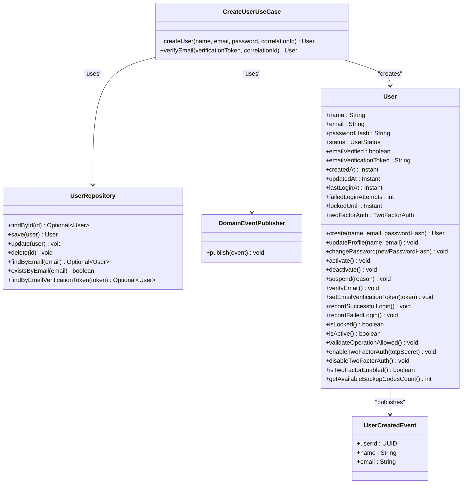
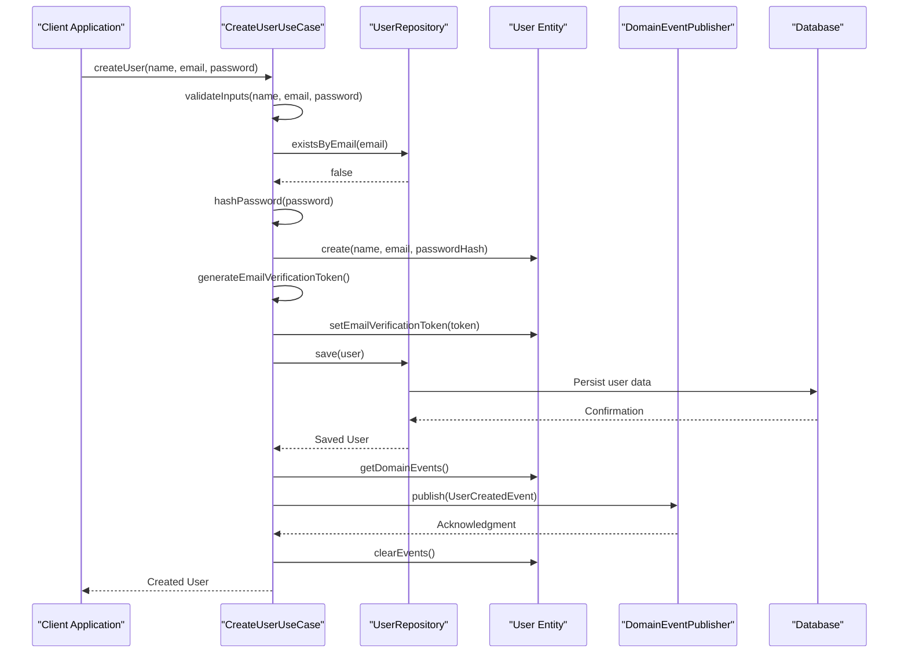
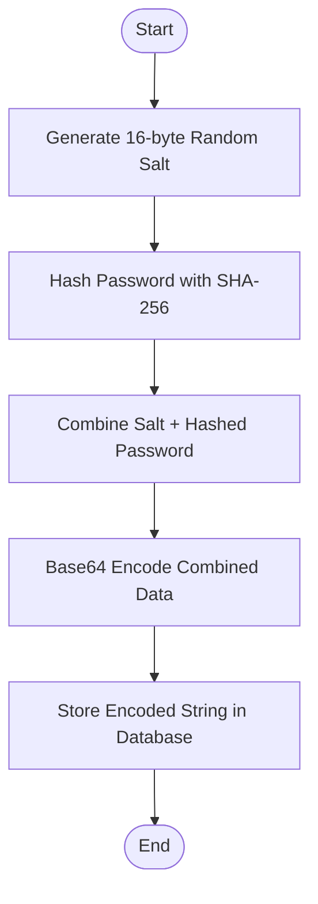
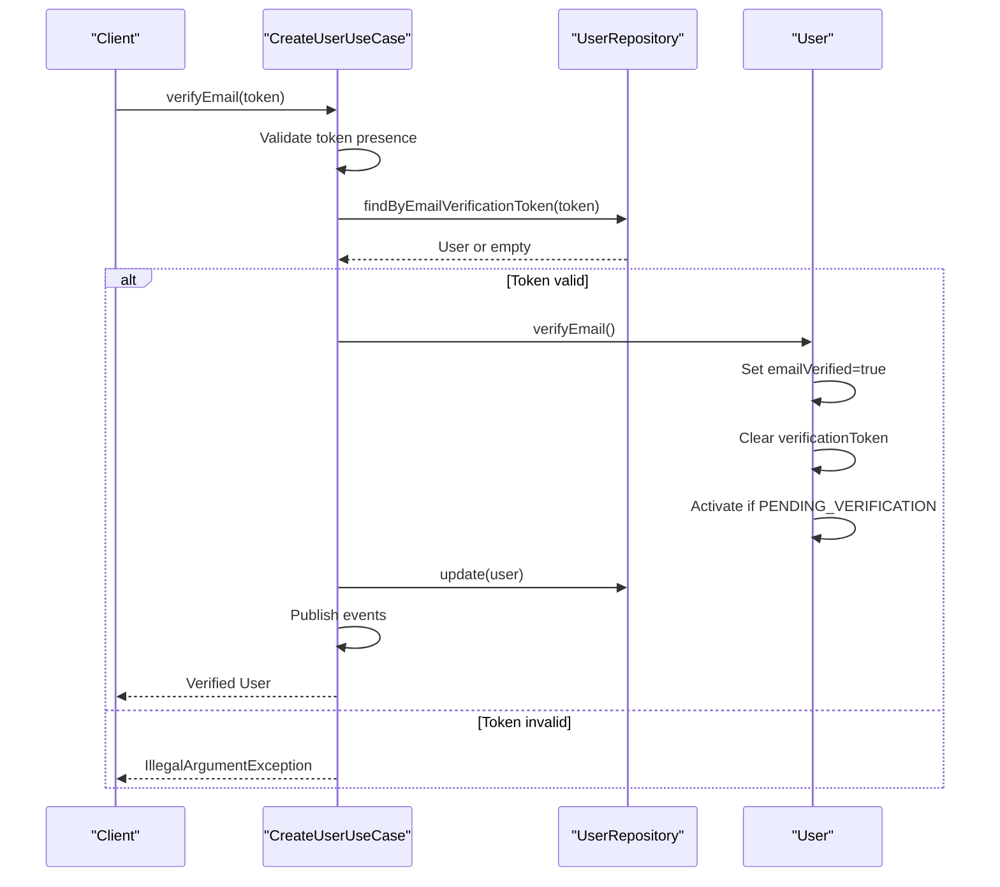
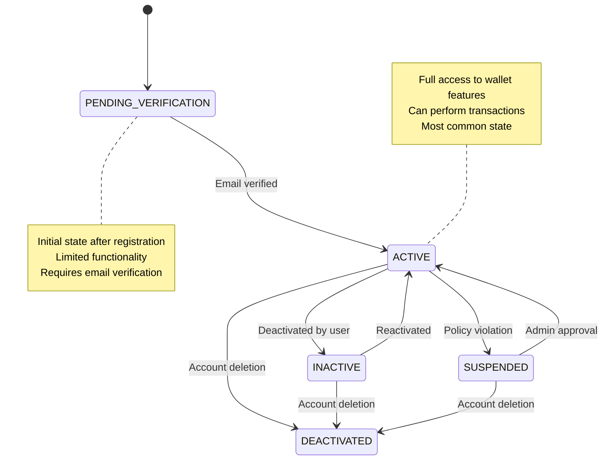
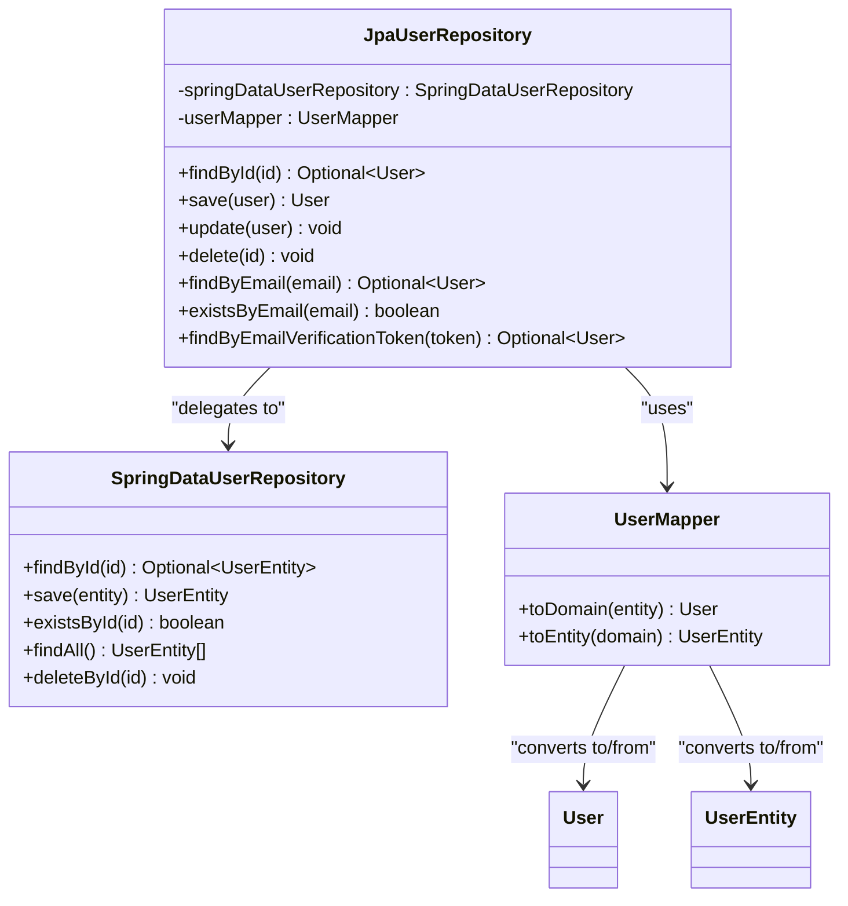
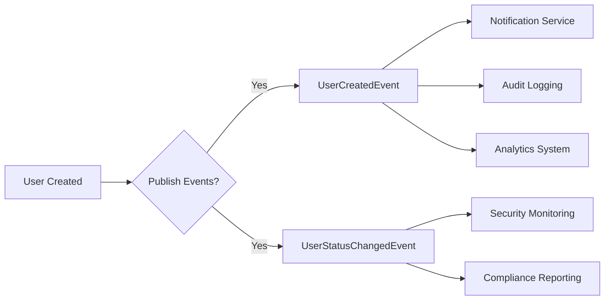

# Create User

<cite>
**Referenced Files in This Document**   
- [CreateUserUseCase.java](file://src/main/java/dev/bloco/wallet/hub/usecase/CreateUserUseCase.java)
- [User.java](file://src/main/java/dev/bloco/wallet/hub/domain/model/user/User.java)
- [UserRepository.java](file://src/main/java/dev/bloco/wallet/hub/domain/gateway/UserRepository.java)
- [DomainEventPublisher.java](file://src/main/java/dev/bloco/wallet/hub/domain/gateway/DomainEventPublisher.java)
- [UserCreatedEvent.java](file://src/main/java/dev/bloco/wallet/hub/domain/event/user/UserCreatedEvent.java)
- [JpaUserRepository.java](file://src/main/java/dev/bloco/wallet/hub/infra/provider/data/repository/JpaUserRepository.java)
</cite>

## Table of Contents
1. [Introduction](#introduction)
2. [Core Components](#core-components)
3. [User Creation Workflow](#user-creation-workflow)
4. [Security Implementation](#security-implementation)
5. [Email Verification Process](#email-verification-process)
6. [State Management](#state-management)
7. [Error Handling](#error-handling)
8. [Integration Points](#integration-points)
9. [Conclusion](#conclusion)

## Introduction

The CreateUserUseCase is a critical component in the wallet system responsible for handling user registration and account creation. This documentation provides comprehensive details about its implementation, security measures, workflow, and integration points within the system architecture.

The use case follows domain-driven design principles, ensuring separation of concerns between business logic, data persistence, and event publishing. It implements robust security measures including password hashing with salt, email verification, and proper user status management to ensure secure account creation.

**Section sources**
- [CreateUserUseCase.java](file://src/main/java/dev/bloco/wallet/hub/usecase/CreateUserUseCase.java#L1-L20)

## Core Components

The CreateUserUseCase relies on several key components that work together to create and manage user accounts:

- **User Entity**: The domain model representing a user with all its attributes and behaviors
- **UserRepository**: Interface for persisting and retrieving user data
- **DomainEventPublisher**: Mechanism for publishing domain events when significant actions occur
- **UserCreatedEvent**: Domain event published when a new user is successfully created

These components follow the dependency inversion principle, with the use case depending on abstractions rather than concrete implementations.



**Diagram sources**
- [CreateUserUseCase.java](file://src/main/java/dev/bloco/wallet/hub/usecase/CreateUserUseCase.java#L1-L20)
- [UserRepository.java](file://src/main/java/dev/bloco/wallet/hub/domain/gateway/UserRepository.java#L16-L38)
- [DomainEventPublisher.java](file://src/main/java/dev/bloco/wallet/hub/domain/gateway/DomainEventPublisher.java#L11-L13)
- [User.java](file://src/main/java/dev/bloco/wallet/hub/domain/model/user/User.java#L1-L236)
- [UserCreatedEvent.java](file://src/main/java/dev/bloco/wallet/hub/domain/event/user/UserCreatedEvent.java#L11-L24)

**Section sources**
- [CreateUserUseCase.java](file://src/main/java/dev/bloco/wallet/hub/usecase/CreateUserUseCase.java#L1-L148)
- [User.java](file://src/main/java/dev/bloco/wallet/hub/domain/model/user/User.java#L1-L236)
- [UserRepository.java](file://src/main/java/dev/bloco/wallet/hub/domain/gateway/UserRepository.java#L16-L38)

## User Creation Workflow

The user creation process follows a well-defined sequence of steps to ensure data integrity and security:

1. Input validation
2. Email uniqueness check
3. Password hashing with salt
4. User entity creation
5. Email verification token generation
6. Persistence to database
7. Domain event publishing



**Diagram sources**
- [CreateUserUseCase.java](file://src/main/java/dev/bloco/wallet/hub/usecase/CreateUserUseCase.java#L25-L85)
- [User.java](file://src/main/java/dev/bloco/wallet/hub/domain/model/user/User.java#L42-L53)
- [UserRepository.java](file://src/main/java/dev/bloco/wallet/hub/domain/gateway/UserRepository.java#L16-L38)

**Section sources**
- [CreateUserUseCase.java](file://src/main/java/dev/bloco/wallet/hub/usecase/CreateUserUseCase.java#L25-L85)
- [User.java](file://src/main/java/dev/bloco/wallet/hub/domain/model/user/User.java#L42-L53)

## Security Implementation

The CreateUserUseCase implements multiple layers of security to protect user data and prevent common vulnerabilities:

### Password Hashing with Salt

The system uses SHA-256 hashing algorithm combined with random salt generation to securely store passwords. Each password is hashed with a unique 16-byte salt, making rainbow table attacks ineffective.



**Diagram sources**
- [CreateUserUseCase.java](file://src/main/java/dev/bloco/wallet/hub/usecase/CreateUserUseCase.java#L115-L135)

### Input Validation

The system enforces strict input validation rules:

- Name: Must be provided and non-empty
- Email: Must be valid format and unique
- Password: Minimum 8 characters with complexity requirements (uppercase, lowercase, digit, special character)

### Secure Token Generation

Email verification tokens are generated using cryptographically secure random number generators with 32 bytes of entropy, encoded in URL-safe Base64 format without padding to prevent tampering.

**Section sources**
- [CreateUserUseCase.java](file://src/main/java/dev/bloco/wallet/hub/usecase/CreateUserUseCase.java#L90-L148)

## Email Verification Process

The email verification system ensures that users control the email address they register with, preventing unauthorized account creation.

### Token Generation

When a user is created, a unique verification token is generated and associated with their account:

```java
private String generateEmailVerificationToken() {
    SecureRandom random = new SecureRandom();
    byte[] token = new byte[32];
    random.nextBytes(token);
    return Base64.getUrlEncoder().withoutPadding().encodeToString(token);
}
```

### Verification Flow



**Diagram sources**
- [CreateUserUseCase.java](file://src/main/java/dev/bloco/wallet/hub/usecase/CreateUserUseCase.java#L87-L113)
- [User.java](file://src/main/java/dev/bloco/wallet/hub/domain/model/user/User.java#L134-L141)

**Section sources**
- [CreateUserUseCase.java](file://src/main/java/dev/bloco/wallet/hub/usecase/CreateUserUseCase.java#L87-L113)
- [User.java](file://src/main/java/dev/bloco/wallet/hub/domain/model/user/User.java#L134-L149)

## State Management

The system implements a comprehensive state management model for user accounts through the UserStatus enum and related methods.

### User Status Lifecycle



**Diagram sources**
- [User.java](file://src/main/java/dev/bloco/wallet/hub/domain/model/user/User.java#L7-L36)
- [User.java](file://src/main/java/dev/bloco/wallet/hub/domain/model/user/User.java#L98-L105)

The user starts in `PENDING_VERIFICATION` status upon creation and transitions to `ACTIVE` status only after successful email verification. This prevents unverified users from accessing sensitive wallet functions.

**Section sources**
- [User.java](file://src/main/java/dev/bloco/wallet/hub/domain/model/user/User.java#L7-L36)

## Error Handling

The CreateUserUseCase implements comprehensive error handling to provide meaningful feedback while maintaining security:

### Exception Types

| Exception Type | Trigger Condition | Security Consideration |
|----------------|-------------------|------------------------|
| IllegalArgumentException | Invalid input format | Generic messages to prevent information leakage |
| IllegalStateException | Email already exists | Uses same message for non-existent emails to prevent enumeration |
| RuntimeException | Cryptographic failures | Wrapped with context but original cause not exposed |

### Validation Strategy

The system employs fail-fast validation, checking inputs immediately upon entry to the use case. This prevents unnecessary processing when validation will ultimately fail.

**Section sources**
- [CreateUserUseCase.java](file://src/main/java/dev/bloco/wallet/hub/usecase/CreateUserUseCase.java#L90-L113)

## Integration Points

The CreateUserUseCase integrates with various system components through well-defined interfaces.

### Repository Implementation

The JpaUserRepository provides the concrete implementation of the UserRepository interface, bridging the domain layer with the persistence layer:



**Diagram sources**
- [JpaUserRepository.java](file://src/main/java/dev/bloco/wallet/hub/infra/provider/data/repository/JpaUserRepository.java#L1-L132)

### Event Publishing

The system uses domain events to decouple business logic from side effects. When a user is created, a UserCreatedEvent is published:



This event-driven architecture allows multiple systems to react to user creation without tight coupling.

**Section sources**
- [JpaUserRepository.java](file://src/main/java/dev/bloco/wallet/hub/infra/provider/data/repository/JpaUserRepository.java#L1-L132)
- [UserCreatedEvent.java](file://src/main/java/dev/bloco/wallet/hub/domain/event/user/UserCreatedEvent.java#L11-L24)

## Conclusion

The CreateUserUseCase provides a robust, secure, and extensible solution for user registration in the wallet system. By following domain-driven design principles, it maintains clear separation of concerns while implementing comprehensive security measures.

Key strengths include:
- Secure password hashing with salt
- Email verification workflow
- Comprehensive state management
- Event-driven architecture
- Proper error handling
- Extensible design

The implementation balances security requirements with usability, providing a solid foundation for user management in the wallet ecosystem. Future enhancements could include additional verification methods, progressive profiling, and improved error recovery mechanisms.