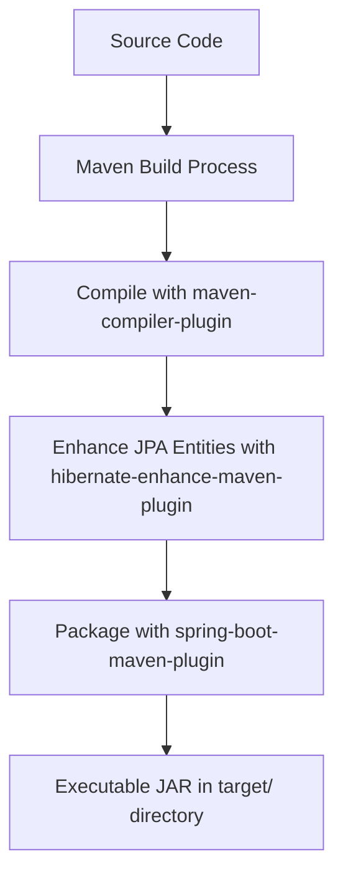
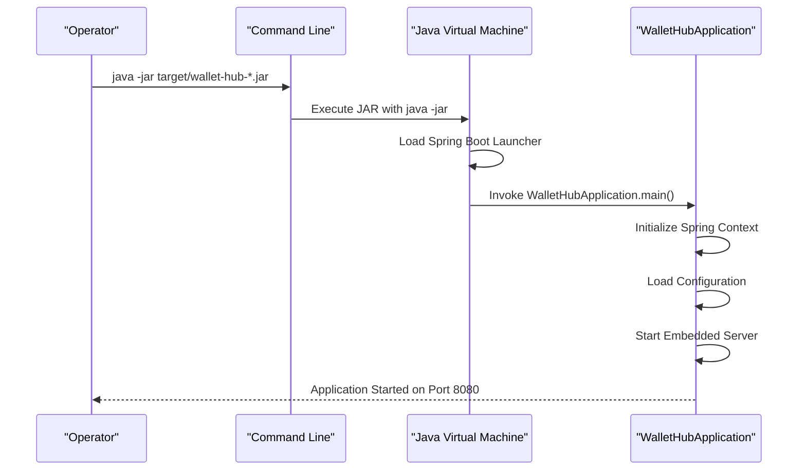
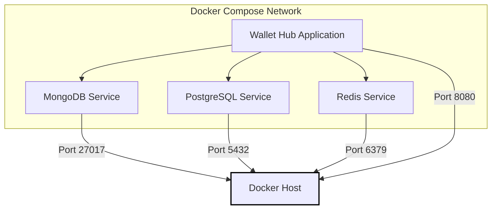
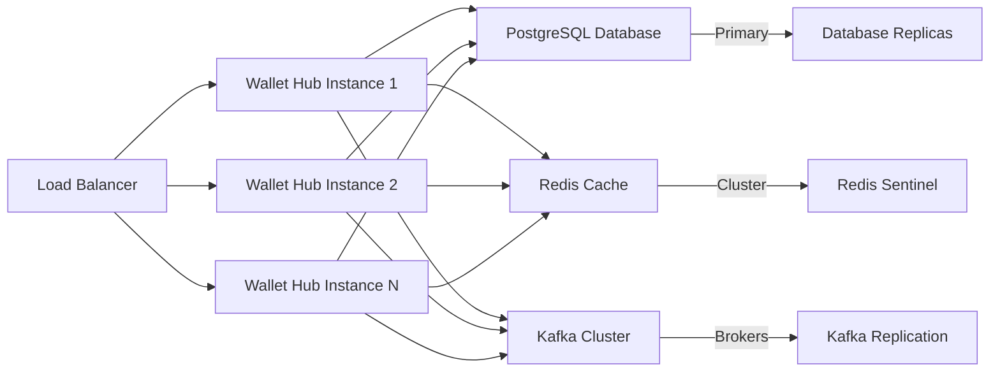

# Deployment Guide

<cite>
**Referenced Files in This Document**   
- [pom.xml](file://pom.xml)
- [compose.yaml](file://compose.yaml)
- [mise.toml](file://mise.toml)
- [application.yml](file://src/main/resources/application.yml)
- [WalletHubApplication.java](file://src/main/java/dev/bloco/wallet/hub/WalletHubApplication.java)
- [DinamoLibraryLoader.java](file://src/main/java/dev/bloco/wallet/hub/config/DinamoLibraryLoader.java)
- [ValidateAddressUseCase.java](file://src/main/java/dev/bloco/wallet/hub/usecase/ValidateAddressUseCase.java) - *Updated in recent commit*
- [ImportAddressUseCase.java](file://src/main/java/dev/bloco/wallet/hub/usecase/ImportAddressUseCase.java) - *Updated in recent commit*
- [JpaUserRepository.java](file://src/main/java/dev/bloco/wallet/hub/infra/provider/data/repository/JpaUserRepository.java) - *Updated in recent commit*
- [UseCaseConfig.java](file://src/main/java/dev/bloco/wallet/hub/config/UseCaseConfig.java) - *Updated to include ValidateAddressUseCase bean*
</cite>

## Table of Contents
1. [Introduction](#introduction)
2. [Build Process with Maven](#build-process-with-maven)
3. [JVM-Based Deployment](#jvm-based-deployment)
4. [Native Image Deployment with GraalVM](#native-image-deployment-with-graalvm)
5. [Docker Containerization](#docker-containerization)
6. [Production Configuration](#production-configuration)
7. [Scaling and Orchestration](#scaling-and-orchestration)
8. [Health Checks and Zero-Downtime Deployment](#health-checks-and-zero-downtime-deployment)
9. [Troubleshooting Common Issues](#troubleshooting-common-issues)
10. [Conclusion](#conclusion)

## Introduction
This deployment guide provides comprehensive instructions for deploying the bloco-wallet-java application using multiple strategies: JVM execution, native image compilation via GraalVM, and Docker containerization. The application is a Spring Boot-based event-driven wallet service that leverages Spring Cloud Stream, Kafka, and reactive persistence technologies. It supports advanced deployment scenarios including fast startup times through native compilation and orchestrated service deployment via Docker Compose.

The guide covers building the application with Maven, generating native executables for improved performance, creating container images, configuring production settings, and implementing robust deployment strategies. Special attention is given to the integration of platform-specific native libraries and the configuration of monitoring and security features.

**Section sources**
- [pom.xml](file://pom.xml)
- [README.md](file://README.md)

## Build Process with Maven
The bloco-wallet-java application uses Apache Maven as its build tool, with the Maven Wrapper (mvnw) included for consistent builds across environments. To build the application, execute the following command:

```bash
./mvnw -DskipTests package
```

This command compiles the source code, processes resources, and packages the application into a JAR file located in the `target/` directory. The build process includes several key plugins configured in the `pom.xml`:
- **maven-compiler-plugin**: Configures annotation processing for Lombok and Spring Boot configuration metadata
- **hibernate-enhance-maven-plugin**: Enables lazy loading, dirty tracking, and association management for JPA entities
- **spring-boot-maven-plugin**: Packages the application as an executable JAR with embedded Tomcat

The application requires Java 25 for compilation, as specified in the `<java.version>` property. Developers can use GraalVM Community Edition 25, which is specified in the `mise.toml` file for toolchain management.



**Diagram sources**
- [pom.xml](file://pom.xml#L360-L422)

**Section sources**
- [pom.xml](file://pom.xml#L360-L422)
- [mvnw](file://mvnw)

## JVM-Based Deployment
The primary deployment method for bloco-wallet-java is JVM-based execution using the `java -jar` command. After building the application, deploy it with:

```bash
java -jar target/wallet-hub-0.0.1-SNAPSHOT.jar
```

By default, the application runs on port 8080 and uses an H2 file database stored at `./db/wallet`. The H2 console is enabled and accessible at `http://localhost:8080/h2-console`.

For production deployments, configure the application using environment variables that override the defaults in `application.yml`. Key configuration options include:
- Database connectivity (PostgreSQL, MongoDB, Redis)
- Kafka broker addresses
- Security settings
- Logging levels

The application includes Spring Boot Actuator endpoints for monitoring and management, accessible under the `/actuator` path. These endpoints provide health checks, metrics, and configuration information.



**Diagram sources**
- [WalletHubApplication.java](file://src/main/java/dev/bloco/wallet/hub/WalletHubApplication.java#L23-L35)
- [application.yml](file://src/main/resources/application.yml#L1-L35)

**Section sources**
- [WalletHubApplication.java](file://src/main/java/dev/bloco/wallet/hub/WalletHubApplication.java#L23-L35)
- [application.yml](file://src/main/resources/application.yml#L1-L35)

## Native Image Deployment with GraalVM
For improved startup time and reduced memory footprint, bloco-wallet-java can be compiled to a native executable using GraalVM. The `pom.xml` includes the `native-maven-plugin` to facilitate this process.

First, ensure GraalVM Community Edition 25 is installed and configured as specified in `mise.toml`. Then, build the native executable:

```bash
./mvnw native:compile
```

This command generates a native binary in the `target/` directory. The native image includes all dependencies and the minimal required parts of the JDK, resulting in faster startup times (typically under 100ms) and lower memory consumption compared to JVM execution.

The application uses AspectJ for loading platform-specific native libraries, which requires special configuration for native image compilation. The `DinamoLibraryLoader` class loads HSM libraries for Windows and Linux from the `libs/` directory. When creating the native image, ensure these libraries are available in the expected locations.

For containerized native deployments, use the Spring Boot build-image goal with the native profile:

```bash
./mvnw spring-boot:build-image -Pnative
```

Note that native image generation requires substantial memory (at least 8GB recommended) and may take several minutes to complete.

```mermaid
classDiagram
class DinamoLibraryLoader {
    +static Map<String, Consumer<String>> OS_LIBRARY_LOADER
    +loadLibrariesBasedOnOS() void
    +loadWindowsLibraries(osName) void
    +loadLinuxLibraries(osName) void
    +loadLibrary(path) void
}
class WalletHubApplication {
    +main(args) void
}
DinamoLibraryLoader <|-- "aspect" : DinamoLibraryLoader
DinamoLibraryLoader --> WalletHubApplication : "loads libraries before"
note right of DinamoLibraryLoader
  <<before>>
  "execution(* WalletHubApplication.main(..))"
end note
```

**Diagram sources**
- [DinamoLibraryLoader.java](file://src/main/java/dev/bloco/wallet/hub/config/DinamoLibraryLoader.java#L31-L118)
- [pom.xml](file://pom.xml#L390-L393)

**Section sources**
- [DinamoLibraryLoader.java](file://src/main/java/dev/bloco/wallet/hub/config/DinamoLibraryLoader.java#L31-L118)
- [mise.toml](file://mise.toml)
- [pom.xml](file://pom.xml#L390-L393)

## Docker Containerization
The application supports containerization through the Spring Boot build-image plugin, which creates OCI-compliant container images using Paketo buildpacks. To build a JVM-based container image:

```bash
./mvnw spring-boot:build-image
```

This generates a container image named `dev.bloco.wallet/wallet-hub:0.0.1-SNAPSHOT` using the Paketo Ubuntu Noble run base image as specified in the `pom.xml` configuration.

For native image containerization, use:

```bash
./mvnw spring-boot:build-image -Pnative
```

The repository includes a `compose.yaml` file that defines dependent services: MongoDB, PostgreSQL, and Redis. To start these services:

```bash
docker compose up -d
```

Note that the current `compose.yaml` does not expose host ports by default. For external access, modify the file to include explicit port mappings (e.g., `"5432:5432"` for PostgreSQL).

When deploying in containerized environments, configure the application using environment variables that override the defaults in `application.yml`. The containerized application can connect to the services defined in `compose.yaml` using their service names as hostnames.



**Diagram sources**
- [compose.yaml](file://compose.yaml#L1-L22)
- [pom.xml](file://pom.xml#L408-L416)

**Section sources**
- [compose.yaml](file://compose.yaml#L1-L22)
- [pom.xml](file://pom.xml#L408-L416)

## Production Configuration
For production deployments, configure the application with appropriate settings for performance, monitoring, and security.

### JVM Tuning
When running on the JVM, apply appropriate heap sizing and garbage collection settings:

```bash
java -Xms512m -Xmx2g -XX:+UseG1GC -jar wallet-hub.jar
```

For containerized environments, enable container-aware memory settings:

```bash
java -XX:+UseContainerSupport -XX:MaxRAMPercentage=75.0 -jar wallet-hub.jar
```

### Logging Configuration
Configure logging levels through environment variables:

```bash
LOGGING_LEVEL_ROOT=INFO
LOGGING_LEVEL_DEV.BLOCO.WALLET=DEBUG
LOGGING_LEVEL_ORG.SPRINGFRAMEWORK=INFO
```

### Monitoring with Micrometer
The application includes Micrometer integration for observability. Prometheus metrics are exposed at `/actuator/prometheus`. Configure the registry in `application.yml`:

```yaml
management:
  metrics:
    export:
      prometheus:
        enabled: true
  endpoints:
    web:
      exposure:
        include: health,info,metrics,prometheus
```

For distributed tracing, the application uses Brave as the tracing bridge. Configure OTLP export for trace collection:

```yaml
management:
  tracing:
    sampling:
      probability: 1.0
  zipkin:
    tracing:
      endpoint: http://zipkin:9411/api/v2/spans
```

### Security Hardening
Enable Spring Security and OAuth2 client features for authentication and authorization. Configure secure headers and CORS settings in production:

```yaml
server:
  servlet:
    session:
      cookie:
        http-only: true
        secure: true
        same-site: strict
```

**Section sources**
- [application.yml](file://src/main/resources/application.yml#L1-L35)
- [pom.xml](file://pom.xml#L159-L165)

## Scaling and Orchestration
The bloco-wallet-java application is designed for horizontal scaling in container orchestration platforms like Kubernetes. Multiple instances can run simultaneously, sharing state through external services (PostgreSQL, Redis, MongoDB).

Configure the application for scaling by externalizing configuration and ensuring stateless operation where possible. Use the outbox pattern implemented in `OutboxWorker` to ensure reliable event publishing across instances.

For database scaling, configure connection pooling and consider read/write splitting for PostgreSQL. The application's reactive architecture supports high concurrency with minimal thread overhead.

When scaling, ensure Kafka consumers are properly configured for consumer group coordination to avoid duplicate message processing.



**Section sources**
- [OutboxWorker.java](file://src/main/java/dev/bloco/wallet/hub/infra/provider/data/OutboxWorker.java#L80-L93)
- [KafkaEventProducer.java](file://src/main/java/dev/bloco/wallet/hub/infra/adapter/event/producer/KafkaEventProducer.java#L139-L151)

## Health Checks and Zero-Downtime Deployment
The application provides comprehensive health checks through Spring Boot Actuator. The `/actuator/health` endpoint reports the status of the application and its dependencies.

Configure liveness and readiness probes for container orchestration:

```yaml
livenessProbe:
  httpGet:
    path: /actuator/health/liveness
    port: 8080
  initialDelaySeconds: 60
  periodSeconds: 30

readinessProbe:
  httpGet:
    path: /actuator/health/readiness
    port: 8080
  initialDelaySeconds: 30
  periodSeconds: 10
```

For zero-downtime deployments, use a blue-green or rolling update strategy. When using rolling updates, ensure that new instances are fully ready before terminating old ones.

The application's event-driven architecture supports graceful shutdown. During shutdown, the application:
1. Stops accepting new requests (readiness probe fails)
2. Completes processing of current requests
3. Drains the outbox queue of pending events
4. Shuts down gracefully

Configure the shutdown timeout appropriately:

```yaml
server:
  shutdown: graceful
management:
  endpoint:
    shutdown:
      enabled: false
```

**Section sources**
- [application.yml](file://src/main/resources/application.yml#L1-L35)

## Troubleshooting Common Issues
### Port Conflicts
If port 8080 is already in use, change the server port:

```bash
SERVER_PORT=8081
```

Or specify directly:
```bash
java -jar wallet-hub.jar --server.port=8081
```

### Missing Dependencies
Ensure all required services are available. If using `compose.yaml`, start dependent services:

```bash
docker compose up -d
```

Verify connectivity to PostgreSQL, MongoDB, and Redis from the application container.

### Native Image Compatibility
When building native images, ensure GraalVM version compatibility. The application requires GraalVM Community Edition 25 as specified in `mise.toml`.

If native library loading fails, verify that the HSM libraries exist in the expected locations:
- Windows: `libs/windows/tacndlib.dll`, `libs/windows/tacndjavalib.dll`
- Linux: `libs/linux/libtacndlib.so`, `libs/linux/libtacndjavalib.so`

### Database Connection Issues
Verify database credentials and connection URLs. Common environment variables:

```bash
SPRING_DATASOURCE_URL=jdbc:postgresql://localhost:5432/mydatabase
SPRING_DATASOURCE_USERNAME=myuser
SPRING_DATASOURCE_PASSWORD=secret
```

For H2 database issues, ensure the directory `./db/` is writable.

**Section sources**
- [DinamoLibraryLoader.java](file://src/main/java/dev/bloco/wallet/hub/config/DinamoLibraryLoader.java#L31-L118)
- [application.yml](file://src/main/resources/application.yml#L1-L35)
- [compose.yaml](file://compose.yaml#L1-L22)

## Conclusion
The bloco-wallet-java application offers multiple deployment options to suit different operational requirements. The JVM-based deployment provides maximum compatibility and ease of debugging, while the native image compilation delivers superior performance characteristics for latency-sensitive environments. Docker containerization enables consistent deployment across environments, and the included `compose.yaml` facilitates local development with dependent services.

Production deployments should leverage the comprehensive configuration options for JVM tuning, monitoring, and security hardening. The application's reactive architecture and event-driven design support horizontal scaling and resilient operation in distributed environments.

By following this deployment guide, operators can successfully deploy and manage the bloco-wallet-java application in various environments, from development to production.