# Domain Model & Data Structures

<cite>
**Referenced Files in This Document**   
- [Wallet.java](file://src/main/java/dev/bloco/wallet/hub/domain/model/Wallet.java)
- [Transaction.java](file://src/main/java/dev/bloco/wallet/hub/domain/model/transaction/Transaction.java)
- [User.java](file://src/main/java/dev/bloco/wallet/hub/domain/model/user/User.java)
- [Token.java](file://src/main/java/dev/bloco/wallet/hub/domain/model/token/Token.java)
- [Vault.java](file://src/main/java/dev/bloco/wallet/hub/domain/model/vault/Vault.java)
- [Entity.java](file://src/main/java/dev/bloco/wallet/hub/domain/model/common/Entity.java)
- [AggregateRoot.java](file://src/main/java/dev/bloco/wallet/hub/domain/model/common/AggregateRoot.java)
- [TransactionHash.java](file://src/main/java/dev/bloco/wallet/hub/domain/model/transaction/TransactionHash.java)
- [PublicKey.java](file://src/main/java/dev/bloco/wallet/hub/domain/model/address/PublicKey.java)
- [Address.java](file://src/main/java/dev/bloco/wallet/hub/domain/model/address/Address.java)
- [TransactionStatus.java](file://src/main/java/dev/bloco/wallet/hub/domain/model/transaction/TransactionStatus.java)
- [WalletStatus.java](file://src/main/java/dev/bloco/wallet/hub/domain/model/wallet/WalletStatus.java)
- [VaultStatus.java](file://src/main/java/dev/bloco/wallet/hub/domain/model/vault/VaultStatus.java)
- [AddressStatus.java](file://src/main/java/dev/bloco/wallet/hub/domain/model/address/AddressStatus.java)
</cite>

## Table of Contents
1. [Introduction](#introduction)
2. [Core Domain Entities](#core-domain-entities)
3. [Base Classes and Inheritance](#base-classes-and-inheritance)
4. [Value Objects](#value-objects)
5. [Status Enums and Lifecycle Management](#status-enums-and-lifecycle-management)
6. [Entity Relationships and Aggregations](#entity-relationships-and-aggregations)
7. [Persistence and Infrastructure Integration](#persistence-and-infrastructure-integration)
8. [Validation and Business Rules](#validation-and-business-rules)
9. [Encapsulation and Immutability Patterns](#encapsulation-and-immutability-patterns)
10. [Sample JSON Representations](#sample-json-representations)

## Introduction

The bloco-wallet-java application implements a domain-driven design (DDD) architecture for managing digital wallets, transactions, and related blockchain entities. This document details the core domain model, focusing on the primary entities—Wallet, Transaction, User, Token, and Vault—along with their relationships, business rules, and design patterns. The domain model emphasizes encapsulation, immutability where appropriate, and clear separation from infrastructure concerns. Entities extend base classes (Entity and AggregateRoot) to provide common functionality, while value objects like TransactionHash and PublicKey ensure data integrity. Status enums govern lifecycle transitions, and domain events capture state changes for eventual consistency.

**Section sources**
- [Wallet.java](file://src/main/java/dev/bloco/wallet/hub/domain/model/Wallet.java#L1-L121)
- [Transaction.java](file://src/main/java/dev/bloco/wallet/hub/domain/model/transaction/Transaction.java#L1-L210)
- [User.java](file://src/main/java/dev/bloco/wallet/hub/domain/model/user/User.java#L1-L32)

## Core Domain Entities

### Wallet
The Wallet entity represents a user's digital wallet, serving as an aggregate root that manages funds and associated addresses. It contains fields for `name`, `description`, `balance`, and a set of `addressIds` that reference Address entities. The Wallet is created with a zero balance and can be updated via `updateInfo()`. Funds can be added or withdrawn using `addFunds()` and `withdrawFunds()`, which include validation to prevent negative amounts or overdrafts. The Wallet also tracks creation and update timestamps.

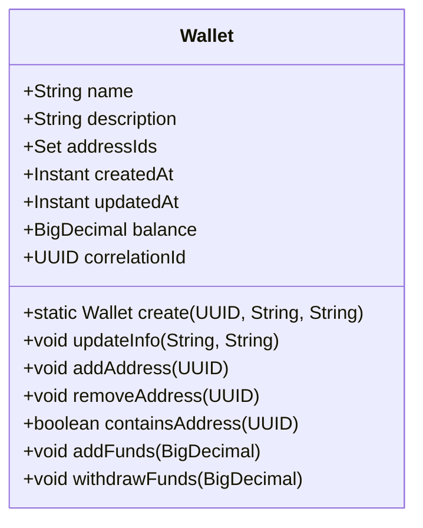

**Diagram sources**
- [Wallet.java](file://src/main/java/dev/bloco/wallet/hub/domain/model/Wallet.java#L23-L121)

**Section sources**
- [Wallet.java](file://src/main/java/dev/bloco/wallet/hub/domain/model/Wallet.java#L23-L121)

### Transaction
The Transaction entity represents a blockchain transaction, capturing details such as the sender (`fromAddress`), recipient (`toAddress`), value, gas information, and status. It is an aggregate root with a lifecycle that begins in a PENDING state and transitions to CONFIRMED or FAILED. The `confirm()` method updates the transaction with block details and changes its status, while `fail()` marks it as failed with a reason. The `getHash()` method returns the transaction hash as a string, delegating to the TransactionHash value object.

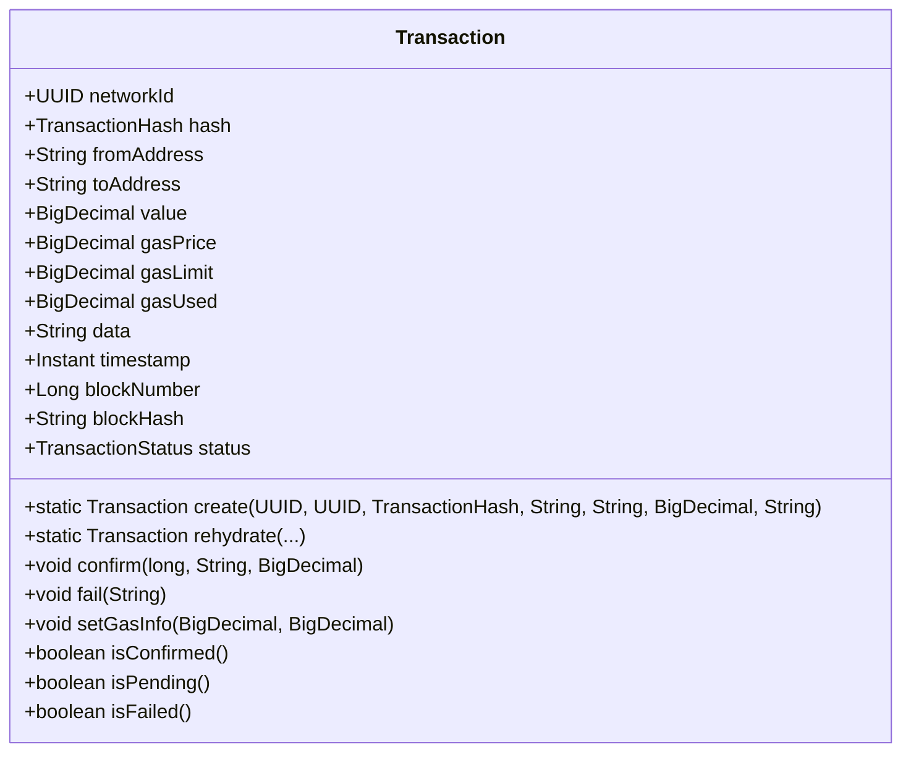

**Diagram sources**
- [Transaction.java](file://src/main/java/dev/bloco/wallet/hub/domain/model/transaction/Transaction.java#L20-L210)

**Section sources**
- [Transaction.java](file://src/main/java/dev/bloco/wallet/hub/domain/model/transaction/Transaction.java#L20-L210)

### User
The User entity represents a system user with a unique identifier, name, and email. It is a simple entity with no behavior beyond construction. The User is immutable, with all fields set at creation time. The constructor generates a UUID for the user, ensuring uniqueness.

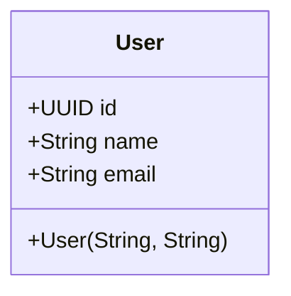

**Diagram sources**
- [User.java](file://src/main/java/dev/bloco/wallet/hub/domain/model/user/User.java#L13-L31)

**Section sources**
- [User.java](file://src/main/java/dev/bloco/wallet/hub/domain/model/user/User.java#L13-L31)

### Token
The Token entity represents a cryptocurrency token (e.g., ERC-20, ERC-721) on a specific network. It includes fields for `name`, `symbol`, `decimals`, `type`, and `contractAddress`. The Token class provides methods to determine the token type (`isFungible()`, `isNFT()`, `isNative()`) and to format/parse amounts according to the token's decimal precision. For fungible tokens, amounts are scaled by 10^decimals, while NFTs are treated as whole numbers.

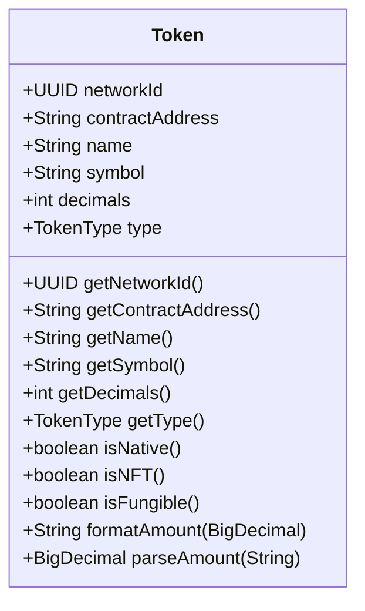

**Diagram sources**
- [Token.java](file://src/main/java/dev/bloco/wallet/hub/domain/model/token/Token.java#L9-L105)

**Section sources**
- [Token.java](file://src/main/java/dev/bloco/wallet/hub/domain/model/token/Token.java#L9-L105)

### Vault
The Vault entity represents a secure storage system for cryptographic keys (e.g., HSM, AWS KMS). It has a `name`, `type`, `configuration`, and `status`. The Vault can be activated or deactivated, with status changes recorded as domain events. Methods like `generateKeyPair()` and `sign()` are provided, but their implementation is stubbed in the domain model, deferring to infrastructure services. The Vault ensures operations are only allowed when active.

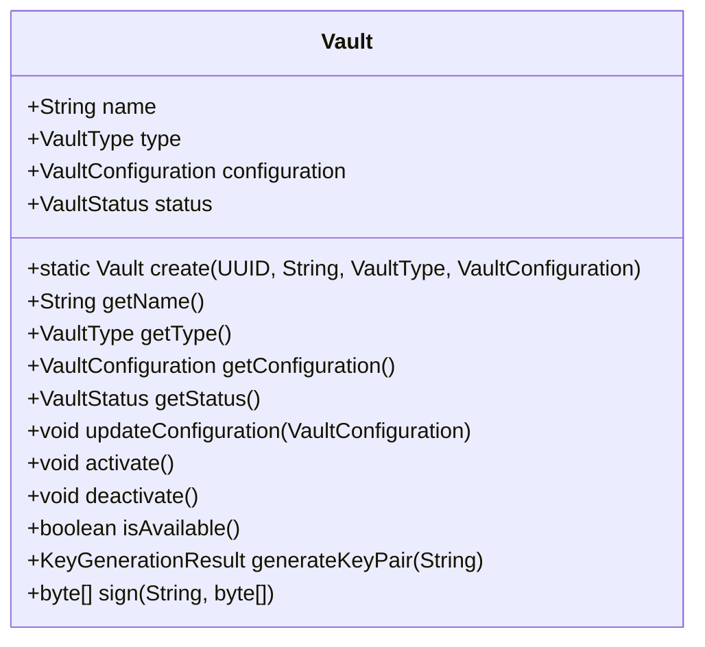

**Diagram sources**
- [Vault.java](file://src/main/java/dev/bloco/wallet/hub/domain/model/vault/Vault.java#L8-L96)

**Section sources**
- [Vault.java](file://src/main/java/dev/bloco/wallet/hub/domain/model/vault/Vault.java#L8-L96)

## Base Classes and Inheritance

### Entity
The Entity class is an abstract base class that provides a common identity mechanism for all domain entities. It contains a private `id` field of type UUID, which is set in the constructor and exposed via a getter. The `equals()` and `hashCode()` methods are overridden to compare entities based on their ID, ensuring that two entities with the same ID are considered equal regardless of other field values.

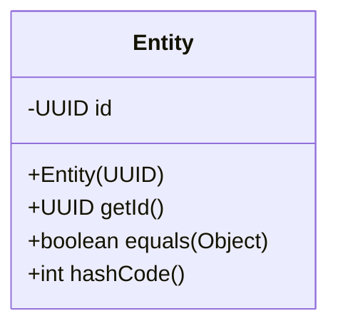

**Diagram sources**
- [Entity.java](file://src/main/java/dev/bloco/wallet/hub/domain/model/common/Entity.java#L5-L28)

**Section sources**
- [Entity.java](file://src/main/java/dev/bloco/wallet/hub/domain/model/common/Entity.java#L5-L28)

### AggregateRoot
The AggregateRoot class extends Entity and adds support for domain events. It maintains a list of `domainEvents` that are registered via `registerEvent()`. These events can be retrieved with `getDomainEvents()` and cleared after processing with `clearEvents()`. This pattern allows the domain model to publish events (e.g., WalletCreatedEvent) when state changes occur, enabling eventual consistency and decoupling of business logic.

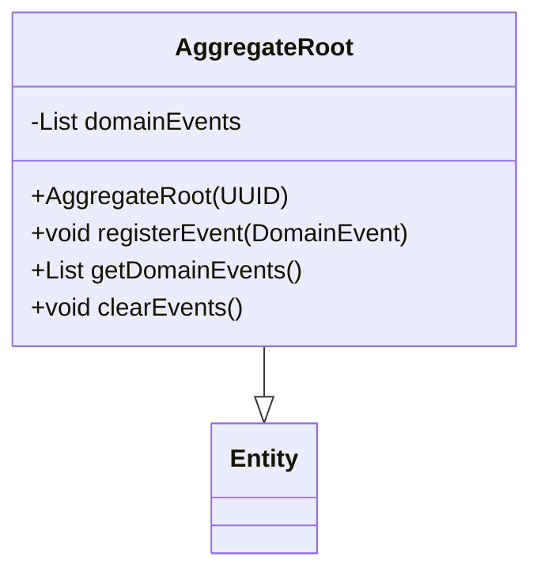

**Diagram sources**
- [AggregateRoot.java](file://src/main/java/dev/bloco/wallet/hub/domain/model/common/AggregateRoot.java#L9-L27)

**Section sources**
- [AggregateRoot.java](file://src/main/java/dev/bloco/wallet/hub/domain/model/common/AggregateRoot.java#L9-L27)

## Value Objects

### TransactionHash
The TransactionHash class is a final value object that encapsulates a blockchain transaction hash. It validates the hash in the constructor, ensuring it is not null or blank. The `getValue()` method returns the hash string. The class overrides `equals()` and `hashCode()` to compare based on the value, making it suitable for use as a key in collections.

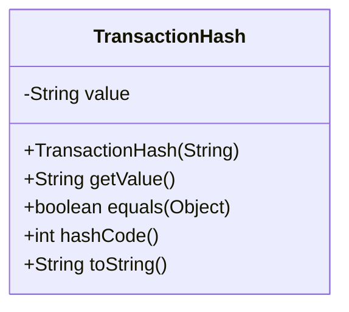

**Diagram sources**
- [TransactionHash.java](file://src/main/java/dev/bloco/wallet/hub/domain/model/transaction/TransactionHash.java#L4-L41)

**Section sources**
- [TransactionHash.java](file://src/main/java/dev/bloco/wallet/hub/domain/model/transaction/TransactionHash.java#L4-L41)

### PublicKey
The PublicKey class is a final value object that represents a cryptographic public key. Like TransactionHash, it validates the input in the constructor and provides a `getValue()` method. It ensures data integrity by preventing null or blank values and supports equality based on the key value.

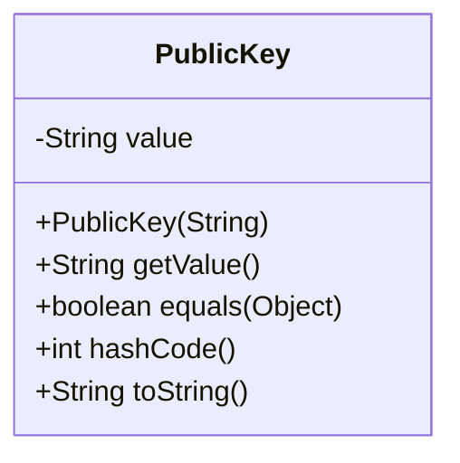

**Diagram sources**
- [PublicKey.java](file://src/main/java/dev/bloco/wallet/hub/domain/model/address/PublicKey.java#L4-L41)

**Section sources**
- [PublicKey.java](file://src/main/java/dev/bloco/wallet/hub/domain/model/address/PublicKey.java#L4-L41)

## Status Enums and Lifecycle Management

### TransactionStatus
The TransactionStatus enum defines the lifecycle states of a transaction: PENDING, CONFIRMED, and FAILED. A transaction starts as PENDING and can transition to CONFIRMED upon successful blockchain confirmation or to FAILED if it fails. The Transaction class provides methods like `isConfirmed()`, `isPending()`, and `isFailed()` to check the current status.

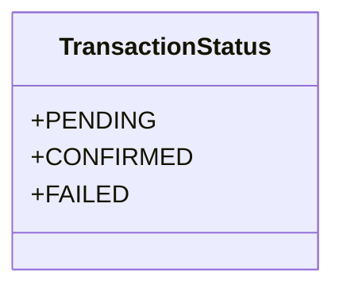

**Diagram sources**
- [TransactionStatus.java](file://src/main/java/dev/bloco/wallet/hub/domain/model/transaction/TransactionStatus.java#L2-L6)

**Section sources**
- [TransactionStatus.java](file://src/main/java/dev/bloco/wallet/hub/domain/model/transaction/TransactionStatus.java#L2-L6)

### WalletStatus
The WalletStatus enum (not explicitly shown in the provided code but implied by Wallet behavior) would manage wallet states such as ACTIVE, INACTIVE, or LOCKED. Status transitions are typically handled by methods that update the status and register domain events.

### VaultStatus
The VaultStatus enum defines the operational states of a vault: ACTIVE and INACTIVE. The Vault class provides `activate()` and `deactivate()` methods to change the status, with checks to prevent redundant transitions. Status changes are recorded as VaultStatusChangedEvent.

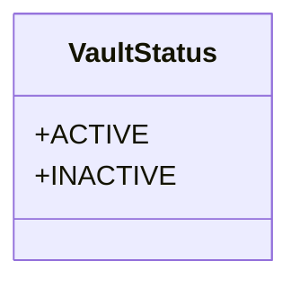

**Diagram sources**
- [VaultStatus.java](file://src/main/java/dev/bloco/wallet/hub/domain/model/vault/VaultStatus.java#L2-L5)

**Section sources**
- [VaultStatus.java](file://src/main/java/dev/bloco/wallet/hub/domain/model/vault/VaultStatus.java#L2-L5)

### AddressStatus
The AddressStatus enum manages the lifecycle of an address: ACTIVE or ARCHIVED. An address can be archived to prevent further use while retaining historical data. The Address class provides `archive()` and `activate()` methods for status transitions.

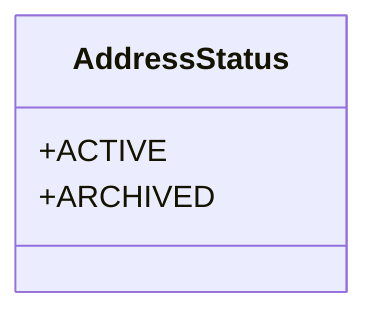

**Diagram sources**
- [AddressStatus.java](file://src/main/java/dev/bloco/wallet/hub/domain/model/address/AddressStatus.java#L2-L5)

**Section sources**
- [AddressStatus.java](file://src/main/java/dev/bloco/wallet/hub/domain/model/address/AddressStatus.java#L2-L5)

## Entity Relationships and Aggregations

The domain model uses aggregations and associations to define relationships between entities. The Wallet is an aggregate root that owns a set of Address entities, referenced by their UUIDs. Similarly, the Vault owns a set of addresses and potentially other entities. The Transaction is associated with a network (via networkId) and involves addresses (fromAddress, toAddress). The Token is linked to a network and has a contract address. These relationships are managed through UUID references rather than direct object references, promoting loose coupling.

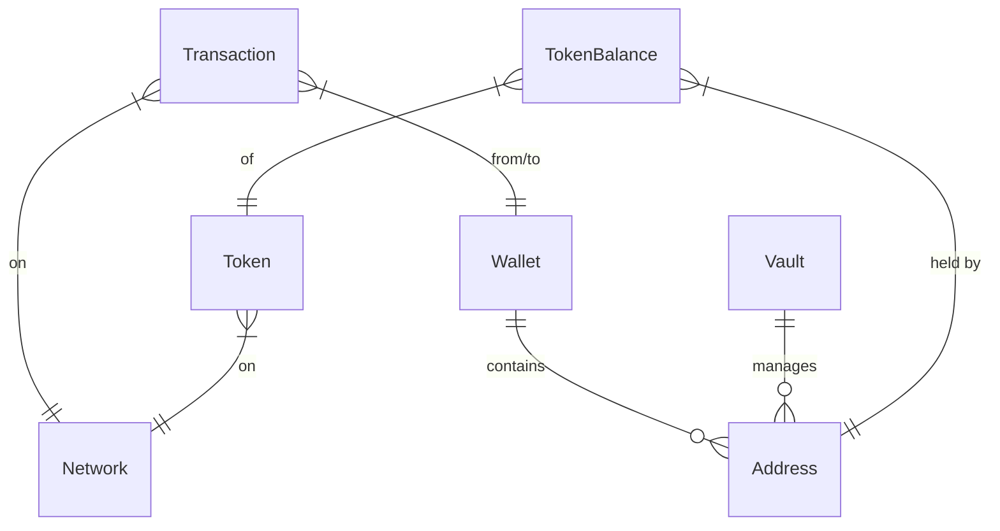

**Diagram sources**
- [Wallet.java](file://src/main/java/dev/bloco/wallet/hub/domain/model/Wallet.java#L23-L121)
- [Address.java](file://src/main/java/dev/bloco/wallet/hub/domain/model/address/Address.java#L11-L132)
- [Vault.java](file://src/main/java/dev/bloco/wallet/hub/domain/model/vault/Vault.java#L8-L96)
- [Transaction.java](file://src/main/java/dev/bloco/wallet/hub/domain/model/transaction/Transaction.java#L20-L210)
- [Token.java](file://src/main/java/dev/bloco/wallet/hub/domain/model/token/Token.java#L9-L105)

**Section sources**
- [Wallet.java](file://src/main/java/dev/bloco/wallet/hub/domain/model/Wallet.java#L23-L121)
- [Address.java](file://src/main/java/dev/bloco/wallet/hub/domain/model/address/Address.java#L11-L132)
- [Vault.java](file://src/main/java/dev/bloco/wallet/hub/domain/model/vault/Vault.java#L8-L96)

## Persistence and Infrastructure Integration

The domain model is separated from persistence concerns through the use of gateways (repositories) and mappers. The WalletRepository, TransactionRepository, etc., define interfaces for saving and retrieving entities. Infrastructure implementations (e.g., JpaWalletRepository) use mappers (e.g., WalletMapper) to convert between domain models and JPA entities. This allows the domain logic to remain pure and independent of the database schema.

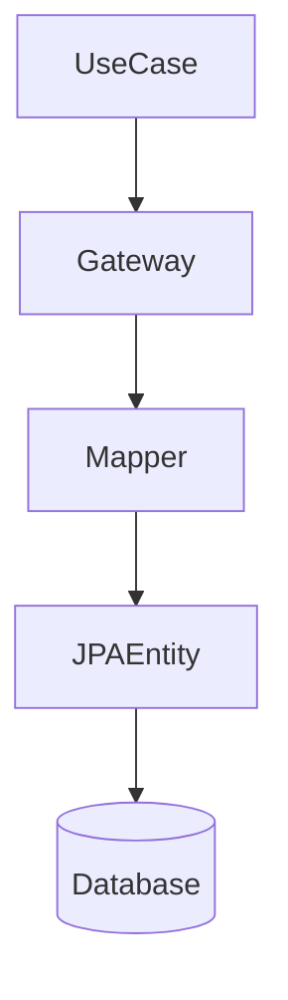

**Section sources**
- [WalletRepository.java](file://src/main/java/dev/bloco/wallet/hub/domain/gateway/WalletRepository.java#L16-L21)
- [JpaWalletRepository.java](file://src/main/java/dev/bloco/wallet/hub/infra/provider/data/repository/JpaWalletRepository.java#L67-L91)
- [WalletMapper.java](file://src/main/java/dev/bloco/wallet/hub/infra/provider/mapper/WalletMapper.java#L34-L49)

##