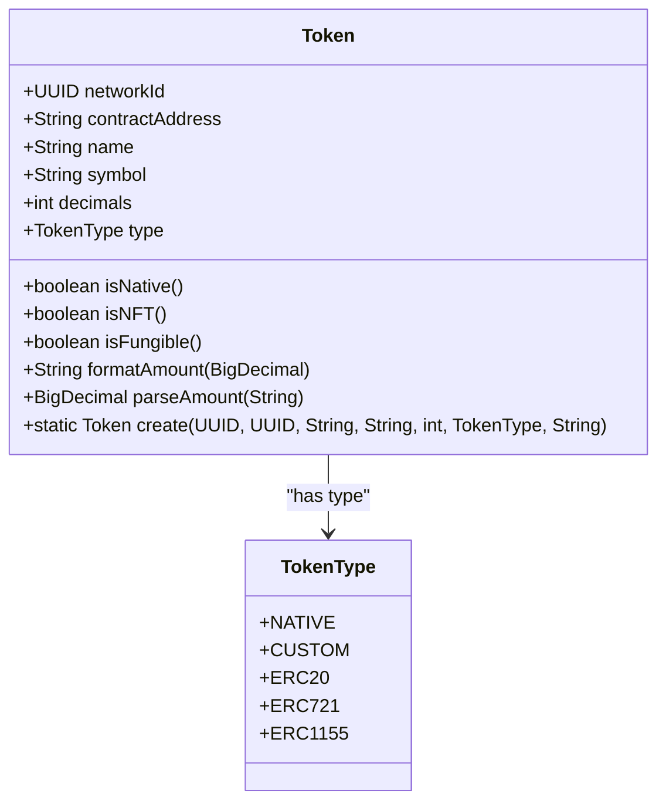
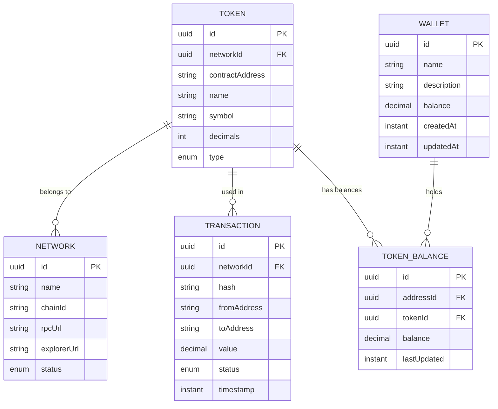

# Token

<cite>
**Referenced Files in This Document**   
- [Token.java](file://src/main/java/dev/bloco/wallet/hub/domain/model/token/Token.java)
- [TokenType.java](file://src/main/java/dev/bloco/wallet/hub/domain/model/token/TokenType.java)
- [TokenCreatedEvent.java](file://src/main/java/dev/bloco/wallet/hub/domain/event/token/TokenCreatedEvent.java)
- [Network.java](file://src/main/java/dev/bloco/wallet/hub/domain/model/network/Network.java)
- [Transaction.java](file://src/main/java/dev/bloco/wallet/hub/domain/model/transaction/Transaction.java)
- [Wallet.java](file://src/main/java/dev/bloco/wallet/hub/domain/model/Wallet.java)
- [TokenBalance.java](file://src/main/java/dev/bloco/wallet/hub/domain/model/token/TokenBalance.java)
</cite>

## Table of Contents
1. [Introduction](#introduction)
2. [Core Fields](#core-fields)
3. [TokenType Enum](#tokentype-enum)
4. [Static Factory Method](#static-factory-method)
5. [Utility Methods](#utility-methods)
6. [Amount Formatting and Parsing](#amount-formatting-and-parsing)
7. [Entity Relationships](#entity-relationships)
8. [Validation and Integration](#validation-and-integration)
9. [Conclusion](#conclusion)

## Introduction

The Token entity in the bloco-wallet-java application represents a digital asset that can be managed within the wallet system. It serves as a fundamental building block for handling various types of blockchain tokens across different networks. The Token class encapsulates essential attributes such as identification, network association, contract information, and metadata, while providing utility methods for type checking and amount manipulation. This documentation provides a comprehensive overview of the Token entity's structure, behavior, and integration within the broader system architecture.

**Section sources**
- [Token.java](file://src/main/java/dev/bloco/wallet/hub/domain/model/token/Token.java#L9-L105)

## Core Fields

The Token entity contains several core fields that define its identity and characteristics:

- **id**: The unique identifier (UUID) of the token, inherited from the AggregateRoot class, ensuring global uniqueness across the system.
- **networkId**: A UUID reference to the Network entity, establishing which blockchain network this token operates on.
- **contractAddress**: The blockchain address where the token's smart contract is deployed, crucial for interacting with the token on-chain.
- **name**: A human-readable name for the token (e.g., "Ethereum", "USDC").
- **symbol**: The ticker symbol used to represent the token (e.g., "ETH", "USDC").
- **decimals**: An integer specifying the number of decimal places the token supports, which is critical for proper amount formatting and parsing.
- **type**: A TokenType enum value that defines the token standard and behavior.

These fields are immutable after creation, ensuring data consistency and preventing unauthorized modifications to token properties.

**Section sources**
- [Token.java](file://src/main/java/dev/bloco/wallet/hub/domain/model/token/Token.java#L11-L17)

## TokenType Enum

The TokenType enum defines the classification of tokens supported by the system, with each type having specific implications for token behavior:

- **NATIVE**: Represents the native cryptocurrency of a blockchain network (e.g., ETH on Ethereum, MATIC on Polygon). These tokens are built into the network protocol.
- **CUSTOM**: Indicates a user-defined token that doesn't conform to standard interfaces, allowing for flexibility in token integration.
- **ERC20**: Standard for fungible tokens on Ethereum-compatible networks, enabling tokens that can be divided into smaller units.
- **ERC721**: Standard for non-fungible tokens (NFTs), where each token is unique and indivisible.
- **ERC1155**: Multi-token standard that can represent both fungible and non-fungible tokens within a single contract.

The token type determines how the system handles the token, particularly in terms of amount formatting, transfer behavior, and user interface presentation.

**Section sources**
- [TokenType.java](file://src/main/java/dev/bloco/wallet/hub/domain/model/token/TokenType.java#L2-L8)

## Static Factory Method

The Token class implements a static factory method `create()` that serves as the primary mechanism for instantiating new Token objects. This method accepts all required parameters (id, networkId, name, symbol, decimals, type, and contractAddress) and returns a fully initialized Token instance. 

Crucially, upon creation, the factory method emits a `TokenCreatedEvent` domain event, which is registered with the token's event system. This event-driven architecture enables decoupled components to react to token creation, such as updating caches, notifying external services, or triggering UI updates. The factory method pattern ensures consistent object creation and encapsulates the complexity of event registration within the domain logic.

**Section sources**
- [Token.java](file://src/main/java/dev/bloco/wallet/hub/domain/model/token/Token.java#L31-L46)

## Utility Methods

The Token entity provides several utility methods for determining token characteristics and behavior:

- **isNative()**: Returns true if the token type is NATIVE, indicating it represents the network's native cryptocurrency.
- **isNFT()**: Returns true if the token type is ERC721 or ERC1155, identifying it as a non-fungible token.
- **isFungible()**: Returns true if the token type is NATIVE or ERC20, indicating it can be divided into smaller, interchangeable units.

These methods abstract the complexity of type checking behind simple boolean queries, making it easier for other components to make decisions based on token characteristics without needing to understand the underlying enum structure.

**Diagram sources**
- [Token.java](file://src/main/java/dev/bloco/wallet/hub/domain/model/token/Token.java#L9-L105)
- [TokenType.java](file://src/main/java/dev/bloco/wallet/hub/domain/model/token/TokenType.java#L2-L8)

**Section sources**
- [Token.java](file://src/main/java/dev/bloco/wallet/hub/domain/model/token/Token.java#L72-L82)

## Amount Formatting and Parsing

The Token entity includes specialized methods for handling token amounts with proper decimal precision:

- **formatAmount(BigDecimal amount)**: Converts a raw amount (in the smallest denomination) to a human-readable string. For NFTs, it returns the integer portion. For fungible tokens, it divides by 10^decimals using HALF_DOWN rounding.
- **parseAmount(String formattedAmount)**: Converts a user-input amount string back to the raw value by multiplying by 10^decimals and truncating to zero decimal places.

The `decimals` field plays a critical role in these operations, representing the exponent for the base-10 scaling factor. For example, a token with 6 decimals (like USDC) requires dividing raw amounts by 1,000,000 for display and multiplying user input by 1,000,000 for processing. This mathematical approach ensures accurate representation of fractional amounts while maintaining precision in on-chain operations.

**Section sources**
- [Token.java](file://src/main/java/dev/bloco/wallet/hub/domain/model/token/Token.java#L84-L104)

## Entity Relationships

The Token entity is integrated within a broader ecosystem of domain objects, forming critical relationships that enable wallet functionality:

**Diagram sources**
- [Token.java](file://src/main/java/dev/bloco/wallet/hub/domain/model/token/Token.java#L9-L105)
- [Network.java](file://src/main/java/dev/bloco/wallet/hub/domain/model/network/Network.java#L7-L114)
- [Transaction.java](file://src/main/java/dev/bloco/wallet/hub/domain/model/transaction/Transaction.java#L20-L210)
- [Wallet.java](file://src/main/java/dev/bloco/wallet/hub/domain/model/Wallet.java#L23-L121)
- [TokenBalance.java](file://src/main/java/dev/bloco/wallet/hub/domain/model/token/TokenBalance.java#L11-L76)

### Network Relationship

Each Token is associated with exactly one Network through the networkId field. This relationship ensures that tokens are properly contextualized within their respective blockchain environments, allowing the system to route transactions correctly and display network-specific information.

### Transaction Integration

Tokens are used as the value transfer medium in Transactions. When a transaction involves a token transfer, the transaction references the token being transferred, enabling proper accounting and display of transaction details.

### Wallet Association

Tokens are held in Wallets through the TokenBalance entity, which tracks the amount of each token held at specific addresses. This many-to-many relationship between Wallets and Tokens allows users to manage multiple token types within a single wallet interface.

**Section sources**
- [Token.java](file://src/main/java/dev/bloco/wallet/hub/domain/model/token/Token.java#L9-L105)
- [Network.java](file://src/main/java/dev/bloco/wallet/hub/domain/model/network/Network.java#L7-L114)
- [Transaction.java](file://src/main/java/dev/bloco/wallet/hub/domain/model/transaction/Transaction.java#L20-L210)
- [Wallet.java](file://src/main/java/dev/bloco/wallet/hub/domain/model/Wallet.java#L23-L121)
- [TokenBalance.java](file://src/main/java/dev/bloco/wallet/hub/domain/model/token/TokenBalance.java#L11-L76)

## Validation and Integration

The Token entity integrates with blockchain standards through careful validation and type-specific handling. During token creation, the system validates that required fields are present and properly formatted. The contractAddress must be a valid blockchain address, and the decimals value must be non-negative. 

The TokenType enum ensures that tokens conform to recognized blockchain standards, with specific behavior patterns for each type. For example, ERC20 tokens are treated as fungible with decimal precision, while ERC721 tokens are handled as unique, indivisible assets. This integration allows the wallet system to support a wide range of token standards while maintaining consistent internal handling and user experience.

**Section sources**
- [Token.java](file://src/main/java/dev/bloco/wallet/hub/domain/model/token/Token.java#L31-L46)
- [TokenType.java](file://src/main/java/dev/bloco/wallet/hub/domain/model/token/TokenType.java#L2-L8)

## Conclusion

The Token entity in bloco-wallet-java provides a robust foundation for managing diverse digital assets across multiple blockchain networks. By combining immutable core fields with flexible type classification and specialized utility methods, the entity supports both standard and custom token implementations. The integration of domain events, proper decimal handling, and clear relationships with other domain objects creates a cohesive system for token management that balances flexibility with reliability. This design enables the wallet to support current blockchain standards while remaining adaptable to future token innovations.