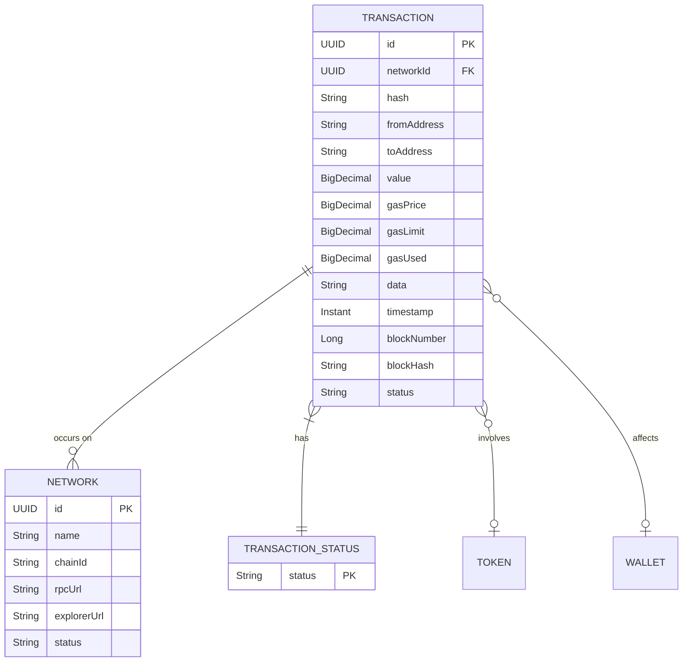

# Transaction

<cite>
**Referenced Files in This Document**   
- [Transaction.java](file://src/main/java/dev/bloco/wallet/hub/domain/model/transaction/Transaction.java)
- [TransactionHash.java](file://src/main/java/dev/bloco/wallet/hub/domain/model/transaction/TransactionHash.java)
- [TransactionStatus.java](file://src/main/java/dev/bloco/wallet/hub/domain/model/transaction/TransactionStatus.java)
- [TransactionCreatedEvent.java](file://src/main/java/dev/bloco/wallet/hub/domain/event/transaction/TransactionCreatedEvent.java)
- [TransactionStatusChangedEvent.java](file://src/main/java/dev/bloco/wallet/hub/domain/event/transaction/TransactionStatusChangedEvent.java)
- [ConfirmTransactionUseCase.java](file://src/main/java/dev/bloco/wallet/hub/usecase/ConfirmTransactionUseCase.java)
- [FailTransactionUseCase.java](file://src/main/java/dev/bloco/wallet/hub/usecase/FailTransactionUseCase.java)
- [TransactionRepository.java](file://src/main/java/dev/bloco/wallet/hub/domain/gateway/TransactionRepository.java)
- [Network.java](file://src/main/java/dev/bloco/wallet/hub/domain/model/network/Network.java)
- [Token.java](file://src/main/java/dev/bloco/wallet/hub/domain/model/token/Token.java)
</cite>

## Table of Contents
1. [Introduction](#introduction)
2. [Core Fields](#core-fields)
3. [TransactionHash Value Object](#transactionhash-value-object)
4. [Status Lifecycle and Transitions](#status-lifecycle-and-transitions)
5. [Factory Methods](#factory-methods)
6. [Business Rules and Domain Events](#business-rules-and-domain-events)
7. [Relationships with Other Entities](#relationships-with-other-entities)
8. [Lifecycle Management Example](#lifecycle-management-example)
9. [Validation and Error Conditions](#validation-and-error-conditions)
10. [Integration with Use Cases](#integration-with-use-cases)

## Introduction
The `Transaction` entity in the bloco-wallet-java application represents a blockchain transaction that occurs within a specific network. It encapsulates critical information such as sender and recipient addresses, value transferred, gas parameters, and transaction status. As an aggregate root, it manages its own lifecycle and emits domain events to reflect state changes. This document details the structure, behavior, and integration points of the Transaction entity.

**Section sources**
- [Transaction.java](file://src/main/java/dev/bloco/wallet/hub/domain/model/transaction/Transaction.java#L1-L50)

## Core Fields
The Transaction entity contains the following core fields:

| Field | Type | Description |
|-------|------|-------------|
| id | UUID | Unique identifier for the transaction |
| networkId | UUID | Identifier of the blockchain network where the transaction occurs |
| hash | TransactionHash | Immutable value object representing the transaction hash |
| fromAddress | String | Sender's blockchain address |
| toAddress | String | Recipient's blockchain address |
| value | BigDecimal | Value being transferred in the transaction |
| gasPrice | BigDecimal | Price per unit of gas (mutable after creation) |
| gasLimit | BigDecimal | Maximum amount of gas allowed for the transaction (mutable after creation) |
| gasUsed | BigDecimal | Actual amount of gas consumed by the transaction (set on confirmation) |
| data | String | Additional data or payload associated with the transaction |
| timestamp | Instant | Time when the transaction was created |
| blockNumber | Long | Block number in which the transaction was included (set on confirmation) |
| blockHash | String | Hash of the block containing the transaction (set on confirmation) |
| status | TransactionStatus | Current status of the transaction (PENDING, CONFIRMED, FAILED) |

These fields are initialized during transaction creation, with gas-related and block-related fields populated as the transaction progresses through its lifecycle.

**Section sources**
- [Transaction.java](file://src/main/java/dev/bloco/wallet/hub/domain/model/transaction/Transaction.java#L20-L45)

## TransactionHash Value Object
The `TransactionHash` class is an immutable value object that encapsulates the transaction hash string with built-in validation.

It enforces the following rules:
- Hash value cannot be null or blank
- Implements proper equality and hashing based on the value
- Provides a clean toString() representation

The validation occurs in the constructor via the `validateHash()` method, which throws an `IllegalArgumentException` if the input is invalid. This ensures that only valid hashes can be associated with a transaction, maintaining data integrity across the system.

**Diagram sources**
- [TransactionHash.java](file://src/main/java/dev/bloco/wallet/hub/domain/model/transaction/TransactionHash.java#L4-L41)

**Section sources**
- [TransactionHash.java](file://src/main/java/dev/bloco/wallet/hub/domain/model/transaction/TransactionHash.java#L4-L41)

## Status Lifecycle and Transitions
The Transaction entity follows a strict state lifecycle defined by the `TransactionStatus` enum, which includes three states: PENDING, CONFIRMED, and FAILED.

### Status States
- **PENDING**: Initial state when a transaction is created and broadcast to the network
- **CONFIRMED**: Final state when the transaction has been successfully included in a block
- **FAILED**: Final state when the transaction execution failed

All transactions start in the PENDING state and can transition to either CONFIRMED or FAILED, but never back to PENDING once confirmed or failed.

### Transition Methods
The following methods manage state transitions:

#### confirm()
Transitions the transaction from PENDING to CONFIRMED state by:
- Setting blockNumber, blockHash, and gasUsed
- Updating status to CONFIRMED
- Registering a `TransactionStatusChangedEvent`

**Diagram sources**
- [Transaction.java](file://src/main/java/dev/bloco/wallet/hub/domain/model/transaction/Transaction.java#L145-L156)
- [ConfirmTransactionUseCase.java](file://src/main/java/dev/bloco/wallet/hub/usecase/ConfirmTransactionUseCase.java#L25-L38)

#### fail()
Transitions the transaction from PENDING to FAILED state by:
- Setting status to FAILED
- Recording the failure reason
- Registering a `TransactionStatusChangedEvent` with the reason

#### setGasInfo()
Updates gas parameters (gasPrice, gasLimit) while the transaction is still pending. This method does not change the transaction status but updates execution parameters.

**Diagram sources**
- [Transaction.java](file://src/main/java/dev/bloco/wallet/hub/domain/model/transaction/Transaction.java#L145-L171)
- [TransactionStatus.java](file://src/main/java/dev/bloco/wallet/hub/domain/model/transaction/TransactionStatus.java#L2-L6)

**Section sources**
- [Transaction.java](file://src/main/java/dev/bloco/wallet/hub/domain/model/transaction/Transaction.java#L145-L182)
- [TransactionStatus.java](file://src/main/java/dev/bloco/wallet/hub/domain/model/transaction/TransactionStatus.java#L2-L6)

## Factory Methods
The Transaction class provides two static factory methods for instance creation:

### create()
Creates a new transaction with default PENDING status and emits a `TransactionCreatedEvent`. This method should be used when initiating a new transaction in the system.

It initializes:
- All core fields from parameters
- Timestamp to current time
- Status to PENDING
- Registers a `TransactionCreatedEvent` containing transaction metadata

**Diagram sources**
- [Transaction.java](file://src/main/java/dev/bloco/wallet/hub/domain/model/transaction/Transaction.java#L49-L63)
- [TransactionCreatedEvent.java](file://src/main/java/dev/bloco/wallet/hub/domain/event/transaction/TransactionCreatedEvent.java#L10-L20)

### rehydrate()
Reconstructs a Transaction instance from persisted state without emitting domain events. This method is used when loading transactions from the database through repositories.

It allows setting all fields including:
- Block information (blockNumber, blockHash)
- Gas usage (gasUsed)
- Current status (PENDING, CONFIRMED, or FAILED)
- Historical timestamp

Unlike `create()`, this method does not register any events, preserving the event stream integrity when restoring from storage.

**Section sources**
- [Transaction.java](file://src/main/java/dev/bloco/wallet/hub/domain/model/transaction/Transaction.java#L49-L93)

## Business Rules and Domain Events
The Transaction entity enforces several business rules through its methods and state management:

### State Transition Guards
- Cannot confirm or fail a transaction that is already CONFIRMED or FAILED
- Status can only be changed from PENDING to either CONFIRMED or FAILED
- Once in terminal state (CONFIRMED/FAILED), no further state changes are allowed

### Domain Event Emissions
The entity emits domain events to communicate state changes:

- **TransactionCreatedEvent**: Emitted when a new transaction is created via the `create()` method
- **TransactionStatusChangedEvent**: Emitted when status changes via `confirm()` or `fail()`
- **TransactionConfirmedEvent**: Published by `ConfirmTransactionUseCase` after successful confirmation

These events enable reactive processing across the system, such as balance updates, notifications, and audit logging.

**Diagram sources**
- [TransactionCreatedEvent.java](file://src/main/java/dev/bloco/wallet/hub/domain/event/transaction/TransactionCreatedEvent.java#L6-L25)
- [TransactionStatusChangedEvent.java](file://src/main/java/dev/bloco/wallet/hub/domain/event/transaction/TransactionStatusChangedEvent.java#L6-L20)
- [TransactionConfirmedEvent.java](file://src/main/java/dev/bloco/wallet/hub/domain/event/transaction/TransactionConfirmedEvent.java#L6-L20)

**Section sources**
- [Transaction.java](file://src/main/java/dev/bloco/wallet/hub/domain/model/transaction/Transaction.java#L49-L171)
- [TransactionCreatedEvent.java](file://src/main/java/dev/bloco/wallet/hub/domain/event/transaction/TransactionCreatedEvent.java#L6-L25)
- [TransactionStatusChangedEvent.java](file://src/main/java/dev/bloco/wallet/hub/domain/event/transaction/TransactionStatusChangedEvent.java#L6-L20)

## Relationships with Other Entities
The Transaction entity interacts with several other domain entities:

### Network
- Associated via `networkId` field
- Transactions occur within the context of a specific blockchain network
- Network configuration affects transaction processing and validation

### Wallet
- While not directly referenced, transactions are typically initiated from and to wallet addresses
- Wallet balance changes are a consequence of transaction confirmation
- Wallet use cases (TransferFunds, AddFunds) create transactions

### Token
- For token transfers, the transaction data field contains token transfer details
- Token contract address may be the toAddress in ERC-20 transfers
- Token decimals and type affect value interpretation

**Diagram sources**
- [Transaction.java](file://src/main/java/dev/bloco/wallet/hub/domain/model/transaction/Transaction.java#L20-L45)
- [Network.java](file://src/main/java/dev/bloco/wallet/hub/domain/model/network/Network.java#L10-L25)
- [Token.java](file://src/main/java/dev/bloco/wallet/hub/domain/model/token/Token.java#L10-L25)

**Section sources**
- [Transaction.java](file://src/main/java/dev/bloco/wallet/hub/domain/model/transaction/Transaction.java#L20-L45)
- [Network.java](file://src/main/java/dev/bloco/wallet/hub/domain/model/network/Network.java#L10-L25)
- [Token.java](file://src/main/java/dev/bloco/wallet/hub/domain/model/token/Token.java#L10-L25)

## Lifecycle Management Example
The typical transaction lifecycle follows this sequence:

1. **Creation**: `Transaction.create()` is called with basic transaction details
2. **Gas Setup**: `setGasInfo()` is called to specify execution parameters
3. **Confirmation**: `confirm()` is called when the transaction is mined
4. **Persistence**: Updated transaction is saved via `TransactionRepository.save()`

**Diagram sources**
- [Transaction.java](file://src/main/java/dev/bloco/wallet/hub/domain/model/transaction/Transaction.java#L49-L156)
- [TransactionRepository.java](file://src/main/java/dev/bloco/wallet/hub/domain/gateway/TransactionRepository.java#L10-L15)
- [ConfirmTransactionUseCase.java](file://src/main/java/dev/bloco/wallet/hub/usecase/ConfirmTransactionUseCase.java#L25-L38)

## Validation and Error Conditions
The system enforces validation at multiple levels:

### TransactionHash Validation
- Rejects null or blank hash values
- Throws `IllegalArgumentException` on invalid input
- Ensures hash integrity throughout the transaction lifecycle

### State Transition Validation
- Prevents status changes on already confirmed/failed transactions
- Ensures only valid state transitions (PENDING → CONFIRMED/FAILED)
- Maintains business rule consistency

### Repository-Level Validation
- `TransactionRepository` provides `existsById` and `existsByHash` methods to prevent duplicates
- Enforces uniqueness constraints at persistence layer
- Validates network and address existence through related repositories

Error conditions include:
- Attempting to confirm/fail non-existent transactions
- Invalid hash format during creation
- Duplicate transaction hash detection
- Network unavailability during processing

**Section sources**
- [TransactionHash.java](file://src/main/java/dev/bloco/wallet/hub/domain/model/transaction/TransactionHash.java#L10-L15)
- [Transaction.java](file://src/main/java/dev/bloco/wallet/hub/domain/model/transaction/Transaction.java#L145-L171)
- [TransactionRepository.java](file://src/main/java/dev/bloco/wallet/hub/domain/gateway/TransactionRepository.java#L50-L55)

## Integration with Use Cases
The Transaction entity is integrated with key use cases in the system:

### ConfirmTransactionUseCase
Handles transaction confirmation by:
- Retrieving transaction from repository
- Calling `confirm()` method with block details
- Persisting updated transaction
- Publishing `TransactionConfirmedEvent`

### FailTransactionUseCase
Handles transaction failure by:
- Retrieving transaction from repository
- Calling `fail()` method with reason
- Persisting updated transaction
- Publishing `TransactionStatusChangedEvent`

These use cases enforce proper transaction lifecycle management and ensure consistent event publishing across the system.

**Diagram sources**
- [ConfirmTransactionUseCase.java](file://src/main/java/dev/bloco/wallet/hub/usecase/ConfirmTransactionUseCase.java#L10-L15)
- [FailTransactionUseCase.java](file://src/main/java/dev/bloco/wallet/hub/usecase/FailTransactionUseCase.java#L10-L15)
- [TransactionRepository.java](file://src/main/java/dev/bloco/wallet/hub/domain/gateway/TransactionRepository.java#L10-L15)

**Section sources**
- [ConfirmTransactionUseCase.java](file://src/main/java/dev/bloco/wallet/hub/usecase/ConfirmTransactionUseCase.java#L10-L38)
- [FailTransactionUseCase.java](file://src/main/java/dev/bloco/wallet/hub/usecase/FailTransactionUseCase.java#L10-L34)
- [TransactionRepository.java](file://src/main/java/dev/bloco/wallet/hub/domain/gateway/TransactionRepository.java#L10-L55)