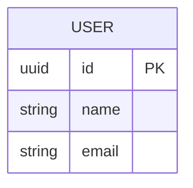
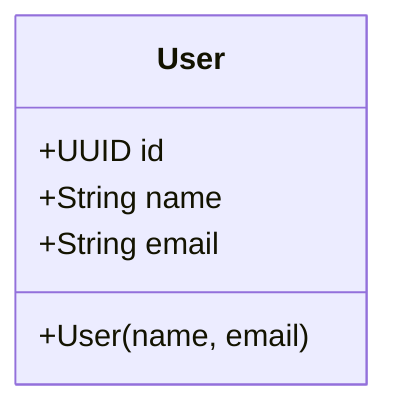
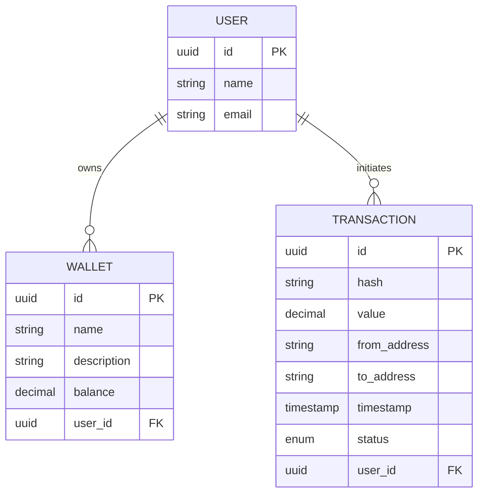
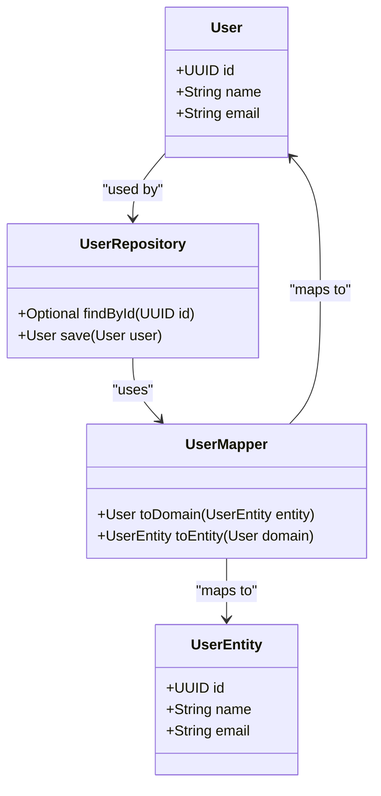

# User

<cite>
**Referenced Files in This Document**   
- [User.java](file://src/main/java/dev/bloco/wallet/hub/domain/model/user/User.java)
- [UserTest.java](file://src/test/java/dev/bloco/wallet/hub/domain/UserTest.java)
- [Wallet.java](file://src/main/java/dev/bloco/wallet/hub/domain/model/Wallet.java)
- [Transaction.java](file://src/main/java/dev/bloco/wallet/hub/domain/model/transaction/Transaction.java)
- [UserRepository.java](file://src/main/java/dev/bloco/wallet/hub/domain/gateway/UserRepository.java)
- [UserEntity.java](file://src/main/java/dev/bloco/wallet/hub/infra/provider/data/entity/UserEntity.java)
- [UserMapper.java](file://src/main/java/dev/bloco/wallet/hub/infra/provider/mapper/UserMapper.java)
</cite>

## Table of Contents
1. [Introduction](#introduction)
2. [Core Data Model](#core-data-model)
3. [Constructor and Initialization](#constructor-and-initialization)
4. [Immutability and Identity Management](#immutability-and-identity-management)
5. [Entity Relationships](#entity-relationships)
6. [Usage Examples](#usage-examples)
7. [Data Validation and Constraints](#data-validation-and-constraints)
8. [Persistence and Repository Integration](#persistence-and-repository-integration)
9. [Privacy and Data Retention](#privacy-and-data-retention)
10. [Extension Points](#extension-points)
11. [Conclusion](#conclusion)

## Introduction

The User entity in the bloco-wallet-java system serves as the foundational identity model for all wallet operations and transaction auditing. As a lightweight, immutable domain object, it provides a stable reference point for user identity without incorporating complex business logic or domain events. This documentation details the User entity's structure, behavior, and integration points within the wallet ecosystem, focusing on its role in identity management, relationship with core financial entities, and implications for system design.

**Section sources**
- [User.java](file://src/main/java/dev/bloco/wallet/hub/domain/model/user/User.java#L1-L32)

## Core Data Model

The User entity is defined by three essential fields that constitute its identity and basic profile information:

- **id**: A UUID field that serves as the unique, immutable identifier for each user. Generated automatically upon instantiation, this field ensures global uniqueness and provides a stable reference across the system.
- **name**: A string field representing the user's display name or full name. This field is required and captured during user creation.
- **email**: A string field containing the user's email address, used as a primary contact method and potential authentication identifier.

These fields are designed to capture minimal user information, reflecting a privacy-conscious approach that focuses on identity rather than extensive personal data collection.



**Diagram sources**
- [User.java](file://src/main/java/dev/bloco/wallet/hub/domain/model/user/User.java#L15-L17)

**Section sources**
- [User.java](file://src/main/java/dev/bloco/wallet/hub/domain/model/user/User.java#L15-L17)

## Constructor and Initialization

The User entity employs constructor-based initialization to ensure complete and valid object creation. The constructor `User(String name, String email)` requires both name and email parameters, enforcing the presence of essential user information at creation time. During instantiation, the system automatically generates a UUID for the id field using `UUID.randomUUID()`, eliminating the need for external ID management and guaranteeing uniqueness.

This initialization pattern follows the creation pattern where identity is established at birth rather than assigned later, preventing incomplete or partially initialized user states. The constructor's simplicity and requirement for all essential fields promote correct usage and reduce the potential for invalid user objects within the system.

**Section sources**
- [User.java](file://src/main/java/dev/bloco/wallet/hub/domain/model/user/User.java#L26-L30)

## Immutability and Identity Management

The User entity is designed as an immutable object, with all fields declared as `final` and no setter methods provided. This immutability ensures that once a user is created, their identity and basic information cannot be altered, providing a stable reference point throughout the system. The only mutable aspect is the id field, which is set once during construction and remains constant for the object's lifetime.

This design choice has several important implications:
- **Identity stability**: The user's id remains constant, allowing reliable referencing across different system components and database records.
- **Thread safety**: Immutable objects are inherently thread-safe, eliminating concurrency issues in multi-threaded environments.
- **Predictable behavior**: Since user properties cannot change, system behavior remains consistent regardless of when or where a user object is accessed.
- **Simplified debugging**: With immutable state, debugging becomes easier as the user's properties at any point in time are guaranteed to be the same as at creation.

The combination of UUID-based identification and immutability creates a robust foundation for user identity management within the wallet system.



**Diagram sources**
- [User.java](file://src/main/java/dev/bloco/wallet/hub/domain/model/user/User.java#L13-L31)

**Section sources**
- [User.java](file://src/main/java/dev/bloco/wallet/hub/domain/model/user/User.java#L13-L31)
- [UserTest.java](file://src/test/java/dev/bloco/wallet/hub/domain/UserTest.java#L20-L25)

## Entity Relationships

The User entity serves as a central reference point for wallet ownership and transaction auditing, establishing relationships with key financial entities in the system. While the User class itself does not maintain direct references to Wallet or Transaction objects, it forms the identity anchor for these relationships through identifier matching.

### Wallet Ownership Relationship

Wallets in the system are associated with users through identifier correlation rather than direct object references. When a wallet is created, the system establishes ownership by linking the wallet's identifier to the user's UUID in the persistence layer. This indirect relationship allows for flexible ownership models and simplifies the domain model by avoiding complex object graphs.

### Transaction Auditing Relationship

Similarly, transactions are linked to users through identifier matching. Each transaction record contains a reference to the user's UUID, enabling comprehensive audit trails and activity tracking. This design supports transaction history queries, security monitoring, and compliance reporting by allowing the system to retrieve all transactions associated with a specific user.

The relationship architecture follows a reference-based pattern rather than an aggregate pattern, keeping the User entity lightweight and focused on identity management while enabling rich querying capabilities through the persistence layer.



**Diagram sources**
- [User.java](file://src/main/java/dev/bloco/wallet/hub/domain/model/user/User.java#L13-L31)
- [Wallet.java](file://src/main/java/dev/bloco/wallet/hub/domain/model/Wallet.java#L1-L122)
- [Transaction.java](file://src/main/java/dev/bloco/wallet/hub/domain/model/transaction/Transaction.java#L1-L211)

**Section sources**
- [User.java](file://src/main/java/dev/bloco/wallet/hub/domain/model/user/User.java#L13-L31)
- [Wallet.java](file://src/main/java/dev/bloco/wallet/hub/domain/model/Wallet.java#L1-L122)
- [Transaction.java](file://src/main/java/dev/bloco/wallet/hub/domain/model/transaction/Transaction.java#L1-L211)

## Usage Examples

### User Instantiation

Creating a new user is straightforward and follows the constructor-based initialization pattern:

```java
User user = new User("Alice Johnson", "alice.johnson@example.com");
```

Upon creation, the user object automatically receives a unique UUID identifier while preserving the provided name and email information. The immutability of the object ensures that these values remain constant throughout its lifecycle.

### Wallet Creation Workflow Integration

The User entity integrates with wallet creation workflows through identifier correlation:

```java
// Create user
User user = new User("Bob Smith", "bob.smith@example.com");

// Save user to repository
User savedUser = userRepository.save(user);

// Create wallet with user context
Wallet wallet = Wallet.create(UUID.randomUUID(), "Primary Wallet", "Main spending wallet");
wallet.setCorrelationId(savedUser.getId()); // Link wallet to user

// Save wallet
walletRepository.save(wallet);
```

This pattern demonstrates how the user's UUID serves as a correlation identifier for linking financial entities while maintaining separation between identity management and financial operations.

**Section sources**
- [User.java](file://src/main/java/dev/bloco/wallet/hub/domain/model/user/User.java#L26-L30)
- [UserTest.java](file://src/test/java/dev/bloco/wallet/hub/domain/UserTest.java#L15-L25)
- [Wallet.java](file://src/main/java/dev/bloco/wallet/hub/domain/model/Wallet.java#L45-L55)

## Data Validation and Constraints

While the User entity itself does not implement comprehensive validation logic, the system enforces data quality through multiple layers:

- **Presence constraints**: Both name and email fields are required and must be provided during construction, preventing the creation of incomplete user records.
- **Format expectations**: Although not enforced in the domain object, the system expects email addresses to follow standard RFC 5322 format, enabling reliable communication and potential authentication integration.
- **Uniqueness enforcement**: The persistence layer ensures that email addresses are unique across the user base, preventing duplicate accounts and supporting reliable user identification.

The validation strategy follows a layered approach where basic presence checks occur at the domain level, while more complex validation (format, uniqueness) is handled by the infrastructure layer, maintaining a clean separation of concerns.

**Section sources**
- [User.java](file://src/main/java/dev/bloco/wallet/hub/domain/model/user/User.java#L26-L30)
- [UserEntity.java](file://src/main/java/dev/bloco/wallet/hub/infra/provider/data/entity/UserEntity.java#L1-L41)

## Persistence and Repository Integration

The User entity integrates with the persistence system through a well-defined repository interface and mapping layer:

### Repository Contract

The `UserRepository` interface defines the contract for user persistence operations, providing methods for saving users and retrieving them by ID. This abstraction allows the domain layer to remain independent of specific persistence technologies while ensuring consistent access patterns.

### Entity Mapping

The `UserMapper` interface, implemented using MapStruct, handles the bidirectional transformation between the domain `User` object and the JPA `UserEntity` used for database persistence. This mapping layer ensures consistency between the domain model and database schema while reducing boilerplate code.

### Database Schema

The `UserEntity` class maps to a database table named "users" with corresponding columns for id, name, and email. The JPA annotations ensure proper database constraints, including non-null requirements for name and email fields and automatic UUID generation for the primary key.

This multi-layered persistence architecture enables flexible data access while maintaining clear boundaries between domain logic and infrastructure concerns.



**Diagram sources**
- [User.java](file://src/main/java/dev/bloco/wallet/hub/domain/model/user/User.java#L13-L31)
- [UserRepository.java](file://src/main/java/dev/bloco/wallet/hub/domain/gateway/UserRepository.java#L1-L19)
- [UserMapper.java](file://src/main/java/dev/bloco/wallet/hub/infra/provider/mapper/UserMapper.java#L1-L50)
- [UserEntity.java](file://src/main/java/dev/bloco/wallet/hub/infra/provider/data/entity/UserEntity.java#L1-L41)

**Section sources**
- [UserRepository.java](file://src/main/java/dev/bloco/wallet/hub/domain/gateway/UserRepository.java#L1-L19)
- [UserMapper.java](file://src/main/java/dev/bloco/wallet/hub/infra/provider/mapper/UserMapper.java#L1-L50)
- [UserEntity.java](file://src/main/java/dev/bloco/wallet/hub/infra/provider/data/entity/UserEntity.java#L1-L41)

## Privacy and Data Retention

The User entity design reflects a privacy-conscious approach to personal data management:

- **Minimal data collection**: The entity captures only essential identity information (name and email), avoiding unnecessary personal data that could increase privacy risks.
- **Data minimization**: By not storing sensitive information such as passwords or financial details, the system reduces its attack surface and compliance burden.
- **Retention policies**: While not implemented in the domain object, the system supports configurable data retention policies that can automatically anonymize or delete user records after specified periods of inactivity.
- **Audit trail considerations**: User identifiers are used in transaction auditing, but access to this information is controlled through security policies and access controls.

These privacy considerations align with modern data protection regulations and best practices, ensuring that user information is handled responsibly and transparently.

**Section sources**
- [User.java](file://src/main/java/dev/bloco/wallet/hub/domain/model/user/User.java#L1-L32)

## Extension Points

The User entity design provides several natural extension points for future functionality:

### Authentication Integration

The existing email field provides a foundation for integrating authentication systems, such as:
- Email-based password authentication
- OAuth/OpenID Connect integration
- Multi-factor authentication systems
- Biometric authentication linking

### Profile Enrichment

The entity can be extended to support richer user profiles through:
- Additional contact information (phone number, address)
- Preferences and settings storage
- Avatar or profile image references
- Language and localization preferences

### Security Enhancements

Potential security extensions include:
- Account status tracking (active, locked, suspended)
- Last login timestamp tracking
- Failed login attempt monitoring
- Security question integration

### Analytics and Personalization

The user identifier enables:
- Behavioral analytics and usage pattern tracking
- Personalized recommendations and features
- Targeted communications and notifications
- Customized user experiences

These extension points can be implemented while maintaining backward compatibility with the existing immutable design, either through database schema evolution or by introducing companion entities.

**Section sources**
- [User.java](file://src/main/java/dev/bloco/wallet/hub/domain/model/user/User.java#L1-L32)

## Conclusion

The User entity in bloco-wallet-java represents a carefully designed identity model that balances simplicity, stability, and extensibility. By focusing on immutable identity management with UUID-based identification, the entity provides a reliable foundation for wallet ownership and transaction auditing. Its lightweight design, minimal data collection, and clear separation from financial operations reflect thoughtful architectural decisions that prioritize privacy, security, and maintainability. The well-defined integration points with persistence layers and other domain entities enable robust functionality while preserving the domain model's integrity. This comprehensive approach to user identity management supports both current requirements and future evolution of the wallet system.