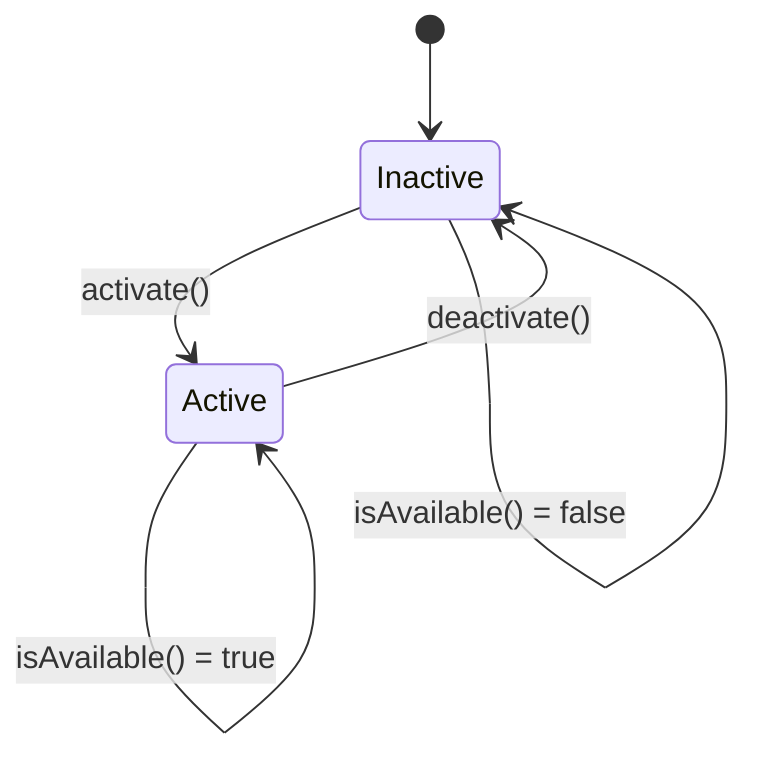
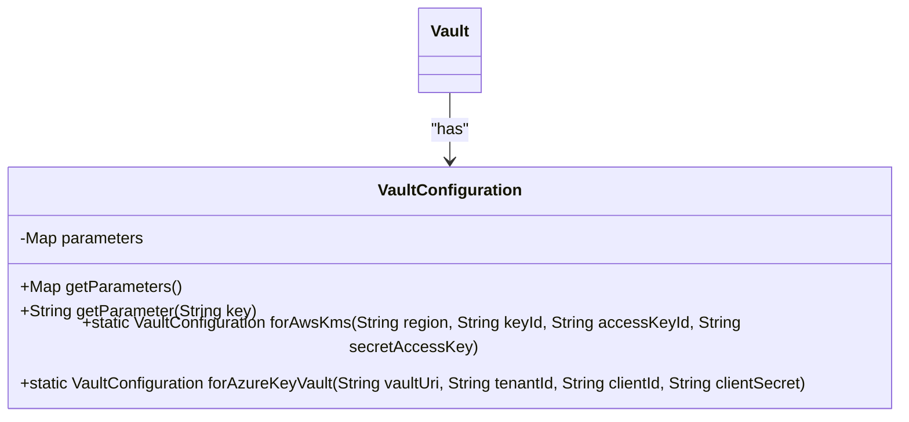
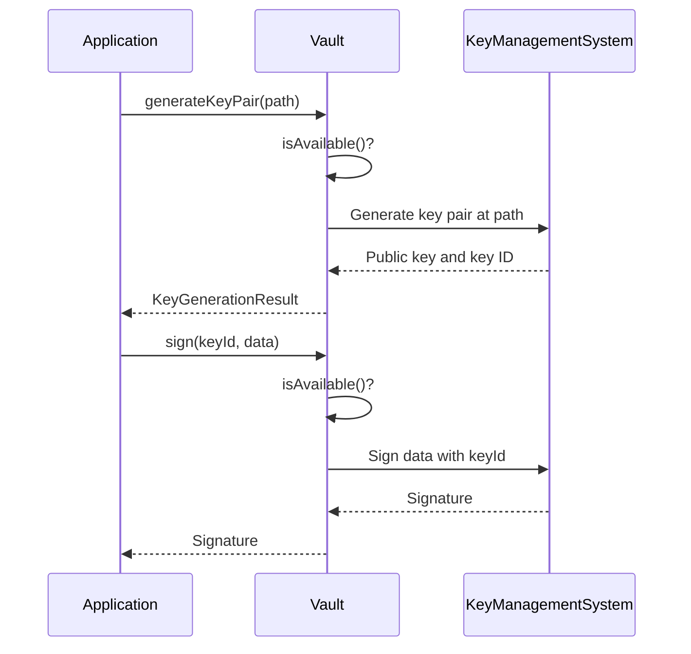
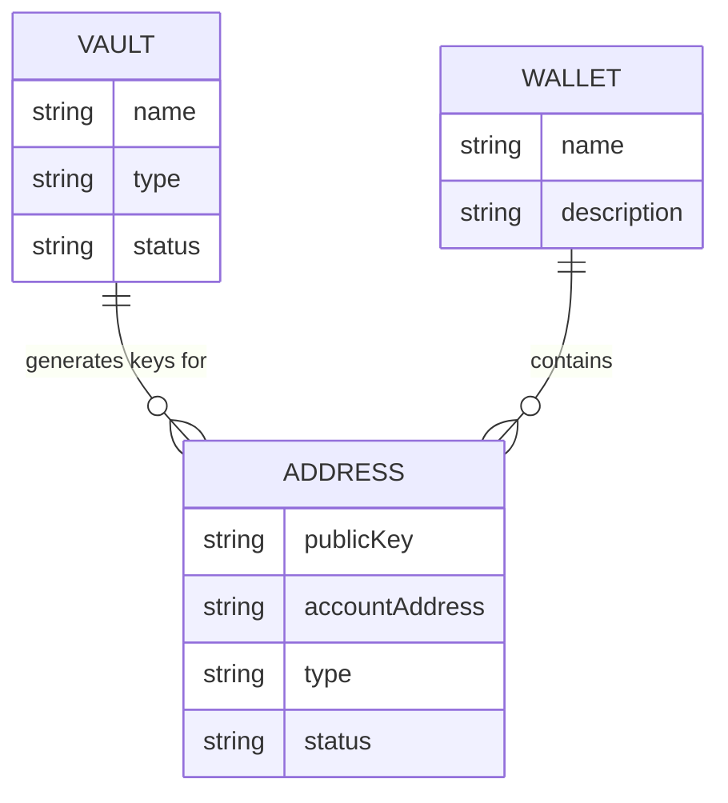

# Vault

<cite>
**Referenced Files in This Document**   
- [Vault.java](file://src/main/java/dev/bloco/wallet/hub/domain/model/vault/Vault.java)
- [VaultType.java](file://src/main/java/dev/bloco/wallet/hub/domain/model/vault/VaultType.java)
- [VaultStatus.java](file://src/main/java/dev/bloco/wallet/hub/domain/model/vault/VaultStatus.java)
- [VaultConfiguration.java](file://src/main/java/dev/bloco/wallet/hub/domain/model/vault/VaultConfiguration.java)
- [VaultCreatedEvent.java](file://src/main/java/dev/bloco/wallet/hub/domain/event/vault/VaultCreatedEvent.java)
- [VaultStatusChangedEvent.java](file://src/main/java/dev/bloco/wallet/hub/domain/event/vault/VaultStatusChangedEvent.java)
- [KeyGenerationResult.java](file://src/main/java/dev/bloco/wallet/hub/domain/model/vault/KeyGenerationResult.java)
- [Wallet.java](file://src/main/java/dev/bloco/wallet/hub/domain/model/Wallet.java)
- [Address.java](file://src/main/java/dev/bloco/wallet/hub/domain/model/address/Address.java)
</cite>

## Table of Contents
1. [Vault Entity Overview](#vault-entity-overview)
2. [Core Fields and Configuration](#core-fields-and-configuration)
3. [VaultType Enum and Security Implications](#vaulttype-enum-and-security-implications)
4. [VaultStatus and Lifecycle Management](#vaultstatus-and-lifecycle-management)
5. [VaultConfiguration and Provider Integration](#vaultconfiguration-and-provider-integration)
6. [Cryptographic Operations](#cryptographic-operations)
7. [Relationships with Wallet and Address Entities](#relationships-with-wallet-and-address-entities)
8. [Security Best Practices and Failure Modes](#security-best-practices-and-failure-modes)

## Vault Entity Overview

The Vault entity serves as a central component in the bloco-wallet-java system for managing cryptographic key storage and operations. It acts as an abstraction layer over various key management systems, providing a unified interface for cryptographic operations while maintaining security and flexibility. The Vault class extends AggregateRoot, enabling it to participate in domain-driven design patterns and emit domain events for system-wide notifications.

The Vault entity is responsible for securely storing cryptographic keys, managing their lifecycle, and providing cryptographic operations such as key generation and digital signatures. It integrates with external key management systems through configurable providers, allowing the system to support multiple security architectures from hardware security modules to cloud-based key management services.

**Section sources**
- [Vault.java](file://src/main/java/dev/bloco/wallet/hub/domain/model/vault/Vault.java#L8-L96)

## Core Fields and Configuration

The Vault entity contains several core fields that define its identity, type, configuration, and operational status. These fields are encapsulated within the class and accessed through getter methods, maintaining proper object-oriented principles.

The `name` field provides a human-readable identifier for the vault, allowing administrators and users to distinguish between different vault instances. The `type` field references the VaultType enum, specifying which key management system the vault interfaces with (e.g., HSM, AWS KMS). The `configuration` field holds provider-specific parameters through the VaultConfiguration class, which contains the necessary credentials and settings for connecting to the external key management service. Finally, the `status` field tracks the operational state of the vault through the VaultStatus enum, indicating whether the vault is currently active and available for cryptographic operations.

These fields are initialized through the static factory method `create()`, which ensures proper construction and validation of the vault instance before it becomes available for use.

**Section sources**
- [Vault.java](file://src/main/java/dev/bloco/wallet/hub/domain/model/vault/Vault.java#L10-L12)

## VaultType Enum and Security Implications

The VaultType enum defines the supported key management systems that the vault can interface with, providing a type-safe way to specify the underlying cryptographic infrastructure. The enum includes five distinct types: HSM (Hardware Security Module), AWS_KMS (Amazon Web Services Key Management Service), AZURE_KEY_VAULT (Microsoft Azure Key Vault), GOOGLE_CLOUD_KMS (Google Cloud Key Management Service), and SOFTWARE (software-based key storage).

Each vault type carries distinct security implications. HSM provides the highest level of security by storing keys in dedicated hardware that prevents extraction, making it ideal for high-value assets. Cloud-based solutions like AWS_KMS, AZURE_KEY_VAULT, and GOOGLE_CLOUD_KMS offer robust security with additional benefits like audit logging, access control, and geographic redundancy, while still protecting keys from extraction. The SOFTWARE type stores keys in software, which is less secure but may be appropriate for development or low-risk scenarios where convenience outweighs security requirements.

The choice of vault type directly impacts the security posture of the entire system, as it determines how cryptographic keys are protected against unauthorized access, extraction, and tampering.

**Section sources**
- [VaultType.java](file://src/main/java/dev/bloco/wallet/hub/domain/model/vault/VaultType.java#L2-L8)

## VaultStatus and Lifecycle Management

The VaultStatus enum defines the operational states of a vault, with two possible values: ACTIVE and INACTIVE. This simple state model enables straightforward lifecycle management while ensuring that cryptographic operations can only be performed on active vaults.

The Vault class provides lifecycle methods `activate()` and `deactivate()` to transition between these states. The `activate()` method changes the vault status from INACTIVE to ACTIVE, allowing cryptographic operations to proceed. Conversely, the `deactivate()` method transitions the vault to the INACTIVE state, preventing any further cryptographic operations. Both methods include guards to prevent redundant state transitions and emit VaultStatusChangedEvent domain events when the status actually changes, enabling other system components to react to vault availability changes.

The `isAvailable()` method provides a convenient check for vault availability, returning true only when the vault status is ACTIVE. This method is used as a precondition check in all cryptographic operations to ensure that operations are only performed on available vaults.

**Diagram sources**
- [Vault.java](file://src/main/java/dev/bloco/wallet/hub/domain/model/vault/Vault.java#L57-L75)
- [VaultStatus.java](file://src/main/java/dev/bloco/wallet/hub/domain/model/vault/VaultStatus.java#L2-L5)

**Section sources**
- [Vault.java](file://src/main/java/dev/bloco/wallet/hub/domain/model/vault/Vault.java#L57-L75)
- [VaultStatus.java](file://src/main/java/dev/bloco/wallet/hub/domain/model/vault/VaultStatus.java#L2-L5)

## VaultConfiguration and Provider Integration

The VaultConfiguration class serves as an immutable holder of provider-specific parameters required to connect to and authenticate with external key management systems. Implemented as a final class with a private field for parameters, it ensures configuration integrity and thread safety. The parameters are stored in an unmodifiable map, preventing external modification after creation.

The class provides factory methods for common cloud providers: `forAwsKms()` for AWS KMS and `forAzureKeyVault()` for Azure Key Vault. These methods accept provider-specific credentials and settings, construct the appropriate parameter map, and return a new VaultConfiguration instance. This approach simplifies configuration for supported providers while maintaining flexibility for other types.

The `getParameters()` method returns an unmodifiable view of the configuration parameters, while `getParameter(String key)` allows retrieval of individual parameter values by key. This design enables the vault implementation to access configuration details without exposing the underlying mutable structure.

**Diagram sources**
- [VaultConfiguration.java](file://src/main/java/dev/bloco/wallet/hub/domain/model/vault/VaultConfiguration.java#L6-L40)
- [Vault.java](file://src/main/java/dev/bloco/wallet/hub/domain/model/vault/Vault.java#L11-L12)

**Section sources**
- [VaultConfiguration.java](file://src/main/java/dev/bloco/wallet/hub/domain/model/vault/VaultConfiguration.java#L6-L40)

## Cryptographic Operations

The Vault entity provides two primary cryptographic operations: `generateKeyPair()` and `sign()`. Both methods include preconditions to ensure the vault is available before performing operations, throwing IllegalStateException if the vault is not in ACTIVE status.

The `generateKeyPair(String path)` method generates a new cryptographic key pair within the vault at the specified path. This operation returns a KeyGenerationResult record containing the public key and key identifier. The path parameter allows for hierarchical organization of keys within the vault, supporting use cases where different applications or purposes require separate key namespaces.

The `sign(String keyId, byte[] data)` method performs digital signature operations using a specified key. It takes a key identifier and the data to be signed, returning the signature as a byte array. This method enables the system to sign transactions, messages, or other data without exposing private keys to the application layer.

Both operations are designed to be implemented according to the specific vault type, with the actual cryptographic processing delegated to the underlying key management system. This abstraction ensures that private keys never leave the secure environment of the vault, whether it's a hardware module or cloud service.

**Diagram sources**
- [Vault.java](file://src/main/java/dev/bloco/wallet/hub/domain/model/vault/Vault.java#L77-L95)
- [KeyGenerationResult.java](file://src/main/java/dev/bloco/wallet/hub/domain/model/vault/KeyGenerationResult.java#L1-L3)

**Section sources**
- [Vault.java](file://src/main/java/dev/bloco/wallet/hub/domain/model/vault/Vault.java#L77-L95)
- [KeyGenerationResult.java](file://src/main/java/dev/bloco/wallet/hub/domain/model/vault/KeyGenerationResult.java#L1-L3)

## Relationships with Wallet and Address Entities

The Vault entity integrates with the Wallet and Address entities to provide secure key management for blockchain operations. While the current implementation doesn't show direct associations in the code, the relationship is established through the key management workflow where vaults generate keys that are then associated with wallet addresses.

When a new address is created in a wallet, the system can use an available vault to generate a cryptographic key pair. The public key from this pair becomes part of the address, while the private key remains securely stored in the vault. This separation ensures that private keys are never exposed to the application or stored in less secure locations.

The Wallet entity manages a collection of addresses through their UUIDs, while the Address entity contains the public key and account address derived from the corresponding private key in the vault. This architecture enables the system to perform cryptographic operations through the vault while maintaining a clean separation between key storage and address management.

**Diagram sources**
- [Vault.java](file://src/main/java/dev/bloco/wallet/hub/domain/model/vault/Vault.java#L8-L96)
- [Wallet.java](file://src/main/java/dev/bloco/wallet/hub/domain/model/Wallet.java#L23-L121)
- [Address.java](file://src/main/java/dev/bloco/wallet/hub/domain/model/address/Address.java#L11-L132)

**Section sources**
- [Vault.java](file://src/main/java/dev/bloco/wallet/hub/domain/model/vault/Vault.java#L8-L96)
- [Wallet.java](file://src/main/java/dev/bloco/wallet/hub/domain/model/Wallet.java#L23-L121)
- [Address.java](file://src/main/java/dev/bloco/wallet/hub/domain/model/address/Address.java#L11-L132)

## Security Best Practices and Failure Modes

The Vault implementation follows several security best practices to protect cryptographic keys and ensure system integrity. Keys are never exposed outside the vault, with private keys remaining within the secure boundary of the underlying key management system. The use of immutable VaultConfiguration prevents configuration tampering, while the status management system ensures that operations only proceed on properly activated vaults.

Failure modes are handled through appropriate exception throwing and domain event emission. When a vault is not available, cryptographic operations throw IllegalStateException with descriptive messages. Status changes emit VaultStatusChangedEvent, allowing monitoring systems to detect and respond to availability changes. Vault creation emits VaultCreatedEvent, providing audit trail capabilities.

Security best practices include using hardware or cloud-based key management systems over software storage, properly securing configuration credentials, rotating keys according to security policies, and monitoring vault operations for suspicious activity. The system should also implement proper access controls to restrict who can create, modify, or use vaults, and maintain comprehensive audit logs of all cryptographic operations.

**Section sources**
- [Vault.java](file://src/main/java/dev/bloco/wallet/hub/domain/model/vault/Vault.java#L77-L95)
- [VaultCreatedEvent.java](file://src/main/java/dev/bloco/wallet/hub/domain/event/vault/VaultCreatedEvent.java#L7-L24)
- [VaultStatusChangedEvent.java](file://src/main/java/dev/bloco/wallet/hub/domain/event/vault/VaultStatusChangedEvent.java#L7-L30)