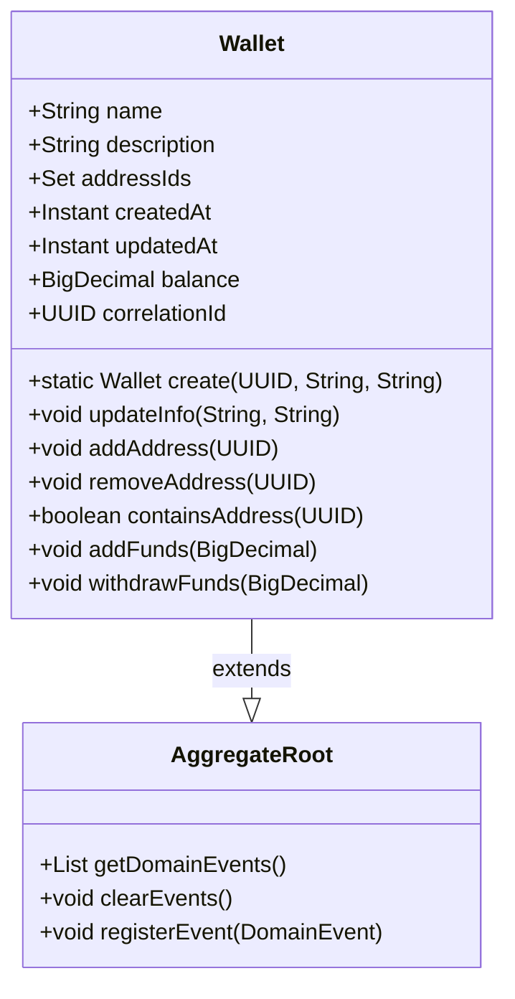
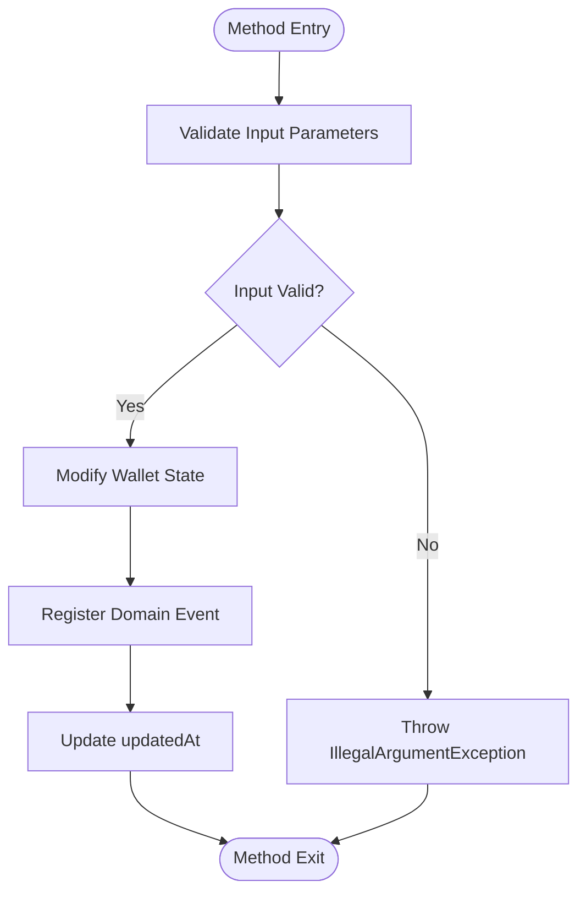
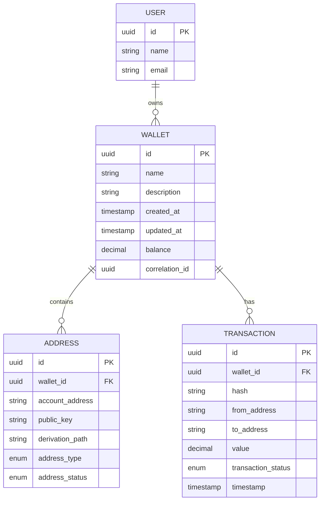

# Wallet

<cite>
**Referenced Files in This Document**   
- [Wallet.java](file://src/main/java/dev/bloco/wallet/hub/domain/model/Wallet.java)
- [AggregateRoot.java](file://src/main/java/dev/bloco/wallet/hub/domain/model/common/AggregateRoot.java)
- [WalletCreatedEvent.java](file://src/main/java/dev/bloco/wallet/hub/domain/event/wallet/WalletCreatedEvent.java)
- [WalletUpdatedEvent.java](file://src/main/java/dev/bloco/wallet/hub/domain/event/wallet/WalletUpdatedEvent.java)
- [FundsAddedEvent.java](file://src/main/java/dev/bloco/wallet/hub/domain/event/wallet/FundsAddedEvent.java)
- [FundsWithdrawnEvent.java](file://src/main/java/dev/bloco/wallet/hub/domain/event/wallet/FundsWithdrawnEvent.java)
- [AddressAddedToWalletEvent.java](file://src/main/java/dev/bloco/wallet/hub/domain/event/wallet/AddressAddedToWalletEvent.java)
- [AddressRemovedFromWalletEvent.java](file://src/main/java/dev/bloco/wallet/hub/domain/event/wallet/AddressRemovedFromWalletEvent.java)
- [Address.java](file://src/main/java/dev/bloco/wallet/hub/domain/model/address/Address.java)
- [Transaction.java](file://src/main/java/dev/bloco/wallet/hub/domain/model/transaction/Transaction.java)
- [User.java](file://src/main/java/dev/bloco/wallet/hub/domain/model/user/User.java)
- [CreateWalletUseCase.java](file://src/main/java/dev/bloco/wallet/hub/usecase/CreateWalletUseCase.java)
- [AddFundsUseCase.java](file://src/main/java/dev/bloco/wallet/hub/usecase/AddFundsUseCase.java)
- [WithdrawFundsUseCase.java](file://src/main/java/dev/bloco/wallet/hub/usecase/WithdrawFundsUseCase.java)
- [KafkaEventProducer.java](file://src/main/java/dev/bloco/wallet/hub/infra/adapter/event/producer/KafkaEventProducer.java)
- [WalletCreatedEventConsumer.java](file://src/main/java/dev/bloco/wallet/hub/infra/adapter/event/consumer/WalletCreatedEventConsumer.java)
</cite>

## Table of Contents
1. [Introduction](#introduction)
2. [Core Fields](#core-fields)
3. [Inheritance and Domain Events](#inheritance-and-domain-events)
4. [Static Factory Method: create()](#static-factory-method-create)
5. [Lifecycle Methods](#lifecycle-methods)
6. [Entity Relationships](#entity-relationships)
7. [Balance Management Logic](#balance-management-logic)
8. [Immutability Patterns](#immutability-patterns)
9. [Domain Event Flow with Kafka](#domain-event-flow-with-kafka)
10. [Sample Usage Scenarios](#sample-usage-scenarios)
11. [Error Handling](#error-handling)
12. [Conclusion](#conclusion)

## Introduction
The Wallet entity in the bloco-wallet-java application serves as a central domain model for managing digital wallet operations. It encapsulates financial data, user-defined metadata, and relationships with blockchain addresses. The Wallet class follows domain-driven design principles, acting as an aggregate root that maintains consistency across its internal state and emits domain events to communicate changes to the wider system. This documentation provides a comprehensive overview of the Wallet entity's structure, behavior, and integration points within the application architecture.

## Core Fields
The Wallet entity contains several key fields that define its state and behavior:

- **id**: A UUID that uniquely identifies the wallet instance, inherited from the Entity base class.
- **name**: A string representing the user-defined name of the wallet.
- **description**: A string providing additional details about the wallet's purpose or usage.
- **addressIds**: A set of UUIDs referencing Address entities associated with this wallet.
- **createdAt**: An Instant timestamp capturing when the wallet was created, set during instantiation.
- **updatedAt**: An Instant timestamp updated whenever mutable fields are modified.
- **balance**: A BigDecimal representing the current monetary value held in the wallet, initialized to zero.
- **correlationId**: A UUID used to trace operations and events associated with this wallet across distributed systems.

These fields collectively define the wallet's identity, state, and relationships within the domain model.

**Section sources**
- [Wallet.java](file://src/main/java/dev/bloco/wallet/hub/domain/model/Wallet.java#L27-L33)

## Inheritance and Domain Events
The Wallet class extends the AggregateRoot abstract class, establishing it as a domain aggregate that manages transactional consistency and domain event publication. The AggregateRoot class provides essential functionality for event-driven architecture:

- **Event Registration**: The `registerEvent()` method allows Wallet instances to record domain events that occur during their lifecycle.
- **Event Retrieval**: The `getDomainEvents()` method returns an unmodifiable list of events that have been registered but not yet published.
- **Event Clearing**: The `clearEvents()` method removes all recorded events after they have been successfully published.

This inheritance enables the Wallet to follow the domain events pattern, where state changes are captured as events before being published to external systems via Kafka. The event-driven approach ensures loose coupling between components and provides an audit trail of all wallet operations.



**Diagram sources**
- [AggregateRoot.java](file://src/main/java/dev/bloco/wallet/hub/domain/model/common/AggregateRoot.java#L9-L27)
- [Wallet.java](file://src/main/java/dev/bloco/wallet/hub/domain/model/Wallet.java#L23-L121)

## Static Factory Method: create()
The Wallet class provides a static factory method `create()` that encapsulates the logic for instantiating new wallet instances. This method takes three parameters: a UUID for the wallet ID, a name string, and a description string. It returns a fully initialized Wallet object with default values for createdAt, updatedAt, and balance.

Crucially, the create method also registers a WalletCreatedEvent, signaling that a new wallet has been added to the system. This event contains the wallet's ID and correlation ID, enabling downstream systems to react to the wallet's creation. The factory method pattern ensures consistent object creation and separates the concerns of construction from business logic.

**Section sources**
- [Wallet.java](file://src/main/java/dev/bloco/wallet/hub/domain/model/Wallet.java#L44-L48)

## Lifecycle Methods
The Wallet entity exposes several methods that manage its lifecycle and state transitions:

### updateInfo()
This method updates the wallet's name and description fields, sets the updatedAt timestamp to the current instant, and registers a WalletUpdatedEvent to notify the system of the change.

### addAddress() and removeAddress()
These methods modify the set of address IDs associated with the wallet. When an address is added or removed, the updatedAt timestamp is updated. The methods use the Set collection's return value to determine if the operation actually changed the state before updating the timestamp.

### addFunds() and withdrawFunds()
These methods manage the wallet's balance by adding or subtracting funds. Both include validation rules to prevent invalid operations and emit corresponding domain events when successful.



**Diagram sources**
- [Wallet.java](file://src/main/java/dev/bloco/wallet/hub/domain/model/Wallet.java#L63-L80)
- [Wallet.java](file://src/main/java/dev/bloco/wallet/hub/domain/model/Wallet.java#L95-L101)
- [Wallet.java](file://src/main/java/dev/bloco/wallet/hub/domain/model/Wallet.java#L114-L120)

**Section sources**
- [Wallet.java](file://src/main/java/dev/bloco/wallet/hub/domain/model/Wallet.java#L63-L80)
- [Wallet.java](file://src/main/java/dev/bloco/wallet/hub/domain/model/Wallet.java#L95-L101)
- [Wallet.java](file://src/main/java/dev/bloco/wallet/hub/domain/model/Wallet.java#L114-L120)

## Entity Relationships
The Wallet entity maintains relationships with several other domain objects:

- **Address**: A one-to-many relationship where a wallet can contain multiple addresses, each identified by a UUID in the addressIds set. This relationship enables the wallet to manage multiple blockchain addresses under a single logical unit.
- **Transaction**: While not directly referenced in the Wallet class, transactions are implicitly related through fund operations. When funds are added or withdrawn, corresponding Transaction entities are created to record the movement of value.
- **User**: The Wallet is conceptually associated with a User entity, though this relationship is managed at the application layer rather than through direct object references. The CreateWalletUseCase accepts a userId parameter to establish this connection.

These relationships form the core of the wallet management system, allowing users to organize their digital assets and track financial activities.



**Diagram sources**
- [Wallet.java](file://src/main/java/dev/bloco/wallet/hub/domain/model/Wallet.java#L27-L33)
- [Address.java](file://src/main/java/dev/bloco/wallet/hub/domain/model/address/Address.java#L11-L132)
- [Transaction.java](file://src/main/java/dev/bloco/wallet/hub/domain/model/transaction/Transaction.java#L20-L210)
- [User.java](file://src/main/java/dev/bloco/wallet/hub/domain/model/user/User.java#L1-L32)

## Balance Management Logic
The Wallet entity implements precise balance management using BigDecimal to avoid floating-point arithmetic errors common in financial applications. The balance starts at zero when a wallet is created and can be modified through two primary methods:

- **addFunds()**: Increases the balance by a specified amount. The method validates that the amount is greater than zero before performing the addition.
- **withdrawFunds()**: Decreases the balance by a specified amount. The method validates that the amount is greater than zero and does not exceed the current balance.

Both methods use BigDecimal's arithmetic operations to ensure precision in financial calculations. The balance is stored as a mutable field within the Wallet instance and is updated in memory before being persisted to the database through the WalletRepository.

**Section sources**
- [Wallet.java](file://src/main/java/dev/bloco/wallet/hub/domain/model/Wallet.java#L95-L101)
- [Wallet.java](file://src/main/java/dev/bloco/wallet/hub/domain/model/Wallet.java#L114-L120)

## Immutability Patterns
The Wallet class employs a hybrid approach to immutability, where certain fields are immutable while others can be modified through controlled methods:

- **Immutable Fields**: The id and createdAt fields are final and cannot be changed after object construction.
- **Mutable Fields**: The name, description, updatedAt, and balance fields can be modified through specific methods that include validation and side effects.
- **Collection Immutability**: The addressIds set is encapsulated and exposed through an unmodifiable view using Collections.unmodifiableSet(), preventing external modification while allowing internal changes through addAddress() and removeAddress() methods.

This pattern ensures that the wallet's identity and creation time remain constant while allowing necessary state changes to occur in a controlled manner.

**Section sources**
- [Wallet.java](file://src/main/java/dev/bloco/wallet/hub/domain/model/Wallet.java#L29-L31)
- [Wallet.java](file://src/main/java/dev/bloco/wallet/hub/domain/model/Wallet.java#L59-L61)

## Domain Event Flow with Kafka
The Wallet entity participates in an event-driven architecture where state changes are communicated to external systems through Kafka. When a significant operation occurs, such as wallet creation or fund modification, the corresponding use case retrieves the domain events from the Wallet instance and publishes them through the DomainEventPublisher.

The KafkaEventProducer class subscribes to these events and persists them in an outbox table for reliable delivery. A scheduled process then reads unsent events from the outbox and forwards them to Kafka topics. This outbox pattern ensures that events are not lost during system failures and provides transactional consistency between the wallet state and event publication.

Consumers like WalletCreatedEventConsumer listen for these events and can trigger additional business processes, such as updating search indexes or sending notifications.

```mermaid
sequenceDiagram
    participant UseCase as CreateWalletUseCase
    participant Wallet as Wallet
    participant Repository as WalletRepository
    participant Publisher as DomainEventPublisher
    participant Producer as KafkaEventProducer
    participant Outbox as OutboxService
    participant Kafka as Kafka
    
    UseCase->>Wallet: create(id, name, desc)
    Wallet->>Wallet: registerEvent(WalletCreatedEvent)
    UseCase->>Repository: save(wallet)
    UseCase->>Publisher: publish(event)
    Publisher->>Producer: produceWalletCreatedEvent()
    Producer->>Outbox: saveOutboxEvent()
    loop Every 5 seconds
        Producer->>Outbox: get