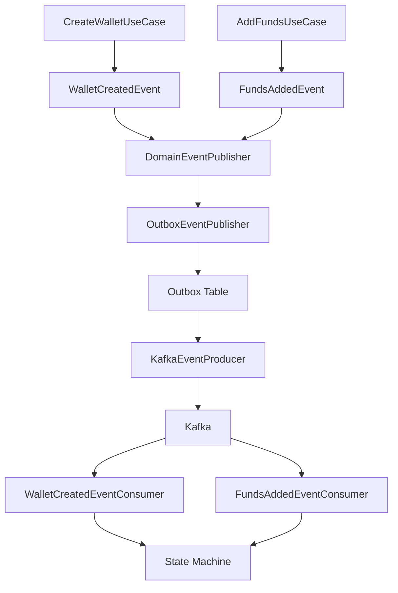
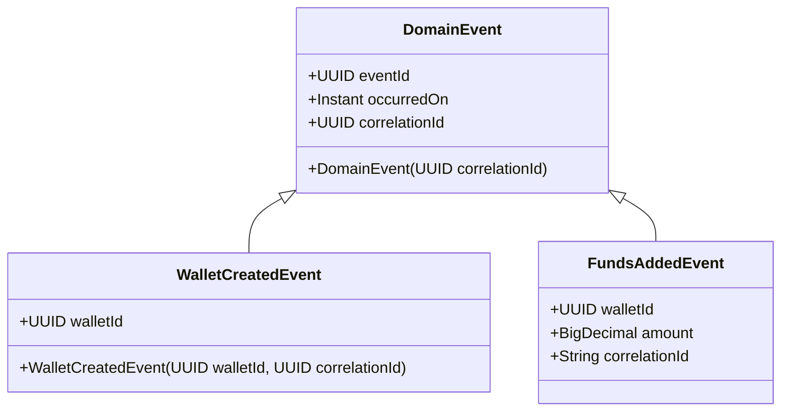
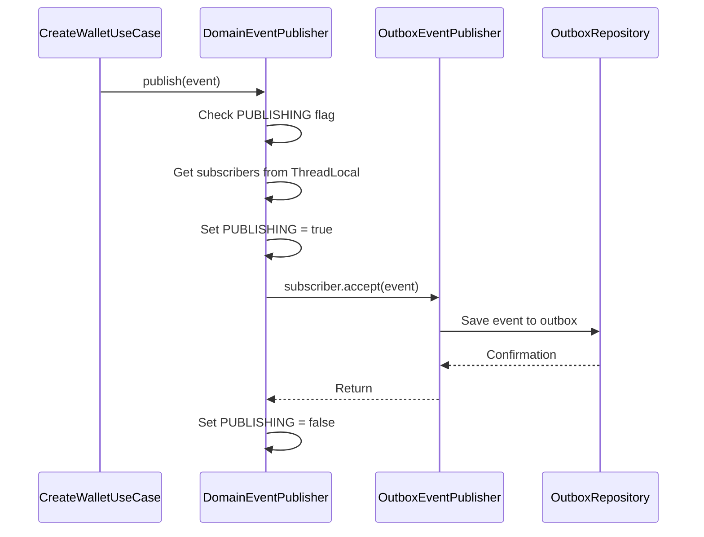
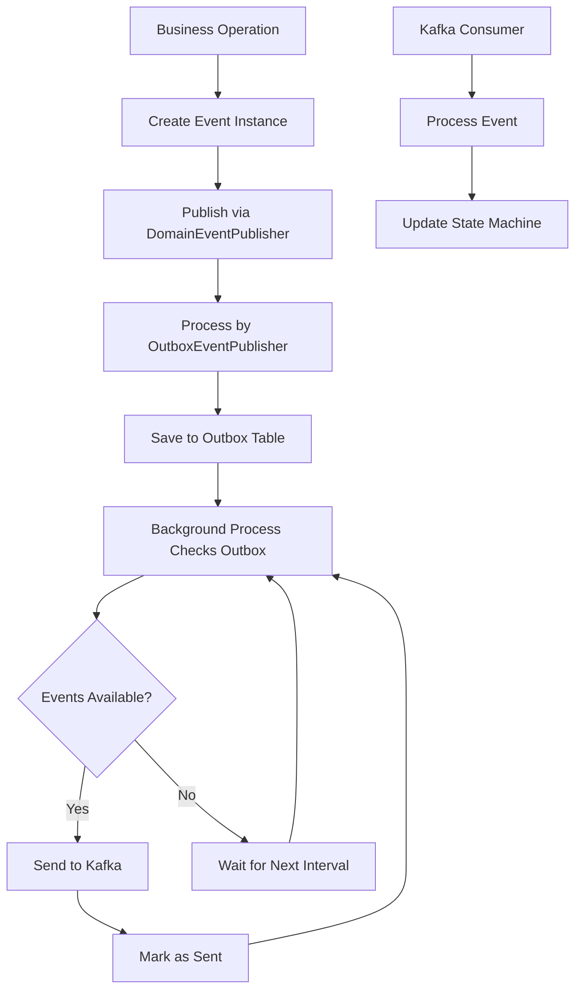
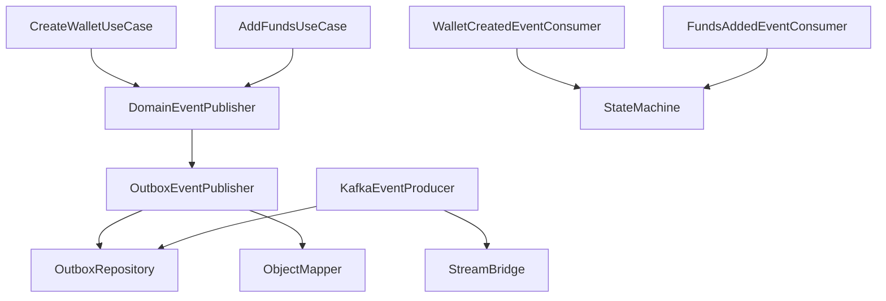

# Domain Events

<cite>
**Referenced Files in This Document**   
- [DomainEvent.java](file://src/main/java/dev/bloco/wallet/hub/domain/event/common/DomainEvent.java)
- [DomainEventPublisher.java](file://src/main/java/dev/bloco/wallet/hub/domain/event/common/DomainEventPublisher.java)
- [WalletCreatedEvent.java](file://src/main/java/dev/bloco/wallet/hub/domain/event/wallet/WalletCreatedEvent.java)
- [FundsAddedEvent.java](file://src/main/java/dev/bloco/wallet/hub/domain/event/wallet/FundsAddedEvent.java)
- [CreateWalletUseCase.java](file://src/main/java/dev/bloco/wallet/hub/usecase/CreateWalletUseCase.java)
- [AddFundsUseCase.java](file://src/main/java/dev/bloco/wallet/hub/usecase/AddFundsUseCase.java)
- [Wallet.java](file://src/main/java/dev/bloco/wallet/hub/domain/model/Wallet.java)
- [AggregateRoot.java](file://src/main/java/dev/bloco/wallet/hub/domain/model/common/AggregateRoot.java)
- [OutboxEventPublisher.java](file://src/main/java/dev/bloco/wallet/hub/infra/adapter/event/OutboxEventPublisher.java)
- [KafkaEventProducer.java](file://src/main/java/dev/bloco/wallet/hub/infra/adapter/event/producer/KafkaEventProducer.java)
- [WalletCreatedEventConsumer.java](file://src/main/java/dev/bloco/wallet/hub/infra/adapter/event/consumer/WalletCreatedEventConsumer.java)
- [FundsAddedEventConsumer.java](file://src/main/java/dev/bloco/wallet/hub/infra/adapter/event/consumer/FundsAddedEventConsumer.java)
</cite>

## Table of Contents
1. [Introduction](#introduction)
2. [Core Components](#core-components)
3. [Architecture Overview](#architecture-overview)
4. [Detailed Component Analysis](#detailed-component-analysis)
5. [Dependency Analysis](#dependency-analysis)
6. [Performance Considerations](#performance-considerations)
7. [Troubleshooting Guide](#troubleshooting-guide)
8. [Conclusion](#conclusion)

## Introduction
This document provides a comprehensive analysis of the domain events implementation in the bloco-wallet-java application. The system uses domain-driven design principles to decouple business logic from infrastructure concerns through a well-defined event publishing mechanism. The implementation centers around the DomainEvent base class and DomainEventPublisher utility, enabling use cases like wallet creation and fund addition to emit events that can be processed by downstream consumers. This documentation covers the structure, lifecycle, and best practices for domain events in the system.

## Core Components

The domain events system in bloco-wallet-java consists of several key components that work together to enable event-driven architecture. The foundation is built on the DomainEvent abstract class that serves as the base for all domain events in the system. Each event carries metadata such as eventId, occurredOn timestamp, and correlationId to support tracing and debugging. The DomainEventPublisher provides a static, thread-local based subscription model that allows synchronous event publication within the same transactional context. Concrete events like WalletCreatedEvent and FundsAddedEvent extend the base DomainEvent class and carry specific domain data relevant to their business context. Use cases such as CreateWalletUseCase and AddFundsUseCase are responsible for creating and publishing these events as part of their execution flow.

**Section sources**
- [DomainEvent.java](file://src/main/java/dev/bloco/wallet/hub/domain/event/common/DomainEvent.java#L7-L18)
- [DomainEventPublisher.java](file://src/main/java/dev/bloco/wallet/hub/domain/event/common/DomainEventPublisher.java#L6-L45)
- [WalletCreatedEvent.java](file://src/main/java/dev/bloco/wallet/hub/domain/event/wallet/WalletCreatedEvent.java#L1-L38)
- [FundsAddedEvent.java](file://src/main/java/dev/bloco/wallet/hub/domain/event/wallet/FundsAddedEvent.java#L1-L26)

## Architecture Overview

The domain events architecture follows a clear separation between domain logic and infrastructure concerns. Events are created and published within the domain layer during use case execution, then processed by infrastructure components for persistence and external communication. The flow begins with aggregate roots or use cases creating event instances and registering them for publication. The DomainEventPublisher handles the synchronous dispatch of these events to registered subscribers within the same thread and transaction context. Infrastructure adapters then persist events to an outbox table via OutboxEventPublisher, ensuring reliable delivery even in the face of system failures. Finally, background processes like KafkaEventProducer's scheduled task deliver events to external messaging systems.

**Diagram sources**
- [CreateWalletUseCase.java](file://src/main/java/dev/bloco/wallet/hub/usecase/CreateWalletUseCase.java#L1-L41)
- [AddFundsUseCase.java](file://src/main/java/dev/bloco/wallet/hub/usecase/AddFundsUseCase.java#L1-L58)
- [OutboxEventPublisher.java](file://src/main/java/dev/bloco/wallet/hub/infra/adapter/event/OutboxEventPublisher.java#L30-L74)
- [KafkaEventProducer.java](file://src/main/java/dev/bloco/wallet/hub/infra/adapter/event/producer/KafkaEventProducer.java#L29-L151)

## Detailed Component Analysis

### Domain Event Base Class
The DomainEvent abstract class serves as the foundation for all domain events in the system, providing common metadata and establishing a consistent event structure across the application. It includes essential fields like eventId for unique identification, occurredOn for temporal context, and correlationId for tracing related operations across system boundaries. The protected constructor ensures that all events are created with a correlation identifier, promoting better observability in distributed scenarios. By extending this base class, concrete events inherit these fundamental properties while adding their specific domain data.

**Diagram sources**
- [DomainEvent.java](file://src/main/java/dev/bloco/wallet/hub/domain/event/common/DomainEvent.java#L7-L18)
- [WalletCreatedEvent.java](file://src/main/java/dev/bloco/wallet/hub/domain/event/wallet/WalletCreatedEvent.java#L1-L38)
- [FundsAddedEvent.java](file://src/main/java/dev/bloco/wallet/hub/domain/event/wallet/FundsAddedEvent.java#L1-L26)

### Event Publishing Mechanism
The DomainEventPublisher implements a thread-local based subscription model that enables synchronous event publication within the same transactional context. This static utility class maintains a ThreadLocal list of subscribers, ensuring that events are published to all registered consumers before the transaction completes. The implementation prevents subscription changes during event publication to maintain consistency and includes safeguards against reentrant publishing. The reset method allows for proper cleanup in testing scenarios, preventing state leakage between test cases. This design ensures that all side effects are processed synchronously, maintaining data consistency while still providing decoupling between producers and consumers.

**Diagram sources**
- [DomainEventPublisher.java](file://src/main/java/dev/bloco/wallet/hub/domain/event/common/DomainEventPublisher.java#L6-L45)
- [OutboxEventPublisher.java](file://src/main/java/dev/bloco/wallet/hub/infra/adapter/event/OutboxEventPublisher.java#L30-L74)

### Event Lifecycle and Flow
The lifecycle of a domain event in bloco-wallet-java follows a well-defined path from creation to external delivery. Events are first created within use cases or aggregate roots as a result of business operations. They are then published through the DomainEventPublisher, which synchronously dispatches them to all registered subscribers within the same transaction. The OutboxEventPublisher subscriber persists each event to an outbox database table, ensuring durability and providing a recovery mechanism in case of failures. A scheduled background process in KafkaEventProducer periodically checks for unsent events and delivers them to Kafka, marking them as sent upon successful delivery. External consumers then process these events to update state machines or trigger additional business processes.

**Diagram sources**
- [CreateWalletUseCase.java](file://src/main/java/dev/bloco/wallet/hub/usecase/CreateWalletUseCase.java#L1-L41)
- [OutboxEventPublisher.java](file://src/main/java/dev/bloco/wallet/hub/infra/adapter/event/OutboxEventPublisher.java#L30-L74)
- [KafkaEventProducer.java](file://src/main/java/dev/bloco/wallet/hub/infra/adapter/event/producer/KafkaEventProducer.java#L29-L151)

## Dependency Analysis

The domain events system demonstrates a clear separation of concerns with well-defined dependencies between components. The core domain layer depends only on the basic DomainEvent and DomainEventPublisher classes, maintaining independence from infrastructure concerns. Use cases depend on the DomainEventPublisher interface through dependency injection, allowing for easy testing and substitution. The infrastructure layer implements the publishing mechanism through OutboxEventPublisher, which depends on persistence components like OutboxRepository and serialization utilities like ObjectMapper. Event consumers in the infrastructure layer depend on messaging frameworks and state management systems, but these dependencies are isolated from the core domain logic. This architecture enables the system to evolve independently in different layers while maintaining the integrity of the domain model.

**Diagram sources**
- [CreateWalletUseCase.java](file://src/main/java/dev/bloco/wallet/hub/usecase/CreateWalletUseCase.java#L1-L41)
- [AddFundsUseCase.java](file://src/main/java/dev/bloco/wallet/hub/usecase/AddFundsUseCase.java#L1-L58)
- [OutboxEventPublisher.java](file://src/main/java/dev/bloco/wallet/hub/infra/adapter/event/OutboxEventPublisher.java#L30-L74)
- [KafkaEventProducer.java](file://src/main/java/dev/bloco/wallet/hub/infra/adapter/event/producer/KafkaEventProducer.java#L29-L151)

## Performance Considerations

The domain events implementation balances reliability with performance through several design choices. The synchronous publishing model ensures that all side effects are processed within the same transaction, maintaining data consistency at the cost of increased transaction duration. The use of ThreadLocal storage for subscribers provides fast access without synchronization overhead, but requires careful management to prevent memory leaks. The outbox pattern decouples event delivery from the main transaction, allowing the system to acknowledge user requests quickly while background processes handle external communication. The scheduled processing of the outbox (every 5 seconds) represents a trade-off between delivery latency and system load, preventing excessive database polling while still providing timely event delivery. For high-volume scenarios, this interval could be adjusted or replaced with a more responsive mechanism like database triggers or change data capture.

## Troubleshooting Guide

When debugging issues with domain events in bloco-wallet-java, several common problems should be considered. Event loss due to transaction rollbacks is a primary concern, as events published within a transaction that subsequently fails will not be persisted to the outbox table. This behavior is intentional and ensures consistency, but requires proper error handling in use cases. Missing events in Kafka can occur if the background process fails to deliver events from the outbox, which can be diagnosed by checking the sent status in the outbox table. NullPointerExceptions in event consumers often indicate missing correlation IDs, which are required for saga coordination. Testing event flows requires careful setup of the DomainEventPublisher's ThreadLocal state, and the reset method should be used in test teardown to prevent interference between test cases. Logging at both the publisher and consumer levels provides valuable insights into event flow and processing times.

**Section sources**
- [DomainEventPublisher.java](file://src/main/java/dev/bloco/wallet/hub/domain/event/common/DomainEventPublisher.java#L6-L45)
- [WalletCreatedEventConsumer.java](file://src/main/java/dev/bloco/wallet/hub/infra/adapter/event/consumer/WalletCreatedEventConsumer.java#L27-L68)
- [FundsAddedEventConsumer.java](file://src/main/java/dev/bloco/wallet/hub/infra/adapter/event/consumer/FundsAddedEventConsumer.java#L29-L79)

## Conclusion

The domain events implementation in bloco-wallet-java provides a robust foundation for event-driven architecture within the application. By leveraging a base DomainEvent class and a ThreadLocal-based publishing mechanism, the system achieves effective decoupling between business logic and infrastructure concerns while maintaining transactional consistency. The outbox pattern ensures reliable event delivery to external systems, and the clear separation between domain and infrastructure layers allows for independent evolution of different system components. When defining new domain events, developers should follow the established patterns of immutability, include appropriate correlation identifiers, and avoid side effects during event publication. Testing strategies should verify both the creation of expected events and their proper processing by consumers, ensuring the integrity of the event-driven workflows.