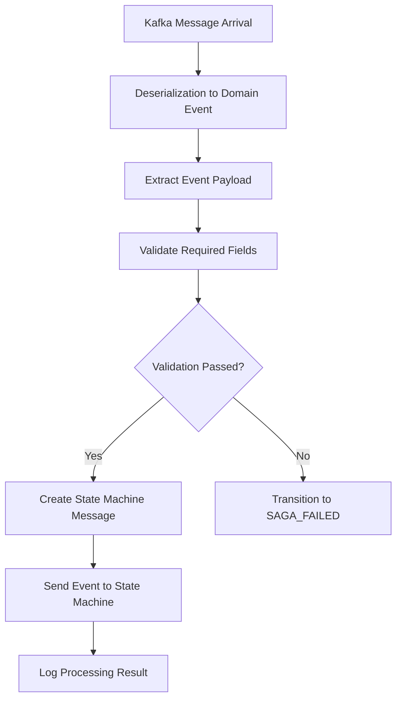
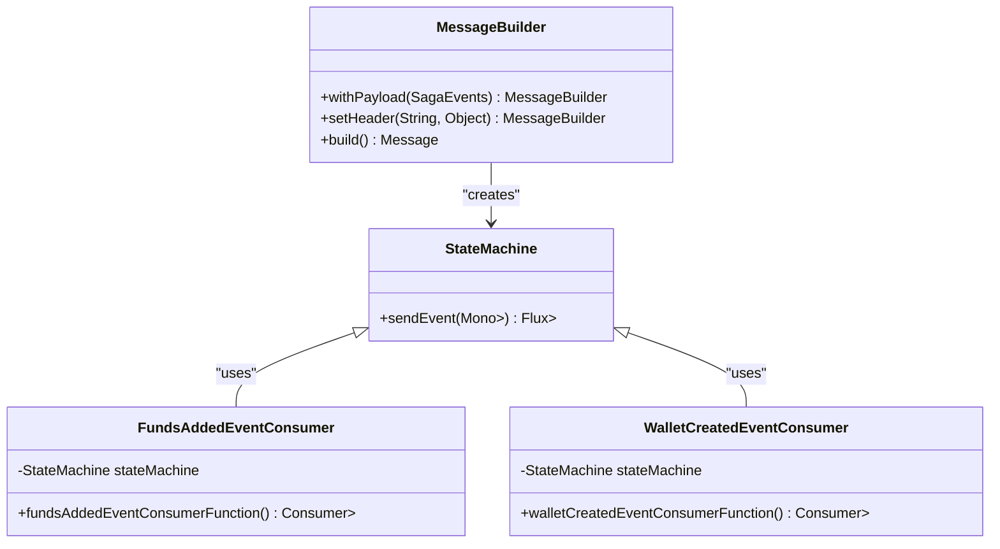
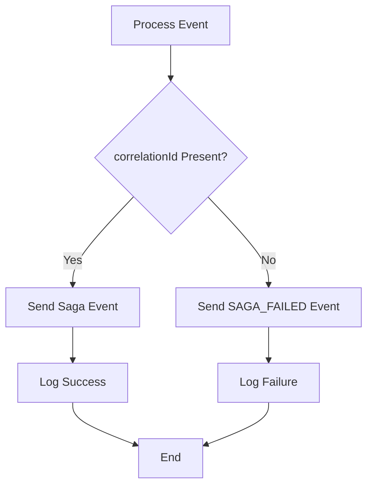
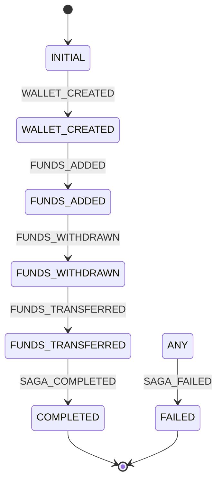
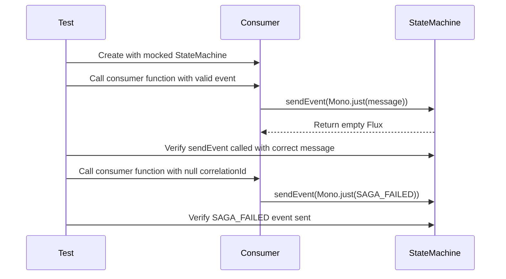

# Event Consumers

<cite>
**Referenced Files in This Document**   
- [FundsAddedEventConsumer.java](file://src/main/java/dev/bloco/wallet/hub/infra/adapter/event/consumer/FundsAddedEventConsumer.java)
- [WalletCreatedEventConsumer.java](file://src/main/java/dev/bloco/wallet/hub/infra/adapter/event/consumer/WalletCreatedEventConsumer.java)
- [SagaStateMachineConfig.java](file://src/main/java/dev/bloco/wallet/hub/infra/provider/data/config/SagaStateMachineConfig.java)
- [StandardSagaStateMachineConfig.java](file://src/main/java/dev/bloco/wallet/hub/infra/provider/data/config/StandardSagaStateMachineConfig.java)
- [FundsAddedEvent.java](file://src/main/java/dev/bloco/wallet/hub/domain/event/wallet/FundsAddedEvent.java)
- [WalletCreatedEvent.java](file://src/main/java/dev/bloco/wallet/hub/domain/event/wallet/WalletCreatedEvent.java)
- [StateMachineRepository.java](file://src/main/java/dev/bloco/wallet/hub/infra/provider/data/repository/StateMachineRepository.java)
- [FundsAddedEventConsumerTest.java](file://src/test/java/dev/bloco/wallet/hub/infra/adapter/event/consumer/FundsAddedEventConsumerTest.java)
- [WalletCreatedEventConsumerTest.java](file://src/test/java/dev/bloco/wallet/hub/infra/adapter/event/consumer/WalletCreatedEventConsumerTest.java)
</cite>

## Table of Contents
1. [Introduction](#introduction)
2. [Consumer Configuration and Bean Definition](#consumer-configuration-and-bean-definition)
3. [Message Processing Pipeline](#message-processing-pipeline)
4. [State Machine Integration](#state-machine-integration)
5. [Error Handling and Failure States](#error-handling-and-failure-states)
6. [Reactive Programming with Project Reactor](#reactive-programming-with-project-reactor)
7. [Saga State and Event Definitions](#saga-state-and-event-definitions)
8. [Adding New Consumers](#adding-new-consumers)
9. [Idempotency and Consumer Group Management](#idempotency-and-consumer-group-management)
10. [Testing Strategies](#testing-strategies)
11. [Debugging and Monitoring](#debugging-and-monitoring)
12. [Conclusion](#conclusion)

## Introduction

This document provides a comprehensive analysis of event consumers in the bloco-wallet-java application, focusing on how Spring Cloud Stream consumer functions process Kafka messages and drive saga workflows through Spring StateMachine. The system implements a distributed saga pattern where domain events trigger state transitions in a state machine, coordinating complex business processes across multiple services. This documentation details the implementation of event consumers, their integration with the state machine, error handling strategies, and best practices for extending the system.

## Consumer Configuration and Bean Definition

Event consumers in the bloco-wallet-java application are implemented as Spring configuration classes that define consumer functions as @Bean methods. These classes, such as FundsAddedEventConsumer and WalletCreatedEventConsumer, are responsible for processing specific domain events and triggering appropriate state transitions in the saga workflow.

The consumer functions are defined using Spring Cloud Stream's functional programming model, where each consumer is a `Consumer<Message<T>>` bean that processes incoming messages of a specific event type. The configuration classes are annotated with Spring stereotypes (@Configuration or @Component) to ensure they are detected during component scanning and their bean methods are properly registered in the application context.

**Section sources**
- [FundsAddedEventConsumer.java](file://src/main/java/dev/bloco/wallet/hub/infra/adapter/event/consumer/FundsAddedEventConsumer.java#L61-L78)
- [WalletCreatedEventConsumer.java](file://src/main/java/dev/bloco/wallet/hub/infra/adapter/event/consumer/WalletCreatedEventConsumer.java#L51-L67)

## Message Processing Pipeline

The message processing pipeline in the event consumers follows a consistent pattern across all consumer implementations. When a Kafka message arrives, it is automatically deserialized into the corresponding domain event object by Spring Cloud Stream's message conversion mechanism. The consumer function then extracts the event payload and processes it through a series of validation and state transition steps.

The pipeline begins with extracting the event from the message payload using `message.getPayload()`. Each consumer then validates the presence of required fields, particularly the correlationId, which is essential for tracking the saga workflow across distributed components. If validation passes, the consumer creates a state machine message with the appropriate saga event and correlation ID header, then sends it to the state machine for processing.

**Diagram sources**
- [FundsAddedEventConsumer.java](file://src/main/java/dev/bloco/wallet/hub/infra/adapter/event/consumer/FundsAddedEventConsumer.java#L61-L78)
- [WalletCreatedEventConsumer.java](file://src/main/java/dev/bloco/wallet/hub/infra/adapter/event/consumer/WalletCreatedEventConsumer.java#L51-L67)

**Section sources**
- [FundsAddedEventConsumer.java](file://src/main/java/dev/bloco/wallet/hub/infra/adapter/event/consumer/FundsAddedEventConsumer.java#L61-L78)
- [WalletCreatedEventConsumer.java](file://src/main/java/dev/bloco/wallet/hub/infra/adapter/event/consumer/WalletCreatedEventConsumer.java#L51-L67)

## State Machine Integration

The event consumers integrate with Spring StateMachine to drive saga workflows by sending events that trigger state transitions. Each consumer holds a reference to the state machine instance via constructor injection, allowing it to send events and drive the saga process forward.

When a valid event is processed, the consumer creates a state machine message using `MessageBuilder.withPayload()` and sets the appropriate saga event as the payload. The correlation ID from the domain event is added as a header to maintain context across state transitions. The message is then sent to the state machine using the `sendEvent()` method, which returns a reactive Mono that can be subscribed to for asynchronous processing.

The state machine is configured to persist its state using JPA, ensuring that saga state is maintained across application restarts. This persistence is configured through the `JpaPersistingStateMachineInterceptor` which uses the `StateMachineRepository` to store and retrieve state machine instances.

**Diagram sources**
- [FundsAddedEventConsumer.java](file://src/main/java/dev/bloco/wallet/hub/infra/adapter/event/consumer/FundsAddedEventConsumer.java#L61-L78)
- [WalletCreatedEventConsumer.java](file://src/main/java/dev/bloco/wallet/hub/infra/adapter/event/consumer/WalletCreatedEventConsumer.java#L51-L67)
- [SagaStateMachineConfig.java](file://src/main/java/dev/bloco/wallet/hub/infra/provider/data/config/SagaStateMachineConfig.java#L28-L117)

**Section sources**
- [FundsAddedEventConsumer.java](file://src/main/java/dev/bloco/wallet/hub/infra/adapter/event/consumer/FundsAddedEventConsumer.java#L61-L78)
- [WalletCreatedEventConsumer.java](file://src/main/java/dev/bloco/wallet/hub/infra/adapter/event/consumer/WalletCreatedEventConsumer.java#L51-L67)
- [SagaStateMachineConfig.java](file://src/main/java/dev/bloco/wallet/hub/infra/provider/data/config/SagaStateMachineConfig.java#L28-L117)

## Error Handling and Failure States

The event consumers implement robust error handling strategies to ensure saga integrity when processing fails. When mandatory fields are missing or validation fails, the consumers transition the saga to a SAGA_FAILED state to prevent inconsistent state.

For the `FundsAddedEventConsumer`, the code uses `Objects.requireNonNull()` to validate the presence of the correlationId. If the correlationId is null, a `NullPointerException` is caught, and the state machine is sent a `SAGA_FAILED` event. This ensures that incomplete or malformed events do not progress the saga workflow.

The `WalletCreatedEventConsumer` uses a more direct approach, checking if `event.getCorrelationId()` is not null before proceeding. If the correlationId is missing, it immediately sends a `SAGA_FAILED` event to the state machine without attempting further processing.

Both consumers log the failure reason, providing visibility into processing errors for monitoring and debugging purposes. The logging includes the specific error message or a descriptive message about the missing field, enabling operators to quickly identify and resolve issues.

**Diagram sources**
- [FundsAddedEventConsumer.java](file://src/main/java/dev/bloco/wallet/hub/infra/adapter/event/consumer/FundsAddedEventConsumer.java#L61-L78)
- [WalletCreatedEventConsumer.java](file://src/main/java/dev/bloco/wallet/hub/infra/adapter/event/consumer/WalletCreatedEventConsumer.java#L51-L67)

**Section sources**
- [FundsAddedEventConsumer.java](file://src/main/java/dev/bloco/wallet/hub/infra/adapter/event/consumer/FundsAddedEventConsumer.java#L61-L78)
- [WalletCreatedEventConsumer.java](file://src/main/java/dev/bloco/wallet/hub/infra/adapter/event/consumer/WalletCreatedEventConsumer.java#L51-L67)

## Reactive Programming with Project Reactor

The integration between event consumers and the state machine leverages Project Reactor's reactive programming model to handle asynchronous operations efficiently. When sending events to the state machine, the `sendEvent()` method returns a `Mono` that represents the asynchronous result of the operation.

The consumers use `Mono.just()` to wrap the state machine message, creating a reactive stream that can be processed asynchronously. The `subscribe()` method is called on the result to initiate the asynchronous processing, allowing the consumer to return immediately without blocking.

This reactive approach enables non-blocking I/O operations and efficient resource utilization, particularly important in high-throughput scenarios with many concurrent saga workflows. The use of reactive types also provides better error handling and composition capabilities, allowing for more sophisticated processing pipelines if needed.

While the current implementation uses a simple `subscribe()` call without additional operators, the reactive foundation allows for future enhancements such as error recovery strategies, retry mechanisms, or complex composition of multiple asynchronous operations.

**Section sources**
- [FundsAddedEventConsumer.java](file://src/main/java/dev/bloco/wallet/hub/infra/adapter/event/consumer/FundsAddedEventConsumer.java#L61-L78)
- [WalletCreatedEventConsumer.java](file://src/main/java/dev/bloco/wallet/hub/infra/adapter/event/consumer/WalletCreatedEventConsumer.java#L51-L67)

## Saga State and Event Definitions

The saga workflow is defined by two key enumerations: `SagaStates` and `SagaEvents`, which represent the possible states and events in the state machine. These definitions provide a clear contract for the saga workflow and ensure type safety in state transitions.

The `SagaStates` enum defines the lifecycle states of the saga, including:
- `INITIAL`: The starting state of the saga
- `WALLET_CREATED`: State after wallet creation
- `FUNDS_ADDED`: State after funds are added
- `FUNDS_WITHDRAWN`: State after funds are withdrawn
- `FUNDS_TRANSFERRED`: State after funds are transferred
- `COMPLETED`: Final success state
- `FAILED`: Final failure state
- `ANY`: Wildcard state for global transitions

The `SagaEvents` enum defines the events that trigger state transitions:
- `WALLET_CREATED`: Triggered when a wallet is created
- `FUNDS_ADDED`: Triggered when funds are added
- `FUNDS_WITHDRAWN`: Triggered when funds are withdrawn
- `FUNDS_TRANSFERRED`: Triggered when funds are transferred
- `SAGA_COMPLETED`: Triggered when the saga completes successfully
- `SAGA_FAILED`: Triggered when the saga fails

The state machine configuration establishes the valid transitions between these states based on the events, creating a directed graph of allowed workflow paths.

**Diagram sources**
- [SagaStateMachineConfig.java](file://src/main/java/dev/bloco/wallet/hub/infra/provider/data/config/SagaStateMachineConfig.java#L28-L117)
- [SagaEvents.java](file://src/main/java/dev/bloco/wallet/hub/infra/provider/data/config/SagaEvents.java#L20-L27)
- [SagaStates.java](file://src/main/java/dev/bloco/wallet/hub/infra/provider/data/config/SagaStates.java#L24-L33)

**Section sources**
- [SagaStateMachineConfig.java](file://src/main/java/dev/bloco/wallet/hub/infra/provider/data/config/SagaStateMachineConfig.java#L28-L117)
- [SagaEvents.java](file://src/main/java/dev/bloco/wallet/hub/infra/provider/data/config/SagaEvents.java#L20-L27)
- [SagaStates.java](file://src/main/java/dev/bloco/wallet/hub/infra/provider/data/config/SagaStates.java#L24-L33)

## Adding New Consumers

To add a new consumer to the system, follow these steps:

1. Create a new configuration class in the `infra.adapter.event.consumer` package
2. Annotate the class with `@Configuration` or `@Component`
3. Inject the `StateMachine<SagaStates, SagaEvents>` as a constructor parameter
4. Define a `@Bean` method that returns `Consumer<Message<YourEventType>>`
5. Implement the message processing logic with validation and state machine integration
6. Ensure proper error handling by transitioning to `SAGA_FAILED` on validation errors

When defining the consumer function, follow the established pattern of validating required fields (especially correlationId), creating a state machine message with the appropriate saga event, and sending it to the state machine. Include comprehensive logging to aid in monitoring and debugging.

The new consumer will be automatically discovered by Spring's component scanning and registered with Spring Cloud Stream, making it immediately available to process messages from the configured Kafka topic.

**Section sources**
- [FundsAddedEventConsumer.java](file://src/main/java/dev/bloco/wallet/hub/infra/adapter/event/consumer/FundsAddedEventConsumer.java#L61-L78)
- [WalletCreatedEventConsumer.java](file://src/main/java/dev/bloco/wallet/hub/infra/adapter/event/consumer/WalletCreatedEventConsumer.java#L51-L67)

## Idempotency and Consumer Group Management

The event consumer system is designed with idempotency in mind to handle potential message duplication, which is common in distributed systems. The use of correlationId as a key identifier for saga workflows enables idempotent processing, as multiple events with the same correlationId can be safely processed without creating duplicate state transitions.

Consumer groups are managed through Spring Cloud Stream's binding configuration, which ensures that multiple instances of the application can scale horizontally while maintaining exactly-once processing semantics. The Kafka consumer configuration handles offset management automatically, committing offsets only after successful processing of messages.

To ensure idempotency, consumers should be designed to be idempotent at the business logic level. This means that processing the same event multiple times should have the same effect as processing it once. The state machine integration helps enforce this by only allowing valid state transitions, preventing invalid operations even if events are processed multiple times.

Monitoring consumer lag is essential for maintaining system health. This can be achieved by tracking the difference between the latest offset in the Kafka topic and the consumer's current offset. High consumer lag may indicate processing bottlenecks that need to be addressed.

**Section sources**
- [FundsAddedEventConsumer.java](file://src/main/java/dev/bloco/wallet/hub/infra/adapter/event/consumer/FundsAddedEventConsumer.java#L61-L78)
- [WalletCreatedEventConsumer.java](file://src/main/java/dev/bloco/wallet/hub/infra/adapter/event/consumer/WalletCreatedEventConsumer.java#L51-L67)

## Testing Strategies

The event consumers are thoroughly tested using unit tests that verify both successful and failure scenarios. The tests use Mockito to mock the state machine dependency, allowing isolation of the consumer logic from the state machine implementation.

Key test scenarios include:
- Successful processing of valid events with proper correlationId
- Transition to SAGA_FAILED state when correlationId is missing
- Correct state machine message payload and headers
- Proper error handling and logging

The tests use argument captors to verify that the correct messages are sent to the state machine, including the expected saga event and correlationId header. This ensures that the consumer integrates correctly with the state machine and maintains saga integrity.

Test-driven development is recommended when adding new consumers, with tests written before implementation to ensure comprehensive coverage of both happy path and error scenarios.

**Diagram sources**
- [FundsAddedEventConsumerTest.java](file://src/test/java/dev/bloco/wallet/hub/infra/adapter/event/consumer/FundsAddedEventConsumerTest.java#L45-L84)
- [WalletCreatedEventConsumerTest.java](file://src/test/java/dev/bloco/wallet/hub/infra/adapter/event/consumer/WalletCreatedEventConsumerTest.java#L37-L67)

**Section sources**
- [FundsAddedEventConsumerTest.java](file://src/test/java/dev/bloco/wallet/hub/infra/adapter/event/consumer/FundsAddedEventConsumerTest.java#L45-L84)
- [WalletCreatedEventConsumerTest.java](file://src/test/java/dev/bloco/wallet/hub/infra/adapter/event/consumer/WalletCreatedEventConsumerTest.java#L37-L67)

## Debugging and Monitoring

Effective debugging and monitoring of event consumers requires visibility into several key areas:

1. **Consumer Lag**: Monitor the difference between the latest offset in Kafka topics and the consumer's current offset to identify processing bottlenecks.

2. **Saga State**: Track the current state of sagas in the database through the `StateMachineRepository`, which persists state machine instances.

3. **Logging**: Utilize the structured logging in consumer implementations to trace event processing, including successful operations and failures.

4. **Stuck Sagas**: Identify sagas that remain in intermediate states for extended periods, which may indicate processing issues or missing events.

5. **Error Rates**: Monitor the frequency of SAGA_FAILED transitions to identify systemic issues in event production or processing.

When debugging stuck sagas, examine the state machine persistence store to determine the current state and check for missing events that should trigger transitions. Verify that the required events are being produced and that consumers are processing them correctly.

The correlationId serves as a primary debugging tool, allowing operators to trace a saga's journey across multiple services and identify where processing may have failed.

**Section sources**
- [FundsAddedEventConsumer.java](file://src/main/java/dev/bloco/wallet/hub/infra/adapter/event/consumer/FundsAddedEventConsumer.java#L61-L78)
- [WalletCreatedEventConsumer.java](file://src/main/java/dev/bloco/wallet/hub/infra/adapter/event/consumer/WalletCreatedEventConsumer.java#L51-L67)
- [StateMachineRepository.java](file://src/main/java/dev/bloco/wallet/hub/infra/provider/data/repository/StateMachineRepository.java#L1-L12)

## Conclusion

The event consumer implementation in bloco-wallet-java demonstrates a robust pattern for processing domain events and driving saga workflows using Spring Cloud Stream and Spring StateMachine. The design emphasizes reliability through comprehensive error handling, traceability through correlationId usage, and scalability through reactive programming.

Key takeaways include:
- Consumer functions are defined as @Bean methods in configuration classes
- Message processing includes validation of required fields like correlationId
- State machine integration drives saga workflows through defined state transitions
- Error handling transitions to SAGA_FAILED state when validation fails
- Reactive programming with Project Reactor enables efficient asynchronous processing
- Comprehensive testing ensures reliability of consumer logic
- Monitoring and debugging strategies help maintain system health

This architecture provides a solid foundation for extending the system with additional consumers and saga workflows while maintaining consistency and reliability in distributed operations.