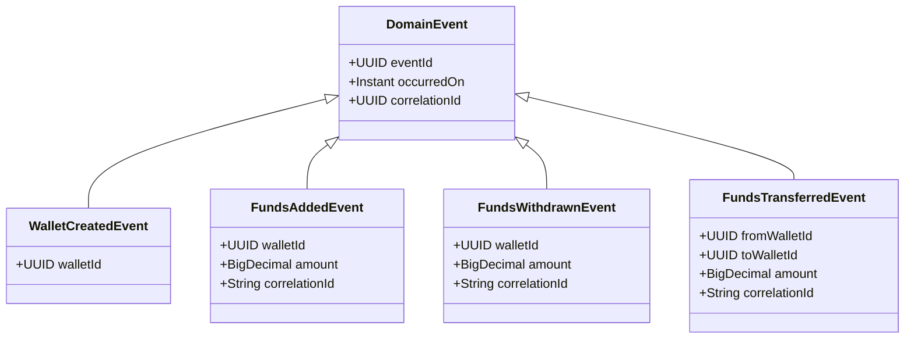
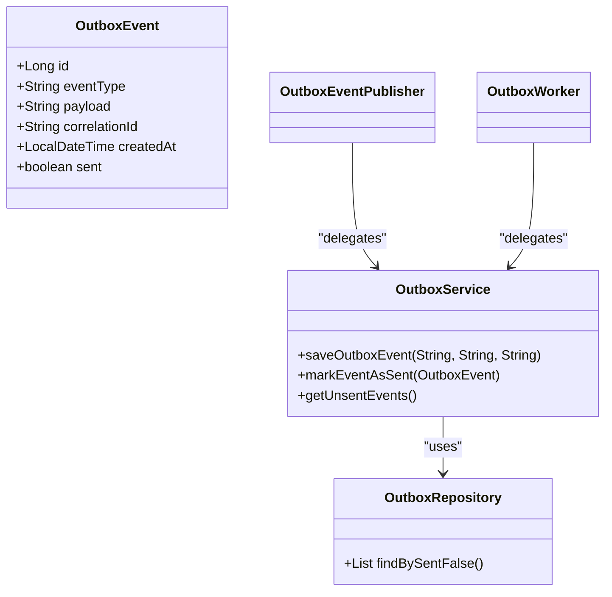
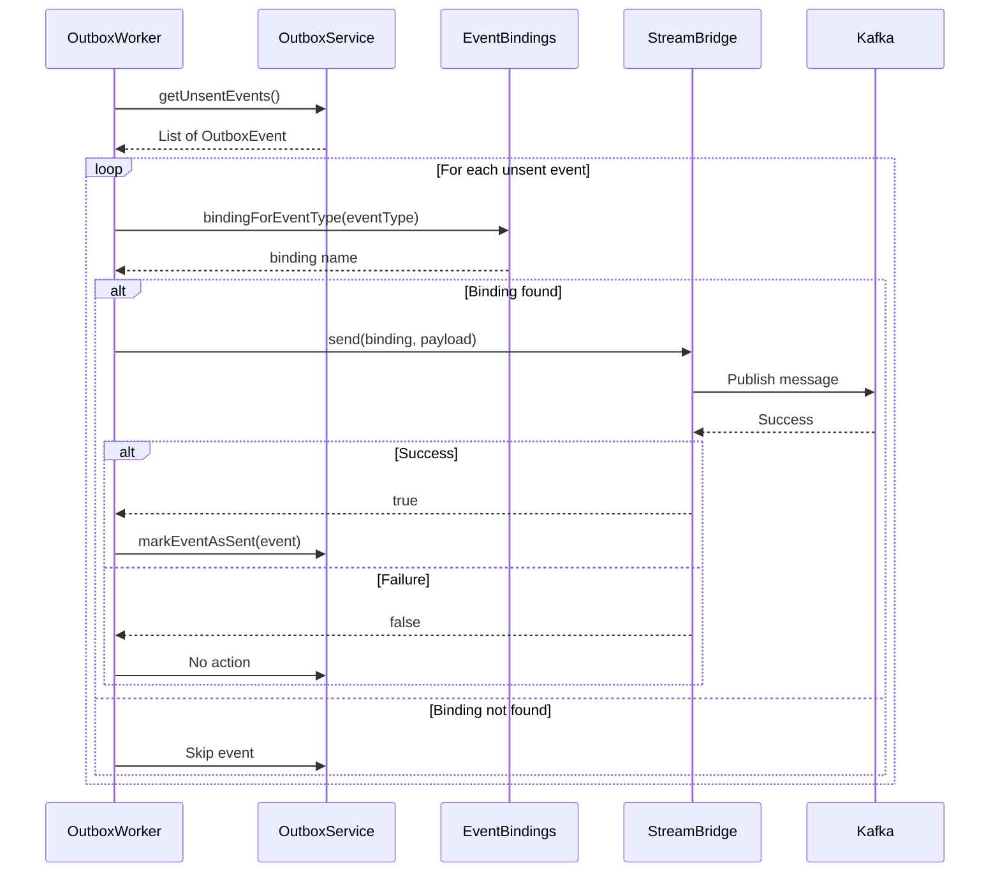
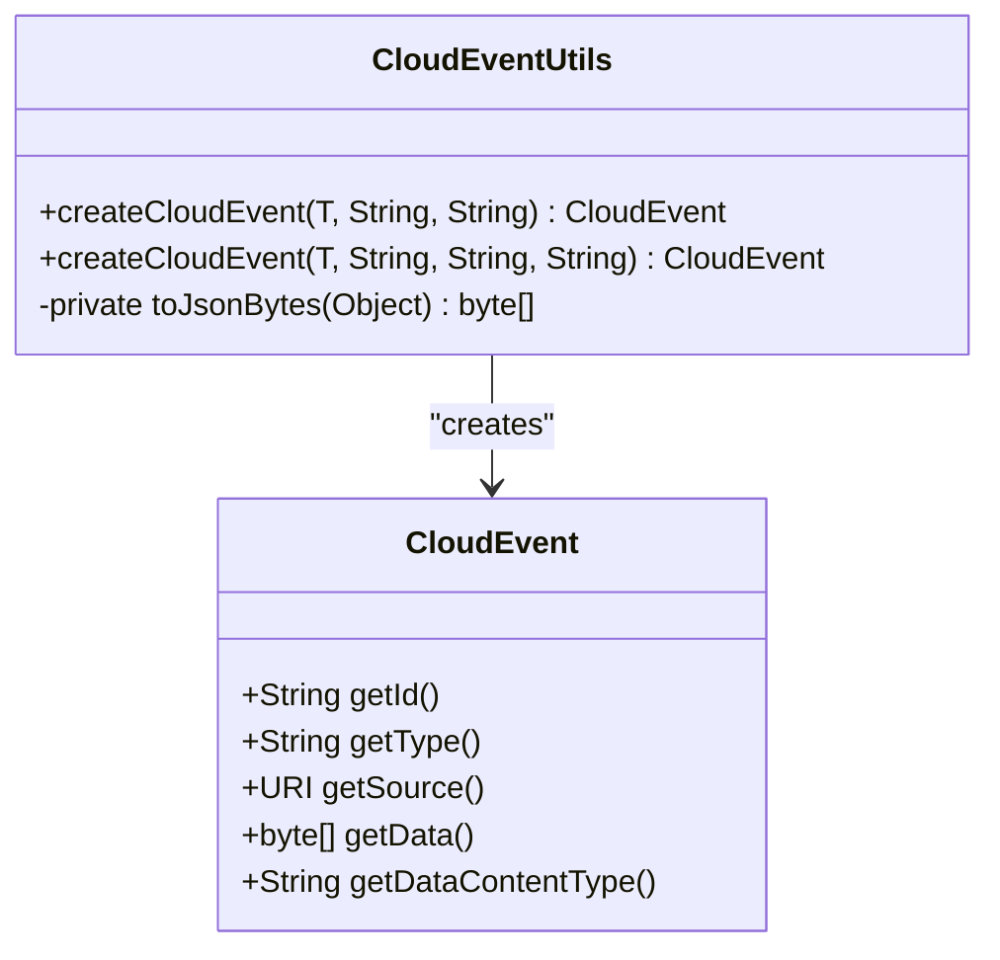
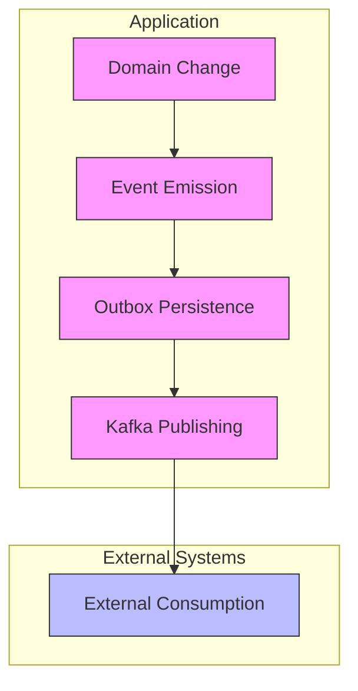

# Event-Driven Architecture

<cite>
**Referenced Files in This Document**   
- [WalletCreatedEvent.java](file://src/main/java/dev/bloco/wallet/hub/domain/event/wallet/WalletCreatedEvent.java)
- [FundsAddedEvent.java](file://src/main/java/dev/bloco/wallet/hub/domain/event/wallet/FundsAddedEvent.java)
- [FundsWithdrawnEvent.java](file://src/main/java/dev/bloco/wallet/hub/domain/event/wallet/FundsWithdrawnEvent.java)
- [FundsTransferredEvent.java](file://src/main/java/dev/bloco/wallet/hub/domain/event/wallet/FundsTransferredEvent.java)
- [DomainEvent.java](file://src/main/java/dev/bloco/wallet/hub/domain/event/common/DomainEvent.java)
- [DomainEventPublisher.java](file://src/main/java/dev/bloco/wallet/hub/domain/gateway/DomainEventPublisher.java)
- [OutboxEventPublisher.java](file://src/main/java/dev/bloco/wallet/hub/infra/adapter/event/OutboxEventPublisher.java)
- [OutboxEvent.java](file://src/main/java/dev/bloco/wallet/hub/infra/provider/data/OutboxEvent.java)
- [OutboxService.java](file://src/main/java/dev/bloco/wallet/hub/infra/provider/data/OutboxService.java)
- [OutboxRepository.java](file://src/main/java/dev/bloco/wallet/hub/infra/provider/data/repository/OutboxRepository.java)
- [KafkaEventProducer.java](file://src/main/java/dev/bloco/wallet/hub/infra/adapter/event/producer/KafkaEventProducer.java)
- [EventProducer.java](file://src/main/java/dev/bloco/wallet/hub/infra/adapter/event/producer/EventProducer.java)
- [EventBindings.java](file://src/main/java/dev/bloco/wallet/hub/infra/adapter/event/producer/EventBindings.java) - *Added in recent commit*
- [CloudEventUtils.java](file://src/main/java/dev/bloco/wallet/hub/infra/util/CloudEventUtils.java) - *Enhanced with improved JSON serialization*
- [application.yml](file://src/main/resources/application.yml)
- [CreateWalletUseCase.java](file://src/main/java/dev/bloco/wallet/hub/usecase/CreateWalletUseCase.java)
- [AddFundsUseCase.java](file://src/main/java/dev/bloco/wallet/hub/usecase/AddFundsUseCase.java)
- [WithdrawFundsUseCase.java](file://src/main/java/dev/bloco/wallet/hub/usecase/WithdrawFundsUseCase.java)
- [TransferFundsUseCase.java](file://src/main/java/dev/bloco/wallet/hub/usecase/TransferFundsUseCase.java)
- [Wallet.java](file://src/main/java/dev/bloco/wallet/hub/domain/model/Wallet.java)
</cite>

## Update Summary
**Changes Made**   
- Added new section on EventBindings class for centralized Kafka binding names
- Updated Kafka Integration section to reflect use of EventBindings
- Enhanced Event Serialization section with details on improved JSON serialization in CloudEventUtils
- Updated sequence diagram in Kafka Integration section to show binding resolution
- Added new sources for EventBindings.java and updated CloudEventUtils.java

## Table of Contents
1. [Introduction](#introduction)
2. [Domain Events and Publishing Mechanism](#domain-events-and-publishing-mechanism)
3. [Outbox Pattern Implementation](#outbox-pattern-implementation)
4. [Kafka Integration via Spring Cloud Stream](#kafka-integration-via-spring-cloud-stream)
5. [Event Serialization with CloudEvents](#event-serialization-with-cloudevents)
6. [Full Event Lifecycle](#full-event-lifecycle)
7. [Delivery Guarantees and Retry Mechanisms](#delivery-guarantees-and-retry-mechanisms)
8. [Consumer Idempotency](#consumer-idempotency)
9. [Monitoring, Tracing, and Debugging](#monitoring-tracing-and-debugging)
10. [Configuration Examples](#configuration-examples)
11. [Performance Tuning Tips](#performance-tuning-tips)
12. [Conclusion](#conclusion)

## Introduction
The bloco-wallet-java application implements an event-driven architecture to ensure reliable communication between distributed components. This architecture leverages domain events to capture business state changes, uses the outbox pattern for transactional consistency, and integrates with Kafka for asynchronous message delivery. The system ensures that critical operations such as wallet creation and fund transfers are reliably communicated across services while maintaining data integrity and supporting scalability.

**Section sources**
- [WalletCreatedEvent.java](file://src/main/java/dev/bloco/wallet/hub/domain/event/wallet/WalletCreatedEvent.java#L1-L38)
- [FundsAddedEvent.java](file://src/main/java/dev/bloco/wallet/hub/domain/event/wallet/FundsAddedEvent.java#L1-L26)
- [DomainEvent.java](file://src/main/java/dev/bloco/wallet/hub/domain/event/common/DomainEvent.java#L1-L18)

## Domain Events and Publishing Mechanism
Domain events such as WalletCreatedEvent, FundsAddedEvent, FundsWithdrawnEvent, and FundsTransferredEvent are used to represent significant business state changes within the wallet system. These events extend the base DomainEvent class, which provides common metadata including eventId, occurredOn timestamp, and correlationId for traceability.

The DomainEventPublisher interface defines the contract for publishing events, with the OutboxEventPublisher implementation ensuring transactional consistency by persisting events to the outbox table within the same database transaction that modifies the aggregate state. When a use case like CreateWalletUseCase or AddFundsUseCase completes its operation, it publishes the corresponding domain event through this mechanism.

**Diagram sources**
- [DomainEvent.java](file://src/main/java/dev/bloco/wallet/hub/domain/event/common/DomainEvent.java#L7-L18)
- [WalletCreatedEvent.java](file://src/main/java/dev/bloco/wallet/hub/domain/event/wallet/WalletCreatedEvent.java#L18-L38)
- [FundsAddedEvent.java](file://src/main/java/dev/bloco/wallet/hub/domain/event/wallet/FundsAddedEvent.java#L1-L26)
- [FundsWithdrawnEvent.java](file://src/main/java/dev/bloco/wallet/hub/domain/event/wallet/FundsWithdrawnEvent.java#L1-L25)
- [FundsTransferredEvent.java](file://src/main/java/dev/bloco/wallet/hub/domain/event/wallet/FundsTransferredEvent.java#L1-L29)

**Section sources**
- [DomainEvent.java](file://src/main/java/dev/bloco/wallet/hub/domain/event/common/DomainEvent.java#L7-L18)
- [WalletCreatedEvent.java](file://src/main/java/dev/bloco/wallet/hub/domain/event/wallet/WalletCreatedEvent.java#L18-L38)
- [FundsAddedEvent.java](file://src/main/java/dev/bloco/wallet/hub/domain/event/wallet/FundsAddedEvent.java#L1-L26)
- [FundsWithdrawnEvent.java](file://src/main/java/dev/bloco/wallet/hub/domain/event/wallet/FundsWithdrawnEvent.java#L1-L25)
- [FundsTransferredEvent.java](file://src/main/java/dev/bloco/wallet/hub/domain/event/wallet/FundsTransferredEvent.java#L1-L29)
- [DomainEventPublisher.java](file://src/main/java/dev/bloco/wallet/hub/domain/gateway/DomainEventPublisher.java#L11-L13)
- [OutboxEventPublisher.java](file://src/main/java/dev/bloco/wallet/hub/infra/adapter/event/OutboxEventPublisher.java#L30-L74)
- [CreateWalletUseCase.java](file://src/main/java/dev/bloco/wallet/hub/usecase/CreateWalletUseCase.java#L1-L41)
- [AddFundsUseCase.java](file://src/main/java/dev/bloco/wallet/hub/usecase/AddFundsUseCase.java#L1-L40)
- [WithdrawFundsUseCase.java](file://src/main/java/dev/bloco/wallet/hub/usecase/WithdrawFundsUseCase.java#L1-L40)
- [TransferFundsUseCase.java](file://src/main/java/dev/bloco/wallet/hub/usecase/TransferFundsUseCase.java#L1-L45)

## Outbox Pattern Implementation
The outbox pattern is implemented to ensure reliable event delivery with transactional consistency. The OutboxEvent entity represents a message waiting to be published, containing fields for eventType, payload (JSON serialized event), correlationId, createdAt timestamp, and a sent flag. This entity is persisted in the "outbox" database table.

The OutboxService provides operations for saving new outbox events, retrieving unsent events, and marking events as sent after successful delivery. The OutboxRepository interface extends JpaRepository and provides the findBySentFalse() method to retrieve all events that have not been successfully delivered. The OutboxEventPublisher implementation of DomainEventPublisher serializes domain events and saves them to the outbox within the same transaction as the aggregate modification, ensuring that events are not lost if the application crashes after the business transaction commits but before the message is sent.

**Diagram sources**
- [OutboxEvent.java](file://src/main/java/dev/bloco/wallet/hub/infra/provider/data/OutboxEvent.java#L41-L85)
- [OutboxService.java](file://src/main/java/dev/bloco/wallet/hub/infra/provider/data/OutboxService.java#L31-L85)
- [OutboxRepository.java](file://src/main/java/dev/bloco/wallet/hub/infra/provider/data/repository/OutboxRepository.java#L26-L28)

**Section sources**
- [OutboxEvent.java](file://src/main/java/dev/bloco/wallet/hub/infra/provider/data/OutboxEvent.java#L41-L85)
- [OutboxService.java](file://src/main/java/dev/bloco/wallet/hub/infra/provider/data/OutboxService.java#L31-L85)
- [OutboxRepository.java](file://src/main/java/dev/bloco/wallet/hub/infra/provider/data/repository/OutboxRepository.java#L26-L28)
- [OutboxEventPublisher.java](file://src/main/java/dev/bloco/wallet/hub/infra/adapter/event/OutboxEventPublisher.java#L30-L74)

## Kafka Integration via Spring Cloud Stream
Kafka integration is achieved through Spring Cloud Stream with the KafkaEventProducer component. This producer implements the EventProducer interface and is responsible for sending events from the outbox to Kafka topics. The processOutbox() method is scheduled to run every 5 seconds, retrieving all unsent events from the outbox and attempting to send them to Kafka using StreamBridge.

A new EventBindings class has been introduced to centralize Kafka binding names and avoid string coupling. This class provides constants for binding names and a lookup method to resolve event types to their corresponding binding names. The OutboxWorker now uses EventBindings.bindingForEventType() to determine the correct binding for each event type, making it easier to evolve channel names in one place.

Each event type is mapped to a specific Kafka topic through configuration in application.yml. For example, walletCreatedEventProducer is bound to the wallet-created-topic. The channel name is resolved through the EventBindings class rather than being constructed dynamically. Only events that are successfully sent are marked as sent in the outbox, providing at-least-once delivery semantics. Failed deliveries remain in the outbox for retry in subsequent processing cycles.

**Diagram sources**
- [KafkaEventProducer.java](file://src/main/java/dev/bloco/wallet/hub/infra/adapter/event/producer/KafkaEventProducer.java#L29-L151)
- [OutboxWorker.java](file://src/main/java/dev/bloco/wallet/hub/infra/provider/data/OutboxWorker.java#L43-L93)
- [EventBindings.java](file://src/main/java/dev/bloco/wallet/hub/infra/adapter/event/producer/EventBindings.java#L1-L31)
- [application.yml](file://src/main/resources/application.yml#L20-L28)

**Section sources**
- [KafkaEventProducer.java](file://src/main/java/dev/bloco/wallet/hub/infra/adapter/event/producer/KafkaEventProducer.java#L29-L151)
- [EventProducer.java](file://src/main/java/dev/bloco/wallet/hub/infra/adapter/event/producer/EventProducer.java#L18-L23)
- [OutboxWorker.java](file://src/main/java/dev/bloco/wallet/hub/infra/provider/data/OutboxWorker.java#L43-L93)
- [EventBindings.java](file://src/main/java/dev/bloco/wallet/hub/infra/adapter/event/producer/EventBindings.java#L1-L31)
- [application.yml](file://src/main/resources/application.yml#L20-L28)

## Event Serialization with CloudEvents
Event serialization is handled through the CloudEventUtils class, which creates standardized CloudEvent instances from domain events. This ensures interoperability across different systems and services by providing a common event format. The createCloudEvent() methods generate CloudEvents with unique IDs, event types, source URIs, and optional correlation IDs as extensions.

The CloudEventUtils class has been enhanced with improved JSON serialization capabilities. It now includes a private toJsonBytes() method that uses Jackson's ObjectMapper with registered modules to properly handle Java Time types and other complex objects. The serialization includes error handling with a fallback to toString() if JSON serialization fails, preventing hard failures. When events are serialized for storage in the outbox or transmission to Kafka, they are converted to JSON format using this robust serialization mechanism. The CloudEvent format includes metadata such as event ID, type, source, and timestamp, along with the event data payload. This standardization enables consistent event processing, monitoring, and debugging across the distributed system.

**Diagram sources**
- [CloudEventUtils.java](file://src/main/java/dev/bloco/wallet/hub/infra/util/CloudEventUtils.java#L12-L71)
- [CloudEventUtilsTest.java](file://src/main/java/dev/bloco/wallet/hub/infra/util/CloudEventUtilsTest.java#L1-L60)

**Section sources**
- [CloudEventUtils.java](file://src/main/java/dev/bloco/wallet/hub/infra/util/CloudEventUtils.java#L12-L71)
- [CloudEventUtilsTest.java](file://src/main/java/dev/bloco/wallet/hub/infra/util/CloudEventUtilsTest.java#L1-L60)

## Full Event Lifecycle
The complete event lifecycle in the bloco-wallet-java application follows a well-defined sequence: domain change → event emission → outbox persistence → Kafka publishing → external consumption. When a business operation occurs, such as creating a wallet or adding funds, the corresponding domain aggregate (e.g., Wallet) registers a domain event. The use case then publishes this event through the DomainEventPublisher.

The OutboxEventPublisher intercepts the event, serializes it to JSON, and persists it to the outbox table within the same transaction as the aggregate state change. This ensures atomicity - either both the business data and the event are committed, or neither is. Periodically, the KafkaEventProducer retrieves unsent events from the outbox and sends them to their designated Kafka topics using Spring Cloud Stream's StreamBridge. The binding resolution is now handled through the centralized EventBindings class rather than dynamic string construction.

External consumers subscribe to these Kafka topics and process the events accordingly. For example, the WalletCreatedEventConsumer receives wallet creation events and triggers further processing in related systems. The correlationId included in each event enables end-to-end tracing of operations across service boundaries.

**Diagram sources**
- [Wallet.java](file://src/main/java/dev/bloco/wallet/hub/domain/model/Wallet.java#L23-L121)
- [CreateWalletUseCase.java](file://src/main/java/dev/bloco/wallet/hub/usecase/CreateWalletUseCase.java#L1-L41)
- [OutboxEventPublisher.java](file://src/main/java/dev/bloco/wallet/hub/infra/adapter/event/OutboxEventPublisher.java#L30-L74)
- [KafkaEventProducer.java](file://src/main/java/dev/bloco/wallet/hub/infra/adapter/event/producer/KafkaEventProducer.java#L29-L151)

**Section sources**
- [Wallet.java](file://src/main/java/dev/bloco/wallet/hub/domain/model/Wallet.java#L23-L121)
- [CreateWalletUseCase.java](file://src/main/java/dev/bloco/wallet/hub/usecase/CreateWalletUseCase.java#L1-L41)
- [OutboxEventPublisher.java](file://src/main/java/dev/bloco/wallet/hub/infra/adapter/event/OutboxEventPublisher.java#L30-L74)
- [KafkaEventProducer.java](file://src/main/java/dev/bloco/wallet/hub/infra/adapter/event/producer/KafkaEventProducer.java#L29-L151)

## Delivery Guarantees and Retry Mechanisms
The system provides at-least-once delivery guarantees through the combination of the outbox pattern and periodic processing. Events are only removed from the outbox after successful delivery to Kafka, ensuring that no events are lost due to application failures or network issues. The scheduled processOutbox() method runs every 5 seconds, continuously attempting to deliver any unsent events.

This retry mechanism is inherently built into the design - failed deliveries remain in the outbox and are retried in subsequent processing cycles. The system does not implement exponential backoff or maximum retry limits at the producer level, relying instead on Kafka's built-in durability and the continuous retry loop. This approach ensures high reliability for critical financial events while keeping the implementation simple and predictable.

**Section sources**
- [KafkaEventProducer.java](file://src/main/java/dev/bloco/wallet/hub/infra/adapter/event/producer/KafkaEventProducer.java#L144-L150)
- [OutboxWorker.java](file://src/main/java/dev/bloco/wallet/hub/infra/provider/data/OutboxWorker.java#L84-L92)

## Consumer Idempotency
Consumer idempotency is essential in this event-driven architecture due to the at-least-once delivery semantics. Consumers must be designed to handle duplicate events without causing unintended side effects. This is typically achieved through idempotency keys or by making operations idempotent at the business logic level.

For example, when processing a FundsAddedEvent, the consumer should verify that the funds have not already been added before updating the balance. The correlationId included in each event can be used to track processed operations and prevent duplicates. Additionally, the eventId from the DomainEvent provides a unique identifier that can be used to deduplicate events at the consumer level.

**Section sources**
- [DomainEvent.java](file://src/main/java/dev/bloco/wallet/hub/domain/event/common/DomainEvent.java#L7-L18)

## Monitoring, Tracing, and Debugging