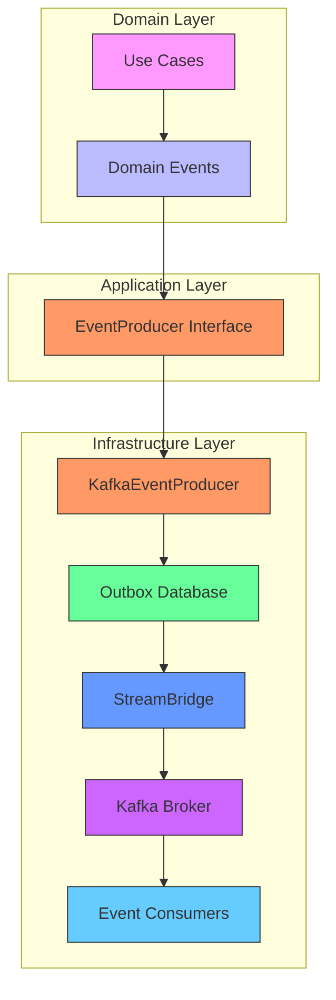
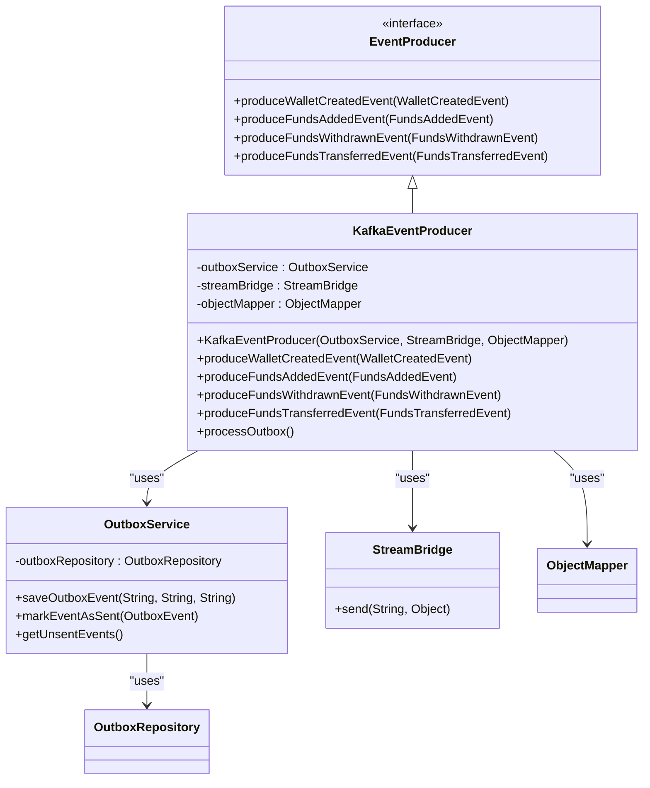
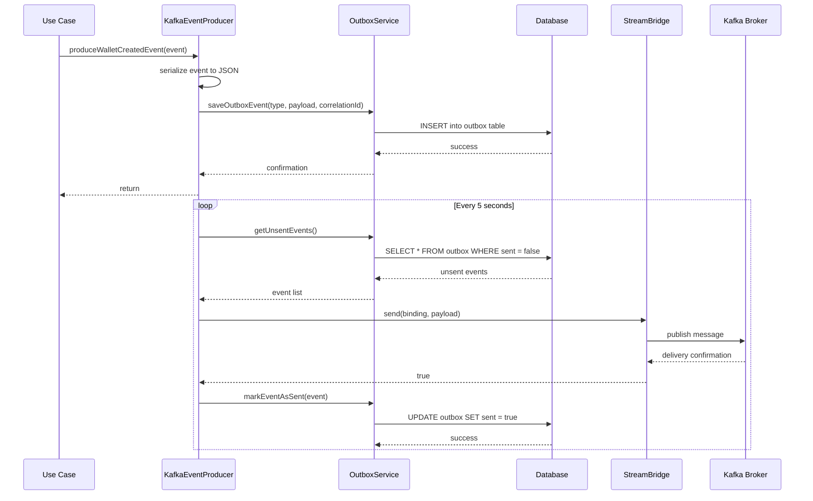
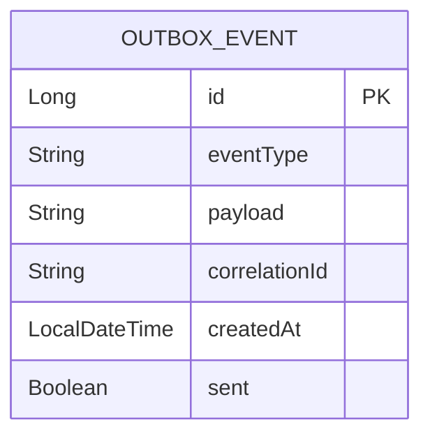
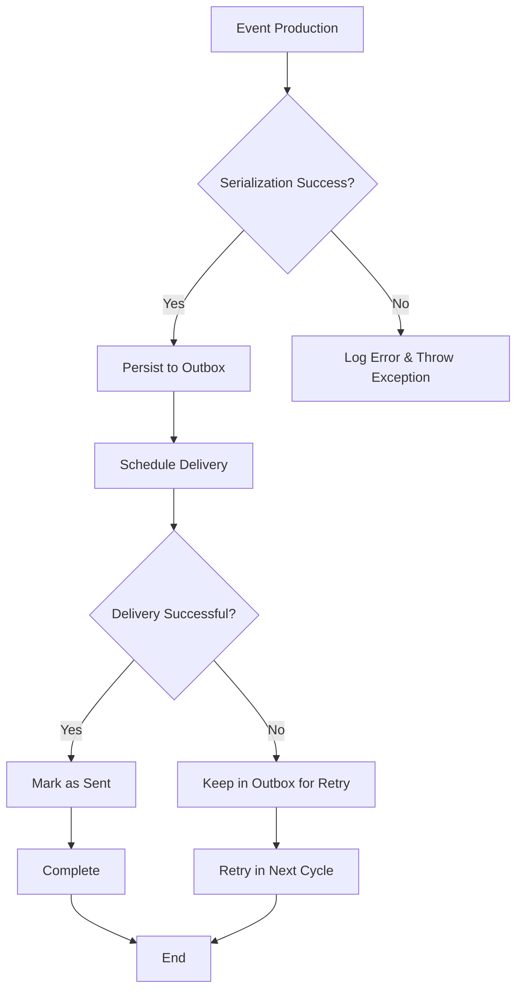
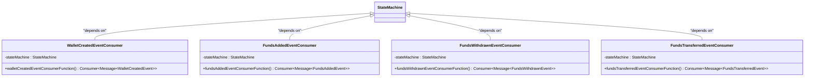

# Kafka Integration

<cite>
**Referenced Files in This Document**   
- [KafkaEventProducer.java](file://src/main/java/dev/bloco/wallet/hub/infra/adapter/event/producer/KafkaEventProducer.java)
- [EventProducer.java](file://src/main/java/dev/bloco/wallet/hub/infra/adapter/event/producer/EventProducer.java)
- [CloudEventUtils.java](file://src/main/java/dev/bloco/wallet/hub/infra/util/CloudEventUtils.java)
- [OutboxService.java](file://src/main/java/dev/bloco/wallet/hub/infra/provider/data/OutboxService.java)
- [OutboxEvent.java](file://src/main/java/dev/bloco/wallet/hub/infra/provider/data/OutboxEvent.java)
- [OutboxRepository.java](file://src/main/java/dev/bloco/wallet/hub/infra/provider/data/repository/OutboxRepository.java)
- [application.yml](file://src/main/resources/application.yml)
- [WalletCreatedEvent.java](file://src/main/java/dev/bloco/wallet/hub/domain/event/wallet/WalletCreatedEvent.java)
- [FundsAddedEvent.java](file://src/main/java/dev/bloco/wallet/hub/domain/event/wallet/FundsAddedEvent.java)
- [FundsWithdrawnEvent.java](file://src/main/java/dev/bloco/wallet/hub/domain/event/wallet/FundsWithdrawnEvent.java)
- [FundsTransferredEvent.java](file://src/main/java/dev/bloco/wallet/hub/domain/event/wallet/FundsTransferredEvent.java)
- [WalletCreatedEventConsumer.java](file://src/main/java/dev/bloco/wallet/hub/infra/adapter/event/consumer/WalletCreatedEventConsumer.java)
- [FundsAddedEventConsumer.java](file://src/main/java/dev/bloco/wallet/hub/infra/adapter/event/consumer/FundsAddedEventConsumer.java)
- [FundsWithdrawnEventConsumer.java](file://src/main/java/dev/bloco/wallet/hub/infra/adapter/event/consumer/FundsWithdrawnEventConsumer.java)
- [FundsTransferredEventConsumer.java](file://src/main/java/dev/bloco/wallet/hub/infra/adapter/event/consumer/FundsTransferredEventConsumer.java)
</cite>

## Table of Contents
1. [Introduction](#introduction)
2. [Architecture Overview](#architecture-overview)
3. [Core Components](#core-components)
4. [Event Production Process](#event-production-process)
5. [Configuration Details](#configuration-details)
6. [Delivery Semantics and Reliability](#delivery-semantics-and-reliability)
7. [Performance Considerations](#performance-considerations)
8. [Troubleshooting Guide](#troubleshooting-guide)

## Introduction

The bloco-wallet-java application implements a robust event-driven architecture using Apache Kafka as the message broker. This documentation details the Kafka integration, focusing on how domain events are produced, serialized, and delivered through Spring Cloud Stream's StreamBridge mechanism. The system follows clean architecture principles with clear separation between domain logic and infrastructure concerns, using the outbox pattern to ensure reliable event delivery. Events are standardized using CloudEvent specifications to promote interoperability across services.

## Architecture Overview

The Kafka integration architecture follows a producer-consumer model with transactional safety through the outbox pattern. Domain events are first persisted in a local database table before being asynchronously published to Kafka topics. This ensures that event production is atomic with business operations, preventing data inconsistency in case of failures.



**Diagram sources**
- [KafkaEventProducer.java](file://src/main/java/dev/bloco/wallet/hub/infra/adapter/event/producer/KafkaEventProducer.java#L1-L151)
- [OutboxService.java](file://src/main/java/dev/bloco/wallet/hub/infra/provider/data/OutboxService.java#L1-L86)
- [EventProducer.java](file://src/main/java/dev/bloco/wallet/hub/infra/adapter/event/producer/EventProducer.java#L1-L24)

## Core Components

### EventProducer Interface

The `EventProducer` interface serves as a port in the clean architecture, defining the contract for producing domain events without exposing implementation details. It abstracts the event production mechanism from the domain layer, allowing for easy replacement or extension of the underlying technology.

**Section sources**
- [EventProducer.java](file://src/main/java/dev/bloco/wallet/hub/infra/adapter/event/producer/EventProducer.java#L1-L24)

### KafkaEventProducer Implementation

The `KafkaEventProducer` class implements the `EventProducer` interface and provides the actual mechanism for producing events to Kafka. It uses Spring Cloud Stream's `StreamBridge` to decouple event production from Kafka-specific configuration, enabling flexibility in message routing and binding.

Key responsibilities include:
- Receiving domain events from use cases
- Serializing events to JSON format
- Persisting events in the outbox for reliable delivery
- Processing unsent events on a scheduled basis



**Diagram sources**
- [KafkaEventProducer.java](file://src/main/java/dev/bloco/wallet/hub/infra/adapter/event/producer/KafkaEventProducer.java#L1-L151)
- [EventProducer.java](file://src/main/java/dev/bloco/wallet/hub/infra/adapter/event/producer/EventProducer.java#L1-L24)
- [OutboxService.java](file://src/main/java/dev/bloco/wallet/hub/infra/provider/data/OutboxService.java#L1-L86)

## Event Production Process

The event production process follows a two-phase approach to ensure reliability and consistency:

1. **Event Persistence Phase**: When a domain event occurs, it is immediately serialized to JSON and stored in the outbox database table along with its event type and correlation ID.

2. **Event Delivery Phase**: A scheduled task runs every 5 seconds to process unsent events from the outbox, sending them to Kafka and marking them as sent upon successful delivery.



**Diagram sources**
- [KafkaEventProducer.java](file://src/main/java/dev/bloco/wallet/hub/infra/adapter/event/producer/KafkaEventProducer.java#L1-L151)
- [OutboxService.java](file://src/main/java/dev/bloco/wallet/hub/infra/provider/data/OutboxService.java#L1-L86)

**Section sources**
- [KafkaEventProducer.java](file://src/main/java/dev/bloco/wallet/hub/infra/adapter/event/producer/KafkaEventProducer.java#L1-L151)
- [OutboxService.java](file://src/main/java/dev/bloco/wallet/hub/infra/provider/data/OutboxService.java#L1-L86)

## Configuration Details

### Kafka Binding Configuration

The application.yml file contains the configuration for Kafka bindings, mapping logical channel names to actual Kafka topics:

```yaml
spring:
  cloud:
    stream:
      bindings:
        walletCreatedEventProducer-out-0:
          destination: wallet-created-topic
        fundsAddedEventProducer-out-0:
          destination: funds-added-topic
        fundsWithdrawnEventProducer-out-0:
          destination: funds-withdrawn-topic
        fundsTransferredEventProducer-out-0:
          destination: funds-transferred-topic
      kafka:
        binder:
          brokers: localhost:9092
```

The binding names follow the pattern `{eventType}-out-0`, where `-out-0` indicates the output binding index. This naming convention allows the `processOutbox` method to dynamically determine the correct binding by appending `-out-0` to the event type.

**Section sources**
- [application.yml](file://src/main/resources/application.yml#L1-L34)

### Outbox Entity Structure

The OutboxEvent entity represents the structure of events stored in the database before being published to Kafka:



**Diagram sources**
- [OutboxEvent.java](file://src/main/java/dev/bloco/wallet/hub/infra/provider/data/OutboxEvent.java#L1-L85)

## Delivery Semantics and Reliability

### At-Least-Once Delivery

The system implements at-least-once delivery semantics through the combination of the outbox pattern and scheduled processing. Events are only marked as sent after successful delivery to Kafka, ensuring that no events are lost due to application failures. If the application crashes during processing, unsent events will be retried when the application restarts.

### Message Key and Partitioning

While the current implementation does not explicitly set message keys, the event types and correlation IDs provide natural partitioning strategies. For example, events related to the same wallet or transaction can be directed to the same partition by using the wallet ID or correlation ID as the message key, ensuring ordered processing of related events.

### Error Handling

The KafkaEventProducer includes robust error handling for serialization failures. If JSON serialization fails, a RuntimeException is thrown with appropriate logging. For delivery failures, the StreamBridge.send() method returns false, causing the event to remain in the outbox for retry in the next processing cycle.



**Diagram sources**
- [KafkaEventProducer.java](file://src/main/java/dev/bloco/wallet/hub/infra/adapter/event/producer/KafkaEventProducer.java#L1-L151)
- [OutboxService.java](file://src/main/java/dev/bloco/wallet/hub/infra/provider/data/OutboxService.java#L1-L86)

**Section sources**
- [KafkaEventProducer.java](file://src/main/java/dev/bloco/wallet/hub/infra/adapter/event/producer/KafkaEventProducer.java#L1-L151)

## Performance Considerations

### Batching Strategy

The current implementation processes events individually in a streaming fashion. While this provides simplicity, it could be optimized by implementing batch sending to Kafka. The StreamBridge supports batch operations, which could reduce network overhead and improve throughput.

### Serialization Overhead

The system uses Jackson's ObjectMapper for JSON serialization, which is efficient but still represents a performance cost. The objectMapper.findAndRegisterModules() call in the constructor ensures proper handling of Java Time types, adding minimal overhead.

### Scheduled Processing Interval

The processOutbox method runs every 5 seconds, creating a potential delay in event delivery. This interval represents a trade-off between system load and delivery latency. For high-throughput scenarios, this interval could be reduced or replaced with a more sophisticated triggering mechanism.

### Consumer Configuration

The consumer implementations (WalletCreatedEventConsumer, FundsAddedEventConsumer, etc.) use Spring Cloud Stream's functional programming model with Consumer<Message<T>> beans. These consumers integrate with a state machine to manage saga processes, ensuring consistency in distributed operations.



**Diagram sources**
- [WalletCreatedEventConsumer.java](file://src/main/java/dev/bloco/wallet/hub/infra/adapter/event/consumer/WalletCreatedEventConsumer.java#L1-L68)
- [FundsAddedEventConsumer.java](file://src/main/java/dev/bloco/wallet/hub/infra/adapter/event/consumer/FundsAddedEventConsumer.java#L1-L79)
- [FundsWithdrawnEventConsumer.java](file://src/main/java/dev/bloco/wallet/hub/infra/adapter/event/consumer/FundsWithdrawnEventConsumer.java#L1-L76)
- [FundsTransferredEventConsumer.java](file://src/main/java/dev/bloco/wallet/hub/infra/adapter/event/consumer/FundsTransferredEventConsumer.java#L1-L72)

## Troubleshooting Guide

### Common Issues and Solutions

| Issue | Symptoms | Solution |
|------|---------|----------|
| **Kafka Connectivity Problems** | Events accumulate in outbox, no consumer logs | Verify broker address in application.yml, check network connectivity, ensure Kafka is running |
| **Serialization Failures** | RuntimeException with "Failed to serialize event" in logs | Check that all event fields are serializable, verify Jackson configuration |
| **Duplicate Events** | Same event processed multiple times | Implement idempotency in consumers using event ID or correlation ID |
| **Event Delivery Delays** | Events take longer than 5 seconds to appear in Kafka | Check scheduled task execution, verify StreamBridge configuration |
| **Database Connection Issues** | Unable to save events to outbox | Verify datasource configuration, check database availability |

### Monitoring Producer Metrics

The application should monitor the following metrics for healthy Kafka integration:

- **Outbox Queue Size**: Number of unsent events in the outbox table
- **Event Production Rate**: Number of events produced per minute
- **Delivery Success Rate**: Percentage of events successfully delivered to Kafka
- **Serialization Error Rate**: Number of serialization failures
- **Average Delivery Latency**: Time from event creation to Kafka delivery

These metrics can be exposed through Micrometer and integrated with monitoring systems like Prometheus and Grafana.

**Section sources**
- [KafkaEventProducer.java](file://src/main/java/dev/bloco/wallet/hub/infra/adapter/event/producer/KafkaEventProducer.java#L1-L151)
- [OutboxService.java](file://src/main/java/dev/bloco/wallet/hub/infra/provider/data/OutboxService.java#L1-L86)