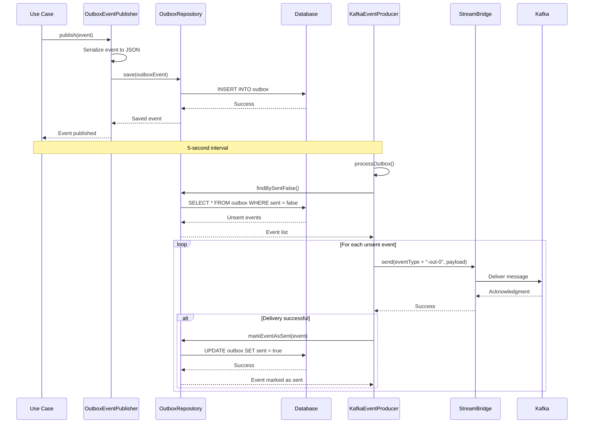
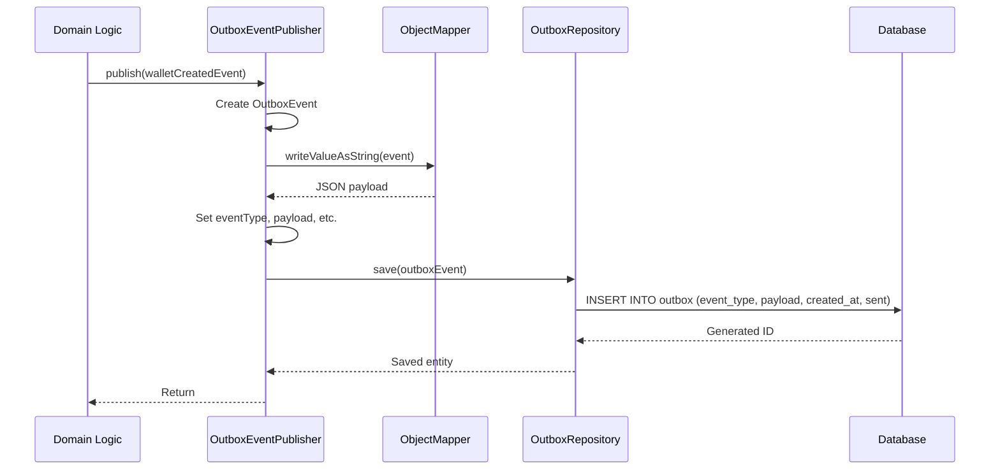

# Outbox Pattern

<cite>
**Referenced Files in This Document**   
- [OutboxEvent.java](file://src/main/java/dev/bloco/wallet/hub/infra/provider/data/OutboxEvent.java)
- [OutboxService.java](file://src/main/java/dev/bloco/wallet/hub/infra/provider/data/OutboxService.java)
- [KafkaEventProducer.java](file://src/main/java/dev/bloco/wallet/hub/infra/adapter/event/producer/KafkaEventProducer.java)
- [OutboxRepository.java](file://src/main/java/dev/bloco/wallet/hub/infra/provider/data/repository/OutboxRepository.java)
- [OutboxEventPublisher.java](file://src/main/java/dev/bloco/wallet/hub/infra/adapter/event/OutboxEventPublisher.java)
</cite>

## Table of Contents
1. [Introduction](#introduction)
2. [OutboxEvent Data Model](#outboxevent-data-model)
3. [Transactional Event Persistence](#transactional-event-persistence)
4. [Scheduled Event Processing](#scheduled-event-processing)
5. [Database Schema and Indexing](#database-schema-and-indexing)
6. [Trade-offs and Reliability](#trade-offs-and-reliability)
7. [Operational Considerations](#operational-considerations)
8. [Sequence Diagrams](#sequence-diagrams)

## Introduction

The outbox pattern implementation in bloco-wallet-java provides a reliable mechanism for ensuring transactional consistency while enabling asynchronous message delivery to external systems via Kafka. This documentation details the architecture, components, and operational characteristics of the outbox implementation, focusing on how it prevents message loss during system failures and ensures atomic updates to business data and event records.

The pattern addresses the challenge of maintaining data consistency in distributed systems by decoupling business transaction processing from message publishing. By storing events in the same database as business data, the system guarantees that events are not lost even if downstream services are temporarily unavailable.

**Section sources**
- [OutboxEvent.java](file://src/main/java/dev/bloco/wallet/hub/infra/provider/data/OutboxEvent.java#L1-L87)
- [OutboxService.java](file://src/main/java/dev/bloco/wallet/hub/infra/provider/data/OutboxService.java#L1-L86)

## OutboxEvent Data Model

The OutboxEvent entity represents the core data structure in the outbox pattern implementation, serving as a durable record of events that need to be processed and delivered to external systems.

### Core Fields

The OutboxEvent entity contains the following key fields that define its structure and behavior:

- **id**: A unique identifier for the event, auto-generated by the database using GenerationType.IDENTITY. This serves as the primary key for the outbox table.
- **eventType**: A string field that identifies the type or category of the event being recorded. This field is mapped to the "event_type" column and is required (nullable = false).
- **payload**: A string field containing the serialized JSON representation of the event data. This field is mapped to the "payload" column and is required (nullable = false).
- **correlationId**: An optional string field that can be used to associate the event with other records or workflows within the system. This field is mapped to the "correlation_id" column.
- **createdAt**: A LocalDateTime field that captures the timestamp when the event was created. This field is mapped to the "created_at" column, is required (nullable = false), and defaults to the current time upon creation.
- **sent**: A boolean flag that tracks whether the event has been successfully processed and delivered. This field is mapped to the "sent" column, is required (nullable = false), and defaults to false.

### Entity Configuration

The OutboxEvent class is annotated with JPA annotations to define its persistence behavior:
- `@Entity`: Marks the class as a JPA entity.
- `@Table(name = "outbox")`: Specifies the database table name as "outbox".
- `@Getter` and `@Setter`: Lombok annotations that generate getter and setter methods.
- `@ToString`: Lombok annotation that generates a toString method.
- `@RequiredArgsConstructor`: Lombok annotation that generates a constructor with required arguments.

The entity also overrides the equals() and hashCode() methods to ensure proper handling of Hibernate proxy instances, which is critical for consistent entity comparisons in JPA contexts.

**Section sources**
- [OutboxEvent.java](file://src/main/java/dev/bloco/wallet/hub/infra/provider/data/OutboxEvent.java#L1-L87)

## Transactional Event Persistence

The outbox pattern ensures atomicity by coordinating the persistence of business data changes and outbox events within the same database transaction. This is achieved through the OutboxService component, which provides transactional methods for saving and managing outbox events.

### OutboxService Coordination

The OutboxService class is responsible for managing the lifecycle of outbox events and ensuring transactional consistency:

- **saveOutboxEvent**: This transactional method creates a new OutboxEvent instance with the specified eventType, payload, and correlationId, then persists it to the database using the OutboxRepository. The @Transactional annotation ensures that the save operation is executed within a transactional context, guaranteeing that either all changes are committed or rolled back as a single unit.

- **markEventAsSent**: This transactional method updates an existing OutboxEvent by setting its sent flag to true and persisting the change to the database. Like saveOutboxEvent, this method is annotated with @Transactional to maintain consistency.

- **getUnsentEvents**: This method retrieves all outbox events that have not yet been marked as sent by querying the OutboxRepository for events where the sent field is false.

The OutboxService collaborates with the OutboxRepository to interact with the database layer, providing a clean separation between service logic and data access operations.

### Domain Event Publishing

The OutboxEventPublisher implements the DomainEventPublisher interface and provides a publish method that serializes domain events into JSON format and stores them as OutboxEvent entities in the database. This method is transactional (@Transactional), ensuring that the serialization and persistence process maintains database consistency. If JSON serialization fails, a RuntimeException is thrown and logged, preventing the storage of corrupted data.

When a domain event is published, the OutboxEventPublisher:
1. Creates a new OutboxEvent instance
2. Sets the eventType to the simple class name of the domain event
3. Serializes the domain event to JSON using ObjectMapper
4. Persists the OutboxEvent to the database via OutboxRepository

This approach ensures that event publishing is atomic with respect to the business transaction, preventing message loss even if the application crashes after the business logic completes but before the message is sent.

**Section sources**
- [OutboxService.java](file://src/main/java/dev/bloco/wallet/hub/infra/provider/data/OutboxService.java#L1-L86)
- [OutboxEventPublisher.java](file://src/main/java/dev/bloco/wallet/hub/infra/adapter/event/OutboxEventPublisher.java#L1-L75)

## Scheduled Event Processing

The outbox pattern implements a scheduled worker process that periodically polls for unsent events and attempts to deliver them to Kafka. This mechanism ensures reliable message delivery with built-in retry capabilities.

### KafkaEventProducer Implementation

The KafkaEventProducer class is responsible for processing unsent events from the outbox and sending them to Kafka. It implements the EventProducer interface and provides specific methods for producing different types of wallet-related events:

- produceWalletCreatedEvent
- produceFundsAddedEvent
- produceFundsWithdrawnEvent
- produceFundsTransferredEvent

Each of these methods delegates to a private saveEventToOutbox helper method that serializes the event to JSON and saves it to the outbox via OutboxService.

### Scheduled Processing

The core processing logic is implemented in the processOutbox method, which is annotated with @Scheduled(fixedRate = 5000). This annotation configures the method to execute every 5 seconds, creating a periodic polling mechanism for unsent events.

The processOutbox method performs the following steps:
1. Retrieves all unsent events from the outbox using outboxService.getUnsentEvents()
2. Streams the unsent events and filters them based on successful delivery
3. For each event, attempts to send its payload to Kafka using streamBridge.send()
4. Constructs the destination channel name by appending "-out-0" to the event's eventType
5. Only events that are successfully sent to Kafka are marked as sent via outboxService.markEventAsSent()

The filtering logic ensures that only successfully delivered events are marked as sent, leaving failed events in the outbox for retry in subsequent processing cycles. This provides built-in retry capabilities without requiring complex error handling or dead letter queues.

The 5-second polling interval represents a balance between timely delivery and system resource utilization. More frequent polling would provide lower latency but increase database load, while less frequent polling would reduce load but increase delivery latency.

**Section sources**
- [KafkaEventProducer.java](file://src/main/java/dev/bloco/wallet/hub/infra/adapter/event/producer/KafkaEventProducer.java#L1-L151)

## Database Schema and Indexing

The outbox pattern relies on a well-designed database schema to ensure efficient querying and reliable event processing.

### Table Structure

The outbox table is defined by the OutboxEvent entity and has the following structure:
- id (BIGINT, PRIMARY KEY, AUTO_INCREMENT)
- event_type (VARCHAR, NOT NULL)
- payload (TEXT, NOT NULL)
- correlation_id (VARCHAR)
- created_at (DATETIME, NOT NULL)
- sent (BOOLEAN, NOT NULL, DEFAULT FALSE)

The table is named "outbox" as specified by the @Table annotation on the OutboxEvent class.

### Query Optimization

The implementation includes specific optimizations for efficient querying of unsent events:

- The OutboxRepository interface extends JpaRepository<OutboxEvent, Long> and defines a custom query method findBySentFalse()
- This method leverages Spring Data JPA's method name parsing to automatically generate a query that retrieves all events where sent = false
- For optimal performance, an index should be created on the sent column to enable fast lookups of unsent events

While the current implementation does not explicitly define indexes, production deployments should consider adding:
- An index on the sent column for fast retrieval of unsent events
- A composite index on (sent, created_at) if events are processed in chronological order
- An index on correlation_id if events are frequently queried by correlation ID

The schema design prioritizes write performance for the save operations that occur within business transactions, while the read performance for unsent event retrieval is optimized through the findBySentFalse query method.

**Section sources**
- [OutboxEvent.java](file://src/main/java/dev/bloco/wallet/hub/infra/provider/data/OutboxEvent.java#L1-L87)
- [OutboxRepository.java](file://src/main/java/dev/bloco/wallet/hub/infra/provider/data/repository/OutboxRepository.java#L1-L28)

## Trade-offs and Reliability

The outbox pattern implementation in bloco-wallet-java involves several important trade-offs between immediate vs. delayed delivery and provides strong reliability guarantees.

### Delivery Latency vs. Consistency

The primary trade-off in this implementation is between delivery latency and transactional consistency:

- **Immediate Delivery**: Traditional approaches that send messages immediately after business logic completion risk message loss if the application crashes before the message is acknowledged by the message broker.

- **Delayed Delivery**: The outbox pattern introduces a delay between event creation and delivery, determined by the polling interval (5 seconds in this case). This delay ensures that events are not lost even if the application crashes, as they are safely stored in the database.

The 5-second polling interval represents a compromise that provides reasonably timely delivery while minimizing database load from frequent polling.

### Reliability Guarantees

The implementation provides several reliability features:

- **At-least-once Delivery**: By marking events as sent only after successful delivery, the system ensures that events are not lost. Failed deliveries leave events in the outbox for retry.

- **Transactional Consistency**: Events are saved within the same transaction as business data changes, ensuring that events are not created for operations that are rolled back.

- **Crash Recovery**: Since events are stored in the durable database, they survive application restarts and crashes.

However, the implementation does not prevent duplicate deliveries in all failure scenarios. If a message is successfully sent to Kafka but the application crashes before marking the event as sent, the event will be reprocessed and delivered again on restart. Consumers must be designed to handle duplicate messages idempotently.

The pattern also shifts the responsibility for message ordering from the message broker to the application. Events are processed in the order they are retrieved from the database, which may not perfectly align with the order of business operations if multiple instances are running.

**Section sources**
- [OutboxService.java](file://src/main/java/dev/bloco/wallet/hub/infra/provider/data/OutboxService.java#L1-L86)
- [KafkaEventProducer.java](file://src/main/java/dev/bloco/wallet/hub/infra/adapter/event/producer/KafkaEventProducer.java#L1-L151)

## Operational Considerations

Effective operation of the outbox pattern requires attention to monitoring, error handling, and scalability.

### Monitoring and Queue Management

Key operational metrics to monitor include:
- **Outbox Queue Size**: The number of unsent events in the outbox table. A growing queue may indicate problems with Kafka connectivity or consumer performance.
- **Processing Latency**: The time between event creation and delivery, which should be close to the polling interval under normal conditions.
- **Error Rates**: The frequency of serialization failures or Kafka delivery failures.

Monitoring the outbox queue size is particularly important, as a consistently growing queue may indicate systemic issues with message delivery that require investigation.

### Poison Message Handling

The current implementation does not include explicit handling for poison messages (messages that consistently fail to be processed). In cases where a message cannot be delivered due to content issues, it will remain in the outbox and be retried on every polling cycle, potentially blocking the processing of other messages.

Possible approaches to address this include:
- Implementing a retry counter and moving messages that exceed a threshold to a dead letter table
- Adding message validation before saving to the outbox
- Implementing exponential backoff for failed deliveries

### Scaling the Worker Process

The current implementation uses a simple scheduled method for processing outbox events. For high-volume systems, consider:
- Running multiple instances of the worker process for increased throughput
- Implementing batch processing to reduce the number of database queries
- Using a more sophisticated scheduling mechanism that adapts to queue size
- Implementing work stealing patterns where multiple workers coordinate to process the outbox

The @Scheduled annotation currently limits the implementation to a single-threaded processing model. In clustered environments, additional coordination would be needed to prevent multiple instances from processing the same events.

**Section sources**
- [KafkaEventProducer.java](file://src/main/java/dev/bloco/wallet/hub/infra/adapter/event/producer/KafkaEventProducer.java#L1-L151)
- [OutboxService.java](file://src/main/java/dev/bloco/wallet/hub/infra/provider/data/OutboxService.java#L1-L86)

## Sequence Diagrams

### Use Case Execution to Kafka Delivery

The following sequence diagram illustrates the complete flow from use case execution to Kafka delivery using the outbox pattern:

**Diagram sources**
- [OutboxEventPublisher.java](file://src/main/java/dev/bloco/wallet/hub/infra/adapter/event/OutboxEventPublisher.java#L61-L73)
- [OutboxService.java](file://src/main/java/dev/bloco/wallet/hub/infra/provider/data/OutboxService.java#L75-L85)
- [KafkaEventProducer.java](file://src/main/java/dev/bloco/wallet/hub/infra/adapter/event/producer/KafkaEventProducer.java#L144-L150)

### Event Publishing Flow

The following sequence diagram shows the event publishing flow from a domain event to storage in the outbox table:

**Diagram sources**
- [OutboxEventPublisher.java](file://src/main/java/dev/bloco/wallet/hub/infra/adapter/event/OutboxEventPublisher.java#L61-L73)
- [OutboxEvent.java](file://src/main/java/dev/bloco/wallet/hub/infra/provider/data/OutboxEvent.java#L1-L87)