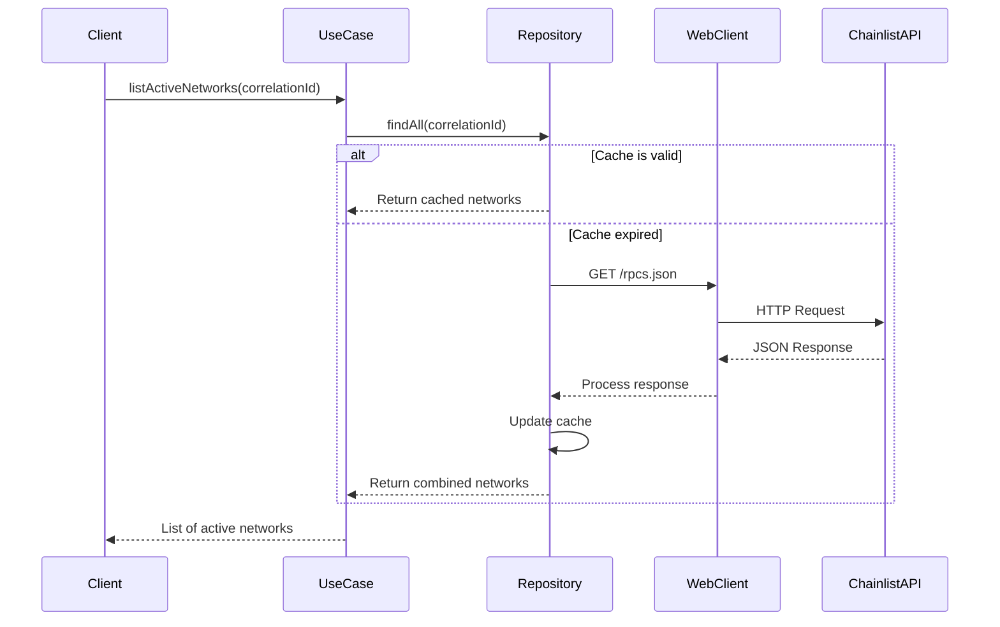
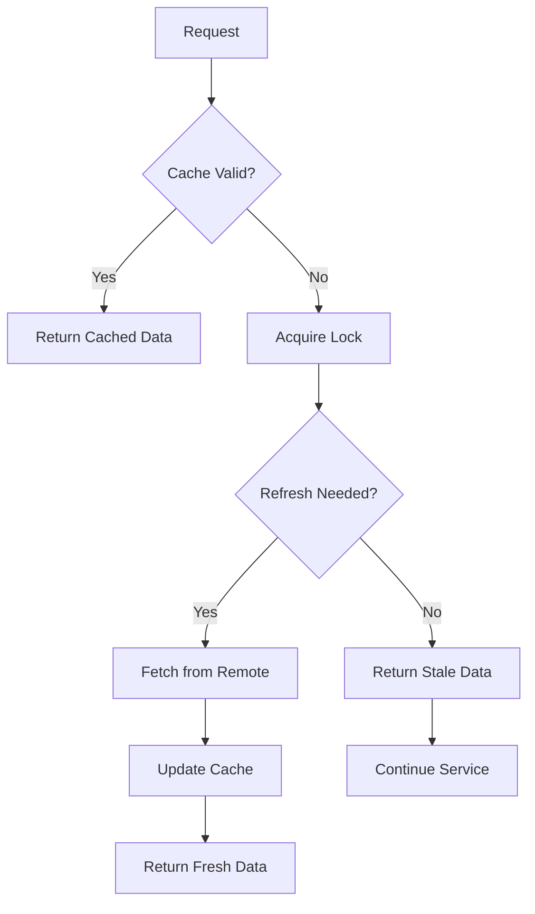

# Network Management

<cite>
**Referenced Files in This Document**
- [ChainlistNetworkRepository.java](file://src/main/java/dev/bloco/wallet/hub/infra/provider/data/repository/ChainlistNetworkRepository.java) - *Added with remote data source and caching*
- [AddNetworkUseCase.java](file://src/main/java/dev/bloco/wallet/hub/usecase/AddNetworkUseCase.java) - *Updated to support new repository*
- [ListNetworksUseCase.java](file://src/main/java/dev/bloco/wallet/hub/usecase/ListNetworksUseCase.java) - *Existing use case for network listing*
- [NetworkRepository.java](file://src/main/java/dev/bloco/wallet/hub/domain/gateway/NetworkRepository.java) - *Interface implemented by ChainlistNetworkRepository*
- [Network.java](file://src/main/java/dev/bloco/wallet/hub/domain/model/network/Network.java) - *Domain model for blockchain networks*
- [application.yml](file://src/main/resources/application.yml) - *Configuration properties for network services*
</cite>

## Update Summary
**Changes Made**
- Added comprehensive documentation for the new `ChainlistNetworkRepository` implementation
- Updated network addition and listing use cases with integration details
- Enhanced API interface descriptions based on code changes
- Added configuration and troubleshooting guidance for remote network integration
- Included practical examples for network operations

## Table of Contents
- [Purpose and Overview](#purpose-and-overview)
- [Implementation Details](#implementation-details)
  - [ChainlistNetworkRepository](#chainlistnetworkrepository)
  - [Network Repository Interface](#network-repository-interface)
  - [Configuration Properties](#configuration-properties)
- [API Interfaces](#api-interfaces)
  - [AddNetworkUseCase](#addnetworkusecase)
  - [ListNetworksUseCase](#listnetworksusecase)
- [Integration Patterns](#integration-patterns)
  - [Remote Data Source Integration](#remote-data-source-integration)
  - [Caching Strategy](#caching-strategy)
- [Practical Examples](#practical-examples)
- [Troubleshooting Guidance](#troubleshooting-guidance)

## Purpose and Overview
The Network Management system enables the wallet application to support multiple blockchain networks dynamically. It provides functionality to add, list, and manage blockchain networks including their RPC endpoints and explorer URLs. The system integrates with external data sources to automatically discover supported networks while allowing custom network configurations.

This documentation covers the core components responsible for network management, focusing on the newly implemented remote data source integration and caching mechanism that enhances network discovery capabilities.

## Implementation Details

### ChainlistNetworkRepository
The `ChainlistNetworkRepository` is a Spring-managed component that implements the `NetworkRepository` interface to provide access to both remote and custom blockchain networks. It fetches network data from an external Chainlist API and maintains a local cache to optimize performance.

```java
@Repository
public class ChainlistNetworkRepository implements NetworkRepository {
    private final WebClient webClient;
    private final ObjectMapper objectMapper;
    private final String chainlistUrl;
    private final Duration cacheTtl;

    private final AtomicReference<List<Network>> cachedRemoteNetworks = new AtomicReference<>(List.of());
    private final ConcurrentMap<UUID, Network> customNetworks = new ConcurrentHashMap<>();
    private volatile Instant cacheExpiresAt = Instant.EPOCH;
}
```

The repository combines networks from two sources:
1. **Remote networks**: Fetched from Chainlist API with configurable TTL-based caching
2. **Custom networks**: User-defined networks stored in memory

Cache invalidation occurs when the TTL expires or upon explicit refresh attempts. During failures to refresh from the remote source, the repository continues serving stale data to maintain availability.

**Section sources**
- [ChainlistNetworkRepository.java](file://src/main/java/dev/bloco/wallet/hub/infra/provider/data/repository/ChainlistNetworkRepository.java#L37-L277) - *Complete implementation with caching logic*

### Network Repository Interface
The `NetworkRepository` interface defines the contract for network data access operations. All implementations must support correlation IDs for distributed tracing across service boundaries.

```java
public interface NetworkRepository {
    Network save(Network network, String correlationId);
    Optional<Network> findById(UUID id, String correlationId);
    List<Network> findAll(String correlationId);
    void delete(UUID id, String correlationId);
    Optional<Network> findByChainId(String chainId, String correlationId);
    // Additional query methods...
}
```

The interface uses default methods to provide backward compatibility for methods without correlation IDs, automatically passing null values to the correlation-aware counterparts.

**Section sources**
- [NetworkRepository.java](file://src/main/java/dev/bloco/wallet/hub/domain/gateway/NetworkRepository.java#L9-L63) - *Interface definition with all required methods*

### Configuration Properties
The network management system is configured through application properties that control remote data source behavior and caching strategy.

```yaml
wallet:
  networks:
    chainlist-url: https://chainlist.org/rpcs.json
    cache-ttl: PT5M
```

**Configuration Parameters:**
- `wallet.networks.chainlist-url`: Endpoint for fetching remote network configurations (default: Chainlist RPC endpoint)
- `wallet.networks.cache-ttl`: Cache time-to-live duration using ISO-8601 format (default: 5 minutes)

These properties are injected into the `ChainlistNetworkRepository` during initialization and can be overridden in different deployment environments.

**Section sources**
- [application.yml](file://src/main/resources/application.yml#L37-L39) - *Configuration settings for network services*
- [ChainlistNetworkRepository.java](file://src/main/java/dev/bloco/wallet/hub/infra/provider/data/repository/ChainlistNetworkRepository.java#L53-L64) - *Constructor with property injection*

## API Interfaces

### AddNetworkUseCase
The `AddNetworkUseCase` handles the creation of new blockchain networks in the system. It validates input parameters and persists networks through the repository layer.

```java
public record AddNetworkUseCase(
    NetworkRepository networkRepository,
    DomainEventPublisher eventPublisher) {

    public Network addNetwork(String name, String chainId, String rpcUrl, String explorerUrl, String correlationId) {
        String normalizedCorrelation = normalizeCorrelationId(correlationId);
        validateInputs(name, chainId, rpcUrl, explorerUrl);

        if (networkRepository.existsByChainId(chainId, normalizedCorrelation)) {
            throw new IllegalArgumentException("A network with the provided chain ID already exists");
        }

        Network network = Network.create(
                UUID.randomUUID(),
                name,
                chainId,
                rpcUrl,
                explorerUrl
        );

        networkRepository.save(network, normalizedCorrelation);

        eventPublisher.publish(NetworkCreatedEvent.builder()
                .networkId(network.getId())
                .name(name)
                .chainId(chainId)
                .correlationId(UUID.fromString(normalizedCorrelation))
                .build());

        return network;
    }
}
```

**Input Validation Rules:**
- Name, chain ID, RPC URL, and explorer URL must be non-empty
- RPC and explorer URLs must use HTTP/HTTPS protocols
- Correlation ID must be a valid UUID
- Chain ID must be unique across all networks

**Section sources**
- [AddNetworkUseCase.java](file://src/main/java/dev/bloco/wallet/hub/usecase/AddNetworkUseCase.java#L0-L117) - *Complete use case implementation*

### ListNetworksUseCase
The `ListNetworksUseCase` provides read-only access to available blockchain networks with various filtering options.

```java
public record ListNetworksUseCase(NetworkRepository networkRepository) {

    public List<Network> listActiveNetworks(String correlationId) {
        String normalizedCorrelation = normalizeCorrelationId(correlationId);
        return networkRepository.findAll(normalizedCorrelation).stream()
                .filter(Network::isAvailable)
                .toList();
    }

    public List<Network> listAllNetworks(String correlationId) {
        return networkRepository.findAll(normalizeCorrelationId(correlationId));
    }

    public Network getNetworkDetails(UUID networkId, String correlationId) {
        validateNetworkId(networkId);
        String normalizedCorrelation = normalizeCorrelationId(correlationId);

        return networkRepository.findById(networkId, normalizedCorrelation)
                .orElseThrow(() -> new IllegalArgumentException("Network not found with id: " + networkId));
    }

    public List<NetworkHealthInfo> getNetworkHealthStatus(String correlationId) {
        List<Network> networks = networkRepository.findAll(normalizeCorrelationId(correlationId));
        return networks.stream().map(this::createHealthInfo).toList();
    }
}
```

The use case supports multiple retrieval methods:
- Active networks only (default behavior)
- All networks regardless of status
- Specific network by ID
- Search by name pattern
- Health status monitoring

**Section sources**
- [ListNetworksUseCase.java](file://src/main/java/dev/bloco/wallet/hub/usecase/ListNetworksUseCase.java#L0-L143) - *Complete implementation with health monitoring*

## Integration Patterns

### Remote Data Source Integration
The system integrates with external network directories using reactive HTTP clients for non-blocking I/O operations.



The integration uses Spring WebClient with timeout protection (10 seconds) and error handling to ensure resilience against external service failures.

**Diagram sources**
- [ChainlistNetworkRepository.java](file://src/main/java/dev/bloco/wallet/hub/infra/provider/data/repository/ChainlistNetworkRepository.java#L180-L230) - *WebClient implementation*

### Caching Strategy
The repository implements a hybrid caching approach combining in-memory storage with time-based expiration.



Key aspects of the caching strategy:
- **Time-based expiration**: Configurable TTL prevents stale data accumulation
- **Synchronized refresh**: Prevents thundering herd problems during cache misses
- **Fail-safe operation**: Continues serving stale data when remote updates fail
- **Atomic updates**: Ensures thread-safe cache modifications

**Diagram sources**
- [ChainlistNetworkRepository.java](file://src/main/java/dev/bloco/wallet/hub/infra/provider/data/repository/ChainlistNetworkRepository.java#L150-L180) - *Cache validation and refresh logic*

## Practical Examples

### Adding a Custom Network
```java
// Example correlation ID (should come from request context)
String correlationId = "a1b2c3d4-e5f6-7890-g1h2-i3j4k5l6m7n8";

Network network = addNetworkUseCase.addNetwork(
    "Polygon Mainnet",
    "137",
    "https://polygon-rpc.com",
    "https://polygonscan.com",
    correlationId
);

System.out.println("Added network: " + network.getName() + " (ID: " + network.getId() + ")");
```

### Listing Available Networks
```java
// Retrieve all active networks
List<Network> activeNetworks = listNetworksUseCase.listActiveNetworks(correlationId);
activeNetworks.forEach(n -> 
    System.out.println("Active: " + n.getName() + " - " + n.getChainId())
);

// Search for networks by name
List<Network> ethereumNetworks = listNetworksUseCase.searchNetworksByName("ethereum", correlationId);
ethereumNetworks.forEach(n -> 
    System.out.println("Found: " + n.getName())
);

// Get health status of all networks
List<NetworkHealthInfo> healthStatus = listNetworksUseCase.getNetworkHealthStatus(correlationId);
healthStatus.forEach(h -> 
    System.out.println(h.name() + ": " + h.healthStatus())
);
```

## Troubleshooting Guidance

### Common Issues and Solutions

**Issue:** Empty network list despite expected results  
**Solution:** Verify the `chainlist-url` configuration and check network connectivity. Test the endpoint directly:
```bash
curl -H "X-Correlation-Id: test" https://chainlist.org/rpcs.json | head -20
```

**Issue:** Slow network listing performance  
**Solution:** Adjust the `cache-ttl` property to balance freshness and performance:
```yaml
wallet:
  networks:
    cache-ttl: PT15M  # Increase to 15 minutes
```

**Issue:** Failed to parse Chainlist response  
**Solution:** Check server logs for JSON parsing errors. The remote format may have changed. Enable debug logging:
```yaml
logging:
  level:
    dev.bloco.wallet.hub.infra.provider.data.repository: DEBUG
```

**Issue:** Duplicate network entries  
**Solution:** Ensure chain IDs are unique. The system generates deterministic UUIDs for Chainlist networks based on chain ID and timestamp to prevent collisions.

### Monitoring and Logging
The system includes comprehensive logging for operational visibility:

- **INFO level**: Cache refresh operations and statistics
- **WARN level**: Empty responses or unexpected payload formats
- **ERROR level**: HTTP communication failures or JSON parsing exceptions

Correlation IDs are propagated throughout the call chain to enable distributed tracing of network operations.

**Section sources**
- [ChainlistNetworkRepository.java](file://src/main/java/dev/bloco/wallet/hub/infra/provider/data/repository/ChainlistNetworkRepository.java#L200-L230) - *Logging implementation for remote calls*