# Outbox & Saga Patterns

<cite>
**Referenced Files in This Document**  
- [OutboxEvent.java](file://src/main/java/dev/bloco/wallet/hub/infra/provider/data/OutboxEvent.java)
- [OutboxService.java](file://src/main/java/dev/bloco/wallet/hub/infra/provider/data/OutboxService.java)
- [OutboxEventPublisher.java](file://src/main/java/dev/bloco/wallet/hub/infra/adapter/event/OutboxEventPublisher.java)
- [OutboxRepository.java](file://src/main/java/dev/bloco/wallet/hub/infra/provider/data/repository/OutboxRepository.java)
- [OutboxWorker.java](file://src/main/java/dev/bloco/wallet/hub/infra/provider/data/OutboxWorker.java)
- [KafkaEventProducer.java](file://src/main/java/dev/bloco/wallet/hub/infra/adapter/event/producer/KafkaEventProducer.java)
- [SagaStateMachineConfig.java](file://src/main/java/dev/bloco/wallet/hub/infra/provider/data/config/SagaStateMachineConfig.java)
- [StandardSagaStateMachineConfig.java](file://src/main/java/dev/bloco/wallet/hub/infra/provider/data/config/StandardSagaStateMachineConfig.java)
- [SagaStates.java](file://src/main/java/dev/bloco/wallet/hub/infra/provider/data/config/SagaStates.java)
- [SagaEvents.java](file://src/main/java/dev/bloco/wallet/hub/infra/provider/data/config/SagaEvents.java)
- [StateMachineRepository.java](file://src/main/java/dev/bloco/wallet/hub/infra/provider/data/repository/StateMachineRepository.java)
- [WalletCreatedEventConsumer.java](file://src/main/java/dev/bloco/wallet/hub/infra/adapter/event/consumer/WalletCreatedEventConsumer.java)
- [CreateWalletUseCase.java](file://src/main/java/dev/bloco/wallet/hub/usecase/CreateWalletUseCase.java)
- [application.yml](file://src/main/resources/application.yml)
</cite>

## Table of Contents
1. [Introduction](#introduction)
2. [Outbox Pattern Implementation](#outbox-pattern-implementation)
3. [Saga Pattern Implementation](#saga-pattern-implementation)
4. [Integration and Workflow](#integration-and-workflow)
5. [Configuration and Persistence](#configuration-and-persistence)
6. [Scalability and Monitoring](#scalability-and-monitoring)
7. [Error Handling and Recovery](#error-handling-and-recovery)
8. [Debugging Tips and Common Pitfalls](#debugging-tips-and-common-pitfalls)
9. [Conclusion](#conclusion)

## Introduction

This document provides comprehensive architectural documentation for the Outbox and Saga patterns implemented in the bloco-wallet-java application. The Outbox pattern ensures reliable message publishing by decoupling database commits from message broker interactions, preventing data inconsistency in distributed systems. The Saga pattern manages long-running transactions through state machines, coordinating complex workflows like wallet creation and fund transfers. Together, these patterns provide robust solutions for maintaining data consistency and handling distributed transactions in a microservices architecture.

## Outbox Pattern Implementation

The Outbox pattern in bloco-wallet-java ensures atomicity between database operations and message publishing through a transactional outbox table. This implementation guarantees that domain events are reliably published even in the face of system failures.

### OutboxEvent Entity

The `OutboxEvent` entity represents messages queued for publication in the outbox pattern. It contains essential metadata for reliable message delivery:

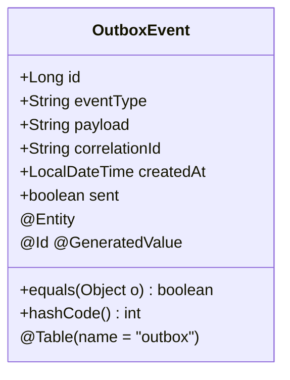

**Diagram sources**  
- [OutboxEvent.java](file://src/main/java/dev/bloco/wallet/hub/infra/provider/data/OutboxEvent.java#L41-L85)

**Section sources**  
- [OutboxEvent.java](file://src/main/java/dev/bloco/wallet/hub/infra/provider/data/OutboxEvent.java#L1-L87)

### Outbox Service Layer

The `OutboxService` provides the core business logic for managing outbox events, ensuring transactional consistency when persisting events to the database:

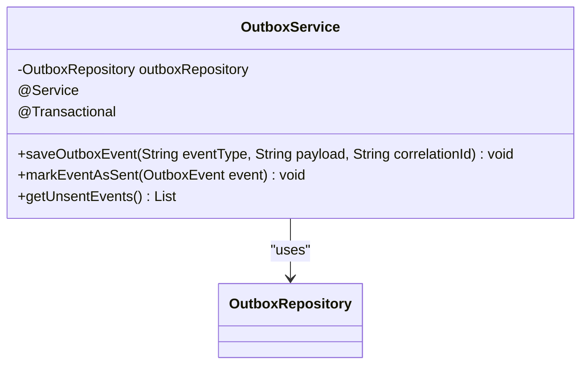

**Diagram sources**  
- [OutboxService.java](file://src/main/java/dev/bloco/wallet/hub/infra/provider/data/OutboxService.java#L31-L85)
- [OutboxRepository.java](file://src/main/java/dev/bloco/wallet/hub/infra/provider/data/repository/OutboxRepository.java#L26-L28)

**Section sources**  
- [OutboxService.java](file://src/main/java/dev/bloco/wallet/hub/infra/provider/data/OutboxService.java#L1-L86)

### Event Publishing Mechanism

The `OutboxEventPublisher` implements the domain event publishing interface, serializing events and storing them in the outbox table within the same transaction as the originating business operation:

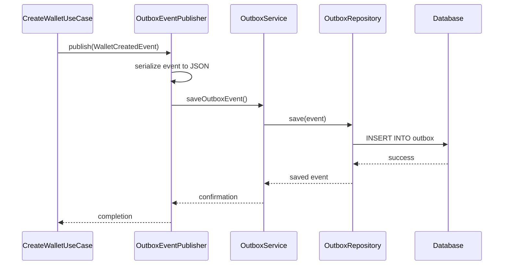

**Diagram sources**  
- [OutboxEventPublisher.java](file://src/main/java/dev/bloco/wallet/hub/infra/adapter/event/OutboxEventPublisher.java#L30-L74)
- [CreateWalletUseCase.java](file://src/main/java/dev/bloco/wallet/hub/usecase/CreateWalletUseCase.java#L30-L40)

**Section sources**  
- [OutboxEventPublisher.java](file://src/main/java/dev/bloco/wallet/hub/infra/adapter/event/OutboxEventPublisher.java#L1-L75)
- [CreateWalletUseCase.java](file://src/main/java/dev/bloco/wallet/hub/usecase/CreateWalletUseCase.java#L1-L41)

## Saga Pattern Implementation

The Saga pattern in bloco-wallet-java manages long-running workflows through state machines, coordinating distributed operations while maintaining consistency across service boundaries.

### State Machine Configuration

The `SagaStateMachineConfig` defines the states and transitions for the saga workflow, implementing the Spring StateMachine configuration:

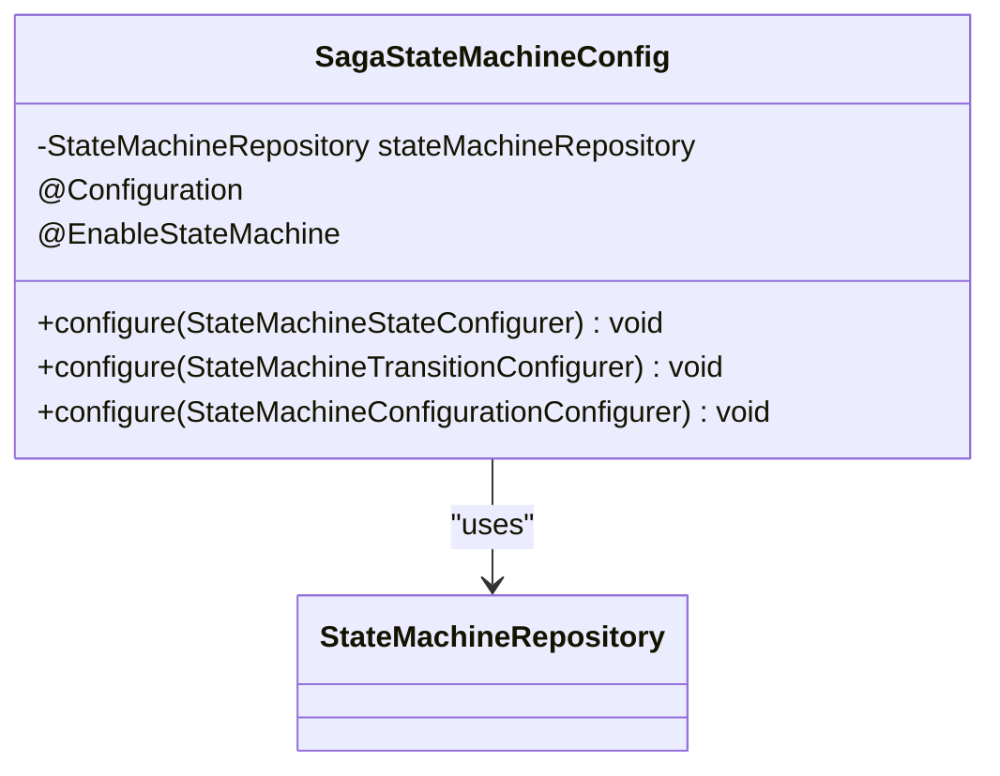

**Diagram sources**  
- [SagaStateMachineConfig.java](file://src/main/java/dev/bloco/wallet/hub/infra/provider/data/config/SagaStateMachineConfig.java#L28-L117)
- [StateMachineRepository.java](file://src/main/java/dev/bloco/wallet/hub/infra/provider/data/repository/StateMachineRepository.java#L10-L11)

**Section sources**  
- [SagaStateMachineConfig.java](file://src/main/java/dev/bloco/wallet/hub/infra/provider/data/config/SagaStateMachineConfig.java#L1-L118)

### State and Event Definitions

The `SagaStates` and `SagaEvents` enums define the possible states and events in the saga workflow, providing type safety and clarity for state transitions:

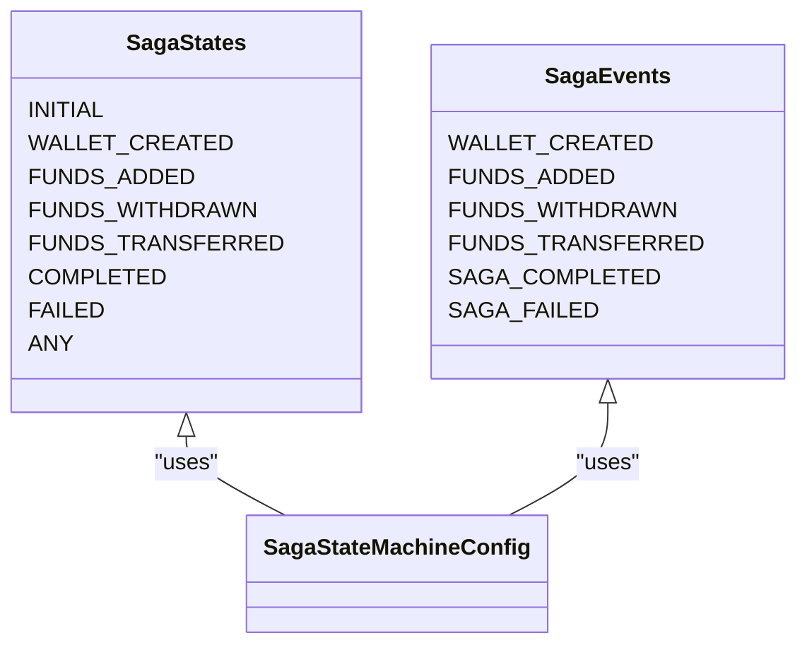

**Diagram sources**  
- [SagaStates.java](file://src/main/java/dev/bloco/wallet/hub/infra/provider/data/config/SagaStates.java#L24-L33)
- [SagaEvents.java](file://src/main/java/dev/bloco/wallet/hub/infra/provider/data/config/SagaEvents.java#L20-L27)

**Section sources**  
- [SagaStates.java](file://src/main/java/dev/bloco/wallet/hub/infra/provider/data/config/SagaStates.java#L1-L33)
- [SagaEvents.java](file://src/main/java/dev/bloco/wallet/hub/infra/provider/data/config/SagaEvents.java#L1-L27)

### State Transitions

The state machine configuration defines the valid transitions between states, ensuring the workflow progresses correctly through the saga lifecycle:

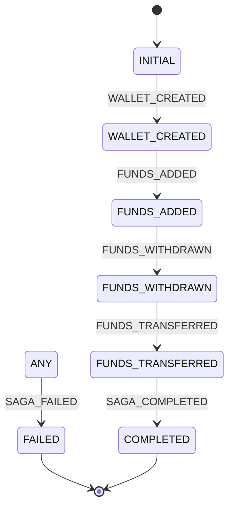

**Diagram sources**  
- [SagaStateMachineConfig.java](file://src/main/java/dev/bloco/wallet/hub/infra/provider/data/config/SagaStateMachineConfig.java#L60-L100)

**Section sources**  
- [SagaStateMachineConfig.java](file://src/main/java/dev/bloco/wallet/hub/infra/provider/data/config/SagaStateMachineConfig.java#L1-L118)

## Integration and Workflow

The integration between the Outbox and Saga patterns creates a robust system for handling distributed transactions while maintaining data consistency.

### Wallet Creation Workflow

The wallet creation process demonstrates the integration of both patterns, where a domain event triggers a saga state transition:

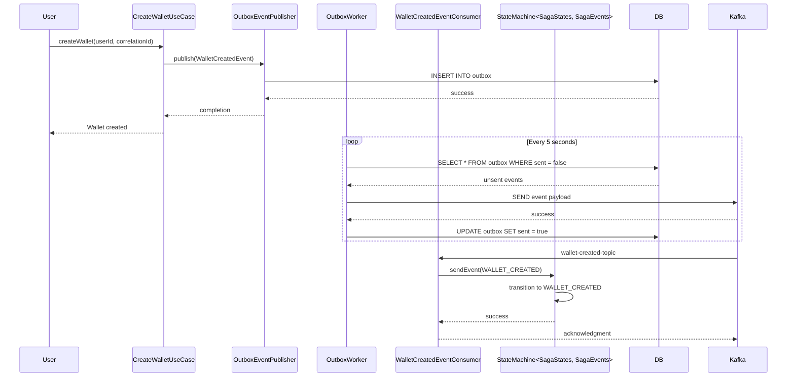

**Diagram sources**  
- [CreateWalletUseCase.java](file://src/main/java/dev/bloco/wallet/hub/usecase/CreateWalletUseCase.java#L30-L40)
- [OutboxEventPublisher.java](file://src/main/java/dev/bloco/wallet/hub/infra/adapter/event/OutboxEventPublisher.java#L60-L70)
- [OutboxWorker.java](file://src/main/java/dev/bloco/wallet/hub/infra/provider/data/OutboxWorker.java#L50-L60)
- [WalletCreatedEventConsumer.java](file://src/main/java/dev/bloco/wallet/hub/infra/adapter/event/consumer/WalletCreatedEventConsumer.java#L50-L60)
- [SagaStateMachineConfig.java](file://src/main/java/dev/bloco/wallet/hub/infra/provider/data/config/SagaStateMachineConfig.java#L60-L70)

**Section sources**  
- [CreateWalletUseCase.java](file://src/main/java/dev/bloco/wallet/hub/usecase/CreateWalletUseCase.java#L1-L41)
- [OutboxWorker.java](file://src/main/java/dev/bloco/wallet/hub/infra/provider/data/OutboxWorker.java#L1-L94)
- [WalletCreatedEventConsumer.java](file://src/main/java/dev/bloco/wallet/hub/infra/adapter/event/consumer/WalletCreatedEventConsumer.java#L1-L68)

## Configuration and Persistence

The configuration and persistence mechanisms ensure that both patterns operate reliably and can recover from failures.

### Standard Configuration

The `StandardSagaStateMachineConfig` provides an alternative configuration for the saga state machine, demonstrating configuration flexibility:

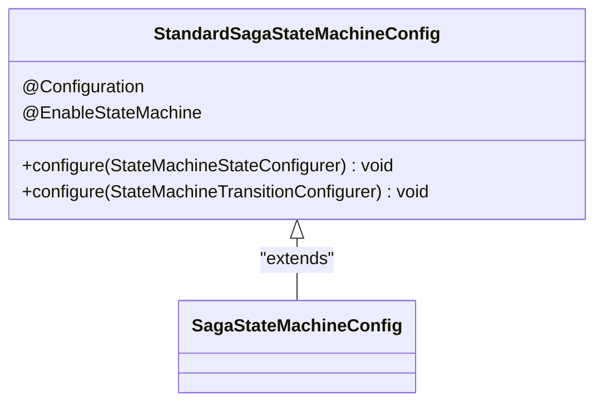

**Diagram sources**  
- [StandardSagaStateMachineConfig.java](file://src/main/java/dev/bloco/wallet/hub/infra/provider/data/config/StandardSagaStateMachineConfig.java#L32-L105)

**Section sources**  
- [StandardSagaStateMachineConfig.java](file://src/main/java/dev/bloco/wallet/hub/infra/provider/data/config/StandardSagaStateMachineConfig.java#L1-L106)

### State Persistence

The `StateMachineRepository` extends Spring StateMachine's JPA repository, enabling persistent storage of state machine state:

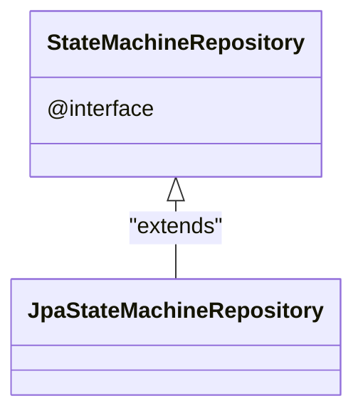

**Diagram sources**  
- [StateMachineRepository.java](file://src/main/java/dev/bloco/wallet/hub/infra/provider/data/repository/StateMachineRepository.java#L10-L11)

**Section sources**  
- [StateMachineRepository.java](file://src/main/java/dev/bloco/wallet/hub/infra/provider/data/repository/StateMachineRepository.java#L1-L12)

### Application Configuration

The application.yml file contains configuration for the messaging system and database connections:

```yaml
spring:
  cloud:
    stream:
      bindings:
        walletCreatedEventProducer-out-0:
          destination: wallet-created-topic
      kafka:
        binder:
          brokers: localhost:9092
  datasource:
    url: jdbc:h2:file:./db/wallet
```

**Section sources**  
- [application.yml](file://src/main/resources/application.yml#L1-L34)

## Scalability and Monitoring

The implementation includes mechanisms for scalability and monitoring of the outbox and saga patterns.

### Outbox Processing

The `OutboxWorker` and `KafkaEventProducer` components handle the processing of unsent events, ensuring reliable message delivery:

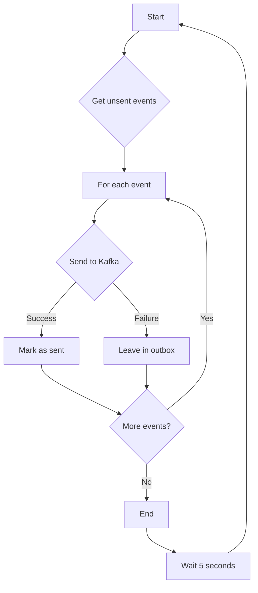

**Diagram sources**  
- [OutboxWorker.java](file://src/main/java/dev/bloco/wallet/hub/infra/provider/data/OutboxWorker.java#L50-L60)
- [KafkaEventProducer.java](file://src/main/java/dev/bloco/wallet/hub/infra/adapter/event/producer/KafkaEventProducer.java#L130-L150)

**Section sources**  
- [OutboxWorker.java](file://src/main/java/dev/bloco/wallet/hub/infra/provider/data/OutboxWorker.java#L1-L94)
- [KafkaEventProducer.java](file://src/main/java/dev/bloco/wallet/hub/infra/adapter/event/producer/KafkaEventProducer.java#L1-L151)

## Error Handling and Recovery

The system includes comprehensive error handling and recovery mechanisms for both patterns.

### Failure Scenarios

The implementation handles various failure scenarios to ensure data consistency:

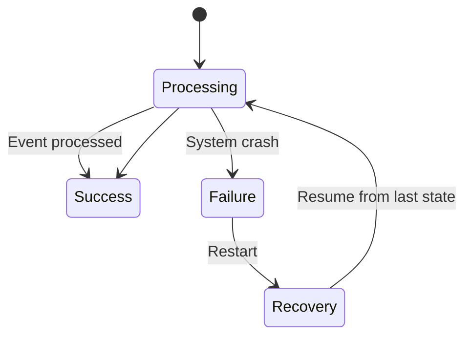

**Diagram sources**  
- [OutboxWorker.java](file://src/main/java/dev/bloco/wallet/hub/infra/provider/data/OutboxWorker.java#L50-L60)
- [SagaStateMachineConfig.java](file://src/main/java/dev/bloco/wallet/hub/infra/provider/data/config/SagaStateMachineConfig.java#L90-L100)

**Section sources**  
- [OutboxWorker.java](file://src/main/java/dev/bloco/wallet/hub/infra/provider/data/OutboxWorker.java#L1-L94)
- [SagaStateMachineConfig.java](file://src/main/java/dev/bloco/wallet/hub/infra/provider/data/config/SagaStateMachineConfig.java#L1-L118)

## Debugging Tips and Common Pitfalls

When working with the Outbox and Saga patterns, several debugging tips and common pitfalls should be considered.

### Debugging Strategies

Effective debugging strategies include monitoring the outbox table and state machine state:

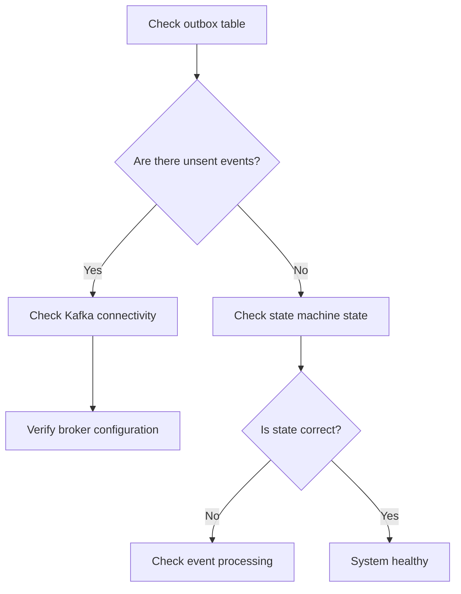

**Section sources**  
- [OutboxWorker.java](file://src/main/java/dev/bloco/wallet/hub/infra/provider/data/OutboxWorker.java#L50-L60)
- [WalletCreatedEventConsumer.java](file://src/main/java/dev/bloco/wallet/hub/infra/adapter/event/consumer/WalletCreatedEventConsumer.java#L50-L60)

### Common Pitfalls

Common pitfalls when implementing these patterns include:

1. **Transaction boundaries**: Ensure that database operations and outbox event creation occur within the same transaction.
2. **Idempotency**: Design consumers to handle duplicate messages gracefully.
3. **State consistency**: Ensure that state machine state is persisted reliably.
4. **Error handling**: Implement proper error handling for message serialization and delivery failures.
5. **Monitoring**: Set up monitoring for the outbox table and state machine state to detect issues early.

## Conclusion

The Outbox and Saga patterns in bloco-wallet-java provide robust solutions for maintaining data consistency in distributed systems. The Outbox pattern ensures reliable message publishing by decoupling database commits from message broker interactions, while the Saga pattern manages long-running transactions through state machines. Together, these patterns enable the system to handle complex workflows like wallet creation and fund transfers while maintaining data integrity. The implementation includes comprehensive error handling, recovery mechanisms, and monitoring capabilities, making it suitable for production use in distributed environments.