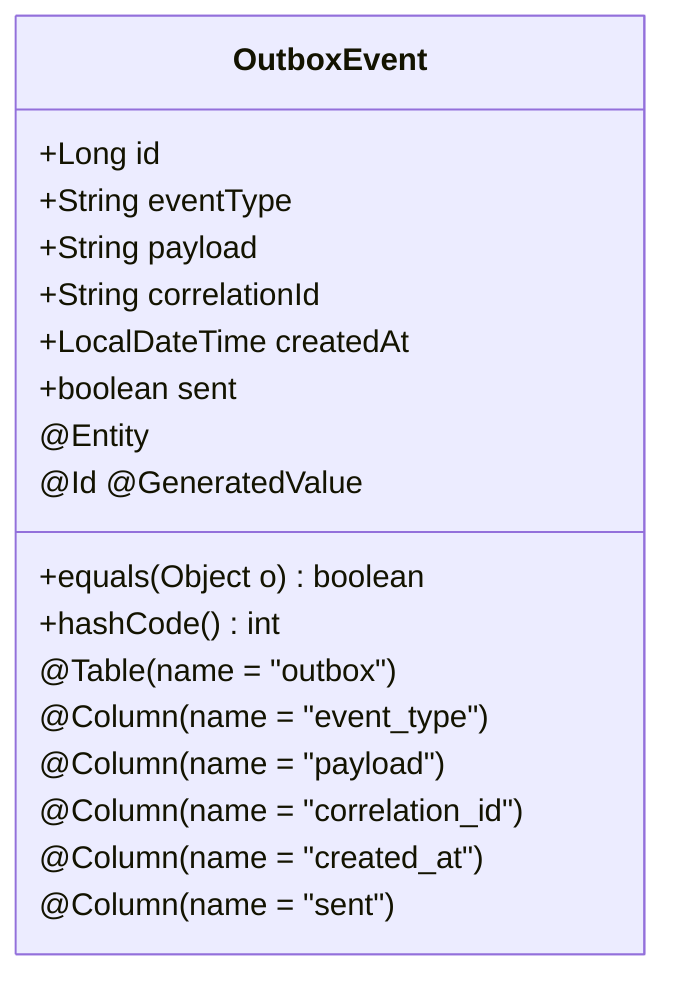
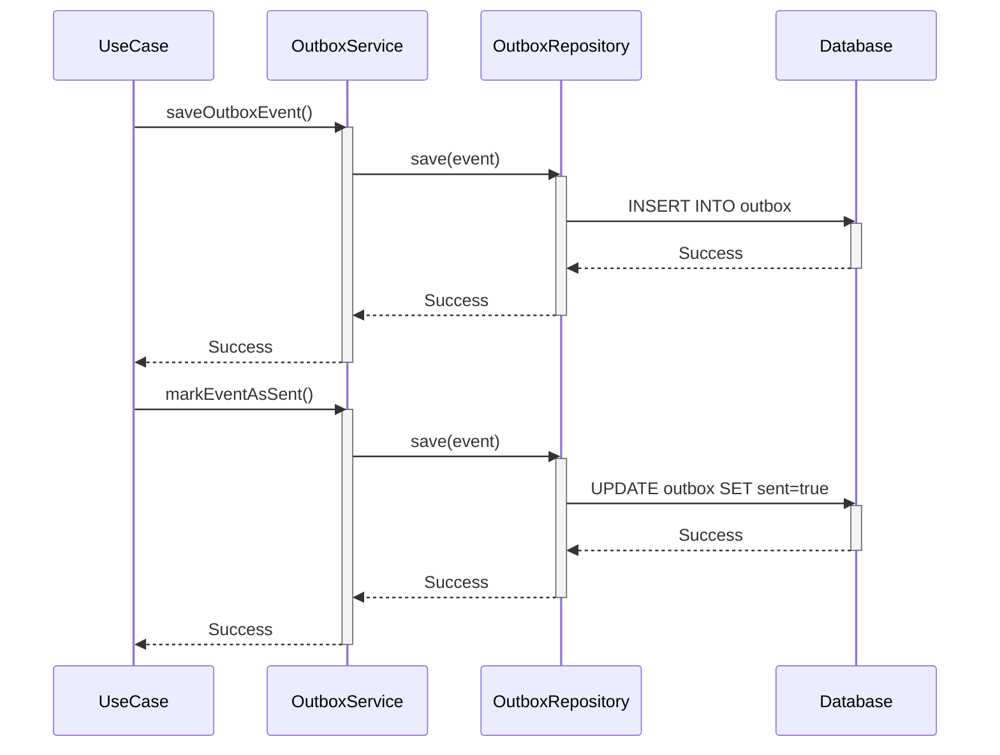
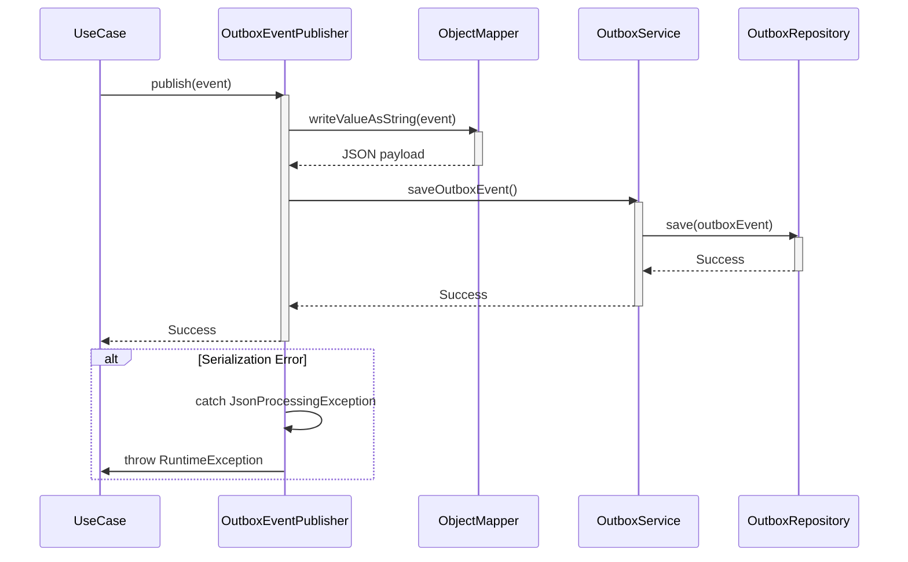
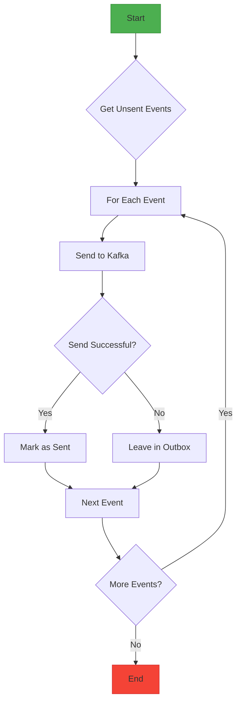

# Outbox Implementation

<cite>
**Referenced Files in This Document**   
- [OutboxEvent.java](file://src/main/java/dev/bloco/wallet/hub/infra/provider/data/OutboxEvent.java)
- [OutboxService.java](file://src/main/java/dev/bloco/wallet/hub/infra/provider/data/OutboxService.java)
- [OutboxEventPublisher.java](file://src/main/java/dev/bloco/wallet/hub/infra/adapter/event/OutboxEventPublisher.java)
- [OutboxWorker.java](file://src/main/java/dev/bloco/wallet/hub/infra/provider/data/OutboxWorker.java)
- [KafkaEventProducer.java](file://src/main/java/dev/bloco/wallet/hub/infra/adapter/event/producer/KafkaEventProducer.java)
- [OutboxRepository.java](file://src/main/java/dev/bloco/wallet/hub/infra/provider/data/repository/OutboxRepository.java)
- [DomainEventPublisher.java](file://src/main/java/dev/bloco/wallet/hub/domain/gateway/DomainEventPublisher.java)
- [application.yml](file://src/main/resources/application.yml)
</cite>

## Table of Contents
1. [Introduction](#introduction)
2. [OutboxEvent Entity Structure](#outboxevent-entity-structure)
3. [Transactional Event Persistence](#transactional-event-persistence)
4. [Domain Event Publication Workflow](#domain-event-publication-workflow)
5. [Outbox Processing and Kafka Integration](#outbox-processing-and-kafka-integration)
6. [Database and Performance Considerations](#database-and-performance-considerations)
7. [Error Handling and Recovery](#error-handling-and-recovery)
8. [Best Practices and Monitoring](#best-practices-and-monitoring)
9. [Conclusion](#conclusion)

## Introduction

The Outbox pattern implementation in bloco-wallet-java provides a reliable mechanism for ensuring eventual consistency between business data operations and event publication in distributed systems. This architectural pattern addresses the challenge of atomicity when updating database records and publishing events to message brokers like Kafka. By storing events in the same database transaction as business data, the system guarantees that events are not lost even if downstream services are temporarily unavailable.

The implementation consists of several key components working together: the OutboxEvent entity that represents messages in the outbox table, the OutboxService that manages transactional operations on these events, the OutboxEventPublisher that integrates with domain events, and the OutboxWorker that processes unsent events. This documentation details how these components collaborate to provide a robust event-driven architecture that maintains data consistency while enabling asynchronous communication between system components.

## OutboxEvent Entity Structure

The OutboxEvent entity serves as the core data structure for the outbox pattern implementation, representing events that need to be processed and delivered to external systems. This JPA entity is mapped to the 'outbox' database table and contains essential fields for tracking event metadata and processing state.



**Diagram sources**
- [OutboxEvent.java](file://src/main/java/dev/bloco/wallet/hub/infra/provider/data/OutboxEvent.java#L41-L85)

**Section sources**
- [OutboxEvent.java](file://src/main/java/dev/bloco/wallet/hub/infra/provider/data/OutboxEvent.java#L41-L85)

The entity includes the following key fields:
- **id**: A unique identifier generated by the database using GenerationType.IDENTITY
- **eventType**: The type or category of the event, stored in the 'event_type' column
- **payload**: The serialized event data in JSON format, stored in the 'payload' column
- **correlationId**: An optional identifier to associate the event with other records or workflows
- **createdAt**: Timestamp of when the event was created, defaulting to the current time
- **sent**: Boolean flag indicating whether the event has been successfully processed

The implementation uses Lombok annotations (@Getter, @Setter, @ToString) to reduce boilerplate code while maintaining clean, readable entity definitions. Special attention is given to proper equality comparison through overridden equals() and hashCode() methods that handle Hibernate proxy instances correctly, ensuring consistent behavior when working with JPA-managed entities.

## Transactional Event Persistence

The OutboxService class provides transactional methods to ensure atomicity between business data operations and event persistence. This service acts as the primary interface for managing outbox events within the same database transaction as the business logic that generates them.



**Diagram sources**
- [OutboxService.java](file://src/main/java/dev/bloco/wallet/hub/infra/provider/data/OutboxService.java#L31-L85)
- [OutboxRepository.java](file://src/main/java/dev/bloco/wallet/hub/infra/provider/data/repository/OutboxRepository.java#L15-L25)

**Section sources**
- [OutboxService.java](file://src/main/java/dev/bloco/wallet/hub/infra/provider/data/OutboxService.java#L31-L85)

The service provides three key methods:
- **saveOutboxEvent()**: Persists a new outbox event with the specified event type, payload, and correlation ID within a transactional context
- **markEventAsSent()**: Updates an existing event's status to indicate successful processing, also within a transaction
- **getUnsentEvents()**: Retrieves all events that have not yet been marked as sent for processing

These methods are annotated with @Transactional to ensure that database operations are committed or rolled back as a single unit. When a business use case (such as creating a wallet or transferring funds) modifies data and needs to publish an event, both operations occur within the same transaction. If either operation fails, the entire transaction is rolled back, preventing inconsistencies between the business data and event publication.

## Domain Event Publication Workflow

The OutboxEventPublisher implements the DomainEventPublisher interface to bridge domain-driven design concepts with the outbox pattern implementation. This component is responsible for serializing domain events into JSON format and persisting them in the outbox table within the same database transaction as the business operation.



**Diagram sources**
- [OutboxEventPublisher.java](file://src/main/java/dev/bloco/wallet/hub/infra/adapter/event/OutboxEventPublisher.java#L30-L74)
- [OutboxService.java](file://src/main/java/dev/bloco/wallet/hub/infra/provider/data/OutboxService.java#L55-L65)

**Section sources**
- [OutboxEventPublisher.java](file://src/main/java/dev/bloco/wallet/hub/infra/adapter/event/OutboxEventPublisher.java#L30-L74)
- [DomainEventPublisher.java](file://src/main/java/dev/bloco/wallet/hub/domain/gateway/DomainEventPublisher.java#L11-L13)

The publication workflow follows these steps:
1. A domain event (such as WalletCreatedEvent or FundsTransferredEvent) is generated by a business use case
2. The OutboxEventPublisher's publish() method is called with the domain event as a parameter
3. The ObjectMapper serializes the event object into JSON format using writeValueAsString()
4. A new OutboxEvent is created with the event type (derived from the class name) and serialized payload
5. The OutboxService saves the event to the database within the current transaction

The implementation includes robust error handling for JSON processing exceptions. If serialization fails, the method logs the error and throws a RuntimeException, which causes the current transaction to roll back. This prevents the system from persisting corrupted or incomplete event data. The ObjectMapper is configured with findAndRegisterModules() to ensure proper handling of Java Time API types like Instant and LocalDateTime during serialization.

## Outbox Processing and Kafka Integration

The outbox processing workflow is managed by scheduled components that periodically check for unsent events and publish them to Kafka topics. Two implementations exist in the system: OutboxWorker and KafkaEventProducer, both using Spring's @Scheduled annotation to run at fixed intervals.



**Diagram sources**
- [OutboxWorker.java](file://src/main/java/dev/bloco/wallet/hub/infra/provider/data/OutboxWorker.java#L43-L93)
- [KafkaEventProducer.java](file://src/main/java/dev/bloco/wallet/hub/infra/adapter/event/producer/KafkaEventProducer.java#L29-L151)

**Section sources**
- [OutboxWorker.java](file://src/main/java/dev/bloco/wallet/hub/infra/provider/data/OutboxWorker.java#L43-L93)
- [KafkaEventProducer.java](file://src/main/java/dev/bloco/wallet/hub/infra/adapter/event/producer/KafkaEventProducer.java#L29-L151)

Both components follow a similar polling pattern:
- Check for unsent events using OutboxService.getUnsentEvents()
- For each event, send the payload to Kafka using StreamBridge.send()
- If the send operation succeeds, mark the event as sent using OutboxService.markEventAsSent()

The StreamBridge dynamically determines the destination topic by appending "-out-0" to the event type. Configuration in application.yml maps these logical channel names to actual Kafka topics:
- walletCreatedEventProducer-out-0 → wallet-created-topic
- fundsAddedEventProducer-out-0 → funds-added-topic
- fundsWithdrawnEventProducer-out-0 → funds-withdrawn-topic
- fundsTransferredEventProducer-out-0 → funds-transferred-topic

This approach ensures that events are delivered reliably while maintaining loose coupling between components. Failed deliveries leave events in the outbox for retry during the next processing cycle, providing built-in recovery from transient failures.

## Database and Performance Considerations

The outbox implementation includes several database and performance optimizations to ensure efficient operation at scale. The primary consideration is indexing strategy for the 'sent' column, which is critical for the performance of queries that retrieve unsent events.

```mermaid
erDiagram
OUTBOX {
bigint id PK
varchar event_type
text payload
varchar correlation_id
timestamp created_at
boolean sent
}
index sent_idx(OUTBOX.sent)
index created_at_idx(OUTBOX.created_at)
index correlation_id_idx(OUTBOX.correlation_id)
```

**Diagram sources**
- [OutboxEvent.java](file://src/main/java/dev/bloco/wallet/hub/infra/provider/data/OutboxEvent.java#L41-L85)
- [application.yml](file://src/main/resources/application.yml#L1-L35)

**Section sources**
- [OutboxEvent.java](file://src/main/java/dev/bloco/wallet/hub/infra/provider/data/OutboxEvent.java#L41-L85)
- [application.yml](file://src/main/resources/application.yml#L1-L35)

Key performance considerations include:
- **Indexing**: A database index on the 'sent' column enables efficient retrieval of unsent events without full table scans
- **Polling Interval**: Both OutboxWorker and KafkaEventProducer use a 5-second fixed rate (fixedRate = 5000), balancing timely delivery with system load
- **Batch Processing**: Events are processed in batches during each polling cycle, reducing the number of individual database transactions
- **Payload Size**: The payload column uses TEXT type to accommodate potentially large JSON payloads from complex domain events

The JPA configuration in application.yml sets spring.jpa.hibernate.ddl-auto to 'update', allowing the database schema to evolve with the entity definitions. The H2 dialect is specified for compatibility with the embedded database used in development. For production environments, these settings would typically be adjusted for performance and security considerations.

## Error Handling and Recovery

The outbox implementation incorporates comprehensive error handling and recovery mechanisms to ensure reliability in the face of failures. These mechanisms operate at multiple levels of the processing pipeline to prevent data loss and maintain system consistency.

When a domain event cannot be serialized to JSON, the OutboxEventPublisher catches the JsonProcessingException, logs the error with full stack trace, and throws a RuntimeException. This causes the current database transaction to roll back, preventing the creation of an incomplete or corrupted outbox event. The logging ensures that serialization issues are visible for debugging and monitoring.

For events that fail to publish to Kafka, the system employs a retry-based recovery mechanism. Since the markEventAsSent() operation only occurs after successful delivery, failed events remain in the outbox with sent = false. During the next polling cycle (every 5 seconds), these events are reprocessed and attempted again. This approach provides automatic recovery from transient failures such as network issues or temporary unavailability of the Kafka broker.

The system also handles service failures gracefully. If the application crashes or is restarted while processing events, any events that were not successfully marked as sent remain in the outbox. When the service restarts, the scheduled processors immediately begin processing these pending events, ensuring exactly-once delivery semantics over time. This makes the system resilient to both planned and unplanned downtime.

## Best Practices and Monitoring

The outbox implementation follows several best practices for event-driven architectures and provides opportunities for monitoring system health and performance.

**Payload Size Management**: The system should enforce limits on event payload size to prevent performance degradation. Large payloads can slow down serialization, increase database storage requirements, and impact Kafka throughput. Consider implementing payload size validation or using references to external storage for large data.

**Event Schema Evolution**: As domain events evolve, maintain backward compatibility in event schemas. Use semantic versioning in event types or include version information in the payload to allow consumers to handle different event versions appropriately. Avoid breaking changes to event structures that would prevent existing consumers from processing historical events.

**Monitoring Outbox Queue Depth**: Implement monitoring of the outbox queue depth (count of unsent events) to detect processing bottlenecks. A growing queue indicates that events are being produced faster than they can be consumed, which may require scaling the processing components or investigating Kafka connectivity issues.

**Correlation ID Usage**: Leverage the correlationId field for end-to-end tracing of business operations across services. This enables comprehensive logging and debugging of distributed workflows, particularly useful in complex scenarios involving sagas or long-running processes.

**Consumer Acknowledgment**: Ensure that downstream consumers properly acknowledge message processing to complete the reliability chain. Without proper acknowledgment, messages could be redelivered, potentially causing duplicate processing.

These practices, combined with the robust outbox implementation, create a reliable foundation for event-driven communication in the bloco-wallet-java system.

## Conclusion

The Outbox pattern implementation in bloco-wallet-java provides a robust solution for ensuring reliable event publication in distributed systems. By storing events in the same database transaction as business data, the system guarantees atomicity and prevents data inconsistencies that could occur with traditional message publishing approaches.

The architecture effectively decouples business logic from event publication through the OutboxEventPublisher, while maintaining transactional integrity via the OutboxService. The periodic processing of unsent events by OutboxWorker or KafkaEventProducer ensures reliable delivery to Kafka topics, with built-in retry mechanisms for handling transient failures.

Key strengths of this implementation include its simplicity, reliability, and resilience to service failures. The use of standard Spring components like @Transactional, @Scheduled, and StreamBridge integrates seamlessly with the existing technology stack, while the clear separation of concerns makes the codebase maintainable and extensible.

For future improvements, consider implementing more sophisticated monitoring, adding metrics for processing latency, and exploring batch optimization techniques for high-volume scenarios. The foundation is solid, providing a reliable mechanism for event-driven communication that supports the system's scalability and reliability requirements.