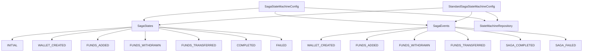
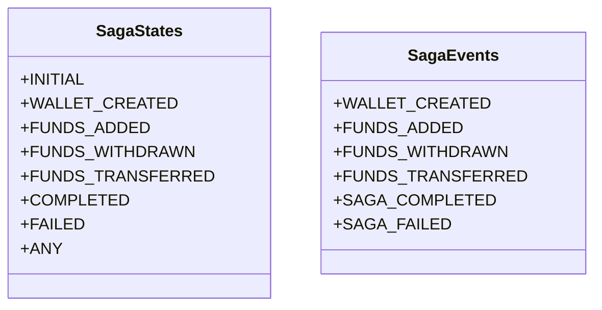
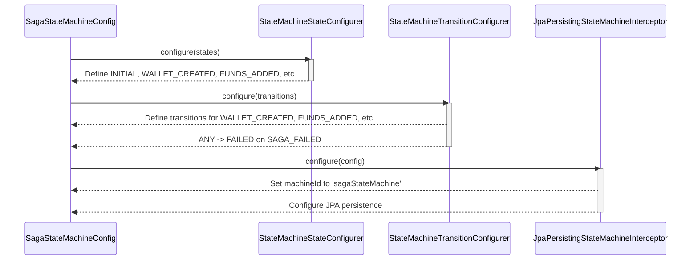
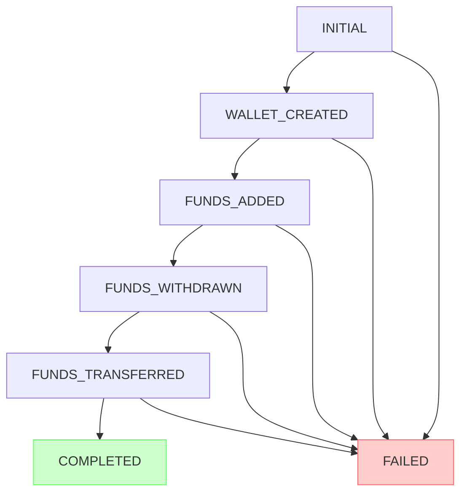
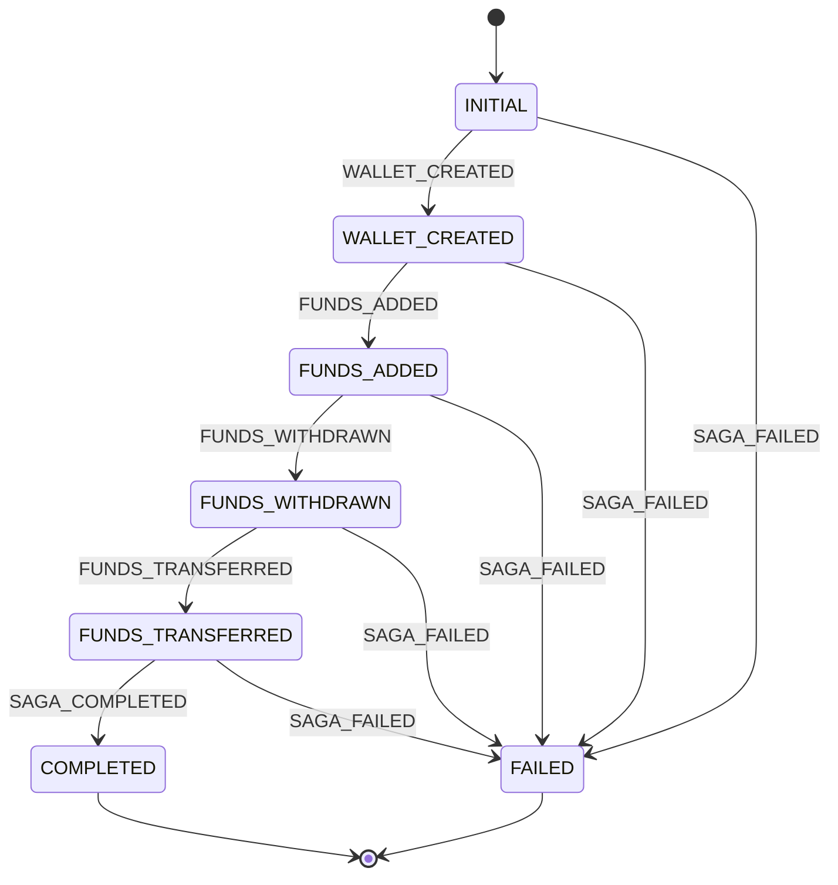
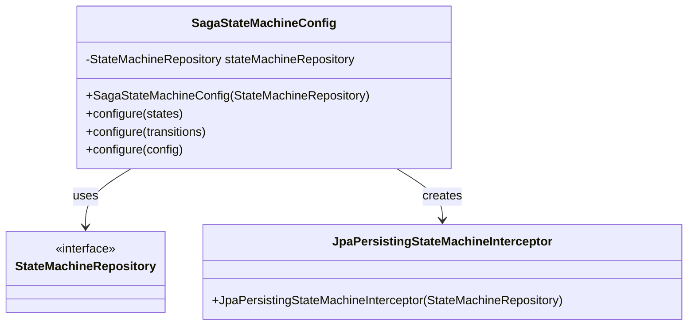

# State Machine Configuration

<cite>
**Referenced Files in This Document**   
- [SagaStateMachineConfig.java](file://src/main/java/dev/bloco/wallet/hub/infra/provider/data/config/SagaStateMachineConfig.java)
- [StandardSagaStateMachineConfig.java](file://src/main/java/dev/bloco/wallet/hub/infra/provider/data/config/StandardSagaStateMachineConfig.java)
- [SagaStates.java](file://src/main/java/dev/bloco/wallet/hub/infra/provider/data/config/SagaStates.java)
- [SagaEvents.java](file://src/main/java/dev/bloco/wallet/hub/infra/provider/data/config/SagaEvents.java)
- [StateMachineRepository.java](file://src/main/java/dev/bloco/wallet/hub/infra/provider/data/repository/StateMachineRepository.java)
- [FundsAddedEventConsumer.java](file://src/main/java/dev/bloco/wallet/hub/infra/adapter/event/consumer/FundsAddedEventConsumer.java)
- [FundsTransferredEventConsumer.java](file://src/main/java/dev/bloco/wallet/hub/infra/adapter/event/consumer/FundsTransferredEventConsumer.java)
- [FundsWithdrawnEventConsumer.java](file://src/main/java/dev/bloco/wallet/hub/infra/adapter/event/consumer/FundsWithdrawnEventConsumer.java)
- [WalletCreatedEventConsumer.java](file://src/main/java/dev/bloco/wallet/hub/infra/adapter/event/consumer/WalletCreatedEventConsumer.java)
</cite>

## Table of Contents
1. [Introduction](#introduction)
2. [State Machine Configuration Overview](#state-machine-configuration-overview)
3. [Core States and Events](#core-states-and-events)
4. [Base Configuration: SagaStateMachineConfig](#base-configuration-sagastatemachineconfig)
5. [Enhanced Configuration: StandardSagaStateMachineConfig](#enhanced-configuration-standardsagastatemachineconfig)
6. [State Transition Rules](#state-transition-rules)
7. [Persistence and Machine Configuration](#persistence-and-machine-configuration)
8. [Saga Progression and Consistency](#saga-progression-and-consistency)
9. [State Transition Flow Examples](#state-transition-flow-examples)
10. [Monitoring and Failure Recovery](#monitoring-and-failure-recovery)
11. [Extending the State Model](#extending-the-state-model)

## Introduction
The Saga State Machine configuration in bloco-wallet-java implements a distributed transaction management pattern using Spring StateMachine. This documentation provides a comprehensive analysis of how the state machine orchestrates wallet operations through well-defined states and events, ensuring consistency across distributed operations. The configuration supports both basic and enhanced failure handling strategies, with robust persistence mechanisms for fault tolerance and recovery.

## State Machine Configuration Overview
The state machine configuration defines a workflow for managing wallet operations through a series of states and events. Two primary configuration classes are provided: `SagaStateMachineConfig` for basic functionality and `StandardSagaStateMachineConfig` for enhanced failure handling. Both configurations use Spring StateMachine to manage the lifecycle of saga processes, with states representing different stages of wallet operations and events triggering transitions between these states.

**Diagram sources**
- [SagaStateMachineConfig.java](file://src/main/java/dev/bloco/wallet/hub/infra/provider/data/config/SagaStateMachineConfig.java)
- [StandardSagaStateMachineConfig.java](file://src/main/java/dev/bloco/wallet/hub/infra/provider/data/config/StandardSagaStateMachineConfig.java)
- [SagaStates.java](file://src/main/java/dev/bloco/wallet/hub/infra/provider/data/config/SagaStates.java)
- [SagaEvents.java](file://src/main/java/dev/bloco/wallet/hub/infra/provider/data/config/SagaEvents.java)

**Section sources**
- [SagaStateMachineConfig.java](file://src/main/java/dev/bloco/wallet/hub/infra/provider/data/config/SagaStateMachineConfig.java)
- [StandardSagaStateMachineConfig.java](file://src/main/java/dev/bloco/wallet/hub/infra/provider/data/config/StandardSagaStateMachineConfig.java)

## Core States and Events
The state machine operates on a well-defined set of states and events that represent the lifecycle of wallet operations. The states represent different stages in the saga process, while events trigger transitions between these states.

### State Definitions
The `SagaStates` enum defines all possible states in the saga workflow:

- **INITIAL**: The starting state of the saga
- **WALLET_CREATED**: State after a wallet is successfully created
- **FUNDS_ADDED**: State after funds are added to the wallet
- **FUNDS_WITHDRAWN**: State after funds are withdrawn from the wallet
- **FUNDS_TRANSFERRED**: State after funds are transferred between wallets
- **COMPLETED**: Final state indicating successful completion
- **FAILED**: Final state indicating failure
- **ANY**: Generic state used for failure handling

### Event Definitions
The `SagaEvents` enum defines the events that trigger state transitions:

- **WALLET_CREATED**: Indicates wallet creation
- **FUNDS_ADDED**: Represents adding funds to a wallet
- **FUNDS_WITHDRAWN**: Represents withdrawing funds from a wallet
- **FUNDS_TRANSFERRED**: Denotes transferring funds between wallets
- **SAGA_COMPLETED**: Indicates successful saga completion
- **SAGA_FAILED**: Indicates a failure in the saga process

**Diagram sources**
- [SagaStates.java](file://src/main/java/dev/bloco/wallet/hub/infra/provider/data/config/SagaStates.java)
- [SagaEvents.java](file://src/main/java/dev/bloco/wallet/hub/infra/provider/data/config/SagaEvents.java)

**Section sources**
- [SagaStates.java](file://src/main/java/dev/bloco/wallet/hub/infra/provider/data/config/SagaStates.java)
- [SagaEvents.java](file://src/main/java/dev/bloco/wallet/hub/infra/provider/data/config/SagaEvents.java)

## Base Configuration: SagaStateMachineConfig
The `SagaStateMachineConfig` class provides the base configuration for the state machine, defining states, transitions, and persistence settings. This configuration establishes the fundamental workflow for the saga process.

### State Configuration
The state configuration defines all possible states in the saga lifecycle, starting from the initial state and progressing through various operational states to either successful completion or failure.

### Transition Configuration
The transition configuration establishes the rules for moving between states based on specific events. The base configuration includes a single failure transition from any state to the FAILED state.

### Machine Configuration
The machine configuration sets the machine ID to 'sagaStateMachine' and configures persistence using JPA through the `JpaPersistingStateMachineInterceptor`.

**Diagram sources**
- [SagaStateMachineConfig.java](file://src/main/java/dev/bloco/wallet/hub/infra/provider/data/config/SagaStateMachineConfig.java)

**Section sources**
- [SagaStateMachineConfig.java](file://src/main/java/dev/bloco/wallet/hub/infra/provider/data/config/SagaStateMachineConfig.java)

## Enhanced Configuration: StandardSagaStateMachineConfig
The `StandardSagaStateMachineConfig` class extends the base functionality by providing more granular failure handling. This configuration allows for specific failure transitions from each state to the FAILED state.

### Enhanced Failure Transitions
Unlike the base configuration that uses the ANY state for failure handling, the standard configuration explicitly defines failure transitions from each individual state:

- INITIAL → FAILED on SAGA_FAILED
- WALLET_CREATED → FAILED on SAGA_FAILED
- FUNDS_ADDED → FAILED on SAGA_FAILED
- FUNDS_WITHDRAWN → FAILED on SAGA_FAILED
- FUNDS_TRANSFERRED → FAILED on SAGA_FAILED

This approach provides better visibility into where failures occur in the saga process and enables more targeted error handling and recovery strategies.

**Diagram sources**
- [StandardSagaStateMachineConfig.java](file://src/main/java/dev/bloco/wallet/hub/infra/provider/data/config/StandardSagaStateMachineConfig.java)

**Section sources**
- [StandardSagaStateMachineConfig.java](file://src/main/java/dev/bloco/wallet/hub/infra/provider/data/config/StandardSagaStateMachineConfig.java)

## State Transition Rules
The state machine enforces strict transition rules to ensure proper saga progression. Transitions are triggered by domain events and follow a predefined path from initial state to completion or failure.

### External Transitions
All transitions in the state machine are external transitions, meaning they require an explicit event to trigger the state change. The transitions follow a linear progression:

1. INITIAL → WALLET_CREATED on WALLET_CREATED event
2. WALLET_CREATED → FUNDS_ADDED on FUNDS_ADDED event
3. FUNDS_ADDED → FUNDS_WITHDRAWN on FUNDS_WITHDRAWN event
4. FUNDS_WITHDRAWN → FUNDS_TRANSFERRED on FUNDS_TRANSFERRED event
5. FUNDS_TRANSFERRED → COMPLETED on SAGA_COMPLETED event

### Failure Handling
Failure transitions are handled differently between the two configurations:
- **Base Configuration**: Uses ANY → FAILED on SAGA_FAILED, allowing failure from any state
- **Standard Configuration**: Defines explicit transitions from each state to FAILED on SAGA_FAILED

**Diagram sources**
- [SagaStateMachineConfig.java](file://src/main/java/dev/bloco/wallet/hub/infra/provider/data/config/SagaStateMachineConfig.java)
- [StandardSagaStateMachineConfig.java](file://src/main/java/dev/bloco/wallet/hub/infra/provider/data/config/StandardSagaStateMachineConfig.java)

**Section sources**
- [SagaStateMachineConfig.java](file://src/main/java/dev/bloco/wallet/hub/infra/provider/data/config/SagaStateMachineConfig.java#L74-L94)
- [StandardSagaStateMachineConfig.java](file://src/main/java/dev/bloco/wallet/hub/infra/provider/data/config/StandardSagaStateMachineConfig.java#L72-L104)

## Persistence and Machine Configuration
The state machine configuration includes critical settings for persistence and machine identification, ensuring reliability and traceability.

### Machine ID Configuration
The machine is configured with a specific ID 'sagaStateMachine' to uniquely identify the state machine instance within the application context. This ID is essential for monitoring, debugging, and managing multiple state machine instances.

### JPA Persistence
Persistence is configured using the `JpaPersistingStateMachineInterceptor` with the `StateMachineRepository`. This setup ensures that the state machine's state is persisted to the database after each transition, providing fault tolerance and enabling recovery from failures.

**Diagram sources**
- [SagaStateMachineConfig.java](file://src/main/java/dev/bloco/wallet/hub/infra/provider/data/config/SagaStateMachineConfig.java#L108-L116)
- [StateMachineRepository.java](file://src/main/java/dev/bloco/wallet/hub/infra/provider/data/repository/StateMachineRepository.java)

**Section sources**
- [SagaStateMachineConfig.java](file://src/main/java/dev/bloco/wallet/hub/infra/provider/data/config/SagaStateMachineConfig.java#L108-L116)
- [StateMachineRepository.java](file://src/main/java/dev/bloco/wallet/hub/infra/provider/data/repository/StateMachineRepository.java)

## Saga Progression and Consistency
The state machine ensures consistency across distributed operations by maintaining a single source of truth for the saga's state and coordinating