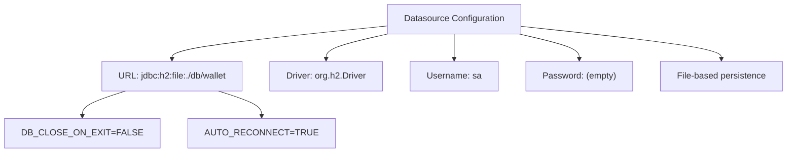
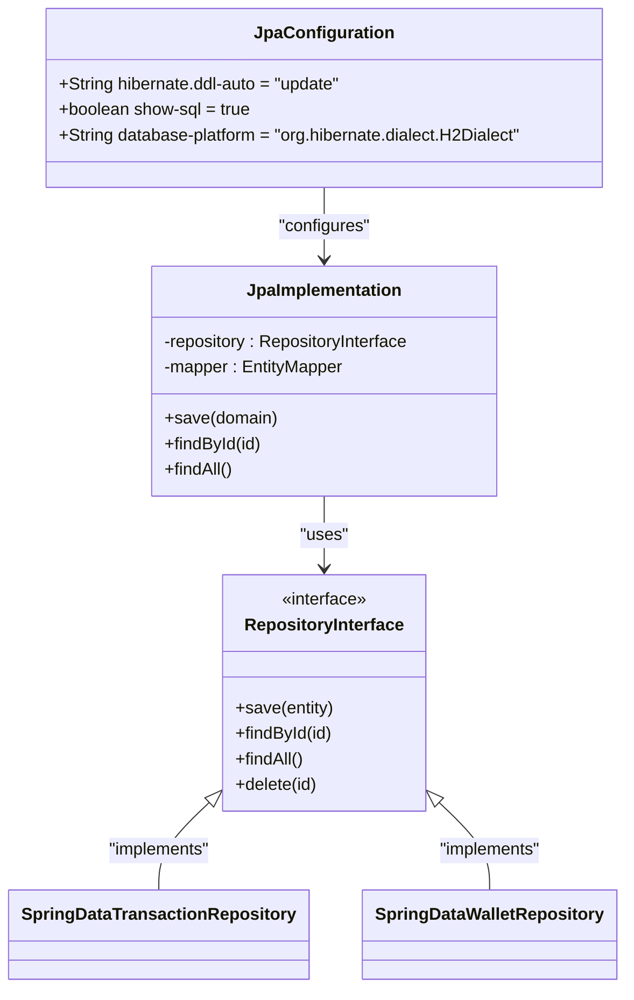
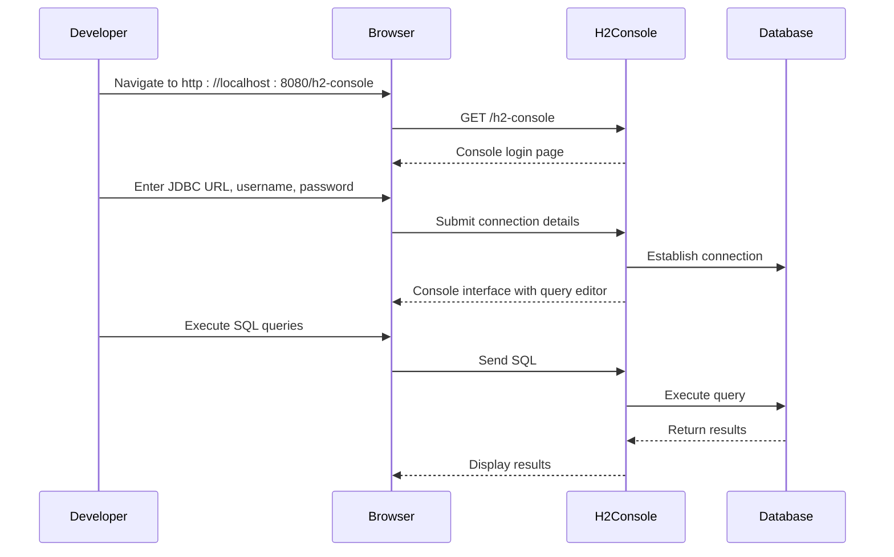
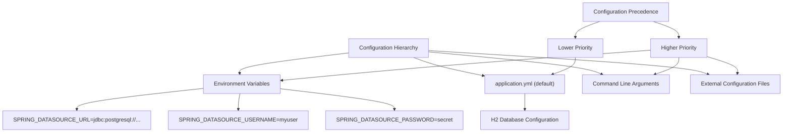
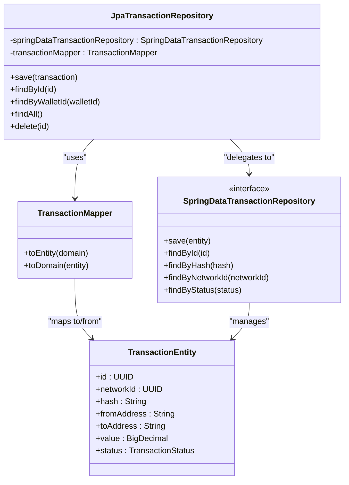
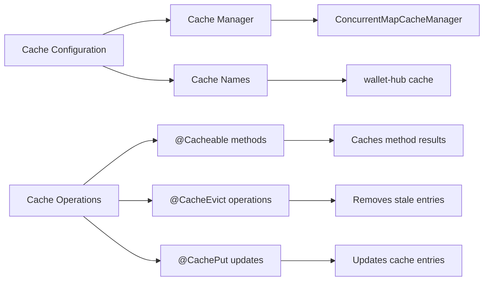
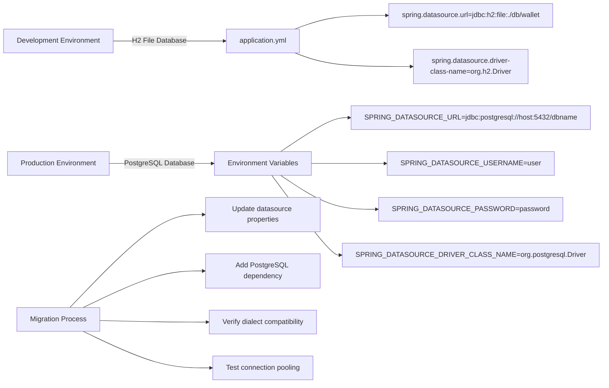
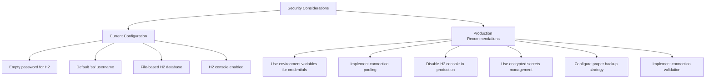

# Database Configuration

<cite>
**Referenced Files in This Document**   
- [application.yml](file://src/main/resources/application.yml)
- [pom.xml](file://pom.xml)
- [README.md](file://README.md)
- [JpaTransactionRepository.java](file://src/main/java/dev/bloco/wallet/hub/infra/provider/data/repository/JpaTransactionRepository.java)
- [JpaWalletRepository.java](file://src/main/java/dev/bloco/wallet/hub/infra/provider/data/repository/JpaWalletRepository.java)
- [SpringDataTransactionRepository.java](file://src/main/java/dev/bloco/wallet/hub/infra/provider/data/repository/SpringDataTransactionRepository.java)
- [SpringDataWalletRepository.java](file://src/main/java/dev/bloco/wallet/hub/infra/provider/data/repository/SpringDataWalletRepository.java)
</cite>

## Table of Contents
1. [Introduction](#introduction)
2. [Core Database Configuration](#core-database-configuration)
3. [JPA and Hibernate Settings](#jpa-and-hibernate-settings)
4. [H2 Console Access](#h2-console-access)
5. [Environment-Specific Configuration](#environment-specific-configuration)
6. [Connection and Dependency Management](#connection-and-dependency-management)
7. [Caching Configuration](#caching-configuration)
8. [Production Database Migration](#production-database-migration)
9. [Security and Best Practices](#security-and-best-practices)

## Introduction

The bloco-wallet-java application utilizes Spring Boot's auto-configuration capabilities to manage its database layer through declarative configuration in `application.yml`. The system is designed for development convenience with H2 as the default embedded database while maintaining flexibility for production deployment with external databases like PostgreSQL. This documentation details the complete database configuration strategy, including datasource settings, JPA/Hibernate behavior, H2 console access, and environment-specific overrides.

**Section sources**
- [application.yml](file://src/main/resources/application.yml#L1-L34)
- [README.md](file://README.md#L58-L90)

## Core Database Configuration

The application's datasource configuration is defined in `application.yml` with H2 as the default database. The configuration includes the JDBC URL, driver specification, and authentication credentials.

**Diagram sources**
- [application.yml](file://src/main/resources/application.yml#L10-L14)

The datasource settings specify a file-based H2 database stored in the local `./db/wallet` directory, ensuring data persistence between application restarts. The `DB_CLOSE_ON_EXIT=FALSE` parameter prevents the database from closing when the last connection is closed, while `AUTO_RECONNECT=TRUE` enables automatic reconnection if the connection is lost.

**Section sources**
- [application.yml](file://src/main/resources/application.yml#L10-L14)

## JPA and Hibernate Settings

The application configures JPA and Hibernate through Spring Boot properties that control schema management, SQL logging, and dialect specification.

**Diagram sources**
- [application.yml](file://src/main/resources/application.yml#L20-L23)
- [SpringDataTransactionRepository.java](file://src/main/java/dev/bloco/wallet/hub/infra/provider/data/repository/SpringDataTransactionRepository.java#L15-L23)
- [SpringDataWalletRepository.java](file://src/main/java/dev/bloco/wallet/hub/infra/provider/data/repository/SpringDataWalletRepository.java#L25-L26)

The JPA configuration includes:
- `ddl-auto: update` - Automatically updates the database schema based on entity changes
- `show-sql: true` - Logs all SQL statements to the console for debugging
- `database-platform: org.hibernate.dialect.H2Dialect` - Specifies the H2 dialect for optimal SQL generation

These settings enable rapid development by automatically synchronizing the database schema with entity definitions while providing visibility into generated SQL queries.

**Section sources**
- [application.yml](file://src/main/resources/application.yml#L20-L23)
- [JpaTransactionRepository.java](file://src/main/java/dev/bloco/wallet/hub/infra/provider/data/repository/JpaTransactionRepository.java#L44-L151)
- [JpaWalletRepository.java](file://src/main/java/dev/bloco/wallet/hub/infra/provider/data/repository/JpaWalletRepository.java#L35-L117)

## H2 Console Access

The application enables the H2 web console for development and debugging purposes, allowing direct database inspection and query execution.

**Diagram sources**
- [application.yml](file://src/main/resources/application.yml#L16-L18)
- [README.md](file://README.md#L58-L90)

The H2 console is enabled through the `spring.h2.console.enabled=true` property and is accessible at `http://localhost:8080/h2-console` when the application is running. The console allows developers to:
- View and modify database contents directly
- Execute ad-hoc SQL queries for testing and debugging
- Inspect table structures and relationships
- Monitor database performance

**Section sources**
- [application.yml](file://src/main/resources/application.yml#L16-L18)
- [README.md](file://README.md#L58-L90)

## Environment-Specific Configuration

The application supports multiple environments through Spring Boot's configuration hierarchy, allowing property overrides without modifying the base configuration.

**Diagram sources**
- [application.yml](file://src/main/resources/application.yml#L1-L34)
- [README.md](file://README.md#L58-L90)

The configuration system follows Spring Boot's property precedence rules, where environment variables override the values in `application.yml`. This enables seamless environment transitions without code changes. The README documentation provides examples of common environment overrides for datasource configuration.

**Section sources**
- [application.yml](file://src/main/resources/application.yml#L1-L34)
- [README.md](file://README.md#L58-L90)

## Connection and Dependency Management

The application manages database connections through Spring Data JPA repositories that abstract the underlying persistence mechanism.

**Diagram sources**
- [JpaTransactionRepository.java](file://src/main/java/dev/bloco/wallet/hub/infra/provider/data/repository/JpaTransactionRepository.java#L44-L151)
- [SpringDataTransactionRepository.java](file://src/main/java/dev/bloco/wallet/hub/infra/provider/data/repository/SpringDataTransactionRepository.java#L15-L23)
- [TransactionMapper.java](file://src/main/java/dev/bloco/wallet/hub/infra/provider/mapper/TransactionMapper.java#L36-L74)

The repository pattern implements a layered architecture where:
- Domain repositories (e.g., `JpaTransactionRepository`) provide business logic interfaces
- Spring Data interfaces (e.g., `SpringDataTransactionRepository`) define data access contracts
- Entity mappers (e.g., `TransactionMapper`) convert between domain and persistence models
- JPA entities (e.g., `TransactionEntity`) represent database tables

This separation of concerns ensures that business logic remains decoupled from database implementation details.

**Section sources**
- [JpaTransactionRepository.java](file://src/main/java/dev/bloco/wallet/hub/infra/provider/data/repository/JpaTransactionRepository.java#L44-L151)
- [SpringDataTransactionRepository.java](file://src/main/java/dev/bloco/wallet/hub/infra/provider/data/repository/SpringDataTransactionRepository.java#L15-L23)
- [TransactionMapper.java](file://src/main/java/dev/bloco/wallet/hub/infra/provider/mapper/TransactionMapper.java#L36-L74)

## Caching Configuration

The application configures Spring's caching abstraction to improve performance by reducing database access for frequently accessed data.

**Diagram sources**
- [application.yml](file://src/main/resources/application.yml#L3-L4)

The caching configuration defines a single cache named "wallet-hub" that can be used by service methods annotated with Spring's cache annotations (`@Cacheable`, `@CacheEvict`, `@CachePut`). This provides a simple in-memory caching solution for development and testing environments.

**Section sources**
- [application.yml](file://src/main/resources/application.yml#L3-L4)

## Production Database Migration

The application can be migrated from H2 to PostgreSQL or other production databases by modifying the datasource configuration.

**Diagram sources**
- [application.yml](file://src/main/resources/application.yml#L10-L14)
- [pom.xml](file://pom.xml#L1-L424)
- [README.md](file://README.md#L58-L90)

The migration process involves:
1. Adding the PostgreSQL dependency in `pom.xml` (already included)
2. Updating datasource properties via environment variables
3. Changing the dialect to `org.hibernate.dialect.PostgreSQLDialect`
4. Configuring connection pooling for production workloads

The `pom.xml` file already includes both H2 and PostgreSQL dependencies, enabling seamless database switching without recompilation.

**Section sources**
- [application.yml](file://src/main/resources/application.yml#L10-L14)
- [pom.xml](file://pom.xml#L1-L424)
- [README.md](file://README.md#L58-L90)

## Security and Best Practices

The current configuration follows several best practices while highlighting areas for production enhancement.

**Diagram sources**
- [application.yml](file://src/main/resources/application.yml#L1-L34)
- [pom.xml](file://pom.xml#L1-L424)

Key security considerations:
- The development configuration uses default H2 credentials (username: sa, empty password) which are acceptable for local development but must be secured in production
- Database credentials should be managed through environment variables or secret management systems like Spring Cloud Vault
- The H2 console should be disabled in production environments to prevent unauthorized database access
- Connection pooling should be configured for production workloads to manage database connections efficiently
- Regular backups and disaster recovery procedures should be implemented for production databases

The application already includes Spring Cloud Vault and Spring Vault dependencies in `pom.xml`, providing a foundation for secure secret management in production deployments.

**Section sources**
- [application.yml](file://src/main/resources/application.yml#L1-L34)
- [pom.xml](file://pom.xml#L1-L424)