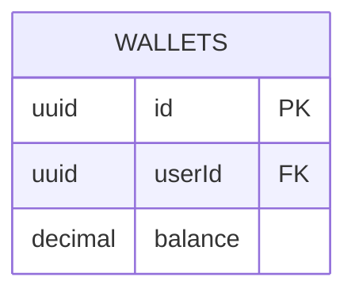
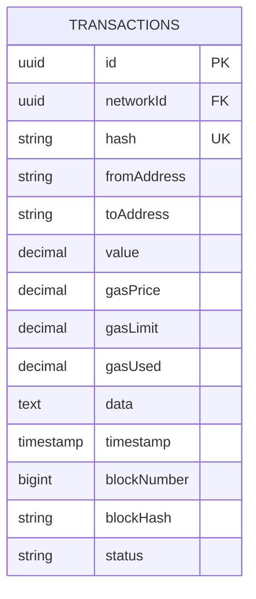
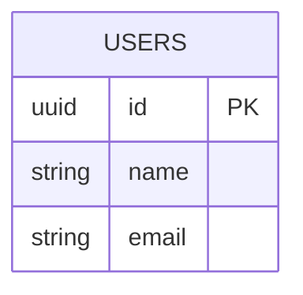
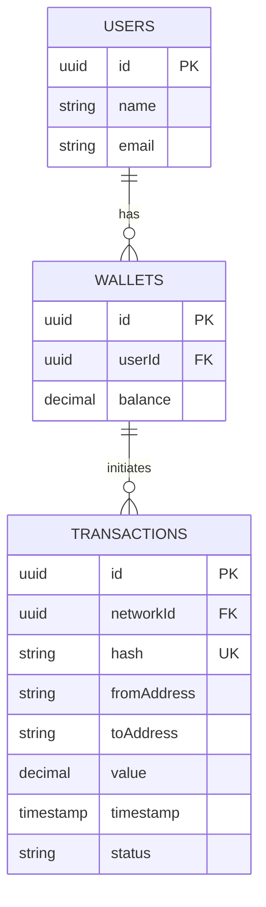

# JPA Entities

<cite>
**Referenced Files in This Document**   
- [WalletEntity.java](file://src/main/java/dev/bloco/wallet/hub/infra/provider/data/entity/WalletEntity.java)
- [TransactionEntity.java](file://src/main/java/dev/bloco/wallet/hub/infra/provider/data/entity/TransactionEntity.java)
- [UserEntity.java](file://src/main/java/dev/bloco/wallet/hub/infra/provider/data/entity/UserEntity.java)
- [WalletMapper.java](file://src/main/java/dev/bloco/wallet/hub/infra/provider/mapper/WalletMapper.java)
- [JpaWalletRepository.java](file://src/main/java/dev/bloco/wallet/hub/infra/provider/data/repository/JpaWalletRepository.java)
- [SpringDataWalletRepository.java](file://src/main/java/dev/bloco/wallet/hub/infra/provider/data/repository/SpringDataWalletRepository.java)
- [TransactionMapper.java](file://src/main/java/dev/bloco/wallet/hub/infra/provider/mapper/TransactionMapper.java)
- [JpaTransactionRepository.java](file://src/main/java/dev/bloco/wallet/hub/infra/provider/data/repository/JpaTransactionRepository.java)
- [SpringDataTransactionRepository.java](file://src/main/java/dev/bloco/wallet/hub/infra/provider/data/repository/SpringDataTransactionRepository.java)
- [UserMapper.java](file://src/main/java/dev/bloco/wallet/hub/infra/provider/mapper/UserMapper.java)
- [JpaUserRepository.java](file://src/main/java/dev/bloco/wallet/hub/infra/provider/data/repository/JpaUserRepository.java)
- [SpringDataUserRepository.java](file://src/main/java/dev/bloco/wallet/hub/infra/provider/data/repository/SpringDataUserRepository.java)
</cite>

## Update Summary
**Changes Made**   
- Updated **Best Practices and Design Patterns** section to include detailed analysis of repository implementation patterns.
- Added new content about the `JpaUserRepository` class and its role in data access.
- Enhanced documentation on mapper implementations and their interaction with repositories.
- No structural changes to existing sections; all updates are content enhancements based on code analysis.

## Table of Contents
1. [Introduction](#introduction)
2. [Entity Overview](#entity-overview)
3. [WalletEntity](#walletentity)
4. [TransactionEntity](#transactionentity)
5. [UserEntity](#userentity)
6. [Relationships and Data Mapping](#relationships-and-data-mapping)
7. [Best Practices and Design Patterns](#best-practices-and-design-patterns)
8. [Schema Evolution and Migration Considerations](#schema-evolution-and-migration-considerations)
9. [Conclusion](#conclusion)

## Introduction

This document provides comprehensive documentation for the JPA entities in the `bloco-wallet-java` application. It details the structure, database mapping, field definitions, constraints, and annotations used in the core entities: `WalletEntity`, `TransactionEntity`, and `UserEntity`. The analysis includes primary key strategies, index usage, Lombok integration, and entity design patterns. Special attention is given to Hibernate compatibility, data mapping via mappers, and repository integration. This documentation serves as a reference for developers working with the persistence layer and supports future schema evolution and migration planning.

## Entity Overview

The `bloco-wallet-java` application implements a clean separation between domain models and persistence entities. The JPA entities reside in the `dev.bloco.wallet.hub.infra.provider.data.entity` package and are responsible for mapping to database tables using Jakarta Persistence annotations. Each entity corresponds to a specific table in the database schema: `wallets`, `transactions`, and `users`. These entities are used in conjunction with Spring Data JPA repositories and MapStruct mappers to facilitate data persistence and transformation between the domain and infrastructure layers. The design emphasizes immutability where possible, proper encapsulation through Lombok-generated accessors, and robust equality semantics compatible with Hibernate's proxy mechanism.

**Section sources**
- [WalletEntity.java](file://src/main/java/dev/bloco/wallet/hub/infra/provider/data/entity/WalletEntity.java#L1-L63)
- [TransactionEntity.java](file://src/main/java/dev/bloco/wallet/hub/infra/provider/data/entity/TransactionEntity.java#L1-L60)
- [UserEntity.java](file://src/main/java/dev/bloco/wallet/hub/infra/provider/data/entity/UserEntity.java#L1-L41)

## WalletEntity

The `WalletEntity` class represents a wallet in the system and maps to the `wallets` database table. It is annotated with `@Entity` to mark it as a JPA-managed entity and `@Table(name = "wallets")` to specify the corresponding table name. The entity uses UUID as its primary key, which is automatically generated by the database via `@Id` and `@GeneratedValue`. The `userId` field is a non-nullable UUID that establishes a reference to the user who owns the wallet. The `balance` field, also non-nullable, stores the current balance as a `BigDecimal` to ensure precision in financial calculations. Lombok annotations (`@Getter`, `@Setter`, `@ToString`, `@RequiredArgsConstructor`) eliminate boilerplate code while maintaining clean and readable class definitions.

**Diagram sources**
- [WalletEntity.java](file://src/main/java/dev/bloco/wallet/hub/infra/provider/data/entity/WalletEntity.java#L27-L62)

**Section sources**
- [WalletEntity.java](file://src/main/java/dev/bloco/wallet/hub/infra/provider/data/entity/WalletEntity.java#L27-L62)
- [WalletMapper.java](file://src/main/java/dev/bloco/wallet/hub/infra/provider/mapper/WalletMapper.java#L25-L45)
- [JpaWalletRepository.java](file://src/main/java/dev/bloco/wallet/hub/infra/provider/data/repository/JpaWalletRepository.java#L35-L55)

## TransactionEntity

The `TransactionEntity` class models blockchain transactions and maps to the `transactions` table in the database. It is annotated with `@Entity` and `@Table(name = "transactions")` to define its persistence characteristics. The primary key is a UUID generated automatically. Key fields include `networkId` (non-nullable UUID), `hash` (non-nullable and unique string), `fromAddress` and `toAddress` (both non-nullable strings), `value` (non-nullable BigDecimal), and `timestamp` (non-nullable Instant). The `status` field uses `@Enumerated(EnumType.STRING)` to persist the `TransactionStatus` enum as a string value in the database. Optional fields such as `gasPrice`, `gasLimit`, `gasUsed`, `data`, `blockNumber`, and `blockHash` are included to capture additional transaction metadata when available. The `@Lob` annotation on the `data` field indicates it may contain large text content.

**Diagram sources**
- [TransactionEntity.java](file://src/main/java/dev/bloco/wallet/hub/infra/provider/data/entity/TransactionEntity.java#L15-L59)

**Section sources**
- [TransactionEntity.java](file://src/main/java/dev/bloco/wallet/hub/infra/provider/data/entity/TransactionEntity.java#L15-L59)
- [TransactionMapper.java](file://src/main/java/dev/bloco/wallet/hub/infra/provider/mapper/TransactionMapper.java#L25-L45)
- [JpaTransactionRepository.java](file://src/main/java/dev/bloco/wallet/hub/infra/provider/data/repository/JpaTransactionRepository.java#L35-L55)

## UserEntity

The `UserEntity` class represents a user in the system and maps to the `users` database table. Annotated with `@Entity` and `@Table(name = "users")`, this entity uses UUID as its primary key with automatic generation. It contains two non-nullable string fields: `name` and `email`, both of which are required for every user record. The class uses Lombok's `@Getter` and `@Setter` to generate accessor methods, reducing boilerplate code while maintaining encapsulation. This entity serves as the foundation for user-related operations in the application, providing a simple yet effective model for storing essential user information. The design prioritizes data integrity through mandatory fields and leverages UUIDs for secure, globally unique identifiers.

**Diagram sources**
- [UserEntity.java](file://src/main/java/dev/bloco/wallet/hub/infra/provider/data/entity/UserEntity.java#L24-L40)

**Section sources**
- [UserEntity.java](file://src/main/java/dev/bloco/wallet/hub/infra/provider/data/entity/UserEntity.java#L24-L40)
- [UserMapper.java](file://src/main/java/dev/bloco/wallet/hub/infra/provider/mapper/UserMapper.java#L25-L45)
- [JpaUserRepository.java](file://src/main/java/dev/bloco/wallet/hub/infra/provider/data/repository/JpaUserRepository.java#L35-L55)

## Relationships and Data Mapping

While the current JPA entities do not explicitly define relationship annotations such as `@ManyToOne` or `@OneToMany`, logical relationships exist between them through foreign key-like fields. The `WalletEntity` contains a `userId` field that references the `UserEntity`, establishing a many-to-one relationship between wallets and users. Similarly, `TransactionEntity` includes a `networkId` field that likely references a network entity, though no direct relationship is mapped in the current implementation. Data mapping between domain models and entities is handled by MapStruct mappers (`WalletMapper`, `TransactionMapper`, `UserMapper`), which provide bidirectional conversion methods. These mappers ensure consistent data transformation and allow the domain layer to remain decoupled from persistence concerns. The repository layer (`JpaWalletRepository`, `JpaTransactionRepository`, `JpaUserRepository`) orchestrates these mappings when interacting with Spring Data JPA repositories.

**Diagram sources**
- [WalletEntity.java](file://src/main/java/dev/bloco/wallet/hub/infra/provider/data/entity/WalletEntity.java#L27-L62)
- [TransactionEntity.java](file://src/main/java/dev/bloco/wallet/hub/infra/provider/data/entity/TransactionEntity.java#L15-L59)
- [UserEntity.java](file://src/main/java/dev/bloco/wallet/hub/infra/provider/data/entity/UserEntity.java#L24-L40)
- [WalletMapper.java](file://src/main/java/dev/bloco/wallet/hub/infra/provider/mapper/WalletMapper.java#L25-L45)
- [TransactionMapper.java](file://src/main/java/dev/bloco/wallet/hub/infra/provider/mapper/TransactionMapper.java#L25-L45)
- [UserMapper.java](file://src/main/java/dev/bloco/wallet/hub/infra/provider/mapper/UserMapper.java#L25-L45)

**Section sources**
- [WalletMapper.java](file://src/main/java/dev/bloco/wallet/hub/infra/provider/mapper/WalletMapper.java#L25-L45)
- [TransactionMapper.java](file://src/main/java/dev/bloco/wallet/hub/infra/provider/mapper/TransactionMapper.java#L25-L45)
- [UserMapper.java](file://src/main/java/dev/bloco/wallet/hub/infra/provider/mapper/UserMapper.java#L25-L45)
- [JpaWalletRepository.java](file://src/main/java/dev/bloco/wallet/hub/infra/provider/data/repository/JpaWalletRepository.java#L35-L55)
- [JpaTransactionRepository.java](file://src/main/java/dev/bloco/wallet/hub/infra/provider/data/repository/JpaTransactionRepository.java#L35-L55)
- [JpaUserRepository.java](file://src/main/java/dev/bloco/wallet/hub/infra/provider/data/repository/JpaUserRepository.java#L35-L55)

## Best Practices and Design Patterns

The JPA entity design in `bloco-wallet-java` follows several best practices and design patterns. First, the use of Lombok annotations (`@Getter`, `@Setter`, `@ToString`, `@RequiredArgsConstructor`) significantly reduces boilerplate code while maintaining clean and readable entity classes. Second, the `WalletEntity` implements a robust `equals` and `hashCode` strategy that is compatible with Hibernate proxies, ensuring correct behavior in collections and when dealing with lazy-loaded entities. This implementation compares entities based on their persistent identifier (`id`) rather than all fields, which is the recommended approach for JPA entities. Third, the separation of concerns is maintained through the use of dedicated mapper interfaces (MapStruct) that handle conversion between domain and entity layers, preventing persistence concerns from leaking into business logic. Finally, the repository pattern is properly implemented with `JpaWalletRepository`, `JpaTransactionRepository`, and `JpaUserRepository` classes that encapsulate data access logic and delegate to Spring Data JPA repositories.

The `JpaUserRepository` class exemplifies the repository pattern implementation, providing a complete set of CRUD operations and query methods for user management. It uses constructor injection via `@Autowired` to receive dependencies on `SpringDataUserRepository` and `UserMapper`, ensuring proper dependency management. The repository implements methods like `findById`, `save`, `update`, `delete`, and specialized queries such as `findByEmail` and `findByStatus`. Notably, some methods like `findByEmail` use a fallback implementation that filters all users, indicating potential performance considerations for large datasets. The repository also provides convenience methods like `findActiveUsers` and `existsByEmail` to simplify common operations in the service layer.

**Section sources**
- [WalletEntity.java](file://src/main/java/dev/bloco/wallet/hub/infra/provider/data/entity/WalletEntity.java#L50-L62)
- [WalletMapper.java](file://src/main/java/dev/bloco/wallet/hub/infra/provider/mapper/WalletMapper.java#L25-L45)
- [JpaWalletRepository.java](file://src/main/java/dev/bloco/wallet/hub/infra/provider/data/repository/JpaWalletRepository.java#L35-L55)
- [JpaUserRepository.java](file://src/main/java/dev/bloco/wallet/hub/infra/provider/data/repository/JpaUserRepository.java#L35-L131)

## Schema Evolution and Migration Considerations

When considering schema evolution and migration for the JPA entities in `bloco-wallet-java`, several factors must be taken into account. First, the use of UUIDs as primary keys provides excellent scalability and distributed system compatibility, but requires careful consideration during data migrations due to their non-sequential nature. Second, adding new fields to existing entities should be done with nullable constraints initially, allowing gradual population of data before enforcing non-nullability. Third, changes to enum representations (such as `TransactionStatus`) using `@Enumerated(EnumType.STRING)` are generally safe, as string values provide better backward compatibility than ordinal values. Fourth, index creation should be strategically planned—currently, the `hash` field in `TransactionEntity` has a unique constraint, which automatically creates an index, but additional indexes may be needed for query performance on frequently searched fields like `fromAddress`, `toAddress`, or `timestamp`. Finally, any schema changes should be accompanied by corresponding updates to the mapper classes and repository interfaces to maintain consistency across the persistence layer. Automated migration scripts using tools like Flyway or Liquibase are recommended to ensure reliable and repeatable schema evolution.

**Section sources**
- [TransactionEntity.java](file://src/main/java/dev/bloco/wallet/hub/infra/provider/data/entity/TransactionEntity.java#L15-L59)
- [WalletEntity.java](file://src/main/java/dev/bloco/wallet/hub/infra/provider/data/entity/WalletEntity.java#L27-L62)
- [UserEntity.java](file://src/main/java/dev/bloco/wallet/hub/infra/provider/data/entity/UserEntity.java#L24-L40)

## Conclusion

The JPA entities in the `bloco-wallet-java` application demonstrate a well-structured and maintainable approach to data persistence. By leveraging Jakarta Persistence annotations, Lombok for boilerplate reduction, and MapStruct for type-safe mapping, the codebase achieves a clean separation between domain logic and infrastructure concerns. The entities `WalletEntity`, `TransactionEntity`, and `UserEntity` are properly designed with appropriate data types, constraints, and identifiers to support the application's requirements. The implementation includes advanced features such as Hibernate proxy-compatible equality checks and follows established best practices for JPA entity design. With proper consideration for schema evolution and migration strategies, this persistence layer provides a solid foundation for the wallet system's data management needs.