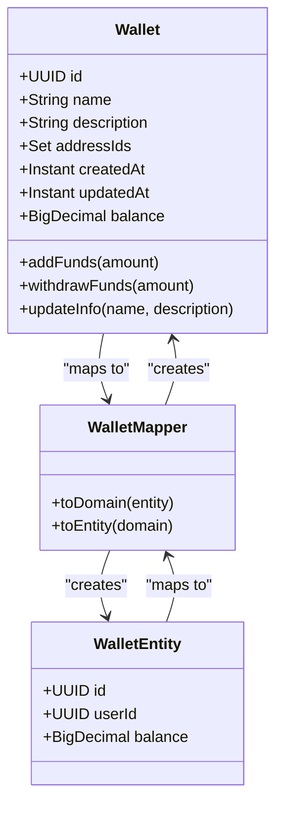
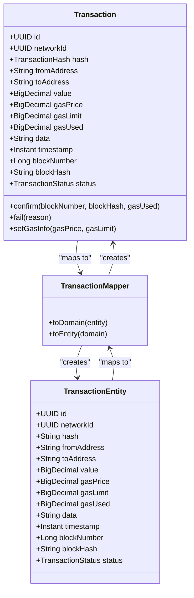
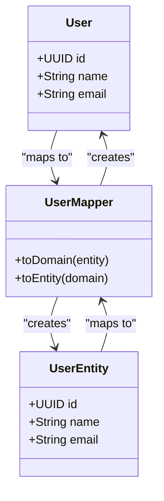
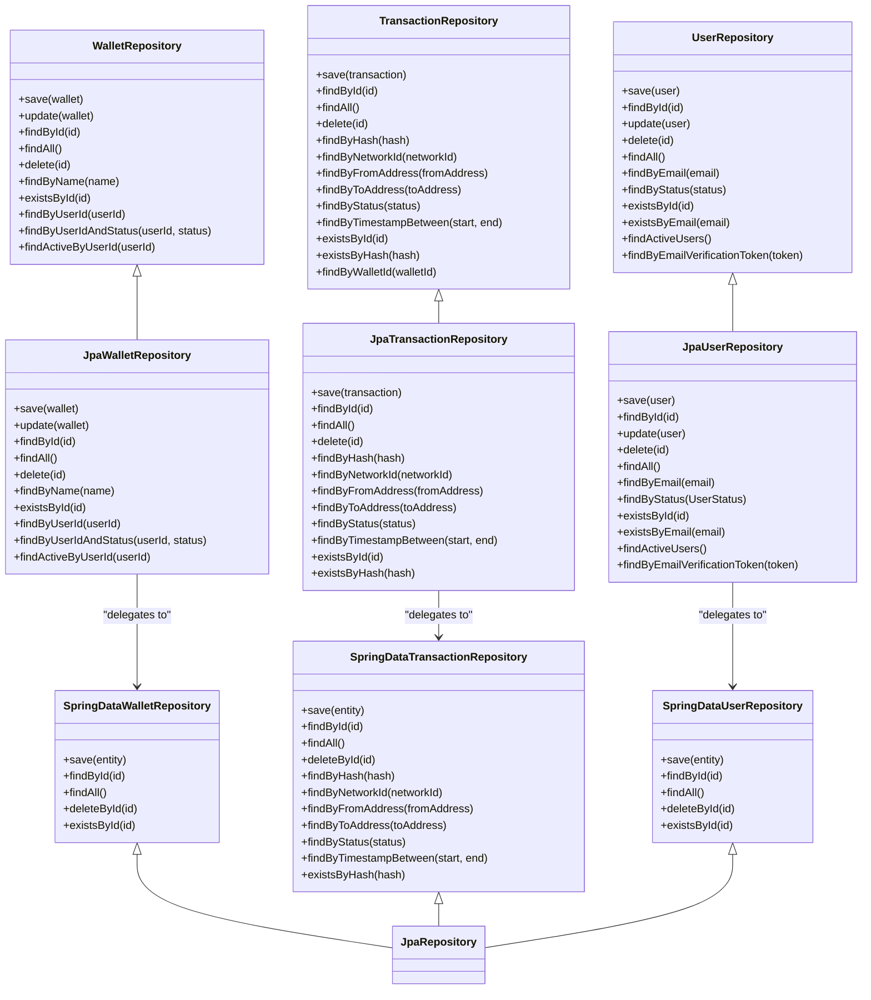
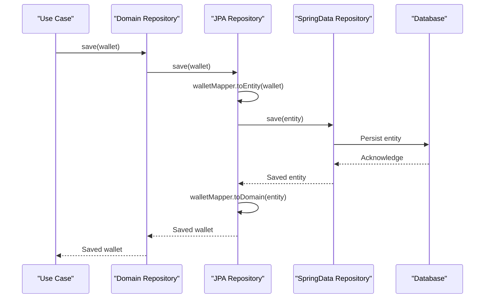
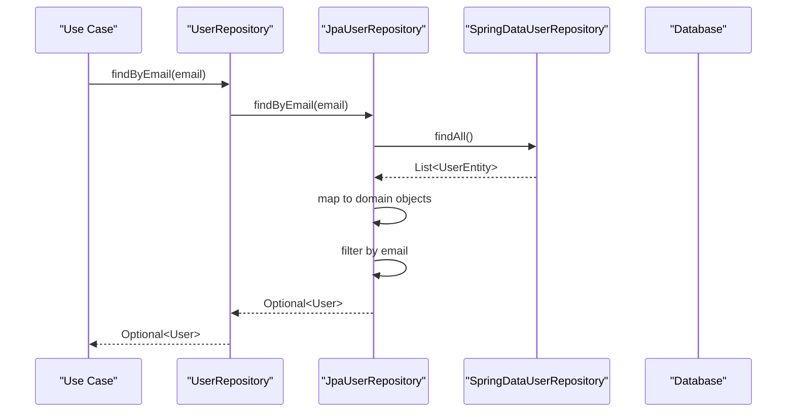
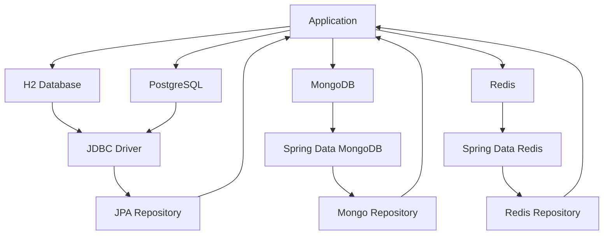
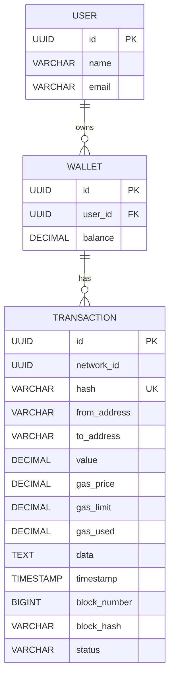

# Persistence Layer

<cite>
**Referenced Files in This Document**   
- [Wallet.java](file://src/main/java/dev/bloco/wallet/hub/domain/model/Wallet.java)
- [Transaction.java](file://src/main/java/dev/bloco/wallet/hub/domain/model/transaction/Transaction.java)
- [User.java](file://src/main/java/dev/bloco/wallet/hub/domain/model/user/User.java)
- [WalletEntity.java](file://src/main/java/dev/bloco/wallet/hub/infra/provider/data/entity/WalletEntity.java)
- [TransactionEntity.java](file://src/main/java/dev/bloco/wallet/hub/infra/provider/data/entity/TransactionEntity.java)
- [UserEntity.java](file://src/main/java/dev/bloco/wallet/hub/infra/provider/data/entity/UserEntity.java)
- [WalletRepository.java](file://src/main/java/dev/bloco/wallet/hub/domain/gateway/WalletRepository.java)
- [TransactionRepository.java](file://src/main/java/dev/bloco/wallet/hub/domain/gateway/TransactionRepository.java)
- [UserRepository.java](file://src/main/java/dev/bloco/wallet/hub/domain/gateway/UserRepository.java)
- [JpaWalletRepository.java](file://src/main/java/dev/bloco/wallet/hub/infra/provider/data/repository/JpaWalletRepository.java)
- [SpringDataWalletRepository.java](file://src/main/java/dev/bloco/wallet/hub/infra/provider/data/repository/SpringDataWalletRepository.java)
- [JpaUserRepository.java](file://src/main/java/dev/bloco/wallet/hub/infra/provider/data/repository/JpaUserRepository.java)
- [SpringDataUserRepository.java](file://src/main/java/dev/bloco/wallet/hub/infra/provider/data/repository/SpringDataUserRepository.java)
- [WalletMapper.java](file://src/main/java/dev/bloco/wallet/hub/infra/provider/mapper/WalletMapper.java)
- [TransactionMapper.java](file://src/main/java/dev/bloco/wallet/hub/infra/provider/mapper/TransactionMapper.java)
- [UserMapper.java](file://src/main/java/dev/bloco/wallet/hub/infra/provider/mapper/UserMapper.java)
- [application.yml](file://src/main/resources/application.yml)
</cite>

## Table of Contents
1. [Introduction](#introduction)
2. [Domain Models and JPA Entities Mapping](#domain-models-and-jpa-entities-mapping)
3. [Repository Pattern Implementation](#repository-pattern-implementation)
4. [Database Configuration and Multi-Database Strategy](#database-configuration-and-multi-database-strategy)
5. [Schema Design and Constraints](#schema-design-and-constraints)
6. [Data Access Patterns and Query Optimization](#data-access-patterns-and-query-optimization)
7. [Transaction Management and Reactive Data Access](#transaction-management-and-reactive-data-access)
8. [Migration Strategies and Schema Evolution](#migration-strategies-and-schema-evolution)
9. [Performance Considerations and Best Practices](#performance-considerations-and-best-practices)

## Introduction
This document provides comprehensive documentation for the persistence layer of the `bloco-wallet-java` application. It details the mapping between domain models and JPA entities, explains the repository pattern implementation, and describes the database configuration supporting multiple database systems. The document also covers schema design, data access patterns, transaction management, and performance optimization strategies.

## Domain Models and JPA Entities Mapping

The persistence layer implements a clean separation between domain models and JPA entities through a mapper layer. Domain models represent business concepts and encapsulate business logic, while JPA entities represent the database schema and persistence concerns.

### Wallet Domain Model and Entity Mapping
The `Wallet` domain model contains business logic for wallet operations such as adding and withdrawing funds, while the `WalletEntity` represents the database table structure. The mapping between these classes is handled by `WalletMapper`.



**Diagram sources**
- [Wallet.java](file://src/main/java/dev/bloco/wallet/hub/domain/model/Wallet.java#L27-L242)
- [WalletEntity.java](file://src/main/java/dev/bloco/wallet/hub/infra/provider/data/entity/WalletEntity.java#L27-L62)
- [WalletMapper.java](file://src/main/java/dev/bloco/wallet/hub/infra/provider/mapper/WalletMapper.java#L31-L50)

**Section sources**
- [Wallet.java](file://src/main/java/dev/bloco/wallet/hub/domain/model/Wallet.java#L27-L242)
- [WalletEntity.java](file://src/main/java/dev/bloco/wallet/hub/infra/provider/data/entity/WalletEntity.java#L27-L62)
- [WalletMapper.java](file://src/main/java/dev/bloco/wallet/hub/infra/provider/mapper/WalletMapper.java#L31-L50)

### Transaction Domain Model and Entity Mapping
The `Transaction` domain model encapsulates transaction business logic including status transitions, while `TransactionEntity` represents the persistent state. The `TransactionMapper` handles conversion between these representations, using the `rehydrate` method to reconstruct domain objects from persisted state without triggering domain events.



**Diagram sources**
- [Transaction.java](file://src/main/java/dev/bloco/wallet/hub/domain/model/transaction/Transaction.java#L20-L210)
- [TransactionEntity.java](file://src/main/java/dev/bloco/wallet/hub/infra/provider/data/entity/TransactionEntity.java#L15-L59)
- [TransactionMapper.java](file://src/main/java/dev/bloco/wallet/hub/infra/provider/mapper/TransactionMapper.java#L33-L75)

**Section sources**
- [Transaction.java](file://src/main/java/dev/bloco/wallet/hub/domain/model/transaction/Transaction.java#L20-L210)
- [TransactionEntity.java](file://src/main/java/dev/bloco/wallet/hub/infra/provider/data/entity/TransactionEntity.java#L15-L59)
- [TransactionMapper.java](file://src/main/java/dev/bloco/wallet/hub/infra/provider/mapper/TransactionMapper.java#L33-L75)

### User Domain Model and Entity Mapping
The `User` domain model represents user information with immutable properties, while `UserEntity` provides the database representation. The `UserMapper` interface uses MapStruct annotations to define explicit field mappings between these classes.



**Diagram sources**
- [User.java](file://src/main/java/dev/bloco/wallet/hub/domain/model/user/User.java#L18-L235)
- [UserEntity.java](file://src/main/java/dev/bloco/wallet/hub/infra/provider/data/entity/UserEntity.java#L24-L40)
- [UserMapper.java](file://src/main/java/dev/bloco/wallet/hub/infra/provider/mapper/UserMapper.java#L32-L48)

**Section sources**
- [User.java](file://src/main/java/dev/bloco/wallet/hub/domain/model/user/User.java#L18-L235)
- [UserEntity.java](file://src/main/java/dev/bloco/wallet/hub/infra/provider/data/entity/UserEntity.java#L24-L40)
- [UserMapper.java](file://src/main/java/dev/bloco/wallet/hub/infra/provider/mapper/UserMapper.java#L32-L48)

## Repository Pattern Implementation

The application implements the repository pattern to abstract data access operations, with a clear separation between domain gateways and infrastructure implementations.

### Repository Interface Hierarchy
The domain layer defines repository interfaces that specify the contract for data access operations, while the infrastructure layer provides concrete implementations.



**Diagram sources**
- [WalletRepository.java](file://src/main/java/dev/bloco/wallet/hub/domain/gateway/WalletRepository.java#L18-L39)
- [TransactionRepository.java](file://src/main/java/dev/bloco/wallet/hub/domain/gateway/TransactionRepository.java#L28-L54)
- [UserRepository.java](file://src/main/java/dev/bloco/wallet/hub/domain/gateway/UserRepository.java#L16-L38)
- [JpaWalletRepository.java](file://src/main/java/dev/bloco/wallet/hub/infra/provider/data/repository/JpaWalletRepository.java#L36-L140)
- [JpaUserRepository.java](file://src/main/java/dev/bloco/wallet/hub/infra/provider/data/repository/JpaUserRepository.java#L35-L131)
- [SpringDataWalletRepository.java](file://src/main/java/dev/bloco/wallet/hub/infra/provider/data/repository/SpringDataWalletRepository.java#L25-L26)
- [SpringDataUserRepository.java](file://src/main/java/dev/bloco/wallet/hub/infra/provider/data/repository/SpringDataUserRepository.java#L33-L34)

**Section sources**
- [WalletRepository.java](file://src/main/java/dev/bloco/wallet/hub/domain/gateway/WalletRepository.java#L18-L39)
- [TransactionRepository.java](file://src/main/java/dev/bloco/wallet/hub/domain/gateway/TransactionRepository.java#L28-L54)
- [UserRepository.java](file://src/main/java/dev/bloco/wallet/hub/domain/gateway/UserRepository.java#L16-L38)
- [JpaWalletRepository.java](file://src/main/java/dev/bloco/wallet/hub/infra/provider/data/repository/JpaWalletRepository.java#L36-L140)
- [JpaUserRepository.java](file://src/main/java/dev/bloco/wallet/hub/infra/provider/data/repository/JpaUserRepository.java#L35-L131)
- [SpringDataWalletRepository.java](file://src/main/java/dev/bloco/wallet/hub/infra/provider/data/repository/SpringDataWalletRepository.java#L25-L26)
- [SpringDataUserRepository.java](file://src/main/java/dev/bloco/wallet/hub/infra/provider/data/repository/SpringDataUserRepository.java#L33-L34)

### Data Access Flow
The repository implementation follows a layered approach where domain repositories delegate to Spring Data JPA repositories through a service layer that handles mapping.



**Diagram sources**
- [JpaWalletRepository.java](file://src/main/java/dev/bloco/wallet/hub/infra/provider/data/repository/JpaWalletRepository.java#L36-L140)
- [WalletMapper.java](file://src/main/java/dev/bloco/wallet/hub/infra/provider/mapper/WalletMapper.java#L31-L50)

**Section sources**
- [JpaWalletRepository.java](file://src/main/java/dev/bloco/wallet/hub/infra/provider/data/repository/JpaWalletRepository.java#L36-L140)
- [WalletMapper.java](file://src/main/java/dev/bloco/wallet/hub/infra/provider/mapper/WalletMapper.java#L31-L50)

### User Repository Implementation
The `JpaUserRepository` class implements the `UserRepository` interface and provides concrete methods for user data access operations. It delegates persistence operations to `SpringDataUserRepository` while handling domain-to-entity mapping via `UserMapper`. The implementation includes optimized methods for direct database queries and fallback filtering approaches when specific query methods are not available in the Spring Data repository.



**Diagram sources**
- [JpaUserRepository.java](file://src/main/java/dev/bloco/wallet/hub/infra/provider/data/repository/JpaUserRepository.java#L35-L131)
- [UserMapper.java](file://src/main/java/dev/bloco/wallet/hub/infra/provider/mapper/UserMapper.java#L32-L48)

**Section sources**
- [JpaUserRepository.java](file://src/main/java/dev/bloco/wallet/hub/infra/provider/data/repository/JpaUserRepository.java#L35-L131)
- [UserMapper.java](file://src/main/java/dev/bloco/wallet/hub/infra/provider/mapper/UserMapper.java#L32-L48)

## Database Configuration and Multi-Database Strategy

The application is configured to support multiple database systems through Spring Boot configuration properties.

### Application Configuration
The `application.yml` file contains configuration for H2 database as the default development database, with Spring Data JPA settings for schema management and SQL logging.

```yaml
spring:
  application:
    name: wallet-hub
  datasource:
    url: jdbc:h2:file:./db/wallet;DB_CLOSE_ON_EXIT=FALSE;AUTO_RECONNECT=TRUE
    driver-class-name: org.h2.Driver
    username: sa
    password:
  jpa:
    hibernate:
      ddl-auto: update
    show-sql: true
    database-platform: org.hibernate.dialect.H2Dialect
```

**Section sources**
- [application.yml](file://src/main/resources/application.yml#L1-L39)

### Supported Database Systems
While the current configuration uses H2 for development, the architecture supports multiple database systems:

- **H2**: Embedded database for development and testing
- **PostgreSQL**: Production relational database option
- **MongoDB**: Document database for flexible schema requirements
- **Redis**: In-memory data store for caching and event processing

The use of Spring Data JPA provides database abstraction, allowing for relatively easy migration between relational databases by changing the dialect and connection properties.



**Diagram sources**
- [application.yml](file://src/main/resources/application.yml#L1-L39)

**Section sources**
- [application.yml](file://src/main/resources/application.yml#L1-L39)

## Schema Design and Constraints

The database schema is designed with proper constraints, indexes, and data types to ensure data integrity and query performance.

### Wallets Table
The wallets table stores wallet information with appropriate constraints and data types.

```sql
CREATE TABLE wallets (
    id UUID PRIMARY KEY,
    user_id UUID NOT NULL,
    balance DECIMAL NOT NULL
);
```

**Key Design Features:**
- **Primary Key**: UUID-based primary key for distributed system compatibility
- **Non-nullable Constraints**: user_id and balance fields cannot be null
- **Data Type**: DECIMAL for precise financial calculations

### Transactions Table
The transactions table stores transaction details with unique constraints and appropriate indexing.

```sql
CREATE TABLE transactions (
    id UUID PRIMARY KEY,
    network_id UUID NOT NULL,
    hash VARCHAR(255) NOT NULL UNIQUE,
    from_address VARCHAR(255) NOT NULL,
    to_address VARCHAR(255) NOT NULL,
    value DECIMAL NOT NULL,
    gas_price DECIMAL,
    gas_limit DECIMAL,
    gas_used DECIMAL,
    data TEXT,
    timestamp TIMESTAMP NOT NULL,
    block_number BIGINT,
    block_hash VARCHAR(255),
    status VARCHAR(50) NOT NULL
);
```

**Key Design Features:**
- **Primary Key**: UUID-based primary key
- **Unique Constraint**: Transaction hash must be unique (enforced by blockchain nature)
- **Non-nullable Fields**: Critical fields like network_id, hash, addresses, value, and timestamp
- **LOB Storage**: Data field uses TEXT/Lob for potentially large transaction data
- **Enum Storage**: Status field stored as VARCHAR with enum mapping

### Users Table
The users table stores user information with basic constraints.

```sql
CREATE TABLE users (
    id UUID PRIMARY KEY,
    name VARCHAR(255) NOT NULL,
    email VARCHAR(255) NOT NULL
);
```

**Key Design Features:**
- **Primary Key**: UUID-based primary key
- **Non-nullable Constraints**: Name and email fields cannot be null

### Index Strategy
The schema includes implicit and explicit indexing for query optimization:

- **Primary Key Indexes**: Automatically created on id fields
- **Unique Index**: On transaction hash for fast lookups
- **Potential Index Candidates**:
  - Index on wallet user_id for user-based queries
  - Index on transaction timestamp for time-range queries
  - Index on transaction status for status-based filtering
  - Composite index on (network_id, timestamp) for network activity analysis



**Diagram sources**
- [WalletEntity.java](file://src/main/java/dev/bloco/wallet/hub/infra/provider/data/entity/WalletEntity.java#L27-L62)
- [TransactionEntity.java](file://src/main/java/dev/bloco/wallet/hub/infra/provider/data/entity/TransactionEntity.java#L15-L59)
- [UserEntity.java](file://src/main/java/dev/bloco/wallet/hub/infra/provider/data/entity/UserEntity.java#L24-L40)

**Section sources**
- [WalletEntity.java](file://src/main/java/dev/bloco/wallet/hub/infra/provider/data/entity/WalletEntity.java#L27-L62)
- [TransactionEntity.java](file://src/main/java/dev/bloco/wallet/hub/infra/provider/data/entity/TransactionEntity.java#L15-L59)
- [UserEntity.java](file://src/main/java/dev/bloco/wallet/hub/infra/provider/data/entity/UserEntity.java#L24-L40)

## Data Access Patterns and Query Optimization

The application implements efficient data access patterns using Spring Data JPA features.

### Query Method Naming
Spring Data JPA repository interfaces use method naming conventions to automatically generate queries:

```java
public interface SpringDataTransactionRepository extends JpaRepository<TransactionEntity, UUID> {
    Optional<TransactionEntity> findByHash(String hash);
    List<TransactionEntity> findByNetworkId(UUID networkId);
    List<TransactionEntity> findByFromAddress(String fromAddress);
    List<TransactionEntity> findByToAddress(String toAddress);
    List<TransactionEntity> findByStatus(TransactionStatus status);
    List<TransactionEntity> findByTimestampBetween(Instant start, Instant end);
    boolean existsByHash(String hash);
}

public interface SpringDataUserRepository extends JpaRepository<UserEntity, UUID> {
    // Inherits standard CRUD operations
}
```

This approach eliminates the need for explicit JPQL or native queries for common access patterns, reducing boilerplate code and potential SQL injection vulnerabilities.

### Query Optimization Techniques
The application employs several query optimization techniques:

- **Lazy Loading**: Not explicitly configured, but available through JPA proxy mechanisms
- **Batch Operations**: Supported through Spring Data JPA's built-in batch processing
- **Caching**: Potential for Spring Cache integration (configured but not implemented)
- **Projection Queries**: Not currently used but available for selective field retrieval

### Data Retrieval Patterns
The repository layer implements several data retrieval patterns:

- **Find by ID**: Direct lookup by primary key (most efficient)
- **Find by Unique Attribute**: Lookup by transaction hash with unique constraint
- **Find by Attribute**: Filtering by network, addresses, or status
- **Range Queries**: Time-based filtering for transaction history
- **Existence Checks**: Efficient boolean checks without loading entity data

```mermaid
flowchart TD
```

**Section sources**
- [SpringDataTransactionRepository.java](file://src/main/java/dev/bloco/wallet/hub/infra/provider/data/repository/SpringDataTransactionRepository.java#L15-L23)
- [SpringDataUserRepository.java](file://src/main/java/dev/bloco/wallet/hub/infra/provider/data/repository/SpringDataUserRepository.java#L33-L34)