# Repository Pattern Implementation

<cite>
**Referenced Files in This Document**   
- [WalletRepository.java](file://src/main/java/dev/bloco/wallet/hub/domain/gateway/WalletRepository.java) - *Updated with new query methods*
- [JpaWalletRepository.java](file://src/main/java/dev/bloco/wallet/hub/infra/provider/data/repository/JpaWalletRepository.java) - *Updated with new query implementations*
- [SpringDataWalletRepository.java](file://src/main/java/dev/bloco/wallet/hub/infra/provider/data/repository/SpringDataWalletRepository.java)
- [WalletMapper.java](file://src/main/java/dev/bloco/wallet/hub/infra/provider/mapper/WalletMapper.java)
- [WalletEntity.java](file://src/main/java/dev/bloco/wallet/hub/infra/provider/data/entity/WalletEntity.java)
- [Wallet.java](file://src/main/java/dev/bloco/wallet/hub/domain/model/Wallet.java)
- [UserRepository.java](file://src/main/java/dev/bloco/wallet/hub/domain/gateway/UserRepository.java) - *Newly added domain gateway*
- [JpaUserRepository.java](file://src/main/java/dev/bloco/wallet/hub/infra/provider/data/repository/JpaUserRepository.java) - *Newly added infrastructure implementation*
</cite>

## Update Summary
**Changes Made**   
- Added documentation for new repository methods: findByUserId, findByUserIdAndStatus, and findActiveByUserId
- Updated architecture overview to reflect complete repository implementation pattern
- Enhanced query methods section with detailed analysis of user-based filtering logic
- Added cross-reference to UserRepository implementation as a parallel example
- Updated performance implications section to address inefficiencies in current filtering approach
- Expanded guidance on extending repository functionality with user-specific queries

## Table of Contents
1. [Introduction](#introduction)
2. [Architecture Overview](#architecture-overview)
3. [Domain Gateway Interface](#domain-gateway-interface)
4. [Infrastructure Implementation](#infrastructure-implementation)
5. [Spring Data JPA Repository](#spring-data-jpa-repository)
6. [Entity-Domain Mapping](#entity-domain-mapping)
7. [Dependency Injection and Constructor Injection](#dependency-injection-and-constructor-injection)
8. [Query Methods and Filtering Logic](#query-methods-and-filtering-logic)
9. [Transaction Management and Exception Handling](#transaction-management-and-exception-handling)
10. [Performance Implications](#performance-implications)
11. [Extending Repository Functionality](#extending-repository-functionality)

## Introduction
The repository pattern in bloco-wallet-java implements a clean separation between domain logic and data persistence concerns. This document details the implementation of the WalletRepository interface, its infrastructure-specific implementation, and the supporting components that enable data persistence while maintaining domain integrity. The architecture follows domain-driven design principles with clear boundaries between layers. Recent updates have completed the repository implementation with comprehensive query capabilities for user-specific wallet retrieval.

## Architecture Overview
The repository implementation follows a layered architecture with distinct responsibilities across domain and infrastructure layers. The design ensures loose coupling between business logic and data access mechanisms. The pattern is consistently applied across different domain entities, as evidenced by the parallel implementation in UserRepository.

**Diagram sources**
- [WalletRepository.java](file://src/main/java/dev/bloco/wallet/hub/domain/gateway/WalletRepository.java)
- [JpaWalletRepository.java](file://src/main/java/dev/bloco/wallet/hub/infra/provider/data/repository/JpaWalletRepository.java)
- [SpringDataWalletRepository.java](file://src/main/java/dev/bloco/wallet/hub/infra/provider/data/repository/SpringDataWalletRepository.java)
- [WalletMapper.java](file://src/main/java/dev/bloco/wallet/hub/infra/provider/mapper/WalletMapper.java)
- [WalletEntity.java](file://src/main/java/dev/bloco/wallet/hub/infra/provider/data/entity/WalletEntity.java)
- [Wallet.java](file://src/main/java/dev/bloco/wallet/hub/domain/model/Wallet.java)

## Domain Gateway Interface
The WalletRepository interface defines the contract for wallet persistence operations in the domain layer. It specifies methods for CRUD operations and query functionality without exposing implementation details. The interface has been enhanced with user-specific query methods to support multi-user scenarios.

**Section sources**
- [WalletRepository.java](file://src/main/java/dev/bloco/wallet/hub/domain/gateway/WalletRepository.java)

## Infrastructure Implementation
The JpaWalletRepository class provides the concrete implementation of the WalletRepository interface, serving as an adapter between the domain layer and JPA persistence mechanisms. It delegates database operations to Spring Data JPA while handling domain-entity mapping. The implementation includes specialized methods for retrieving wallets by user ID and status, though these currently rely on in-memory filtering due to schema constraints.

**Section sources**
- [JpaWalletRepository.java](file://src/main/java/dev/bloco/wallet/hub/infra/provider/data/repository/JpaWalletRepository.java)

## Spring Data JPA Repository
The SpringDataWalletRepository interface extends JpaRepository to provide type-safe data access operations for WalletEntity. As a thin wrapper over JPA operations, it requires no implementation code while providing standard CRUD functionality. The interface serves as the foundation for higher-level repository implementations.

**Diagram sources**
- [SpringDataWalletRepository.java](file://src/main/java/dev/bloco/wallet/hub/infra/provider/data/repository/SpringDataWalletRepository.java)

## Entity-Domain Mapping
The WalletMapper interface handles bidirectional conversion between domain models and JPA entities. Using MapStruct, it ensures data consistency while abstracting persistence details from the domain layer. The mapping process includes special handling for the userId field, which exists in the entity but not directly in the domain model.

**Section sources**
- [WalletMapper.java](file://src/main/java/dev/bloco/wallet/hub/infra/provider/mapper/WalletMapper.java)

## Dependency Injection and Constructor Injection
The JpaWalletRepository uses constructor injection to receive its dependencies, ensuring immutability and explicit dependency declaration. Spring's @Autowired annotation enables automatic wiring of required components. This pattern is consistent across all repository implementations, including the newly added JpaUserRepository.

**Section sources**
- [JpaWalletRepository.java](file://src/main/java/dev/bloco/wallet/hub/infra/provider/data/repository/JpaWalletRepository.java#L41-L45)

## Query Methods and Filtering Logic
The repository implementation provides various query methods with different performance characteristics. The findByName method demonstrates in-memory filtering due to schema limitations, while other methods leverage database-level operations. New methods like findByUserId and findByUserIdAndStatus implement similar in-memory filtering patterns, which could be optimized through schema modifications.

**Section sources**
- [JpaWalletRepository.java](file://src/main/java/dev/bloco/wallet/hub/infra/provider/data/repository/JpaWalletRepository.java)

## Transaction Management and Exception Handling
The repository pattern integrates with Spring's transaction management system, ensuring data consistency across operations. Exception handling is transparent, with JPA exceptions propagating through the call stack while maintaining domain integrity. This behavior is consistent across all repository implementations, including both wallet and user repositories.

**Section sources**
- [JpaWalletRepository.java](file://src/main/java/dev/bloco/wallet/hub/infra/provider/data/repository/JpaWalletRepository.java)

## Performance Implications
The repository implementation has several performance considerations, particularly around query efficiency and object mapping overhead. Database-level operations are preferred over in-memory filtering to minimize data transfer and processing. Current implementations of findByName, findByUserId, and related methods load all records before filtering, which could impact performance with large datasets.

```mermaid
graph TD
A[Performance Factors] --> B[findById: Efficient<br/>Database index lookup]
A --> C[save/update: Single<br/>entity operation]
A --> D[findAll: Full table scan<br/>Potential memory impact]
A --> E[findByName: In-memory<br/>filtering after full load]
A --> F[findByUserId: In-memory<br/>filtering after full load]
A --> G[findByUserIdAndStatus: In-memory<br/>filtering after full load]
A --> H[Mapping: CPU overhead<br/>for entity-domain conversion]
I[Optimization Opportunities] --> J[Add name column to<br/>WalletEntity schema]
I --> K[Add indexed columns for<br/>userId and status fields]
I --> L[Implement database-level<br/>queries for filtering]
I --> M[Use projections for<br/>read-only operations]
I --> N[Consider pagination<br/>for large result sets]
```

**Section sources**
- [JpaWalletRepository.java](file://src/main/java/dev/bloco/wallet/hub/infra/provider/data/repository/JpaWalletRepository.java)
- [WalletEntity.java](file://src/main/java/dev/bloco/wallet/hub/infra/provider/data/entity/WalletEntity.java)

## Extending Repository Functionality
New query operations can be added by extending the repository interface hierarchy. Custom queries can be implemented through Spring Data JPA method naming conventions or JPQL annotations. The recent addition of user-specific query methods demonstrates this extensibility, though current implementations could be optimized by adding appropriate database indexes and schema elements.

**Section sources**
- [WalletRepository.java](file://src/main/java/dev/bloco/wallet/hub/domain/gateway/WalletRepository.java)
- [SpringDataWalletRepository.java](file://src/main/java/dev/bloco/wallet/hub/infra/provider/data/repository/SpringDataWalletRepository.java)
- [JpaWalletRepository.java](file://src/main/java/dev/bloco/wallet/hub/infra/provider/data/repository/JpaWalletRepository.java)