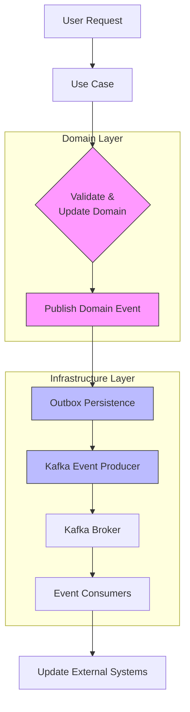

# Project Overview

<cite>
**Referenced Files in This Document**   
- [WalletHubApplication.java](file://src/main/java/dev/bloco/wallet/hub/WalletHubApplication.java)
- [README.md](file://README.md)
- [UseCaseConfig.java](file://src/main/java/dev/bloco/wallet/hub/config/UseCaseConfig.java)
- [CreateWalletUseCase.java](file://src/main/java/dev/bloco/wallet/hub/usecase/CreateWalletUseCase.java)
- [KafkaEventProducer.java](file://src/main/java/dev/bloco/wallet/hub/infra/adapter/event/producer/KafkaEventProducer.java)
- [WalletCreatedEvent.java](file://src/main/java/dev/bloco/wallet/hub/domain/event/wallet/WalletCreatedEvent.java)
- [application.yml](file://src/main/resources/application.yml)
</cite>

## Table of Contents
1. [Introduction](#introduction)
2. [Core Architecture](#core-architecture)
3. [Key Features and Use Cases](#key-features-and-use-cases)
4. [System Context and Event Flow](#system-context-and-event-flow)
5. [Entry Point and Configuration](#entry-point-and-configuration)
6. [Technical Implementation Details](#technical-implementation-details)
7. [Conclusion](#conclusion)

## Introduction

The **bloco-wallet-java** project is a backend wallet management system built using **Spring Boot 3.5.5** and **Java 25**, designed to support event-driven fund operations and transaction processing in a distributed environment. It serves as a central hub for managing digital wallets, enabling operations such as wallet creation, fund transfers, withdrawals, and transaction confirmations through a robust, scalable, and maintainable architecture.

The system follows **Clean Architecture (Ports and Adapters)** principles, separating concerns between domain logic, use cases, infrastructure, and external integrations. This design ensures that business rules remain independent of frameworks and databases, promoting testability and long-term maintainability. The domain model is implemented using **Domain-Driven Design (DDD)** concepts, with rich entities, value objects, and domain events that capture business semantics.

Events are published and consumed via **Apache Kafka** using **Spring Cloud Stream**, enabling asynchronous communication between services and supporting eventual consistency across distributed systems. All domain events conform to the **CloudEvents** specification, ensuring standardized event formats for interoperability. The system also integrates with multiple persistence technologies, including **JPA/H2/PostgreSQL**, **Reactive Redis**, and **Reactive MongoDB**, allowing flexibility in data storage strategies.

This document provides a comprehensive overview of the system’s architecture, key components, and operational flow, from user request to event publication and persistence.

**Section sources**
- [README.md](file://README.md#L1-L50)

## Core Architecture

The bloco-wallet-java application is structured around **Clean Architecture**, organizing code into distinct layers:

- **domain**: Contains core business logic, including entities, value objects, domain events, and repository interfaces (ports).
- **usecase**: Implements application-specific workflows that orchestrate domain objects and interact with infrastructure via adapters.
- **infra**: Houses infrastructure concerns such as database access, message producers/consumers, mappers, and configuration.

This separation ensures that business logic remains decoupled from technical implementation details like databases or messaging systems.

The system embraces **event-driven architecture**, where state changes are expressed as domain events (e.g., `WalletCreatedEvent`, `FundsAddedEvent`). These events are published by use cases and handled asynchronously by consumers, enabling loose coupling and scalability.

Persistence is managed through a **multi-database strategy**:
- **JPA** with H2 (default) or PostgreSQL for relational data (wallets, transactions)
- **Reactive Redis** for caching and fast lookups
- **Reactive MongoDB** for storing event logs or unstructured data
- **Outbox pattern** ensures reliable event delivery by persisting events transactionally before publishing to Kafka

Additionally, the project supports **reactive programming** via Spring WebFlux and R2DBC, allowing non-blocking I/O operations for improved throughput under high load.

**Section sources**
- [README.md](file://README.md#L51-L100)
- [UseCaseConfig.java](file://src/main/java/dev/bloco/wallet/hub/config/UseCaseConfig.java#L1-L142)

## Key Features and Use Cases

The system supports several core financial operations through dedicated **use cases**, each encapsulating a specific business capability:

### Wallet Creation
The `CreateWalletUseCase` handles the creation of new wallets. When invoked, it:
1. Instantiates a new `Wallet` entity with a generated ID
2. Persists it via `WalletRepository`
3. Publishes a `WalletCreatedEvent` for downstream processing

```java
public Wallet createWallet(UUID userId, String correlationId) {
    Wallet wallet = Wallet.create(UUID.randomUUID(), "Default Wallet", "");
    walletRepository.save(wallet);
    WalletCreatedEvent event = new WalletCreatedEvent(wallet.getId(), UUID.fromString(correlationId));
    eventPublisher.publish(event);
    return wallet;
}
```

### Fund Management
- **AddFundsUseCase**: Increases a wallet’s balance and records the deposit
- **WithdrawFundsUseCase**: Decreases balance after validation and records withdrawal
- **TransferFundsUseCase**: Moves funds between two wallets atomically

Each operation updates the wallet state, persists a transaction record, and emits a corresponding domain event (`FundsAddedEvent`, `FundsWithdrawnEvent`, `FundsTransferredEvent`).

### Transaction Lifecycle
The system tracks transaction states using a **Saga State Machine** powered by **Spring StateMachine**. Key use cases include:
- `CreateTransactionUseCase`: Initiates a new blockchain transaction
- `ConfirmTransactionUseCase`: Marks a transaction as confirmed upon blockchain confirmation
- `FailTransactionUseCase`: Handles failed transactions due to insufficient funds or network issues

These use cases publish events like `TransactionCreatedEvent` and `TransactionConfirmedEvent`, which can trigger further actions in external systems.

All use cases are configured as Spring beans in `UseCaseConfig`, injecting required dependencies such as repositories and event publishers, ensuring dependency inversion and testability.

**Section sources**
- [CreateWalletUseCase.java](file://src/main/java/dev/bloco/wallet/hub/usecase/CreateWalletUseCase.java#L1-L42)
- [UseCaseConfig.java](file://src/main/java/dev/bloco/wallet/hub/config/UseCaseConfig.java#L27-L142)

## System Context and Event Flow

The following diagram illustrates the end-to-end flow from user request to event publication and infrastructure persistence.



**Diagram sources**
- [CreateWalletUseCase.java](file://src/main/java/dev/bloco/wallet/hub/usecase/CreateWalletUseCase.java#L25-L40)
- [KafkaEventProducer.java](file://src/main/java/dev/bloco/wallet/hub/infra/adapter/event/producer/KafkaEventProducer.java#L29-L151)

### Step-by-Step Flow

1. **Request Initiation**: A client triggers an operation (e.g., create wallet).
2. **Use Case Execution**: The corresponding use case (e.g., `CreateWalletUseCase`) executes business logic.
3. **Domain Event Publishing**: After successful execution, a domain event (e.g., `WalletCreatedEvent`) is published via `DomainEventPublisher`.
4. **Outbox Storage**: The event is serialized and stored in the **outbox table** using `OutboxService`, ensuring atomicity with the main transaction.
5. **Kafka Publishing**: A scheduled task in `KafkaEventProducer.processOutbox()` polls unsent outbox events every 5 seconds and sends them to Kafka topics via `StreamBridge`.
6. **External Consumption**: Other services consume these events from Kafka topics (e.g., `wallet-created-topic`) and react accordingly (e.g., notify users, update analytics).

This design guarantees **reliable messaging** even in the face of transient failures, as unsent events remain in the outbox for retry.

**Section sources**
- [KafkaEventProducer.java](file://src/main/java/dev/bloco/wallet/hub/infra/adapter/event/producer/KafkaEventProducer.java#L29-L151)
- [WalletCreatedEvent.java](file://src/main/java/dev/bloco/wallet/hub/domain/event/wallet/WalletCreatedEvent.java#L18-L38)

## Entry Point and Configuration

The application entry point is the `WalletHubApplication` class, annotated with `@SpringBootApplication`, which enables auto-configuration, component scanning, and feature detection based on classpath content.

```java
@SpringBootApplication
@EntityScan(basePackages = {
    "dev.bloco.wallet.hub.infra.provider.data.entity",
    "dev.bloco.wallet.hub.infra.provider.data",
    "org.springframework.statemachine.data.jpa"
})
public class WalletHubApplication {
    public static void main(String[] args) {
        SpringApplication.run(WalletHubApplication.class, args);
    }
}
```

### Key Annotations

- `@SpringBootApplication`: Combines `@Configuration`, `@EnableAutoConfiguration`, and `@ComponentScan`
- `@EntityScan`: Explicitly defines packages containing JPA entities, including those used by Spring StateMachine for saga persistence

The `main` method bootstraps the Spring application context, initializing all configured beans, including use cases, repositories, and event producers.

Configuration is primarily driven by `application.yml`, which sets:
- Default datasource to H2 file database
- Kafka binder pointing to `localhost:9092`
- Spring Cloud Stream bindings for event producers
- H2 console enabled at `/h2-console`

Environment variables can override defaults (e.g., `SPRING_DATASOURCE_URL` for PostgreSQL).

**Section sources**
- [WalletHubApplication.java](file://src/main/java/dev/bloco/wallet/hub/WalletHubApplication.java#L1-L37)
- [application.yml](file://src/main/resources/application.yml#L1-L20)

## Technical Implementation Details

### Event Publishing Mechanism

The system uses a dual-layer event publishing model:

1. **In-memory Domain Event Publisher**: Static `DomainEventPublisher` class manages subscribers using `ThreadLocal`, allowing domain events to be published during transaction scope.
2. **Infrastructure-Level Kafka Producer**: `KafkaEventProducer` implements `EventProducer` interface and uses `StreamBridge` to send serialized events to Kafka.

Events are not sent directly to Kafka to avoid coupling domain logic with infrastructure. Instead, they are persisted in the **outbox** first, ensuring that event publication is part of the same transaction as the state change.

### Reactive and Multi-Database Support

While the primary persistence layer uses blocking JPA, the system includes support for reactive data access:
- **R2DBC** for non-blocking SQL access
- **Reactive Redis** and **Reactive MongoDB** for high-performance, asynchronous operations

This hybrid approach allows teams to choose the right tool for each use case—blocking for simplicity, reactive for scalability.

### Build and Deployment

The project uses **Maven** with a wrapper (`mvnw`) and supports:
- JVM packaging: `./mvnw package`
- Container image build: `./mvnw spring-boot:build-image`
- Native image compilation (GraalVM): `./mvnw native:compile`

Optional Docker Compose (`compose.yaml`) brings up MongoDB, PostgreSQL, and Redis for integration testing.

**Section sources**
- [README.md](file://README.md#L101-L172)
- [KafkaEventProducer.java](file://src/main/java/dev/bloco/wallet/hub/infra/adapter/event/producer/KafkaEventProducer.java#L29-L151)

## Conclusion

The **bloco-wallet-java** project exemplifies modern backend architecture principles, combining **Spring Boot**, **Clean Architecture**, **Domain-Driven Design**, and **event-driven communication** to build a resilient and scalable wallet management system. By leveraging Kafka for asynchronous messaging, applying the outbox pattern for reliability, and supporting both imperative and reactive programming models, it provides a solid foundation for financial applications requiring high availability and consistency.

Key strengths include:
- Clear separation of concerns via ports and adapters
- Reliable event delivery using outbox and scheduled processing
- Flexible persistence options across SQL, NoSQL, and cache stores
- Standardized event formats using CloudEvents
- Configurable for local development and production deployment

With proper API exposure (currently undocumented), this system could serve as the backbone for wallet services in blockchain or fintech platforms.

**Section sources**
- [README.md](file://README.md#L1-L172)