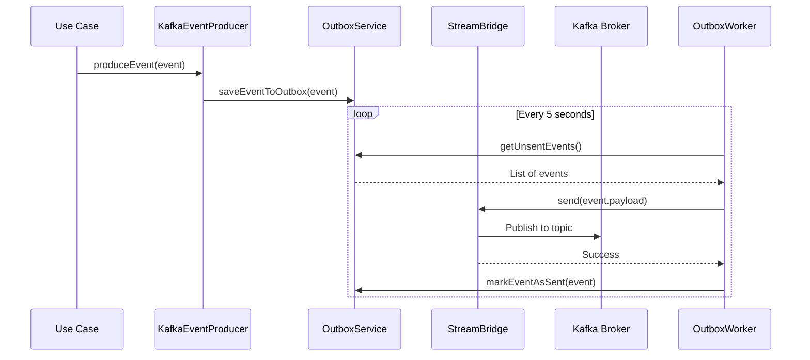
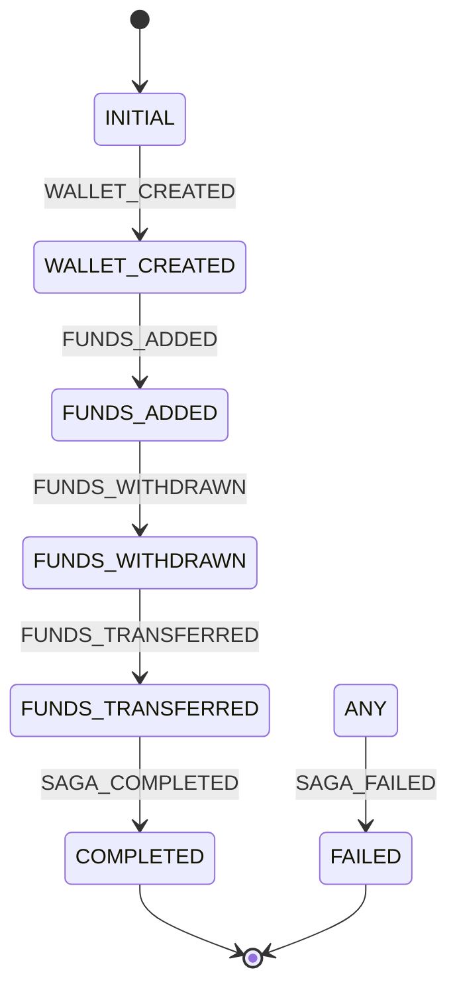

# Technology Stack & Dependencies

<cite>
**Referenced Files in This Document**   
- [pom.xml](file://pom.xml)
- [compose.yaml](file://compose.yaml)
- [mise.toml](file://mise.toml)
- [WalletHubApplication.java](file://src/main/java/dev/bloco/wallet/hub/WalletHubApplication.java)
- [UseCaseConfig.java](file://src/main/java/dev/bloco/wallet/hub/config/UseCaseConfig.java)
- [KafkaEventProducer.java](file://src/main/java/dev/bloco/wallet/hub/infra/adapter/event/producer/KafkaEventProducer.java)
- [CloudEventUtils.java](file://src/main/java/dev/bloco/wallet/hub/infra/util/CloudEventUtils.java)
- [TransactionMapper.java](file://src/main/java/dev/bloco/wallet/hub/infra/provider/mapper/TransactionMapper.java)
- [application.yml](file://src/main/resources/application.yml)
</cite>

## Table of Contents
1. [Java & Spring Boot Foundation](#java--spring-boot-foundation)
2. [Reactive Data Access with Spring Data](#reactive-data-access-with-spring-data)
3. [Event-Driven Architecture with Spring Cloud Stream & Kafka](#event-driven-architecture-with-spring-cloud-stream--kafka)
4. [Saga Orchestration with Spring StateMachine](#saga-orchestration-with-spring-statemachine)
5. [Integration & Messaging with Apache Camel](#integration--messaging-with-apache-camel)
6. [Code Efficiency with MapStruct & Lombok](#code-efficiency-with-mapstruct--lombok)
7. [Observability with Micrometer](#observability-with-micrometer)
8. [Standardized Event Formatting with CloudEvents](#standardized-event-formatting-with-cloudevents)
9. [Build & Compilation with Maven](#build--compilation-with-maven)
10. [Infrastructure Provisioning with Docker Compose](#infrastructure-provisioning-with-docker-compose)
11. [Toolchain Management with mise](#toolchain-management-with-mise)
12. [AI & Document Processing with Spring AI](#ai--document-processing-with-spring-ai)
13. [Technology Rationale & System Benefits](#technology-rationale--system-benefits)

## Java & Spring Boot Foundation

The bloco-wallet-java application is built on **Java 25**, leveraging the latest language features and performance improvements. It is powered by **Spring Boot 3.5.5**, which provides a robust, convention-over-configuration foundation for the application. The use of Java 25 is managed via the `mise.toml` configuration, which specifies `graalvm-community-25` as the toolchain, enabling support for native image compilation.

The application is structured as a reactive web service using **Spring WebFlux**, which is evident from the `spring-boot-starter-webflux` dependency in the `pom.xml`. This choice enables non-blocking, asynchronous processing, which is critical for handling high-concurrency scenarios typical in financial applications. The main application class, `WalletHubApplication`, is annotated with `@SpringBootApplication` and uses `@EntityScan` to include JPA entities from multiple packages, including those used by Spring StateMachine for persistence.

**Section sources**
- [pom.xml](file://pom.xml#L10-L11)
- [mise.toml](file://mise.toml#L2)
- [WalletHubApplication.java](file://src/main/java/dev/bloco/wallet/hub/WalletHubApplication.java#L23-L35)

## Reactive Data Access with Spring Data

The application employs a polyglot persistence strategy, utilizing multiple Spring Data modules for reactive data access. This approach ensures non-blocking I/O operations, which aligns with the reactive nature of Spring WebFlux.

- **Spring Data R2DBC**: Used for reactive access to the PostgreSQL database. The `spring-boot-starter-data-r2dbc` and `r2dbc-postgresql` dependencies are included in the `pom.xml`. This provides a reactive alternative to traditional JPA for relational data.
- **Spring Data MongoDB Reactive**: Used for reactive access to MongoDB, included via the `spring-boot-starter-data-mongodb-reactive` dependency.
- **Spring Data Redis Reactive**: Used for reactive access to Redis, included via the `spring-boot-starter-data-redis-reactive` dependency, likely for caching and session management.
- **Spring Data JPA**: Also included via `spring-boot-starter-data-jpa`, indicating a hybrid approach where both reactive (R2DBC) and imperative (JPA) data access are used, possibly for different use cases or during a migration phase.

The `JpaUserRepository` and `SpringDataWalletRepository` classes demonstrate the use of Spring Data JPA repositories, which abstract away boilerplate CRUD operations and provide a clean interface for data access.

**Section sources**
- [pom.xml](file://pom.xml#L38-L41)
- [SpringDataWalletRepository.java](file://src/main/java/dev/bloco/wallet/hub/infra/provider/data/repository/SpringDataWalletRepository.java#L25-L26)
- [JpaUserRepository.java](file://src/main/java/dev/bloco/wallet/hub/infra/provider/data/repository/JpaUserRepository.java#L26-L59)

## Event-Driven Architecture with Spring Cloud Stream & Kafka

The application implements an event-driven architecture using **Spring Cloud Stream** with **Kafka** as the message broker. This is configured through the `spring-cloud-stream` and `spring-cloud-stream-binder-kafka` dependencies.

Events are produced by the `KafkaEventProducer` class, which implements the `EventProducer` interface. This class uses the `StreamBridge` to send events to Kafka. To ensure reliability, events are first persisted in an outbox table (via `OutboxService`) before being sent to Kafka. A scheduled method, `processOutbox`, runs every 5 seconds to send unsent events from the outbox to their respective Kafka topics, as defined in the `application.yml` (e.g., `wallet-created-topic`).

This outbox pattern decouples event production from message sending, ensuring that events are not lost if the Kafka broker is temporarily unavailable. The `@Scheduled(fixedRate = 5000)` annotation on the `processOutbox` method in both `KafkaEventProducer` and `OutboxWorker` classes confirms this polling mechanism.

**Diagram sources**
- [KafkaEventProducer.java](file://src/main/java/dev/bloco/wallet/hub/infra/adapter/event/producer/KafkaEventProducer.java#L139-L151)
- [OutboxWorker.java](file://src/main/java/dev/bloco/wallet/hub/infra/provider/data/OutboxWorker.java#L80-L93)
- [application.yml](file://src/main/resources/application.yml#L20-L28)

**Section sources**
- [pom.xml](file://pom.xml#L68-L75)
- [KafkaEventProducer.java](file://src/main/java/dev/bloco/wallet/hub/infra/adapter/event/producer/KafkaEventProducer.java#L29-L151)
- [application.yml](file://src/main/resources/application.yml#L20-L28)

## Saga Orchestration with Spring StateMachine

The application uses **Spring StateMachine** to manage complex, long-running business processes as sagas. This is evident from the `spring-statemachine-starter` dependency and the presence of configuration classes like `SagaStateMachineConfig`.

The state machine is configured to manage a saga lifecycle with states such as `INITIAL`, `WALLET_CREATED`, `FUNDS_ADDED`, `FUNDS_WITHDRAWN`, `FUNDS_TRANSFERRED`, `COMPLETED`, and `FAILED`. Transitions between these states are triggered by events like `WALLET_CREATED`, `FUNDS_ADDED`, etc. The state machine is persisted using JPA (`spring-statemachine-data-jpa`), allowing it to survive application restarts.

The `StandardSagaStateMachineConfig` class defines the state and transition configuration, ensuring that business processes follow a defined path and can be recovered in case of failure. This provides a robust mechanism for ensuring data consistency across distributed operations.

**Diagram sources**
- [SagaStateMachineConfig.java](file://src/main/java/dev/bloco/wallet/hub/infra/provider/data/config/SagaStateMachineConfig.java#L76-L102)
- [StandardSagaStateMachineConfig.java](file://src/main/java/dev/bloco/wallet/hub/infra/provider/data/config/StandardSagaStateMachineConfig.java#L77-L102)

**Section sources**
- [pom.xml](file://pom.xml#L128-L131)
- [SagaStateMachineConfig.java](file://src/main/java/dev/bloco/wallet/hub/infra/provider/data/config/SagaStateMachineConfig.java#L24-L117)

## Integration & Messaging with Apache Camel

**Apache Camel** is integrated into the application via the `camel-spring-boot-starter` dependency (version 4.14.0). Camel is a powerful integration framework that simplifies the development of routing and mediation rules. It can be used to connect the wallet application with various external systems, such as payment gateways, banking APIs, or other microservices, using a wide range of connectors (components).

While the specific Camel routes are not visible in the provided code, its presence indicates that the application is designed to handle complex integration scenarios with a high degree of flexibility and maintainability.

**Section sources**
- [pom.xml](file://pom.xml#L70-L72)

## Code Efficiency with MapStruct & Lombok

The application leverages two libraries to reduce boilerplate code and improve developer productivity:

- **MapStruct**: Used for type-safe, compile-time mapping between domain models and persistence entities. The `mapstruct` and `mapstruct-processor` dependencies are included in the `pom.xml`. Mapper interfaces like `TransactionMapper`, `UserMapper`, and `WalletMapper` are annotated with `@Mapper(componentModel = "spring")`, allowing Spring to manage their instances. These mappers handle the conversion between `Transaction` and `TransactionEntity`, `User` and `UserEntity`, etc., without the need for manual, error-prone code.
- **Lombok**: Used to automatically generate common code such as getters, setters, constructors, and `toString` methods. The `lombok` dependency is marked as optional in the `pom.xml`, and the `maven-compiler-plugin` is configured to include the Lombok annotation processor. This significantly reduces the amount of boilerplate code in entity and model classes.

**Section sources**
- [pom.xml](file://pom.xml#L159-L161)
- [TransactionMapper.java](file://src/main/java/dev/bloco/wallet/hub/infra/provider/mapper/TransactionMapper.java#L33-L75)
- [pom.xml](file://pom.xml#L360-L368)

## Observability with Micrometer

The application includes **Micrometer** for observability, specifically with the `micrometer-tracing-bridge-brave` and `micrometer-registry-prometheus` dependencies. This allows the application to generate distributed traces (using Brave as the tracing system) and expose metrics in a format that can be scraped by Prometheus.

This setup is crucial for monitoring the health, performance, and behavior of the application in production, especially in a microservices environment where understanding the flow of requests across services is essential for debugging and optimization.

**Section sources**
- [pom.xml](file://pom.xml#L189-L191)

## Standardized Event Formatting with CloudEvents

The application uses the **CloudEvents** specification to standardize the format of events published to Kafka. This is achieved through the `cloudevents-spring` dependency (version 4.0.1).

The `CloudEventUtils` class provides static methods to create CloudEvent instances with a unique ID, type, source, and optional correlation ID. By using a standardized event format, the application ensures interoperability with other systems and services that also adhere to the CloudEvents specification, making it easier to build a cohesive, event-driven ecosystem.

**Section sources**
- [pom.xml](file://pom.xml#L187-L188)
- [CloudEventUtils.java](file://src/main/java/dev/bloco/wallet/hub/infra/util/CloudEventUtils.java#L11-L54)

## Build & Compilation with Maven

The project uses **Apache Maven** as its build tool, managed by the `pom.xml` file and the `mvnw.cmd` wrapper script. The `pom.xml` defines the project's dependencies, plugins, and build configuration.

Key plugins include:
- **maven-compiler-plugin**: Configured to use annotation processors for Lombok and Spring Boot configuration processing.
- **hibernate-enhance-maven-plugin**: Used to enhance JPA entities with features like lazy loading and dirty tracking.
- **native-maven-plugin**: From GraalVM, enabling the compilation of the application into a native image for faster startup and lower memory usage.
- **spring-boot-maven-plugin**: Used to package the application as an executable JAR and configure the container image.

The `pom.xml` also uses dependency management via `spring-cloud-dependencies` and `spring-ai-bom` to ensure version compatibility across the Spring ecosystem.

**Section sources**
- [pom.xml](file://pom.xml#L360-L423)

## Infrastructure Provisioning with Docker Compose

The application's infrastructure is provisioned using **Docker Compose** via the `compose.yaml` file. This file defines services for:
- **MongoDB**: Used for document storage.
- **PostgreSQL**: Used as the primary relational database.
- **Redis**: Used for caching and potentially as a message broker.

This setup allows developers to quickly spin up a local environment with all required services, ensuring consistency between development, testing, and production environments.

**Section sources**
- [compose.yaml](file://compose.yaml#L1-L21)

## Toolchain Management with mise

The project uses **mise** (formerly `rtx`) for toolchain management, as defined in the `mise.toml` file. This file specifies that the project requires `graalvm-community-25`, ensuring that all developers use the same version of the JDK and GraalVM. This eliminates "works on my machine" issues and streamlines the setup process for new developers.

**Section sources**
- [mise.toml](file://mise.toml#L2)

## AI & Document Processing with Spring AI

The application has integrated **Spring AI** to support AI-powered features and document processing capabilities. This is evident from the addition of multiple Spring AI starter dependencies in the `pom.xml`, including:

- **Document Readers**: Support for parsing PDF (`spring-ai-pdf-document-reader`), Markdown (`spring-ai-markdown-document-reader`), and various document formats via Apache Tika (`spring-ai-tika-document-reader`).
- **Embedding Models**: Integration with embedding models such as PostgresML (`spring-ai-starter-model-postgresml-embedding`) for semantic analysis and vectorization.
- **Vector Stores**: Support for storing and querying vector embeddings using Qdrant (`spring-ai-starter-vector-store-qdrant`), Redis (`spring-ai-starter-vector-store-redis`), and PGVector (`spring-ai-starter-vector-store-pgvector`).
- **Chat Memory**: State management for conversational AI via `spring-ai-starter-model-chat-memory` and Neo4j-backed memory (`spring-ai-starter-model-chat-memory-repository-neo4j`).
- **Model Integrations**: Support for various AI models including Bedrock, Ollama, OpenAI, Anthropic, and Transformers.

These capabilities enable the wallet application to support intelligent document processing, semantic search, and AI-driven user interactions, positioning it for advanced financial analytics and automated customer support features.

**Section sources**
- [pom.xml](file://pom.xml#L232-L328)

## Technology Rationale & System Benefits

The chosen technology stack supports the application's goals of **scalability, reliability, and maintainability**.

- **Scalability**: The reactive programming model (WebFlux, R2DBC) allows the application to handle a large number of concurrent users with minimal resource consumption.
- **Reliability**: The outbox pattern with Kafka ensures that critical events (e.g., wallet creation, fund transfers) are not lost, even during system failures. The saga pattern with Spring StateMachine ensures data consistency across distributed operations.
- **Maintainability**: The use of Spring Boot, MapStruct, and Lombok reduces boilerplate code and enforces a clean, modular architecture. Standardized event formats (CloudEvents) and observability (Micrometer) make the system easier to monitor and debug.
- **Future-Proofing**: The integration of Spring AI enables the application to evolve with AI-driven features such as intelligent transaction categorization, document-based identity verification, and natural language financial insights.

This comprehensive stack provides a solid foundation for a modern, cloud-native financial application.

**Section sources**
- [pom.xml](file://pom.xml)
- [compose.yaml](file://compose.yaml)
- [mise.toml](file://mise.toml)