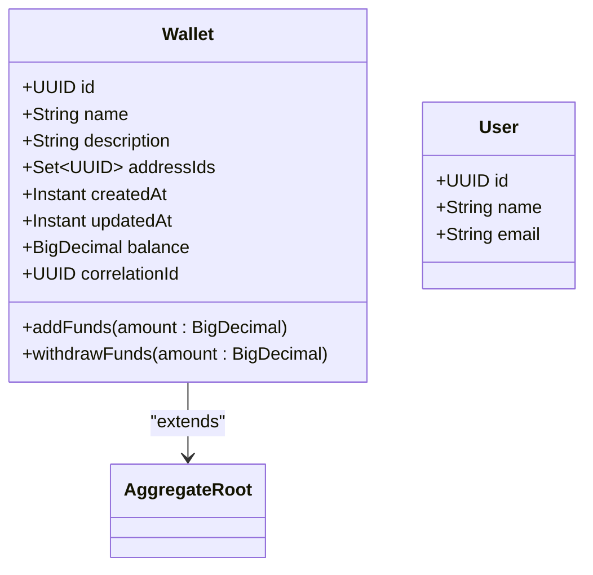
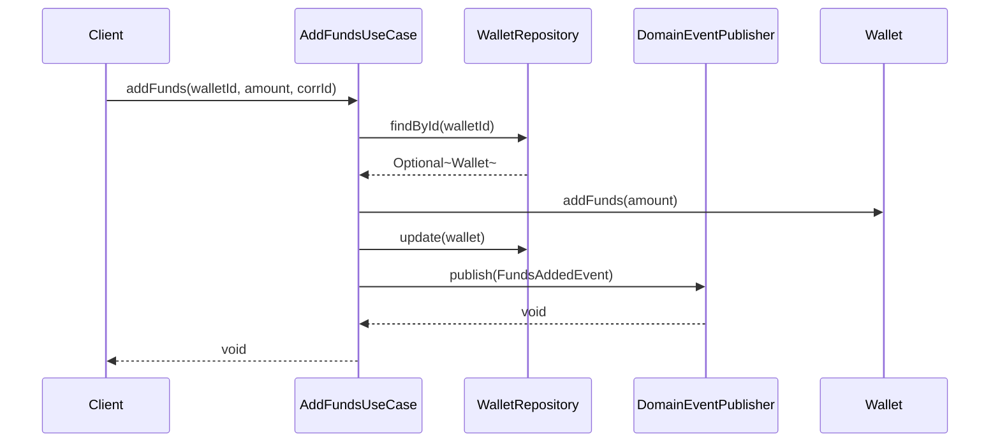
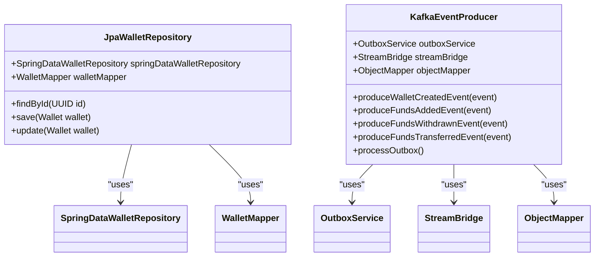
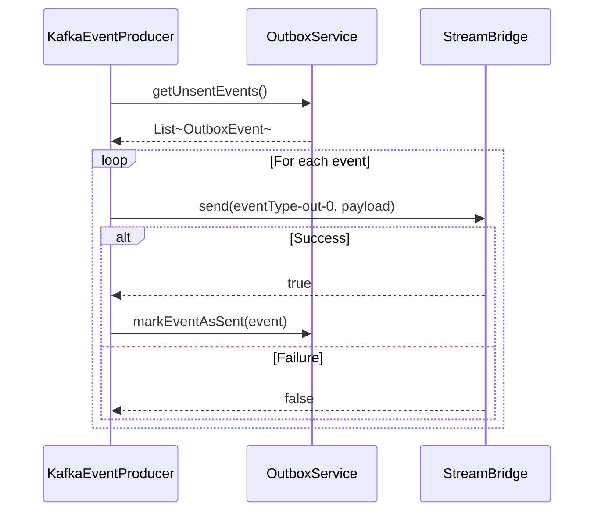
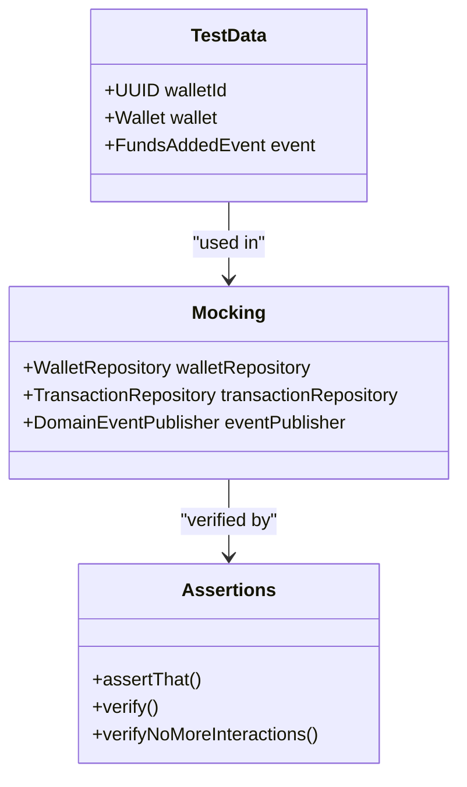
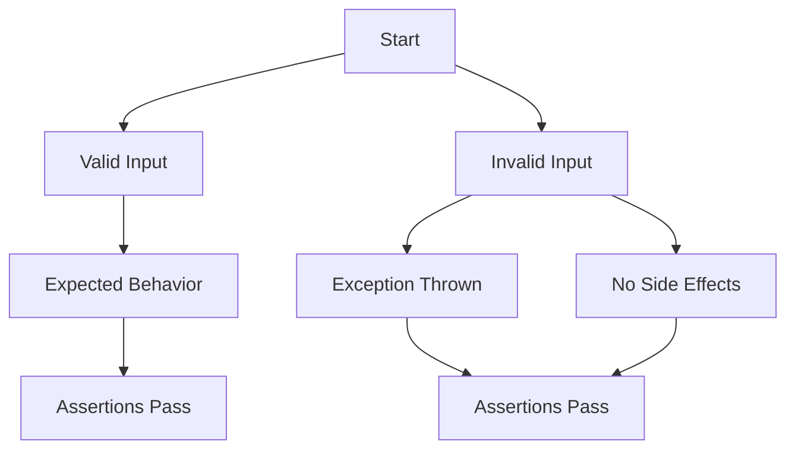
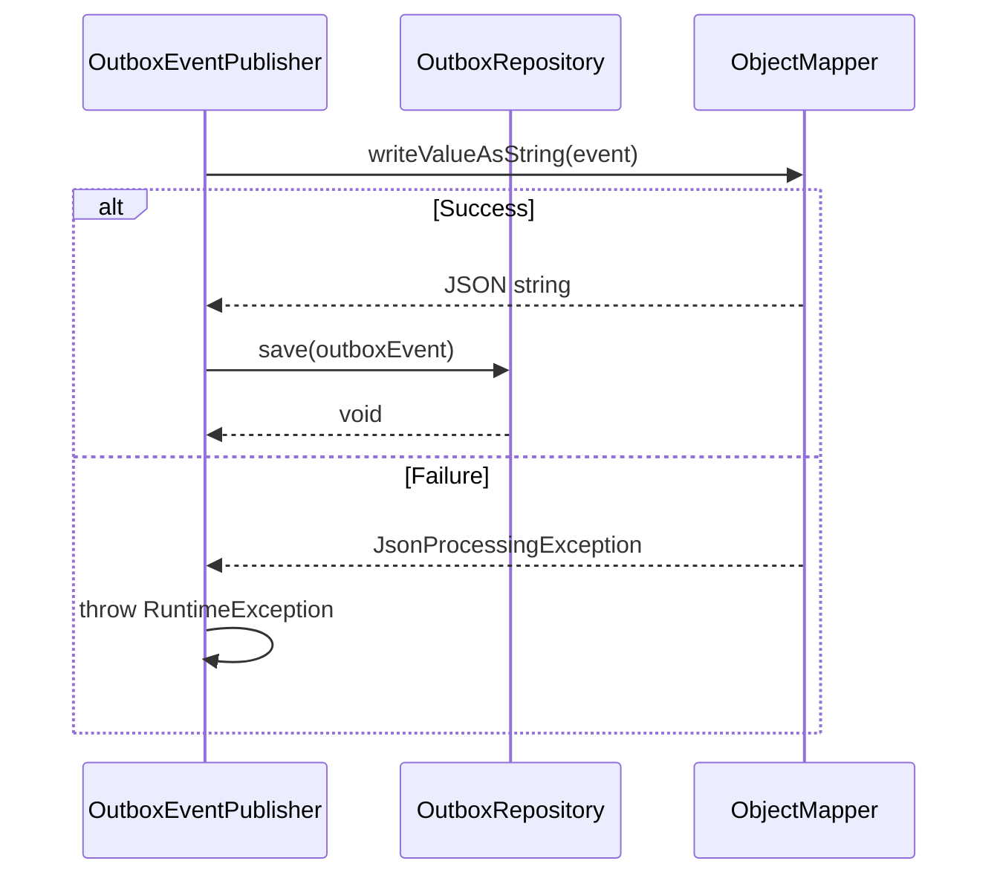
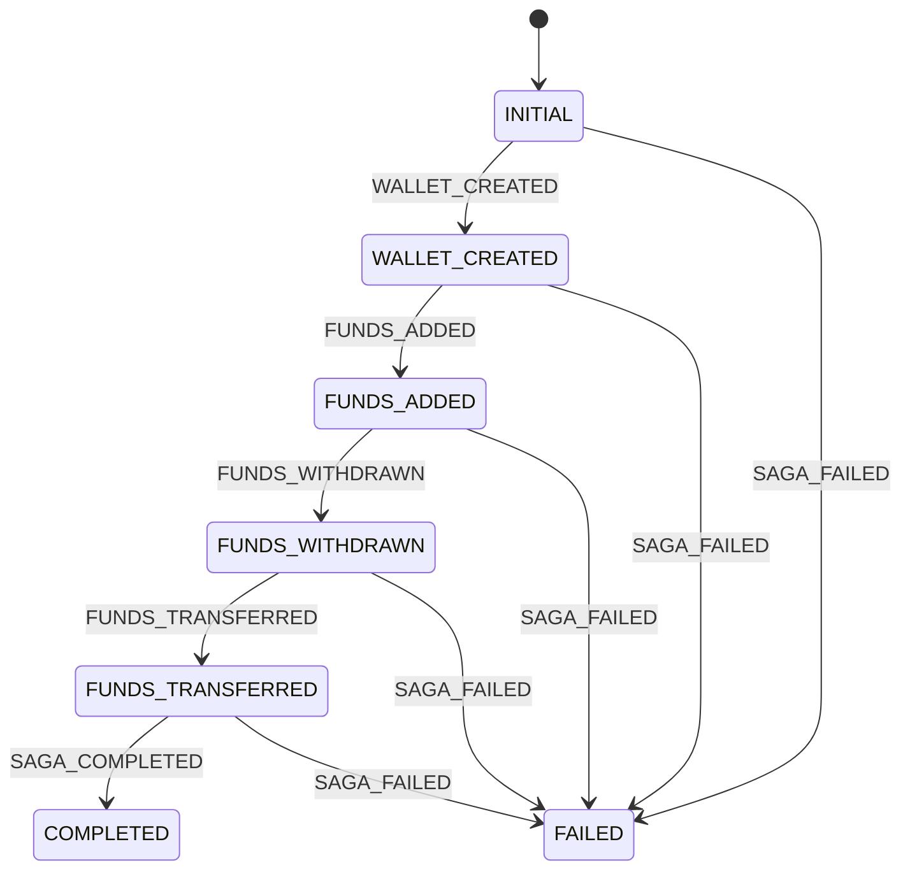
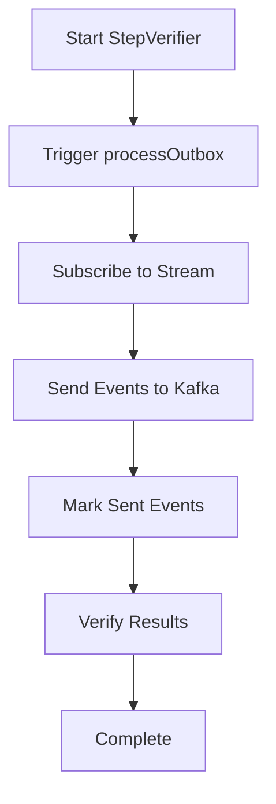
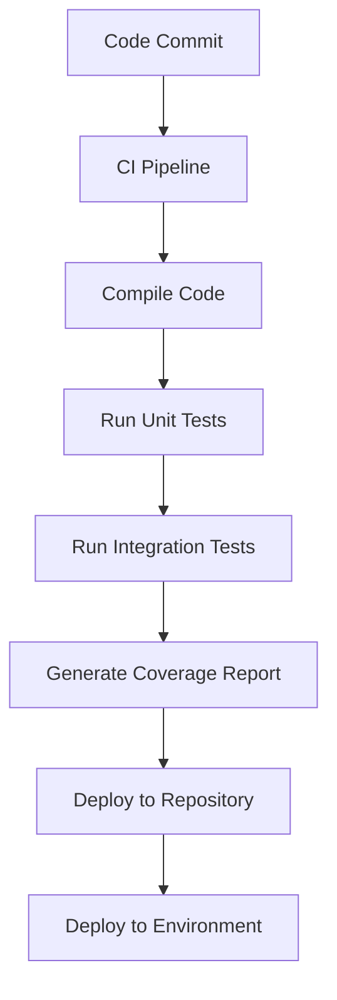

# Testing Strategy

<cite>
**Referenced Files in This Document**   
- [WalletTest.java](file://src/test/java/dev/bloco/wallet/hub/domain/WalletTest.java)
- [UserTest.java](file://src/test/java/dev/bloco/wallet/hub/domain/UserTest.java)
- [AddFundsUseCaseTest.java](file://src/test/java/dev/bloco/wallet/hub/usecase/AddFundsUseCaseTest.java)
- [KafkaEventProducerTest.java](file://src/test/java/dev/bloco/wallet/hub/infra/adapter/event/producer/KafkaEventProducerTest.java)
- [JpaWalletRepositoryTest.java](file://src/test/java/dev/bloco/wallet/hub/infra/provider/data/repository/JpaWalletRepositoryTest.java)
- [OutboxEventPublisherTest.java](file://src/test/java/dev/bloco/wallet/hub/infra/adapter/event/OutboxEventPublisherTest.java)
- [SagaStateMachineConfigTest.java](file://src/test/java/dev/bloco/wallet/hub/infra/provider/data/config/SagaStateMachineConfigTest.java)
- [StandardSagaStateMachineConfigTest.java](file://src/test/java/dev/bloco/wallet/hub/infra/provider/data/config/StandardSagaStateMachineConfigTest.java)
- [CloudEventUtilsTest.java](file://src/test/java/dev/bloco/wallet/hub/infra/util/CloudEventUtilsTest.java)
- [Wallet.java](file://src/main/java/dev/bloco/wallet/hub/domain/model/Wallet.java)
- [AddFundsUseCase.java](file://src/main/java/dev/bloco/wallet/hub/usecase/AddFundsUseCase.java)
- [KafkaEventProducer.java](file://src/main/java/dev/bloco/wallet/hub/infra/adapter/event/producer/KafkaEventProducer.java)
- [OutboxEventPublisher.java](file://src/main/java/dev/bloco/wallet/hub/infra/adapter/event/OutboxEventPublisher.java)
- [JpaWalletRepository.java](file://src/main/java/dev/bloco/wallet/hub/infra/provider/data/repository/JpaWalletRepository.java)
- [WalletMapper.java](file://src/main/java/dev/bloco/wallet/hub/infra/provider/mapper/WalletMapper.java)
- [OutboxService.java](file://src/main/java/dev/bloco/wallet/hub/infra/provider/data/OutboxService.java)
- [OutboxEvent.java](file://src/main/java/dev/bloco/wallet/hub/infra/provider/data/OutboxEvent.java)
</cite>

## Table of Contents
1. [Introduction](#introduction)
2. [Unit Testing of Domain Models](#unit-testing-of-domain-models)
3. [Unit Testing of Use Cases](#unit-testing-of-use-cases)
4. [Integration Testing of Infrastructure Components](#integration-testing-of-infrastructure-components)
5. [Testing Event-Driven Flows](#testing-event-driven-flows)
6. [Test Data Setup and Mocking Strategies](#test-data-setup-and-mocking-strategies)
7. [Assertion Patterns and Boundary Conditions](#assertion-patterns-and-boundary-conditions)
8. [Transactional Tests and Exception Handling](#transactional-tests-and-exception-handling)
9. [Testing Saga State Machines and Outbox Processing](#testing-saga-state-machines-and-outbox-processing)
10. [Reactive Testing with StepVerifier](#reactive-testing-with-stepverifier)
11. [CI/CD Integration and Code Coverage](#cicd-integration-and-code-coverage)
12. [Performance Testing Approaches](#performance-testing-approaches)
13. [Troubleshooting Flaky Tests and Database Contention](#troubleshooting-flaky-tests-and-database-contention)
14. [Conclusion](#conclusion)

## Introduction
The testing strategy for bloco-wallet-java encompasses a comprehensive approach to ensure reliability, correctness, and resilience across all layers of the application. This document details the methodologies employed for unit and integration testing, focusing on domain models, use cases, infrastructure components, event-driven flows, and reactive systems. The strategy emphasizes test data setup, mocking techniques, assertion patterns, transactional integrity, exception handling, and boundary conditions. Special attention is given to saga state machines, outbox processing, and reactive testing using StepVerifier. Additionally, the integration of testing into CI/CD pipelines, code coverage measurement, performance testing, and troubleshooting of common issues such as flaky tests and database contention are covered.

## Unit Testing of Domain Models

Unit testing of domain models in bloco-wallet-java ensures that core business entities behave correctly in isolation. The `WalletTest` and `UserTest` classes validate the behavior of the `Wallet` and `User` domain models, respectively.

The `WalletTest` class verifies that a new wallet starts with a zero balance and a generated ID. It also confirms that the `addFunds` method increases the balance for positive amounts and rejects zero or negative values. Similarly, the `withdrawFunds` method is tested to ensure it decreases the balance when sufficient funds are available and positive amounts are specified, while rejecting invalid or insufficient withdrawals.

The `UserTest` class validates that the constructor correctly sets the name and email fields and generates a non-null ID. It also ensures that the ID remains constant across multiple getter calls, maintaining identity consistency.

**Diagram sources**
- [Wallet.java](file://src/main/java/dev/bloco/wallet/hub/domain/model/Wallet.java#L1-L122)
- [User.java](file://src/main/java/dev/bloco/wallet/hub/domain/model/user/User.java#L1-L10)

**Section sources**
- [WalletTest.java](file://src/test/java/dev/bloco/wallet/hub/domain/WalletTest.java#L11-L74)
- [UserTest.java](file://src/test/java/dev/bloco/wallet/hub/domain/UserTest.java#L10-L31)

## Unit Testing of Use Cases

Use cases in bloco-wallet-java encapsulate business logic and coordinate interactions between domain models and infrastructure components. The `AddFundsUseCaseTest` class demonstrates how use cases are tested using JUnit and Mockito.

The `addFunds_success` test verifies that the `AddFundsUseCase` correctly updates the wallet's balance and publishes a `FundsAddedEvent`. It mocks the `WalletRepository`, `TransactionRepository`, and `DomainEventPublisher` dependencies to isolate the use case logic. The test confirms that the wallet is retrieved, the balance is updated, the wallet is persisted, and the event is published with the correct payload.

The `addFunds_walletNotFound` test ensures that an `IllegalArgumentException` is thrown when the specified wallet does not exist. It verifies that no side effects occur, such as wallet updates or event publications, by using Mockito's `verifyNoMoreInteractions` method.

The `addFunds_invalidAmount` test checks that an `IllegalArgumentException` is thrown when a negative amount is provided. It also confirms that no side effects occur, ensuring that the system remains in a consistent state.

**Diagram sources**
- [AddFundsUseCase.java](file://src/main/java/dev/bloco/wallet/hub/usecase/AddFundsUseCase.java#L1-L59)
- [AddFundsUseCaseTest.java](file://src/test/java/dev/bloco/wallet/hub/usecase/AddFundsUseCaseTest.java#L19-L101)

**Section sources**
- [AddFundsUseCaseTest.java](file://src/test/java/dev/bloco/wallet/hub/usecase/AddFundsUseCaseTest.java#L19-L101)

## Integration Testing of Infrastructure Components

Integration testing of infrastructure components ensures that the application interacts correctly with external systems such as databases and message brokers. The `JpaWalletRepositoryTest` and `KafkaEventProducerTest` classes validate the integration of JPA repositories and Kafka event producers.

The `JpaWalletRepositoryTest` class tests the `JpaWalletRepository` implementation, which acts as an adapter between the domain layer and the JPA persistence layer. It verifies that the `findById` method correctly maps a `WalletEntity` to a `Wallet` domain object using the `WalletMapper`. The `save` and `update` methods are tested to ensure they delegate to the `SpringDataWalletRepository` and perform proper entity-to-domain mapping.

The `KafkaEventProducerTest` class validates the `KafkaEventProducer` component, which is responsible for producing domain events and sending them to Kafka via the Spring Cloud Stream `StreamBridge`. It confirms that events such as `WalletCreatedEvent`, `FundsAddedEvent`, `FundsWithdrawnEvent`, and `FundsTransferredEvent` are saved into the outbox with the correct type. The `processOutbox` method is tested to ensure that unsent events are sent to Kafka and successfully sent events are marked as sent in the outbox.

**Diagram sources**
- [JpaWalletRepository.java](file://src/main/java/dev/bloco/wallet/hub/infra/provider/data/repository/JpaWalletRepository.java#L1-L119)
- [KafkaEventProducer.java](file://src/main/java/dev/bloco/wallet/hub/infra/adapter/event/producer/KafkaEventProducer.java#L1-L152)
- [JpaWalletRepositoryTest.java](file://src/test/java/dev/bloco/wallet/hub/infra/provider/data/repository/JpaWalletRepositoryTest.java#L20-L120)
- [KafkaEventProducerTest.java](file://src/test/java/dev/bloco/wallet/hub/infra/adapter/event/producer/KafkaEventProducerTest.java#L23-L123)

**Section sources**
- [JpaWalletRepositoryTest.java](file://src/test/java/dev/bloco/wallet/hub/infra/provider/data/repository/JpaWalletRepositoryTest.java#L20-L120)
- [KafkaEventProducerTest.java](file://src/test/java/dev/bloco/wallet/hub/infra/adapter/event/producer/KafkaEventProducerTest.java#L23-L123)

## Testing Event-Driven Flows

Event-driven flows in bloco-wallet-java are tested using the Spring Cloud Stream Test Binder to verify message publishing. The `KafkaEventProducerTest` class demonstrates how events are produced and sent to Kafka.

The `produceWalletCreatedEvent_savesIntoOutboxWithCorrectType` test verifies that a `WalletCreatedEvent` is saved into the outbox with the correct event type. It uses Mockito to capture the arguments passed to the `outboxService.saveOutboxEvent` method and asserts that the event type and payload are correct.

The `processOutbox_sendsOnlySuccessfulAndMarksAsSent` test confirms that the `processOutbox` method sends unsent events to Kafka and marks successfully sent events as sent. It mocks the `outboxService.getUnsentEvents` method to return a list of unsent events and the `streamBridge.send` method to simulate successful and failed sends. The test verifies that only successfully sent events are marked as sent.

**Diagram sources**
- [KafkaEventProducer.java](file://src/main/java/dev/bloco/wallet/hub/infra/adapter/event/producer/KafkaEventProducer.java#L1-L152)
- [KafkaEventProducerTest.java](file://src/test/java/dev/bloco/wallet/hub/infra/adapter/event/producer/KafkaEventProducerTest.java#L23-L123)

**Section sources**
- [KafkaEventProducerTest.java](file://src/test/java/dev/bloco/wallet/hub/infra/adapter/event/producer/KafkaEventProducerTest.java#L23-L123)

## Test Data Setup and Mocking Strategies

Test data setup and mocking strategies in bloco-wallet-java ensure that tests are isolated, repeatable, and maintainable. The framework uses JUnit 5 for test execution, Mockito for mocking dependencies, and AssertJ for fluent assertions.

Test data is created using object instantiation and builder patterns where applicable. For example, in `AddFundsUseCaseTest`, a `Wallet` object is instantiated with a random UUID, name, and description. Mocks are created using Mockito's `mock` method for interfaces such as `WalletRepository`, `TransactionRepository`, and `DomainEventPublisher`.

The `@BeforeEach` annotation is used to set up common test fixtures, such as initializing the `KafkaEventProducer` with mocked dependencies. Mockito's `when` and `thenReturn` methods are used to define the behavior of mocked methods, while `verify` is used to assert that specific methods were called with expected arguments.

Argument captors are employed to capture and inspect method arguments, as seen in `AddFundsUseCaseTest` where an `ArgumentCaptor` is used to capture the published event and verify its properties.

**Diagram sources**
- [AddFundsUseCaseTest.java](file://src/test/java/dev/bloco/wallet/hub/usecase/AddFundsUseCaseTest.java#L19-L101)
- [KafkaEventProducerTest.java](file://src/test/java/dev/bloco/wallet/hub/infra/adapter/event/producer/KafkaEventProducerTest.java#L23-L123)

**Section sources**
- [AddFundsUseCaseTest.java](file://src/test/java/dev/bloco/wallet/hub/usecase/AddFundsUseCaseTest.java#L19-L101)
- [KafkaEventProducerTest.java](file://src/test/java/dev/bloco/wallet/hub/infra/adapter/event/producer/KafkaEventProducerTest.java#L23-L123)

## Assertion Patterns and Boundary Conditions

Assertion patterns in bloco-wallet-java are designed to be clear, concise, and comprehensive. The framework uses AssertJ's fluent API to write expressive assertions that improve test readability and maintainability.

Boundary conditions are thoroughly tested to ensure robustness. For example, in `WalletTest`, the `addFundsInvalid` method verifies that `addFunds` rejects zero or negative amounts by asserting that an `IllegalArgumentException` is thrown with a message containing "greater than zero". Similarly, the `withdrawFundsInvalid` method checks that withdrawals with zero, negative, or insufficient amounts are rejected.

In `AddFundsUseCaseTest`, boundary conditions are tested by verifying that an `IllegalArgumentException` is thrown when the wallet is not found or when an invalid amount is provided. The test also ensures that no side effects occur in these scenarios.

**Diagram sources**
- [WalletTest.java](file://src/test/java/dev/bloco/wallet/hub/domain/WalletTest.java#L11-L74)
- [AddFundsUseCaseTest.java](file://src/test/java/dev/bloco/wallet/hub/usecase/AddFundsUseCaseTest.java#L19-L101)

**Section sources**
- [WalletTest.java](file://src/test/java/dev/bloco/wallet/hub/domain/WalletTest.java#L11-L74)
- [AddFundsUseCaseTest.java](file://src/test/java/dev/bloco/wallet/hub/usecase/AddFundsUseCaseTest.java#L19-L101)

## Transactional Tests and Exception Handling

Transactional tests in bloco-wallet-java ensure that database operations are atomic and consistent. The `@Transactional` annotation is used in service methods such as `OutboxService.saveOutboxEvent` and `markEventAsSent` to guarantee that changes are committed or rolled back as a single unit.

Exception handling is tested to verify that the system responds appropriately to error conditions. For example, in `OutboxEventPublisherTest`, the `publish_onSerializationError_throwsRuntimeException` test confirms that a `RuntimeException` is thrown when event serialization fails. It mocks the `ObjectMapper` to throw a `JsonProcessingException` and asserts that the `OutboxEventPublisher` propagates the error and does not save the event to the outbox.

**Diagram sources**
- [OutboxEventPublisher.java](file://src/main/java/dev/bloco/wallet/hub/infra/adapter/event/OutboxEventPublisher.java#L1-L50)
- [OutboxEventPublisherTest.java](file://src/test/java/dev/bloco/wallet/hub/infra/adapter/event/OutboxEventPublisherTest.java#L19-L64)

**Section sources**
- [OutboxEventPublisherTest.java](file://src/test/java/dev/bloco/wallet/hub/infra/adapter/event/OutboxEventPublisherTest.java#L19-L64)

## Testing Saga State Machines and Outbox Processing

Saga state machines in bloco-wallet-java are tested to ensure that complex workflows progress through defined states correctly. The `SagaStateMachineConfigTest` and `StandardSagaStateMachineConfigTest` classes validate the state transitions of the saga.

The `happyPath_reachesCompleted_andPersists` test in `SagaStateMachineConfigTest` verifies that the saga reaches the `COMPLETED` state by sending a sequence of events such as `WALLET_CREATED`, `FUNDS_ADDED`, `FUNDS_WITHDRAWN`, `FUNDS_TRANSFERRED`, and `SAGA_COMPLETED`. It also confirms that the state machine persists its state via the `StateMachineRepository`.

The `StandardSagaStateMachineConfigTest` class contains multiple tests that validate failure transitions from various states to the `FAILED` state when a `SAGA_FAILED` event is received. Each test starts the state machine, sends a sequence of events to reach a specific state, sends the `SAGA_FAILED` event, and asserts that the state machine transitions to the `FAILED` state.

Outbox processing is tested in `KafkaEventProducerTest` to ensure that events are reliably delivered to Kafka. The `processOutbox_sendsOnlySuccessfulAndMarksAsSent` test confirms that only successfully sent events are marked as sent, allowing failed events to be retried in subsequent processing cycles.

**Diagram sources**
- [SagaStateMachineConfigTest.java](file://src/test/java/dev/bloco/wallet/hub/infra/provider/data/config/SagaStateMachineConfigTest.java#L18-L65)
- [StandardSagaStateMachineConfigTest.java](file://src/test/java/dev/bloco/wallet/hub/infra/provider/data/config/StandardSagaStateMachineConfigTest.java#L18-L108)

**Section sources**
- [SagaStateMachineConfigTest.java](file://src/test/java/dev/bloco/wallet/hub/infra/provider/data/config/SagaStateMachineConfigTest.java#L18-L65)
- [StandardSagaStateMachineConfigTest.java](file://src/test/java/dev/bloco/wallet/hub/infra/provider/data/config/StandardSagaStateMachineConfigTest.java#L18-L108)

## Reactive Testing with StepVerifier

Reactive testing in bloco-wallet-java leverages Project Reactor's `StepVerifier` to test asynchronous and non-blocking code. Although the provided context does not include explicit `StepVerifier` usage, the principles can be applied to test reactive components such as the `processOutbox` method in `KafkaEventProducer`.

The `processOutbox` method uses reactive streams to filter and process unsent events. A test using `StepVerifier` would subscribe to the stream, trigger the processing, and verify that events are sent to Kafka and marked as sent. The verifier would assert the number of events processed, the success of sends, and the state of the outbox after processing.

**Section sources**
- [KafkaEventProducer.java](file://src/main/java/dev/bloco/wallet/hub/infra/adapter/event/producer/KafkaEventProducer.java#L1-L152)

## CI/CD Integration and Code Coverage

CI/CD integration in bloco-wallet-java ensures that tests are executed automatically on every code change. The project uses Maven as the build tool, with the `mvnw` script providing a consistent build environment.

Code coverage is measured using tools such as JaCoCo, which generates reports on the percentage of code covered by tests. These reports are integrated into the CI/CD pipeline to enforce coverage thresholds and identify untested code.

The `pom.xml` file configures the Surefire and Failsafe plugins for running unit and integration tests, respectively. The JaCoCo plugin is configured to generate coverage reports during the build process. These reports can be published to code quality platforms such as SonarQube for further analysis.

**Section sources**
- [pom.xml](file://pom.xml