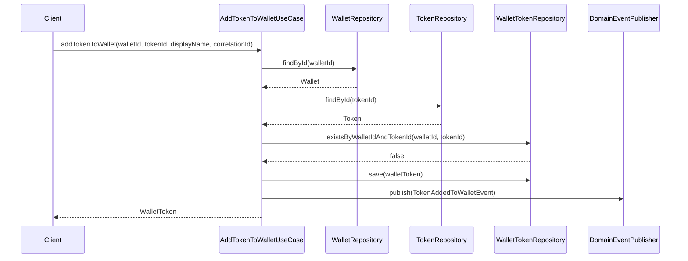
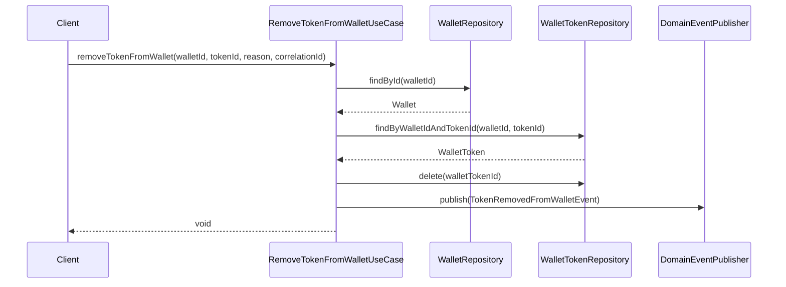
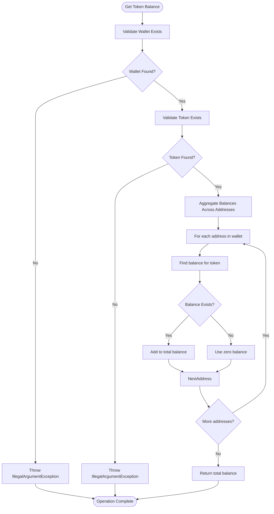
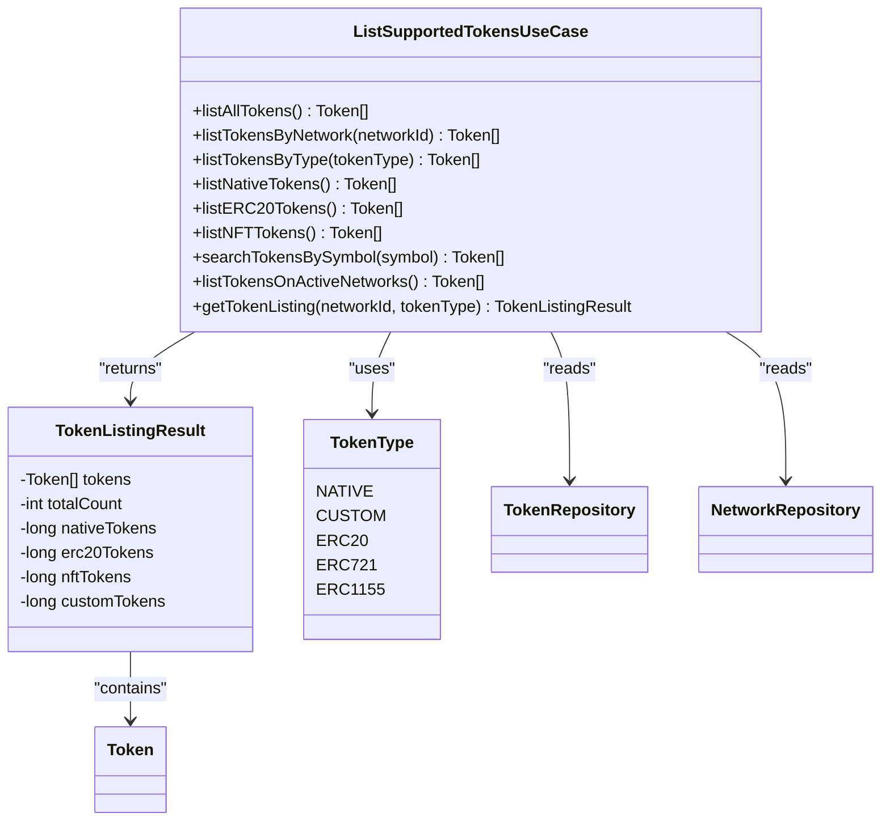
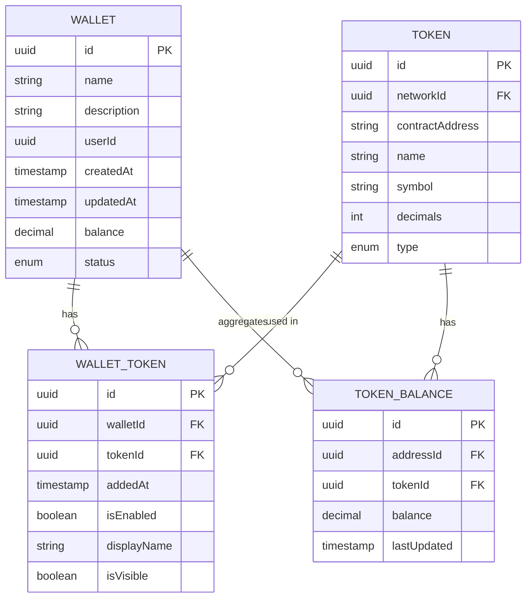

# Token Management

<cite>
**Referenced Files in This Document**   
- [AddTokenToWalletUseCase.java](file://src/main/java/dev/bloco/wallet/hub/usecase/AddTokenToWalletUseCase.java)
- [RemoveTokenFromWalletUseCase.java](file://src/main/java/dev/bloco/wallet/hub/usecase/RemoveTokenFromWalletUseCase.java)
- [ListSupportedTokensUseCase.java](file://src/main/java/dev/bloco/wallet/hub/usecase/ListSupportedTokensUseCase.java)
- [GetTokenBalanceUseCase.java](file://src/main/java/dev/bloco/wallet/hub/usecase/GetTokenBalanceUseCase.java)
- [Token.java](file://src/main/java/dev/bloco/wallet/hub/domain/model/token/Token.java)
- [WalletToken.java](file://src/main/java/dev/bloco/wallet/hub/domain/model/wallet/WalletToken.java)
- [TokenRepository.java](file://src/main/java/dev/bloco/wallet/hub/domain/gateway/TokenRepository.java)
- [WalletTokenRepository.java](file://src/main/java/dev/bloco/wallet/hub/domain/gateway/WalletTokenRepository.java)
- [TokenBalanceRepository.java](file://src/main/java/dev/bloco/wallet/hub/domain/gateway/TokenBalanceRepository.java)
- [TokenType.java](file://src/main/java/dev/bloco/wallet/hub/domain/model/token/TokenType.java)
- [TokenBalance.java](file://src/main/java/dev/bloco/wallet/hub/domain/model/token/TokenBalance.java)
- [Wallet.java](file://src/main/java/dev/bloco/wallet/hub/domain/model/Wallet.java)
- [WalletRepository.java](file://src/main/java/dev/bloco/wallet/hub/domain/gateway/WalletRepository.java)
</cite>

## Table of Contents
1. [Introduction](#introduction)
2. [Core Components](#core-components)
3. [Token Addition](#token-addition)
4. [Token Removal](#token-removal)
5. [Balance Retrieval](#balance-retrieval)
6. [Listing Supported Tokens](#listing-supported-tokens)
7. [Integration Patterns](#integration-patterns)
8. [Practical Examples](#practical-examples)
9. [Troubleshooting Guide](#troubleshooting-guide)
10. [Conclusion](#conclusion)

## Introduction
This document provides comprehensive documentation for token management operations in the Bloco Wallet system. It covers the implementation of key use cases including adding and removing tokens from wallets, retrieving token balances, and listing supported tokens. The documentation details the API interfaces, business rules, and integration patterns that enable secure and efficient token management within the wallet ecosystem.

## Core Components

The token management system is built around several core components that work together to provide a robust and scalable solution. These components include use cases, domain models, and repository interfaces that encapsulate the business logic and data access patterns.

```mermaid
classDiagram
class AddTokenToWalletUseCase {
+addTokenToWallet(walletId, tokenId, displayName, correlationId) WalletToken
+addMultipleTokens(walletId, tokenIds, correlationId) BatchAddResult
}
class RemoveTokenFromWalletUseCase {
+removeTokenFromWallet(walletId, tokenId, reason, correlationId) void
+hideTokenFromWallet(walletId, tokenId, correlationId) WalletToken
+showTokenInWallet(walletId, tokenId, correlationId) WalletToken
}
class GetTokenBalanceUseCase {
+getWalletTokenBalance(walletId, tokenId) BigDecimal
+getTokenBalanceDetails(walletId, tokenId) TokenBalanceDetails
}
class ListSupportedTokensUseCase {
+listAllTokens() Token[]
+listTokensByNetwork(networkId) Token[]
+listTokensByType(tokenType) Token[]
+getTokenListing(networkId, tokenType) TokenListingResult
}
class Token {
-UUID networkId
-String contractAddress
-String name
-String symbol
-int decimals
-TokenType type
+create(id, networkId, name, symbol, decimals, type, contractAddress) Token
+formatAmount(amount) String
+parseAmount(formattedAmount) BigDecimal
}
class WalletToken {
-UUID walletId
-UUID tokenId
-Instant addedAt
-boolean isEnabled
-String displayName
-boolean isVisible
+create(id, walletId, tokenId) WalletToken
+enable() void
+disable() void
+show() void
+hide() void
}
class TokenBalance {
-UUID addressId
-UUID tokenId
-BigDecimal balance
-Instant lastUpdated
+create(id, addressId, tokenId, initialBalance) TokenBalance
+updateBalance(newBalance) void
+addToBalance(amount) void
+subtractFromBalance(amount) void
}
AddTokenToWalletUseCase --> TokenRepository : "reads"
AddTokenToWalletUseCase --> WalletRepository : "reads"
AddTokenToWalletUseCase --> WalletTokenRepository : "writes"
AddTokenToWalletUseCase --> DomainEventPublisher : "publishes"
RemoveTokenFromWalletUseCase --> WalletRepository : "reads"
RemoveTokenFromWalletUseCase --> WalletTokenRepository : "reads/writes"
RemoveTokenFromWalletUseCase --> DomainEventPublisher : "publishes"
GetTokenBalanceUseCase --> WalletRepository : "reads"
GetTokenBalanceUseCase --> TokenRepository : "reads"
GetTokenBalanceUseCase --> TokenBalanceRepository : "reads"
ListSupportedTokensUseCase --> TokenRepository : "reads"
ListSupportedTokensUseCase --> NetworkRepository : "reads"
Token --> TokenType : "has"
WalletToken --> Token : "references"
WalletToken --> Wallet : "references"
TokenBalance --> Token : "references"
TokenBalance --> Wallet : "aggregates"
```



**Diagram sources**
- [AddTokenToWalletUseCase.java](file://src/main/java/dev/bloco/wallet/hub/usecase/AddTokenToWalletUseCase.java#L1-L125)
- [RemoveTokenFromWalletUseCase.java](file://src/main/java/dev/bloco/wallet/hub/usecase/RemoveTokenFromWalletUseCase.java#L1-L141)
- [GetTokenBalanceUseCase.java](file://src/main/java/dev/bloco/wallet/hub/usecase/GetTokenBalanceUseCase.java#L1-L189)
- [ListSupportedTokensUseCase.java](file://src/main/java/dev/bloco/wallet/hub/usecase/ListSupportedTokensUseCase.java#L1-L210)
- [Token.java](file://src/main/java/dev/bloco/wallet/hub/domain/model/token/Token.java#L1-L105)
- [WalletToken.java](file://src/main/java/dev/bloco/wallet/hub/domain/model/wallet/WalletToken.java#L1-L81)
- [TokenBalance.java](file://src/main/java/dev/bloco/wallet/hub/domain/model/token/TokenBalance.java#L1-L76)

**Section sources**
- [AddTokenToWalletUseCase.java](file://src/main/java/dev/bloco/wallet/hub/usecase/AddTokenToWalletUseCase.java#L1-L125)
- [RemoveTokenFromWalletUseCase.java](file://src/main/java/dev/bloco/wallet/hub/usecase/RemoveTokenFromWalletUseCase.java#L1-L141)
- [GetTokenBalanceUseCase.java](file://src/main/java/dev/bloco/wallet/hub/usecase/GetTokenBalanceUseCase.java#L1-L189)
- [ListSupportedTokensUseCase.java](file://src/main/java/dev/bloco/wallet/hub/usecase/ListSupportedTokensUseCase.java#L1-L210)

## Token Addition

The `AddTokenToWalletUseCase` enables users to add supported tokens to their wallets for management and display. This operation establishes a relationship between a wallet and a token, allowing the wallet to track and display the token's balance.

### Business Rules
- Wallet must exist and be active
- Token must exist in the system
- Token cannot already be added to the wallet
- Token must be compatible with wallet's supported networks

### API Interface


**Diagram sources**
- [AddTokenToWalletUseCase.java](file://src/main/java/dev/bloco/wallet/hub/usecase/AddTokenToWalletUseCase.java#L35-L105)

**Section sources**
- [AddTokenToWalletUseCase.java](file://src/main/java/dev/bloco/wallet/hub/usecase/AddTokenToWalletUseCase.java#L1-L125)
- [WalletToken.java](file://src/main/java/dev/bloco/wallet/hub/domain/model/wallet/WalletToken.java#L1-L81)
- [TokenAddedToWalletEvent.java](file://src/main/java/dev/bloco/wallet/hub/domain/event/wallet/TokenAddedToWalletEvent.java#L1-L24)

## Token Removal

The `RemoveTokenFromWalletUseCase` handles the removal of tokens from wallets. This operation removes the token from wallet management while preserving existing balances. The system also supports hiding tokens from display without complete removal.

### Business Rules
- Wallet must exist and be active
- Token must be currently added to the wallet
- Removal reason should be provided for audit purposes

### API Interface


**Diagram sources**
- [RemoveTokenFromWalletUseCase.java](file://src/main/java/dev/bloco/wallet/hub/usecase/RemoveTokenFromWalletUseCase.java#L35-L65)

**Section sources**
- [RemoveTokenFromWalletUseCase.java](file://src/main/java/dev/bloco/wallet/hub/usecase/RemoveTokenFromWalletUseCase.java#L1-L141)
- [TokenRemovedFromWalletEvent.java](file://src/main/java/dev/bloco/wallet/hub/domain/event/wallet/TokenRemovedFromWalletEvent.java#L1-L24)

## Balance Retrieval

The `GetTokenBalanceUseCase` provides functionality for retrieving token balance information. It aggregates balances across all addresses within a wallet and returns detailed balance information including metadata.

### Business Rules
- Wallet must exist
- Token must exist
- Returns zero balance if no balance record exists

### API Interface


**Diagram sources**
- [GetTokenBalanceUseCase.java](file://src/main/java/dev/bloco/wallet/hub/usecase/GetTokenBalanceUseCase.java#L35-L55)

**Section sources**
- [GetTokenBalanceUseCase.java](file://src/main/java/dev/bloco/wallet/hub/usecase/GetTokenBalanceUseCase.java#L1-L189)
- [TokenBalance.java](file://src/main/java/dev/bloco/wallet/hub/domain/model/token/TokenBalance.java#L1-L76)

## Listing Supported Tokens

The `ListSupportedTokensUseCase` enables retrieval of available tokens with various filtering capabilities. It supports filtering by network, token type, symbol, and other criteria.

### Filtering Options
- **By Network**: Retrieve tokens supported on a specific network
- **By Type**: Filter tokens by type (NATIVE, ERC20, ERC721, ERC1155, CUSTOM)
- **By Symbol**: Search for tokens by symbol
- **Active Networks**: List tokens on active networks only

### API Interface


**Diagram sources**
- [ListSupportedTokensUseCase.java](file://src/main/java/dev/bloco/wallet/hub/usecase/ListSupportedTokensUseCase.java#L1-L210)
- [TokenType.java](file://src/main/java/dev/bloco/wallet/hub/domain/model/token/TokenType.java#L1-L8)

**Section sources**
- [ListSupportedTokensUseCase.java](file://src/main/java/dev/bloco/wallet/hub/usecase/ListSupportedTokensUseCase.java#L1-L210)
- [TokenRepository.java](file://src/main/java/dev/bloco/wallet/hub/domain/gateway/TokenRepository.java#L1-L27)

## Integration Patterns

The token management system follows a clean architecture pattern with clear separation of concerns. The use cases orchestrate operations by coordinating domain models and repository interfaces.

### Event-Driven Architecture
The system uses domain events to communicate state changes:
- `TokenAddedToWalletEvent`: Published when a token is added to a wallet
- `TokenRemovedFromWalletEvent`: Published when a token is removed from a wallet
- `TokenBalanceChangedEvent`: Published when a token balance changes

### Repository Pattern
Repository interfaces abstract data access:
- `TokenRepository`: Manages token persistence
- `WalletTokenRepository`: Manages wallet-token relationships
- `TokenBalanceRepository`: Manages token balance records

### Domain Model Relationships


**Diagram sources**
- [Wallet.java](file://src/main/java/dev/bloco/wallet/hub/domain/model/Wallet.java#L1-L242)
- [Token.java](file://src/main/java/dev/bloco/wallet/hub/domain/model/token/Token.java#L1-L105)
- [WalletToken.java](file://src/main/java/dev/bloco/wallet/hub/domain/model/wallet/WalletToken.java#L1-L81)
- [TokenBalance.java](file://src/main/java/dev/bloco/wallet/hub/domain/model/token/TokenBalance.java#L1-L76)

**Section sources**
- [WalletRepository.java](file://src/main/java/dev/bloco/wallet/hub/domain/gateway/WalletRepository.java#L1-L39)
- [TokenRepository.java](file://src/main/java/dev/bloco/wallet/hub/domain/gateway/TokenRepository.java#L1-L27)
- [WalletTokenRepository.java](file://src/main/java/dev/bloco/wallet/hub/domain/gateway/WalletTokenRepository.java#L1-L33)
- [TokenBalanceRepository.java](file://src/main/java/dev/bloco/wallet/hub/domain/gateway/TokenBalanceRepository.java#L1-L24)

## Practical Examples

### Adding a Token to a Wallet
```java
// Add a single token to wallet
UUID walletId = UUID.fromString("...");
UUID tokenId = UUID.fromString("...");
String correlationId = UUID.randomUUID().toString();

WalletToken result = addTokenToWalletUseCase.addTokenToWallet(
    walletId, 
    tokenId, 
    "My Custom Token", 
    correlationId
);
```

### Removing a Token from a Wallet
```java
// Remove token from wallet
UUID walletId = UUID.fromString("...");
UUID tokenId = UUID.fromString("...");
String correlationId = UUID.randomUUID().toString();

removeTokenFromWalletUseCase.removeTokenFromWallet(
    walletId,
    tokenId,
    "User requested removal",
    correlationId
);
```

### Retrieving Token Balance
```java
// Get wallet token balance
UUID walletId = UUID.fromString("...");
UUID tokenId = UUID.fromString("...");

BigDecimal balance = getTokenBalanceUseCase.getWalletTokenBalance(walletId, tokenId);

// Get detailed balance information
TokenBalanceDetails details = getTokenBalanceUseCase.getTokenBalanceDetails(walletId, tokenId);
System.out.println("Formatted balance: " + details.getFormattedBalance());
System.out.println("Addresses with balance: " + details.getAddressesWithBalance());
```

### Listing Supported Tokens
```java
// List all tokens
List<Token> allTokens = listSupportedTokensUseCase.listAllTokens();

// List tokens by network
UUID networkId = UUID.fromString("...");
List<Token> networkTokens = listSupportedTokensUseCase.listTokensByNetwork(networkId);

// List ERC20 tokens only
List<Token> erc20Tokens = listSupportedTokensUseCase.listERC20Tokens();

// Search tokens by symbol
List<Token> btcTokens = listSupportedTokensUseCase.searchTokensBySymbol("BTC");
```

**Section sources**
- [AddTokenToWalletUseCase.java](file://src/main/java/dev/bloco/wallet/hub/usecase/AddTokenToWalletUseCase.java#L35-L105)
- [RemoveTokenFromWalletUseCase.java](file://src/main/java/dev/bloco/wallet/hub/usecase/RemoveTokenFromWalletUseCase.java#L35-L65)
- [GetTokenBalanceUseCase.java](file://src/main/java/dev/bloco/wallet/hub/usecase/GetTokenBalanceUseCase.java#L35-L55)
- [ListSupportedTokensUseCase.java](file://src/main/java/dev/bloco/wallet/hub/usecase/ListSupportedTokensUseCase.java#L25-L175)

## Troubleshooting Guide

### Common Issues and Solutions

#### Token Addition Fails
**Error**: `IllegalArgumentException: Token is already added to this wallet`
**Solution**: Check if the token is already added using `WalletTokenRepository.existsByWalletIdAndTokenId()` before attempting to add.

#### Balance Returns Zero
**Possible Causes**:
- No transactions for the token on any wallet addresses
- Token balance records not updated
- Incorrect token ID provided

**Solution**: Verify the token exists and has transactions on the wallet's addresses.

#### Token Not Found in Listing
**Possible Causes**:
- Token belongs to inactive network
- Incorrect filter parameters
- Token type not supported

**Solution**: Use `listTokensOnActiveNetworks()` or verify network status.

#### Wallet Operation Not Allowed
**Error**: `IllegalStateException: Operation not allowed. Wallet status: INACTIVE`
**Solution**: Activate the wallet using `Wallet.activate()` before performing operations.

### Debugging Tips
1. Check domain events in the event stream to trace token operations
2. Verify repository methods return expected data
3. Validate correlation IDs for operation tracing
4. Check wallet status before operations
5. Verify token-network compatibility

**Section sources**
- [AddTokenToWalletUseCase.java](file://src/main/java/dev/bloco/wallet/hub/usecase/AddTokenToWalletUseCase.java#L50-L60)
- [RemoveTokenFromWalletUseCase.java](file://src/main/java/dev/bloco/wallet/hub/usecase/RemoveTokenFromWalletUseCase.java#L50-L60)
- [GetTokenBalanceUseCase.java](file://src/main/java/dev/bloco/wallet/hub/usecase/GetTokenBalanceUseCase.java#L45-L55)
- [Wallet.java](file://src/main/java/dev/bloco/wallet/hub/domain/model/Wallet.java#L200-L220)

## Conclusion
The token management system in Bloco Wallet provides a comprehensive set of use cases for handling token operations. The design follows clean architecture principles with clear separation of concerns, making it maintainable and extensible. The system supports adding, removing, and listing tokens, as well as retrieving balance information with detailed metadata. The event-driven architecture ensures proper state management and auditability. By following the documented patterns and best practices, developers can effectively integrate token management functionality into their applications.