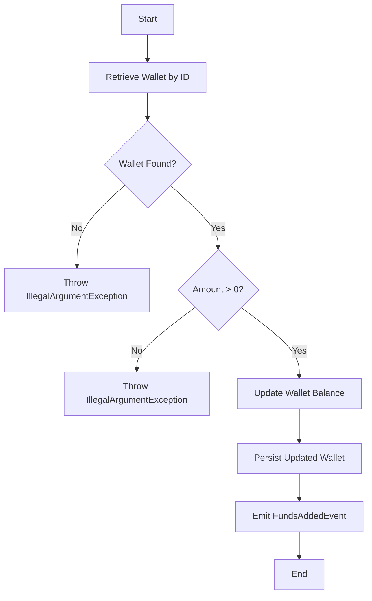
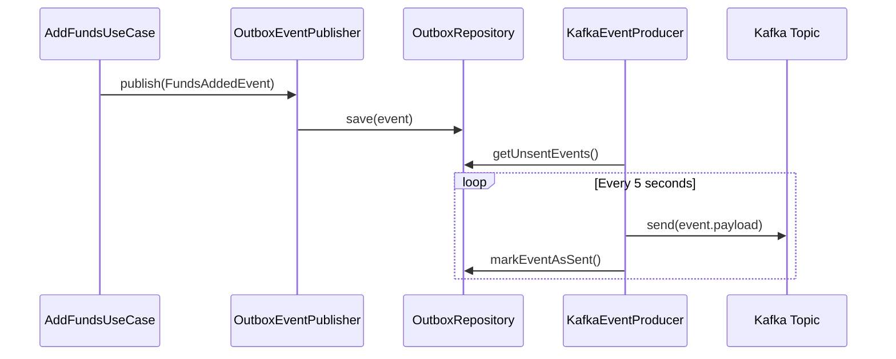
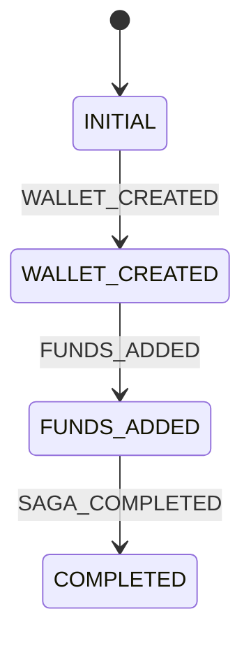

# Add Funds

<cite>
**Referenced Files in This Document**   
- [AddFundsUseCase.java](file://src/main/java/dev/bloco/wallet/hub/usecase/AddFundsUseCase.java)
- [Wallet.java](file://src/main/java/dev/bloco/wallet/hub/domain/model/Wallet.java)
- [FundsAddedEvent.java](file://src/main/java/dev/bloco/wallet/hub/domain/event/wallet/FundsAddedEvent.java)
- [OutboxEventPublisher.java](file://src/main/java/dev/bloco/wallet/hub/infra/adapter/event/OutboxEventPublisher.java)
- [KafkaEventProducer.java](file://src/main/java/dev/bloco/wallet/hub/infra/adapter/event/producer/KafkaEventProducer.java)
- [FundsAddedEventConsumer.java](file://src/main/java/dev/bloco/wallet/hub/infra/adapter/event/consumer/FundsAddedEventConsumer.java)
- [CloudEventUtils.java](file://src/main/java/dev/bloco/wallet/hub/infra/util/CloudEventUtils.java)
- [AddFundsUseCaseTest.java](file://src/test/java/dev/bloco/wallet/hub/usecase/AddFundsUseCaseTest.java)
</cite>

## Table of Contents
1. [Introduction](#introduction)
2. [Core Components](#core-components)
3. [Step-by-Step Flow](#step-by-step-flow)
4. [Event Publishing and Kafka Integration](#event-publishing-and-kafka-integration)
5. [Exception Handling and Validation](#exception-handling-and-validation)
6. [Idempotency and Transactional Integrity](#idempotency-and-transactional-integrity)
7. [Race Condition Mitigation](#race-condition-mitigation)
8. [Downstream Processing with FundsAddedEventConsumer](#downstream-processing-with-fundsaddedeventconsumer)
9. [Real-World Usage Example](#real-world-usage-example)
10. [Conclusion](#conclusion)

## Introduction
The AddFundsUseCase in the bloco-wallet-java application is responsible for managing the business logic associated with increasing a wallet's balance. This use case ensures that funds are added securely and consistently by validating wallet status, ensuring the amount is positive, and maintaining token type consistency. The process involves retrieving the wallet, updating its balance, persisting changes via WalletRepository, and emitting a FundsAddedEvent for downstream processing. This document provides a detailed explanation of the implementation, including transactional integrity, exception handling, idempotency checks, and integration with event-driven components such as KafkaEventProducer and FundsAddedEventConsumer.

## Core Components

The AddFundsUseCase interacts with several core components to execute its functionality. These include the WalletRepository for data persistence, the DomainEventPublisher for event emission, and the Wallet model for business logic encapsulation. The use case also relies on the OutboxEventPublisher and KafkaEventProducer for reliable event delivery to external systems.

**Section sources**
- [AddFundsUseCase.java](file://src/main/java/dev/bloco/wallet/hub/usecase/AddFundsUseCase.java#L1-L59)
- [Wallet.java](file://src/main/java/dev/bloco/wallet/hub/domain/model/Wallet.java#L23-L121)
- [WalletRepository.java](file://src/main/java/dev/bloco/wallet/hub/domain/gateway/WalletRepository.java#L17-L32)

## Step-by-Step Flow

The AddFundsUseCase follows a structured flow to ensure correctness and reliability:

1. **Retrieve Wallet**: The use case retrieves the wallet using its unique identifier from the WalletRepository.
2. **Validate Wallet**: If the wallet does not exist, an IllegalArgumentException is thrown.
3. **Validate Amount**: The amount to be added must be greater than zero; otherwise, an exception is thrown.
4. **Update Balance**: The wallet's balance is updated in-memory using the addFunds method.
5. **Persist Changes**: The updated wallet is persisted back to the database via the update method of WalletRepository.
6. **Emit Event**: A FundsAddedEvent is created and published through the DomainEventPublisher.

This sequence ensures that all operations are performed atomically and consistently.

**Diagram sources**
- [AddFundsUseCase.java](file://src/main/java/dev/bloco/wallet/hub/usecase/AddFundsUseCase.java#L1-L59)
- [Wallet.java](file://src/main/java/dev/bloco/wallet/hub/domain/model/Wallet.java#L95-L101)

## Event Publishing and Kafka Integration

After the wallet balance is updated, the AddFundsUseCase emits a FundsAddedEvent. This event is published using the OutboxEventPublisher, which ensures reliable delivery by storing the event in an outbox table before sending it to Kafka. The KafkaEventProducer processes unsent events from the outbox and sends them to Kafka using the StreamBridge. This mechanism guarantees that events are not lost during system failures.

**Diagram sources**
- [OutboxEventPublisher.java](file://src/main/java/dev/bloco/wallet/hub/infra/adapter/event/OutboxEventPublisher.java#L61-L73)
- [KafkaEventProducer.java](file://src/main/java/dev/bloco/wallet/hub/infra/adapter/event/producer/KafkaEventProducer.java#L144-L150)

## Exception Handling and Validation

The AddFundsUseCase includes robust validation and exception handling to prevent invalid operations. If the wallet is not found, an IllegalArgumentException is thrown with the message "Wallet not found". Similarly, if the amount is not greater than zero, an exception is thrown with the message "Amount must be greater than zero". These validations ensure that only valid operations are performed.

**Section sources**
- [AddFundsUseCase.java](file://src/main/java/dev/bloco/wallet/hub/usecase/AddFundsUseCase.java#L1-L59)
- [AddFundsUseCaseTest.java](file://src/test/java/dev/bloco/wallet/hub/usecase/AddFundsUseCaseTest.java#L61-L100)

## Idempotency and Transactional Integrity

The AddFundsUseCase ensures transactional integrity by using the @Transactional annotation on the publish method of OutboxEventPublisher. This guarantees that the event is either fully persisted or rolled back in case of failure. Additionally, the use of correlation IDs in events enables idempotency checks in downstream consumers, preventing duplicate processing of the same operation.

**Section sources**
- [OutboxEventPublisher.java](file://src/main/java/dev/bloco/wallet/hub/infra/adapter/event/OutboxEventPublisher.java#L61-L73)
- [CloudEventUtils.java](file://src/main/java/dev/bloco/wallet/hub/infra/util/CloudEventUtils.java#L45-L53)

## Race Condition Mitigation

To mitigate race conditions during concurrent deposits, the application relies on database-level locking mechanisms provided by the underlying JPA implementation. The update operation on the wallet entity is atomic, ensuring that concurrent modifications do not result in inconsistent states. Additionally, the use of optimistic concurrency control can be implemented by adding a version field to the WalletEntity if needed.

**Section sources**
- [JpaWalletRepository.java](file://src/main/java/dev/bloco/wallet/hub/infra/provider/data/repository/JpaWalletRepository.java#L87-L91)
- [WalletEntity.java](file://src/main/java/dev/bloco/wallet/hub/infra/provider/data/entity/WalletEntity.java)

## Downstream Processing with FundsAddedEventConsumer

The FundsAddedEventConsumer listens for FundsAddedEvent messages and processes them by transitioning the saga state machine to the FUNDS_ADDED state. This consumer validates the correlation ID and logs the operation. If the correlation ID is missing, the saga is marked as failed. This ensures that the system maintains consistency across distributed operations.

**Diagram sources**
- [FundsAddedEventConsumer.java](file://src/main/java/dev/bloco/wallet/hub/infra/adapter/event/consumer/FundsAddedEventConsumer.java#L61-L78)
- [SagaEvents.java](file://src/main/java/dev/bloco/wallet/hub/infra/provider/data/config/SagaEvents.java)
- [SagaStates.java](file://src/main/java/dev/bloco/wallet/hub/infra/provider/data/config/SagaStates.java)

## Real-World Usage Example

A real-world usage example from the AddFundsUseCaseTest demonstrates the complete flow. When funds are added successfully, the wallet balance is updated, and a FundsAddedEvent is published with the correct wallet ID, amount, and correlation ID. The test verifies that the event is captured and that its properties match the expected values.

**Section sources**
- [AddFundsUseCaseTest.java](file://src/test/java/dev/bloco/wallet/hub/usecase/AddFundsUseCaseTest.java#L22-L59)

## Conclusion

The AddFundsUseCase in bloco-wallet-java provides a robust and reliable mechanism for increasing a wallet's balance. By leveraging domain-driven design principles, transactional integrity, and event-driven architecture, the use case ensures that operations are performed safely and consistently. The integration with Kafka and the use of saga patterns enable scalable and fault-tolerant processing of financial transactions.