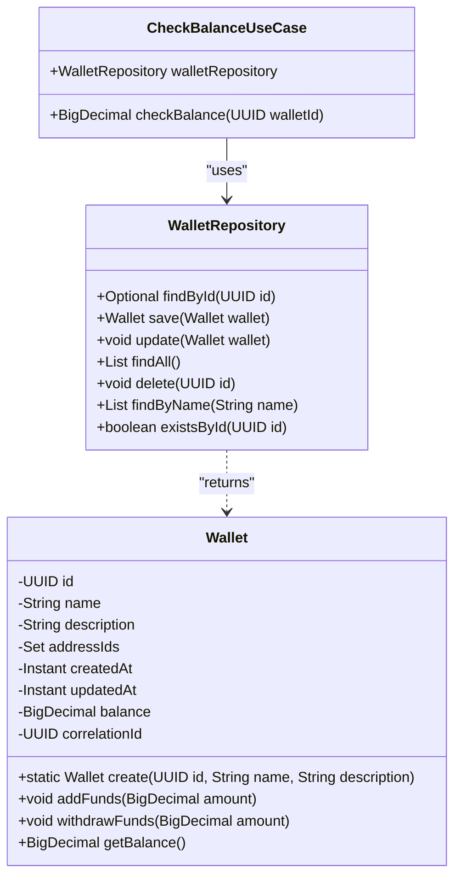
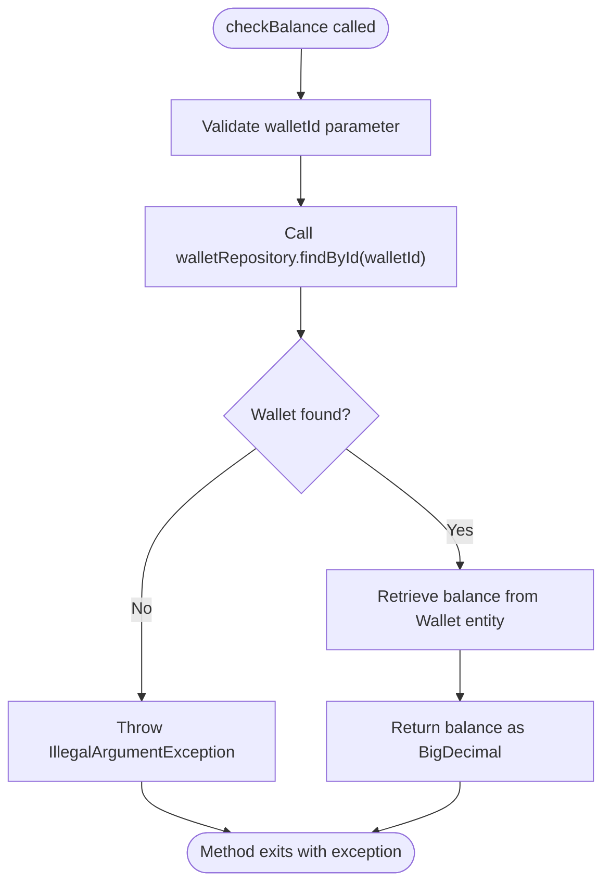
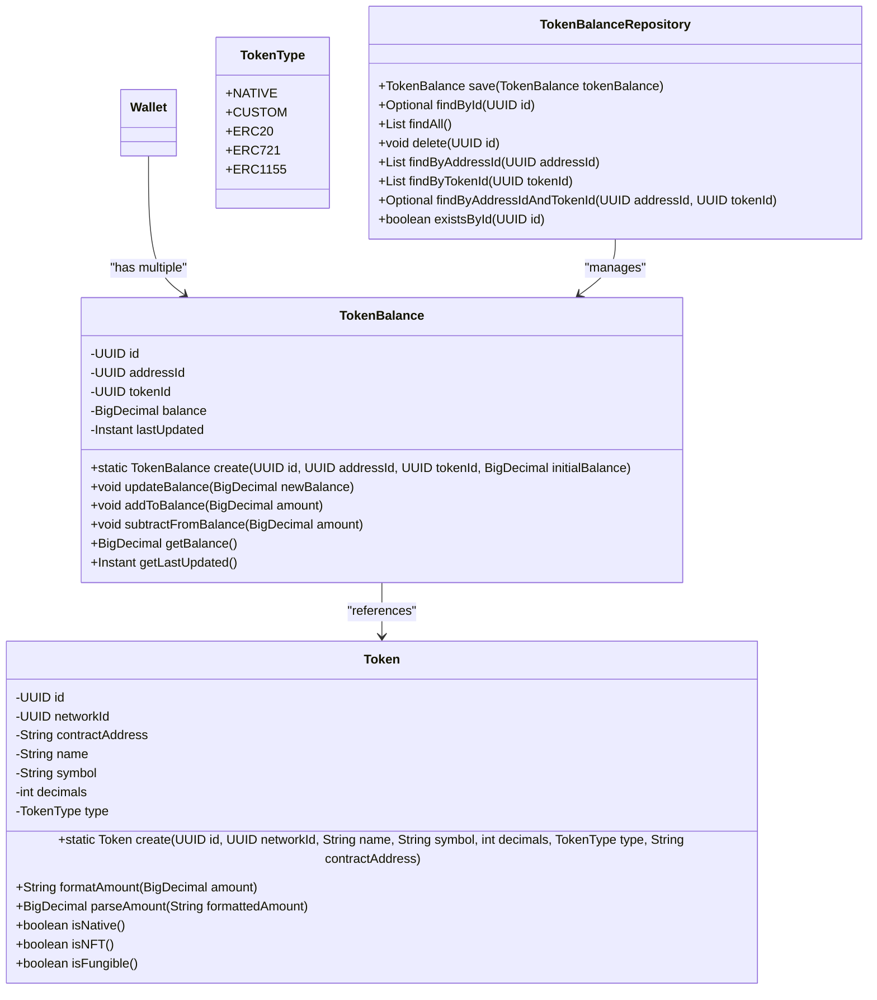
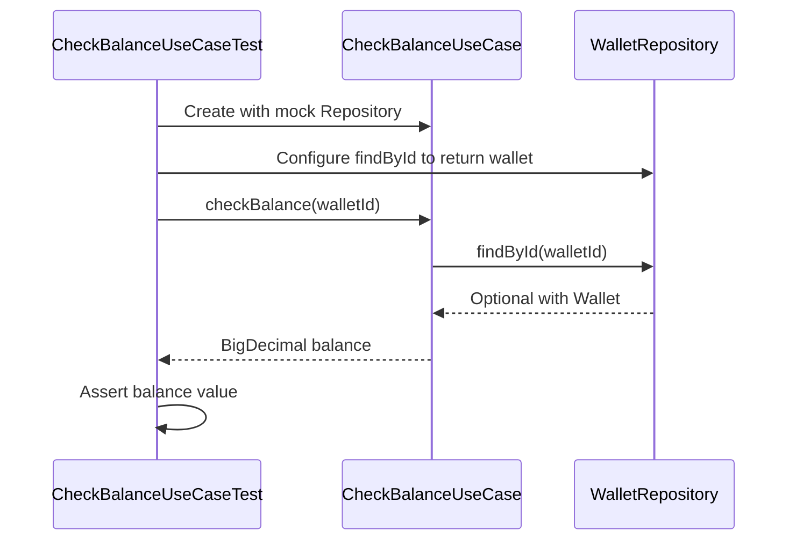

# Check Balance

<cite>
**Referenced Files in This Document**   
- [CheckBalanceUseCase.java](file://src/main/java/dev/bloco/wallet/hub/usecase/CheckBalanceUseCase.java)
- [CheckBalanceUseCaseTest.java](file://src/test/java/dev/bloco/wallet/hub/usecase/CheckBalanceUseCaseTest.java)
- [Wallet.java](file://src/main/java/dev/bloco/wallet/hub/domain/model/Wallet.java)
- [WalletRepository.java](file://src/main/java/dev/bloco/wallet/hub/domain/gateway/WalletRepository.java)
- [JpaWalletRepository.java](file://src/main/java/dev/bloco/wallet/hub/infra/provider/data/repository/JpaWalletRepository.java)
- [TokenBalance.java](file://src/main/java/dev/bloco/wallet/hub/domain/model/token/TokenBalance.java)
- [TokenBalanceRepository.java](file://src/main/java/dev/bloco/wallet/hub/domain/gateway/TokenBalanceRepository.java)
- [UseCaseConfig.java](file://src/main/java/dev/bloco/wallet/hub/config/UseCaseConfig.java)
- [pom.xml](file://pom.xml)
</cite>

## Table of Contents
1. [Introduction](#introduction)
2. [Core Components](#core-components)
3. [Workflow Analysis](#workflow-analysis)
4. [Multi-Token Support and Currency Handling](#multi-token-support-and-currency-handling)
5. [Performance and Caching](#performance-and-caching)
6. [Reactive Programming Integration](#reactive-programming-integration)
7. [Observability with Micrometer](#observability-with-micrometer)
8. [Consistency Models](#consistency-models)
9. [Unit Testing Examples](#unit-testing-examples)
10. [Frontend and API Usage](#frontend-and-api-usage)
11. [Conclusion](#conclusion)

## Introduction
The CheckBalanceUseCase in the bloco-wallet-java application provides a critical functionality for retrieving the current balance of a wallet. This use case serves as the primary interface for balance inquiries within the wallet system, supporting both single and multi-token wallets. The implementation follows domain-driven design principles and integrates with reactive programming patterns to ensure non-blocking operations. The use case is designed to handle various wallet states and provides consistent balance information across the system.

**Section sources**
- [CheckBalanceUseCase.java](file://src/main/java/dev/bloco/wallet/hub/usecase/CheckBalanceUseCase.java)

## Core Components

The CheckBalanceUseCase is implemented as a record-based use case that depends on the WalletRepository interface for data access. The use case follows the single responsibility principle by focusing exclusively on balance retrieval. The Wallet entity contains the balance information as a BigDecimal field, which is updated through domain methods like addFunds and withdrawFunds. The WalletRepository interface defines the contract for wallet persistence operations, including the findById method used by the CheckBalanceUseCase.

**Diagram sources**
- [CheckBalanceUseCase.java](file://src/main/java/dev/bloco/wallet/hub/usecase/CheckBalanceUseCase.java)
- [WalletRepository.java](file://src/main/java/dev/bloco/wallet/hub/domain/gateway/WalletRepository.java)
- [Wallet.java](file://src/main/java/dev/bloco/wallet/hub/domain/model/Wallet.java)

**Section sources**
- [CheckBalanceUseCase.java](file://src/main/java/dev/bloco/wallet/hub/usecase/CheckBalanceUseCase.java)
- [WalletRepository.java](file://src/main/java/dev/bloco/wallet/hub/domain/gateway/WalletRepository.java)
- [Wallet.java](file://src/main/java/dev/bloco/wallet/hub/domain/model/Wallet.java)

## Workflow Analysis

The CheckBalanceUseCase workflow begins with validating the wallet existence by calling the findById method on the WalletRepository. If the wallet is not found, an IllegalArgumentException is thrown with the message "Wallet not found". When the wallet exists, the use case retrieves the current balance from the Wallet entity and returns it as a BigDecimal. The workflow is straightforward and read-only, with no side effects or state changes.

The validation process ensures that only active wallets can have their balance checked, as deleted wallets are not returned by the repository's findById method. The use case does not explicitly check wallet status, relying on the repository implementation to handle inactive or deleted wallets by not returning them in the findById operation.

**Diagram sources**
- [CheckBalanceUseCase.java](file://src/main/java/dev/bloco/wallet/hub/usecase/CheckBalanceUseCase.java)
- [JpaWalletRepository.java](file://src/main/java/dev/bloco/wallet/hub/infra/provider/data/repository/JpaWalletRepository.java)

**Section sources**
- [CheckBalanceUseCase.java](file://src/main/java/dev/bloco/wallet/hub/usecase/CheckBalanceUseCase.java)
- [JpaWalletRepository.java](file://src/main/java/dev/bloco/wallet/hub/infra/provider/data/repository/JpaWalletRepository.java)

## Multi-Token Support and Currency Handling

While the current implementation of CheckBalanceUseCase focuses on the primary wallet balance, the system architecture supports multiple token types through the TokenBalance entity and TokenBalanceRepository. The Wallet entity can contain multiple addresses, each potentially associated with different tokens. The TokenBalance entity tracks balances for specific tokens on specific addresses, enabling support for multiple token types.

Currency conversion is not currently implemented in the CheckBalanceUseCase, but the architecture allows for future extension. The Token entity includes fields for name, symbol, and decimals, which are essential for currency conversion calculations. The system could be extended to provide converted balances by integrating with external exchange rate services and implementing conversion logic in a dedicated service.

**Diagram sources**
- [TokenBalance.java](file://src/main/java/dev/bloco/wallet/hub/domain/model/token/TokenBalance.java)
- [TokenBalanceRepository.java](file://src/main/java/dev/bloco/wallet/hub/domain/gateway/TokenBalanceRepository.java)
- [Token.java](file://src/main/java/dev/bloco/wallet/hub/domain/model/token/Token.java)
- [TokenType.java](file://src/main/java/dev/bloco/wallet/hub/domain/model/token/TokenType.java)

**Section sources**
- [TokenBalance.java](file://src/main/java/dev/bloco/wallet/hub/domain/model/token/TokenBalance.java)
- [TokenBalanceRepository.java](file://src/main/java/dev/bloco/wallet/hub/domain/gateway/TokenBalanceRepository.java)
- [Token.java](file://src/main/java/dev/bloco/wallet/hub/domain/model/token/Token.java)

## Performance and Caching

The CheckBalanceUseCase implementation does not include explicit caching mechanisms, relying on the underlying repository and database layer for performance optimization. However, the system is configured with reactive data access dependencies that support non-blocking operations and potential caching at the infrastructure level.

The pom.xml file includes dependencies for reactive data access, including spring-boot-starter-data-mongodb-reactive, spring-boot-starter-data-r2dbc, and spring-boot-starter-data-redis-reactive, which enable reactive programming patterns and potential caching with Redis. These dependencies suggest that the system is designed for high-performance, non-blocking operations that can scale to handle many concurrent balance queries.

While no explicit caching is implemented in the CheckBalanceUseCase, the reactive data access patterns and potential Redis integration provide a foundation for implementing caching strategies to improve performance for frequently accessed wallet balances.

**Section sources**
- [pom.xml](file://pom.xml)
- [CheckBalanceUseCase.java](file://src/main/java/dev/bloco/wallet/hub/usecase/CheckBalanceUseCase.java)

## Reactive Programming Integration

The bloco-wallet-java application integrates reactive programming through the use of Spring WebFlux and reactive data access dependencies. While the CheckBalanceUseCase itself is implemented synchronously, the system infrastructure supports reactive programming patterns that enable non-blocking responses.

The presence of reactor-core dependencies and reactive data access starters in the pom.xml file indicates that the application is designed for reactive programming. The event consumers in the system, such as FundsAddedEventConsumer, use Reactor's Mono type for handling asynchronous operations, demonstrating the application of reactive patterns in event processing.

The CheckBalanceUseCase could be enhanced to support reactive programming by returning reactive types like Mono<BigDecimal> instead of a direct BigDecimal value. This would allow the use case to integrate seamlessly with reactive controllers and provide non-blocking responses to API clients.

**Section sources**
- [pom.xml](file://pom.xml)
- [FundsAddedEventConsumer.java](file://src/main/java/dev/bloco/wallet/hub/infra/adapter/event/consumer/FundsAddedEventConsumer.java)

## Observability with Micrometer

The application includes spring-boot-starter-actuator in its dependencies, which provides built-in support for observability with Micrometer. The actuator starter enables monitoring endpoints that can track application metrics, health, and performance.

While the CheckBalanceUseCase does not contain explicit instrumentation code, the use of Spring Boot Actuator provides out-of-the-box observability features. The actuator endpoints can monitor the health of the application, track HTTP request metrics, and expose system information that can be used for monitoring and troubleshooting.

The combination of Spring Boot Actuator and the reactive programming model enables comprehensive observability of the application's performance, including the CheckBalanceUseCase operations. Metrics such as request rates, response times, and error rates can be collected and monitored to ensure the reliability and performance of balance retrieval operations.

**Section sources**
- [pom.xml](file://pom.xml)

## Consistency Models

The bloco-wallet-java application appears to follow an eventual consistency model due to its event-driven architecture. The system uses domain events like FundsAddedEvent, FundsWithdrawnEvent, and FundsTransferredEvent to communicate changes across the system. These events are published when balance changes occur and are processed by event consumers to update the system state.

The CheckBalanceUseCase reads directly from the wallet repository, which suggests strong consistency for the primary wallet balance. However, for multi-token balances that may be updated through event processing, the system likely exhibits eventual consistency. When a balance update occurs, the change is first applied to the wallet, and then an event is published to update other components. This means that there may be a brief period where the primary balance is updated but related token balances or external systems have not yet been updated.

The event-driven architecture with saga patterns (evident from the SagaEvents and SagaStates classes) supports distributed transactions and ensures consistency across multiple operations. The state machine-based saga implementation helps maintain consistency even in the presence of failures or partial updates.

**Section sources**
- [CheckBalanceUseCase.java](file://src/main/java/dev/bloco/wallet/hub/usecase/CheckBalanceUseCase.java)
- [FundsAddedEventConsumer.java](file://src/main/java/dev/bloco/wallet/hub/infra/adapter/event/consumer/FundsAddedEventConsumer.java)
- [SagaEvents.java](file://src/main/java/dev/bloco/wallet/hub/infra/provider/data/config/SagaEvents.java)
- [SagaStates.java](file://src/main/java/dev/bloco/wallet/hub/infra/provider/data/config/SagaStates.java)

## Unit Testing Examples

The CheckBalanceUseCase is thoroughly tested with unit tests that verify both successful balance retrieval and error handling for non-existent wallets. The tests use Mockito to mock the WalletRepository dependency, allowing isolated testing of the use case logic.

The test suite includes two primary test cases: one that verifies successful balance retrieval when a wallet exists, and another that confirms proper error handling when a wallet is not found. The successful test case creates a wallet with a specific balance, configures the mock repository to return this wallet, and verifies that the checkBalance method returns the expected balance value.

The error handling test confirms that an IllegalArgumentException is thrown with the message "Wallet not found" when the repository returns an empty Optional. Both tests verify that the repository's findById method is called exactly once with the expected wallet ID, ensuring proper interaction with the dependency.

**Diagram sources**
- [CheckBalanceUseCaseTest.java](file://src/test/java/dev/bloco/wallet/hub/usecase/CheckBalanceUseCaseTest.java)
- [CheckBalanceUseCase.java](file://src/main/java/dev/bloco/wallet/hub/usecase/CheckBalanceUseCase.java)

**Section sources**
- [CheckBalanceUseCaseTest.java](file://src/test/java/dev/bloco/wallet/hub/usecase/CheckBalanceUseCaseTest.java)

## Frontend and API Usage

The CheckBalanceUseCase is designed to support real-time balance display in frontend applications and API clients. While the specific API controllers are not included in the provided code, the use case is structured to be easily integrated into REST or reactive endpoints.

Frontend applications would typically call an API endpoint that wraps the CheckBalanceUseCase to retrieve the current wallet balance for display in the user interface. The balance information would be used to update the UI in real-time, providing users with immediate feedback on their wallet status after transactions.

The use case's simple interface and read-only nature make it well-suited for frequent polling or subscription-based updates in frontend applications. Combined with the reactive programming support in the application, the balance retrieval could be implemented as a streaming endpoint that pushes updates to clients when the balance changes.

**Section sources**
- [CheckBalanceUseCase.java](file://src/main/java/dev/bloco/wallet/hub/usecase/CheckBalanceUseCase.java)

## Conclusion

The CheckBalanceUseCase in bloco-wallet-java provides a reliable and efficient mechanism for retrieving wallet balances. The implementation follows clean architecture principles with a clear separation of concerns between use cases, domain models, and data access layers. While currently focused on the primary wallet balance, the architecture supports extension to multi-token balances and currency conversion.

The use case integrates well with the application's event-driven architecture and reactive programming model, providing a foundation for high-performance, scalable balance retrieval. With the addition of explicit caching and reactive return types, the use case could further improve performance and responsiveness for real-time balance display in frontend applications.

The comprehensive unit testing and clear error handling make the CheckBalanceUseCase a robust component of the wallet system, ensuring reliable balance information for users and downstream services.