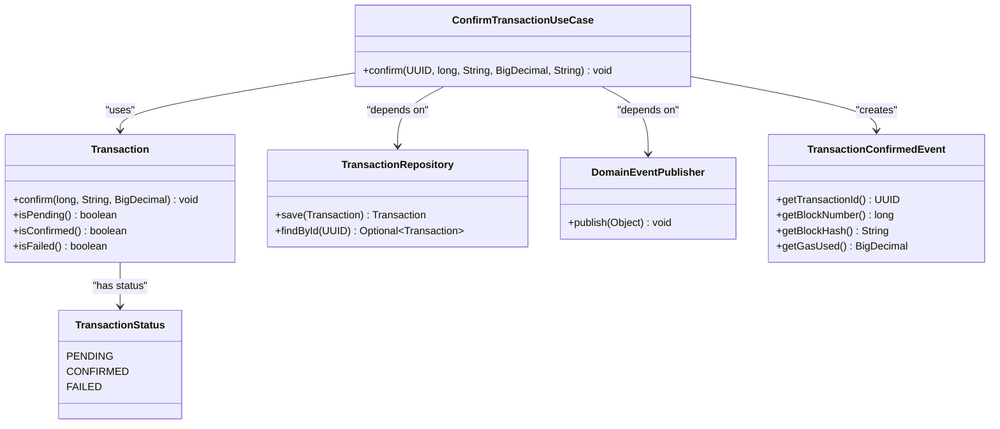
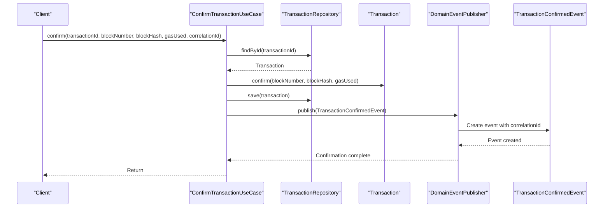
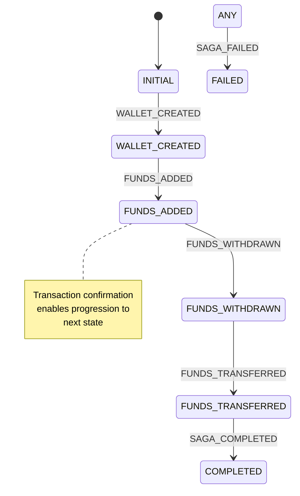
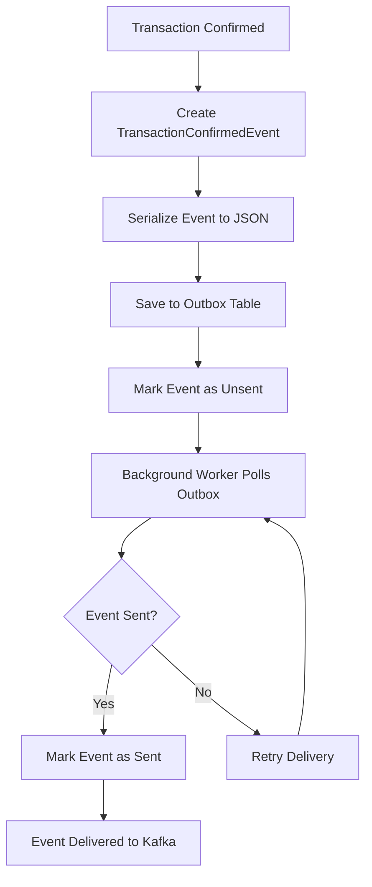
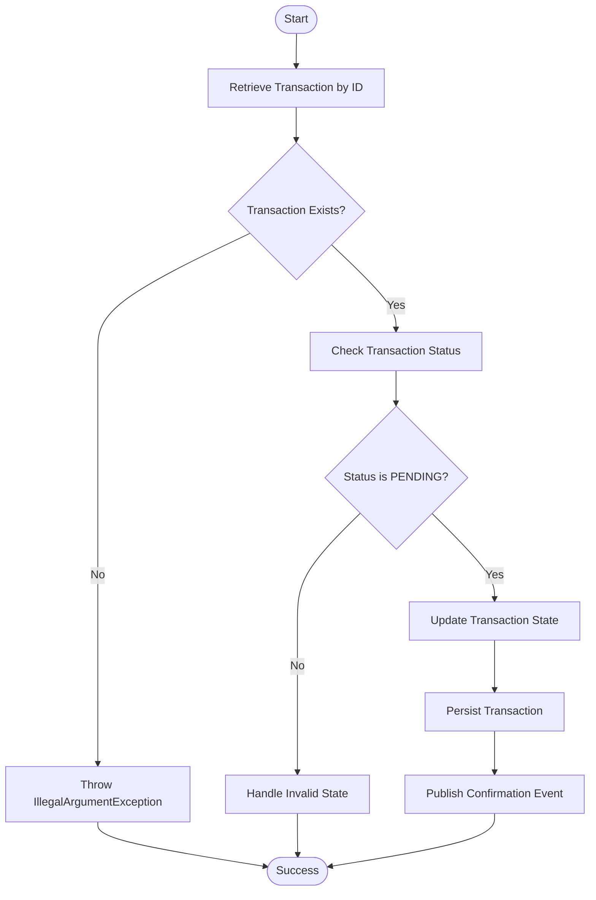
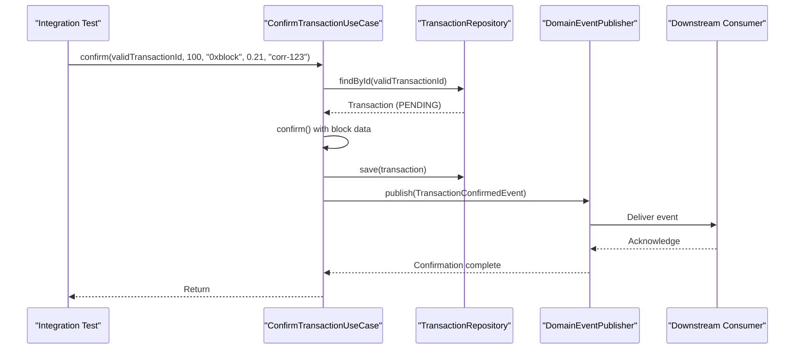

# Confirm Transaction

<cite>
**Referenced Files in This Document**   
- [ConfirmTransactionUseCase.java](file://src/main/java/dev/bloco/wallet/hub/usecase/ConfirmTransactionUseCase.java)
- [Transaction.java](file://src/main/java/dev/bloco/wallet/hub/domain/model/transaction/Transaction.java)
- [TransactionStatus.java](file://src/main/java/dev/bloco/wallet/hub/domain/model/transaction/TransactionStatus.java)
- [TransactionConfirmedEvent.java](file://src/main/java/dev/bloco/wallet/hub/domain/event/transaction/TransactionConfirmedEvent.java)
- [OutboxEventPublisher.java](file://src/main/java/dev/bloco/wallet/hub/infra/adapter/event/OutboxEventPublisher.java)
- [CloudEventUtils.java](file://src/main/java/dev/bloco/wallet/hub/infra/util/CloudEventUtils.java)
- [SagaStateMachineConfig.java](file://src/main/java/dev/bloco/wallet/hub/infra/provider/data/config/SagaStateMachineConfig.java)
- [TransactionTest.java](file://src/test/java/dev/bloco/wallet/hub/domain/TransactionTest.java)
</cite>

## Table of Contents
1. [Introduction](#introduction)
2. [Core Components](#core-components)
3. [Confirm Transaction Flow](#confirm-transaction-flow)
4. [Saga State Machine Integration](#saga-state-machine-integration)
5. [Event Publishing and Reliability](#event-publishing-and-reliability)
6. [Idempotency and Error Handling](#idempotency-and-error-handling)
7. [Security Considerations](#security-considerations)
8. [Usage Example](#usage-example)
9. [Conclusion](#conclusion)

## Introduction
The ConfirmTransactionUseCase is a critical component in the bloco-wallet-java application responsible for finalizing the state of a blockchain transaction. This use case transitions a transaction from PENDING to CONFIRMED status upon successful inclusion in a blockchain block. It orchestrates validation, state persistence, event publishing, and integration with the saga state machine to advance workflow states. The implementation ensures reliable processing through transactional boundaries and outbox pattern for event delivery.

## Core Components

The ConfirmTransactionUseCase interacts with several key components to fulfill its responsibilities. These include the Transaction entity for state management, TransactionRepository for persistence, DomainEventPublisher for event dissemination, and integration with the saga state machine for workflow orchestration.

**Diagram sources**
- [ConfirmTransactionUseCase.java](file://src/main/java/dev/bloco/wallet/hub/usecase/ConfirmTransactionUseCase.java)
- [Transaction.java](file://src/main/java/dev/bloco/wallet/hub/domain/model/transaction/Transaction.java)
- [TransactionStatus.java](file://src/main/java/dev/bloco/wallet/hub/domain/model/transaction/TransactionStatus.java)
- [TransactionConfirmedEvent.java](file://src/main/java/dev/bloco/wallet/hub/domain/event/transaction/TransactionConfirmedEvent.java)

**Section sources**
- [ConfirmTransactionUseCase.java](file://src/main/java/dev/bloco/wallet/hub/usecase/ConfirmTransactionUseCase.java#L1-L38)
- [Transaction.java](file://src/main/java/dev/bloco/wallet/hub/domain/model/transaction/Transaction.java#L1-L210)

## Confirm Transaction Flow

The confirmation process follows a well-defined sequence of operations to ensure data consistency and reliability. The flow begins with retrieving the transaction from the repository, validating its pending status, updating its state with blockchain confirmation details, persisting the changes, and publishing a confirmation event.

**Diagram sources**
- [ConfirmTransactionUseCase.java](file://src/main/java/dev/bloco/wallet/hub/usecase/ConfirmTransactionUseCase.java#L15-L38)
- [Transaction.java](file://src/main/java/dev/bloco/wallet/hub/domain/model/transaction/Transaction.java#L145-L156)

**Section sources**
- [ConfirmTransactionUseCase.java](file://src/main/java/dev/bloco/wallet/hub/usecase/ConfirmTransactionUseCase.java#L15-L38)
- [Transaction.java](file://src/main/java/dev/bloco/wallet/hub/domain/model/transaction/Transaction.java#L145-L156)

## Saga State Machine Integration

The transaction confirmation process integrates with a saga state machine to coordinate complex workflows across distributed components. The state machine manages the progression of wallet operations through various states, with transaction confirmation serving as a key transition point that enables subsequent actions in the workflow.

**Diagram sources**
- [SagaStateMachineConfig.java](file://src/main/java/dev/bloco/wallet/hub/infra/provider/data/config/SagaStateMachineConfig.java#L28-L117)

**Section sources**
- [SagaStateMachineConfig.java](file://src/main/java/dev/bloco/wallet/hub/infra/provider/data/config/SagaStateMachineConfig.java#L28-L117)

## Event Publishing and Reliability

The system employs a reliable event publishing mechanism using the outbox pattern to ensure that transaction confirmation events are delivered even in the face of system failures. The OutboxEventPublisher persists events transactionally with the state change, and a background process handles their delivery to Kafka.

**Diagram sources**
- [OutboxEventPublisher.java](file://src/main/java/dev/bloco/wallet/hub/infra/adapter/event/OutboxEventPublisher.java#L30-L74)
- [CloudEventUtils.java](file://src/main/java/dev/bloco/wallet/hub/infra/util/CloudEventUtils.java#L11-L54)

**Section sources**
- [OutboxEventPublisher.java](file://src/main/java/dev/bloco/wallet/hub/infra/adapter/event/OutboxEventPublisher.java#L30-L74)
- [CloudEventUtils.java](file://src/main/java/dev/bloco/wallet/hub/infra/util/CloudEventUtils.java#L11-L54)

## Idempotency and Error Handling

The ConfirmTransactionUseCase implements robust error handling and idempotency guarantees to prevent duplicate processing and maintain system consistency. When a transaction is already confirmed, the use case will throw an exception to prevent state corruption.

**Diagram sources**
- [ConfirmTransactionUseCase.java](file://src/main/java/dev/bloco/wallet/hub/usecase/ConfirmTransactionUseCase.java#L15-L38)
- [Transaction.java](file://src/main/java/dev/bloco/wallet/hub/domain/model/transaction/Transaction.java#L145-L156)

**Section sources**
- [ConfirmTransactionUseCase.java](file://src/main/java/dev/bloco/wallet/hub/usecase/ConfirmTransactionUseCase.java#L15-L38)
- [Transaction.java](file://src/main/java/dev/bloco/wallet/hub/domain/model/transaction/Transaction.java#L145-L156)

## Security Considerations

The implementation addresses several security concerns including replay attacks, authorization checks, and data integrity. The use of correlation IDs helps track operations across distributed systems and prevent replay attacks by ensuring each transaction confirmation is uniquely identifiable.

**Key Security Measures:**
- **Correlation ID Validation**: Each operation includes a correlation ID to trace the request flow and prevent replay attacks
- **State Validation**: Transactions can only be confirmed if they are in PENDING state
- **Immutable Fields**: Once confirmed, critical transaction fields cannot be modified
- **Authorization**: The use case should be invoked only by authorized components with access to blockchain verification

**Section sources**
- [ConfirmTransactionUseCase.java](file://src/main/java/dev/bloco/wallet/hub/usecase/ConfirmTransactionUseCase.java#L15-L38)
- [Transaction.java](file://src/main/java/dev/bloco/wallet/hub/domain/model/transaction/Transaction.java#L145-L156)

## Usage Example

The following example demonstrates how the ConfirmTransactionUseCase is used in practice, showing the state transition from PENDING to CONFIRMED and the subsequent event processing by downstream consumers.

**Diagram sources**
- [TransactionTest.java](file://src/test/java/dev/bloco/wallet/hub/domain/TransactionTest.java#L32-L67)

**Section sources**
- [TransactionTest.java](file://src/test/java/dev/bloco/wallet/hub/domain/TransactionTest.java#L32-L67)

## Conclusion

The ConfirmTransactionUseCase plays a vital role in the bloco-wallet-java application by finalizing transaction states and enabling downstream processing. Its implementation follows sound architectural principles including separation of concerns, transactional integrity, and reliable event delivery. By integrating with the saga state machine and employing the outbox pattern, the use case ensures that transaction confirmations are processed reliably and consistently, even in distributed environments. The design considerations around idempotency, error handling, and security make it a robust component for handling critical blockchain transaction workflows.