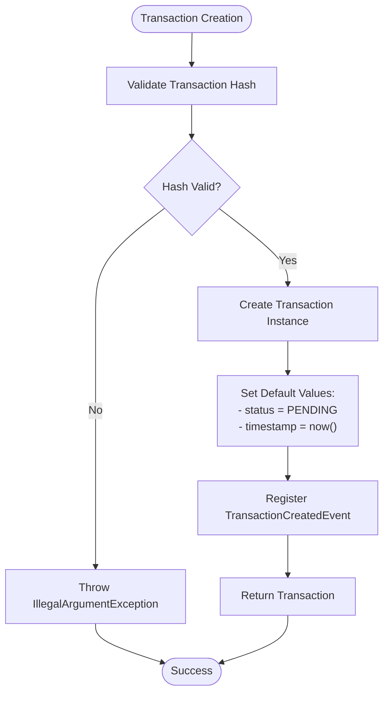

# Create Transaction

<cite>
**Referenced Files in This Document**   
- [CreateTransactionUseCase.java](file://src/main/java/dev/bloco/wallet/hub/usecase/CreateTransactionUseCase.java)
- [Transaction.java](file://src/main/java/dev/bloco/wallet/hub/domain/model/transaction/Transaction.java)
- [TransactionCreatedEvent.java](file://src/main/java/dev/bloco/wallet/hub/domain/event/transaction/TransactionCreatedEvent.java)
- [OutboxEventPublisher.java](file://src/main/java/dev/bloco/wallet/hub/infra/adapter/event/OutboxEventPublisher.java)
- [OutboxEvent.java](file://src/main/java/dev/bloco/wallet/hub/infra/provider/data/OutboxEvent.java)
- [OutboxRepository.java](file://src/main/java/dev/bloco/wallet/hub/infra/provider/data/repository/OutboxRepository.java)
- [TransactionRepository.java](file://src/main/java/dev/bloco/wallet/hub/domain/gateway/TransactionRepository.java)
- [TransactionTest.java](file://src/test/java/dev/bloco/wallet/hub/domain/TransactionTest.java)
</cite>

## Table of Contents
1. [Introduction](#introduction)
2. [Core Components](#core-components)
3. [Transaction Creation Flow](#transaction-creation-flow)
4. [Input Validation and Default Field Assignment](#input-validation-and-default-field-assignment)
5. [Outbox Pattern Integration](#outbox-pattern-integration)
6. [Event Publishing and Kafka Integration](#event-publishing-and-kafka-integration)
7. [Idempotency and Deduplication](#idempotency-and-deduplication)
8. [Real-World Example from Test Cases](#real-world-example-from-test-cases)
9. [Conclusion](#conclusion)

## Introduction
The `CreateTransactionUseCase` in the bloco-wallet-java application is responsible for initializing and persisting new blockchain transactions within the system. This use case ensures that transactions are created with proper validation of sender and receiver addresses, transaction amount, and network context. It follows domain-driven design principles by encapsulating business logic within domain entities and leveraging domain events to communicate state changes. The process involves creating a transaction with a default PENDING status, persisting it via the `TransactionRepository`, and publishing a `TransactionCreatedEvent` through an outbox pattern to ensure reliable message delivery. This document details the full implementation, integration points, and guarantees provided by this use case.

## Core Components

This section outlines the key components involved in the transaction creation process.


**Diagram sources**
- [Transaction.java](file://src/main/java/dev/bloco/wallet/hub/domain/model/transaction/Transaction.java#L20-L210)
- [TransactionCreatedEvent.java](file://src/main/java/dev/bloco/wallet/hub/domain/event/transaction/TransactionCreatedEvent.java#L6-L42)
- [CreateTransactionUseCase.java](file://src/main/java/dev/bloco/wallet/hub/usecase/CreateTransactionUseCase.java#L18-L44)
- [OutboxEventPublisher.java](file://src/main/java/dev/bloco/wallet/hub/infra/adapter/event/OutboxEventPublisher.java#L30-L74)
- [OutboxEvent.java](file://src/main/java/dev/bloco/wallet/hub/infra/provider/data/OutboxEvent.java#L41-L85)

**Section sources**
- [CreateTransactionUseCase.java](file://src/main/java/dev/bloco/wallet/hub/usecase/CreateTransactionUseCase.java#L0-L44)
- [Transaction.java](file://src/main/java/dev/bloco/wallet/hub/domain/model/transaction/Transaction.java#L20-L210)

## Transaction Creation Flow

The `CreateTransactionUseCase` orchestrates the creation of a new transaction through a well-defined sequence of steps:

1. A new transaction ID is generated using `UUID.randomUUID()`.
2. A `Transaction` object is instantiated via the static `create()` method, which initializes the transaction with the provided parameters including network ID, hash, sender and receiver addresses, value, and optional data payload.
3. During instantiation, the transaction's status is automatically set to `PENDING`, and its timestamp is set to the current time.
4. The transaction is persisted to the database using the `TransactionRepository.save()` method.
5. A `TransactionCreatedEvent` is constructed with relevant metadata and published via the `DomainEventPublisher`.
6. The event is captured by the `OutboxEventPublisher`, serialized into JSON, and stored in the outbox table for eventual processing.

This flow ensures atomicity between the database write and event publication through transactional boundaries.


**Diagram sources**
- [CreateTransactionUseCase.java](file://src/main/java/dev/bloco/wallet/hub/usecase/CreateTransactionUseCase.java#L18-L44)
- [Transaction.java](file://src/main/java/dev/bloco/wallet/hub/domain/model/transaction/Transaction.java#L49-L63)
- [TransactionRepository.java](file://src/main/java/dev/bloco/wallet/hub/domain/gateway/TransactionRepository.java#L29-L29)
- [OutboxEventPublisher.java](file://src/main/java/dev/bloco/wallet/hub/infra/adapter/event/OutboxEventPublisher.java#L61-L73)

**Section sources**
- [CreateTransactionUseCase.java](file://src/main/java/dev/bloco/wallet/hub/usecase/CreateTransactionUseCase.java#L18-L44)

## Input Validation and Default Field Assignment

The system performs validation and default field assignment at multiple levels to ensure data integrity.

### Transaction Hash Validation
The `TransactionHash` value object enforces non-null and non-blank validation upon construction:
```java
private void validateHash(String value) {
    if (value == null || value.isBlank()) {
        throw new IllegalArgumentException("Transaction hash cannot be null or blank");
    }
}
```

### Default Field Assignment
When a transaction is created using the `Transaction.create()` method, several fields are automatically assigned:
- **ID**: Provided as input parameter
- **Timestamp**: Set to `Instant.now()` during construction
- **Status**: Initialized to `TransactionStatus.PENDING`
- **Event Registration**: A `TransactionCreatedEvent` is automatically registered

The constructor ensures all required fields are properly initialized and status is set before returning the instance.



**Diagram sources**
- [TransactionHash.java](file://src/main/java/dev/bloco/wallet/hub/domain/model/transaction/TransactionHash.java#L10-L18)
- [Transaction.java](file://src/main/java/dev/bloco/wallet/hub/domain/model/transaction/Transaction.java#L107-L125)

**Section sources**
- [Transaction.java](file://src/main/java/dev/bloco/wallet/hub/domain/model/transaction/Transaction.java#L49-L63)
- [TransactionHash.java](file://src/main/java/dev/bloco/wallet/hub/domain/model/transaction/TransactionHash.java#L10-L18)

## Outbox Pattern Integration

The application implements the outbox pattern to ensure atomicity between database operations and message publishing. This prevents data inconsistency in case of system failures.

### Outbox Event Structure
The `OutboxEvent` entity contains:
- **eventType**: Class name of the event (e.g., "TransactionCreatedEvent")
- **payload**: JSON-serialized event data
- **correlationId**: Optional ID for tracing related operations
- **createdAt**: Timestamp of event creation
- **sent**: Flag indicating whether the event has been processed

### Transactional Guarantee
The `OutboxEventPublisher.publish()` method is annotated with `@Transactional`, ensuring that both the domain event publication and the persistence of the `OutboxEvent` occur within the same database transaction:

```java
@Override
@Transactional
public void publish(Object event) {
    try {
        OutboxEvent outboxEvent = new OutboxEvent();
        outboxEvent.setEventType(event.getClass().getSimpleName());
        outboxEvent.setPayload(objectMapper.writeValueAsString(event));
        outboxRepository.save(outboxEvent);
    } catch (JsonProcessingException e) {
        log.error("Failed to serialize event", e);
        throw new RuntimeException("Failed to serialize event", e);
    }
}
```

If either the transaction save or outbox event persistence fails, the entire transaction is rolled back, maintaining consistency.


**Diagram sources**
- [OutboxEventPublisher.java](file://src/main/java/dev/bloco/wallet/hub/infra/adapter/event/OutboxEventPublisher.java#L61-L73)
- [OutboxEvent.java](file://src/main/java/dev/bloco/wallet/hub/infra/provider/data/OutboxEvent.java#L41-L85)
- [OutboxRepository.java](file://src/main/java/dev/bloco/wallet/hub/infra/provider/data/repository/OutboxRepository.java#L15-L15)

**Section sources**
- [OutboxEventPublisher.java](file://src/main/java/dev/bloco/wallet/hub/infra/adapter/event/OutboxEventPublisher.java#L30-L74)

## Event Publishing and Kafka Integration

After a transaction is successfully created and persisted, a `TransactionCreatedEvent` is published to notify downstream systems.

### Event Structure
The `TransactionCreatedEvent` contains essential transaction metadata:
- **transactionId**: Unique identifier of the transaction
- **networkId**: Network where the transaction occurs
- **transactionHash**: Blockchain transaction hash
- **fromAddress**: Sender's blockchain address
- **toAddress**: Recipient's blockchain address
- **correlationId**: Optional ID for operation tracing

### Kafka Consumer Processing
Kafka consumers subscribe to the event stream and trigger various processing pipelines:
- Balance update services can adjust wallet balances based on transaction data
- Notification systems can alert users about incoming or outgoing transactions
- Analytics platforms can record transaction metrics
- Audit systems can log transaction details for compliance

The event-driven architecture enables loose coupling between the transaction creation service and downstream processors, allowing independent scaling and evolution of components.


**Diagram sources**
- [TransactionCreatedEvent.java](file://src/main/java/dev/bloco/wallet/hub/domain/event/transaction/TransactionCreatedEvent.java#L6-L42)
- [OutboxEventPublisher.java](file://src/main/java/dev/bloco/wallet/hub/infra/adapter/event/OutboxEventPublisher.java#L61-L73)

**Section sources**
- [TransactionCreatedEvent.java](file://src/main/java/dev/bloco/wallet/hub/domain/event/transaction/TransactionCreatedEvent.java#L6-L42)

## Idempotency and Deduplication

The system incorporates idempotency mechanisms to prevent duplicate transaction processing.

### Unique Transaction ID
Each transaction is assigned a unique UUID during creation, serving as a primary deduplication key. The repository likely enforces uniqueness constraints on transaction ID and hash to prevent duplicates.

### Correlation ID Support
The `CreateTransactionUseCase` accepts an optional `correlationId` parameter that can be used by clients to ensure idempotent retries. This ID is propagated through the `TransactionCreatedEvent` and can be used by downstream services to detect and reject duplicate processing attempts.

### Outbox Processing Guarantees
The outbox pattern combined with periodic polling by an `OutboxWorker` ensures at-least-once delivery semantics. Downstream consumers must implement idempotent processing logic, typically by tracking processed event IDs or using the transaction ID as a deduplication key.

## Real-World Example from Test Cases

The `TransactionTest` class provides a real-world example of transaction creation and validation:

```java
@Test
@DisplayName("create should set fields and generate non-null id and timestamp in range with PENDING status")
void create_setsFields_andGeneratesIdAndTimestamp() {
    UUID id = UUID.randomUUID();
    UUID networkId = UUID.randomUUID();
    TransactionHash hash = new TransactionHash("0xabc");
    String from = "0xfrom";
    String to = "0xto";
    BigDecimal value = new BigDecimal("123.45");
    String data = "0xdata";

    Instant before = Instant.now();
    Transaction tx = Transaction.create(id, networkId, hash, from, to, value, data);
    Instant after = Instant.now();

    assertThat(tx.getId()).isEqualTo(id);
    assertThat(tx.getNetworkId()).isEqualTo(networkId);
    assertThat(tx.getHash()).isEqualTo("0xabc");
    assertThat(tx.getFromAddress()).isEqualTo(from);
    assertThat(tx.getToAddress()).isEqualTo(to);
    assertThat(tx.getValue()).isEqualByComparingTo("123.45");
    assertThat(tx.getData()).isEqualTo(data);
    assertThat(tx.getTimestamp()).isNotNull();
    assertThat(!tx.getTimestamp().isBefore(before) && !tx.getTimestamp().isAfter(after)).isTrue();
    assertThat(tx.getStatus()).isEqualTo(TransactionStatus.PENDING);
}
```

This test verifies that:
- All provided fields are correctly set
- Timestamp is generated within an expected time range
- Status is initialized to PENDING
- The transaction creation process completes successfully

The test demonstrates the expected behavior and serves as documentation for correct usage.

**Section sources**
- [TransactionTest.java](file://src/test/java/dev/bloco/wallet/hub/domain/TransactionTest.java#L32-L67)

## Conclusion

The `CreateTransactionUseCase` in bloco-wallet-java provides a robust mechanism for creating blockchain transactions with strong consistency guarantees. By leveraging domain-driven design principles, the system encapsulates business logic within the `Transaction` aggregate root and uses domain events to communicate state changes. The integration of the outbox pattern ensures reliable event publication, maintaining atomicity between database writes and message queuing. Input validation, default field assignment, and idempotency mechanisms work together to ensure data integrity and prevent duplicate processing. The event-driven architecture enables scalable and loosely coupled downstream processing through Kafka consumers, making the system suitable for high-throughput financial applications.