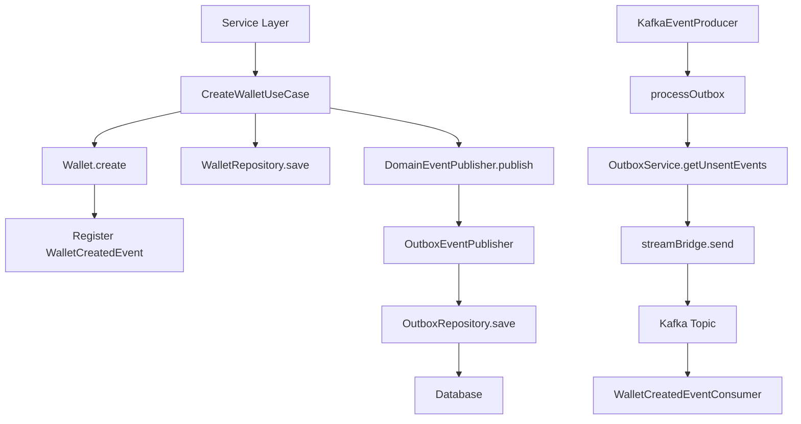
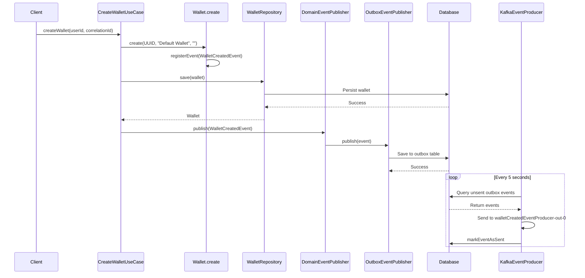
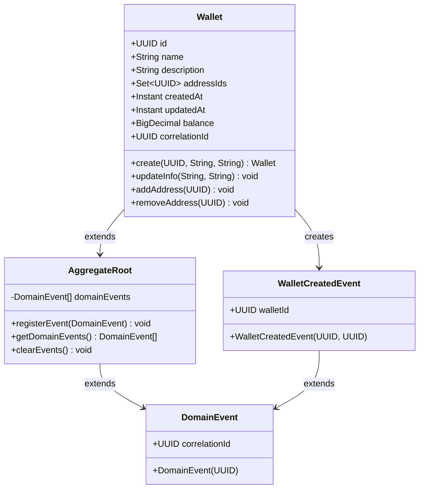
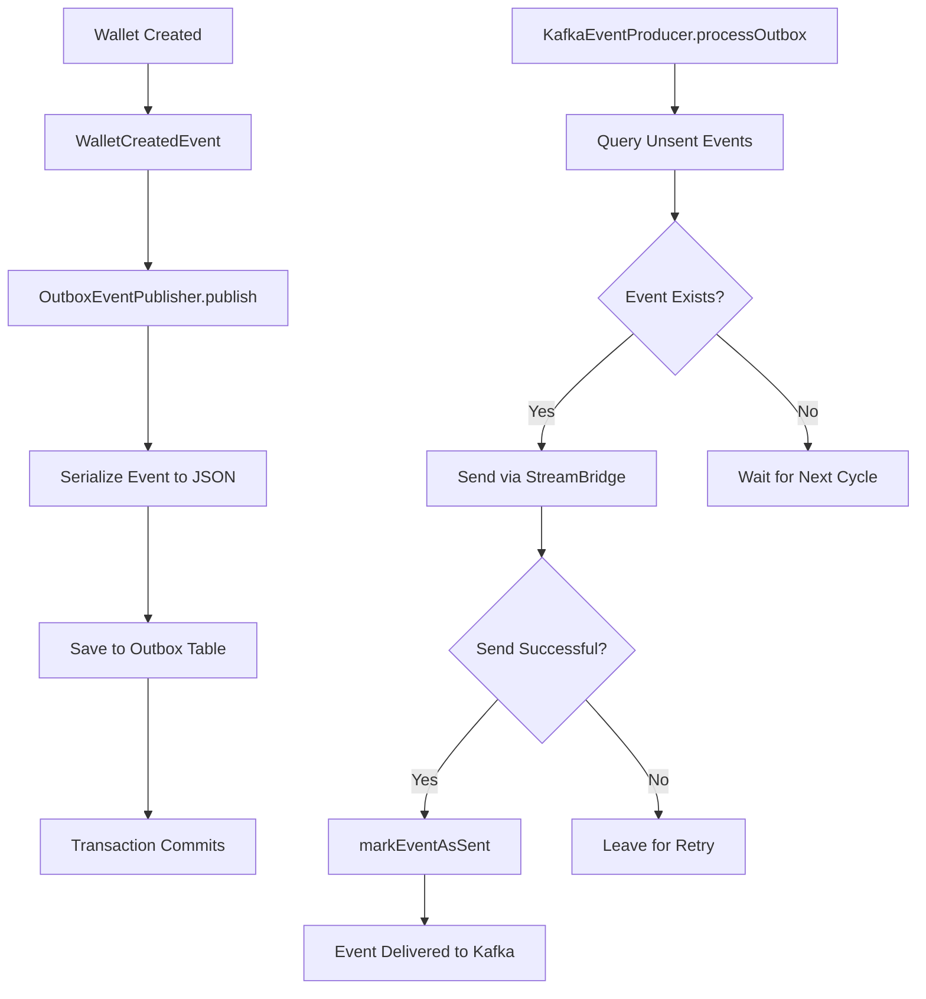
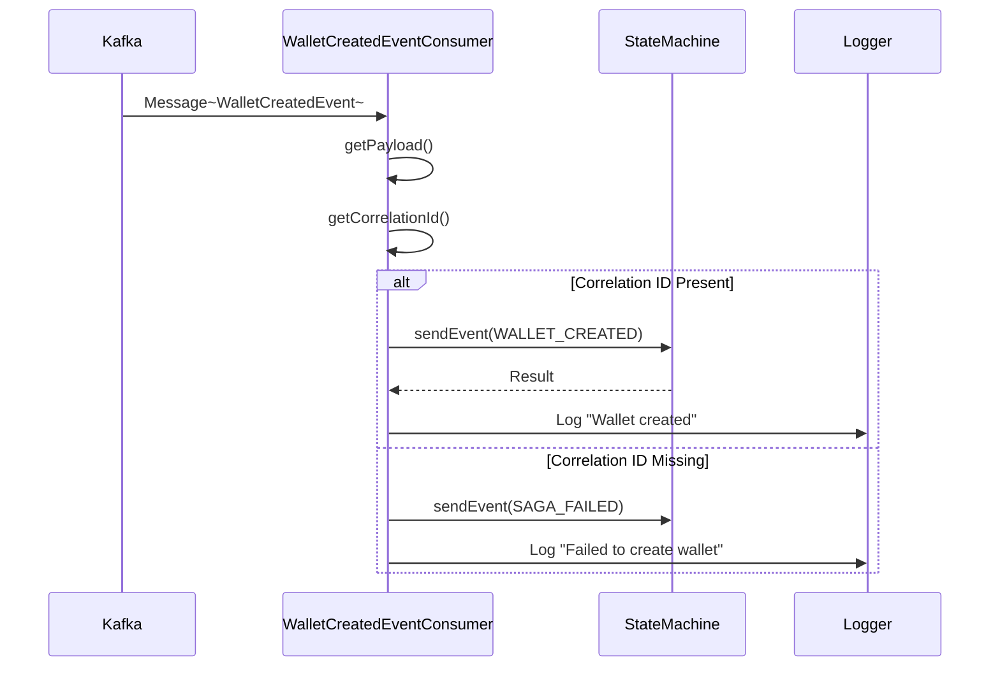
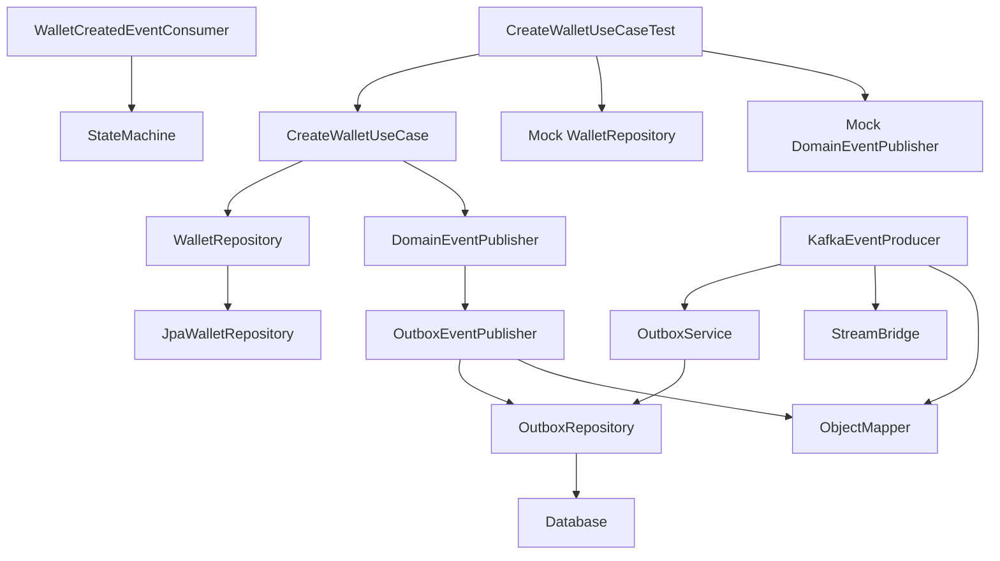

# Create Wallet

<cite>
**Referenced Files in This Document**   
- [CreateWalletUseCase.java](file://src/main/java/dev/bloco/wallet/hub/usecase/CreateWalletUseCase.java)
- [Wallet.java](file://src/main/java/dev/bloco/wallet/hub/domain/model/Wallet.java)
- [WalletRepository.java](file://src/main/java/dev/bloco/wallet/hub/domain/gateway/WalletRepository.java)
- [DomainEventPublisher.java](file://src/main/java/dev/bloco/wallet/hub/domain/gateway/DomainEventPublisher.java)
- [WalletCreatedEvent.java](file://src/main/java/dev/bloco/wallet/hub/domain/event/wallet/WalletCreatedEvent.java)
- [OutboxEventPublisher.java](file://src/main/java/dev/bloco/wallet/hub/infra/adapter/event/OutboxEventPublisher.java)
- [KafkaEventProducer.java](file://src/main/java/dev/bloco/wallet/hub/infra/adapter/event/producer/KafkaEventProducer.java)
- [WalletCreatedEventConsumer.java](file://src/main/java/dev/bloco/wallet/hub/infra/adapter/event/consumer/WalletCreatedEventConsumer.java)
- [CreateWalletUseCaseTest.java](file://src/test/java/dev/bloco/wallet/hub/usecase/CreateWalletUseCaseTest.java)
</cite>

## Table of Contents
1. [Introduction](#introduction)
2. [Core Components](#core-components)
3. [Architecture Overview](#architecture-overview)
4. [Detailed Component Analysis](#detailed-component-analysis)
5. [Dependency Analysis](#dependency-analysis)
6. [Performance Considerations](#performance-considerations)
7. [Troubleshooting Guide](#troubleshooting-guide)
8. [Conclusion](#conclusion)

## Introduction
The CreateWalletUseCase in the bloco-wallet-java system is responsible for initializing a new wallet within the domain. This use case encapsulates the complete workflow from wallet creation through persistence and event publishing. The process involves creating a wallet entity with a generated ID, persisting it via WalletRepository, and publishing a WalletCreatedEvent through DomainEventPublisher. The event is then persisted in an outbox table for reliable delivery to Kafka, ensuring eventual consistency across distributed components. This document details the implementation, flow, integration points, and error handling mechanisms involved in wallet creation.

## Core Components

The CreateWalletUseCase coordinates several key components to accomplish wallet initialization. It receives input parameters including a user ID (for API compatibility) and a correlation ID for tracing. The use case creates a Wallet entity using the static create method, which initializes the wallet with default metadata and registers a WalletCreatedEvent in the aggregate root. The WalletRepository persists the wallet to the database, while the DomainEventPublisher handles event dissemination. The OutboxEventPublisher implementation ensures transactional consistency by storing events in a database table before asynchronous delivery. Finally, the KafkaEventProducer processes unsent outbox events and delivers them to Kafka topics, where consumers like WalletCreatedEventConsumer react to the events.

**Section sources**
- [CreateWalletUseCase.java](file://src/main/java/dev/bloco/wallet/hub/usecase/CreateWalletUseCase.java#L1-L42)
- [Wallet.java](file://src/main/java/dev/bloco/wallet/hub/domain/model/Wallet.java#L1-L122)
- [WalletRepository.java](file://src/main/java/dev/bloco/wallet/hub/domain/gateway/WalletRepository.java#L1-L33)

## Architecture Overview

**Diagram sources **
- [CreateWalletUseCase.java](file://src/main/java/dev/bloco/wallet/hub/usecase/CreateWalletUseCase.java#L1-L42)
- [OutboxEventPublisher.java](file://src/main/java/dev/bloco/wallet/hub/infra/adapter/event/OutboxEventPublisher.java#L1-L74)
- [KafkaEventProducer.java](file://src/main/java/dev/bloco/wallet/hub/infra/adapter/event/producer/KafkaEventProducer.java#L1-L152)

## Detailed Component Analysis

### CreateWalletUseCase Analysis
The CreateWalletUseCase is implemented as a record with two dependencies: WalletRepository and DomainEventPublisher. The createWallet method takes a userId (retained for API compatibility) and a correlationId for operation tracing. It generates a new UUID for the wallet, creates a Wallet instance with default name and description, persists it through the repository, and publishes a WalletCreatedEvent containing the wallet ID and correlation ID. The method returns the created wallet to the caller.

**Diagram sources **
- [CreateWalletUseCase.java](file://src/main/java/dev/bloco/wallet/hub/usecase/CreateWalletUseCase.java#L1-L42)
- [Wallet.java](file://src/main/java/dev/bloco/wallet/hub/domain/model/Wallet.java#L44-L48)
- [OutboxEventPublisher.java](file://src/main/java/dev/bloco/wallet/hub/infra/adapter/event/OutboxEventPublisher.java#L30-L74)
- [KafkaEventProducer.java](file://src/main/java/dev/bloco/wallet/hub/infra/adapter/event/producer/KafkaEventProducer.java#L120-L151)

**Section sources**
- [CreateWalletUseCase.java](file://src/main/java/dev/bloco/wallet/hub/usecase/CreateWalletUseCase.java#L1-L42)
- [Wallet.java](file://src/main/java/dev/bloco/wallet/hub/domain/model/Wallet.java#L44-L48)

### Wallet Entity and Event Analysis
The Wallet entity extends AggregateRoot, enabling domain event registration. When created via the static create method, it automatically registers a WalletCreatedEvent with its ID and correlation ID. The WalletCreatedEvent class contains the wallet ID and inherits the correlation ID from the DomainEvent base class. This event is published through the DomainEventPublisher interface, which is implemented by OutboxEventPublisher to ensure reliable persistence before delivery.

**Diagram sources **
- [Wallet.java](file://src/main/java/dev/bloco/wallet/hub/domain/model/Wallet.java#L1-L122)
- [WalletCreatedEvent.java](file://src/main/java/dev/bloco/wallet/hub/domain/event/wallet/WalletCreatedEvent.java#L1-L38)
- [AggregateRoot.java](file://src/main/java/dev/bloco/wallet/hub/domain/model/common/AggregateRoot.java#L1-L27)

**Section sources**
- [Wallet.java](file://src/main/java/dev/bloco/wallet/hub/domain/model/Wallet.java#L1-L122)
- [WalletCreatedEvent.java](file://src/main/java/dev/bloco/wallet/hub/domain/event/wallet/WalletCreatedEvent.java#L1-L38)

### Event Publishing and Kafka Integration
The event publishing mechanism uses an outbox pattern to ensure transactional consistency. The OutboxEventPublisher implements DomainEventPublisher and persists events to the outbox database table within the same transaction as the wallet creation. The KafkaEventProducer runs a scheduled process every 5 seconds to send unsent outbox events to Kafka using StreamBridge. Each event type corresponds to a specific output channel (e.g., "walletCreatedEventProducer-out-0"). After successful delivery, the event is marked as sent in the database.

**Diagram sources **
- [OutboxEventPublisher.java](file://src/main/java/dev/bloco/wallet/hub/infra/adapter/event/OutboxEventPublisher.java#L30-L74)
- [KafkaEventProducer.java](file://src/main/java/dev/bloco/wallet/hub/infra/adapter/event/producer/KafkaEventProducer.java#L120-L151)
- [OutboxEvent.java](file://src/main/java/dev/bloco/wallet/hub/infra/provider/data/OutboxEvent.java#L1-L88)

**Section sources**
- [OutboxEventPublisher.java](file://src/main/java/dev/bloco/wallet/hub/infra/adapter/event/OutboxEventPublisher.java#L30-L74)
- [KafkaEventProducer.java](file://src/main/java/dev/bloco/wallet/hub/infra/adapter/event/producer/KafkaEventProducer.java#L120-L151)

### WalletCreatedEventConsumer Analysis
The WalletCreatedEventConsumer processes wallet creation events from Kafka and integrates with a saga state machine. It validates the presence of a correlation ID in the event and transitions the state machine to WALLET_CREATED state if present, or to SAGA_FAILED if missing. This consumer is implemented as a Spring Cloud Stream consumer function and uses reactive programming with Mono to handle state machine events asynchronously.

**Diagram sources **
- [WalletCreatedEventConsumer.java](file://src/main/java/dev/bloco/wallet/hub/infra/adapter/event/consumer/WalletCreatedEventConsumer.java#L1-L68)

**Section sources**
- [WalletCreatedEventConsumer.java](file://src/main/java/dev/bloco/wallet/hub/infra/adapter/event/consumer/WalletCreatedEventConsumer.java#L1-L68)

## Dependency Analysis

**Diagram sources **
- [CreateWalletUseCase.java](file://src/main/java/dev/bloco/wallet/hub/usecase/CreateWalletUseCase.java#L1-L42)
- [WalletRepository.java](file://src/main/java/dev/bloco/wallet/hub/domain/gateway/WalletRepository.java#L1-L33)
- [DomainEventPublisher.java](file://src/main/java/dev/bloco/wallet/hub/domain/gateway/DomainEventPublisher.java#L1-L15)
- [OutboxEventPublisher.java](file://src/main/java/dev/bloco/wallet/hub/infra/adapter/event/OutboxEventPublisher.java#L1-L74)
- [KafkaEventProducer.java](file://src/main/java/dev/bloco/wallet/hub/infra/adapter/event/producer/KafkaEventProducer.java#L1-L152)

**Section sources**
- [CreateWalletUseCase.java](file://src/main/java/dev/bloco/wallet/hub/usecase/CreateWalletUseCase.java#L1-L42)
- [WalletRepository.java](file://src/main/java/dev/bloco/wallet/hub/domain/gateway/WalletRepository.java#L1-L33)

## Performance Considerations
The wallet creation process is optimized for transactional integrity rather than raw performance. The synchronous database persistence ensures data consistency, while the asynchronous event delivery prevents blocking operations. The outbox pattern introduces a small latency (up to 5 seconds by default) for event delivery to Kafka, but this is acceptable for the eventual consistency requirements of the system. The scheduled processing of outbox events uses a simple polling mechanism that could be optimized with database triggers or change data capture in high-throughput scenarios. The JSON serialization of events is performed efficiently using Jackson's ObjectMapper with Java Time module registration.

## Troubleshooting Guide
Common issues in wallet creation include duplicate wallet IDs, missing correlation IDs, serialization failures, and Kafka delivery problems. The system handles duplicate wallet IDs through the repository's existsById method, though this check is not currently implemented in the use case. Missing correlation IDs are detected by WalletCreatedEventConsumer, which transitions the saga to a failed state. Serialization failures in OutboxEventPublisher result in RuntimeExceptions that roll back the transaction, preventing inconsistent state. Kafka delivery failures are handled by the retry mechanism in KafkaEventProducer, which leaves failed events in the outbox for subsequent processing attempts. Monitoring should focus on the outbox table size and error logs from the event publisher and producer components.

**Section sources**
- [OutboxEventPublisher.java](file://src/main/java/dev/bloco/wallet/hub/infra/adapter/event/OutboxEventPublisher.java#L30-L74)
- [KafkaEventProducer.java](file://src/main/java/dev/bloco/wallet/hub/infra/adapter/event/producer/KafkaEventProducer.java#L120-L151)
- [WalletCreatedEventConsumer.java](file://src/main/java/dev/bloco/wallet/hub/infra/adapter/event/consumer/WalletCreatedEventConsumer.java#L1-L68)

## Conclusion
The CreateWalletUseCase implements a robust wallet initialization process that balances transactional consistency with asynchronous event delivery. By leveraging the outbox pattern, it ensures that wallet creation and event publishing occur atomically within the database transaction, while decoupling the event delivery to external systems. The integration with Kafka through scheduled processing provides reliable message delivery with built-in retry capabilities. The use of correlation IDs enables end-to-end tracing of wallet creation operations across distributed components. Test coverage verifies the core functionality of wallet persistence and event publication, ensuring the reliability of this critical use case.