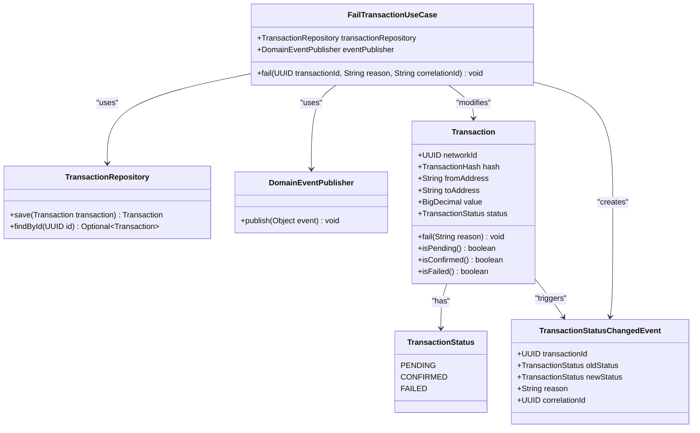
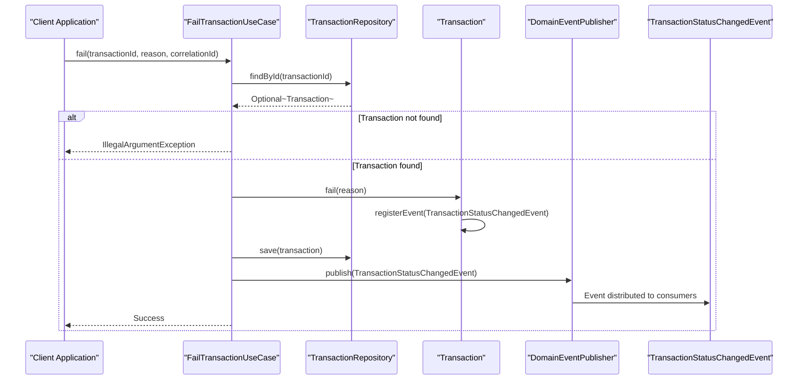
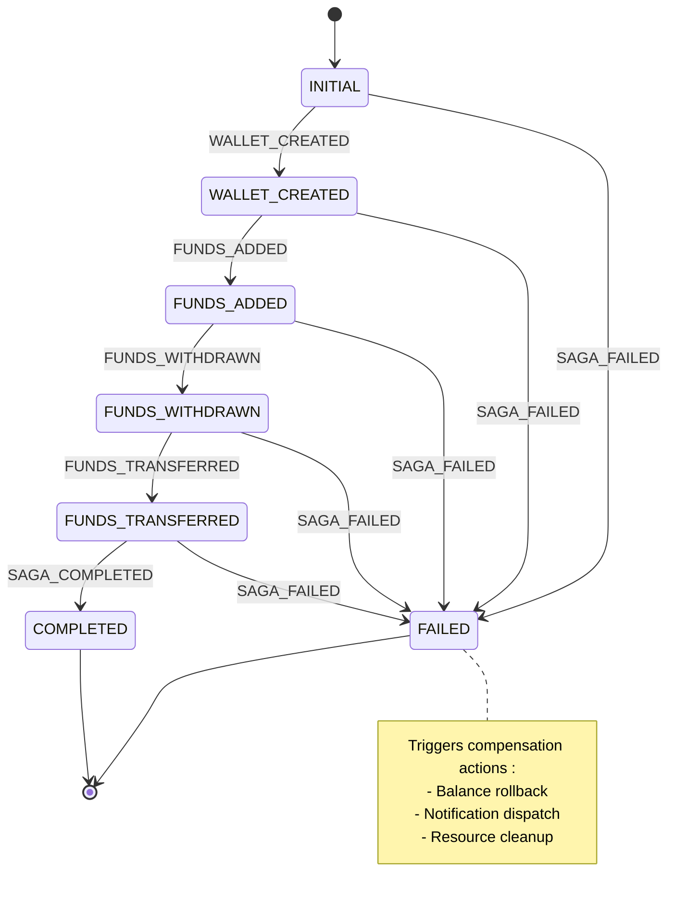
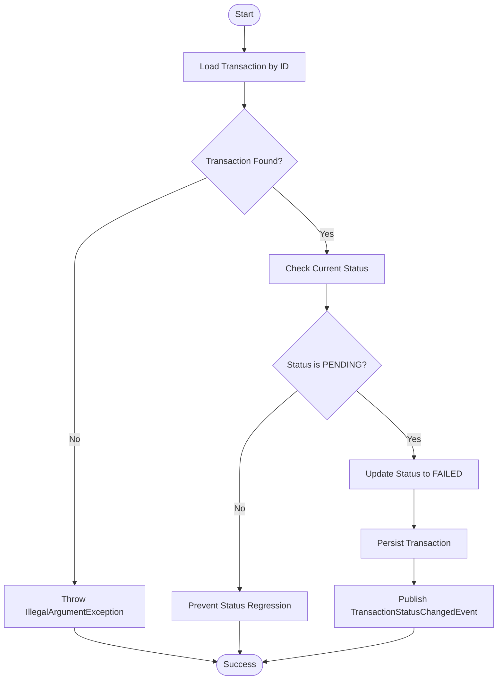
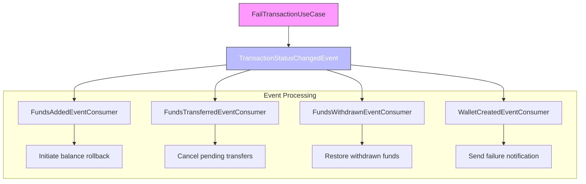
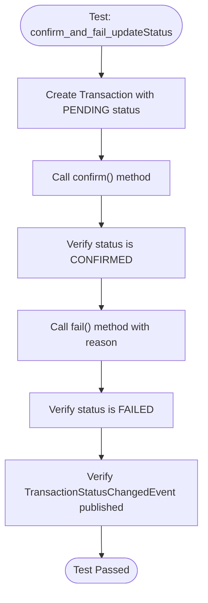

# Fail Transaction

<cite>
**Referenced Files in This Document**   
- [FailTransactionUseCase.java](file://src/main/java/dev/bloco/wallet/hub/usecase/FailTransactionUseCase.java)
- [Transaction.java](file://src/main/java/dev/bloco/wallet/hub/domain/model/transaction/Transaction.java)
- [TransactionStatusChangedEvent.java](file://src/main/java/dev/bloco/wallet/hub/domain/event/transaction/TransactionStatusChangedEvent.java)
- [TransactionStatus.java](file://src/main/java/dev/bloco/wallet/hub/domain/model/transaction/TransactionStatus.java)
- [TransactionTest.java](file://src/test/java/dev/bloco/wallet/hub/domain/TransactionTest.java)
- [StandardSagaStateMachineConfig.java](file://src/main/java/dev/bloco/wallet/hub/infra/provider/data/config/StandardSagaStateMachineConfig.java)
- [SagaEvents.java](file://src/main/java/dev/bloco/wallet/hub/infra/provider/data/config/SagaEvents.java)
- [SagaStates.java](file://src/main/java/dev/bloco/wallet/hub/infra/provider/data/config/SagaStates.java)
- [TransactionRepository.java](file://src/main/java/dev/bloco/wallet/hub/domain/gateway/TransactionRepository.java)
- [DomainEventPublisher.java](file://src/main/java/dev/bloco/wallet/hub/domain/gateway/DomainEventPublisher.java)
</cite>

## Table of Contents
1. [Introduction](#introduction)
2. [Core Components](#core-components)
3. [Workflow Analysis](#workflow-analysis)
4. [Saga Pattern Integration](#saga-pattern-integration)
5. [Idempotency and State Validation](#idempotency-and-state-validation)
6. [Event-Driven Architecture](#event-driven-architecture)
7. [Error Handling and Logging](#error-handling-and-logging)
8. [Test Scenarios](#test-scenarios)
9. [Conclusion](#conclusion)

## Introduction

The `FailTransactionUseCase` in the bloco-wallet-java application serves as a critical component for managing transaction lifecycle by marking transactions as failed due to validation errors, timeouts, or external rejections. This use case ensures data consistency and enables proper compensation mechanisms through event-driven architecture. The implementation follows domain-driven design principles, maintaining transaction integrity while integrating with a saga pattern for distributed transaction management.

**Section sources**
- [FailTransactionUseCase.java](file://src/main/java/dev/bloco/wallet/hub/usecase/FailTransactionUseCase.java#L1-L35)

## Core Components

The `FailTransactionUseCase` coordinates several core domain components to execute its functionality. The primary components include the Transaction entity, TransactionStatus enumeration, TransactionStatusChangedEvent, and supporting infrastructure interfaces.

**Diagram sources**
- [FailTransactionUseCase.java](file://src/main/java/dev/bloco/wallet/hub/usecase/FailTransactionUseCase.java#L1-L35)
- [Transaction.java](file://src/main/java/dev/bloco/wallet/hub/domain/model/transaction/Transaction.java#L20-L210)
- [TransactionStatus.java](file://src/main/java/dev/bloco/wallet/hub/domain/model/transaction/TransactionStatus.java#L2-L6)
- [TransactionStatusChangedEvent.java](file://src/main/java/dev/bloco/wallet/hub/domain/event/transaction/TransactionStatusChangedEvent.java#L7-L37)
- [TransactionRepository.java](file://src/main/java/dev/bloco/wallet/hub/domain/gateway/TransactionRepository.java#L28-L54)
- [DomainEventPublisher.java](file://src/main/java/dev/bloco/wallet/hub/domain/gateway/DomainEventPublisher.java#L11-L13)

**Section sources**
- [FailTransactionUseCase.java](file://src/main/java/dev/bloco/wallet/hub/usecase/FailTransactionUseCase.java#L1-L35)
- [Transaction.java](file://src/main/java/dev/bloco/wallet/hub/domain/model/transaction/Transaction.java#L20-L210)
- [TransactionStatus.java](file://src/main/java/dev/bloco/wallet/hub/domain/model/transaction/TransactionStatus.java#L2-L6)
- [TransactionStatusChangedEvent.java](file://src/main/java/dev/bloco/wallet/hub/domain/event/transaction/TransactionStatusChangedEvent.java#L7-L37)

## Workflow Analysis

The `FailTransactionUseCase` executes a well-defined workflow to transition a transaction to a failed state. The process begins with loading the transaction from persistence, validating its current state, updating the status, persisting changes, and publishing a domain event.

**Diagram sources**
- [FailTransactionUseCase.java](file://src/main/java/dev/bloco/wallet/hub/usecase/FailTransactionUseCase.java#L1-L35)
- [Transaction.java](file://src/main/java/dev/bloco/wallet/hub/domain/model/transaction/Transaction.java#L20-L210)
- [TransactionRepository.java](file://src/main/java/dev/bloco/wallet/hub/domain/gateway/TransactionRepository.java#L28-L54)
- [DomainEventPublisher.java](file://src/main/java/dev/bloco/wallet/hub/domain/gateway/DomainEventPublisher.java#L11-L13)

**Section sources**
- [FailTransactionUseCase.java](file://src/main/java/dev/bloco/wallet/hub/usecase/FailTransactionUseCase.java#L1-L35)
- [Transaction.java](file://src/main/java/dev/bloco/wallet/hub/domain/model/transaction/Transaction.java#L20-L210)

## Saga Pattern Integration

The `FailTransactionUseCase` integrates with a saga pattern to trigger compensation actions when a transaction fails. The saga state machine is configured to handle failure events across various stages of the workflow, enabling appropriate rollback mechanisms such as balance restoration or notification dispatch.

**Diagram sources**
- [StandardSagaStateMachineConfig.java](file://src/main/java/dev/bloco/wallet/hub/infra/provider/data/config/StandardSagaStateMachineConfig.java#L49-L105)
- [SagaEvents.java](file://src/main/java/dev/bloco/wallet/hub/infra/provider/data/config/SagaEvents.java#L20-L27)
- [SagaStates.java](file://src/main/java/dev/bloco/wallet/hub/infra/provider/data/config/SagaStates.java#L24-L33)

**Section sources**
- [StandardSagaStateMachineConfig.java](file://src/main/java/dev/bloco/wallet/hub/infra/provider/data/config/StandardSagaStateMachineConfig.java#L49-L105)

## Idempotency and State Validation

The implementation ensures idempotency and prevents status regression through careful state management. The system validates that only transactions in the PENDING state can be failed, preventing attempts to modify already completed or failed transactions.

**Diagram sources**
- [FailTransactionUseCase.java](file://src/main/java/dev/bloco/wallet/hub/usecase/FailTransactionUseCase.java#L1-L35)
- [Transaction.java](file://src/main/java/dev/bloco/wallet/hub/domain/model/transaction/Transaction.java#L20-L210)

**Section sources**
- [FailTransactionUseCase.java](file://src/main/java/dev/bloco/wallet/hub/usecase/FailTransactionUseCase.java#L1-L35)
- [Transaction.java](file://src/main/java/dev/bloco/wallet/hub/domain/model/transaction/Transaction.java#L20-L210)

## Event-Driven Architecture

The system employs an event-driven architecture where the `FailTransactionUseCase` publishes a `TransactionStatusChangedEvent` upon successful status update. This event serves as a notification mechanism for various consumers that react to transaction failures.

**Diagram sources**
- [TransactionStatusChangedEvent.java](file://src/main/java/dev/bloco/wallet/hub/domain/event/transaction/TransactionStatusChangedEvent.java#L7-L37)
- [FailTransactionUseCase.java](file://src/main/java/dev/bloco/wallet/hub/usecase/FailTransactionUseCase.java#L1-L35)

**Section sources**
- [TransactionStatusChangedEvent.java](file://src/main/java/dev/bloco/wallet/hub/domain/event/transaction/TransactionStatusChangedEvent.java#L7-L37)
- [FailTransactionUseCase.java](file://src/main/java/dev/bloco/wallet/hub/usecase/FailTransactionUseCase.java#L1-L35)

## Error Handling and Logging

The `FailTransactionUseCase` implements robust error handling with clear categorization of failure reasons. The system distinguishes between permanent and transient errors, enabling appropriate retry mechanisms and audit trails.

When a transaction cannot be found, the use case throws an `IllegalArgumentException`, which should be logged with appropriate context including the transaction ID and correlation ID. The failure reason is preserved in the `TransactionStatusChangedEvent`, providing a complete audit trail of why a transaction failed.

The implementation includes built-in logging through the domain event system, where each status change is automatically recorded. This creates a comprehensive audit trail that can be used for debugging, compliance, and operational monitoring.

**Section sources**
- [FailTransactionUseCase.java](file://src/main/java/dev/bloco/wallet/hub/usecase/FailTransactionUseCase.java#L1-L35)
- [TransactionStatusChangedEvent.java](file://src/main/java/dev/bloco/wallet/hub/domain/event/transaction/TransactionStatusChangedEvent.java#L7-L37)

## Test Scenarios

The implementation is validated through comprehensive test scenarios that verify proper state transitions and event emission. The tests confirm that the transaction status changes correctly from PENDING to FAILED and that the appropriate domain event is published.

**Diagram sources**
- [TransactionTest.java](file://src/test/java/dev/bloco/wallet/hub/domain/TransactionTest.java#L50-L68)

**Section sources**
- [TransactionTest.java](file://src/test/java/dev/bloco/wallet/hub/domain/TransactionTest.java#L50-L68)

## Conclusion

The `FailTransactionUseCase` provides a robust mechanism for handling transaction failures in the bloco-wallet-java application. By following domain-driven design principles, the implementation ensures data consistency, prevents invalid state transitions, and integrates seamlessly with the saga pattern for distributed transaction management.

The use case demonstrates effective application of event-driven architecture, where status changes trigger appropriate compensation actions through published events. The combination of state validation, idempotency checks, and comprehensive error handling creates a reliable system for managing transaction failures.

The integration with the saga pattern allows for coordinated rollback across multiple services, while the audit trail provided by domain events ensures complete visibility into transaction lifecycle changes. This implementation serves as a model for handling failures in distributed financial systems where data consistency and reliability are paramount.