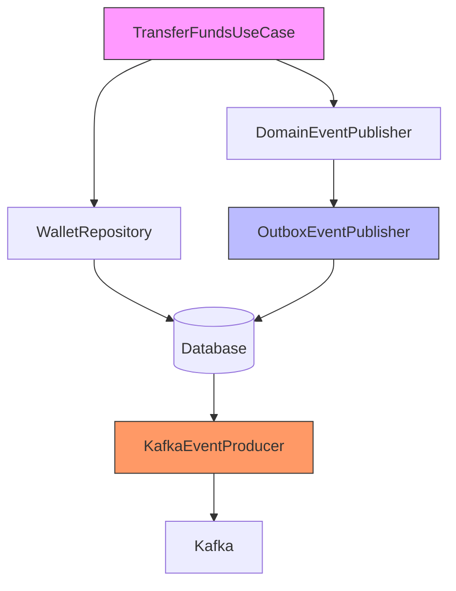
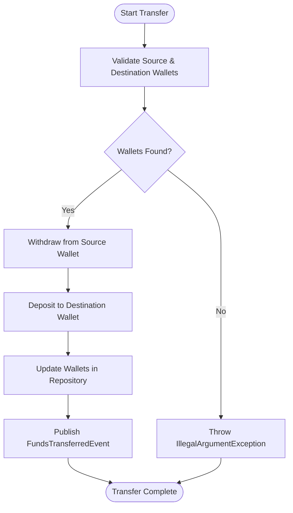
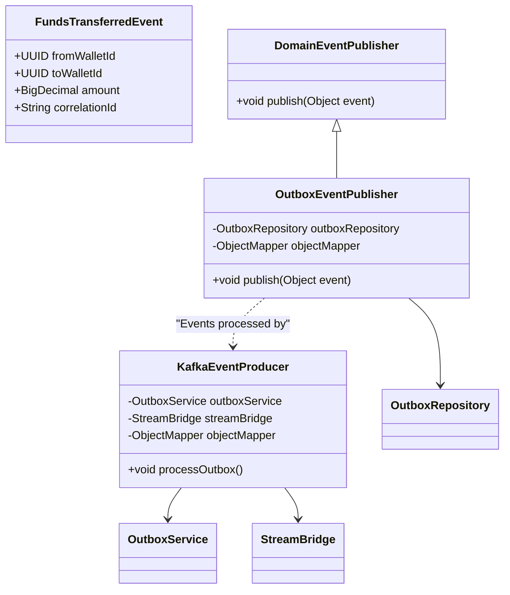
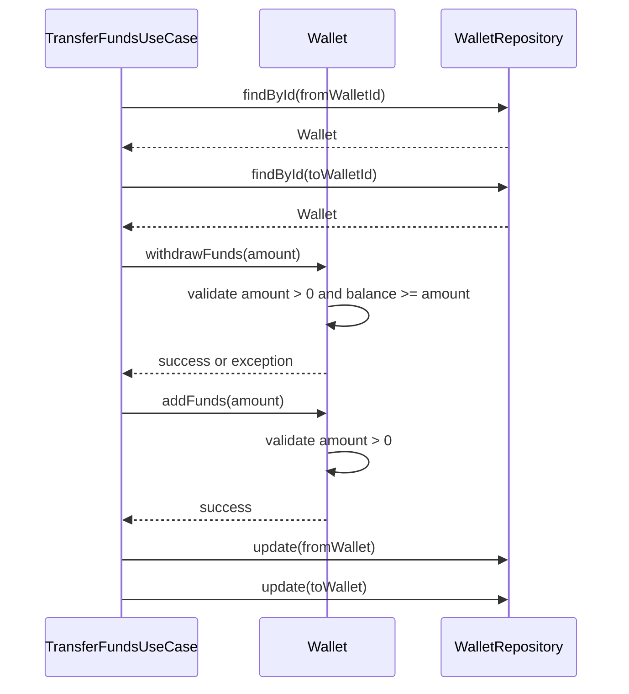
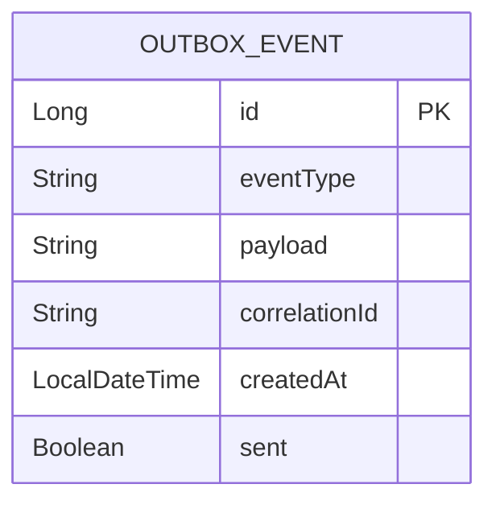
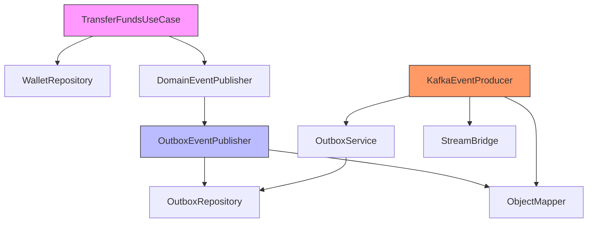

# Transfer Funds

<cite>
**Referenced Files in This Document**   
- [TransferFundsUseCase.java](file://src/main/java/dev/bloco/wallet/hub/usecase/TransferFundsUseCase.java)
- [FundsTransferredEvent.java](file://src/main/java/dev/bloco/wallet/hub/domain/event/wallet/FundsTransferredEvent.java)
- [Wallet.java](file://src/main/java/dev/bloco/wallet/hub/domain/model/Wallet.java)
- [WalletRepository.java](file://src/main/java/dev/bloco/wallet/hub/domain/gateway/WalletRepository.java)
- [OutboxEventPublisher.java](file://src/main/java/dev/bloco/wallet/hub/infra/adapter/event/OutboxEventPublisher.java)
- [KafkaEventProducer.java](file://src/main/java/dev/bloco/wallet/hub/infra/adapter/event/producer/KafkaEventProducer.java)
- [OutboxService.java](file://src/main/java/dev/bloco/wallet/hub/infra/provider/data/OutboxService.java)
- [OutboxEvent.java](file://src/main/java/dev/bloco/wallet/hub/infra/provider/data/OutboxEvent.java)
- [OutboxRepository.java](file://src/main/java/dev/bloco/wallet/hub/infra/provider/data/repository/OutboxRepository.java)
- [TransferFundsUseCaseTest.java](file://src/test/java/dev/bloco/wallet/hub/usecase/TransferFundsUseCaseTest.java)
</cite>

## Table of Contents
1. [Introduction](#introduction)
2. [Core Components](#core-components)
3. [Architecture Overview](#architecture-overview)
4. [Detailed Component Analysis](#detailed-component-analysis)
5. [Dependency Analysis](#dependency-analysis)
6. [Performance Considerations](#performance-considerations)
7. [Troubleshooting Guide](#troubleshooting-guide)
8. [Conclusion](#conclusion)

## Introduction
The TransferFundsUseCase in the bloco-wallet-java application orchestrates the end-to-end process of transferring funds between two wallets. This document details the implementation, focusing on validation, atomic updates, event publishing, and integration with distributed transaction patterns. The use case ensures consistency through transaction boundaries and supports idempotency via correlation IDs. Events are published using an outbox pattern for reliable delivery to Kafka, enabling downstream systems to react to fund transfers.

## Core Components

The core functionality revolves around the TransferFundsUseCase, which coordinates wallet validation, balance updates, and event emission. It interacts with the WalletRepository to retrieve and persist wallet states and uses the DomainEventPublisher to emit a FundsTransferredEvent after a successful transfer. The Wallet model encapsulates business logic for balance management, including withdrawal and deposit operations. The outbox pattern is implemented via OutboxEventPublisher and KafkaEventProducer to ensure reliable event delivery.

**Section sources**
- [TransferFundsUseCase.java](file://src/main/java/dev/bloco/wallet/hub/usecase/TransferFundsUseCase.java#L1-L64)
- [Wallet.java](file://src/main/java/dev/bloco/wallet/hub/domain/model/Wallet.java#L23-L121)
- [FundsTransferredEvent.java](file://src/main/java/dev/bloco/wallet/hub/domain/event/wallet/FundsTransferredEvent.java#L1-L27)

## Architecture Overview

The architecture follows a clean separation of concerns, with use cases orchestrating domain logic and infrastructure components handling persistence and messaging. The transfer process is transactional, ensuring atomicity of balance updates. Events are published through an outbox table to decouple event production from immediate delivery, supporting eventual consistency in distributed environments.

**Diagram sources**
- [TransferFundsUseCase.java](file://src/main/java/dev/bloco/wallet/hub/usecase/TransferFundsUseCase.java#L1-L64)
- [OutboxEventPublisher.java](file://src/main/java/dev/bloco/wallet/hub/infra/adapter/event/OutboxEventPublisher.java#L30-L74)
- [KafkaEventProducer.java](file://src/main/java/dev/bloco/wallet/hub/infra/adapter/event/producer/KafkaEventProducer.java#L29-L151)

## Detailed Component Analysis

### TransferFundsUseCase Analysis
The TransferFundsUseCase implements the core logic for transferring funds between wallets. It validates the existence of both source and destination wallets, performs atomic balance updates, and publishes a domain event upon success. The use case is designed as an immutable record with dependency injection, promoting testability and clarity.

#### Flowchart of Transfer Process

**Diagram sources**
- [TransferFundsUseCase.java](file://src/main/java/dev/bloco/wallet/hub/usecase/TransferFundsUseCase.java#L45-L62)

**Section sources**
- [TransferFundsUseCase.java](file://src/main/java/dev/bloco/wallet/hub/usecase/TransferFundsUseCase.java#L1-L64)

### FundsTransferredEvent and Event Publishing
The FundsTransferredEvent captures essential metadata about the transfer, including source and destination wallet IDs, amount, and correlation ID. This event is published through the DomainEventPublisher interface, which is implemented by OutboxEventPublisher to persist events in the outbox table for reliable processing.

#### Class Diagram of Event Components

**Diagram sources**
- [FundsTransferredEvent.java](file://src/main/java/dev/bloco/wallet/hub/domain/event/wallet/FundsTransferredEvent.java#L1-L27)
- [OutboxEventPublisher.java](file://src/main/java/dev/bloco/wallet/hub/infra/adapter/event/OutboxEventPublisher.java#L30-L74)
- [KafkaEventProducer.java](file://src/main/java/dev/bloco/wallet/hub/infra/adapter/event/producer/KafkaEventProducer.java#L29-L151)

**Section sources**
- [FundsTransferredEvent.java](file://src/main/java/dev/bloco/wallet/hub/domain/event/wallet/FundsTransferredEvent.java#L1-L27)
- [OutboxEventPublisher.java](file://src/main/java/dev/bloco/wallet/hub/infra/adapter/event/OutboxEventPublisher.java#L30-L74)

### Wallet Balance Management
The Wallet class encapsulates the business logic for managing wallet balances, ensuring that withdrawals and deposits adhere to business rules such as positive amounts and sufficient funds.

#### Sequence Diagram of Balance Operations

**Diagram sources**
- [Wallet.java](file://src/main/java/dev/bloco/wallet/hub/domain/model/Wallet.java#L85-L121)
- [WalletRepository.java](file://src/main/java/dev/bloco/wallet/hub/domain/gateway/WalletRepository.java#L17-L32)

**Section sources**
- [Wallet.java](file://src/main/java/dev/bloco/wallet/hub/domain/model/Wallet.java#L85-L121)

### Outbox Pattern Implementation
The outbox pattern ensures reliable event delivery by persisting events in the same transaction as the business operation. The OutboxService manages the lifecycle of outbox events, while KafkaEventProducer periodically processes unsent events and delivers them to Kafka.

#### Data Model of Outbox

**Diagram sources**
- [OutboxEvent.java](file://src/main/java/dev/bloco/wallet/hub/infra/provider/data/OutboxEvent.java#L41-L85)
- [OutboxService.java](file://src/main/java/dev/bloco/wallet/hub/infra/provider/data/OutboxService.java#L31-L85)
- [OutboxRepository.java](file://src/main/java/dev/bloco/wallet/hub/infra/provider/data/repository/OutboxRepository.java#L26-L28)

**Section sources**
- [OutboxEvent.java](file://src/main/java/dev/bloco/wallet/hub/infra/provider/data/OutboxEvent.java#L41-L85)
- [OutboxService.java](file://src/main/java/dev/bloco/wallet/hub/infra/provider/data/OutboxService.java#L31-L85)

## Dependency Analysis

The TransferFundsUseCase depends on WalletRepository for wallet persistence and DomainEventPublisher for event emission. The implementation of DomainEventPublisher (OutboxEventPublisher) introduces dependencies on OutboxRepository and ObjectMapper for persisting events. KafkaEventProducer depends on OutboxService and StreamBridge for delivering events to Kafka. These dependencies are managed through constructor injection, promoting loose coupling and testability.

**Diagram sources**
- [TransferFundsUseCase.java](file://src/main/java/dev/bloco/wallet/hub/usecase/TransferFundsUseCase.java#L1-L64)
- [OutboxEventPublisher.java](file://src/main/java/dev/bloco/wallet/hub/infra/adapter/event/OutboxEventPublisher.java#L30-L74)
- [KafkaEventProducer.java](file://src/main/java/dev/bloco/wallet/hub/infra/adapter/event/producer/KafkaEventProducer.java#L29-L151)

**Section sources**
- [TransferFundsUseCase.java](file://src/main/java/dev/bloco/wallet/hub/usecase/TransferFundsUseCase.java#L1-L64)
- [OutboxEventPublisher.java](file://src/main/java/dev/bloco/wallet/hub/infra/adapter/event/OutboxEventPublisher.java#L30-L74)
- [KafkaEventProducer.java](file://src/main/java/dev/bloco/wallet/hub/infra/adapter/event/producer/KafkaEventProducer.java#L29-L151)

## Performance Considerations

The transfer operation is optimized for performance through transactional boundaries that ensure atomicity without unnecessary overhead. The outbox pattern decouples event publishing from immediate delivery, preventing blocking operations during the transfer. The scheduled processing of outbox events (every 5 seconds) balances timely delivery with system load. Indexing on the outbox table's "sent" column ensures efficient retrieval of unsent events.

## Troubleshooting Guide

Common issues in the transfer process include invalid wallet IDs, insufficient funds, and serialization errors during event publishing. The system throws IllegalArgumentException for invalid wallets or insufficient funds, which should be handled by the caller. Serialization errors in OutboxEventPublisher are logged and propagated as RuntimeExceptions, indicating configuration or data issues. Monitoring the outbox table for accumulating unsent events can indicate problems with Kafka connectivity or message processing.

**Section sources**
- [TransferFundsUseCase.java](file://src/main/java/dev/bloco/wallet/hub/usecase/TransferFundsUseCase.java#L45-L62)
- [OutboxEventPublisher.java](file://src/main/java/dev/bloco/wallet/hub/infra/adapter/event/OutboxEventPublisher.java#L65-L74)
- [TransferFundsUseCaseTest.java](file://src/test/java/dev/bloco/wallet/hub/usecase/TransferFundsUseCaseTest.java#L1-L136)

## Conclusion

The TransferFundsUseCase provides a robust implementation of fund transfers with strong consistency guarantees through transactional updates and reliable event delivery via the outbox pattern. The design supports distributed transaction management through saga patterns and ensures idempotency using correlation IDs. The separation of concerns between use cases, domain models, and infrastructure components promotes maintainability and testability. Integration with Kafka enables reactive architectures where downstream services can respond to fund transfers in real-time.