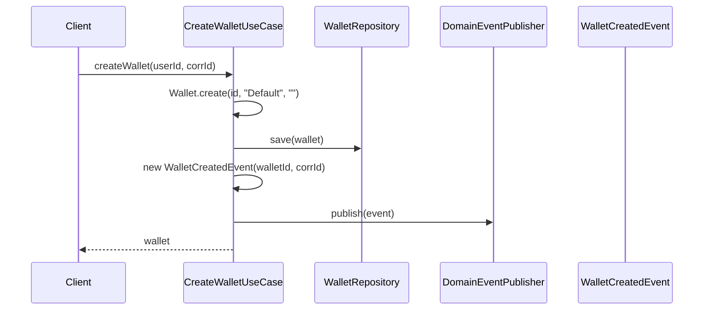
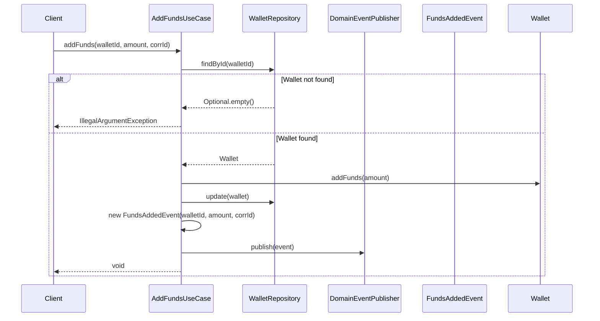
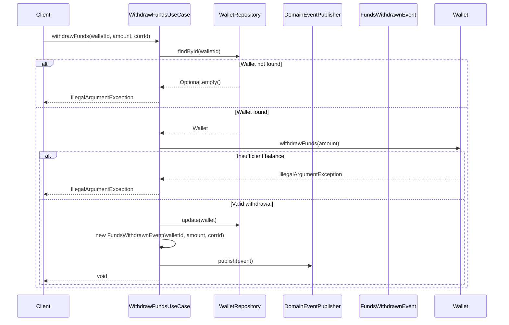
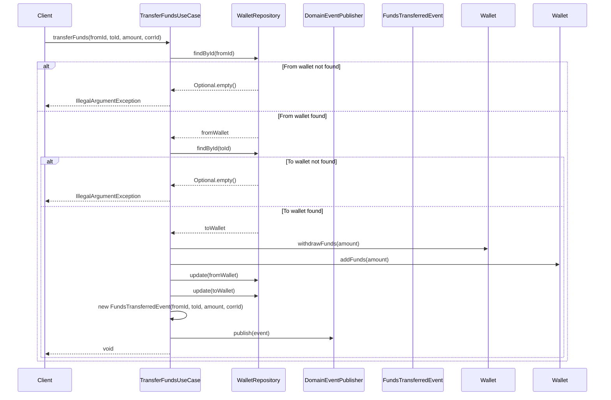
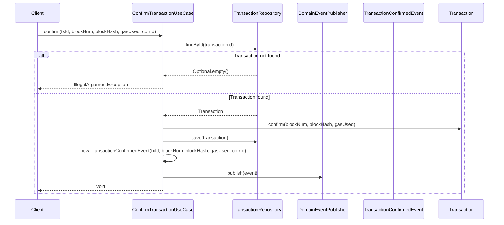
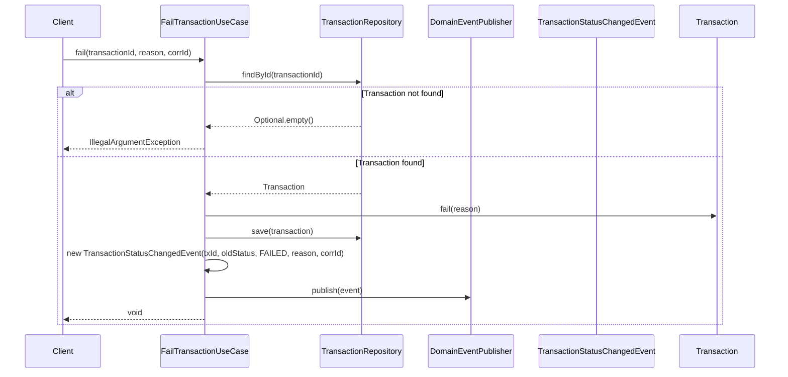
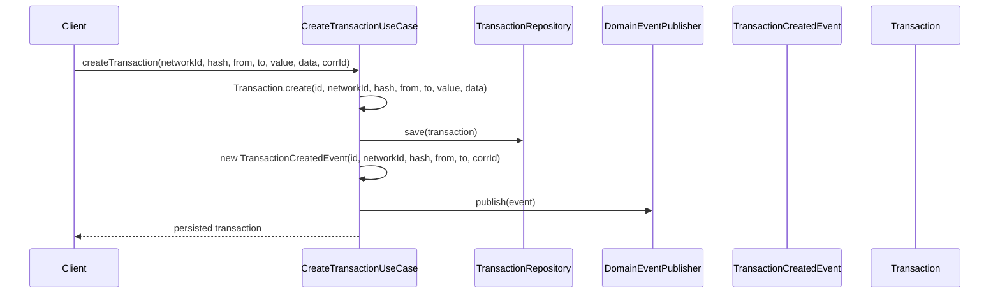
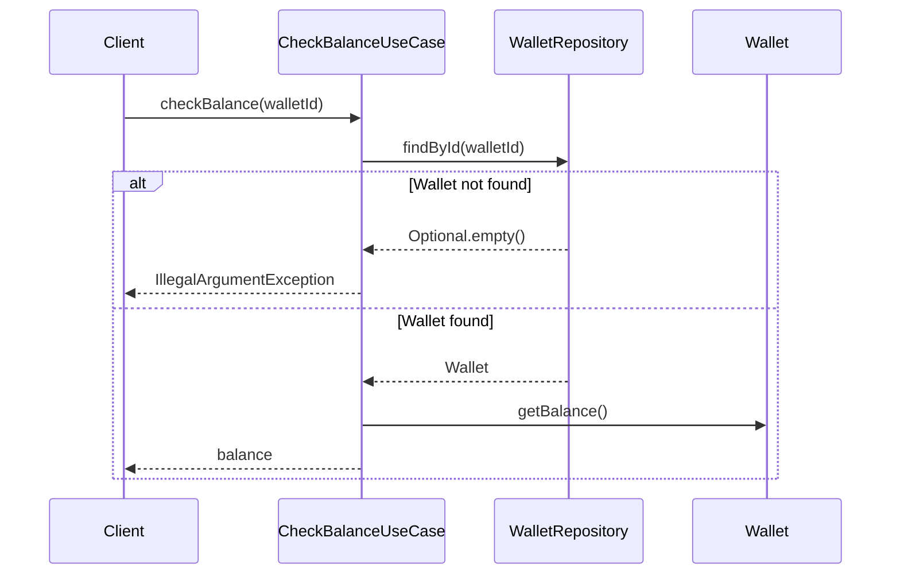
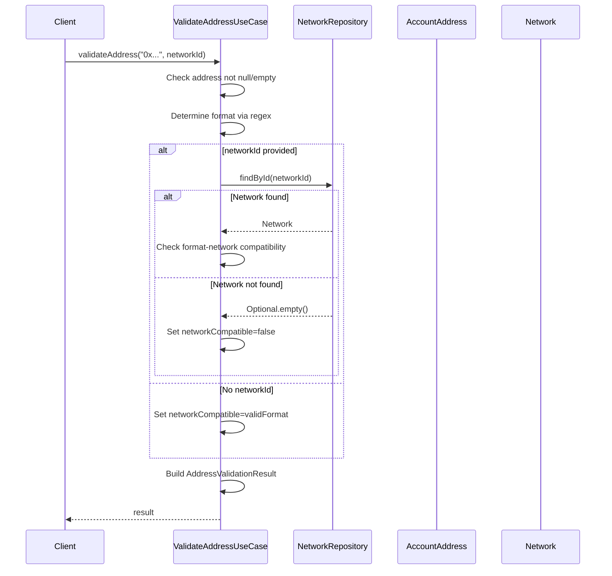
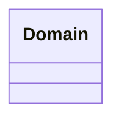

# Use Cases & Business Logic

<cite>
**Referenced Files in This Document**   
- [CreateWalletUseCase.java](file://src/main/java/dev/bloco/wallet/hub/usecase/CreateWalletUseCase.java)
- [AddFundsUseCase.java](file://src/main/java/dev/bloco/wallet/hub/usecase/AddFundsUseCase.java)
- [WithdrawFundsUseCase.java](file://src/main/java/dev/bloco/wallet/hub/usecase/WithdrawFundsUseCase.java)
- [TransferFundsUseCase.java](file://src/main/java/dev/bloco/wallet/hub/usecase/TransferFundsUseCase.java)
- [ConfirmTransactionUseCase.java](file://src/main/java/dev/bloco/wallet/hub/usecase/ConfirmTransactionUseCase.java)
- [FailTransactionUseCase.java](file://src/main/java/dev/bloco/wallet/hub/usecase/FailTransactionUseCase.java)
- [CreateTransactionUseCase.java](file://src/main/java/dev/bloco/wallet/hub/usecase/CreateTransactionUseCase.java)
- [CheckBalanceUseCase.java](file://src/main/java/dev/bloco/wallet/hub/usecase/CheckBalanceUseCase.java)
- [ValidateAddressUseCase.java](file://src/main/java/dev/bloco/wallet/hub/usecase/ValidateAddressUseCase.java) - *Added in recent commit*
- [WalletRepository.java](file://src/main/java/dev/bloco/wallet/hub/domain/gateway/WalletRepository.java)
- [TransactionRepository.java](file://src/main/java/dev/bloco/wallet/hub/domain/gateway/TransactionRepository.java)
- [NetworkRepository.java](file://src/main/java/dev/bloco/wallet/hub/domain/gateway/NetworkRepository.java) - *Added in recent commit*
- [DomainEventPublisher.java](file://src/main/java/dev/bloco/wallet/hub/domain/gateway/DomainEventPublisher.java)
- [Wallet.java](file://src/main/java/dev/bloco/wallet/hub/domain/model/Wallet.java)
- [Transaction.java](file://src/main/java/dev/bloco/wallet/hub/domain/model/transaction/Transaction.java)
- [AccountAddress.java](file://src/main/java/dev/bloco/wallet/hub/domain/model/address/AccountAddress.java) - *Added in recent commit*
- [Network.java](file://src/main/java/dev/bloco/wallet/hub/domain/model/network/Network.java) - *Added in recent commit*
- [WalletCreatedEvent.java](file://src/main/java/dev/bloco/wallet/hub/domain/event/wallet/WalletCreatedEvent.java)
- [FundsAddedEvent.java](file://src/main/java/dev/bloco/wallet/hub/domain/event/wallet/FundsAddedEvent.java)
- [FundsWithdrawnEvent.java](file://src/main/java/dev/bloco/wallet/hub/domain/event/wallet/FundsWithdrawnEvent.java)
- [FundsTransferredEvent.java](file://src/main/java/dev/bloco/wallet/hub/domain/event/wallet/FundsTransferredEvent.java)
- [TransactionCreatedEvent.java](file://src/main/java/dev/bloco/wallet/hub/domain/event/transaction/TransactionCreatedEvent.java)
- [TransactionConfirmedEvent.java](file://src/main/java/dev/bloco/wallet/hub/domain/event/transaction/TransactionConfirmedEvent.java)
- [UseCaseConfig.java](file://src/main/java/dev/bloco/wallet/hub/config/UseCaseConfig.java) - *Updated in recent commit*
</cite>

## Update Summary
**Changes Made**   
- Added comprehensive documentation for the new ValidateAddressUseCase
- Updated document to reflect new use case additions and configuration changes
- Added references to NetworkRepository, AccountAddress, and Network model classes
- Enhanced source tracking with annotations for newly added files
- Maintained existing use case documentation as no functional changes were detected

## Table of Contents
1. [Introduction](#introduction)
2. [Core Use Cases](#core-use-cases)
3. [Domain Event Publishing](#domain-event-publishing)
4. [Integration with Event Consumers and Sagas](#integration-with-event-consumers-and-sagas)
5. [Error Handling and Validation](#error-handling-and-validation)
6. [Transaction Boundaries and Idempotency](#transaction-boundaries-and-idempotency)
7. [Usage Examples from Test Cases](#usage-examples-from-test-cases)
8. [Conclusion](#conclusion)

## Introduction

This document provides a comprehensive analysis of the use case layer in the `bloco-wallet-java` application. The use cases represent the core business logic that orchestrates interactions between domain entities, repositories, and event publishers. Each use case encapsulates a specific business operation such as creating wallets, transferring funds, or confirming transactions.

The architecture follows clean domain principles where use cases depend only on abstract gateways (repositories and event publishers) rather than concrete infrastructure implementations. This ensures separation of concerns and testability. All business operations are designed to be atomic, with proper error handling and domain event publishing to maintain consistency across the system.

The use case implementations are structured as Java records that inject their dependencies (repositories and publishers) through the constructor. This functional approach promotes immutability and makes the dependencies explicit.

## Core Use Cases

### CreateWallet Use Case

The `CreateWalletUseCase` is responsible for instantiating a new wallet entity, persisting it to storage, and publishing a domain event to notify other system components.

**Invocation Flow:**
1. Client calls `createWallet(userId, correlationId)`
2. A new `Wallet` instance is created with a generated ID and default metadata
3. The wallet is persisted via `WalletRepository.save()`
4. A `WalletCreatedEvent` is constructed with the wallet ID and correlation ID
5. The event is published via `DomainEventPublisher.publish()`
6. The created wallet is returned to the caller

**Input Parameters:**
- `userId`: Unique identifier of the user (retained for API compatibility)
- `correlationId`: Unique identifier for tracing the operation across distributed systems

**Business Rules:**
- Wallets are created with a default name and empty description
- Initial balance is set to zero
- A `WalletCreatedEvent` is always published upon successful creation

**Domain Interactions:**
- Creates a new `Wallet` aggregate root
- Persists to `WalletRepository`
- Publishes `WalletCreatedEvent`



**Diagram sources**
- [CreateWalletUseCase.java](file://src/main/java/dev/bloco/wallet/hub/usecase/CreateWalletUseCase.java#L35-L41)
- [Wallet.java](file://src/main/java/dev/bloco/wallet/hub/domain/model/Wallet.java#L23-L37)
- [WalletCreatedEvent.java](file://src/main/java/dev/bloco/wallet/hub/domain/event/wallet/WalletCreatedEvent.java#L18-L38)

**Section sources**
- [CreateWalletUseCase.java](file://src/main/java/dev/bloco/wallet/hub/usecase/CreateWalletUseCase.java#L1-L42)

### AddFunds Use Case

The `AddFundsUseCase` handles the operation of adding funds to an existing wallet.

**Invocation Flow:**
1. Client calls `addFunds(walletId, amount, correlationId)`
2. The wallet is retrieved from `WalletRepository.findById()`
3. If wallet not found, `IllegalArgumentException` is thrown
4. `Wallet.addFunds(amount)` is called to update the balance
5. Updated wallet is persisted via `WalletRepository.update()`
6. A `FundsAddedEvent` is published with amount and correlation ID

**Input Parameters:**
- `walletId`: UUID of the target wallet
- `amount`: BigDecimal representing the amount to add (must be > 0)
- `correlationId`: Trace identifier for the operation

**Business Rules:**
- Wallet must exist
- Amount must be greater than zero
- Balance is updated atomically within the wallet aggregate

**Domain Interactions:**
- Retrieves and updates `Wallet` aggregate
- Publishes `FundsAddedEvent`
- Uses `TransactionRepository` (reserved for on-chain flows)



**Diagram sources**
- [AddFundsUseCase.java](file://src/main/java/dev/bloco/wallet/hub/usecase/AddFundsUseCase.java#L45-L58)
- [Wallet.java](file://src/main/java/dev/bloco/wallet/hub/domain/model/Wallet.java#L95-L105)

**Section sources**
- [AddFundsUseCase.java](file://src/main/java/dev/bloco/wallet/hub/usecase/AddFundsUseCase.java#L1-L59)

### WithdrawFunds Use Case

The `WithdrawFundsUseCase` manages the withdrawal of funds from a wallet.

**Invocation Flow:**
1. Client calls `withdrawFunds(walletId, amount, correlationId)`
2. Wallet is retrieved by ID from repository
3. If wallet not found, exception is thrown
4. `Wallet.withdrawFunds(amount)` validates sufficient balance
5. Updated wallet is persisted
6. `FundsWithdrawnEvent` is published with withdrawal details

**Input Parameters:**
- `walletId`: Target wallet identifier
- `amount`: Withdrawal amount (must be > 0 and ≤ balance)
- `correlationId`: Operation trace identifier

**Business Rules:**
- Wallet must exist
- Amount must be positive
- Wallet must have sufficient balance
- Balance update occurs within domain model

**Domain Interactions:**
- Retrieves and modifies `Wallet` aggregate
- Publishes `FundsWithdrawnEvent`
- Uses `TransactionRepository` for future on-chain integration



**Diagram sources**
- [WithdrawFundsUseCase.java](file://src/main/java/dev/bloco/wallet/hub/usecase/WithdrawFundsUseCase.java#L40-L52)
- [Wallet.java](file://src/main/java/dev/bloco/wallet/hub/domain/model/Wallet.java#L107-L119)

**Section sources**
- [WithdrawFundsUseCase.java](file://src/main/java/dev/bloco/wallet/hub/usecase/WithdrawFundsUseCase.java#L1-L53)

### TransferFunds Use Case

The `TransferFundsUseCase` orchestrates fund transfers between two wallets.

**Invocation Flow:**
1. Client calls `transferFunds(fromId, toId, amount, correlationId)`
2. Both source and destination wallets are retrieved
3. If either wallet not found, appropriate exception is thrown
4. Source wallet deducts funds via `withdrawFunds()`
5. Destination wallet receives funds via `addFunds()`
6. Both wallets are updated in repository
7. `FundsTransferredEvent` is published with transfer details

**Input Parameters:**
- `fromWalletId`: Source wallet identifier
- `toWalletId`: Destination wallet identifier
- `amount`: Transfer amount (must be > 0)
- `correlationId`: Operation correlation identifier

**Business Rules:**
- Both wallets must exist
- Amount must be positive
- Source wallet must have sufficient funds
- Operations are atomic within the use case boundary

**Domain Interactions:**
- Retrieves and updates two `Wallet` aggregates
- Publishes `FundsTransferredEvent`
- Uses `TransactionRepository` for on-chain transaction tracking



**Diagram sources**
- [TransferFundsUseCase.java](file://src/main/java/dev/bloco/wallet/hub/usecase/TransferFundsUseCase.java#L51-L64)
- [Wallet.java](file://src/main/java/dev/bloco/wallet/hub/domain/model/Wallet.java#L95-L119)

**Section sources**
- [TransferFundsUseCase.java](file://src/main/java/dev/bloco/wallet/hub/usecase/TransferFundsUseCase.java#L1-L65)

### ConfirmTransaction Use Case

The `ConfirmTransactionUseCase` handles the confirmation of blockchain transactions.

**Invocation Flow:**
1. Client calls `confirm(transactionId, blockNumber, blockHash, gasUsed, correlationId)`
2. Transaction is retrieved by ID from `TransactionRepository`
3. If transaction not found, `IllegalArgumentException` is thrown
4. `Transaction.confirm()` updates status and block details
5. Updated transaction is persisted
6. `TransactionConfirmedEvent` is published with confirmation data

**Input Parameters:**
- `transactionId`: UUID of transaction to confirm
- `blockNumber`: Blockchain block number containing transaction
- `blockHash`: Hash of the block
- `gasUsed`: Amount of gas consumed by transaction
- `correlationId`: Operation correlation identifier

**Business Rules:**
- Transaction must exist
- Confirmation updates transaction status to CONFIRMED
- Block metadata is recorded for audit purposes

**Domain Interactions:**
- Retrieves and updates `Transaction` aggregate
- Publishes `TransactionConfirmedEvent`
- Uses `DomainEventPublisher` for event dissemination



**Diagram sources**
- [ConfirmTransactionUseCase.java](file://src/main/java/dev/bloco/wallet/hub/usecase/ConfirmTransactionUseCase.java#L30-L39)
- [Transaction.java](file://src/main/java/dev/bloco/wallet/hub/domain/model/transaction/Transaction.java#L127-L147)

**Section sources**
- [ConfirmTransactionUseCase.java](file://src/main/java/dev/bloco/wallet/hub/usecase/ConfirmTransactionUseCase.java#L1-L40)

### FailTransaction Use Case

The `FailTransactionUseCase` manages the failure state of transactions.

**Invocation Flow:**
1. Client calls `fail(transactionId, reason, correlationId)`
2. Transaction is retrieved by ID
3. If not found, exception is thrown
4. `Transaction.fail(reason)` updates status to FAILED
5. Updated transaction is persisted
6. `TransactionStatusChangedEvent` is published with failure reason

**Input Parameters:**
- `transactionId`: UUID of transaction to fail
- `reason`: String explaining failure cause
- `correlationId`: Operation trace identifier

**Business Rules:**
- Transaction must exist
- Status transitions from current state to FAILED
- Failure reason is recorded for debugging

**Domain Interactions:**
- Retrieves and modifies `Transaction` aggregate
- Publishes `TransactionStatusChangedEvent`
- Uses `DomainEventPublisher` for event propagation



**Diagram sources**
- [FailTransactionUseCase.java](file://src/main/java/dev/bloco/wallet/hub/usecase/FailTransactionUseCase.java#L25-L34)
- [Transaction.java](file://src/main/java/dev/bloco/wallet/hub/domain/model/transaction/Transaction.java#L149-L163)

**Section sources**
- [FailTransactionUseCase.java](file://src/main/java/dev/bloco/wallet/hub/usecase/FailTransactionUseCase.java#L1-L35)

### CreateTransaction Use Case

The `CreateTransactionUseCase` handles the creation of new blockchain transactions.

**Invocation Flow:**
1. Client calls `createTransaction()` with transaction details
2. New `Transaction` instance is created with generated ID
3. Transaction is persisted via `TransactionRepository.save()`
4. `TransactionCreatedEvent` is published with creation details
5. Persisted transaction is returned to caller

**Input Parameters:**
- `networkId`: Target blockchain network
- `hash`: Transaction hash
- `fromAddress`: Sender address
- `toAddress`: Recipient address
- `value`: Transaction value
- `data`: Optional transaction data
- `correlationId`: Operation correlation identifier

**Business Rules:**
- Transaction is created with PENDING status
- Creation event is always published
- Transaction hash must be unique

**Domain Interactions:**
- Creates new `Transaction` aggregate
- Persists to `TransactionRepository`
- Publishes `TransactionCreatedEvent`



**Diagram sources**
- [CreateTransactionUseCase.java](file://src/main/java/dev/bloco/wallet/hub/usecase/CreateTransactionUseCase.java#L36-L45)
- [Transaction.java](file://src/main/java/dev/bloco/wallet/hub/domain/model/transaction/Transaction.java#L20-L45)

**Section sources**
- [CreateTransactionUseCase.java](file://src/main/java/dev/bloco/wallet/hub/usecase/CreateTransactionUseCase.java#L1-L46)

### CheckBalance Use Case

The `CheckBalanceUseCase` retrieves the current balance of a wallet.

**Invocation Flow:**
1. Client calls `checkBalance(walletId)`
2. Wallet is retrieved by ID from repository
3. If wallet not found, `IllegalArgumentException` is thrown
4. Wallet's balance is returned to caller

**Input Parameters:**
- `walletId`: UUID of wallet to check

**Business Rules:**
- Wallet must exist
- Balance is read-only operation
- No domain events are published

**Domain Interactions:**
- Retrieves `Wallet` aggregate from repository
- Returns balance value directly



**Diagram sources**
- [CheckBalanceUseCase.java](file://src/main/java/dev/bloco/wallet/hub/usecase/CheckBalanceUseCase.java#L31-L43)
- [Wallet.java](file://src/main/java/dev/bloco/wallet/hub/domain/model/Wallet.java#L85)

**Section sources**
- [CheckBalanceUseCase.java](file://src/main/java/dev/bloco/wallet/hub/usecase/CheckBalanceUseCase.java#L1-L44)

### ValidateAddress Use Case

The `ValidateAddressUseCase` is responsible for validating blockchain address formats and network compatibility.

**Invocation Flow:**
1. Client calls `validateAddress(addressValue, networkId)`
2. Input validation checks for null or empty address
3. Address format is determined using regex patterns
4. If networkId provided, network is retrieved from `NetworkRepository`
5. Compatibility between address format and network is evaluated
6. `AddressValidationResult` is constructed with validation details
7. Result is returned to caller

**Input Parameters:**
- `addressValue`: String representation of the blockchain address
- `networkId`: Optional UUID of the target network for compatibility checking

**Business Rules:**
- Address value must be provided (not null or empty)
- Format validation uses predefined regex patterns for different address types
- Network compatibility is checked when networkId is provided
- Validation does not publish domain events (pure query operation)

**Domain Interactions:**
- Uses `NetworkRepository.findById()` when network-specific validation is requested
- Creates `AccountAddress` value object for basic validation
- Returns `AddressValidationResult` DTO with detailed validation information



**Diagram sources**
- [ValidateAddressUseCase.java](file://src/main/java/dev/bloco/wallet/hub/usecase/ValidateAddressUseCase.java#L45-L85)
- [AccountAddress.java](file://src/main/java/dev/bloco/wallet/hub/domain/model/address/AccountAddress.java#L7-L10)
- [Network.java](file://src/main/java/dev/bloco/wallet/hub/domain/model/network/Network.java#L24-L36)
- [NetworkRepository.java](file://src/main/java/dev/bloco/wallet/hub/domain/gateway/NetworkRepository.java#L12-L14)

**Section sources**
- [ValidateAddressUseCase.java](file://src/main/java/dev/bloco/wallet/hub/usecase/ValidateAddressUseCase.java#L1-L185)
- [ValidateAddressUseCaseTest.java](file://src/test/java/dev/bloco/wallet/hub/usecase/ValidateAddressUseCaseTest.java#L20-L171)

## Domain Event Publishing

The use case layer integrates with the domain event publishing mechanism to notify other system components of business operations. All state-changing use cases publish domain events through the `DomainEventPublisher` interface.

### Event Publisher Implementation

The system uses a static, thread-local event publisher pattern:

```java
public class DomainEventPublisher {
    private static final ThreadLocal<List<Consumer<DomainEvent>>> SUBSCRIBERS = new ThreadLocal<>();
    private static final ThreadLocal<Boolean> PUBLISHING = new ThreadLocal<>();

    public static void subscribe(Consumer<DomainEvent> subscriber) {
        // Prevent subscription during publishing
        if (PUBLISHING.get() != null && PUBLISHING.get()) {
            throw new IllegalStateException("Cannot subscribe during event publishing");
        }

        List<Consumer<DomainEvent>> subscribers = SUBSCRIBERS.get();
        if (subscribers == null) {
            subscribers = new ArrayList<>();
            SUBSCRIBERS.set(subscribers);
        }
        subscribers.add(subscriber);
    }

    public static void publish(DomainEvent event) {
        if (PUBLISHING.get() != null && PUBLISHING.get()) {
            return;
        }

        List<Consumer<DomainEvent>> subscribers = SUBSCRIBERS.get();
        if (subscribers == null || subscribers.isEmpty()) {
            return;
        }

        try {
            PUBLISHING.set(true);
            subscribers.forEach(subscriber -> subscriber.accept(event));
        } finally {
            PUBLISHING.set(false);
        }
    }
}
```

This implementation ensures:
- Thread-safe event handling
- Prevention of recursive publishing
- Efficient delivery to all subscribers

### Domain Events Published

Each use case publishes specific domain events that capture the business significance of the operation:

| Use Case | Event Published | Event Data |
|--------|----------------|------------|
| CreateWallet | WalletCreatedEvent | walletId, correlationId |
| AddFunds | FundsAddedEvent | walletId, amount, correlationId |
| WithdrawFunds | FundsWithdrawnEvent | walletId, amount, correlationId |
| TransferFunds | FundsTransferredEvent | fromWalletId, toWalletId, amount, correlationId |
| ConfirmTransaction | TransactionConfirmedEvent | transactionId, blockNumber, blockHash, gasUsed, correlationId |
| FailTransaction | TransactionStatusChangedEvent | transactionId, oldStatus, newStatus, reason, correlationId |
| CreateTransaction | TransactionCreatedEvent | transactionId, networkId, transactionHash, fromAddress, toAddress, correlationId |

These events follow the domain-driven design principle that business operations should be expressed as domain events that can be consumed by other bounded contexts.



**Section sources**
- [UseCaseConfig.java](file://src/main/java/dev/bloco/wallet/hub/config/UseCaseConfig.java) - *Updated in recent commit*