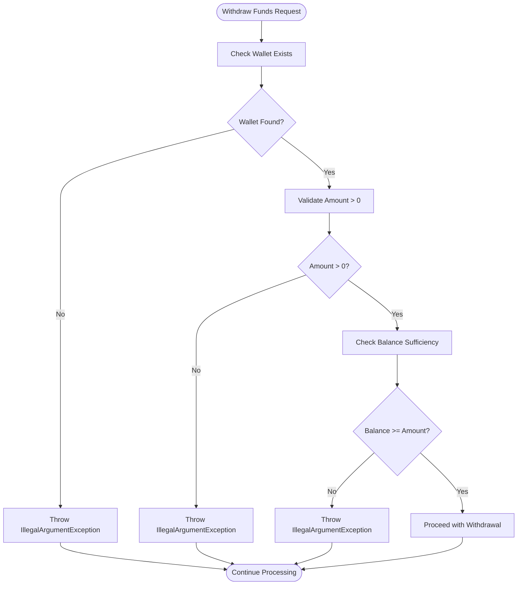
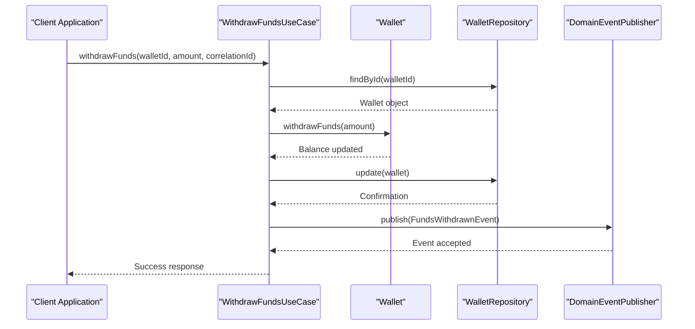
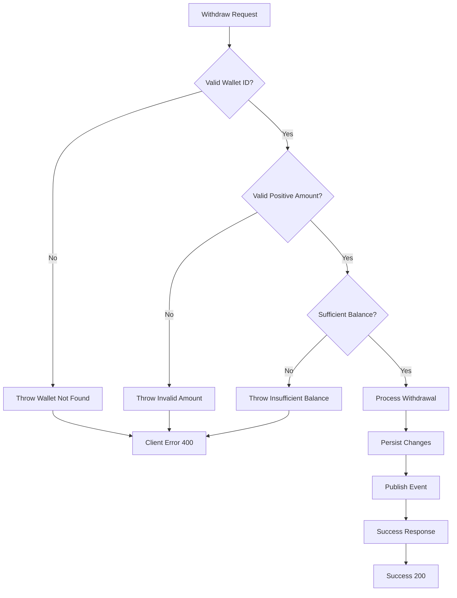
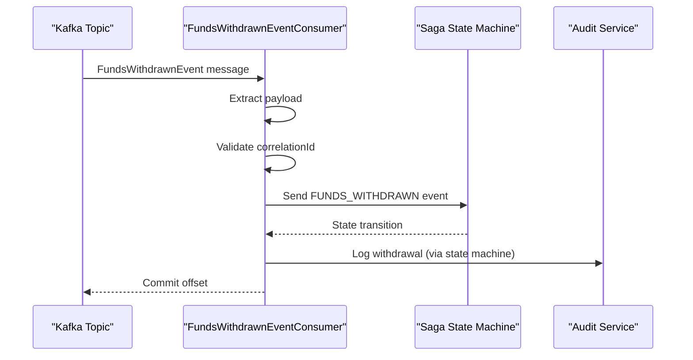

# Withdraw Funds

<cite>
**Referenced Files in This Document**   
- [WithdrawFundsUseCase.java](file://src/main/java/dev/bloco/wallet/hub/usecase/WithdrawFundsUseCase.java)
- [Wallet.java](file://src/main/java/dev/bloco/wallet/hub/domain/model/Wallet.java)
- [FundsWithdrawnEvent.java](file://src/main/java/dev/bloco/wallet/hub/domain/event/wallet/FundsWithdrawnEvent.java)
- [WalletRepository.java](file://src/main/java/dev/bloco/wallet/hub/domain/gateway/WalletRepository.java)
- [OutboxEventPublisher.java](file://src/main/java/dev/bloco/wallet/hub/infra/adapter/event/OutboxEventPublisher.java)
- [KafkaEventProducer.java](file://src/main/java/dev/bloco/wallet/hub/infra/adapter/event/producer/KafkaEventProducer.java)
- [FundsWithdrawnEventConsumer.java](file://src/main/java/dev/bloco/wallet/hub/infra/adapter/event/consumer/FundsWithdrawnEventConsumer.java)
- [WithdrawFundsUseCaseTest.java](file://src/test/java/dev/bloco/wallet/hub/usecase/WithdrawFundsUseCaseTest.java)
</cite>

## Table of Contents
1. [Introduction](#introduction)
2. [Business Rules and Validation](#business-rules-and-validation)
3. [Withdrawal Workflow](#withdrawal-workflow)
4. [Outbox Pattern for Reliable Event Delivery](#outbox-pattern-for-reliable-event-delivery)
5. [Exception Handling](#exception-handling)
6. [Event Consumption and Integration](#event-consumption-and-integration)
7. [Edge Cases and Reconciliation](#edge-cases-and-reconciliation)
8. [Unit Test Example](#unit-test-example)
9. [Conclusion](#conclusion)

## Introduction

The `WithdrawFundsUseCase` in the bloco-wallet-java application orchestrates the process of withdrawing funds from a user's wallet. This use case implements a transactional workflow that ensures data consistency and reliable event propagation across distributed systems. The process involves validating business rules, updating wallet state, persisting changes, and publishing domain events through a robust outbox pattern to guarantee eventual consistency with external systems such as audit services or settlement platforms.

**Section sources**
- [WithdrawFundsUseCase.java](file://src/main/java/dev/bloco/wallet/hub/usecase/WithdrawFundsUseCase.java#L1-L52)

## Business Rules and Validation

The withdrawal process enforces several critical business rules to maintain financial integrity and prevent invalid operations:

- **Balance Sufficiency**: The requested withdrawal amount must not exceed the available balance in the wallet.
- **Positive Amount Validation**: The withdrawal amount must be greater than zero.
- **Wallet Existence**: The wallet must exist in the system before any withdrawal can be processed.
- **Wallet Status**: Although not explicitly shown in the current implementation, wallet status (active/inactive) would typically be validated before processing.

These rules are enforced through a combination of domain model validation within the `Wallet` entity and use case-level checks. The `Wallet.withdrawFunds()` method contains the core business logic for balance validation, ensuring that withdrawals only proceed when sufficient funds are available.



**Diagram sources**
- [Wallet.java](file://src/main/java/dev/bloco/wallet/hub/domain/model/Wallet.java#L114-L120)
- [WithdrawFundsUseCase.java](file://src/main/java/dev/bloco/wallet/hub/usecase/WithdrawFundsUseCase.java#L30-L33)

**Section sources**
- [Wallet.java](file://src/main/java/dev/bloco/wallet/hub/domain/model/Wallet.java#L114-L120)
- [WithdrawFundsUseCase.java](file://src/main/java/dev/bloco/wallet/hub/usecase/WithdrawFundsUseCase.java#L30-L33)

## Withdrawal Workflow

The withdrawal workflow follows a sequential process that ensures atomicity and consistency:

1. **Wallet Loading**: The use case retrieves the wallet from persistence using `WalletRepository.findById()`.
2. **Fund Deduction**: The `Wallet.withdrawFunds()` method is called to deduct the specified amount from the wallet's balance.
3. **State Persistence**: The updated wallet state is persisted back to the database via `WalletRepository.update()`.
4. **Event Publication**: A `FundsWithdrawnEvent` is created and published through the domain event system.

This workflow ensures that all operations occur within a single transactional context, preventing partial updates and maintaining data consistency. The use of domain events decouples the withdrawal operation from downstream processing, allowing for scalable and maintainable architecture.



**Diagram sources**
- [WithdrawFundsUseCase.java](file://src/main/java/dev/bloco/wallet/hub/usecase/WithdrawFundsUseCase.java#L30-L37)
- [WalletRepository.java](file://src/main/java/dev/bloco/wallet/hub/domain/gateway/WalletRepository.java#L10-L12)

**Section sources**
- [WithdrawFundsUseCase.java](file://src/main/java/dev/bloco/wallet/hub/usecase/WithdrawFundsUseCase.java#L30-L37)
- [WalletRepository.java](file://src/main/java/dev/bloco/wallet/hub/domain/gateway/WalletRepository.java#L10-L12)

## Outbox Pattern for Reliable Event Delivery

The system implements the outbox pattern to ensure reliable delivery of domain events to Kafka, addressing the challenge of maintaining consistency between database transactions and message publishing.

The `OutboxEventPublisher` serves as the primary mechanism for event persistence. When `publish()` is called with a `FundsWithdrawnEvent`, it:

1. Serializes the event to JSON format using `ObjectMapper`
2. Creates an `OutboxEvent` entity containing the event type and serialized payload
3. Persists the outbox event within the same transaction as the wallet update

The `KafkaEventProducer` periodically processes unsent events from the outbox table (every 5 seconds) and forwards them to Kafka using Spring Cloud Stream's `StreamBridge`. This decoupled approach ensures that even if Kafka is temporarily unavailable, events are not lost and will be delivered once connectivity is restored.

```mermaid
graph TB
subgraph "Application Database"
WalletTable[(Wallet)]
OutboxTable[(Outbox Events)]
end
subgraph "Event Processing"
Publisher[OutboxEventPublisher]
Producer[KafkaEventProducer]
Kafka[(Kafka)]
end
UseCase --> Publisher: publish(event)
Publisher --> OutboxTable: Insert serialized event
Producer --> OutboxTable: SELECT unsent events
Producer --> Kafka: Send to topic
Kafka --> Producer: Acknowledgment
Producer --> OutboxTable: Mark as sent
style OutboxTable fill:#f9f,stroke:#333
style Kafka fill:#bbf,stroke:#333
```

**Diagram sources**
- [OutboxEventPublisher.java](file://src/main/java/dev/bloco/wallet/hub/infra/adapter/event/OutboxEventPublisher.java#L60-L74)
- [KafkaEventProducer.java](file://src/main/java/dev/bloco/wallet/hub/infra/adapter/event/producer/KafkaEventProducer.java#L135-L151)

**Section sources**
- [OutboxEventPublisher.java](file://src/main/java/dev/bloco/wallet/hub/infra/adapter/event/OutboxEventPublisher.java#L60-L74)
- [KafkaEventProducer.java](file://src/main/java/dev/bloco/wallet/hub/infra/adapter/event/producer/KafkaEventProducer.java#L135-L151)

## Exception Handling

The withdrawal process implements comprehensive exception handling to maintain system integrity and provide meaningful feedback:

- **Wallet Not Found**: When `findById()` returns empty, an `IllegalArgumentException` is thrown with message "Wallet not found"
- **Insufficient Balance**: The `Wallet.withdrawFunds()` method validates that the withdrawal amount does not exceed the available balance, throwing `IllegalArgumentException` with message "Insufficient balance or invalid amount"
- **Invalid Amount**: Attempts to withdraw zero or negative amounts are rejected with appropriate validation messages
- **Serialization Errors**: If event serialization fails in `OutboxEventPublisher`, a `RuntimeException` is thrown and logged

The use case does not catch these exceptions, allowing them to propagate to higher layers for appropriate handling (e.g., HTTP 400 responses in API controllers). This approach ensures that invalid operations are rejected early and prevents partial state changes.



**Diagram sources**
- [WithdrawFundsUseCase.java](file://src/main/java/dev/bloco/wallet/hub/usecase/WithdrawFundsUseCase.java#L30-L33)
- [Wallet.java](file://src/main/java/dev/bloco/wallet/hub/domain/model/Wallet.java#L114-L120)

**Section sources**
- [WithdrawFundsUseCase.java](file://src/main/java/dev/bloco/wallet/hub/usecase/WithdrawFundsUseCase.java#L30-L33)
- [Wallet.java](file://src/main/java/dev/bloco/wallet/hub/domain/model/Wallet.java#L114-L120)

## Event Consumption and Integration

The `FundsWithdrawnEventConsumer` processes `FundsWithdrawnEvent` messages from Kafka, enabling integration with external systems for audit logging, settlement, or other business processes.

The consumer interacts with a state machine to manage saga workflows, particularly for complex financial operations that span multiple services. When a `FundsWithdrawnEvent` is received:

1. The consumer extracts the event payload from the Kafka message
2. It validates the presence of a correlation ID for operation tracking
3. It sends a `FUNDS_WITHDRAWN` event to the state machine with the correlation ID as a header
4. The state machine transitions to the appropriate state based on the withdrawal

This integration pattern enables reliable audit trails and facilitates reconciliation processes by ensuring that every successful withdrawal is recorded in external systems. The use of correlation IDs allows for end-to-end tracing of withdrawal operations across service boundaries.



**Diagram sources**
- [FundsWithdrawnEventConsumer.java](file://src/main/java/dev/bloco/wallet/hub/infra/adapter/event/consumer/FundsWithdrawnEventConsumer.java#L55-L75)
- [KafkaEventProducer.java](file://src/main/java/dev/bloco/wallet/hub/infra/adapter/event/producer/KafkaEventProducer.java#L110-L125)

**Section sources**
- [FundsWithdrawnEventConsumer.java](file://src/main/java/dev/bloco/wallet/hub/infra/adapter/event/consumer/FundsWithdrawnEventConsumer.java#L55-L75)

## Edge Cases and Reconciliation

The system addresses several critical edge cases to ensure financial accuracy and system reliability:

- **Partial Failures**: The transactional boundary around wallet update and outbox event persistence prevents partial updates. If the database transaction fails, neither the balance update nor the event publication occurs.
- **Double-Spending Prevention**: The `Wallet.withdrawFunds()` method includes balance validation that prevents withdrawals exceeding available funds, eliminating the risk of double-spending.
- **Event Duplication**: The outbox pattern with "at-least-once" delivery semantics means events may be delivered multiple times. Consumers must be idempotent, using correlation IDs to detect and ignore duplicate events.
- **Reconciliation Mechanisms**: The combination of database records and persisted outbox events enables reconciliation between financial state and event history. Discrepancies can be identified by comparing wallet balances with the sum of all fund movement events.

The system does not currently implement explicit idempotency keys for withdrawal requests, which could be a potential enhancement to prevent accidental duplicate withdrawals from client retries.

**Section sources**
- [WithdrawFundsUseCase.java](file://src/main/java/dev/bloco/wallet/hub/usecase/WithdrawFundsUseCase.java#L30-L37)
- [OutboxEventPublisher.java](file://src/main/java/dev/bloco/wallet/hub/infra/adapter/event/OutboxEventPublisher.java#L60-L74)

## Unit Test Example

The `WithdrawFundsUseCaseTest` provides comprehensive test coverage for the withdrawal functionality, demonstrating both successful and failure scenarios:

- **Successful Withdrawal**: Verifies that the wallet balance is correctly updated, the wallet is persisted, and a `FundsWithdrawnEvent` is published with the correct details (wallet ID, amount, correlation ID)
- **Wallet Not Found**: Confirms that attempting to withdraw from a non-existent wallet throws an `IllegalArgumentException` and that no side effects occur (no updates, no events published)
- **Insufficient Balance**: Validates that withdrawal attempts exceeding the available balance are rejected with appropriate exceptions and that the wallet state remains unchanged

These tests use mocking to isolate the use case from its dependencies, ensuring that the business logic is tested independently of the persistence and messaging infrastructure.

```mermaid
flowchart TD
Test[WithdrawFundsUseCaseTest] --> Success["withdrawFunds_success()"]
Test --> NotFound["withdrawFunds_walletNotFound()"]
Test --> Insufficient["withdrawFunds_insufficientBalance()"]
Success --> Mock[Mock WalletRepository, EventPublisher]
Success --> Execute[Call withdrawFunds()]
Success --> Assert[Verify balance, update, event]
NotFound --> Mock
NotFound --> Execute
NotFound --> Expect[Expect IllegalArgumentException]
NotFound --> Verify[Verify no side effects]
Insufficient --> Mock
Insufficient --> Setup[Set balance < withdrawal amount]
Insufficient --> Execute
Insufficient --> Expect
Insufficient --> Verify
style Success fill:#cfc
style NotFound fill:#fcc
style Insufficient fill:#fcc
```

**Diagram sources**
- [WithdrawFundsUseCaseTest.java](file://src/test/java/dev/bloco/wallet/hub/usecase/WithdrawFundsUseCaseTest.java#L15-L97)

**Section sources**
- [WithdrawFundsUseCaseTest.java](file://src/test/java/dev/bloco/wallet/hub/usecase/WithdrawFundsUseCaseTest.java#L15-L97)

## Conclusion

The `WithdrawFundsUseCase` in bloco-wallet-java implements a robust and reliable fund withdrawal process that balances business requirements with technical excellence. By combining domain-driven design principles with the outbox pattern, the system ensures data consistency while enabling reliable event-driven integration with external services.

Key strengths of the implementation include:
- Clear separation of concerns between use case, domain model, and infrastructure
- Transactional integrity through coordinated database and outbox updates
- Reliable event delivery via the outbox pattern and scheduled processing
- Comprehensive error handling that maintains system consistency
- Testable design with well-defined boundaries and dependencies

Potential areas for enhancement include implementing idempotency keys for withdrawal requests and adding explicit wallet status validation to prevent withdrawals from inactive accounts.