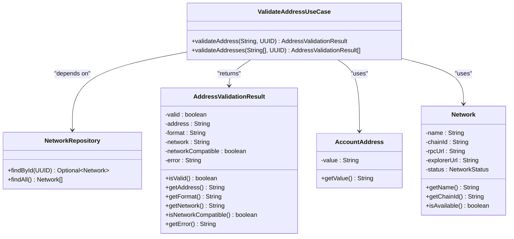

# Validate Address

<cite>
**Referenced Files in This Document**
- [ValidateAddressUseCase.java](file://src/main/java/dev/bloco/wallet/hub/usecase/ValidateAddressUseCase.java)
- [ValidateAddressUseCaseTest.java](file://src/test/java/dev/bloco/wallet/hub/usecase/ValidateAddressUseCaseTest.java)
- [AccountAddress.java](file://src/main/java/dev/bloco/wallet/hub/domain/model/address/AccountAddress.java)
- [NetworkRepository.java](file://src/main/java/dev/bloco/wallet/hub/domain/gateway/NetworkRepository.java)
- [Network.java](file://src/main/java/dev/bloco/wallet/hub/domain/model/network/Network.java)
</cite>

## Table of Contents
1. [Introduction](#introduction)
2. [Core Components](#core-components)
3. [Validation Logic](#validation-logic)
4. [API Interface](#api-interface)
5. [Usage Examples](#usage-examples)
6. [Troubleshooting Guide](#troubleshooting-guide)

## Introduction

The ValidateAddressUseCase is a critical component in the blockchain wallet system responsible for validating address formats and ensuring network compatibility. This use case provides comprehensive validation capabilities for different blockchain networks, with specific support for Ethereum and Bitcoin address formats. The implementation follows domain-driven design principles and integrates seamlessly with the wallet's network management system.

The primary purpose of this use case is to ensure that addresses entered by users are both syntactically correct and compatible with the intended blockchain network before any transaction operations proceed. This prevents common user errors such as sending funds to an incompatible address format or using an invalid address structure.

**Section sources**
- [ValidateAddressUseCase.java](file://src/main/java/dev/bloco/wallet/hub/usecase/ValidateAddressUseCase.java#L1-L30)

## Core Components

The ValidateAddressUseCase relies on several key components to perform its validation functions:

- **NetworkRepository**: Provides access to network configuration data including network names, chain IDs, and status information
- **AccountAddress**: Represents a blockchain address entity with built-in validation rules
- **Network**: Contains network metadata used for compatibility checking
- **AddressValidationResult**: Immutable result object containing detailed validation information

The use case follows a record-based design pattern, making it immutable and thread-safe by default. It accepts a NetworkRepository dependency through constructor injection, enabling dependency inversion and facilitating unit testing.



**Diagram sources**
- [ValidateAddressUseCase.java](file://src/main/java/dev/bloco/wallet/hub/usecase/ValidateAddressUseCase.java#L20-L185)
- [AccountAddress.java](file://src/main/java/dev/bloco/wallet/hub/domain/model/address/AccountAddress.java#L4-L41)
- [NetworkRepository.java](file://src/main/java/dev/bloco/wallet/hub/domain/gateway/NetworkRepository.java#L9-L27)
- [Network.java](file://src/main/java/dev/bloco/wallet/hub/domain/model/network/Network.java#L7-L114)

**Section sources**
- [ValidateAddressUseCase.java](file://src/main/java/dev/bloco/wallet/hub/usecase/ValidateAddressUseCase.java#L20-L185)
- [AccountAddress.java](file://src/main/java/dev/bloco/wallet/hub/domain/model/address/AccountAddress.java#L4-L41)

## Validation Logic

The validation process consists of two main phases: format detection and network compatibility checking. The system first determines the address format based on regular expression patterns, then verifies whether the detected format is compatible with the specified network.

### Format Detection Rules

The system implements specific regex patterns to identify different address formats:

- **Ethereum**: `^0x[a-fA-F0-9]{40}$` - Hexadecimal addresses starting with 0x followed by exactly 40 hex characters
- **Bitcoin Legacy**: `^[13][a-km-zA-HJ-NP-Z1-9]{25,34}$` - Base58Check encoded addresses starting with 1 or 3
- **Bitcoin Bech32**: `^bc1[a-z0-9]{39,59}$` - SegWit addresses starting with bc1
- **Generic Hexadecimal**: `^[a-fA-F0-9]+$` - Any hexadecimal string


**Diagram sources**
- [ValidateAddressUseCase.java](file://src/main/java/dev/bloco/wallet/hub/usecase/ValidateAddressUseCase.java#L96-L131)
- [ValidateAddressUseCase.java](file://src/main/java/dev/bloco/wallet/hub/usecase/ValidateAddressUseCase.java#L35-L65)

**Section sources**
- [ValidateAddressUseCase.java](file://src/main/java/dev/bloco/wallet/hub/usecase/ValidateAddressUseCase.java#L96-L131)

## API Interface

The ValidateAddressUseCase provides a clean and intuitive API for address validation operations. The interface supports both single and batch validation scenarios, making it flexible for various use cases within the wallet application.

### Single Address Validation

```java
public AddressValidationResult validateAddress(String addressValue, UUID networkId)
```

Validates a single address against optional network constraints. Returns detailed validation information including format type and network compatibility status.

### Batch Address Validation

```java
public AddressValidationResult[] validateAddresses(String[] addresses, UUID networkId)
```

Performs validation on multiple addresses simultaneously, returning an array of results. This method efficiently processes each address through the same validation pipeline used for single address checks.

### Validation Result Structure

The AddressValidationResult class uses the Builder pattern to create immutable result objects with the following properties:

| Property | Type | Description |
|---------|------|-------------|
| valid | boolean | Overall validity of the address format |
| address | String | The original address value being validated |
| format | String | Detected address format (Ethereum, Bitcoin Legacy, etc.) |
| network | String | Name of the network being validated against |
| networkCompatible | boolean | Whether the address format is compatible with the network |
| error | String | Error message if validation failed |

**Section sources**
- [ValidateAddressUseCase.java](file://src/main/java/dev/bloco/wallet/hub/usecase/ValidateAddressUseCase.java#L50-L65)
- [ValidateAddressUseCase.java](file://src/main/java/dev/bloco/wallet/hub/usecase/ValidateAddressUseCase.java#L133-L185)

## Usage Examples

### Validating an Ethereum Address

```java
// Example: Validating an Ethereum address on the Ethereum network
String ethereumAddress = "0x742dB5C8A5d8c837e95C5fc73D3DCFFF84C8b742";
UUID ethereumNetworkId = UUID.fromString("f8e8b9c7-a6b5-4c3d-8e7f-6a5b4c3d2e1f");

AddressValidationResult result = validateAddressUseCase.validateAddress(
    ethereumAddress, 
    ethereumNetworkId
);

// Result:
// valid = true
// format = "Ethereum"
// network = "Ethereum"
// networkCompatible = true
```

### Validating a Bitcoin Address

```java
// Example: Validating a Bitcoin Legacy address on the Bitcoin network
String bitcoinAddress = "1A1zP1eP5QGefi2DMPTfTL5SLmv7DivfNa";
UUID bitcoinNetworkId = UUID.fromString("c3d2e1f6-a5b4-4c3d-8e7f-6a5b4c3d2e1f");

AddressValidationResult result = validateAddressUseCase.validateAddress(
    bitcoinAddress, 
    bitcoinNetworkId
);

// Result:
// valid = true
// format = "Bitcoin Legacy"
// network = "Bitcoin"
// networkCompatible = true
```

### Batch Validation

```java
// Example: Batch validation of mixed address types
String[] addresses = {
    "0x742dB5C8A5d8c837e95C5fc73D3DCFFF84C8b742", // Ethereum
    "1A1zP1eP5QGefi2DMPTfTL5SLmv7DivfNa",         // Bitcoin
    "invalid-address"                              // Invalid
};

AddressValidationResult[] results = validateAddressUseCase.validateAddresses(
    addresses, 
    ethereumNetworkId
);

// Process results array to handle each validation outcome
for (AddressValidationResult result : results) {
    if (!result.isValid()) {
        System.out.println("Invalid address: " + result.getAddress());
    } else if (!result.isNetworkCompatible()) {
        System.out.println("Address format valid but incompatible with network: " + 
                          result.getAddress());
    }
}
```

### Network-Agnostic Validation

```java
// Example: Format-only validation without network specification
String address = "0x742dB5C8A5d8c837e95C5fc73D3DCFFF84C8b742";

AddressValidationResult result = validateAddressUseCase.validateAddress(
    address, 
    null  // No network specified
);

// When no network is specified, compatibility depends only on format validity
// network = "Unknown"
// networkCompatible = true (if format is valid)
```

**Section sources**
- [ValidateAddressUseCaseTest.java](file://src/test/java/dev/bloco/wallet/hub/usecase/ValidateAddressUseCaseTest.java#L43-L71)
- [ValidateAddressUseCaseTest.java](file://src/test/java/dev/bloco/wallet/hub/usecase/ValidateAddressUseCaseTest.java#L73-L110)
- [ValidateAddressUseCaseTest.java](file://src/test/java/dev/bloco/wallet/hub/usecase/ValidateAddressUseCaseTest.java#L112-L141)

## Troubleshooting Guide

This section addresses common validation issues and their solutions.

### Common Validation Failures

#### Empty or Null Addresses
**Symptom**: `IllegalArgumentException` with message "Address value must be provided"
**Solution**: Ensure the address string is not null or empty before validation. Implement frontend validation to catch this early.

#### Unknown Address Format
**Symptom**: Validation result shows format = "Unknown"
**Causes**:
- Typographical errors in the address
- Unsupported address format
- Missing prefix (e.g., forgetting 0x for Ethereum addresses)

**Solutions**:
- Verify the address was copied correctly from the source
- Check that the address format is supported by the system
- For Ethereum addresses, ensure they start with 0x

#### Network Incompatibility
**Symptom**: Valid format but networkCompatible = false
**Example**: Valid Bitcoin address being validated against an Ethereum network
**Solution**: Confirm that the selected network matches the address type. The system will accept the address format but flag it as incompatible with the current network context.

### Edge Cases

#### Case Sensitivity
Ethereum addresses are case-insensitive but typically represented with checksummed casing. The validation system accepts both uppercase and lowercase hex characters.

#### Whitespace Handling
The validation automatically trims whitespace from address inputs. However, excessive whitespace may indicate a copy-paste error from certain sources.

#### Partial Addresses
Addresses that are truncated or incomplete will fail format validation. Ensure the complete address is provided (42 characters for Ethereum including 0x prefix).

**Section sources**
- [ValidateAddressUseCase.java](file://src/main/java/dev/bloco/wallet/hub/usecase/ValidateAddressUseCase.java#L67-L94)
- [ValidateAddressUseCaseTest.java](file://src/test/java/dev/bloco/wallet/hub/usecase/ValidateAddressUseCaseTest.java#L73-L85)