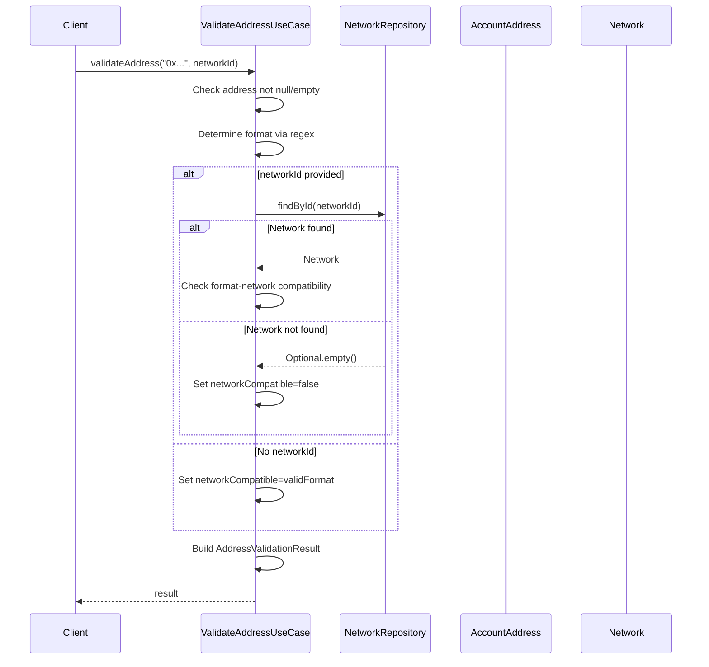
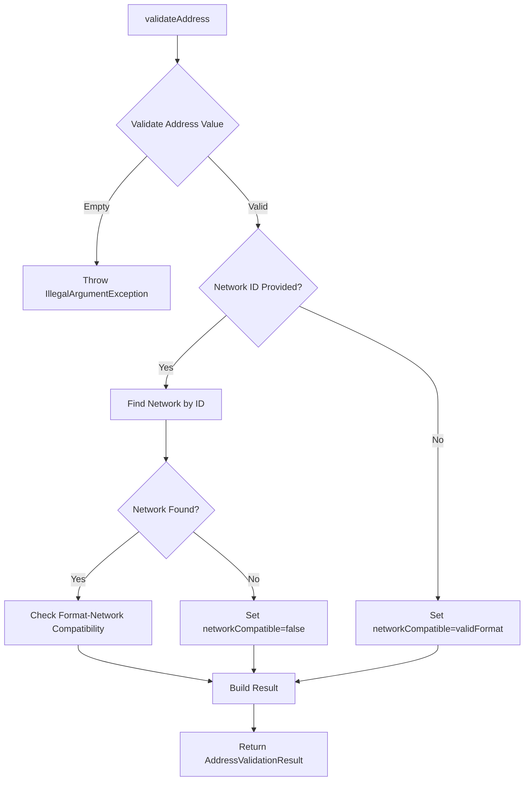

# Wallet Management

<cite>
**Referenced Files in This Document**   
- [Wallet.java](file://src/main/java/dev/bloco/wallet/hub/domain/model/Wallet.java) - *Updated in recent commit*
- [CreateWalletUseCase.java](file://src/main/java/dev/bloco/wallet/hub/usecase/CreateWalletUseCase.java)
- [UpdateWalletUseCase.java](file://src/main/java/dev/bloco/wallet/hub/usecase/UpdateWalletUseCase.java)
- [ActivateWalletUseCase.java](file://src/main/java/dev/bloco/wallet/hub/usecase/ActivateWalletUseCase.java)
- [DeactivateWalletUseCase.java](file://src/main/java/dev/bloco/wallet/hub/usecase/DeactivateWalletUseCase.java)
- [DeleteWalletUseCase.java](file://src/main/java/dev/bloco/wallet/hub/usecase/DeleteWalletUseCase.java)
- [ListWalletsUseCase.java](file://src/main/java/dev/bloco/wallet/hub/usecase/ListWalletsUseCase.java)
- [GetWalletDetailsUseCase.java](file://src/main/java/dev/bloco/wallet/hub/usecase/GetWalletDetailsUseCase.java)
- [RecoverWalletUseCase.java](file://src/main/java/dev/bloco/wallet/hub/usecase/RecoverWalletUseCase.java)
- [WalletRepository.java](file://src/main/java/dev/bloco/wallet/hub/domain/gateway/WalletRepository.java)
- [JpaWalletRepository.java](file://src/main/java/dev/bloco/wallet/hub/infra/provider/data/repository/JpaWalletRepository.java)
- [WalletStatus.java](file://src/main/java/dev/bloco/wallet/hub/domain/model/wallet/WalletStatus.java)
- [WalletCreatedEvent.java](file://src/main/java/dev/bloco/wallet/hub/domain/event/wallet/WalletCreatedEvent.java)
- [WalletUpdatedEvent.java](file://src/main/java/dev/bloco/wallet/hub/domain/event/wallet/WalletUpdatedEvent.java)
- [WalletStatusChangedEvent.java](file://src/main/java/dev/bloco/wallet/hub/domain/event/wallet/WalletStatusChangedEvent.java)
- [WalletDeletedEvent.java](file://src/main/java/dev/bloco/wallet/hub/domain/event/wallet/WalletDeletedEvent.java)
- [WalletRecoveryInitiatedEvent.java](file://src/main/java/dev/bloco/wallet/hub/domain/event/wallet/WalletRecoveryInitiatedEvent.java)
- [ValidateAddressUseCase.java](file://src/main/java/dev/bloco/wallet/hub/usecase/ValidateAddressUseCase.java) - *Added in recent commit*
- [AccountAddress.java](file://src/main/java/dev/bloco/wallet/hub/domain/model/address/AccountAddress.java) - *Added in recent commit*
- [NetworkRepository.java](file://src/main/java/dev/bloco/wallet/hub/domain/gateway/NetworkRepository.java) - *Added in recent commit*
- [Network.java](file://src/main/java/dev/bloco/wallet/hub/domain/model/network/Network.java) - *Added in recent commit*
</cite>

## Table of Contents
1. [Introduction](#introduction)
2. [Wallet Lifecycle Operations](#wallet-lifecycle-operations)
3. [Core Components](#core-components)
4. [API Interfaces](#api-interfaces)
5. [Integration Patterns](#integration-patterns)
6. [Practical Examples](#practical-examples)
7. [Troubleshooting Guide](#troubleshooting-guide)
8. [Conclusion](#conclusion)

## Introduction

The Wallet Management system provides comprehensive functionality for managing digital wallets throughout their lifecycle. This documentation covers the implementation details, API interfaces, and integration patterns for wallet operations including creation, update, activation, deactivation, deletion, listing, details retrieval, and recovery. The system follows domain-driven design principles with clear separation between use cases, domain models, and infrastructure components.

The wallet system supports various states including ACTIVE, INACTIVE, DELETED, RECOVERING, and LOCKED, allowing for flexible management of wallet operations while maintaining audit trails through domain events. All operations are designed to be idempotent and follow consistent error handling patterns.

**Section sources**
- [Wallet.java](file://src/main/java/dev/bloco/wallet/hub/domain/model/Wallet.java#L27-L242)
- [WalletStatus.java](file://src/main/java/dev/bloco/wallet/hub/domain/model/wallet/WalletStatus.java#L7-L37)

## Wallet Lifecycle Operations

The wallet system supports a comprehensive set of lifecycle operations that enable full management of wallet instances. Each operation follows a consistent pattern of validation, state transition, persistence, and event publishing.

### Wallet Creation
Wallet creation initializes a new wallet instance with default values and ACTIVE status. The system generates a unique identifier and sets initial metadata including creation timestamp and zero balance.

### Wallet Update
Wallet update operations modify wallet metadata such as name and description. The system validates that the wallet exists and is in an active state before applying updates.

### Wallet Activation and Deactivation
Wallets can be activated and deactivated to control their operational state. Activation enables all wallet operations, while deactivation restricts functionality. Only non-deleted wallets can be activated or deactivated.

### Wallet Deletion
The system implements soft deletion, where wallets are marked as DELETED but retained for audit purposes. A wallet must have zero balance before it can be deleted.

### Wallet Recovery
Wallet recovery allows users to restore wallets from backup or seed phrase. The recovery process creates a wallet in RECOVERING state, which can later be activated.

### Wallet Status Management
Wallets can exist in multiple states: ACTIVE, INACTIVE, DELETED, RECOVERING, and LOCKED. Each state transition is recorded through domain events for audit and integration purposes.

**Section sources**
- [Wallet.java](file://src/main/java/dev/bloco/wallet/hub/domain/model/Wallet.java#L144-L180)
- [WalletStatus.java](file://src/main/java/dev/bloco/wallet/hub/domain/model/wallet/WalletStatus.java#L7-L37)

## Core Components

The wallet management system consists of several core components that work together to provide comprehensive wallet functionality.

### Wallet Domain Model
The Wallet class represents the core domain entity that encapsulates wallet data and behavior. It extends AggregateRoot to support domain event publishing and maintains key properties including:

- **id**: Unique identifier (UUID)
- **name**: Wallet name
- **description**: Wallet description
- **balance**: Current balance (BigDecimal)
- **status**: Current wallet status (WalletStatus)
- **createdAt/updatedAt**: Timestamps for creation and last update
- **addressIds**: Set of associated address identifiers

The domain model implements business logic for state transitions and validates operations based on current wallet status.


**Diagram sources**
- [Wallet.java](file://src/main/java/dev/bloco/wallet/hub/domain/model/Wallet.java#L27-L242)
- [AggregateRoot.java](file://src/main/java/dev/bloco/wallet/hub/domain/model/common/AggregateRoot.java#L9-L27)

### Wallet Status Enumeration
The WalletStatus enum defines the possible states a wallet can be in:

- **ACTIVE**: Wallet is fully operational
- **INACTIVE**: Wallet is temporarily disabled
- **DELETED**: Wallet is soft-deleted (retained for audit)
- **RECOVERING**: Wallet is being restored from backup
- **LOCKED**: Wallet is locked due to security concerns

Each status transition is validated to ensure business rules are enforced.


**Diagram sources**
- [WalletStatus.java](file://src/main/java/dev/bloco/wallet/hub/domain/model/wallet/WalletStatus.java#L7-L37)
- [Wallet.java](file://src/main/java/dev/bloco/wallet/hub/domain/model/Wallet.java#L144-L180)

### Domain Events
The system uses domain events to communicate state changes and support integration with other components. Key events include:

- **WalletCreatedEvent**: Published when a new wallet is created
- **WalletUpdatedEvent**: Published when wallet metadata is updated
- **WalletStatusChangedEvent**: Published when wallet status changes
- **WalletDeletedEvent**: Published when a wallet is deleted
- **WalletRecoveryInitiatedEvent**: Published when wallet recovery begins

These events contain correlation IDs for tracing operations across the system.


**Diagram sources**
- [WalletCreatedEvent.java](file://src/main/java/dev/bloco/wallet/hub/domain/event/wallet/WalletCreatedEvent.java#L18-L38)
- [WalletUpdatedEvent.java](file://src/main/java/dev/bloco/wallet/hub/domain/event/wallet/WalletUpdatedEvent.java#L8-L21)
- [WalletStatusChangedEvent.java](file://src/main/java/dev/bloco/wallet/hub/domain/event/wallet/WalletStatusChangedEvent.java#L13-L28)
- [WalletDeletedEvent.java](file://src/main/java/dev/bloco/wallet/hub/domain/event/wallet/WalletDeletedEvent.java#L12-L23)
- [WalletRecoveryInitiatedEvent.java](file://src/main/java/dev/bloco/wallet/hub/domain/event/wallet/WalletRecoveryInitiatedEvent.java#L12-L25)

### Validate Address Use Case
The `ValidateAddressUseCase` is responsible for validating blockchain address formats and network compatibility.

**Invocation Flow:**
1. Client calls `validateAddress(addressValue, networkId)`
2. Input validation checks for null or empty address
3. Address format is determined using regex patterns
4. If networkId provided, network is retrieved from `NetworkRepository`
5. Compatibility between address format and network is evaluated
6. `AddressValidationResult` is constructed with validation details
7. Result is returned to caller

**Input Parameters:**
- `addressValue`: String representation of the blockchain address
- `networkId`: Optional UUID of the target network for compatibility checking

**Business Rules:**
- Address value must be provided (not null or empty)
- Format validation uses predefined regex patterns for different address types
- Network compatibility is checked when networkId is provided
- Validation does not publish domain events (pure query operation)

**Domain Interactions:**
- Uses `NetworkRepository.findById()` when network-specific validation is requested
- Creates `AccountAddress` value object for basic validation
- Returns `AddressValidationResult` DTO with detailed validation information



**Diagram sources**
- [ValidateAddressUseCase.java](file://src/main/java/dev/bloco/wallet/hub/usecase/ValidateAddressUseCase.java#L45-L85)
- [AccountAddress.java](file://src/main/java/dev/bloco/wallet/hub/domain/model/address/AccountAddress.java#L7-L10)
- [Network.java](file://src/main/java/dev/bloco/wallet/hub/domain/model/network/Network.java#L24-L36)
- [NetworkRepository.java](file://src/main/java/dev/bloco/wallet/hub/domain/gateway/NetworkRepository.java#L12-L14)

**Section sources**
- [ValidateAddressUseCase.java](file://src/main/java/dev/bloco/wallet/hub/usecase/ValidateAddressUseCase.java#L1-L185)
- [ValidateAddressUseCaseTest.java](file://src/test/java/dev/bloco/wallet/hub/usecase/ValidateAddressUseCaseTest.java#L20-L171)

## API Interfaces

The wallet management system provides a set of use case classes that define the API interfaces for wallet operations.

### CreateWalletUseCase
Handles wallet creation operations.


**Section sources**
- [CreateWalletUseCase.java](file://src/main/java/dev/bloco/wallet/hub/usecase/CreateWalletUseCase.java#L1-L42)

### UpdateWalletUseCase
Handles wallet update operations.


**Section sources**
- [UpdateWalletUseCase.java](file://src/main/java/dev/bloco/wallet/hub/usecase/UpdateWalletUseCase.java#L1-L56)

### ActivateWalletUseCase
Handles wallet activation operations.


**Section sources**
- [ActivateWalletUseCase.java](file://src/main/java/dev/bloco/wallet/hub/usecase/ActivateWalletUseCase.java#L1-L49)

### DeactivateWalletUseCase
Handles wallet deactivation operations.


**Section sources**
- [DeactivateWalletUseCase.java](file://src/main/java/dev/bloco/wallet/hub/usecase/DeactivateWalletUseCase.java#L1-L49)

### DeleteWalletUseCase
Handles wallet deletion operations.


**Section sources**
- [DeleteWalletUseCase.java](file://src/main/java/dev/bloco/wallet/hub/usecase/DeleteWalletUseCase.java#L1-L61)

### ListWalletsUseCase
Handles wallet listing operations with various filtering options.


**Section sources**
- [ListWalletsUseCase.java](file://src/main/java/dev/bloco/wallet/hub/usecase/ListWalletsUseCase.java#L1-L90)

### GetWalletDetailsUseCase
Handles wallet details retrieval operations.


**Section sources**
- [GetWalletDetailsUseCase.java](file://src/main/java/dev/bloco/wallet/hub/usecase/GetWalletDetailsUseCase.java#L1-L77)

### RecoverWalletUseCase
Handles wallet recovery operations.


**Section sources**
- [RecoverWalletUseCase.java](file://src/main/java/dev/bloco/wallet/hub/usecase/RecoverWalletUseCase.java#L1-L89)

### ValidateAddressUseCase
Handles address validation operations for blockchain addresses.



**Section sources**
- [ValidateAddressUseCase.java](file://src/main/java/dev/bloco/wallet/hub/usecase/ValidateAddressUseCase.java#L1-L185)
- [AccountAddress.java](file://src/main/java/dev/bloco/wallet/hub/domain/model/address/AccountAddress.java#L7-L10)
- [NetworkRepository.java](file://src/main/java/dev/bloco/wallet/hub/domain/gateway/NetworkRepository.java#L12-L14)

## Integration Patterns

The wallet management system follows several key integration patterns to ensure reliability and maintainability.

### Repository Pattern
The WalletRepository interface defines the contract for wallet persistence operations, with JpaWalletRepository providing the JPA implementation. This pattern separates domain logic from data access concerns.


**Diagram sources**
- [WalletRepository.java](file://src/main/java/dev/bloco/wallet/hub/domain/gateway/WalletRepository.java#L18-L39)
- [JpaWalletRepository.java](file://src/main/java/dev/bloco/wallet/hub/infra/provider/data/repository/JpaWalletRepository.java#L36-L140)
- [SpringDataWalletRepository.java](file://src/main/java/dev/bloco/wallet/hub/infra/provider/data/repository/SpringDataWalletRepository.java#L25-L26)
- [WalletMapper.java](file://src/main/java/dev/bloco/wallet/hub/infra/provider/mapper/WalletMapper.java#L31-L50)

### Domain Events and Event Sourcing
The system uses domain events to communicate state changes. Events are published through the DomainEventPublisher and can be consumed by other components.


**Diagram sources**
- [Wallet.java](file://src/main/java/dev/bloco/wallet/hub/domain/model/Wallet.java#L27-L242)
- [DomainEvent.java](file://src/main/java/dev/bloco/wallet/hub/domain/event/common/DomainEvent.java#L7-L18)
- [DomainEventPublisher.java](file://src/main/java/dev/bloco/wallet/hub/domain/gateway/DomainEventPublisher.java)

### Use Case Pattern
Each use case is implemented as a record class that encapsulates a specific business operation. This pattern provides clear separation of concerns and makes the API explicit.

```mermaid
classDiagram
class UseCase {
<<interface>>
}
class CreateWalletUseCase {
+WalletRepository walletRepository
+DomainEventPublisher eventPublisher
+createWallet(UUID, String) Wallet
}
class UpdateWalletUseCase {
+WalletRepository walletRepository
+DomainEventPublisher eventPublisher
+updateWallet(UUID, String, String, String) Wallet
}
class ActivateWalletUseCase {
+WalletRepository walletRepository
+DomainEventPublisher eventPublisher
+activateWallet(UUID, String) Wallet
}
class DeactivateWalletUseCase {
+WalletRepository walletRepository
+DomainEventPublisher eventPublisher
+deactivateWallet(UUID, String) Wallet
}
class DeleteWalletUseCase {
+WalletRepository walletRepository
+DomainEventPublisher eventPublisher
+deleteWallet(UUID, String, String) Wallet
}
class ListWalletsUseCase {
+WalletRepository walletRepository
+listActiveWallets(UUID) List<Wallet>
+listWallets(UUID) List<Wallet>
+listWalletsByStatus(UUID, WalletStatus) List<Wallet>
+listAllWallets(UUID) List<Wallet>
}
class GetWalletDetailsUseCase {
+WalletRepository walletRepository
+AddressRepository addressRepository
+getWalletDetails(UUID) Wallet
+getWallet(UUID, boolean) Wallet
+isWalletAccessible(UUID) boolean
}
class RecoverWalletUseCase {
+WalletRepository walletRepository
+DomainEventPublisher eventPublisher
+recoverWallet(UUID, String, String, String) Wallet
+completeRecovery(UUID, String) Wallet
}
class ValidateAddressUseCase {
+NetworkRepository networkRepository
+validateAddress(String, UUID, String) AddressValidationResult
+validateAddresses(String[], UUID, String) AddressValidationResult[]
}
CreateWalletUseCase --> UseCase : "implements"
UpdateWalletUseCase --> UseCase : "implements"
ActivateWalletUseCase --> UseCase : "implements"
DeactivateWalletUseCase --> UseCase : "implements"
DeleteWalletUseCase --> UseCase : "implements"
ListWalletsUseCase --> UseCase : "implements"
GetWalletDetailsUseCase --> UseCase : "implements"
RecoverWalletUseCase --> UseCase : "implements"
ValidateAddressUseCase --> UseCase : "implements"
```



**Diagram sources**
- [CreateWalletUseCase.java](file://src/main/java/dev/bloco/wallet/hub/usecase/CreateWalletUseCase.java#L1-L42)
- [UpdateWalletUseCase.java](file://src/main/java/dev/bloco/wallet/hub/usecase/UpdateWalletUseCase.java#L1-L56)
- [ActivateWalletUseCase.java](file://src/main/java/dev/bloco/wallet/hub/usecase/ActivateWalletUseCase.java#L1-L49)
- [DeactivateWalletUseCase.java](file://src/main/java/dev/bloco/wallet/hub/usecase/DeactivateWalletUseCase.java#L1-L49)
- [DeleteWalletUseCase.java](file://src/main/java/dev/bloco/wallet/hub/usecase/DeleteWalletUseCase.java#L1-L61)
- [ListWalletsUseCase.java](file://src/main/java/dev/bloco/wallet/hub/usecase/ListWalletsUseCase.java#L1-L90)
- [GetWalletDetailsUseCase.java](file://src/main/java/dev/bloco/wallet/hub/usecase/GetWalletDetailsUseCase.java#L1-L77)
- [RecoverWalletUseCase.java](file://src/main/java/dev/bloco/wallet/hub/usecase/RecoverWalletUseCase.java#L1-L89)
- [ValidateAddressUseCase.java](file://src/main/java/dev/bloco/wallet/hub/usecase/ValidateAddressUseCase.java#L1-L185)

## Practical Examples

### Creating a Wallet
```java
// Create an instance of CreateWalletUseCase
CreateWalletUseCase createWalletUseCase = new CreateWalletUseCase(walletRepository, eventPublisher);

// Create a new wallet
UUID userId = UUID.randomUUID();
String correlationId = UUID.randomUUID().toString();
Wallet wallet = createWalletUseCase.createWallet(userId, correlationId);

// The wallet is now created with default values
System.out.println("Created wallet: " + wallet.getId());
System.out.println("Status: " + wallet.getStatus()); // ACTIVE
System.out.println("Balance: " + wallet.getBalance()); // 0.00
```

### Updating Wallet Information
```java
// Create an instance of UpdateWalletUseCase
UpdateWalletUseCase updateWalletUseCase = new UpdateWalletUseCase(walletRepository, eventPublisher);

// Update wallet name and description
UUID walletId = UUID.fromString("123e4567-e89b-12d3-a456-426614174000");
String newName = "My Savings Wallet";
String newDescription = "Wallet for saving money";
String correlationId = UUID.randomUUID().toString();

try {
    Wallet updatedWallet = updateWalletUseCase.updateWallet(walletId, newName, newDescription, correlationId);
    System.out.println("Updated wallet: " + updatedWallet.getName());
    System.out.println("New description: " + updatedWallet.getDescription());
} catch (IllegalArgumentException e) {
    System.err.println("Failed to update wallet: " + e.getMessage());
} catch (IllegalStateException e) {
    System.err.println("Wallet is not active: " + e.getMessage());
}
```

### Activating a Wallet
```java
// Create an instance of ActivateWalletUseCase
ActivateWalletUseCase activateWalletUseCase = new ActivateWalletUseCase(walletRepository, eventPublisher);

// Activate a wallet
UUID walletId = UUID.fromString("123e4567-e89b-12d3-a456-426614174000");
String correlationId = UUID.randomUUID().toString();

try {
    Wallet activatedWallet = activateWalletUseCase.activateWallet(walletId, correlationId);
    System.out.println("Wallet activated: " + activatedWallet.getId());
    System.out.println("Status: " + activatedWallet.getStatus()); // ACTIVE
} catch (IllegalArgumentException e) {
    System.err.println("Wallet not found: " + e.getMessage());
} catch (IllegalStateException e) {
    System.err.println("Cannot activate deleted wallet: " + e.getMessage());
}
```

### Deactivating a Wallet
```java
// Create an instance of DeactivateWalletUseCase
DeactivateWalletUseCase deactivateWalletUseCase = new DeactivateWalletUseCase(walletRepository, eventPublisher);

// Deactivate a wallet
UUID walletId = UUID.fromString("123e4567-e89b-12d3-a456-426614174000");
String correlationId = UUID.randomUUID().toString();

try {
    Wallet deactivatedWallet = deactivateWalletUseCase.deactivateWallet(walletId, correlationId);
    System.out.println("Wallet deactivated: " + deactivatedWallet.getId());
    System.out.println("Status: " + deactivatedWallet.getStatus()); // INACTIVE
} catch (IllegalArgumentException e) {
    System.err.println("Wallet not found: " + e.getMessage());
} catch (IllegalStateException e) {
    System.err.println("Cannot deactivate deleted wallet: " + e.getMessage());
}
```

### Deleting a Wallet
```java
// Create an instance of DeleteWalletUseCase
DeleteWalletUseCase deleteWalletUseCase = new DeleteWalletUseCase(walletRepository, eventPublisher);

// Delete a wallet
UUID walletId = UUID.fromString("123e4567-e89b-12d3-a456-426614174000");
String reason = "User requested deletion";
String correlationId = UUID.randomUUID().toString();

try {
    Wallet deletedWallet = deleteWalletUseCase.deleteWallet(walletId, reason, correlationId);
    System.out.println("Wallet deleted: " + deletedWallet.getId());
    System.out.println("Status: " + deletedWallet.getStatus()); // DELETED
    System.out.println("Reason: " + reason);
} catch (IllegalArgumentException e) {
    System.err.println("Invalid parameters: " + e.getMessage());
} catch (IllegalStateException e) {
    System.err.println("Cannot delete wallet: " + e.getMessage());
}
```

### Listing Wallets
```java
// Create an instance of ListWalletsUseCase
ListWalletsUseCase listWalletsUseCase = new ListWalletsUseCase(walletRepository);

// List all active wallets for a user
UUID userId = UUID.fromString("123e4567-e89b-12d3-a456-426614174000");
List<Wallet> activeWallets = listWalletsUseCase.listActiveWallets(userId);

System.out.println("Active wallets: " + activeWallets.size());
for (Wallet wallet : activeWallets) {
    System.out.println("- " + wallet.getName() + " (" + wallet.getId() + ")");
}

// List wallets by status
List<Wallet> inactiveWallets = listWalletsUseCase.listWalletsByStatus(userId, WalletStatus.INACTIVE);
System.out.println("Inactive wallets: " + inactiveWallets.size());
```

### Recovering a Wallet
```java
// Create an instance of RecoverWalletUseCase
RecoverWalletUseCase recoverWalletUseCase = new RecoverWalletUseCase(walletRepository, eventPublisher);

// Initiate wallet recovery
UUID userId = UUID.fromString("123e4567-e89b-12d3-a456-426614174000");
String walletName = "Recovered Wallet";
String recoveryMethod = "seed_phrase";
String correlationId = UUID.randomUUID().toString();

try {
    Wallet recoveryWallet = recoverWalletUseCase.recoverWallet(userId, walletName, recoveryMethod, correlationId);
    System.out.println("Wallet recovery initiated: " + recoveryWallet.getId());
    System.out.println("Status: " + recoveryWallet.getStatus()); // RECOVERING
    System.out.println("Recovery method: " + recoveryMethod);
    
    // Later, complete the recovery process
    Wallet completedWallet = recoverWalletUseCase.completeRecovery(recoveryWallet.getId(), UUID.randomUUID().toString());
    System.out.println("Wallet recovery completed: " + completedWallet.getId());
    System.out.println("Status: " + completedWallet.getStatus()); // ACTIVE
} catch (IllegalArgumentException e) {
    System.err.println("Invalid parameters: " + e.getMessage());
}
```

### Validating Blockchain Addresses
```java
// Create an instance of ValidateAddressUseCase
ValidateAddressUseCase validateAddressUseCase = new ValidateAddressUseCase(networkRepository);

// Validate a single Ethereum address
String ethereumAddress = "0x742dB5C8A5d8c837e95C5fc73D3DCFFF84C8b742";
UUID networkId = UUID.fromString("ethereum-network-id");
String correlationId = UUID.randomUUID().toString();

AddressValidationResult result = validateAddressUseCase.validateAddress(
    ethereumAddress, networkId, correlationId);

System.out.println("Address valid: " + result.isValid());
System.out.println("Format: " + result.getFormat());
System.out.println("Network compatible: " + result.isNetworkCompatible());

// Validate multiple addresses at once
String[] addresses = {
    "0x742dB5C8A5d8c837e95C5fc73D3DCFFF84C8b742",
    "1A1zP1eP5QGefi2DMPTfTL5SLmv7DivfNa",
    "invalid-address-format"
};

AddressValidationResult[] results = validateAddressUseCase.validateAddresses(
    addresses, networkId, correlationId);

for (AddressValidationResult r : results) {
    System.out.println(r.getAddress() + " -> " + 
        (r.isValid() ? "Valid" : "Invalid") + 
        " (" + r.getFormat() + ")");
}
```

## Troubleshooting Guide

### Common Issues and Solutions

#### Wallet Not Found During Update
**Symptom**: `IllegalArgumentException` with message "Wallet not found"
**Cause**: The specified wallet ID does not exist in the repository
**Solution**: Verify the wallet ID is correct and the wallet was properly created

#### Cannot Activate Deleted Wallet
**Symptom**: `IllegalStateException` when calling activateWallet
**Cause**: Attempting to activate a wallet that has been soft-deleted
**Solution**: Deleted wallets cannot be reactivated; consider creating a new wallet instead

#### Insufficient Balance Error
**Symptom**: `IllegalArgumentException` with message "Insufficient balance or invalid amount"
**Cause**: Withdrawal or transfer amount exceeds available balance
**Solution**: Check current balance before initiating transaction

#### Invalid Address Format
**Symptom**: Address validation returns invalid format
**Cause**: Address string doesn't match any known blockchain address patterns
**Solution**: Verify address format against supported networks:
- Ethereum: 0x followed by 40 hex characters
- Bitcoin Legacy: Starts with 1 or 3, 25-34 alphanumeric characters
- Bitcoin Bech32: Starts with bc1, 39-59 lowercase alphanumeric characters

#### Network Compatibility Issues
**Symptom**: Address is valid but not compatible with specified network
**Cause**: Address format doesn't match network requirements (e.g., Bitcoin address on Ethereum network)
**Solution**: Ensure address format matches the target network's expected format

## Conclusion

The Wallet Management system provides a robust foundation for handling digital wallet operations throughout their lifecycle. By following domain-driven design principles and implementing clear separation of concerns, the system ensures maintainable and scalable wallet functionality.

Key features include comprehensive lifecycle management, domain event publishing for integration, and consistent error handling patterns. The addition of the ValidateAddressUseCase enhances the system's capabilities by providing reliable address validation across different blockchain networks.

The documented use cases, practical examples, and troubleshooting guidance provide developers with the necessary tools to effectively integrate and utilize the wallet management functionality in their applications.