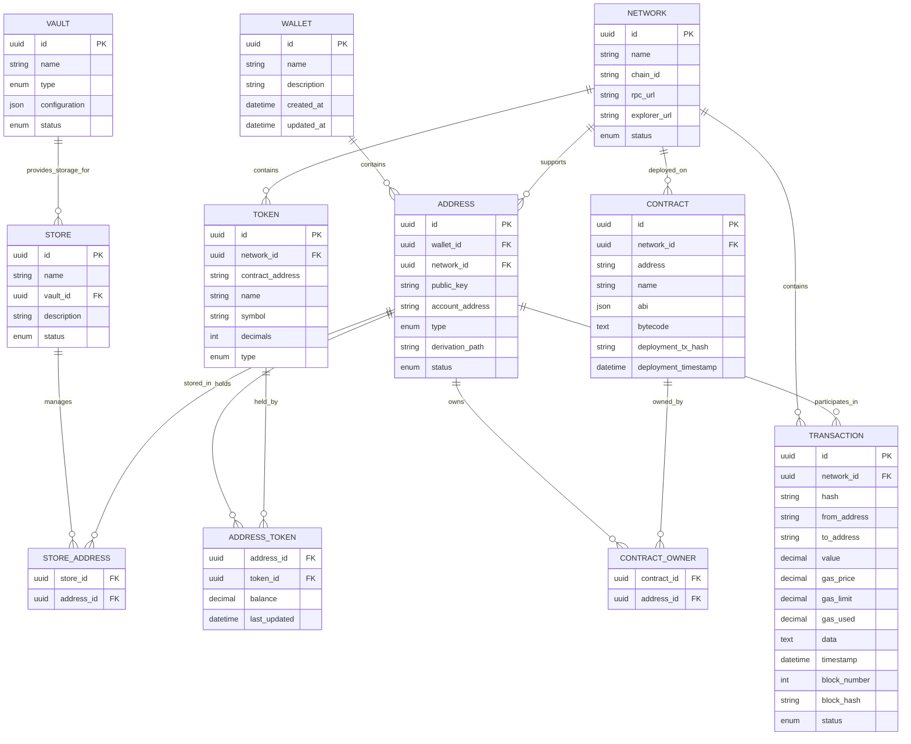

```mermaid
erDiagram
WALLET {
uuid id PK
string name
string description
datetime created_at
datetime updated_at
}

    NETWORK {
        uuid id PK
        string name
        string chain_id
        string rpc_url
        string explorer_url
        enum status
    }
    
    ADDRESS {
        uuid id PK
        uuid wallet_id FK
        uuid network_id FK
        string public_key
        string account_address
        enum type
        string derivation_path
        enum status
    }
    
    VAULT {
        uuid id PK
        string name
        enum type
        json configuration
        enum status
    }
    
    STORE {
        uuid id PK
        string name
        uuid vault_id FK
        string description
        enum status
    }
    
    STORE_ADDRESS {
        uuid store_id FK
        uuid address_id FK
    }
    
    TRANSACTION {
        uuid id PK
        uuid network_id FK
        string hash
        string from_address
        string to_address
        decimal value
        decimal gas_price
        decimal gas_limit
        decimal gas_used
        text data
        datetime timestamp
        int block_number
        string block_hash
        enum status
    }
    
    TOKEN {
        uuid id PK
        uuid network_id FK
        string contract_address
        string name
        string symbol
        int decimals
        enum type
    }
    
    ADDRESS_TOKEN {
        uuid address_id FK
        uuid token_id FK
        decimal balance
        datetime last_updated
    }
    
    CONTRACT {
        uuid id PK
        uuid network_id FK
        string address
        string name
        json abi
        text bytecode
        string deployment_tx_hash
        datetime deployment_timestamp
    }
    
    CONTRACT_OWNER {
        uuid contract_id FK
        uuid address_id FK
    }

    WALLET ||--o{ ADDRESS : contains
    NETWORK ||--o{ ADDRESS : supports
    NETWORK ||--o{ TRANSACTION : contains
    NETWORK ||--o{ TOKEN : contains
    NETWORK ||--o{ CONTRACT : deployed_on
    
    VAULT ||--o{ STORE : provides_storage_for
    STORE ||--o{ STORE_ADDRESS : manages
    ADDRESS ||--o{ STORE_ADDRESS : stored_in
    
    ADDRESS ||--o{ ADDRESS_TOKEN : holds
    TOKEN ||--o{ ADDRESS_TOKEN : held_by
    
    ADDRESS ||--o{ CONTRACT_OWNER : owns
    CONTRACT ||--o{ CONTRACT_OWNER : owned_by
    
    ADDRESS ||--o{ TRANSACTION : participates_in
```