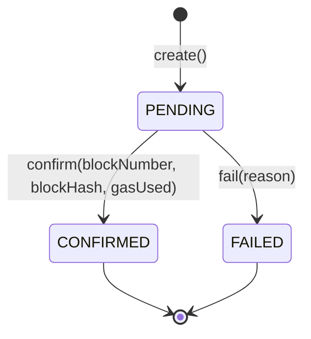
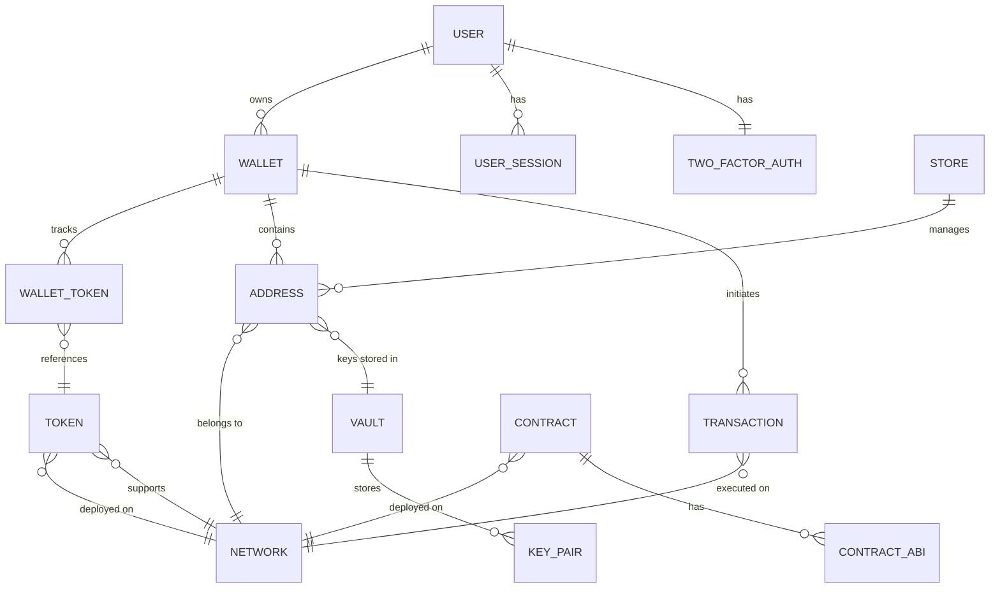

# Domain Model Guide

**Version**: 1.0
**Last Updated**: 2026-01-12

---

## Table of Contents

1. [Introduction](#introduction)
2. [Core Concepts](#core-concepts)
3. [Aggregate Roots](#aggregate-roots)
4. [Value Objects](#value-objects)
5. [Domain Events](#domain-events)
6. [Business Rules & Invariants](#business-rules--invariants)
7. [Entity Relationships](#entity-relationships)
8. [Domain Services](#domain-services)

---

## Introduction

The domain model is the **heart of the application**, containing all business logic and rules. It follows **Domain-Driven Design (DDD)** principles with:

- **Framework Independence**: No Spring, JPA, or other framework dependencies
- **Immutability**: Domain events and value objects are immutable
- **Rich Behavior**: Entities contain business logic, not just getters/setters
- **Event Sourcing**: All state changes produce domain events
- **Aggregate Boundaries**: Clear boundaries for transactional consistency

### Domain Package Structure

```
domain/
├── event/                  # Domain events (36 events across 9 categories)
│   ├── wallet/            # 12 wallet-related events
│   ├── user/              # 4 user events
│   ├── transaction/       # 3 transaction events
│   ├── address/           # 2 address events
│   ├── token/             # 2 token events
│   ├── network/           # 3 network events
│   ├── vault/             # 3 vault events
│   ├── contract/          # 4 contract events
│   ├── store/             # 3 store events
│   └── common/            # Base event classes
│
├── gateway/               # Port interfaces (14 repository interfaces)
│   ├── WalletRepository.java
│   ├── UserRepository.java
│   ├── TransactionRepository.java
│   └── ... (11 more)
│
└── model/                 # Domain entities and value objects
    ├── Wallet.java        # Main aggregate root
    ├── user/
    │   ├── User.java
    │   ├── UserStatus.java
    │   ├── UserSession.java
    │   ├── TwoFactorAuth.java
    │   └── SessionStatus.java
    ├── transaction/
    │   ├── Transaction.java
    │   ├── TransactionHash.java
    │   ├── TransactionStatus.java
    │   ├── TransactionType.java
    │   ├── TransactionFee.java
    │   └── FeeLevel.java
    ├── address/
    │   ├── Address.java
    │   ├── AccountAddress.java
    │   ├── PublicKey.java
    │   ├── AddressStatus.java
    │   └── AddressType.java
    ├── token/
    │   ├── Token.java
    │   ├── TokenBalance.java
    │   └── TokenType.java
    ├── network/
    │   ├── Network.java
    │   └── NetworkStatus.java
    ├── vault/
    │   ├── Vault.java
    │   ├── VaultConfiguration.java
    │   ├── VaultStatus.java
    │   ├── VaultType.java
    │   └── KeyGenerationResult.java
    ├── contract/
    │   ├── Contract.java
    │   └── ContractABI.java
    ├── store/
    │   ├── Store.java
    │   └── StoreStatus.java
    └── common/
        ├── AggregateRoot.java
        └── Entity.java
```

---

## Core Concepts

### Entity vs Value Object

**Entity**:
- Has a unique identity (ID)
- Mutable (state can change)
- Lifecycle tracked
- Examples: `Wallet`, `User`, `Transaction`

**Value Object**:
- No identity (defined by attributes)
- Immutable (cannot change)
- Interchangeable
- Examples: `TransactionHash`, `PublicKey`, `VaultConfiguration`

### Aggregate Root

An **aggregate** is a cluster of entities and value objects treated as a single unit. The **aggregate root** is the entry point:

- Controls access to internal entities
- Enforces invariants across the aggregate
- Publishes domain events
- Defines transactional boundary

**In Wallet Hub**:
- `Wallet` is an aggregate root (contains addresses, tokens)
- `User` is an aggregate root (contains sessions, 2FA settings)
- `Transaction` is an aggregate root (self-contained)

### Base Classes

**Entity**:

```java
public abstract class Entity {
    private final UUID id;

    protected Entity(UUID id) {
        this.id = id;
    }

    public UUID getId() {
        return id;
    }

    @Override
    public boolean equals(Object o) {
        if (this == o) return true;
        if (!(o instanceof Entity)) return false;
        Entity entity = (Entity) o;
        return Objects.equals(id, entity.id);
    }

    @Override
    public int hashCode() {
        return Objects.hash(id);
    }
}
```

**Equality**: Based on ID only (not attribute values).

**AggregateRoot**:

```java
public abstract class AggregateRoot extends Entity {
    private final List<DomainEvent> domainEvents = new ArrayList<>();

    protected AggregateRoot(UUID id) {
        super(id);
    }

    protected void registerEvent(DomainEvent event) {
        domainEvents.add(event);
    }

    public List<DomainEvent> getDomainEvents() {
        return Collections.unmodifiableList(domainEvents);
    }

    public void clearEvents() {
        domainEvents.clear();
    }
}
```

**Key Features**:
- Collects domain events during execution
- Events retrieved after transaction and published
- Events cleared after publishing

---

## Aggregate Roots

### 1. Wallet

**File**: `domain/model/Wallet.java`

**Responsibility**: Manage cryptocurrency wallets, balances, addresses, and lifecycle.

#### State

```java
public class Wallet extends AggregateRoot {
    private String name;                     // User-friendly name
    private String description;              // Optional description
    private final Set<UUID> addressIds;      // Associated blockchain addresses
    private final Instant createdAt;         // Creation timestamp (immutable)
    private Instant updatedAt;               // Last modification timestamp
    private BigDecimal balance;              // Current balance (aggregate)
    private UUID correlationId;              // For distributed tracing
    private WalletStatus status;             // Lifecycle status
    private UUID userId;                     // Owner user ID
}
```

#### Statuses

```java
public enum WalletStatus {
    ACTIVE,       // Wallet is operational
    INACTIVE,     // Temporarily disabled
    LOCKED,       // Security lock (no operations allowed)
    RECOVERING,   // Recovery process in progress
    DELETED       // Soft-deleted (audit trail preserved)
}
```

#### Behaviors

| Method | Description | Events Emitted | Invariants |
|--------|-------------|----------------|------------|
| `create()` | Create new wallet | `WalletCreatedEvent` | Initial balance = 0, status = ACTIVE |
| `updateInfo()` | Update name/description | `WalletUpdatedEvent` | Non-empty name |
| `addFunds()` | Increase balance | None (handled by use case) | amount > 0 |
| `withdrawFunds()` | Decrease balance | None (handled by use case) | amount > 0, balance >= amount |
| `activate()` | Enable wallet | `WalletStatusChangedEvent` | Can activate from any non-ACTIVE status |
| `deactivate()` | Disable wallet | `WalletStatusChangedEvent` | Can deactivate ACTIVE wallet |
| `lock()` | Security lock | `WalletStatusChangedEvent` | Cannot perform operations while locked |
| `delete()` | Soft delete | `WalletDeletedEvent`, `WalletStatusChangedEvent` | Irreversible, audit trail preserved |
| `initiateRecovery()` | Start recovery | `WalletRecoveryInitiatedEvent`, `WalletStatusChangedEvent` | Must provide recovery method |
| `addAddress()` | Link address | None | Address not already present |
| `removeAddress()` | Unlink address | None | Address exists |
| `validateOperationAllowed()` | Guard method | None | Throws if not ACTIVE |

#### Factory Method Pattern

```java
public static Wallet create(UUID id, String name, String description) {
    Wallet wallet = new Wallet(id, name, description);
    wallet.registerEvent(new WalletCreatedEvent(id, wallet.getCorrelationId()));
    return wallet;
}
```

**Why Factory Method?**
- Encapsulates creation logic
- Ensures event is always registered
- Makes constructor private (controlled instantiation)

#### Invariants

1. **Balance cannot be negative**: Validated in `withdrawFunds()`
2. **Only ACTIVE wallets can perform fund operations**: Checked via `validateOperationAllowed()`
3. **Deleted wallets cannot be modified**: Status transitions guard against this
4. **Address IDs are unique**: `Set<UUID>` ensures uniqueness

#### Example Usage

```java
// Create wallet
Wallet wallet = Wallet.create(UUID.randomUUID(), "Savings Wallet", "For long-term savings");

// Add funds
wallet.addFunds(BigDecimal.valueOf(1000));

// Withdraw funds (with validation)
try {
    wallet.withdrawFunds(BigDecimal.valueOf(500));
} catch (IllegalArgumentException e) {
    // Handle insufficient balance
}

// Lock wallet for security
wallet.lock("Suspicious activity detected");

// Retrieve events for publishing
List<DomainEvent> events = wallet.getDomainEvents();
```

---

### 2. User

**File**: `domain/model/user/User.java`

**Responsibility**: Manage user identity, authentication, profile, and security settings.

#### State

```java
public class User extends AggregateRoot {
    private String name;                      // Full name
    private String email;                     // Email (unique identifier)
    private String passwordHash;              // Hashed password (never plain text)
    private UserStatus status;                // Account status
    private final Instant createdAt;          // Registration timestamp
    private Instant updatedAt;                // Last profile update
    private Instant lastLoginAt;              // Last successful login
    private boolean emailVerified;            // Email verification flag
    private String emailVerificationToken;    // Verification token
    private TwoFactorAuth twoFactorAuth;      // 2FA settings (value object)
    private int failedLoginAttempts;          // Counter for security
    private Instant lockedUntil;              // Temporary lock expiration
}
```

#### Statuses

```java
public enum UserStatus {
    PENDING_VERIFICATION,  // Email not verified yet
    ACTIVE,                // Account active and verified
    DEACTIVATED,           // User-initiated deactivation
    SUSPENDED              // Admin-initiated suspension
}
```

#### Behaviors

| Method | Description | Events Emitted | Security |
|--------|-------------|----------------|----------|
| `create()` | Register user | `UserCreatedEvent` | Password must be hashed, status = PENDING_VERIFICATION |
| `updateProfile()` | Update name/email | `UserProfileUpdatedEvent` | Email change requires re-verification |
| `changePassword()` | Update password | None | Resets failed login attempts |
| `activate()` | Enable account | `UserStatusChangedEvent` | Auto-triggered on email verification |
| `deactivate()` | Disable account | `UserStatusChangedEvent` | User-initiated |
| `suspend()` | Admin suspension | `UserStatusChangedEvent` | Admin-only operation |
| `verifyEmail()` | Confirm email | None | Clears verification token, auto-activates |
| `recordSuccessfulLogin()` | Log login | `UserAuthenticatedEvent` | Resets failed attempts, updates last login |
| `recordFailedLogin()` | Log failure | None | Increments counter, locks after 5 attempts |
| `isLocked()` | Check lock status | None | True if locked and not expired |
| `unlock()` | Remove lock | None | Admin-only operation |
| `enableTwoFactorAuth()` | Enable 2FA | None | Stores TOTP secret |
| `disableTwoFactorAuth()` | Disable 2FA | None | Clears TOTP secret and backup codes |

#### Security Features

**Account Locking**:
- After **5 failed login attempts**, account is locked for **30 minutes**
- Manual unlock available via `unlock()` method
- Lock expires automatically after duration

```java
public void recordFailedLogin() {
    this.failedLoginAttempts++;
    this.updatedAt = Instant.now();

    if (this.failedLoginAttempts >= 5) {
        this.lockedUntil = Instant.now().plusSeconds(1800);  // 30 minutes
    }
}

public boolean isLocked() {
    return this.lockedUntil != null && Instant.now().isBefore(this.lockedUntil);
}
```

**Email Verification**:
- New users start with `PENDING_VERIFICATION` status
- Verification token generated and sent via email
- Upon verification, status changes to `ACTIVE`

**Two-Factor Authentication** (value object):

```java
public class TwoFactorAuth {
    private boolean enabled;
    private String totpSecret;              // Time-based OTP secret
    private List<String> backupCodes;       // Single-use backup codes

    public void enable(String totpSecret) {
        this.enabled = true;
        this.totpSecret = totpSecret;
        this.backupCodes = generateBackupCodes();  // 10 codes
    }

    public boolean verifyCode(String code) {
        // Verify TOTP code OR consume backup code
    }
}
```

#### Invariants

1. **Email must be unique**: Enforced at repository level
2. **Password must be hashed**: Never store plain text
3. **Locked accounts cannot log in**: Validated before authentication
4. **Only ACTIVE and unlocked users can perform operations**: Checked via `validateOperationAllowed()`
5. **Email verification required for activation**: Auto-activated on `verifyEmail()`

---

### 3. Transaction

**File**: `domain/model/transaction/Transaction.java`

**Responsibility**: Represent blockchain transactions with lifecycle tracking.

#### State

```java
public class Transaction extends AggregateRoot {
    private final UUID networkId;             // Blockchain network
    private final TransactionHash hash;       // Transaction hash (immutable VO)
    private final String fromAddress;         // Sender address
    private final String toAddress;           // Recipient address
    private final BigDecimal value;           // Transfer amount
    private BigDecimal gasPrice;              // Gas price (wei)
    private BigDecimal gasLimit;              // Gas limit
    private BigDecimal gasUsed;               // Actual gas used (after confirmation)
    private final String data;                // Transaction data (for contract calls)
    private final Instant timestamp;          // Creation time
    private Long blockNumber;                 // Block number (after confirmation)
    private String blockHash;                 // Block hash (after confirmation)
    private TransactionStatus status;         // Lifecycle status
}
```

#### Statuses

```java
public enum TransactionStatus {
    PENDING,      // Submitted to blockchain, awaiting confirmation
    CONFIRMED,    // Included in a block and confirmed
    FAILED        // Rejected by blockchain
}
```

#### Lifecycle



#### Behaviors

| Method | Description | Events Emitted | Data Updated |
|--------|-------------|----------------|--------------|
| `create()` | Initiate transaction | `TransactionCreatedEvent` | status = PENDING |
| `confirm()` | Mark as confirmed | `TransactionStatusChangedEvent` | blockNumber, blockHash, gasUsed, status = CONFIRMED |
| `fail()` | Mark as failed | `TransactionStatusChangedEvent` | status = FAILED |
| `setGasInfo()` | Set gas parameters | None | gasPrice, gasLimit |
| `rehydrate()` | Load from DB | None | All fields (no events) |

#### Factory Methods

**Creation (new transaction)**:

```java
public static Transaction create(
    UUID id,
    UUID networkId,
    TransactionHash hash,
    String fromAddress,
    String toAddress,
    BigDecimal value,
    String data
) {
    Transaction tx = new Transaction(id, networkId, hash, fromAddress, toAddress, value, data, Instant.now());
    tx.registerEvent(new TransactionCreatedEvent(id, networkId, hash.getValue(), fromAddress, toAddress, null));
    return tx;
}
```

**Rehydration (load existing)**:

```java
public static Transaction rehydrate(
    UUID id,
    UUID networkId,
    TransactionHash hash,
    String fromAddress,
    String toAddress,
    BigDecimal value,
    String data,
    Instant timestamp,
    Long blockNumber,
    String blockHash,
    TransactionStatus status,
    BigDecimal gasPrice,
    BigDecimal gasLimit,
    BigDecimal gasUsed
) {
    Transaction tx = new Transaction(id, networkId, hash, fromAddress, toAddress, value, data, timestamp);
    tx.blockNumber = blockNumber;
    tx.blockHash = blockHash;
    tx.status = status;
    tx.gasPrice = gasPrice;
    tx.gasLimit = gasLimit;
    tx.gasUsed = gasUsed;
    return tx;  // No events emitted
}
```

**Why Separate Methods?**
- `create()`: New transaction, emits event
- `rehydrate()`: Loading from DB, no event

#### Value Object: TransactionHash

```java
public record TransactionHash(String value) {
    public TransactionHash {
        if (value == null || !value.matches("^0x[a-fA-F0-9]{64}$")) {
            throw new IllegalArgumentException("Invalid transaction hash format");
        }
    }
}
```

**Benefits**:
- Type safety (cannot accidentally pass wrong string)
- Validation encapsulated
- Immutable (Java record)

---

## Value Objects

Value objects are **immutable**, have **no identity**, and are defined by their attributes.

### TransactionHash

**Type**: Java `record`
**Validation**: 64-character hexadecimal prefixed with `0x`

```java
public record TransactionHash(String value) {
    public TransactionHash {
        if (value == null || !value.matches("^0x[a-fA-F0-9]{64}$")) {
            throw new IllegalArgumentException("Invalid transaction hash: " + value);
        }
    }
}
```

### PublicKey

**Type**: Java `record`
**Validation**: Base64-encoded string

```java
public record PublicKey(String value) {
    public PublicKey {
        if (value == null || value.isEmpty()) {
            throw new IllegalArgumentException("Public key cannot be null or empty");
        }
        // Additional validation for encoding
    }
}
```

### AccountAddress

**Type**: Java class
**Validation**: Ethereum address format (checksummed)

```java
public class AccountAddress {
    private final String value;

    public AccountAddress(String value) {
        if (!isValidEthereumAddress(value)) {
            throw new IllegalArgumentException("Invalid Ethereum address: " + value);
        }
        this.value = value;
    }

    private boolean isValidEthereumAddress(String address) {
        return address != null && address.matches("^0x[a-fA-F0-9]{40}$");
    }

    public String getValue() {
        return value;
    }
}
```

### TokenBalance

**Type**: Java `record`
**Purpose**: Represent token balance with decimals

```java
public record TokenBalance(
    BigDecimal amount,
    int decimals,
    UUID tokenId
) {
    public TokenBalance {
        if (amount == null || amount.compareTo(BigDecimal.ZERO) < 0) {
            throw new IllegalArgumentException("Token balance cannot be negative");
        }
    }

    public BigDecimal getHumanReadableAmount() {
        return amount.divide(BigDecimal.TEN.pow(decimals));
    }
}
```

### VaultConfiguration

**Type**: Java `record`
**Purpose**: Vault connection settings

```java
public record VaultConfiguration(
    String endpoint,
    String authToken,
    Map<String, String> metadata
) {
    public VaultConfiguration {
        if (endpoint == null || endpoint.isEmpty()) {
            throw new IllegalArgumentException("Vault endpoint is required");
        }
    }
}
```

### TransactionFee

**Type**: Java class
**Purpose**: Calculate and represent transaction fees

```java
public class TransactionFee {
    private final BigDecimal gasPrice;
    private final BigDecimal gasLimit;
    private final FeeLevel level;

    public TransactionFee(BigDecimal gasPrice, BigDecimal gasLimit, FeeLevel level) {
        this.gasPrice = gasPrice;
        this.gasLimit = gasLimit;
        this.level = level;
    }

    public BigDecimal calculateTotalFee() {
        return gasPrice.multiply(gasLimit);
    }

    public BigDecimal calculateTotalFeeInEth() {
        return calculateTotalFee().divide(BigDecimal.valueOf(1_000_000_000_000_000_000L));  // Wei to ETH
    }
}

public enum FeeLevel {
    LOW,
    MEDIUM,
    HIGH,
    CUSTOM
}
```

---

## Domain Events

**Base Class**: `domain/event/common/DomainEvent.java`

```java
public abstract class DomainEvent {
    private final UUID eventId;           // Unique event ID
    private final Instant occurredOn;     // Event timestamp
    private final UUID correlationId;     // Correlation ID for tracing

    protected DomainEvent(UUID correlationId) {
        this.correlationId = correlationId;
        this.eventId = UUID.randomUUID();
        this.occurredOn = Instant.now();
    }

    // Getters only (immutable)
}
```

### Wallet Events (12 events)

| Event | Trigger | Key Data |
|-------|---------|----------|
| `WalletCreatedEvent` | `Wallet.create()` | walletId, correlationId |
| `WalletUpdatedEvent` | `Wallet.updateInfo()` | walletId, name, description |
| `WalletStatusChangedEvent` | Status transition | walletId, oldStatus, newStatus, reason |
| `WalletDeletedEvent` | `Wallet.delete()` | walletId, reason |
| `WalletRecoveryInitiatedEvent` | `Wallet.initiateRecovery()` | walletId, userId, recoveryMethod |
| `FundsAddedEvent` | Funds added | walletId, amount, correlationId |
| `FundsWithdrawnEvent` | Funds withdrawn | walletId, amount, correlationId |
| `FundsTransferredEvent` | Funds transferred | fromWalletId, toWalletId, amount |
| `TokenAddedToWalletEvent` | Token enabled | walletId, tokenId |
| `TokenRemovedFromWalletEvent` | Token disabled | walletId, tokenId |
| `AddressAddedToWalletEvent` | Address linked | walletId, addressId |
| `AddressRemovedFromWalletEvent` | Address unlinked | walletId, addressId |

### User Events (4 events)

| Event | Trigger | Key Data |
|-------|---------|----------|
| `UserCreatedEvent` | `User.create()` | userId, name, email |
| `UserStatusChangedEvent` | Status transition | userId, oldStatus, newStatus, reason |
| `UserProfileUpdatedEvent` | `User.updateProfile()` | userId, name, email |
| `UserAuthenticatedEvent` | Successful login | userId, timestamp |

### Transaction Events (3 events)

| Event | Trigger | Key Data |
|-------|---------|----------|
| `TransactionCreatedEvent` | `Transaction.create()` | txId, networkId, hash, from, to |
| `TransactionStatusChangedEvent` | Status transition | txId, oldStatus, newStatus, reason |
| `TransactionConfirmedEvent` | `Transaction.confirm()` | txId, blockNumber, blockHash, gasUsed |

### Event Example

```java
public class WalletCreatedEvent extends DomainEvent {
    private final UUID walletId;

    public WalletCreatedEvent(UUID walletId, UUID correlationId) {
        super(correlationId);
        this.walletId = walletId;
    }

    public UUID getWalletId() {
        return walletId;
    }
}
```

**Characteristics**:
- Immutable (final fields, no setters)
- Extends `DomainEvent` (inherits eventId, occurredOn, correlationId)
- Descriptive name (past tense: "Created", "Updated", "Deleted")
- Contains only relevant data (no entity references)

---

## Business Rules & Invariants

### Wallet Invariants

1. **Non-negative balance**: `balance >= 0`
   - Enforced in: `withdrawFunds()`
   - Exception: `IllegalArgumentException("Insufficient balance")`

2. **Active status required for operations**:
   - Enforced in: `validateOperationAllowed()`
   - Exception: `IllegalStateException("Wallet not active")`

3. **Unique addresses**: `Set<UUID>` ensures no duplicates

4. **Valid status transitions**:
   ```
   ACTIVE ↔ INACTIVE
   ACTIVE → LOCKED
   ACTIVE → DELETED
   LOCKED → ACTIVE (unlock)
   any → RECOVERING
   ```

### User Invariants

1. **Email must be unique**: Enforced at repository level (unique constraint)

2. **Password must be hashed**: Never stored in plain text
   - Hashing: BCrypt with cost factor 12

3. **Account locking after failed attempts**:
   - Threshold: 5 failed attempts
   - Lock duration: 30 minutes
   - Reset on: successful login or manual unlock

4. **Email verification for activation**:
   - New users: `PENDING_VERIFICATION`
   - After verification: `ACTIVE`

5. **Valid status transitions**:
   ```
   PENDING_VERIFICATION → ACTIVE (on email verification)
   ACTIVE ↔ DEACTIVATED
   ACTIVE → SUSPENDED (admin only)
   SUSPENDED → ACTIVE (admin only)
   ```

### Transaction Invariants

1. **Immutable core data**: networkId, hash, from, to, value, data, timestamp

2. **Valid hash format**: `0x[a-fA-F0-9]{64}`

3. **Status transitions**:
   ```
   PENDING → CONFIRMED (on blockchain confirmation)
   PENDING → FAILED (on blockchain rejection)
   ```

4. **Block data only on confirmation**:
   - `blockNumber`, `blockHash`, `gasUsed` set only when status = CONFIRMED

---

## Entity Relationships



### Relationships

- **User → Wallet**: One-to-many (user owns multiple wallets)
- **Wallet → Address**: One-to-many (wallet contains multiple addresses)
- **Wallet → Token**: Many-to-many (via `WalletToken` association)
- **Network → Token**: One-to-many (network supports multiple tokens)
- **Transaction → Network**: Many-to-one (transaction executes on one network)
- **Address → Vault**: Many-to-one (address keys stored in vault)

---

## Domain Services

Domain services contain logic that:
- Doesn't naturally fit in any entity
- Operates on multiple aggregates
- Requires external dependencies (but not infrastructure)

**Note**: Wallet Hub currently implements most logic in use cases. Future domain services might include:

### Example: TransactionFeeCalculator (future)

```java
public class TransactionFeeCalculator {
    public TransactionFee calculate(
        Network network,
        TransactionType type,
        BigDecimal value,
        FeeLevel level
    ) {
        // Complex fee calculation logic
        BigDecimal gasPrice = getGasPriceForLevel(network, level);
        BigDecimal gasLimit = estimateGasLimit(type, value);
        return new TransactionFee(gasPrice, gasLimit, level);
    }

    private BigDecimal getGasPriceForLevel(Network network, FeeLevel level) {
        // Query network, apply multiplier based on level
    }

    private BigDecimal estimateGasLimit(TransactionType type, BigDecimal value) {
        // Estimate based on transaction type
    }
}
```

### Example: AddressValidator (future)

```java
public class AddressValidator {
    public boolean validate(String address, Network network) {
        // Network-specific validation
        return switch (network.getChainId()) {
            case 1 -> validateEthereumAddress(address);  // Ethereum mainnet
            case 56 -> validateBscAddress(address);       // BSC
            default -> validateGenericAddress(address);
        };
    }

    private boolean validateEthereumAddress(String address) {
        // Checksum validation (EIP-55)
    }
}
```

---

## Best Practices

### 1. Domain Logic in Domain

**Good**:

```java
public class Wallet extends AggregateRoot {
    public void withdrawFunds(BigDecimal amount) {
        if (amount.compareTo(BigDecimal.ZERO) <= 0) {
            throw new IllegalArgumentException("Amount must be positive");
        }
        if (this.balance.compareTo(amount) < 0) {
            throw new IllegalArgumentException("Insufficient balance");
        }
        this.balance = this.balance.subtract(amount);
    }
}
```

**Bad** (logic in use case):

```java
public class WithdrawFundsUseCase {
    public void withdraw(UUID walletId, BigDecimal amount) {
        Wallet wallet = repository.findById(walletId).orElseThrow();

        // WRONG: Business logic in use case
        if (amount.compareTo(BigDecimal.ZERO) <= 0) {
            throw new IllegalArgumentException("Amount must be positive");
        }
        if (wallet.getBalance().compareTo(amount) < 0) {
            throw new IllegalArgumentException("Insufficient balance");
        }
        wallet.setBalance(wallet.getBalance().subtract(amount));

        repository.save(wallet);
    }
}
```

### 2. Always Use Factory Methods

**Good**:

```java
Wallet wallet = Wallet.create(id, name, description);  // Event registered
```

**Bad**:

```java
Wallet wallet = new Wallet(id, name, description);  // Event NOT registered
```

### 3. Immutable Value Objects

**Good**:

```java
public record TransactionHash(String value) {
    // Immutable by design
}
```

**Bad**:

```java
public class TransactionHash {
    private String value;  // MUTABLE - wrong!

    public void setValue(String value) {
        this.value = value;
    }
}
```

### 4. Register Events in Domain

**Good**:

```java
public void activate() {
    WalletStatus oldStatus = this.status;
    this.status = WalletStatus.ACTIVE;
    registerEvent(new WalletStatusChangedEvent(getId(), oldStatus, this.status, "Activated", correlationId));
}
```

**Bad** (event created in use case):

```java
// In use case
wallet.setStatus(WalletStatus.ACTIVE);
eventPublisher.publish(new WalletStatusChangedEvent(...));  // WRONG
```

---

## Glossary

- **Aggregate**: Cluster of entities/VOs treated as a unit
- **Aggregate Root**: Entry point to an aggregate
- **Domain Event**: Immutable fact about something that happened
- **Value Object**: Immutable object defined by attributes, not identity
- **Entity**: Object with unique identity and lifecycle
- **Invariant**: Business rule that must always be true
- **Factory Method**: Static method for creating objects with guaranteed valid state

---

**Document Version**: 1.0
**Author**: Domain Modeling Team
**Review Cycle**: Quarterly
