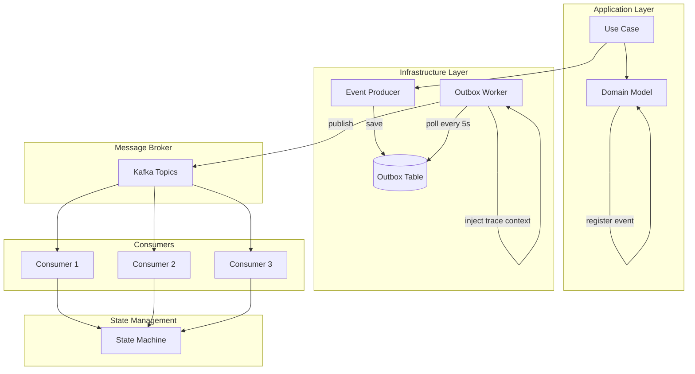
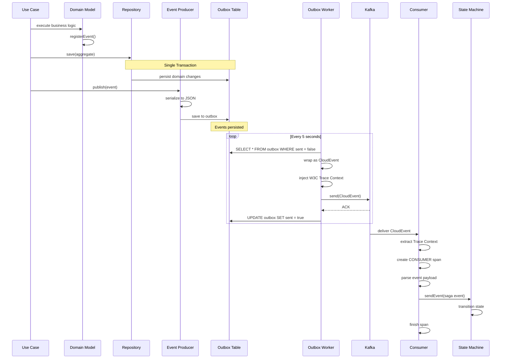
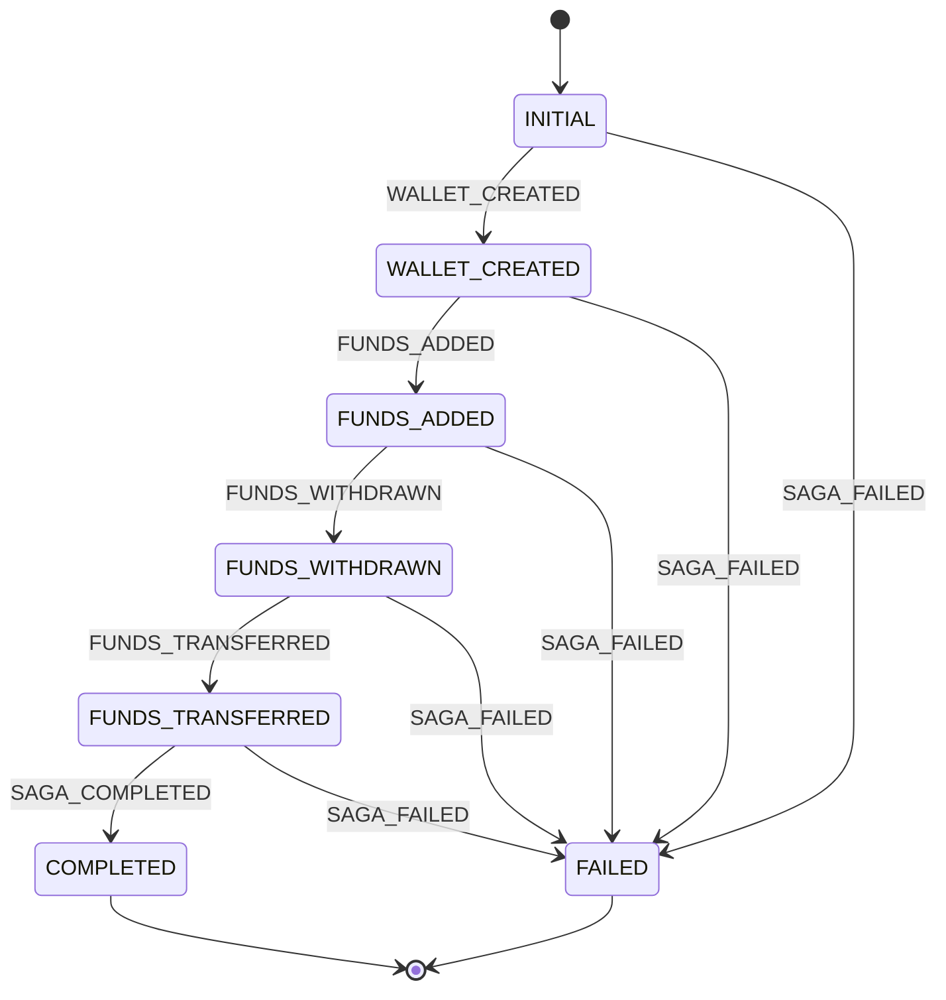

# Event-Driven Architecture Guide

**Version**: 1.0
**Last Updated**: 2026-01-12

---

## Table of Contents

1. [Overview](#overview)
2. [Event Types](#event-types)
3. [Outbox Pattern](#outbox-pattern)
4. [CloudEvents Integration](#cloudevents-integration)
5. [Event Flow](#event-flow)
6. [Saga Pattern](#saga-pattern)
7. [Distributed Tracing](#distributed-tracing)
8. [Best Practices](#best-practices)
9. [Troubleshooting](#troubleshooting)

---

## Overview

Wallet Hub implements a comprehensive **event-driven architecture** to achieve:

- **Loose Coupling**: Services communicate via events, not direct calls
- **Scalability**: Consumers can be scaled independently
- **Reliability**: Outbox pattern ensures events are never lost
- **Auditability**: Complete event history for compliance
- **Observability**: Distributed tracing across event flows

### Architecture Diagram



### Key Components

| Component | Responsibility | Technology |
|-----------|---------------|------------|
| **Event Producer** | Serialize and save events | Spring Cloud Stream |
| **Outbox Table** | Transactional event storage | JPA/PostgreSQL |
| **Outbox Worker** | Poll and publish events | @Scheduled (5s) |
| **CloudEvents** | Event envelope standard | CloudEvents 1.0 |
| **Kafka** | Message broker | Apache Kafka |
| **Event Consumer** | Process events | Spring Cloud Stream Functions |
| **State Machine** | Saga orchestration | Spring State Machine |

---

## Event Types

### Domain Events

**Base Class**: `DomainEvent`

```java
public abstract class DomainEvent {
    private final UUID eventId;        // Unique event identifier
    private final Instant occurredOn;  // Event timestamp
    private final UUID correlationId;  // Trace correlation

    protected DomainEvent(UUID correlationId) {
        this.correlationId = correlationId;
        this.eventId = UUID.randomUUID();
        this.occurredOn = Instant.now();
    }
}
```

**Characteristics**:
- **Immutable**: Final fields, no setters
- **Past Tense**: Describes what happened (e.g., "WalletCreated", not "CreateWallet")
- **Correlation ID**: Links events in distributed flows
- **Timestamp**: Exact occurrence time

### Event Categories

#### 1. Wallet Events (12 events)

| Event | Trigger | Kafka Topic | Consumer |
|-------|---------|-------------|----------|
| `WalletCreatedEvent` | Wallet creation | `wallet-created-topic` | `WalletCreatedEventConsumer` |
| `WalletUpdatedEvent` | Info update | N/A | N/A |
| `WalletStatusChangedEvent` | Status transition | N/A | N/A |
| `WalletDeletedEvent` | Soft delete | N/A | N/A |
| `WalletRecoveryInitiatedEvent` | Recovery start | N/A | N/A |
| `FundsAddedEvent` | Funds deposit | `funds-added-topic` | `FundsAddedEventConsumer` |
| `FundsWithdrawnEvent` | Funds withdrawal | `funds-withdrawn-topic` | `FundsWithdrawnEventConsumer` |
| `FundsTransferredEvent` | Transfer complete | `funds-transferred-topic` | `FundsTransferredEventConsumer` |
| `TokenAddedToWalletEvent` | Token enabled | N/A | N/A |
| `TokenRemovedFromWalletEvent` | Token disabled | N/A | N/A |
| `AddressAddedToWalletEvent` | Address linked | N/A | N/A |
| `AddressRemovedFromWalletEvent` | Address unlinked | N/A | N/A |

**Note**: Only 4 events are currently published to Kafka (wallet created, funds added/withdrawn/transferred). Others are internal.

#### 2. User Events (4 events)

| Event | Trigger | Published |
|-------|---------|-----------|
| `UserCreatedEvent` | User registration | No |
| `UserStatusChangedEvent` | Status transition | No |
| `UserProfileUpdatedEvent` | Profile update | No |
| `UserAuthenticatedEvent` | Successful login | No |

#### 3. Transaction Events (3 events)

| Event | Trigger | Published |
|-------|---------|-----------|
| `TransactionCreatedEvent` | TX initiated | No |
| `TransactionStatusChangedEvent` | Status change | No |
| `TransactionConfirmedEvent` | TX confirmed | No |

### Event Example

```java
public class WalletCreatedEvent extends DomainEvent {
    private final UUID walletId;

    public WalletCreatedEvent(UUID walletId, UUID correlationId) {
        super(correlationId);
        this.walletId = walletId;
    }

    public UUID getWalletId() {
        return walletId;
    }
}
```

**JSON Representation**:

```json
{
  "eventId": "550e8400-e29b-41d4-a716-446655440000",
  "occurredOn": "2026-01-12T10:30:00Z",
  "correlationId": "789e0123-e45b-67c8-d901-234567890abc",
  "walletId": "123e4567-e89b-12d3-a456-426614174000"
}
```

---

## Outbox Pattern

The **Transactional Outbox Pattern** ensures reliable event publishing by storing events in the same database transaction as domain changes.

### Why Outbox?

**Problem**: Dual write problem

```java
// ❌ BAD: Two separate transactions
transaction.begin();
walletRepository.save(wallet);  // DB transaction 1
transaction.commit();

kafkaProducer.send(event);       // Separate Kafka operation
// If Kafka fails, wallet is saved but event is lost!
```

**Solution**: Single transaction with outbox

```java
// ✅ GOOD: Single transaction
transaction.begin();
walletRepository.save(wallet);   // DB write
outboxRepository.save(event);    // DB write (same transaction)
transaction.commit();
// Both succeed or both fail (atomicity)
```

### Outbox Table Schema

```sql
CREATE TABLE outbox (
    id UUID PRIMARY KEY,
    event_type VARCHAR(255) NOT NULL,
    payload TEXT NOT NULL,
    correlation_id UUID,
    sent BOOLEAN DEFAULT FALSE,
    created_at TIMESTAMP NOT NULL,
    sent_at TIMESTAMP
);

CREATE INDEX idx_outbox_sent ON outbox(sent);
```

**Columns**:
- `id`: Unique event ID
- `event_type`: Event type (e.g., "walletCreatedEventProducer")
- `payload`: JSON serialized event
- `correlation_id`: Trace correlation
- `sent`: Publication status
- `created_at`: Event creation timestamp
- `sent_at`: Publication timestamp

### Outbox Entity

```java
@Entity
@Table(name = "outbox")
public class OutboxEvent {
    @Id
    @GeneratedValue
    private UUID id;

    private String eventType;

    @Lob
    private String payload;

    private String correlationId;

    private boolean sent = false;

    private Instant createdAt = Instant.now();

    private Instant sentAt;
}
```

### Outbox Service

```java
@Service
public class OutboxService {
    private final OutboxRepository outboxRepository;

    @Transactional
    public void saveOutboxEvent(String eventType, String payload, String correlationId) {
        OutboxEvent event = new OutboxEvent();
        event.setEventType(eventType);
        event.setPayload(payload);
        event.setCorrelationId(correlationId);
        outboxRepository.save(event);
    }

    @Transactional
    public void markEventAsSent(OutboxEvent event) {
        event.setSent(true);
        event.setSentAt(Instant.now());
        outboxRepository.save(event);
    }

    public List<OutboxEvent> getUnsentEvents() {
        return outboxRepository.findBySentFalse();
    }
}
```

### Outbox Worker

**Location**: Inside `KafkaEventProducer`

```java
@Scheduled(fixedRate = 5000)  // Every 5 seconds
public void processOutbox() {
    List<OutboxEvent> unsentEvents = outboxService.getUnsentEvents();

    unsentEvents.forEach(event -> {
        try {
            // 1. Wrap as CloudEvent 1.0
            CloudEvent cloudEvent = CloudEventBuilder.v1()
                .withId(event.getId().toString())
                .withType(event.getEventType())
                .withSource(URI.create("/wallet-hub"))
                .withDataContentType("application/json")
                .withData(event.getPayload().getBytes())
                .build();

            // 2. Inject W3C Trace Context
            CloudEvent enrichedEvent = tracePropagator.injectTraceContext(cloudEvent);

            // 3. Send to Kafka
            String channel = event.getEventType() + "-out-0";
            boolean sent = streamBridge.send(channel, enrichedEvent);

            // 4. Mark as sent
            if (sent) {
                outboxService.markEventAsSent(event);
                log.debug("Sent event [type={}, id={}]", event.getEventType(), event.getId());
            }
        } catch (Exception e) {
            log.error("Error processing outbox event: {}", e.getMessage(), e);
            // Event remains unsent, will retry in 5 seconds
        }
    });
}
```

**Key Features**:
- **Polling Interval**: 5 seconds (configurable)
- **Error Handling**: Failed events remain unsent, will retry
- **Idempotency**: Consumers must handle duplicate events
- **Ordering**: Events published in creation order

---

## CloudEvents Integration

**CloudEvents** is a CNCF specification for describing events in a common format.

### Why CloudEvents?

- **Standardization**: Common event format across systems
- **Interoperability**: Easy integration with external services
- **Extensibility**: Custom extensions (e.g., trace context)
- **Tooling**: Wide ecosystem support

### CloudEvent Structure

```json
{
  "specversion": "1.0",
  "type": "walletCreatedEventProducer",
  "source": "/wallet-hub",
  "id": "550e8400-e29b-41d4-a716-446655440000",
  "time": "2026-01-12T10:30:00Z",
  "datacontenttype": "application/json",
  "data": {
    "eventId": "550e8400-e29b-41d4-a716-446655440000",
    "occurredOn": "2026-01-12T10:30:00Z",
    "correlationId": "789e0123-e45b-67c8-d901-234567890abc",
    "walletId": "123e4567-e89b-12d3-a456-426614174000"
  },
  "traceparent": "00-4bf92f3577b34da6a3ce929d0e0e4736-00f067aa0ba902b7-01",
  "tracestate": "..."
}
```

**Standard Attributes**:
- `specversion`: CloudEvents version (1.0)
- `type`: Event type identifier
- `source`: Event producer URI
- `id`: Unique event ID
- `time`: Event timestamp
- `datacontenttype`: Content type of data
- `data`: Event payload

**Extensions**:
- `traceparent`: W3C Trace Context 1.0
- `tracestate`: Additional trace state

### Creating CloudEvents

```java
CloudEvent cloudEvent = CloudEventBuilder.v1()
    .withId(UUID.randomUUID().toString())
    .withType("walletCreatedEventProducer")
    .withSource(URI.create("/wallet-hub"))
    .withDataContentType("application/json")
    .withData(objectMapper.writeValueAsBytes(event))
    .build();
```

### Parsing CloudEvents

```java
CloudEvent cloudEvent = message.getPayload();
String type = cloudEvent.getType();
byte[] data = cloudEvent.getData().toBytes();
String payload = new String(data);
```

---

## Event Flow

### Complete Event Lifecycle



### Step-by-Step Breakdown

**1. Business Logic Execution**

```java
// Use case
Wallet wallet = Wallet.create(id, name, description);
walletRepository.save(wallet);  // Transaction begins
```

**2. Event Registration**

```java
// Domain model
public static Wallet create(UUID id, String name, String description) {
    Wallet wallet = new Wallet(id, name, description);
    wallet.registerEvent(new WalletCreatedEvent(id, correlationId));  // Registered
    return wallet;
}
```

**3. Event Publishing**

```java
// Use case
eventPublisher.publish(event);
```

**4. Outbox Persistence**

```java
// Event producer
@Override
public void produceWalletCreatedEvent(WalletCreatedEvent event) {
    String payload = objectMapper.writeValueAsString(event);
    outboxService.saveOutboxEvent("walletCreatedEventProducer", payload, null);
}
```

**5. Outbox Processing**

```java
// Scheduled worker
@Scheduled(fixedRate = 5000)
public void processOutbox() {
    List<OutboxEvent> unsentEvents = outboxService.getUnsentEvents();
    unsentEvents.forEach(event -> {
        CloudEvent cloudEvent = wrapAsCloudEvent(event);
        CloudEvent enriched = tracePropagator.injectTraceContext(cloudEvent);
        streamBridge.send(event.getEventType() + "-out-0", enriched);
        outboxService.markEventAsSent(event);
    });
}
```

**6. Event Consumption**

```java
// Consumer
@Bean
public Consumer<Message<CloudEvent>> walletCreatedEventConsumerFunction() {
    return message -> {
        CloudEvent cloudEvent = message.getPayload();
        Span span = tracePropagator.extractTraceContext(cloudEvent);

        String payload = new String(cloudEvent.getData().toBytes());
        // Process event...

        span.end();
    };
}
```

---

## Saga Pattern

**Saga**: Distributed transaction pattern that coordinates multiple services via events.

### State Machine Configuration

**States**:
```java
public enum SagaStates {
    INITIAL,
    WALLET_CREATED,
    FUNDS_ADDED,
    FUNDS_WITHDRAWN,
    FUNDS_TRANSFERRED,
    COMPLETED,
    FAILED
}
```

**Events**:
```java
public enum SagaEvents {
    WALLET_CREATED,
    FUNDS_ADDED,
    FUNDS_WITHDRAWN,
    FUNDS_TRANSFERRED,
    SAGA_COMPLETED,
    SAGA_FAILED
}
```

### State Diagram



### Saga Workflow Example

**Scenario**: Create wallet → Add funds → Complete

**Step 1: Create Wallet**

```java
// Use case
UUID correlationId = UUID.randomUUID();
Wallet wallet = Wallet.create(id, name, description);
wallet.setCorrelationId(correlationId);
walletRepository.save(wallet);

// Event published
WalletCreatedEvent event = new WalletCreatedEvent(wallet.getId(), correlationId);
eventPublisher.publish(event);
```

**Step 2: Consumer Processes Event**

```java
// Consumer
@Bean
public Consumer<Message<CloudEvent>> walletCreatedEventConsumerFunction() {
    return message -> {
        // Extract correlation ID
        String correlationId = extractCorrelationId(message);

        // Send to state machine
        var msg = MessageBuilder.withPayload(SagaEvents.WALLET_CREATED)
            .setHeader("correlationId", UUID.fromString(correlationId))
            .build();

        stateMachine.sendEvent(Mono.just(msg)).subscribe();
    };
}
```

**Step 3: State Machine Transition**

```
State: INITIAL → WALLET_CREATED
```

**Step 4: Add Funds**

```java
// Use case
wallet.addFunds(amount);
walletRepository.save(wallet);

// Event published
FundsAddedEvent event = new FundsAddedEvent(wallet.getId(), amount, correlationId);
eventPublisher.publish(event);
```

**Step 5: State Machine Transition**

```
State: WALLET_CREATED → FUNDS_ADDED
```

**Step 6: Saga Completion**

```java
// After all steps complete
Message<SagaEvents> msg = MessageBuilder.withPayload(SagaEvents.SAGA_COMPLETED)
    .setHeader("correlationId", correlationId)
    .build();

stateMachine.sendEvent(Mono.just(msg)).subscribe();
```

**Final State**: `COMPLETED`

### Compensation (Future Enhancement)

**Current**: No automatic compensation
**Future**: Rollback failed sagas

```java
@Override
public void configure(StateMachineTransitionConfigurer<SagaStates, SagaEvents> transitions) {
    transitions
        .withExternal()
            .source(SagaStates.WALLET_CREATED).target(SagaStates.FAILED)
            .event(SagaEvents.SAGA_FAILED)
            .action(compensateWalletCreation());  // Compensation action
}

@Bean
public Action<SagaStates, SagaEvents> compensateWalletCreation() {
    return context -> {
        UUID walletId = context.getMessageHeader("walletId");
        deleteWalletUseCase.delete(walletId, "Saga failed - compensation");
    };
}
```

---

## Distributed Tracing

### W3C Trace Context

**Format**: `traceparent: 00-{trace-id}-{span-id}-{flags}`

**Example**:
```
traceparent: 00-4bf92f3577b34da6a3ce929d0e0e4736-00f067aa0ba902b7-01
             ^   ^                                ^                  ^
             |   |                                |                  +-- Sampled (01)
             |   |                                +-- Span ID (16 hex)
             |   +-- Trace ID (32 hex)
             +-- Version (00)
```

### Trace Propagation

**Producer**:

```java
public CloudEvent injectTraceContext(CloudEvent event) {
    TraceContext context = tracer.currentSpan().context();

    String traceparent = String.format(
        "00-%s-%s-%s",
        context.traceId(),
        context.spanId(),
        context.sampled() ? "01" : "00"
    );

    return CloudEventBuilder.from(event)
        .withExtension("traceparent", traceparent)
        .withExtension("tracestate", context.traceState())
        .build();
}
```

**Consumer**:

```java
public Span extractTraceContext(CloudEvent event) {
    String traceparent = event.getExtension("traceparent");
    // Parse traceparent: version-traceId-spanId-flags
    String[] parts = traceparent.split("-");
    String traceId = parts[1];
    String spanId = parts[2];
    boolean sampled = parts[3].equals("01");

    // Create child span
    TraceContext context = TraceContext.newBuilder()
        .traceId(traceId)
        .spanId(spanId)
        .sampled(sampled)
        .build();

    return tracer.nextSpan(TraceContextOrSamplingFlags.create(context));
}
```

### Trace Example

```
Trace ID: 4bf92f3577b34da6a3ce929d0e0e4736

└─ usecase:CreateWalletUseCase.createWallet [350ms]
   ├─ repository:save [120ms]
   ├─ producer:publishEvent [180ms]
   │  └─ kafka:send [150ms]
   │     └─ consumer:WalletCreatedEventConsumer [80ms]
   │        └─ statemachine:transition [40ms]
   └─ outbox:save [40ms]
```

---

## Best Practices

### 1. Idempotent Consumers

**Problem**: Events can be delivered multiple times

**Solution**: Idempotency key

```java
@Bean
public Consumer<Message<CloudEvent>> walletCreatedEventConsumerFunction() {
    return message -> {
        String eventId = message.getPayload().getId();

        // Check if already processed
        if (processedEventRepository.exists(eventId)) {
            log.info("Event {} already processed, skipping", eventId);
            return;
        }

        // Process event
        processEvent(message);

        // Mark as processed
        processedEventRepository.save(eventId);
    };
}
```

### 2. Correlation ID

**Always include correlation ID** for distributed tracing:

```java
UUID correlationId = UUID.randomUUID();
Wallet wallet = Wallet.create(id, name, description);
wallet.setCorrelationId(correlationId);
```

### 3. Error Handling

**Fail Fast**: Let exceptions propagate, event will retry

```java
@Bean
public Consumer<Message<CloudEvent>> consumerFunction() {
    return message -> {
        try {
            processEvent(message);
        } catch (RecoverableException e) {
            log.warn("Recoverable error, will retry: {}", e.getMessage());
            throw e;  // Retry
        } catch (UnrecoverableException e) {
            log.error("Unrecoverable error: {}", e.getMessage());
            // Send to DLQ or mark as failed
        }
    };
}
```

### 4. Event Versioning

**Include version in event type**:

```java
CloudEvent cloudEvent = CloudEventBuilder.v1()
    .withType("walletCreatedEventProducer.v1")  // Version suffix
    .build();
```

**Handle multiple versions**:

```java
String type = cloudEvent.getType();
if (type.endsWith(".v1")) {
    processV1Event(cloudEvent);
} else if (type.endsWith(".v2")) {
    processV2Event(cloudEvent);
}
```

### 5. Dead Letter Queue

**Configuration**:

```yaml
spring:
  cloud:
    stream:
      kafka:
        bindings:
          walletCreatedEventConsumerFunction-in-0:
            consumer:
              enableDlq: true
              dlqName: wallet-created-topic-dlq
              maxAttempts: 3
```

---

## Troubleshooting

### Issue 1: Events Not Published

**Symptom**: Outbox has unsent events, but Kafka shows no messages.

**Check**:

```sql
SELECT * FROM outbox WHERE sent = false;
```

**Possible Causes**:
1. Kafka broker unavailable
2. Topic doesn't exist
3. Serialization error

**Solution**:

```bash
# Check Kafka broker
docker logs kafka

# Create topic manually
kafka-topics --create --topic wallet-created-topic --bootstrap-server localhost:9092

# Check outbox worker logs
tail -f logs/application.log | grep "Error processing outbox"
```

---

### Issue 2: Duplicate Event Processing

**Symptom**: Same event processed multiple times.

**Cause**: Kafka redelivery, consumer not idempotent.

**Solution**: Implement idempotency key check (see Best Practices #1).

---

### Issue 3: State Machine Stuck

**Symptom**: State machine doesn't transition.

**Check**:

```sql
SELECT * FROM state_machine WHERE machine_id = 'sagaStateMachine';
```

**Possible Causes**:
1. Invalid state transition
2. Missing correlation ID
3. Event not matching saga event enum

**Solution**:

```bash
# Enable state machine debug logging
logging.level.org.springframework.statemachine=DEBUG
```

---

### Issue 4: Trace Context Lost

**Symptom**: Spans not linked in trace visualization.

**Cause**: Trace context not propagated.

**Solution**: Ensure `CloudEventTracePropagator` is used:

```java
CloudEvent enrichedEvent = tracePropagator.injectTraceContext(cloudEvent);
```

---

## Monitoring & Metrics

### Key Metrics

```yaml
# Events published
events.sent{type="domain"}: 1234

# Events consumed
events.received{type="domain"}: 1230

# Outbox lag
outbox.unsent.count: 4

# Consumer lag
kafka.consumer.lag{topic="wallet-created-topic"}: 0

# Processing time
event.processing.duration{event="WalletCreatedEvent"}: 80ms
```

### Dashboards

**Recommended Visualizations**:
- Event throughput (events/sec)
- Outbox lag over time
- Consumer lag per topic
- Event processing duration (p50, p95, p99)
- Error rate per event type

---

**Document Version**: 1.0
**Author**: Event-Driven Architecture Team
**Review Cycle**: Quarterly
