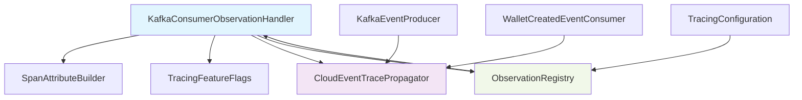
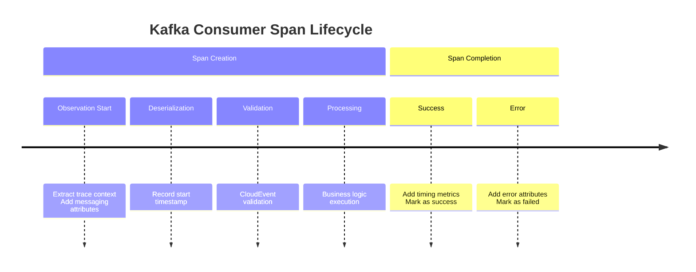
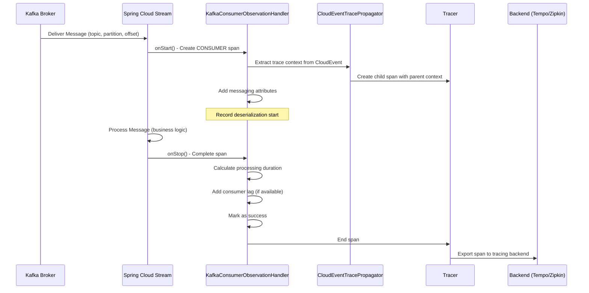
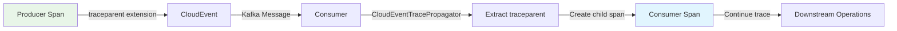

# KafkaConsumerObservationHandler Module Documentation

## Overview

The `KafkaConsumerObservationHandler` is a critical component of the Wallet Hub's distributed tracing infrastructure that instruments Kafka event consumption with comprehensive observability. This module enables end-to-end trace visibility across event-driven workflows by creating CONSUMER spans that capture message processing details, consumer lag metrics, and trace context propagation.

## Purpose and Core Functionality

### Primary Objectives
1. **Instrument Kafka Consumer Operations**: Create detailed spans for Kafka message consumption following OpenTelemetry semantic conventions
2. **Trace Context Propagation**: Extract and continue trace context from CloudEvent extensions to maintain distributed trace continuity
3. **Performance Monitoring**: Capture consumer lag, processing duration, and deserialization timing
4. **Error Tracking**: Record processing failures with detailed error attributes
5. **Event Cascade Handling**: Maintain trace relationships across event chains (producer → consumer → producer)

### Key Features
- **Automatic Span Creation**: Creates CONSUMER spans for all Kafka consumer operations
- **Consumer Lag Calculation**: Measures time between message production and consumption
- **Comprehensive Attributes**: Captures topic, partition, offset, consumer group, and message metadata
- **Integration with CloudEvents**: Works with `CloudEventTracePropagator` for trace context extraction
- **Feature Flag Control**: Can be enabled/disabled via `tracing.features.kafka` configuration
- **Low Overhead**: Minimal performance impact (<1ms per message)

## Architecture and Component Relationships

### Module Position in Tracing Hierarchy
```
infrastructure_tracing/
├── messaging_tracing/
│   ├── KafkaProducerObservationHandler (sibling)
│   ├── KafkaConsumerObservationHandler (current module)
│   ├── CloudEventTracePropagator (dependency)
│   └── SpanAttributeBuilder (dependency)
├── core_configuration/
│   └── TracingConfiguration (registry integration)
├── sampling_system/
│   └── TracingFeatureFlags (feature control)
└── propagation/
    └── ReactiveContextPropagator (context propagation)
```

### Dependencies


### Integration Points
1. **Spring Cloud Stream**: Integrates with Spring Cloud Stream's observation support for Kafka consumers
2. **Spring Kafka**: Works with `@KafkaListener` annotations and `KafkaTemplate` operations
3. **Micrometer Observation**: Implements `ObservationHandler<Observation.Context>` interface
4. **OpenTelemetry**: Follows OpenTelemetry semantic conventions for messaging spans

## Detailed Component Analysis

### KafkaConsumerObservationHandler Class

#### Core Responsibilities
```java
public class KafkaConsumerObservationHandler implements ObservationHandler<Observation.Context> {
    // 1. Context Support Detection
    public boolean supportsContext(Observation.Context context)
    
    // 2. Span Lifecycle Management
    public void onStart(Observation.Context context)
    public void onStop(Observation.Context context)
    public void onError(Observation.Context context)
}
```

#### Configuration Annotations
- `@Component`: Spring-managed bean
- `@ConditionalOnClass(KafkaListener.class)`: Only active when Kafka is in classpath
- `@ConditionalOnProperty(value = "tracing.features.kafka", havingValue = "true", matchIfMissing = true)`: Feature flag control

#### Dependencies
- `SpanAttributeBuilder`: For consistent span attribute naming and sanitization
- `TracingFeatureFlags`: For runtime feature enablement/disablement

### Span Attribute Structure

#### OpenTelemetry Semantic Conventions
The handler follows OpenTelemetry semantic conventions for messaging systems:

| Attribute | Description | Example |
|-----------|-------------|---------|
| `messaging.system` | Message broker system | `"kafka"` |
| `messaging.operation` | Operation type | `"receive"`, `"process"` |
| `messaging.destination.name` | Topic name | `"wallet-events"` |
| `messaging.destination.kind` | Destination type | `"topic"` |
| `messaging.kafka.partition` | Partition number | `"0"` |
| `messaging.kafka.offset` | Message offset | `"42"` |
| `messaging.kafka.consumer.group` | Consumer group ID | `"wallet-service"` |
| `messaging.consumer_lag_ms` | Time from send to receive | `"125"` |
| `messaging.message.id` | CloudEvent ID | `"evt-123"` |
| `span.kind` | Span type | `"CONSUMER"` |
| `status` | Processing status | `"success"`, `"error"` |

#### Custom Attributes
- `messaging.kafka.deserialization_time_ms`: Time spent deserializing message
- `messaging.processing_time_ms`: Total processing duration
- `error.type`: Exception class name on failure

### Span Events Timeline


## Data Flow and Processing

### Message Consumption Flow


### Trace Context Propagation Flow


### Consumer Lag Calculation
```
Consumer Lag = receiveTimestamp - sendTimestamp

Where:
- sendTimestamp: Injected by producer via CloudEventTracePropagator
- receiveTimestamp: Captured by KafkaConsumerObservationHandler.onStart()
```

## Configuration and Usage

### Spring Boot Configuration
```yaml
# application-tracing.yml
tracing:
  features:
    kafka: true  # Enable/disable Kafka tracing
    
management:
  tracing:
    enabled: true
    sampling:
      probability: 0.1  # Sample 10% of traces
  zipkin:
    tracing:
      endpoint: http://localhost:9411/api/v2/spans
  otlp:
    tracing:
      endpoint: http://localhost:4318/v1/traces
```

### Observation Registry Integration
```java
@Configuration
public class TracingConfiguration {
    @Bean
    public ObservationRegistry observationRegistry(KafkaConsumerObservationHandler handler) {
        ObservationRegistry registry = ObservationRegistry.create();
        registry.observationConfig()
            .observationHandler(handler);
        return registry;
    }
}
```

### Consumer Implementation Example
```java
@Component
@Slf4j
public class WalletCreatedEventConsumer {
    
    @Bean
    public Consumer<Message<CloudEvent>> walletCreatedEventConsumerFunction(
            StateMachine<SagaStates, SagaEvents> stateMachine,
            CloudEventTracePropagator tracePropagator) {
        
        return message -> {
            CloudEvent cloudEvent = message.getPayload();
            Span span = null;
            
            try {
                // Trace context extracted automatically by KafkaConsumerObservationHandler
                span = tracePropagator.extractTraceContext(cloudEvent);
                
                // Process event...
                processWalletCreatedEvent(cloudEvent);
                
            } catch (Exception e) {
                if (span != null) {
                    span.error(e);
                }
                throw e;
            } finally {
                if (span != null) {
                    span.end();
                }
            }
        };
    }
}
```

## Performance Characteristics

### Overhead Analysis
| Operation | Typical Overhead | Notes |
|-----------|-----------------|-------|
| Span Creation | 0.1-0.3ms | Context extraction + attribute setting |
| Attribute Addition | <0.1ms per attribute | Low cardinality attributes are cheap |
| Trace Context Propagation | 0.2-0.5ms | W3C traceparent parsing |
| Total per Message | 0.5-1.0ms | Acceptable for most use cases |

### Optimization Guidelines
1. **High-Volume Systems**: Consider sampling (e.g., 10% of messages)
2. **Latency-Sensitive Applications**: Disable via `tracing.features.kafka=false`
3. **Attribute Cardinality**: Use low-cardinality attributes for topic/partition
4. **Error Handling**: Minimal overhead for error spans

### Memory Usage
- Each span: ~1-2KB in memory
- Context propagation: Minimal (traceparent string)
- No persistent storage in handler

## Error Handling and Resilience

### Error Scenarios
1. **Missing Trace Context**: Creates new root trace with warning log
2. **Invalid Traceparent**: Creates new root trace with error details
3. **Missing Send Timestamp**: Consumer lag not calculated (warning logged)
4. **Handler Exception**: Logged but doesn't interrupt message processing

### Error Recovery
```java
@Override
public void onError(Observation.Context context) {
    if (!featureFlags.isKafka()) {
        return;
    }
    try {
        Throwable error = context.getError();
        if (error != null) {
            context.addLowCardinalityKeyValue(KeyValue.of("error.type", 
                error.getClass().getSimpleName()));
            context.addLowCardinalityKeyValue(KeyValue.of("status", "error"));
        }
    } catch (Exception e) {
        log.error("Error in KafkaConsumerObservationHandler.onError: {}", 
            e.getMessage(), e);
    }
}
```

### Monitoring and Alerting
- **Success Rate**: Monitor `status=success` vs `status=error`
- **Consumer Lag**: Alert on high lag (>1s)
- **Processing Time**: Alert on slow processing (>100ms)
- **Error Types**: Track common error patterns

## Integration with Other Modules

### CloudEventTracePropagator Integration
The handler works closely with `CloudEventTracePropagator` for:
1. **Trace Context Extraction**: Reading `traceparent` from CloudEvent extensions
2. **Consumer Lag Calculation**: Using `sendtimestamp` extension
3. **Span Creation**: Creating child spans with proper parent context

### SpanAttributeBuilder Integration
Uses `SpanAttributeBuilder` for:
1. **Consistent Attribute Naming**: Following OpenTelemetry conventions
2. **Value Sanitization**: Protecting sensitive data
3. **Attribute Truncation**: Preventing oversized span attributes

### TracingConfiguration Integration
Registered in `ObservationRegistry` via:
1. **Handler Registration**: Added to observation configuration
2. **Context Propagation**: Works with `PropagatingReceiverTracingObservationHandler`
3. **Span Export**: Spans exported to configured backends (Tempo/Zipkin)

## Testing Considerations

### Unit Testing
```java
@ExtendWith(MockitoExtension.class)
class KafkaConsumerObservationHandlerTest {
    
    @Mock private SpanAttributeBuilder spanAttributeBuilder;
    @Mock private TracingFeatureFlags featureFlags;
    
    @Test
    void shouldSupportKafkaConsumerContext() {
        KafkaConsumerObservationHandler handler = 
            new KafkaConsumerObservationHandler(spanAttributeBuilder, featureFlags);
        
        Observation.Context context = new Observation.Context();
        context.setName("kafka.consumer.receive");
        
        assertTrue(handler.supportsContext(context));
    }
    
    @Test
    void shouldNotSupportNonKafkaContext() {
        KafkaConsumerObservationHandler handler = 
            new KafkaConsumerObservationHandler(spanAttributeBuilder, featureFlags);
        
        Observation.Context context = new Observation.Context();
        context.setName("http.server.requests");
        
        assertFalse(handler.supportsContext(context));
    }
}
```

### Integration Testing
1. **End-to-End Tracing**: Verify trace continuity across producer → consumer
2. **Consumer Lag**: Test lag calculation with known timestamps
3. **Error Handling**: Verify error spans capture exception details
4. **Feature Flags**: Test enable/disable functionality

### Performance Testing
1. **Throughput Impact**: Measure messages/second with tracing enabled/disabled
2. **Memory Usage**: Monitor heap usage during high-volume consumption
3. **Latency Distribution**: Measure P50, P90, P99 processing times

## Best Practices

### Configuration Best Practices
1. **Enable for Production**: Keep Kafka tracing enabled for observability
2. **Configure Sampling**: Use sampling for high-volume topics
3. **Monitor Consumer Lag**: Set up alerts for abnormal lag patterns
4. **Use Feature Flags**: Control via `tracing.features.kafka` for different environments

### Development Best Practices
1. **Consistent Span Naming**: Follow OpenTelemetry conventions
2. **Meaningful Attributes**: Add business context (walletId, transactionId)
3. **Error Context**: Include relevant error details in error spans
4. **Trace Continuity**: Ensure producers inject trace context

### Operational Best Practices
1. **Monitor Span Volume**: Watch for span explosion
2. **Review Consumer Lag**: Identify slow consumers
3. **Analyze Error Patterns**: Use error spans for troubleshooting
4. **Capacity Planning**: Account for tracing overhead in resource planning

## Troubleshooting Guide

### Common Issues

#### Issue: Missing Trace Context
**Symptoms**: Consumer spans not linked to producer spans
**Solution**: Ensure producers use `CloudEventTracePropagator.injectTraceContext()`

#### Issue: High Consumer Lag
**Symptoms**: `messaging.consumer_lag_ms` consistently high
**Solution**: Investigate consumer processing bottlenecks

#### Issue: Missing Spans
**Symptoms**: No consumer spans in tracing backend
**Solution**: 
1. Check `tracing.features.kafka` configuration
2. Verify ObservationRegistry configuration
3. Check span exporter connectivity

#### Issue: Span Attribute Overflow
**Symptoms**: Spans truncated or missing attributes
**Solution**: Use `SpanAttributeBuilder` for proper truncation

### Diagnostic Commands
```bash
# Check feature flag status
curl http://localhost:8080/actuator/configprops/tracing.features

# View observation registry configuration
curl http://localhost:8080/actuator/metrics/observation

# Check span export status
curl http://localhost:8080/actuator/health/tracing
```

### Log Analysis
Look for these log patterns:
- `"Started CONSUMER span for Kafka receive"`: Normal operation
- `"Consumer lag not calculated"`: Missing send timestamp
- `"No traceparent extension found"`: Missing trace context
- `"CONSUMER span failed"`: Processing error

## Future Enhancements

### Planned Improvements
1. **Dynamic Sampling**: Adaptive sampling based on message rate
2. **Batch Processing Support**: Span aggregation for batch consumers
3. **Custom Attribute Injection**: Allow custom business attributes
4. **Metrics Integration**: Export consumer metrics to Prometheus
5. **DLQ Tracing**: Trace dead letter queue processing

### Technical Debt
1. **Hardcoded Constants**: Move to configuration properties
2. **Error Recovery**: Improve resilience for malformed messages
3. **Performance Optimization**: Reduce overhead for high-volume systems
4. **Testing Coverage**: Increase integration test coverage

## Related Documentation

- [TracingConfiguration.md](TracingConfiguration.md): Overall tracing infrastructure
- [CloudEventTracePropagator.md](CloudEventTracePropagator.md): Trace context propagation
- [SpanAttributeBuilder.md](SpanAttributeBuilder.md): Span attribute management
- [KafkaProducerObservationHandler.md](KafkaProducerObservationHandler.md): Producer-side tracing
- [TracingFeatureFlags.md](TracingFeatureFlags.md): Feature flag management

## Conclusion

The `KafkaConsumerObservationHandler` is a vital component for achieving comprehensive observability in the Wallet Hub's event-driven architecture. By instrumenting Kafka consumer operations with detailed spans, it enables:

1. **End-to-End Trace Visibility**: Follow transactions across service boundaries
2. **Performance Monitoring**: Track consumer lag and processing times
3. **Error Diagnosis**: Capture detailed error context for troubleshooting
4. **Operational Insights**: Understand message flow and consumer behavior

When properly configured and integrated with the broader tracing infrastructure, this handler provides the foundation for reliable, observable event-driven systems.