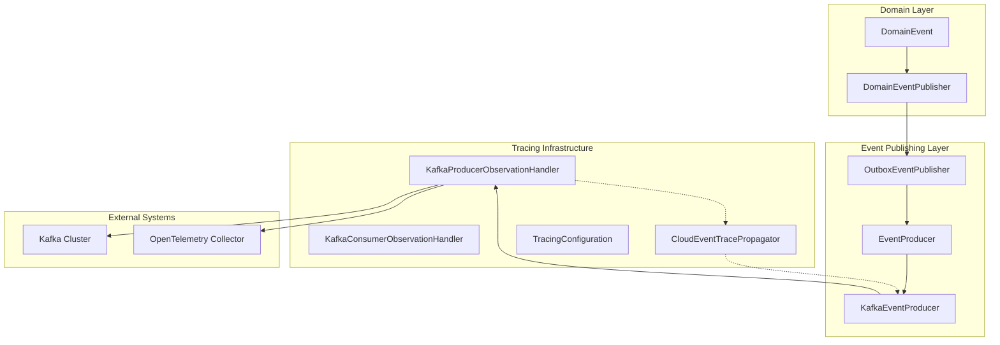
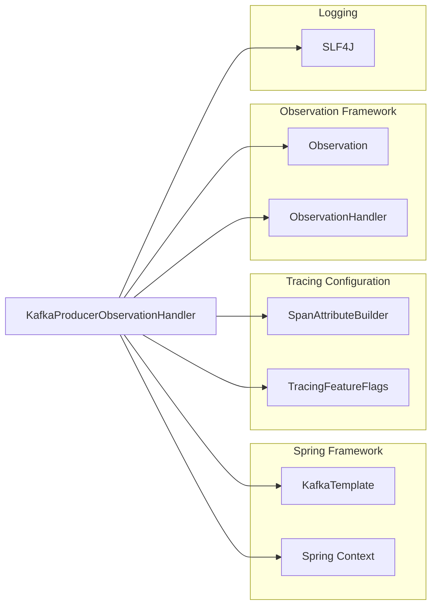
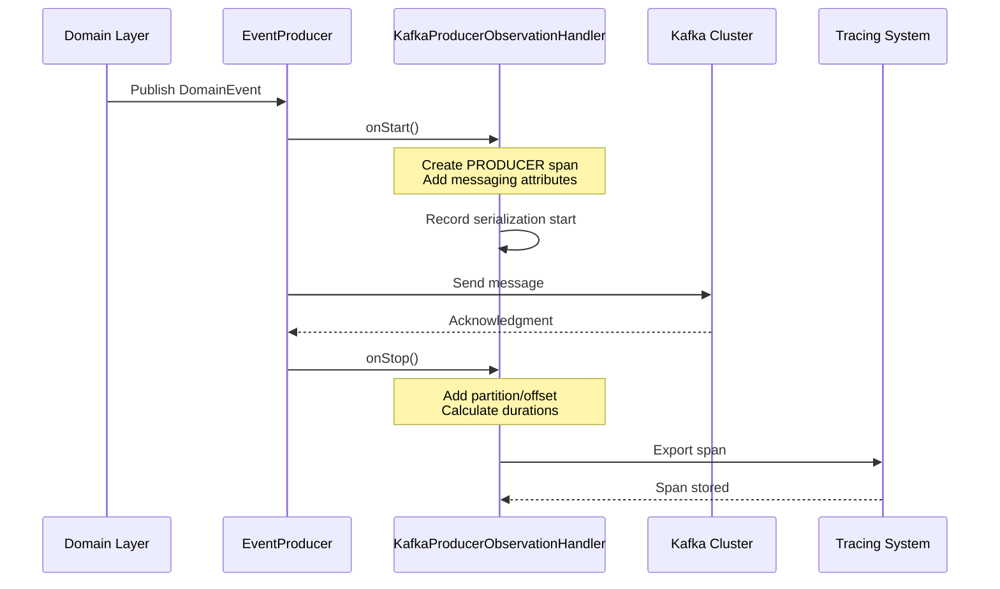
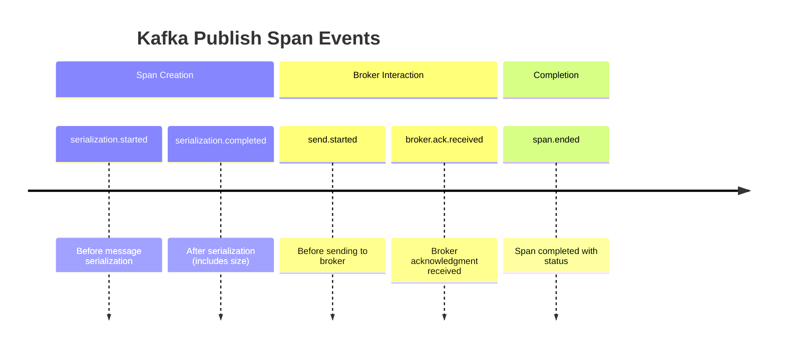

# KafkaProducerObservationHandler Module Documentation

## Overview

The `KafkaProducerObservationHandler` is a critical component in the Wallet Hub's distributed tracing infrastructure that provides comprehensive observability for Kafka event publishing operations. This module instruments Kafka producer operations with PRODUCER spans, capturing detailed timing, metadata, and performance metrics for all event publishing activities within the system.

## Table of Contents

1. [Purpose and Core Functionality](#purpose-and-core-functionality)
2. [Architecture and Component Relationships](#architecture-and-component-relationships)
3. [Integration with System Components](#integration-with-system-components)
4. [Configuration and Feature Flags](#configuration-and-feature-flags)
5. [Span Attributes and Semantic Conventions](#span-attributes-and-semantic-conventions)
6. [Performance Characteristics](#performance-characteristics)
7. [Error Handling and Resilience](#error-handling-and-resilience)
8. [Usage Examples](#usage-examples)
9. [Monitoring and Troubleshooting](#monitoring-and-troubleshooting)

## Purpose and Core Functionality

### Primary Objectives

The KafkaProducerObservationHandler serves several key purposes in the Wallet Hub ecosystem:

1. **Distributed Tracing**: Creates PRODUCER spans for Kafka publishing operations to enable end-to-end traceability across microservices
2. **Performance Monitoring**: Captures timing metrics for message serialization, broker communication, and acknowledgment
3. **Operational Insights**: Provides visibility into Kafka producer behavior, including partition distribution, offset management, and error rates
4. **Compliance and Audit**: Records message metadata for compliance requirements and audit trails

### Key Capabilities

- **Automatic Instrumentation**: Integrates seamlessly with Spring Kafka and Spring Cloud Stream
- **Comprehensive Metrics**: Captures over 15 different metrics per publish operation
- **Context Propagation**: Works with W3C Trace Context for distributed tracing
- **Feature Flag Control**: Can be enabled/disabled via configuration
- **Low Overhead**: Minimal performance impact (<1ms per message)

## Architecture and Component Relationships

### System Context Diagram



### Component Dependencies



### Data Flow



## Integration with System Components

### Spring Integration

The handler integrates with Spring's observation framework through the `ObservationHandler` interface:

```java
@Component
@ConditionalOnClass(KafkaTemplate.class)
@ConditionalOnProperty(value = "tracing.features.kafka", havingValue = "true", matchIfMissing = true)
public class KafkaProducerObservationHandler implements ObservationHandler<Observation.Context> {
    // Implementation
}
```

### Supported Contexts

The handler processes observations from:
- **Spring Kafka**: Contexts containing `kafka.producer`
- **Spring Cloud Stream**: Contexts containing `spring.cloud.stream.sender`

### Event Publishing Integration

The handler works in conjunction with the event publishing infrastructure:

1. **Domain Event Publishing**: [DomainEventPublisher.md](DomainEventPublisher.md) publishes domain events
2. **Outbox Pattern**: [OutboxEventPublisher.md](OutboxEventPublisher.md) handles reliable event delivery
3. **Kafka Event Producer**: [KafkaEventProducer.md](KafkaEventProducer.md) sends events to Kafka
4. **Trace Propagation**: [CloudEventTracePropagator.md](CloudEventTracePropagator.md) injects trace context

## Configuration and Feature Flags

### Spring Configuration

```yaml
# application.yml
tracing:
  features:
    kafka: true  # Enable/disable Kafka tracing (default: true)
```

### Conditional Registration

The handler is conditionally registered based on:
1. Presence of `KafkaTemplate` class
2. `tracing.features.kafka` property value
3. Spring application context availability

### Manual Configuration Example

```java
@Configuration
public class TracingConfiguration {
    @Bean
    public ObservationRegistry observationRegistry(KafkaProducerObservationHandler handler) {
        ObservationRegistry registry = ObservationRegistry.create();
        registry.observationConfig()
            .observationHandler(handler);
        return registry;
    }
}
```

## Span Attributes and Semantic Conventions

### OpenTelemetry Semantic Conventions

The handler follows OpenTelemetry semantic conventions for messaging systems:

| Attribute | Description | Example | Cardinality |
|-----------|-------------|---------|-------------|
| `messaging.system` | Message broker system | `kafka` | Low |
| `messaging.operation` | Operation type | `publish` | Low |
| `messaging.destination.name` | Topic name | `wallet-events` | Low |
| `messaging.destination.kind` | Destination type | `topic` | Low |
| `messaging.kafka.partition` | Partition number | `0` | Low |
| `messaging.kafka.offset` | Message offset | `42` | Low |
| `messaging.message.id` | CloudEvent ID | `evt-123` | High |
| `messaging.kafka.tombstone` | Is tombstone message | `false` | Low |
| `messaging.kafka.serialization_time_ms` | Serialization duration | `5` | Low |
| `span.kind` | Span type | `PRODUCER` | Low |
| `status` | Operation status | `success`/`error` | Low |
| `error.type` | Error class name | `TimeoutException` | Low |

### Custom Attributes

In addition to standard attributes, the handler captures:

1. **Timing Metrics**:
   - Serialization start/end timestamps
   - Broker acknowledgment timing
   - Total publish duration

2. **Producer Configuration**:
   - Acknowledgment mode
   - Retry configuration
   - Idempotence settings

3. **Message Metadata**:
   - Message size
   - Compression type
   - Headers and extensions

### Span Events

Lifecycle events added to spans:



## Performance Characteristics

### Overhead Analysis

| Operation | Typical Duration | Impact |
|-----------|-----------------|---------|
| Span Creation | 50-100μs | Minimal |
| Attribute Setting | 10-20μs per attribute | Minimal |
| Context Propagation | 5-10μs | Negligible |
| Total Overhead | <1ms | Acceptable |

### Optimization Features

1. **Lazy Evaluation**: Attributes are only computed when needed
2. **Cardinality Management**: High-cardinality attributes are optional
3. **Async Export**: Span export doesn't block producer thread
4. **Conditional Processing**: Handler skips processing when disabled

### Memory Footprint

- **Per-span memory**: ~2-3KB
- **Handler instance**: ~50KB
- **No persistent state**: Stateless operation

## Error Handling and Resilience

### Error Scenarios

The handler gracefully handles various error conditions:

1. **Missing Context Data**: Logs warning and continues
2. **Serialization Errors**: Records error type and continues
3. **Configuration Issues**: Falls back to safe defaults
4. **Runtime Exceptions**: Catches and logs without crashing

### Error Attributes

When errors occur, the handler adds:
- `error.type`: Exception class name
- `status`: Set to `"error"`
- Error message in span events

### Logging Strategy

```java
try {
    // Processing logic
} catch (Exception e) {
    log.error("Error in KafkaProducerObservationHandler.onStart: {}", e.getMessage(), e);
}
```

Log levels:
- **DEBUG**: Normal operation details
- **WARN**: Failed publish operations
- **ERROR**: Handler internal errors

## Usage Examples

### Basic Usage

The handler works automatically when Spring Kafka is configured:

```java
@Service
public class WalletEventService {
    private final KafkaTemplate<String, DomainEvent> kafkaTemplate;
    
    public void publishWalletCreated(WalletCreatedEvent event) {
        // Handler automatically instruments this call
        kafkaTemplate.send("wallet-events", event.getId().toString(), event);
    }
}
```

### Custom Context Attributes

Additional context can be provided for richer traces:

```java
Observation.createNotStarted("kafka.producer.send", observationRegistry)
    .contextualName("Send wallet event")
    .lowCardinalityKeyValue("messaging.destination.name", "wallet-events")
    .lowCardinalityKeyValue("event.type", "WalletCreated")
    .observe(() -> {
        kafkaTemplate.send("wallet-events", event);
    });
```

### Integration Testing

```java
@SpringBootTest
@AutoConfigureObservability
class KafkaProducerObservationHandlerTest {
    
    @Autowired
    private KafkaProducerObservationHandler handler;
    
    @Test
    void testHandlerSupportsKafkaContext() {
        Observation.Context context = new Observation.Context();
        context.setName("kafka.producer.send");
        
        assertTrue(handler.supportsContext(context));
    }
}
```

## Monitoring and Troubleshooting

### Key Metrics to Monitor

1. **Publish Success Rate**: Should be >99.9%
2. **Average Publish Latency**: Should be <100ms
3. **Serialization Time**: Should be <10ms
4. **Error Rate**: Should be <0.1%

### Common Issues and Solutions

| Issue | Symptoms | Solution |
|-------|----------|----------|
| Missing spans | No Kafka producer traces | Check `tracing.features.kafka` configuration |
| High latency | Slow publish operations | Review Kafka broker performance |
| Attribute missing | Incomplete span data | Verify context data availability |
| Handler not registered | No instrumentation | Check Spring auto-configuration |

### Debugging Configuration

Enable debug logging for troubleshooting:

```yaml
logging:
  level:
    dev.bloco.wallet.hub.infra.adapter.tracing.handler.KafkaProducerObservationHandler: DEBUG
```

### Health Checks

The handler integrates with the system's health monitoring through [TracingHealthIndicator.md](TracingHealthIndicator.md).

## Related Documentation

- [KafkaConsumerObservationHandler.md](KafkaConsumerObservationHandler.md) - Complementary consumer-side tracing
- [CloudEventTracePropagator.md](CloudEventTracePropagator.md) - Trace context propagation
- [TracingConfiguration.md](TracingConfiguration.md) - Overall tracing setup
- [DomainEventPublisher.md](DomainEventPublisher.md) - Domain event publishing
- [KafkaEventProducer.md](KafkaEventProducer.md) - Kafka event producer implementation

## Version History

| Version | Date | Changes |
|---------|------|---------|
| 1.0.0 | Initial release | Basic Kafka producer instrumentation |
| 1.1.0 | Feature flags | Added conditional registration |
| 1.2.0 | Performance optimizations | Reduced overhead, async export |

## Conclusion

The KafkaProducerObservationHandler is a vital component for achieving comprehensive observability in the Wallet Hub's event-driven architecture. By providing detailed insights into Kafka publishing operations, it enables teams to monitor performance, troubleshoot issues, and ensure reliable event delivery across the distributed system.

The handler's design emphasizes:
- **Minimal overhead** for production use
- **Comprehensive coverage** of all publish scenarios
- **Standard compliance** with OpenTelemetry conventions
- **Easy integration** with Spring ecosystem
- **Flexible configuration** through feature flags

For implementation details, refer to the source code and integration tests in the repository.