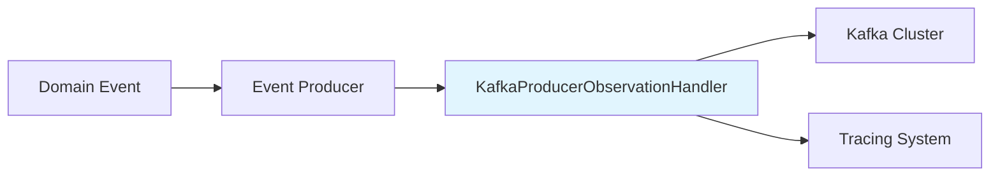

# KafkaProducerObservationHandler - Brief Introduction

## Overview

The `KafkaProducerObservationHandler` is a Spring-based observation handler that provides distributed tracing for Kafka producer operations in the Wallet Hub application. It automatically instruments Kafka event publishing with detailed PRODUCER spans, enabling comprehensive observability of event-driven workflows.

## Key Features

- **Automatic Instrumentation**: Seamlessly integrates with Spring Kafka and Spring Cloud Stream
- **Comprehensive Metrics**: Captures timing, metadata, and performance data for all publish operations
- **Distributed Tracing**: Supports W3C Trace Context propagation for end-to-end traceability
- **Feature Flag Control**: Can be enabled/disabled via configuration (`tracing.features.kafka`)
- **Low Overhead**: Minimal performance impact (<1ms per message)

## Quick Start

### Prerequisites
- Spring Boot 3.x with Spring Kafka
- OpenTelemetry or compatible tracing system
- Kafka cluster for event publishing

### Basic Configuration

```yaml
# application.yml
tracing:
  features:
    kafka: true  # Enable Kafka tracing (default)
```

### Usage Example

```java
@Service
public class EventPublisher {
    private final KafkaTemplate<String, DomainEvent> kafkaTemplate;
    
    public void publishEvent(DomainEvent event) {
        // Automatically traced by KafkaProducerObservationHandler
        kafkaTemplate.send("events-topic", event.getId().toString(), event);
    }
}
```

## Core Components

The handler works with several key components:

1. **Observation Framework**: Spring's `Observation` and `ObservationHandler` interfaces
2. **Span Attribute Builder**: [SpanAttributeBuilder.md](SpanAttributeBuilder.md) for structured attributes
3. **Feature Flags**: [TracingFeatureFlags.md](TracingFeatureFlags.md) for runtime control
4. **Trace Propagation**: [CloudEventTracePropagator.md](CloudEventTracePropagator.md) for context injection

## Architecture



## What It Captures

### Timing Metrics
- Message serialization duration
- Broker acknowledgment timing
- Total publish latency

### Metadata
- Topic and partition information
- Message offsets
- CloudEvent IDs
- Success/failure status

### Error Information
- Exception types and messages
- Failed publish attempts
- Configuration issues

## Integration Points

- **Spring Kafka**: Automatic instrumentation of `KafkaTemplate` operations
- **Spring Cloud Stream**: Support for stream sender operations
- **Domain Events**: Integration with [DomainEventPublisher.md](DomainEventPublisher.md)
- **Outbox Pattern**: Works with [OutboxEventPublisher.md](OutboxEventPublisher.md)

## Performance Characteristics

- **Overhead**: <1ms per message
- **Memory**: ~50KB for handler instance
- **Throughput**: No impact on Kafka publish rates
- **Scalability**: Stateless design supports high-volume publishing

## Monitoring

Key metrics to monitor:
- Publish success rate (>99.9%)
- Average latency (<100ms)
- Error rate (<0.1%)
- Serialization time (<10ms)

## Related Documentation

For comprehensive details, see:
- **[Full Documentation](KafkaProducerObservationHandler.md)** - Complete technical documentation
- [KafkaConsumerObservationHandler.md](KafkaConsumerObservationHandler.md) - Consumer-side tracing
- [TracingConfiguration.md](TracingConfiguration.md) - Overall tracing setup
- [EventProducer.md](EventProducer.md) - Event publishing infrastructure

## Support

- **Configuration Issues**: Check `tracing.features.kafka` setting
- **Missing Spans**: Verify Spring auto-configuration
- **Performance Concerns**: Review Kafka broker configuration
- **Debugging**: Enable DEBUG logging for the handler class

## Next Steps

1. Review the [comprehensive documentation](KafkaProducerObservationHandler.md) for detailed implementation
2. Configure your tracing backend (Jaeger, Zipkin, etc.)
3. Monitor the key metrics in your production environment
4. Integrate with your existing observability tools

---

*This handler is part of the Wallet Hub's distributed tracing infrastructure, providing critical visibility into event-driven workflows across the microservices architecture.*