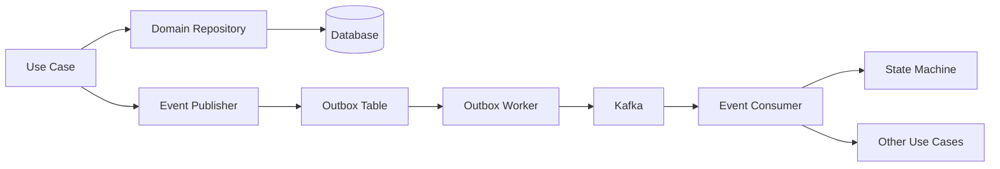
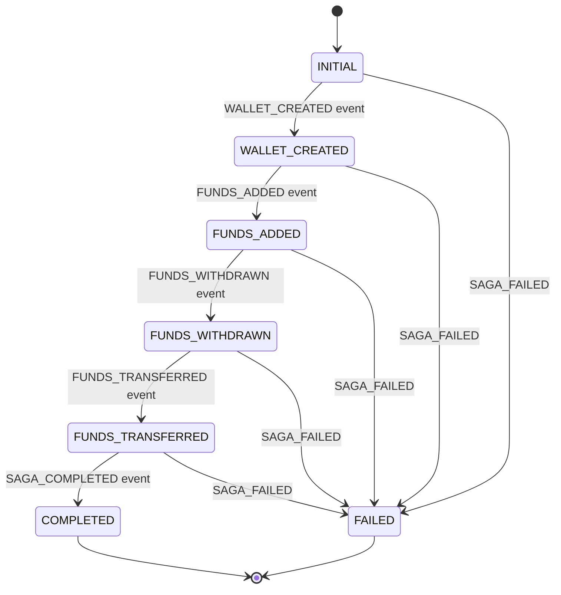
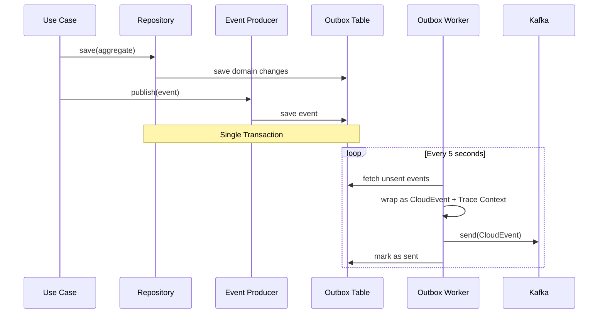
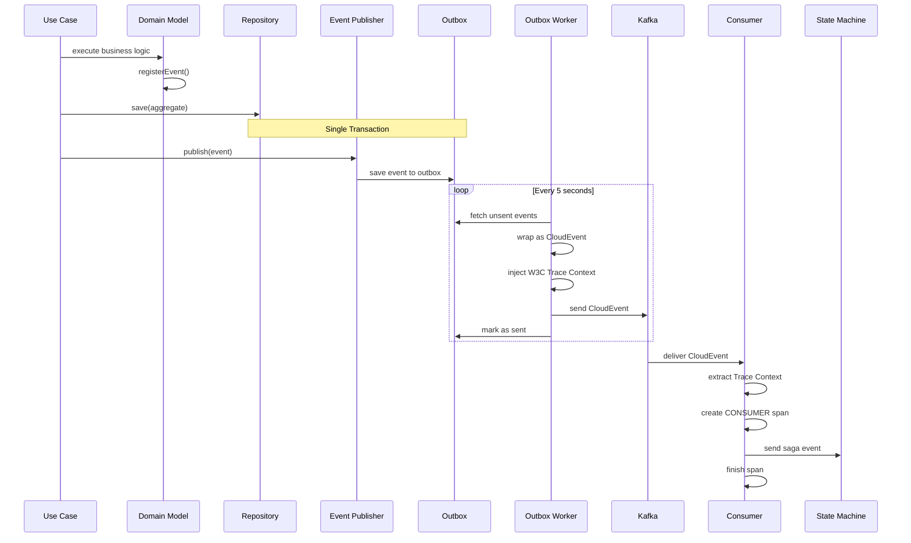
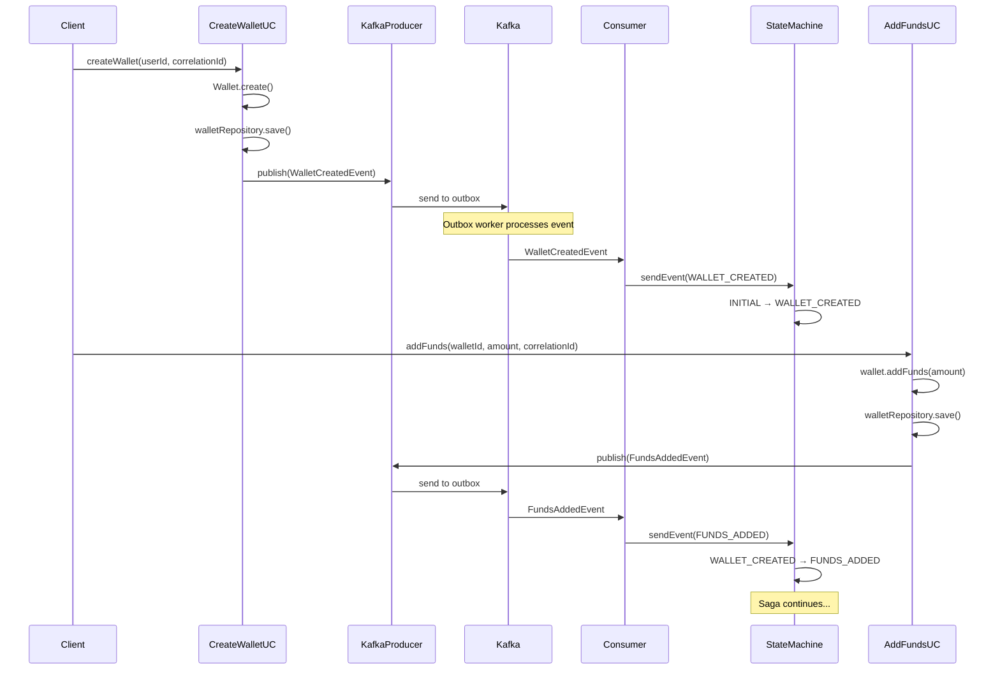
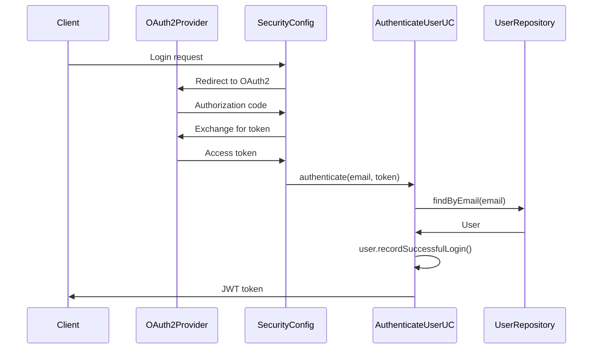

# Wallet Hub - Technical Architecture Documentation

**Version:** 0.0.1-SNAPSHOT
**Last Updated:** 2026-01-12
**Spring Boot:** 3.5.5
**Java:** 24

---

## Table of Contents

1. [System Overview](#system-overview)
2. [Architectural Patterns](#architectural-patterns)
3. [Technology Stack](#technology-stack)
4. [Domain Model](#domain-model)
5. [Use Cases & Application Layer](#use-cases--application-layer)
6. [Event-Driven Architecture](#event-driven-architecture)
7. [Infrastructure Layer](#infrastructure-layer)
8. [Data Persistence](#data-persistence)
9. [State Management & Sagas](#state-management--sagas)
10. [Observability & Tracing](#observability--tracing)
11. [Security](#security)
12. [Testing Strategy](#testing-strategy)
13. [Configuration & Deployment](#configuration--deployment)

---

## System Overview

**Wallet Hub** is an event-driven cryptocurrency wallet management service designed to provide comprehensive wallet operations, transaction management, and multi-blockchain support. The system emphasizes:

- **Domain-Driven Design** principles
- **Event Sourcing** and **CQRS** patterns
- **Distributed transaction coordination** via Saga pattern
- **Clean Architecture** with clear separation of concerns
- **Reactive programming** where appropriate

### Key Capabilities

- Multi-wallet management per user
- Multi-blockchain network support (via Chainlist integration)
- ERC20 token management
- Transaction lifecycle tracking
- Address management with status tracking
- Vault integration for secure key storage
- Portfolio aggregation and balance tracking

### Core Principles

1. **Domain Purity**: Business logic is isolated from infrastructure concerns
2. **Event-First**: All state changes produce domain events
3. **Transactional Consistency**: Outbox pattern ensures reliable event delivery
4. **Idempotency**: All event consumers handle duplicate events gracefully
5. **Observability**: Comprehensive distributed tracing and metrics

---

## Architectural Patterns

### Hexagonal Architecture (Ports & Adapters)

The codebase strictly follows Hexagonal Architecture, organizing code into three concentric layers:

```
┌───────────────────────────────────────────────────────────┐
│                    INFRASTRUCTURE LAYER                   │
│  (Adapters: Kafka, JPA, REST, Redis, MongoDB, Security)   │
│                                                           │
│  ┌───────────────────────────────────────────────────┐    │
│  │           APPLICATION LAYER (Use Cases)           │    │
│  │  (Orchestrates domain logic, no business rules)   │    │
│  │                                                   │    │
│  │  ┌────────────────────────────────────────────┐   │    │
│  │  │         DOMAIN LAYER (Core)                │   │    │
│  │  │  (Pure business logic, entities, events)   │   │    │
│  │  │  NO framework dependencies                 │   │    │
│  │  └────────────────────────────────────────────┘   │    │
│  └───────────────────────────────────────────────────┘    │
└───────────────────────────────────────────────────────────┘
```

**Dependency Rule**: Dependencies flow **inward only**
- Infrastructure → Application → Domain
- Domain has ZERO external dependencies
- Interfaces (Ports) defined in domain, implemented in infrastructure

#### Directory Structure

```
src/main/java/dev/bloco/wallet/hub/
├── domain/                  # CORE - Pure business logic
│   ├── event/               # Domain events (immutable)
│   │   ├── wallet/          # Wallet-related events
│   │   ├── user/            # User-related events
│   │   ├── transaction/     # Transaction events
│   │   └── common/          # Base event interfaces
│   ├── gateway/             # Port interfaces (repositories, services)
│   └── model/               # Domain entities (aggregate roots)
│       ├── wallet/
│       ├── user/
│       ├── transaction/
│       ├── address/
│       ├── token/
│       ├── network/
│       ├── vault/
│       └── common/
│
├── usecase/                 # APPLICATION - Orchestration layer
│   ├── CreateWalletUseCase.java
│   ├── AddFundsUseCase.java
│   └── [30+ use cases]
│
└── infra/                   # INFRASTRUCTURE - Adapters
    ├── adapter/
    │   ├── event/           # Kafka producers/consumers
    │   │   ├── producer/
    │   │   └── consumer/
    │   ├── security/        # OAuth2, authentication
    │   └── tracing/         # Observability (Micrometer, OTLP)
    └── provider/
        ├── data/            # JPA entities, repositories
        │   ├── entity/
        │   ├── repository/
        │   └── config/      # State machine, saga config
        └── mapper/          # MapStruct domain↔entity mapping
```

### Event-Driven Architecture

The system is fundamentally event-driven, using Apache Kafka for asynchronous communication:



**Key Components**:
- **Outbox Pattern**: Transactional event storage
- **CloudEvents 1.0**: Standardized event envelope
- **W3C Trace Context**: Distributed tracing propagation
- **Saga State Machine**: Distributed transaction coordination

### Saga Pattern

Long-running distributed transactions are coordinated using Spring State Machine with JPA persistence:



**States**: `INITIAL`, `WALLET_CREATED`, `FUNDS_ADDED`, `FUNDS_WITHDRAWN`, `FUNDS_TRANSFERRED`, `COMPLETED`, `FAILED`

**Events**: Saga events trigger state transitions, with correlation IDs tracking the entire flow.

### Outbox Pattern

Ensures reliable event publishing with transactional guarantees:



**Benefits**:
- Atomicity: Event publishing is part of the same transaction as data changes
- Reliability: Events are never lost; retries on failure
- Ordering: Events are published in the order they were created
- Idempotency: Consumers can safely reprocess events

---

## Technology Stack

### Core Frameworks

| Component | Technology | Version | Purpose |
|-----------|-----------|---------|---------|
| Language | Java | 24 | Primary language |
| Build Tool | Maven | 3.x | Dependency management |
| Framework | Spring Boot | 3.5.5 | Application framework |
| Cloud | Spring Cloud | 2025.0.0 | Distributed systems patterns |

### Messaging & Events

| Component | Technology | Version | Purpose |
|-----------|-----------|---------|---------|
| Message Broker | Apache Kafka | - | Event streaming platform |
| Stream Processing | Spring Cloud Stream | 2025.0.0 | Stream abstraction |
| Kafka Streams | Apache Kafka Streams | - | Stream processing |
| Event Format | CloudEvents | 4.0.1 | Standardized event envelope |

### Persistence

| Component | Technology | Version | Purpose |
|-----------|-----------|---------|---------|
| Relational DB (Dev) | H2 | - | In-memory/file database |
| Relational DB (Prod) | PostgreSQL | - | Primary relational store |
| ORM | JPA/Hibernate | 6.6.29 | Object-relational mapping |
| Reactive DB | R2DBC | - | Reactive database access |
| Cache | Redis (Reactive) | - | Distributed cache |
| Document Store | MongoDB (Reactive) | - | Document storage |

### State Management

| Component | Technology | Version | Purpose |
|-----------|-----------|---------|---------|
| State Machine | Spring State Machine | 4.0.1 | Saga orchestration |
| State Persistence | JPA | - | State machine persistence |

### Observability

| Component | Technology | Version | Purpose |
|-----------|-----------|---------|---------|
| Metrics | Micrometer | - | Application metrics |
| Tracing | Micrometer Tracing + Brave | - | Distributed tracing |
| Trace Format | W3C Trace Context | 1.0 | Trace propagation standard |
| Exporters | Prometheus, OTLP | - | Metrics/traces export |
| Registry | Prometheus | - | Metrics scraping |

### Security

| Component | Technology | Version | Purpose |
|-----------|-----------|---------|---------|
| Framework | Spring Security | 6.x | Security framework |
| OAuth2 | Spring OAuth2 Client | - | OAuth2 authentication |
| Vault | Spring Vault | 3.2.0 | Secret management |

### Additional

| Component | Technology | Version | Purpose |
|-----------|-----------|---------|---------|
| Mapping | MapStruct | 1.6.3 | Bean mapping |
| Resilience | Resilience4j | - | Circuit breaker, retry |
| Scheduling | Spring Quartz | - | Job scheduling |
| Integration | Apache Camel | 4.14.0 | Integration patterns |

---

## Domain Model

The domain layer contains **pure business logic** with zero framework dependencies. All domain entities extend `AggregateRoot` or `Entity` and publish domain events.

### Aggregate Roots

#### 1. Wallet

**File**: `/src/main/java/dev/bloco/wallet/hub/domain/model/Wallet.java`

Central aggregate for wallet management.

```java
public class Wallet extends AggregateRoot {
    private String name;
    private String description;
    private Set<UUID> addressIds;
    private Instant createdAt;
    private Instant updatedAt;
    private BigDecimal balance;
    private UUID correlationId;
    private WalletStatus status;
    private UUID userId;
}
```

**Statuses**: `ACTIVE`, `INACTIVE`, `LOCKED`, `RECOVERING`, `DELETED`

**Key Behaviors**:
- `create()`: Creates wallet and emits `WalletCreatedEvent`
- `updateInfo()`: Updates metadata, emits `WalletUpdatedEvent`
- `addFunds(amount)`: Increases balance, validates amount > 0
- `withdrawFunds(amount)`: Decreases balance, validates sufficient balance
- `activate()`, `deactivate()`, `lock()`, `delete()`: Status transitions
- `initiateRecovery()`: Starts wallet recovery process
- `addAddress()`, `removeAddress()`: Manages associated addresses
- `validateOperationAllowed()`: Guards operations by status

**Invariants**:
- Balance cannot be negative
- Only `ACTIVE` wallets can perform fund operations
- Deleted wallets cannot be modified

#### 2. User

**File**: `/src/main/java/dev/bloco/wallet/hub/domain/model/user/User.java`

Manages user identity, authentication, and profile.

```java
public class User extends AggregateRoot {
    private String name;
    private String email;
    private String passwordHash;
    private UserStatus status;
    private Instant createdAt;
    private Instant updatedAt;
    private Instant lastLoginAt;
    private boolean emailVerified;
    private String emailVerificationToken;
    private TwoFactorAuth twoFactorAuth;
    private int failedLoginAttempts;
    private Instant lockedUntil;
}
```

**Statuses**: `PENDING_VERIFICATION`, `ACTIVE`, `DEACTIVATED`, `SUSPENDED`

**Key Behaviors**:
- `create()`: Creates user, emits `UserCreatedEvent`, status = `PENDING_VERIFICATION`
- `updateProfile()`: Updates name/email, requires re-verification for email changes
- `changePassword()`: Updates password hash, resets failed login attempts
- `activate()`, `deactivate()`, `suspend()`: Status transitions
- `verifyEmail()`: Marks email as verified, auto-activates if pending
- `recordSuccessfulLogin()`: Updates last login, resets failed attempts
- `recordFailedLogin()`: Increments counter, locks after 5 attempts for 30 minutes
- `isLocked()`: Checks if account is temporarily locked
- `enableTwoFactorAuth()`, `disableTwoFactorAuth()`: 2FA management

**Security Features**:
- Account locking after 5 failed login attempts
- 30-minute lockout period
- Two-factor authentication support
- Email verification required

#### 3. Transaction

**File**: `/src/main/java/dev/bloco/wallet/hub/domain/model/transaction/Transaction.java`

Represents blockchain transactions.

```java
public class Transaction extends AggregateRoot {
    private final UUID networkId;
    private final TransactionHash hash;
    private final String fromAddress;
    private final String toAddress;
    private final BigDecimal value;
    private BigDecimal gasPrice;
    private BigDecimal gasLimit;
    private BigDecimal gasUsed;
    private final String data;
    private final Instant timestamp;
    private Long blockNumber;
    private String blockHash;
    private TransactionStatus status;
}
```

**Statuses**: `PENDING`, `CONFIRMED`, `FAILED`

**Key Behaviors**:
- `create()`: Creates transaction with `PENDING` status, emits `TransactionCreatedEvent`
- `confirm()`: Marks as `CONFIRMED`, records block info and gas used
- `fail()`: Marks as `FAILED` with reason
- `setGasInfo()`: Sets gas price and limit
- `isConfirmed()`, `isPending()`, `isFailed()`: Status checks

**Lifecycle**:
1. Transaction created → `PENDING`
2. Blockchain confirms → `CONFIRMED` (with block number, hash, gas used)
3. OR blockchain rejects → `FAILED` (with reason)

### Value Objects & Entities

#### Address

**File**: `/src/main/java/dev/bloco/wallet/hub/domain/model/address/Address.java`

Represents blockchain addresses.

```java
public class Address extends Entity {
    private String address;
    private UUID networkId;
    private UUID walletId;
    private AddressType type;         // EOA, CONTRACT
    private AddressStatus status;     // ACTIVE, INACTIVE, COMPROMISED
    private Instant createdAt;
    private Instant updatedAt;
}
```

#### Token

**File**: `/src/main/java/dev/bloco/wallet/hub/domain/model/token/Token.java`

ERC20 token metadata.

```java
public class Token extends Entity {
    private String name;
    private String symbol;
    private int decimals;
    private String contractAddress;
    private UUID networkId;
    private TokenType type;          // NATIVE, ERC20, ERC721, ERC1155
    private String logoUrl;
    private boolean verified;
}
```

#### Network

**File**: `/src/main/java/dev/bloco/wallet/hub/domain/model/network/Network.java`

Blockchain network configuration.

```java
public class Network extends Entity {
    private String name;
    private long chainId;
    private String rpcUrl;
    private String explorerUrl;
    private String currency;
    private NetworkStatus status;    // ACTIVE, INACTIVE, DEPRECATED
    private boolean testnet;
}
```

#### Vault

**File**: `/src/main/java/dev/bloco/wallet/hub/domain/model/vault/Vault.java`

Secure key storage abstraction.

```java
public class Vault extends Entity {
    private String name;
    private VaultType type;          // LOCAL, HARDWARE, CLOUD, HSM
    private VaultStatus status;      // ACTIVE, LOCKED, UNSEALED
    private VaultConfiguration config;
    private Instant createdAt;
}
```

### Domain Events

**Base Class**: `/src/main/java/dev/bloco/wallet/hub/domain/event/common/DomainEvent.java`

```java
public abstract class DomainEvent {
    private final UUID eventId;           // Unique event identifier
    private final Instant occurredOn;     // Event timestamp
    private final UUID correlationId;     // Correlation for tracing
}
```

All domain events are **immutable** and extend `DomainEvent`.

#### Wallet Events

| Event | Trigger | Data |
|-------|---------|------|
| `WalletCreatedEvent` | Wallet created | walletId, correlationId |
| `WalletUpdatedEvent` | Info updated | walletId, name, description |
| `WalletStatusChangedEvent` | Status transition | walletId, oldStatus, newStatus, reason |
| `WalletDeletedEvent` | Wallet deleted | walletId, reason |
| `WalletRecoveryInitiatedEvent` | Recovery started | walletId, userId, recoveryMethod |
| `FundsAddedEvent` | Funds added | walletId, amount, correlationId |
| `FundsWithdrawnEvent` | Funds withdrawn | walletId, amount, correlationId |
| `FundsTransferredEvent` | Funds transferred | fromWalletId, toWalletId, amount |
| `TokenAddedToWalletEvent` | Token enabled | walletId, tokenId |
| `TokenRemovedFromWalletEvent` | Token disabled | walletId, tokenId |
| `AddressAddedToWalletEvent` | Address linked | walletId, addressId |
| `AddressRemovedFromWalletEvent` | Address unlinked | walletId, addressId |

#### User Events

| Event | Trigger | Data |
|-------|---------|------|
| `UserCreatedEvent` | User created | userId, name, email |
| `UserStatusChangedEvent` | Status changed | userId, oldStatus, newStatus, reason |
| `UserProfileUpdatedEvent` | Profile updated | userId, name, email |
| `UserAuthenticatedEvent` | Login success | userId, timestamp |

#### Transaction Events

| Event | Trigger | Data |
|-------|---------|------|
| `TransactionCreatedEvent` | TX created | txId, networkId, hash, from, to |
| `TransactionStatusChangedEvent` | Status changed | txId, oldStatus, newStatus, reason |
| `TransactionConfirmedEvent` | TX confirmed | txId, blockNumber, blockHash, gasUsed |

---

## Use Cases & Application Layer

The **usecase** package contains application services that orchestrate domain logic. Use cases:
- Have **no business logic** (that's in domain)
- Coordinate domain objects and repositories
- Publish domain events
- Handle cross-aggregate operations

**Total Use Cases**: 34

### Wallet Use Cases

**Package**: `/src/main/java/dev/bloco/wallet/hub/usecase/`

| Use Case | Purpose | Key Operations |
|----------|---------|----------------|
| `CreateWalletUseCase` | Create new wallet | Create wallet aggregate, save, publish event |
| `UpdateWalletUseCase` | Update wallet info | Load wallet, call `updateInfo()`, save |
| `ActivateWalletUseCase` | Activate wallet | Load wallet, call `activate()`, save |
| `DeactivateWalletUseCase` | Deactivate wallet | Load wallet, call `deactivate()`, save |
| `DeleteWalletUseCase` | Soft-delete wallet | Load wallet, call `delete()`, save |
| `RecoverWalletUseCase` | Initiate recovery | Load wallet, call `initiateRecovery()`, save |
| `GetWalletDetailsUseCase` | Retrieve wallet | Load from repository |
| `ListWalletsUseCase` | List user's wallets | Query by userId |

### Funds Management Use Cases

| Use Case | Purpose | Key Operations |
|----------|---------|----------------|
| `AddFundsUseCase` | Add funds to wallet | Load wallet, call `addFunds()`, save, publish event |
| `WithdrawFundsUseCase` | Withdraw funds | Load wallet, call `withdrawFunds()`, save, publish event |
| `TransferFundsUseCase` | Transfer between wallets | Load both wallets, withdraw from source, add to dest, save both, publish event |
| `CheckBalanceUseCase` | Query wallet balance | Load wallet, return balance |

### Transaction Use Cases

| Use Case | Purpose | Key Operations |
|----------|---------|----------------|
| `CreateTransactionUseCase` | Initiate blockchain TX | Create Transaction aggregate, save, publish event |
| `ConfirmTransactionUseCase` | Mark TX as confirmed | Load TX, call `confirm()`, save |
| `FailTransactionUseCase` | Mark TX as failed | Load TX, call `fail()`, save |
| `EstimateTransactionFeeUseCase` | Calculate gas fees | Query network, calculate fees |

### User Use Cases

| Use Case | Purpose | Key Operations |
|----------|---------|----------------|
| `CreateUserUseCase` | Register new user | Create User aggregate, hash password, save, publish event |
| `AuthenticateUserUseCase` | Login user | Verify credentials, update login timestamp |
| `UpdateUserProfileUseCase` | Update profile | Load user, call `updateProfile()`, save |
| `ChangePasswordUseCase` | Change password | Load user, verify old password, call `changePassword()`, save |
| `DeactivateUserUseCase` | Deactivate account | Load user, call `deactivate()`, save |

### Address Use Cases

| Use Case | Purpose | Key Operations |
|----------|---------|----------------|
| `CreateAddressUseCase` | Generate new address | Generate keys via vault, create Address, save |
| `ImportAddressUseCase` | Import existing address | Create Address from provided key, save |
| `UpdateAddressStatusUseCase` | Change address status | Load address, update status, save |
| `ListAddressesByWalletUseCase` | List wallet addresses | Query by walletId |
| `ValidateAddressUseCase` | Validate address format | Check checksum, format |

### Network & Token Use Cases

| Use Case | Purpose | Key Operations |
|----------|---------|----------------|
| `AddNetworkUseCase` | Add blockchain network | Create Network, save |
| `ListNetworksUseCase` | List available networks | Query all active networks |
| `ListSupportedTokensUseCase` | List tokens for network | Query tokens by networkId |
| `AddTokenToWalletUseCase` | Enable token tracking | Link token to wallet |
| `RemoveTokenFromWalletUseCase` | Disable token tracking | Unlink token from wallet |

### Portfolio Use Cases

| Use Case | Purpose | Key Operations |
|----------|---------|----------------|
| `GetAddressBalanceUseCase` | Get address balance | Query blockchain, return balance |
| `GetTokenBalanceUseCase` | Get token balance | Query ERC20 contract, return balance |
| `GetPortfolioSummaryUseCase` | Aggregate portfolio | Sum all balances across addresses/tokens |

### Use Case Example

**CreateWalletUseCase**:

```java
public record CreateWalletUseCase(
    WalletRepository walletRepository,
    DomainEventPublisher eventPublisher
) {
    public Wallet createWallet(UUID userId, String correlationId) {
        // 1. Create domain aggregate
        Wallet wallet = Wallet.create(UUID.randomUUID(), "Default Wallet", "");

        // 2. Persist to database
        walletRepository.save(wallet);

        // 3. Publish domain event
        WalletCreatedEvent event = new WalletCreatedEvent(
            wallet.getId(),
            UUID.fromString(correlationId)
        );
        eventPublisher.publish(event);

        return wallet;
    }
}
```

**Key Characteristics**:
- Java `record` (immutable, constructor injection)
- Delegates business logic to domain (`Wallet.create()`)
- Orchestrates repository and event publisher
- Thin layer between domain and infrastructure

---

## Event-Driven Architecture

### Event Flow



### Event Producer

**Implementation**: `/src/main/java/dev/bloco/wallet/hub/infra/adapter/event/producer/KafkaEventProducer.java`

**Interface**: `EventProducer`

```java
public interface EventProducer {
    void produceWalletCreatedEvent(WalletCreatedEvent event);
    void produceFundsAddedEvent(FundsAddedEvent event);
    void produceFundsWithdrawnEvent(FundsWithdrawnEvent event);
    void produceFundsTransferredEvent(FundsTransferredEvent event);
}
```

**Implementation Responsibilities**:
1. Serialize domain event to JSON
2. Save to `outbox` table (transactional)
3. Background worker processes outbox every 5 seconds
4. Wrap event as CloudEvent 1.0
5. Inject W3C Trace Context as extensions
6. Send to Kafka via `StreamBridge`
7. Mark event as sent on success

**Kafka Bindings**:

```yaml
spring.cloud.stream.bindings:
  walletCreatedEventProducer-out-0:
    destination: wallet-created-topic
  fundsAddedEventProducer-out-0:
    destination: funds-added-topic
  fundsWithdrawnEventProducer-out-0:
    destination: funds-withdrawn-topic
  fundsTransferredEventProducer-out-0:
    destination: funds-transferred-topic
```

**Channel Pattern**: `{eventType}-out-0`

### Event Consumers

**Location**: `/src/main/java/dev/bloco/wallet/hub/infra/adapter/event/consumer/`

| Consumer | Event | Responsibility |
|----------|-------|----------------|
| `WalletCreatedEventConsumer` | `WalletCreatedEvent` | Extract trace context, validate correlation ID, send `WALLET_CREATED` to state machine |
| `FundsAddedEventConsumer` | `FundsAddedEvent` | Process funds addition, send `FUNDS_ADDED` to state machine |
| `FundsWithdrawnEventConsumer` | `FundsWithdrawnEvent` | Process withdrawal, send `FUNDS_WITHDRAWN` to state machine |
| `FundsTransferredEventConsumer` | `FundsTransferredEvent` | Process transfer, send `FUNDS_TRANSFERRED` to state machine |

**Consumer Pattern**:

```java
@Component
public class WalletCreatedEventConsumer {
    private final StateMachine<SagaStates, SagaEvents> stateMachine;
    private final CloudEventTracePropagator tracePropagator;

    @Bean
    public Consumer<Message<CloudEvent>> walletCreatedEventConsumerFunction() {
        return message -> {
            CloudEvent cloudEvent = message.getPayload();

            // 1. Extract W3C Trace Context, create CONSUMER span
            Span span = tracePropagator.extractTraceContext(cloudEvent);
            span.name("consume:WalletCreatedEvent");
            span.tag("event.type", "WalletCreatedEvent");

            try {
                // 2. Parse event payload
                String payload = new String(cloudEvent.getData().toBytes());
                String correlationId = extractCorrelationId(payload);

                // 3. Send to state machine
                if (correlationId != null) {
                    var msg = MessageBuilder
                        .withPayload(SagaEvents.WALLET_CREATED)
                        .setHeader("correlationId", UUID.fromString(correlationId))
                        .build();
                    stateMachine.sendEvent(Mono.just(msg)).subscribe();
                    log.info("Wallet created: {}", correlationId);
                } else {
                    stateMachine.sendEvent(
                        Mono.just(MessageBuilder.withPayload(SagaEvents.SAGA_FAILED).build())
                    ).subscribe();
                }

                span.end();
            } catch (Exception e) {
                span.error(e);
                span.end();
                throw e;
            }
        };
    }
}
```

**Key Features**:
- **CloudEvent support**: Receives CloudEvents from Kafka
- **W3C Trace Context**: Extracts and propagates traces
- **Idempotency**: Handles duplicate events via correlation ID
- **State Machine integration**: Triggers saga transitions
- **Error handling**: Logs errors, sends `SAGA_FAILED` event

### CloudEvents Integration

**Specification**: CloudEvents 1.0
**Library**: `io.cloudevents:cloudevents-spring:4.0.1`

**CloudEvent Structure**:

```json
{
  "specversion": "1.0",
  "type": "walletCreatedEventProducer",
  "source": "/wallet-hub",
  "id": "550e8400-e29b-41d4-a716-446655440000",
  "datacontenttype": "application/json",
  "data": {
    "walletId": "123e4567-e89b-12d3-a456-426614174000",
    "correlationId": "789e0123-e45b-67c8-d901-234567890abc"
  },
  "extensions": {
    "traceparent": "00-4bf92f3577b34da6a3ce929d0e0e4736-00f067aa0ba902b7-01",
    "tracestate": "..."
  }
}
```

**Extensions**:
- `traceparent`: W3C Trace Context 1.0 header
- `tracestate`: Additional trace state

**Utility**: `/src/main/java/dev/bloco/wallet/hub/infra/util/CloudEventUtils.java`

---

## Infrastructure Layer

### Data Providers

**Location**: `/src/main/java/dev/bloco/wallet/hub/infra/provider/`

#### JPA Repositories

**Location**: `/src/main/java/dev/bloco/wallet/hub/infra/provider/data/repository/`

| Repository | Entity | Domain Gateway |
|------------|--------|----------------|
| `SpringDataWalletRepository` | `WalletEntity` | `WalletRepository` |
| `SpringDataUserRepository` | `UserEntity` | `UserRepository` |
| `SpringDataTransactionRepository` | `TransactionEntity` | `TransactionRepository` |
| `OutboxRepository` | `OutboxEvent` | N/A (internal) |
| `StateMachineRepository` | State Machine Entities | N/A (Spring SM) |

**Pattern**:

```java
// Domain gateway (port)
public interface WalletRepository {
    Wallet save(Wallet wallet);
    Optional<Wallet> findById(UUID id);
    List<Wallet> findByUserId(UUID userId);
    void delete(UUID id);
}

// JPA repository (adapter)
@Repository
public interface SpringDataWalletRepository extends JpaRepository<WalletEntity, UUID> {
    List<WalletEntity> findByUserId(UUID userId);
}

// Implementation (adapter)
@Component
public class JpaWalletRepository implements WalletRepository {
    private final SpringDataWalletRepository jpaRepository;
    private final WalletMapper mapper;

    @Override
    public Wallet save(Wallet wallet) {
        WalletEntity entity = mapper.toEntity(wallet);
        WalletEntity saved = jpaRepository.save(entity);
        return mapper.toDomain(saved);
    }
}
```

#### MapStruct Mappers

**Location**: `/src/main/java/dev/bloco/wallet/hub/infra/provider/mapper/`

**Purpose**: Convert between domain models and JPA entities.

```java
@Mapper(componentModel = "spring")
public interface WalletMapper {
    WalletEntity toEntity(Wallet wallet);
    Wallet toDomain(WalletEntity entity);

    @Mapping(target = "addressIds", ignore = true)
    Wallet toDomainSummary(WalletEntity entity);
}
```

**Why MapStruct?**
- Compile-time generation (no reflection)
- Type-safe mapping
- Handles collections, nested objects, custom conversions
- Better performance than manual mapping

### Outbox Implementation

**Outbox Table**:

```java
@Entity
@Table(name = "outbox")
public class OutboxEvent {
    @Id
    @GeneratedValue
    private UUID id;

    private String eventType;         // e.g., "walletCreatedEventProducer"

    @Lob
    private String payload;           // JSON serialized event

    private String correlationId;

    private boolean sent = false;

    private Instant createdAt;

    private Instant sentAt;
}
```

**OutboxService**:

```java
@Service
public class OutboxService {
    private final OutboxRepository outboxRepository;

    @Transactional
    public void saveOutboxEvent(String eventType, String payload, String correlationId) {
        OutboxEvent event = new OutboxEvent();
        event.setEventType(eventType);
        event.setPayload(payload);
        event.setCorrelationId(correlationId);
        outboxRepository.save(event);
    }

    @Transactional
    public void markEventAsSent(OutboxEvent event) {
        event.setSent(true);
        event.setSentAt(Instant.now());
        outboxRepository.save(event);
    }

    public List<OutboxEvent> getUnsentEvents() {
        return outboxRepository.findBySentFalse();
    }
}
```

**Outbox Worker** (in `KafkaEventProducer`):

```java
@Scheduled(fixedRate = 5000) // Every 5 seconds
public void processOutbox() {
    List<OutboxEvent> unsentEvents = outboxService.getUnsentEvents();

    unsentEvents.forEach(event -> {
        try {
            // Wrap as CloudEvent
            CloudEvent cloudEvent = CloudEventBuilder.v1()
                .withId(event.getId().toString())
                .withType(event.getEventType())
                .withSource(URI.create("/wallet-hub"))
                .withDataContentType("application/json")
                .withData(event.getPayload().getBytes())
                .build();

            // Inject W3C Trace Context
            CloudEvent enrichedEvent = tracePropagator.injectTraceContext(cloudEvent);

            // Send to Kafka
            String channel = event.getEventType() + "-out-0";
            boolean sent = streamBridge.send(channel, enrichedEvent);

            if (sent) {
                outboxService.markEventAsSent(event);
                log.debug("Sent event [type={}, id={}]", event.getEventType(), event.getId());
            }
        } catch (Exception e) {
            log.error("Error processing outbox event: {}", e.getMessage(), e);
        }
    });
}
```

---

## Data Persistence

### Database Configuration

**Default (Development)**:

```yaml
spring:
  datasource:
    url: jdbc:h2:file:./db/wallet;DB_CLOSE_ON_EXIT=FALSE;AUTO_RECONNECT=TRUE
    driver-class-name: org.h2.Driver
    username: sa
    password:
  h2:
    console:
      enabled: true
  jpa:
    hibernate:
      ddl-auto: update
    show-sql: true
    database-platform: org.hibernate.dialect.H2Dialect
```

**H2 Console**: http://localhost:8080/h2-console

**Production (PostgreSQL)**:

```yaml
spring:
  datasource:
    url: jdbc:postgresql://localhost:5432/wallet
    username: postgres
    password: secret
  jpa:
    hibernate:
      ddl-auto: validate
    database-platform: org.hibernate.dialect.PostgreSQLDialect
```

### Entity Scanning

**Application Main Class**:

```java
@SpringBootApplication
@EntityScan(basePackages = {
    "dev.bloco.wallet.hub.infra.provider.data.entity",
    "dev.bloco.wallet.hub.infra.provider.data",
    "org.springframework.statemachine.data.jpa"  // State machine entities
})
public class WalletHubApplication {
    public static void main(String[] args) {
        SpringApplication.run(WalletHubApplication.class, args);
    }
}
```

### JPA Entities

**Location**: `/src/main/java/dev/bloco/wallet/hub/infra/provider/data/entity/`

| Entity | Table | Domain Model |
|--------|-------|--------------|
| `WalletEntity` | `wallet` | `Wallet` |
| `UserEntity` | `user` | `User` |
| `TransactionEntity` | `transaction` | `Transaction` |
| `OutboxEvent` | `outbox` | N/A |

**Example Entity**:

```java
@Entity
@Table(name = "wallet")
public class WalletEntity {
    @Id
    private UUID id;

    private String name;
    private String description;

    @Column(precision = 36, scale = 18)
    private BigDecimal balance;

    @Enumerated(EnumType.STRING)
    private WalletStatus status;

    @Column(name = "user_id")
    private UUID userId;

    @Column(name = "created_at", nullable = false, updatable = false)
    private Instant createdAt;

    @Column(name = "updated_at")
    private Instant updatedAt;

    @PrePersist
    protected void onCreate() {
        createdAt = Instant.now();
        updatedAt = Instant.now();
    }

    @PreUpdate
    protected void onUpdate() {
        updatedAt = Instant.now();
    }
}
```

**Key Annotations**:
- `@Entity`: Marks as JPA entity
- `@Table`: Specifies table name
- `@Id`: Primary key
- `@Column`: Column configuration (precision, scale, nullable, updatable)
- `@Enumerated(EnumType.STRING)`: Enum as string (not ordinal)
- `@PrePersist`, `@PreUpdate`: Lifecycle callbacks

### Reactive Persistence

**R2DBC** (Reactive Relational Database Connectivity):

```yaml
spring:
  r2dbc:
    url: r2dbc:postgresql://localhost:5432/wallet
    username: postgres
    password: secret
```

**Redis (Reactive)**:

```yaml
spring:
  data:
    redis:
      host: localhost
      port: 6379
```

**MongoDB (Reactive)**:

```yaml
spring:
  data:
    mongodb:
      uri: mongodb://localhost:27017/wallet
```

**Usage**: Reactive repositories extend `ReactiveCrudRepository<T, ID>` and return `Mono<T>` and `Flux<T>`.

---

## State Management & Sagas

### Spring State Machine

**Version**: 4.0.1
**Persistence**: JPA
**Configuration**: `/src/main/java/dev/bloco/wallet/hub/infra/provider/data/config/SagaStateMachineConfig.java`

### States

**Enum**: `SagaStates`

```java
public enum SagaStates {
    INITIAL,
    WALLET_CREATED,
    FUNDS_ADDED,
    FUNDS_WITHDRAWN,
    FUNDS_TRANSFERRED,
    COMPLETED,
    FAILED,
    ANY  // Wildcard for transitions from any state
}
```

### Events

**Enum**: `SagaEvents`

```java
public enum SagaEvents {
    WALLET_CREATED,
    FUNDS_ADDED,
    FUNDS_WITHDRAWN,
    FUNDS_TRANSFERRED,
    SAGA_COMPLETED,
    SAGA_FAILED
}
```

### State Machine Configuration

```java
@Configuration
@EnableStateMachine
@Profile("saga")
public class SagaStateMachineConfig
    extends StateMachineConfigurerAdapter<SagaStates, SagaEvents> {

    private final StateMachineRepository stateMachineRepository;

    @Override
    public void configure(StateMachineStateConfigurer<SagaStates, SagaEvents> states)
        throws Exception {
        states.withStates()
            .initial(SagaStates.INITIAL)
            .state(SagaStates.WALLET_CREATED)
            .state(SagaStates.FUNDS_ADDED)
            .state(SagaStates.FUNDS_WITHDRAWN)
            .state(SagaStates.FUNDS_TRANSFERRED)
            .end(SagaStates.COMPLETED)
            .end(SagaStates.FAILED);
    }

    @Override
    public void configure(StateMachineTransitionConfigurer<SagaStates, SagaEvents> transitions)
        throws Exception {
        transitions
            .withExternal()
                .source(SagaStates.INITIAL).target(SagaStates.WALLET_CREATED)
                .event(SagaEvents.WALLET_CREATED)
            .and().withExternal()
                .source(SagaStates.WALLET_CREATED).target(SagaStates.FUNDS_ADDED)
                .event(SagaEvents.FUNDS_ADDED)
            .and().withExternal()
                .source(SagaStates.FUNDS_ADDED).target(SagaStates.FUNDS_WITHDRAWN)
                .event(SagaEvents.FUNDS_WITHDRAWN)
            .and().withExternal()
                .source(SagaStates.FUNDS_WITHDRAWN).target(SagaStates.FUNDS_TRANSFERRED)
                .event(SagaEvents.FUNDS_TRANSFERRED)
            .and().withExternal()
                .source(SagaStates.FUNDS_TRANSFERRED).target(SagaStates.COMPLETED)
                .event(SagaEvents.SAGA_COMPLETED)
            .and().withExternal()
                .source(SagaStates.ANY).target(SagaStates.FAILED)
                .event(SagaEvents.SAGA_FAILED);
    }

    @Override
    public void configure(StateMachineConfigurationConfigurer<SagaStates, SagaEvents> config)
        throws Exception {
        config
            .withConfiguration()
                .machineId("sagaStateMachine")
            .and().withPersistence()
                .runtimePersister(
                    new JpaPersistingStateMachineInterceptor<>(stateMachineRepository)
                );
    }
}
```

### Saga Workflow Example

**Scenario**: Create wallet → Add funds → Complete saga



### Compensation & Rollback

**Current Implementation**: No automatic compensation.

**Future Enhancement**: Add compensating transactions for each saga step:
- `WALLET_CREATED` → rollback: delete wallet
- `FUNDS_ADDED` → rollback: withdraw funds
- `FUNDS_WITHDRAWN` → rollback: add funds back

**Pattern**:

```java
@Override
public void configure(StateMachineTransitionConfigurer<SagaStates, SagaEvents> transitions)
    throws Exception {
    transitions
        .withExternal()
            .source(SagaStates.WALLET_CREATED).target(SagaStates.FAILED)
            .event(SagaEvents.SAGA_FAILED)
            .action(deleteWalletCompensation());
}

@Bean
public Action<SagaStates, SagaEvents> deleteWalletCompensation() {
    return context -> {
        UUID walletId = context.getMessageHeader("walletId");
        deleteWalletUseCase.delete(walletId, "Saga failed - compensation");
    };
}
```

---

## Observability & Tracing

### Distributed Tracing

**Framework**: Micrometer Tracing + Brave
**Standards**: W3C Trace Context 1.0, OpenTelemetry
**Exporters**: Prometheus (metrics), OTLP (traces)

**Location**: `/src/main/java/dev/bloco/wallet/hub/infra/adapter/tracing/`

### Trace Propagation

**CloudEventTracePropagator**:

```java
@Component
public class CloudEventTracePropagator {
    private final Tracer tracer;

    public CloudEvent injectTraceContext(CloudEvent event) {
        TraceContext traceContext = tracer.currentSpan().context();

        String traceparent = String.format(
            "00-%s-%s-%s",
            traceContext.traceId(),
            traceContext.spanId(),
            traceContext.sampled() ? "01" : "00"
        );

        return CloudEventBuilder.from(event)
            .withExtension("traceparent", traceparent)
            .withExtension("tracestate", traceContext.traceState())
            .build();
    }

    public Span extractTraceContext(CloudEvent event) {
        String traceparent = event.getExtension("traceparent");
        // Parse traceparent, extract trace ID, span ID, flags
        // Create child span with extracted context
        return tracer.nextSpan(...);
    }
}
```

**W3C Trace Context Format**:

```
traceparent: 00-{trace-id}-{span-id}-{flags}
             ^   ^           ^         ^
             |   |           |         +-- Sampling flag (01=sampled)
             |   |           +------------ Span ID (16 hex chars)
             |   +------------------------ Trace ID (32 hex chars)
             +---------------------------- Version (00)

Example: 00-4bf92f3577b34da6a3ce929d0e0e4736-00f067aa0ba902b7-01
```

### Tracing Aspects

**Location**: `/src/main/java/dev/bloco/wallet/hub/infra/adapter/tracing/aspect/`

**UseCaseTracingAspect**:

```java
@Aspect
@Component
public class UseCaseTracingAspect {
    private final Tracer tracer;

    @Around("execution(* dev.bloco.wallet.hub.usecase..*.*(..))")
    public Object traceUseCase(ProceedingJoinPoint joinPoint) throws Throwable {
        String useCaseName = joinPoint.getSignature().getDeclaringType().getSimpleName();
        String methodName = joinPoint.getSignature().getName();

        Span span = tracer.nextSpan().name("usecase:" + useCaseName + "." + methodName);
        span.tag("usecase.name", useCaseName);
        span.tag("usecase.method", methodName);
        span.start();

        try {
            Object result = joinPoint.proceed();
            span.end();
            return result;
        } catch (Exception e) {
            span.error(e);
            span.end();
            throw e;
        }
    }
}
```

**RepositoryTracingAspect**: Similar pattern for repository calls.

### Observability Handlers

**Location**: `/src/main/java/dev/bloco/wallet/hub/infra/adapter/tracing/handler/`

| Handler | Purpose |
|---------|---------|
| `KafkaProducerObservationHandler` | Trace Kafka message production |
| `KafkaConsumerObservationHandler` | Trace Kafka message consumption |
| `R2dbcObservationHandler` | Trace reactive database queries |
| `StateMachineObservationHandler` | Trace state machine transitions |

### Metrics

**TracingMetricsCollector**:

```java
@Component
public class TracingMetricsCollector {
    private final Counter eventsSent;
    private final Counter eventsReceived;
    private final Timer useCaseDuration;

    public TracingMetricsCollector(MeterRegistry registry) {
        this.eventsSent = registry.counter("events.sent", "type", "domain");
        this.eventsReceived = registry.counter("events.received", "type", "domain");
        this.useCaseDuration = registry.timer("usecase.duration");
    }
}
```

**Exposed Metrics**:
- `events.sent{type="domain"}`: Count of published events
- `events.received{type="domain"}`: Count of consumed events
- `usecase.duration`: Histogram of use case execution times
- `repository.query.duration`: Database query times
- `kafka.producer.latency`: Kafka producer latency
- `kafka.consumer.lag`: Consumer lag

**Prometheus Endpoint**: http://localhost:8080/actuator/prometheus

### Configuration

**application.yml**:

```yaml
management:
  endpoints:
    web:
      exposure:
        include: health,info,prometheus,metrics
  metrics:
    export:
      prometheus:
        enabled: true
  tracing:
    sampling:
      probability: 1.0  # 100% sampling in dev (reduce in prod)
    baggage:
      correlation:
        enabled: true
        fields: correlationId
    propagation:
      type: w3c
```

**Trace Sampling**:
- **Development**: 100% (all traces)
- **Production**: 1-10% (sampling to reduce overhead)
- **Tail Sampling**: Sample based on outcome (e.g., always sample errors)

### Trace Visualization

**Recommended Tools**:
- **Jaeger**: OpenTelemetry-compatible UI
- **Zipkin**: Brave-native tracing backend
- **Grafana Tempo**: Trace aggregation
- **Elastic APM**: Full observability stack

**Example Trace**:

```
Trace ID: 4bf92f3577b34da6a3ce929d0e0e4736

└─ usecase:CreateWalletUseCase.createWallet (350ms)
   ├─ repository:WalletRepository.save (120ms)
   │  └─ db:INSERT INTO wallet (80ms)
   ├─ producer:publishEvent (180ms)
   │  └─ kafka:send to wallet-created-topic (150ms)
   └─ outbox:saveEvent (40ms)
       └─ db:INSERT INTO outbox (30ms)
```

---

## Security

### Spring Security

**Configuration**: `/src/main/java/dev/bloco/wallet/hub/infra/adapter/security/config/SecurityConfig.java`

**Features**:
- OAuth2 Client (Google, GitHub, etc.)
- JWT token authentication
- 2FA support
- Rate limiting (via Resilience4j)

### Authentication Flow



### Password Hashing

**Algorithm**: BCrypt (via `PasswordEncoder`)

```java
@Bean
public PasswordEncoder passwordEncoder() {
    return new BCryptPasswordEncoder(12);  // Cost factor 12
}
```

### Two-Factor Authentication

**TwoFactorAuth** value object:

```java
public class TwoFactorAuth {
    private boolean enabled;
    private String totpSecret;
    private List<String> backupCodes;

    public void enable(String totpSecret) {
        this.enabled = true;
        this.totpSecret = totpSecret;
        this.backupCodes = generateBackupCodes();
    }

    public void disable() {
        this.enabled = false;
        this.totpSecret = null;
        this.backupCodes = null;
    }

    public boolean verifyCode(String code) {
        // Verify TOTP code or backup code
    }
}
```

### Vault Integration

**Spring Cloud Vault**: Secure secret storage

**Configuration**:

```yaml
spring:
  cloud:
    vault:
      uri: http://localhost:8200
      token: ${VAULT_TOKEN}
      kv:
        enabled: true
        backend: secret
```

**Usage**: Inject secrets via `@Value("${vault.secret.key}")`

### Rate Limiting

**Resilience4j** configuration:

```yaml
resilience4j:
  ratelimiter:
    instances:
      login:
        limitForPeriod: 5
        limitRefreshPeriod: 1m
        timeoutDuration: 0s
```

**Application**:

```java
@RateLimiter(name = "login", fallbackMethod = "loginRateLimitExceeded")
public User authenticateUser(String email, String password) {
    // Authentication logic
}

public User loginRateLimitExceeded(String email, String password, RequestNotPermitted e) {
    throw new TooManyRequestsException("Too many login attempts. Try again later.");
}
```

---

## Testing Strategy

### Unit Tests

**Location**: `/src/test/java/dev/bloco/wallet/hub/domain/`

**Scope**: Domain models and use cases (no Spring context)

**Example**:

```java
class WalletTest {
    @Test
    void shouldCreateWalletWithInitialBalance() {
        Wallet wallet = Wallet.create(UUID.randomUUID(), "My Wallet", "Description");

        assertThat(wallet.getBalance()).isEqualTo(BigDecimal.ZERO);
        assertThat(wallet.getStatus()).isEqualTo(WalletStatus.ACTIVE);
        assertThat(wallet.getDomainEvents()).hasSize(1);
        assertThat(wallet.getDomainEvents().get(0)).isInstanceOf(WalletCreatedEvent.class);
    }

    @Test
    void shouldAddFundsWhenAmountIsPositive() {
        Wallet wallet = new Wallet(UUID.randomUUID(), "Test", "");

        wallet.addFunds(BigDecimal.valueOf(100));

        assertThat(wallet.getBalance()).isEqualByComparingTo(BigDecimal.valueOf(100));
    }

    @Test
    void shouldThrowExceptionWhenAddingNegativeAmount() {
        Wallet wallet = new Wallet(UUID.randomUUID(), "Test", "");

        assertThatThrownBy(() -> wallet.addFunds(BigDecimal.valueOf(-10)))
            .isInstanceOf(IllegalArgumentException.class)
            .hasMessage("Amount must be greater than zero");
    }
}
```

### Integration Tests

**Scope**: Use cases with repositories (Spring context, test binder)

**Configuration**:

```yaml
spring:
  cloud:
    stream:
      defaultBinder: test  # Use test binder (no real Kafka)
```

**Example**:

```java
@SpringBootTest
@AutoConfigureTestDatabase(replace = AutoConfigureTestDatabase.Replace.ANY)
class CreateWalletUseCaseIntegrationTest {

    @Autowired
    private CreateWalletUseCase createWalletUseCase;

    @Autowired
    private WalletRepository walletRepository;

    @Autowired
    private OutputDestination outputDestination;  // Test binder

    @Test
    void shouldCreateWalletAndPublishEvent() {
        UUID userId = UUID.randomUUID();
        String correlationId = UUID.randomUUID().toString();

        Wallet wallet = createWalletUseCase.createWallet(userId, correlationId);

        assertThat(wallet.getId()).isNotNull();
        assertThat(walletRepository.findById(wallet.getId())).isPresent();

        // Verify event was published
        Message<byte[]> message = outputDestination.receive(1000, "wallet-created-topic");
        assertThat(message).isNotNull();
    }
}
```

### Messaging Tests

**Spring Cloud Stream Test Binder**:

```java
@SpringBootTest
class WalletCreatedEventConsumerTest {

    @Autowired
    private InputDestination inputDestination;

    @Autowired
    private StateMachine<SagaStates, SagaEvents> stateMachine;

    @Test
    void shouldProcessWalletCreatedEvent() throws Exception {
        WalletCreatedEvent event = new WalletCreatedEvent(
            UUID.randomUUID(),
            UUID.randomUUID()
        );

        CloudEvent cloudEvent = CloudEventBuilder.v1()
            .withId(UUID.randomUUID().toString())
            .withType("walletCreatedEventProducer")
            .withSource(URI.create("/test"))
            .withDataContentType("application/json")
            .withData(objectMapper.writeValueAsBytes(event))
            .build();

        inputDestination.send(
            MessageBuilder.withPayload(cloudEvent).build(),
            "wallet-created-topic"
        );

        // Verify state machine transition
        await().atMost(5, TimeUnit.SECONDS)
            .until(() -> stateMachine.getState().getId() == SagaStates.WALLET_CREATED);
    }
}
```

### Known Issues

**Bean Duplication**:

```
BeanDefinitionOverrideException: Invalid bean definition
'fundsAddedEventConsumer' defined in class path resource
```

**Cause**: `FundsAddedEventConsumer` has both `@Component` and `@Bean` annotations.

**Workaround**:

1. Remove `@Component`, keep only `@Bean` in `@Configuration`
2. Rename `@Bean` method to avoid name clash
3. Enable bean overriding (not recommended):

```yaml
spring:
  main:
    allow-bean-definition-overriding: true
```

### Test Coverage Goals

- **Domain Models**: 100% (pure logic, easy to test)
- **Use Cases**: 90%+ (critical business flows)
- **Infrastructure**: 70%+ (adapters, harder to test)
- **Integration**: Key user journeys (happy path + error cases)

---

## Configuration & Deployment

### Application Configuration

**Default**: `/src/main/resources/application.yml`

```yaml
spring:
  application:
    name: wallet-hub

  # Database (H2 for dev)
  datasource:
    url: jdbc:h2:file:./db/wallet;DB_CLOSE_ON_EXIT=FALSE;AUTO_RECONNECT=TRUE
    driver-class-name: org.h2.Driver
    username: sa
    password:

  h2:
    console:
      enabled: true

  jpa:
    hibernate:
      ddl-auto: update  # Change to 'validate' in prod
    show-sql: true

  # Kafka
  cloud:
    stream:
      kafka:
        binder:
          brokers: localhost:9092
      bindings:
        walletCreatedEventProducer-out-0:
          destination: wallet-created-topic
        fundsAddedEventProducer-out-0:
          destination: funds-added-topic
        fundsWithdrawnEventProducer-out-0:
          destination: funds-withdrawn-topic
        fundsTransferredEventProducer-out-0:
          destination: funds-transferred-topic

# Application-specific config
wallet:
  networks:
    chainlist-url: https://chainlist.org/rpcs.json
    cache-ttl: PT5M
  auth:
    token-ttl-seconds: 1800
    lock-threshold: 5
    lock-window: PT5M
    lock-duration: PT30M
    clock-skew-seconds: 60
```

### Environment-Specific Configuration

**application-dev.yml**:

```yaml
spring:
  jpa:
    show-sql: true
    hibernate:
      ddl-auto: update
  cloud:
    stream:
      defaultBinder: test  # No Kafka in dev
management:
  tracing:
    sampling:
      probability: 1.0
```

**application-prod.yml**:

```yaml
spring:
  datasource:
    url: ${DATABASE_URL}
    username: ${DATABASE_USERNAME}
    password: ${DATABASE_PASSWORD}
  jpa:
    show-sql: false
    hibernate:
      ddl-auto: validate
  cloud:
    stream:
      kafka:
        binder:
          brokers: ${KAFKA_BROKERS}
management:
  tracing:
    sampling:
      probability: 0.1
```

### Environment Variables

```bash
# Database
DATABASE_URL=jdbc:postgresql://localhost:5432/wallet
DATABASE_USERNAME=postgres
DATABASE_PASSWORD=secret

# Kafka
KAFKA_BROKERS=kafka:9092

# Vault
VAULT_TOKEN=s.xxxxxxxxx
VAULT_URI=https://vault.example.com

# Tracing
OTEL_EXPORTER_OTLP_ENDPOINT=http://jaeger:4318
```

### Build & Run

**Build**:

```bash
# Build (skip tests)
./mvnw clean package -DskipTests

# Build with tests
./mvnw clean verify
```

**Run**:

```bash
# Run with default profile (dev, H2)
./mvnw spring-boot:run

# Run with production profile
./mvnw spring-boot:run -Dspring-boot.run.profiles=prod

# Run with environment variables
DATABASE_URL=... ./mvnw spring-boot:run
```

### Docker

**Build Docker Image**:

```bash
./mvnw spring-boot:build-image
```

**docker-compose.yml** (infrastructure):

```yaml
version: '3.8'
services:
  postgres:
    image: postgres:16
    environment:
      POSTGRES_DB: wallet
      POSTGRES_USER: postgres
      POSTGRES_PASSWORD: secret
    ports:
      - "5432:5432"

  redis:
    image: redis:7-alpine
    ports:
      - "6379:6379"

  mongodb:
    image: mongo:7
    ports:
      - "27017:27017"

  kafka:
    image: confluentinc/cp-kafka:7.6.0
    environment:
      KAFKA_ZOOKEEPER_CONNECT: zookeeper:2181
      KAFKA_ADVERTISED_LISTENERS: PLAINTEXT://localhost:9092
    ports:
      - "9092:9092"
    depends_on:
      - zookeeper

  zookeeper:
    image: confluentinc/cp-zookeeper:7.6.0
    environment:
      ZOOKEEPER_CLIENT_PORT: 2181
```

**Run Infrastructure**:

```bash
docker compose up -d
```

### Native Image (GraalVM)

**Build Native Executable**:

```bash
./mvnw native:compile -Pnative
```

**Requires**:
- GraalVM CE 25
- Native image tooling

**Benefits**:
- Instant startup (< 100ms)
- Lower memory footprint
- Better for serverless/containers

---

## Appendix

### Key Files Reference

| File Path | Purpose |
|-----------|---------|
| `/src/main/java/dev/bloco/wallet/hub/WalletHubApplication.java` | Main application entry point |
| `/src/main/java/dev/bloco/wallet/hub/domain/model/Wallet.java` | Wallet aggregate root |
| `/src/main/java/dev/bloco/wallet/hub/usecase/CreateWalletUseCase.java` | Wallet creation use case |
| `/src/main/java/dev/bloco/wallet/hub/infra/adapter/event/producer/KafkaEventProducer.java` | Event producer with outbox |
| `/src/main/java/dev/bloco/wallet/hub/infra/provider/data/config/SagaStateMachineConfig.java` | Saga state machine configuration |
| `/src/main/resources/application.yml` | Application configuration |
| `/pom.xml` | Maven dependencies |

### Further Reading

- [Spring Boot Reference](https://docs.spring.io/spring-boot/docs/current/reference/htmlsingle/)
- [Spring Cloud Stream](https://docs.spring.io/spring-cloud-stream/docs/current/reference/html/)
- [CloudEvents Specification](https://cloudevents.io/)
- [W3C Trace Context](https://www.w3.org/TR/trace-context/)
- [Spring State Machine](https://docs.spring.io/spring-statemachine/docs/current/reference/)
- [Hexagonal Architecture](https://alistair.cockburn.us/hexagonal-architecture/)
- [Domain-Driven Design](https://martinfowler.com/tags/domain%20driven%20design.html)

---

**Document Version**: 1.0
**Author**: Technical Documentation Team
**Maintained By**: Development Team
**Review Cycle**: Quarterly
