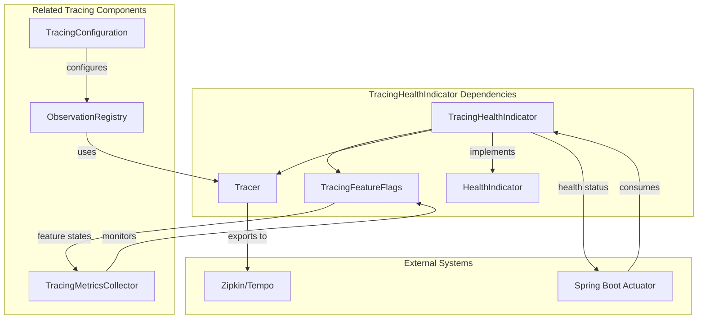
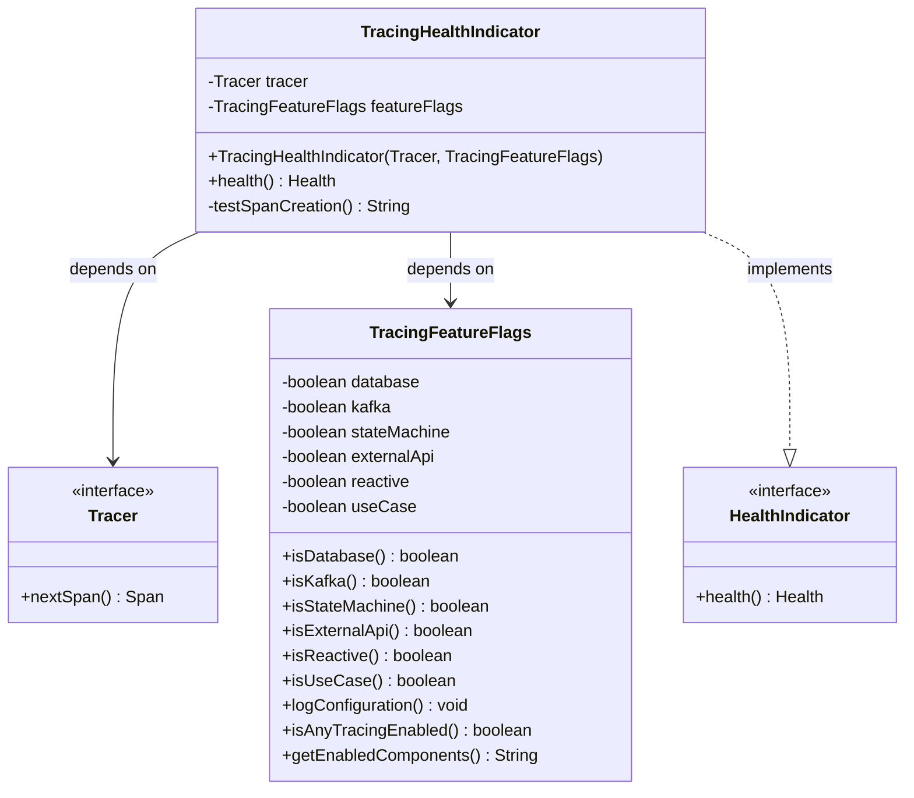
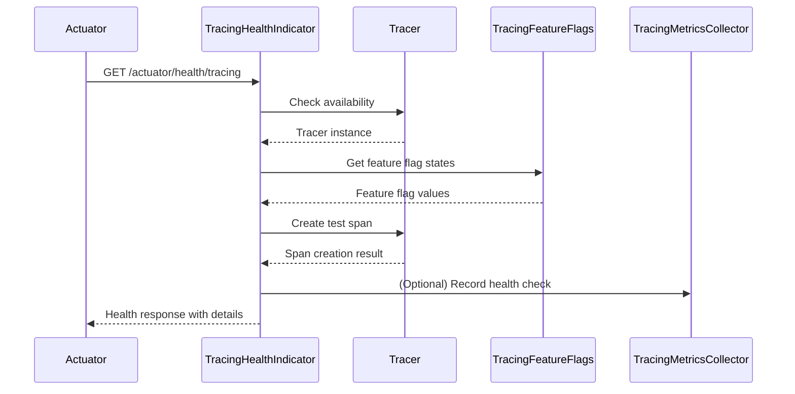
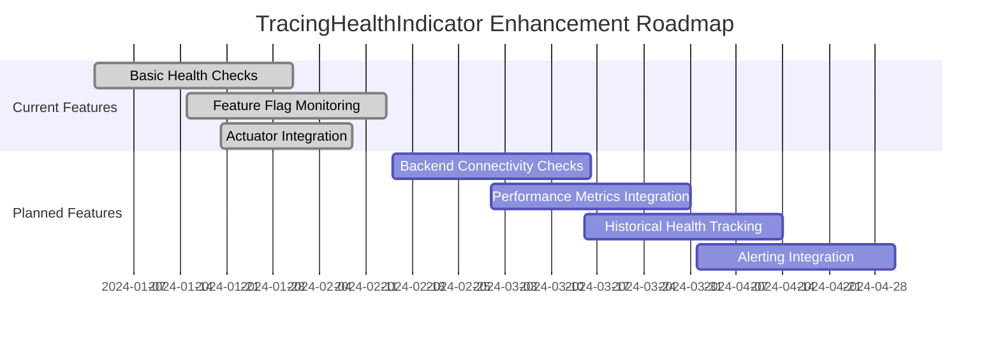

# TracingHealthIndicator Module

## Overview

The `TracingHealthIndicator` is a Spring Boot HealthIndicator component that monitors the health and operational status of the distributed tracing infrastructure in the WalletHub application. It provides real-time visibility into tracing system functionality, feature flag states, and span creation capabilities.

## Purpose

The primary purpose of this module is to:
1. **Monitor Tracing Infrastructure Health**: Verify that the tracing system is operational and spans can be created
2. **Expose Feature Flag States**: Report which tracing components are enabled/disabled via `TracingFeatureFlags`
3. **Provide Diagnostic Information**: Offer detailed health status for troubleshooting tracing issues
4. **Integrate with Actuator**: Expose tracing health via Spring Boot Actuator endpoints

## Architecture

### Component Relationships



### Class Diagram



## Core Components

### 1. TracingHealthIndicator Class

The main component that implements Spring Boot's `HealthIndicator` interface:

```java
@Component
public class TracingHealthIndicator implements HealthIndicator {
    private final Tracer tracer;
    private final TracingFeatureFlags featureFlags;
    
    public TracingHealthIndicator(Tracer tracer, TracingFeatureFlags featureFlags) {
        this.tracer = tracer;
        this.featureFlags = featureFlags;
    }
    
    @Override
    public Health health() {
        // Health check implementation
    }
}
```

### 2. Health Check Logic

The health check performs the following validations:

1. **Tracer Availability Check**: Verifies the Tracer instance is not null
2. **Feature Flag Status**: Reports the state of all tracing components
3. **Span Creation Test**: Attempts to create and end a test span
4. **Error Handling**: Gracefully handles exceptions during health checks

### 3. Health Status Definitions

| Status | Condition | Description |
|--------|-----------|-------------|
| **UP** | Tracer available AND span creation successful | Tracing system fully functional |
| **DOWN** | Tracer unavailable OR span creation failed | Tracing system non-functional |
| **UNKNOWN** | Exception during health check | Unable to determine state |

## Health Check Details

### Exposed Health Information

The health indicator exposes the following details in the health response:

```json
{
  "status": "UP",
  "details": {
    "tracer.available": true,
    "tracer.type": "BraveTracer",
    "features.database": true,
    "features.kafka": true,
    "features.stateMachine": true,
    "features.externalApi": true,
    "features.reactive": true,
    "features.useCase": true,
    "span.creation.test": "success"
  }
}
```

### Feature Flag Monitoring

The health indicator monitors six tracing feature flags:

| Feature Flag | Purpose | Default |
|--------------|---------|---------|
| `database` | Database operation tracing (JPA, R2DBC) | `true` |
| `kafka` | Kafka producer/consumer tracing | `true` |
| `stateMachine` | State machine transition tracing | `true` |
| `externalApi` | External API call tracing | `true` |
| `reactive` | Reactive pipeline tracing | `true` |
| `useCase` | Use case execution tracing | `true` |

### Span Creation Test

The `testSpanCreation()` method performs a functional test:
1. Creates a test span named "health-check"
2. Starts the span
3. Ends the span
4. Returns "success" if all steps complete without errors

## Integration Points

### 1. Spring Boot Actuator Integration

The health indicator is automatically discovered by Spring Boot and exposed via:
- **HTTP Endpoint**: `GET /actuator/health/tracing`
- **Health Group**: Part of the overall health aggregation
- **Management Port**: Available on the management port (default: 8081)

### 2. Tracing Infrastructure Integration



### 3. Configuration Integration

The health indicator works with the following configuration components:

- **TracingConfiguration**: Sets up the overall tracing infrastructure
- **TracingFeatureFlags**: Provides runtime feature flag states
- **ObservationRegistry**: Manages observation handlers for tracing

## Usage Examples

### 1. Checking Tracing Health via HTTP

```bash
# Check tracing health
curl http://localhost:8080/actuator/health/tracing

# Check all health indicators (includes tracing)
curl http://localhost:8080/actuator/health

# Get detailed health information
curl http://localhost:8080/actuator/health/tracing | jq .
```

### 2. Health Status Scenarios

**Scenario 1: Healthy System**
```json
{
  "status": "UP",
  "details": {
    "tracer.available": true,
    "tracer.type": "BraveTracer",
    "features.database": true,
    "features.kafka": true,
    "features.stateMachine": true,
    "features.externalApi": true,
    "features.reactive": true,
    "features.useCase": true,
    "span.creation.test": "success"
  }
}
```

**Scenario 2: Tracer Unavailable**
```json
{
  "status": "DOWN",
  "details": {
    "tracer.available": false
  }
}
```

**Scenario 3: Span Creation Failed**
```json
{
  "status": "DOWN",
  "details": {
    "tracer.available": true,
    "tracer.type": "BraveTracer",
    "features.database": true,
    "features.kafka": true,
    "features.stateMachine": true,
    "features.externalApi": true,
    "features.reactive": true,
    "features.useCase": true,
    "span.creation.test": "error: connection refused",
    "error": "error: connection refused"
  }
}
```

## Configuration

### 1. Application Properties

The health indicator requires the following configuration:

```yaml
# application.yml
management:
  health:
    tracing:
      enabled: true
  tracing:
    enabled: true
    sampling:
      probability: 0.1

tracing:
  features:
    database: true
    kafka: true
    stateMachine: true
    externalApi: true
    reactive: true
    useCase: true
```

### 2. Feature Flag Configuration

Feature flags can be dynamically updated via:
- **Configuration Refresh**: `POST /actuator/refresh`
- **Environment Variables**: Override via `TRACING_FEATURES_DATABASE=false`
- **Configuration Files**: Update `application-tracing.yml`

## Monitoring and Metrics

### 1. Related Metrics Components

The `TracingHealthIndicator` works alongside `TracingMetricsCollector` to provide comprehensive observability:

| Component | Purpose | Relationship |
|-----------|---------|--------------|
| `TracingHealthIndicator` | Health status monitoring | Provides UP/DOWN status |
| `TracingMetricsCollector` | Performance metrics collection | Records span creation counts |
| `TracingFeatureFlags` | Feature toggle management | Shared configuration source |

### 2. Health Check Metrics

While the health indicator itself doesn't emit metrics, related components provide:

- **Span Creation Rate**: `tracing.spans.created` counter
- **Feature Flag States**: `tracing.feature.flags.state` gauge
- **Export Statistics**: `tracing.spans.exported` counter

## Error Handling

### 1. Exception Scenarios

The health indicator handles the following error scenarios:

| Scenario | Handling | Result |
|----------|----------|--------|
| Tracer bean missing | Catch NullPointerException | DOWN status |
| Span creation exception | Catch specific exception | DOWN with error message |
| Feature flag access error | Catch RuntimeException | DOWN with exception |
| Configuration issues | Graceful degradation | UNKNOWN status |

### 2. Recovery Procedures

When the health indicator reports DOWN status:

1. **Check Tracer Configuration**: Verify `management.tracing.enabled=true`
2. **Verify Backend Connectivity**: Ensure Zipkin/Tempo endpoints are reachable
3. **Review Feature Flags**: Check if critical flags are disabled
4. **Examine Application Logs**: Look for tracing initialization errors

## Performance Considerations

### 1. Health Check Overhead

- **Memory Usage**: Minimal (creates one test span per check)
- **CPU Impact**: Negligible (simple span creation test)
- **Frequency**: Configurable via actuator health endpoint settings

### 2. Optimization Guidelines

- **Check Frequency**: Default actuator health check interval (30 seconds)
- **Span Sampling**: Test span is not exported to avoid backend load
- **Caching**: No caching implemented - each check performs live validation

## Testing

### 1. Unit Test Scenarios

```java
@SpringBootTest
class TracingHealthIndicatorTest {
    
    @Autowired
    private TracingHealthIndicator healthIndicator;
    
    @MockBean
    private Tracer tracer;
    
    @MockBean
    private TracingFeatureFlags featureFlags;
    
    @Test
    void shouldReturnUpWhenTracerAvailable() {
        when(tracer.nextSpan()).thenReturn(mock(Span.class));
        when(featureFlags.isDatabase()).thenReturn(true);
        // ... other feature flags
        
        Health health = healthIndicator.health();
        assertThat(health.getStatus()).isEqualTo(Status.UP);
    }
    
    @Test
    void shouldReturnDownWhenTracerNull() {
        // Test with null tracer
    }
    
    @Test 
    void shouldReturnDownWhenSpanCreationFails() {
        // Test span creation failure
    }
}
```

### 2. Integration Test Coverage

- **Tracer Availability Tests**: Verify health with/without tracer
- **Feature Flag Tests**: Test all feature flag combinations
- **Error Scenario Tests**: Validate exception handling
- **Actuator Integration**: Verify endpoint accessibility

## Related Modules

### 1. [TracingConfiguration](TracingConfiguration.md)
Central configuration module that sets up the tracing infrastructure, including the Tracer instance used by the health indicator.

### 2. [TracingFeatureFlags](TracingFeatureFlags.md)
Feature flag management module that controls which tracing components are enabled.

### 3. [TracingMetricsCollector](TracingMetricsCollector.md)
Metrics collection module that works alongside the health indicator for comprehensive observability.

### 4. [ObservationRegistry](ObservationRegistry.md)
Observation management system that coordinates tracing across the application.

## Best Practices

### 1. Health Check Configuration

```yaml
# Recommended configuration
management:
  endpoint:
    health:
      show-details: always
      show-components: always
  health:
    tracing:
      enabled: true
    defaults:
      enabled: true
```

### 2. Monitoring Setup

1. **Alerting**: Configure alerts for DOWN status
2. **Dashboard**: Include tracing health in operational dashboards
3. **Logging**: Correlate health changes with application logs
4. **Metrics**: Combine health status with span export metrics

### 3. Troubleshooting Guide

| Symptom | Possible Cause | Resolution |
|---------|---------------|------------|
| DOWN - tracer.available=false | Tracing not configured | Enable `management.tracing.enabled` |
| DOWN - span creation error | Backend unreachable | Check Zipkin/Tempo connectivity |
| Feature flags all false | Configuration error | Verify `tracing.features.*` settings |
| Intermittent DOWN status | Network issues | Check backend network connectivity |

## Future Enhancements

### 1. Planned Improvements

- **Circuit Breaker Integration**: Monitor tracing backend circuit breaker state
- **Historical Health Trends**: Track health status over time
- **Performance Metrics**: Include latency and throughput in health checks
- **Dependency Health**: Check health of tracing backends (Zipkin/Tempo)

### 2. Enhancement Roadmap



## Conclusion

The `TracingHealthIndicator` module provides critical health monitoring for the distributed tracing infrastructure in the WalletHub application. By integrating with Spring Boot Actuator and monitoring both tracer availability and feature flag states, it offers comprehensive visibility into tracing system health. This enables proactive monitoring, rapid troubleshooting, and ensures that tracing remains operational for debugging and observability purposes.

The module follows Spring Boot best practices, provides detailed diagnostic information, and integrates seamlessly with the broader tracing ecosystem including `TracingConfiguration`, `TracingFeatureFlags`, and `TracingMetricsCollector`.