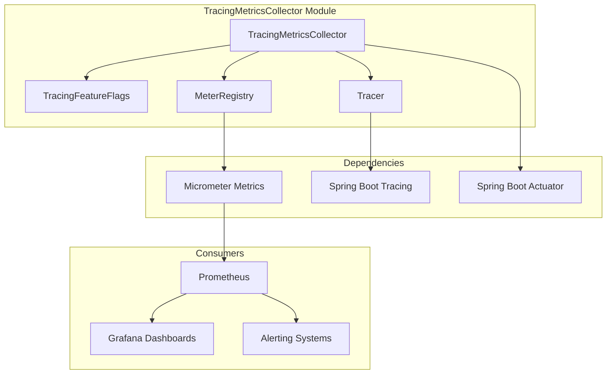
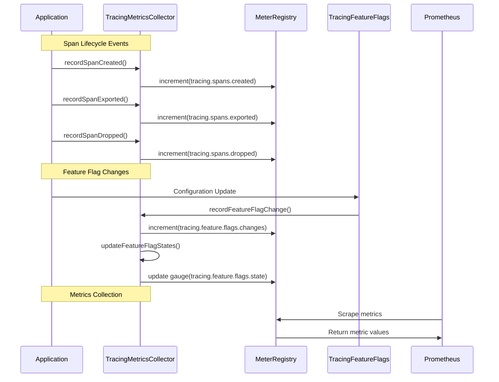
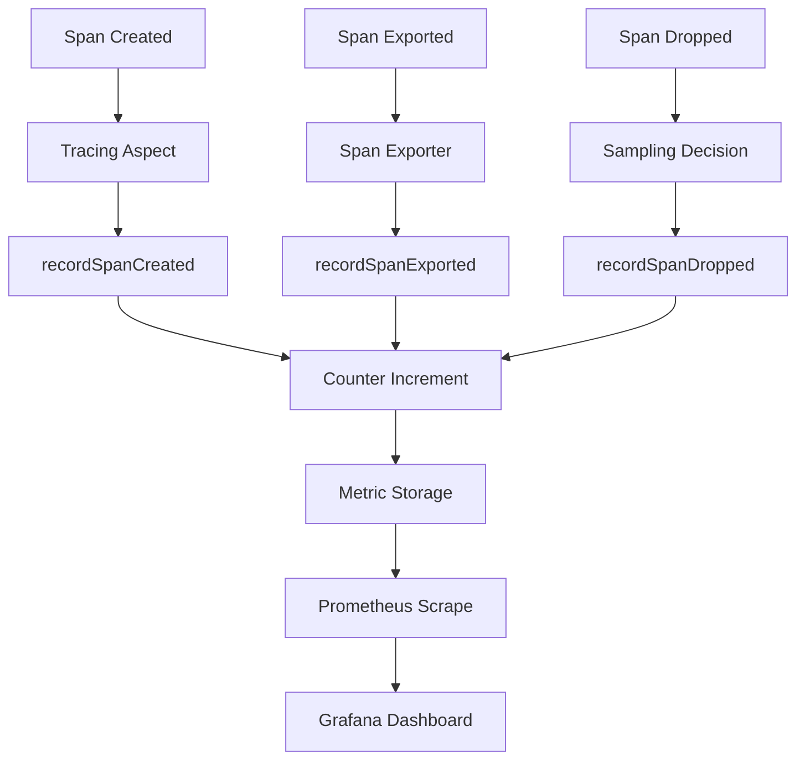
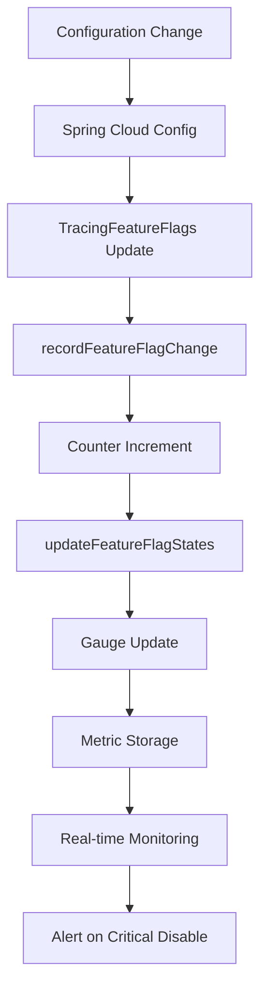

# TracingMetricsCollector Module Documentation

## Overview

The `TracingMetricsCollector` is a critical component of the Wallet Hub's distributed tracing infrastructure that collects, aggregates, and exposes tracing-related metrics via Micrometer. This module provides real-time visibility into tracing system performance, feature flag states, and span lifecycle events, enabling comprehensive monitoring of the observability layer itself.

## Purpose and Core Functionality

The primary purpose of the TracingMetricsCollector is to:

1. **Monitor Tracing System Health**: Track span creation, export, and drop rates to identify tracing system issues
2. **Expose Feature Flag States**: Provide real-time visibility into which tracing components are enabled/disabled
3. **Enable Performance Analysis**: Measure tracing overhead and identify optimization opportunities
4. **Support Alerting**: Provide metrics for alerting on tracing system failures or performance degradation

## Architecture and Component Relationships

### Module Architecture



### Component Interaction Flow



## Core Components

### 1. TracingMetricsCollector Class

The main component that orchestrates all metrics collection activities.

**Key Responsibilities:**
- Initializes and registers Micrometer metrics
- Maintains counters for span lifecycle events
- Manages gauges for feature flag states
- Provides public API for recording metrics

**Constructor Dependencies:**
- `MeterRegistry`: Micrometer registry for metric registration
- `Tracer`: Distributed tracing tracer instance
- `TracingFeatureFlags`: Feature flag configuration

### 2. Metrics Exposed

#### Counters

| Metric Name | Description | Tags | Use Case |
|-------------|-------------|------|----------|
| `tracing.spans.created` | Total spans created | None | Monitor tracing volume |
| `tracing.spans.exported` | Total spans exported | None | Track export success rate |
| `tracing.spans.dropped` | Total spans dropped | None | Identify sampling/export issues |
| `tracing.feature.flags.changes` | Feature flag change events | None | Track configuration changes |

#### Gauges

| Metric Name | Description | Tags | Values |
|-------------|-------------|------|--------|
| `tracing.feature.flags.state` | Current feature flag state | `feature` (database, kafka, stateMachine, externalApi, reactive, useCase) | 1.0 (enabled), 0.0 (disabled) |

### 3. Feature Flag Integration

The collector integrates with `TracingFeatureFlags` to provide real-time visibility into which tracing components are active:

```java
// Feature flags monitored
databaseFeatureState.set(featureFlags.isDatabase() ? 1 : 0);
kafkaFeatureState.set(featureFlags.isKafka() ? 1 : 0);
stateMachineFeatureState.set(featureFlags.isStateMachine() ? 1 : 0);
externalApiFeatureState.set(featureFlags.isExternalApi() ? 1 : 0);
reactiveFeatureState.set(featureFlags.isReactive() ? 1 : 0);
useCaseFeatureState.set(featureFlags.isUseCase() ? 1 : 0);
```

## Integration with Other Modules

### 1. TracingConfiguration Module
- **Relationship**: TracingMetricsCollector depends on `TracingConfiguration` for the overall tracing setup
- **Integration Point**: Both use `TracingFeatureFlags` for configuration
- **Reference**: See [TracingConfiguration.md](TracingConfiguration.md) for configuration details

### 2. TracingHealthIndicator Module
- **Relationship**: Complementary monitoring components
- **Integration Point**: Both monitor tracing system health but at different levels
- **Reference**: See [TracingHealthIndicator.md](TracingHealthIndicator.md) for health check details

### 3. UseCaseTracingAspect Module
- **Relationship**: Metrics source for use case tracing
- **Integration Point**: UseCaseTracingAspect calls `recordSpanCreated()` and `recordSpanExported()`
- **Reference**: See [UseCaseTracingAspect.md](UseCaseTracingAspect.md) for aspect implementation

### 4. RepositoryTracingAspect Module
- **Relationship**: Metrics source for repository tracing
- **Integration Point**: RepositoryTracingAspect calls span recording methods
- **Reference**: See [RepositoryTracingAspect.md](RepositoryTracingAspect.md) for database tracing

## Data Flow

### Span Lifecycle Metrics Flow



### Feature Flag Metrics Flow



## Configuration

### Spring Boot Configuration

```yaml
# application.yml
management:
  metrics:
    export:
      prometheus:
        enabled: true
    tracing:
      metrics:
        enabled: true  # Enables TracingMetricsCollector
  
tracing:
  features:
    database: true
    kafka: true
    stateMachine: true
    externalApi: true
    reactive: true
    useCase: true
```

### Prometheus Query Examples

```promql
# Total spans created per minute
rate(tracing_spans_created_total[1m])

# Export success rate
tracing_spans_exported_total / tracing_spans_created_total

# Feature flag states
tracing_feature_flags_state{feature="database"}
tracing_feature_flags_state{feature="useCase"}

# Alert on critical feature disable
tracing_feature_flags_state{feature="useCase"} == 0
```

## Usage Examples

### 1. Recording Span Events

```java
// In tracing aspects or exporters
@Autowired
private TracingMetricsCollector metricsCollector;

// When span is created
metricsCollector.recordSpanCreated();

// When span is successfully exported
metricsCollector.recordSpanExported();

// When span is dropped (sampling, error)
metricsCollector.recordSpanDropped();
```

### 2. Monitoring Feature Flags

```java
// When feature flags change (handled automatically via @RefreshScope)
// The collector automatically updates gauges when:
// 1. Application starts
// 2. Configuration is refreshed via /actuator/refresh
// 3. Manual call to updateFeatureFlagStates()
```

### 3. Custom Metric Integration

```java
// Extending the collector for custom metrics
@Component
public class CustomTracingMetrics extends TracingMetricsCollector {
    
    private Counter customSpanCounter;
    
    @PostConstruct
    @Override
    public void init() {
        super.init();
        customSpanCounter = Counter.builder("tracing.custom.spans")
            .description("Custom span counter")
            .register(meterRegistry);
    }
    
    public void recordCustomSpan() {
        customSpanCounter.increment();
    }
}
```

## Performance Considerations

### 1. Overhead Analysis

| Operation | Estimated Overhead | Impact |
|-----------|-------------------|--------|
| Counter Increment | < 0.01ms | Negligible |
| Gauge Update | < 0.01ms | Negligible |
| Feature Flag State Update | < 0.05ms | Minimal |
| Initialization (@PostConstruct) | ~5-10ms | One-time startup cost |

### 2. Memory Usage

- **Counters**: Fixed memory allocation (atomic longs)
- **Gauges**: 6 AtomicLong instances for feature flags
- **Total Memory**: < 1KB per instance

### 3. Thread Safety

- All operations are thread-safe using atomic operations
- No synchronization blocks or locks
- Safe for concurrent access from multiple threads

## Monitoring and Alerting

### Key Metrics to Monitor

1. **Span Creation Rate**: Sudden drops may indicate tracing system issues
2. **Export Success Ratio**: `exported / created` should be close to sampling rate
3. **Feature Flag States**: Alert when critical flags (useCase, kafka) are disabled
4. **Flag Change Frequency**: High frequency may indicate configuration issues

### Example Alert Rules

```yaml
# Prometheus alert rules
groups:
  - name: tracing_alerts
    rules:
      - alert: TracingExportFailure
        expr: rate(tracing_spans_created_total[5m]) > 0 and rate(tracing_spans_exported_total[5m]) == 0
        for: 2m
        labels:
          severity: critical
        annotations:
          summary: "No spans being exported"
          
      - alert: CriticalTracingDisabled
        expr: tracing_feature_flags_state{feature=~"useCase|kafka"} == 0
        labels:
          severity: warning
        annotations:
          summary: "Critical tracing component disabled"
```

## Troubleshooting

### Common Issues

1. **Metrics Not Appearing**
   - Check if `management.metrics.export.prometheus.enabled=true`
   - Verify `TracingMetricsCollector` bean is created
   - Check application logs for initialization errors

2. **Feature Flag States Incorrect**
   - Verify `TracingFeatureFlags` configuration
   - Check `/actuator/refresh` endpoint for configuration updates
   - Verify @RefreshScope is working

3. **High Memory Usage**
   - Check for metric cardinality issues
   - Verify no custom tags causing high dimensionality
   - Monitor Micrometer registry size

### Debugging Steps

```bash
# Check metrics endpoint
curl http://localhost:8080/actuator/metrics/tracing.spans.created

# Check feature flag configuration
curl http://localhost:8080/actuator/health | jq '.details.tracingHealthIndicator'

# Refresh configuration
curl -X POST http://localhost:8080/actuator/refresh
```

## Best Practices

### 1. Configuration Management
- Use feature flags to control tracing overhead
- Monitor flag change frequency
- Document flag changes in deployment notes

### 2. Performance Optimization
- Disable non-critical tracing in high-load scenarios
- Monitor tracing overhead vs. business value
- Use sampling to reduce volume while maintaining visibility

### 3. Monitoring Strategy
- Set up dashboards for tracing system health
- Create alerts for critical failures
- Regularly review metrics for optimization opportunities

### 4. Testing
- Unit test metric recording
- Integration test with Prometheus
- Load test tracing overhead

## Future Enhancements

### Planned Improvements

1. **Histogram Support**: Add duration histograms for span creation/export
2. **Cardinality Control**: Add support for custom tags with cardinality limits
3. **Export Metrics**: Track export latency and failure reasons
4. **Integration Tests**: Comprehensive test suite with metric validation

### Extension Points

1. **Custom Metrics**: Subclass for application-specific tracing metrics
2. **Export Adapters**: Support for other metric backends (StatsD, InfluxDB)
3. **Dynamic Configuration**: Runtime metric configuration changes
4. **Correlation IDs**: Link tracing metrics with business metrics

## Related Documentation

- [TracingConfiguration.md](TracingConfiguration.md) - Overall tracing system configuration
- [TracingFeatureFlags.md](TracingFeatureFlags.md) - Feature flag system documentation
- [TracingHealthIndicator.md](TracingHealthIndicator.md) - Health check implementation
- [UseCaseTracingAspect.md](UseCaseTracingAspect.md) - Use case tracing implementation
- [RepositoryTracingAspect.md](RepositoryTracingAspect.md) - Repository tracing implementation

## Summary

The `TracingMetricsCollector` module is a vital component of the Wallet Hub's observability stack, providing real-time metrics about the tracing system itself. By monitoring span lifecycle events and feature flag states, it enables proactive management of tracing overhead, early detection of issues, and data-driven optimization decisions. The module's lightweight design, thread-safe implementation, and seamless integration with Spring Boot's metrics ecosystem make it an essential tool for maintaining visibility into the application's distributed tracing infrastructure.