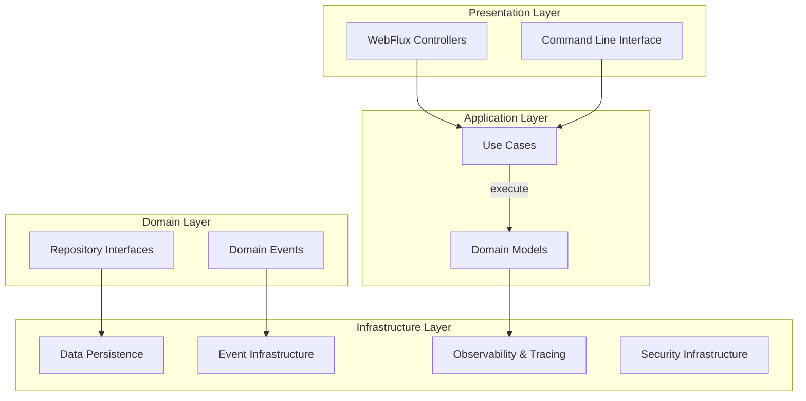
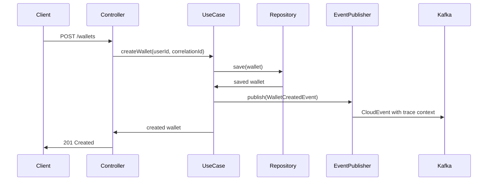
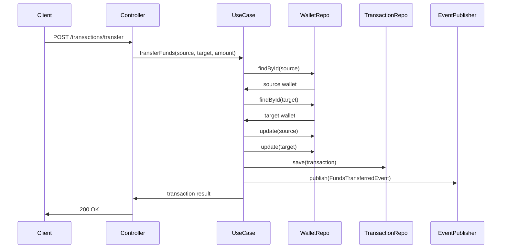

# WalletHub Application Documentation

## Overview

WalletHub is a comprehensive cryptocurrency wallet management system built with Java and Spring Boot. The application provides a robust platform for managing digital wallets, handling cryptocurrency transactions, and ensuring secure operations through a domain-driven design architecture.

### Purpose
The primary purpose of WalletHub is to provide a secure, scalable, and observable platform for managing cryptocurrency wallets and transactions. It supports multiple blockchain networks, token management, and user authentication while maintaining high standards of security and observability.

### Key Features
- **Wallet Management**: Create, update, and manage cryptocurrency wallets
- **Transaction Processing**: Handle fund transfers, deposits, and withdrawals
- **Multi-Network Support**: Support for various blockchain networks
- **Token Management**: Manage ERC-20 and other token standards
- **User Authentication**: Secure user management with 2FA support
- **Event-Driven Architecture**: Asynchronous event processing with Kafka
- **Distributed Tracing**: Comprehensive observability with multi-backend tracing
- **Security**: Hardware Security Module (HSM) integration for key management

## Architecture Overview

WalletHub follows a **Hexagonal Architecture** (Ports and Adapters) pattern with clear separation between domain logic and infrastructure concerns. The architecture is organized into distinct layers:



### Core Architectural Principles

1. **Domain-Driven Design**: Rich domain models with business logic encapsulated in entities and value objects
2. **Event-Driven**: Domain events for state changes and cross-service communication
3. **Observability-First**: Built-in distributed tracing, metrics, and logging
4. **Security by Design**: Hardware Security Module integration and secure key management
5. **Reactive Programming**: Non-blocking, asynchronous operations using Project Reactor

## Module Structure

The application is organized into the following main modules:

### 1. Application Module (`application`)
The main entry point and configuration module containing:
- **WalletHubApplication**: Main Spring Boot application class
- **DinamoLibraryLoader**: HSM native library loader
- **ReactiveContextConfig**: Reactive context propagation for distributed tracing
- **UseCaseConfig**: Use case bean configuration

For detailed documentation, see [application.md](application.md)

### 2. Domain Models (`domain_models`)
Core business entities representing the domain:
- **Wallet**: Cryptocurrency wallet with balance and addresses
- **User**: System user with authentication and profile management
- **Transaction**: Financial transactions between wallets
- **Address**: Blockchain addresses associated with wallets
- **Token**: Cryptocurrency tokens and their metadata
- **Network**: Blockchain network configurations
- **Vault**: Secure key storage and management

For detailed documentation, see [domain_models.md](domain_models.md)

### 3. Domain Events (`domain_events`)
Domain events representing state changes:
- **WalletCreatedEvent**, **WalletUpdatedEvent**: Wallet lifecycle events
- **FundsAddedEvent**, **FundsWithdrawnEvent**: Financial operation events
- **UserAuthenticatedEvent**, **UserCreatedEvent**: User management events
- **TransactionConfirmedEvent**: Transaction status events

For detailed documentation, see [domain_events.md](domain_events.md)

### 4. Domain Repositories (`domain_repositories`)
Repository interfaces defining data access contracts:
- **WalletRepository**, **UserRepository**: Core entity repositories
- **TransactionRepository**, **AddressRepository**: Transaction and address management
- **TokenRepository**, **NetworkRepository**: Token and network data access

For detailed documentation, see [domain_repositories.md](domain_repositories.md)

### 5. Infrastructure Data (`infrastructure_data`)
Data persistence implementation:
- **JPA Entities**: Database entity mappings
- **Repository Implementations**: Spring Data JPA implementations
- **Mappers**: Domain-entity conversion
- **Outbox Pattern**: Reliable event publishing

For detailed documentation, see [infrastructure_data.md](infrastructure_data.md)

### 6. Infrastructure Events (`infrastructure_events`)
Event infrastructure implementation:
- **KafkaEventProducer**: Event publishing to Kafka
- **Event Consumers**: Event processing from Kafka
- **Outbox Pattern**: Reliable event delivery

For detailed documentation, see [infrastructure_events.md](infrastructure_events.md)

### 7. Infrastructure Tracing (`infrastructure_tracing`)
Comprehensive observability system:
- **TracingConfiguration**: Central tracing configuration
- **UseCaseTracingAspect**: AOP-based use case instrumentation
- **Sampling System**: Intelligent trace sampling
- **Propagation**: Distributed trace context propagation

For detailed documentation, see [infrastructure_tracing.md](infrastructure_tracing.md)

### 8. Infrastructure Security (`infrastructure_security`)
Security infrastructure:
- **SecurityConfig**: Spring Security configuration
- **RedisAuthConfig**: Redis-based authentication

For detailed documentation, see [infrastructure_security.md](infrastructure_security.md)

### 9. Use Cases (`use_cases`)
Business operation implementations:
- **Wallet Management**: Create, update, delete wallets
- **Transaction Processing**: Fund transfers, deposits, withdrawals
- **User Management**: Authentication, profile updates
- **Address Management**: Address creation and validation

For detailed documentation, see [use_cases.md](use_cases.md)

### 10. Infrastructure Utilities (`infrastructure_utils`)
Utility components:
- **CloudEventUtils**: CloudEvent format utilities

For detailed documentation, see [infrastructure_utils.md](infrastructure_utils.md)

## Data Flow

### Wallet Creation Flow


### Transaction Processing Flow


## Tracing and Observability

WalletHub implements comprehensive distributed tracing with the following features:

### Multi-Backend Tracing
- **Primary Backend**: OTLP/Tempo for high-performance trace storage
- **Fallback Backend**: Zipkin for compatibility and redundancy
- **Circuit Breaker Protection**: Automatic failover between backends

### Context Propagation
- **W3C Trace Context**: Standard trace header propagation
- **Reactive Context**: Automatic context propagation in reactive pipelines
- **CloudEvent Integration**: Trace context in event headers

### Instrumentation Points
1. **Use Cases**: Business operation tracing with AOP
2. **Repositories**: Database query performance monitoring
3. **HTTP Requests**: WebFlux endpoint tracing
4. **Kafka Messages**: Producer/consumer instrumentation
5. **Database Operations**: R2DBC query tracing

## Security Architecture

### Hardware Security Module (HSM) Integration
- **Dinamo HSM**: Native library integration for secure key operations
- **Platform-Specific**: Windows (DLL) and Linux (SO) library loading
- **Secure Key Storage**: Private keys never exposed in application memory

### Authentication & Authorization
- **JWT-based Authentication**: Stateless token-based authentication
- **Two-Factor Authentication**: TOTP-based 2FA support
- **Role-Based Access Control**: Fine-grained permission management
- **Session Management**: Secure session handling with Redis

## Configuration Management

### Application Configuration
- **Spring Boot Auto-configuration**: Standard Spring Boot configuration
- **Profile-based**: Environment-specific configuration profiles
- **Externalized**: Configuration externalized to application.yml

### Tracing Configuration
```yaml
management:
  tracing:
    enabled: true
    sampling:
      probability: 0.1
  zipkin:
    tracing:
      endpoint: http://localhost:9411/api/v2/spans
  otlp:
    tracing:
      endpoint: http://localhost:4318/v1/traces

tracing:
  backends:
    primary: tempo
    fallback: zipkin
  features:
    use-case: true
    repository: true
```

## Deployment Considerations

### Prerequisites
- Java 17 or higher
- PostgreSQL database
- Redis for caching and sessions
- Kafka for event streaming
- Tempo or Zipkin for tracing (optional)

### Environment Variables
```bash
SPRING_DATASOURCE_URL=jdbc:postgresql://localhost:5432/wallethub
SPRING_DATASOURCE_USERNAME=postgres
SPRING_DATASOURCE_PASSWORD=password
SPRING_REDIS_HOST=localhost
SPRING_REDIS_PORT=6379
SPRING_KAFKA_BOOTSTRAP_SERVERS=localhost:9092
MANAGEMENT_TRACING_ENABLED=true
```

### Health Checks
- **/actuator/health**: Application health status
- **/actuator/metrics**: Application metrics
- **/actuator/trace**: Recent trace information
- **/actuator/tracing**: Tracing configuration and status

## Development Guidelines

### Code Organization
- **Domain Layer**: Pure business logic, no framework dependencies
- **Application Layer**: Use cases coordinating domain operations
- **Infrastructure Layer**: Framework-specific implementations
- **Presentation Layer**: HTTP controllers and API definitions

### Testing Strategy
- **Unit Tests**: Domain models and use cases
- **Integration Tests**: Repository and service integration
- **Component Tests**: API endpoint testing
- **End-to-End Tests**: Complete workflow testing

### Monitoring and Alerting
- **Application Metrics**: Micrometer metrics collection
- **Business Metrics**: Custom metrics for wallet operations
- **Alert Rules**: Prometheus alerting rules
- **Dashboard**: Grafana dashboards for monitoring

## Related Documentation

- [Domain Models Documentation](domain_models.md)
- [Use Cases Documentation](use_cases.md)
- [Tracing Infrastructure Documentation](infrastructure_tracing.md)
- [Event Infrastructure Documentation](infrastructure_events.md)
- [Security Infrastructure Documentation](infrastructure_security.md)