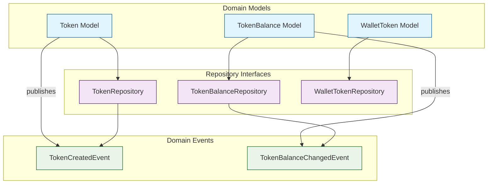
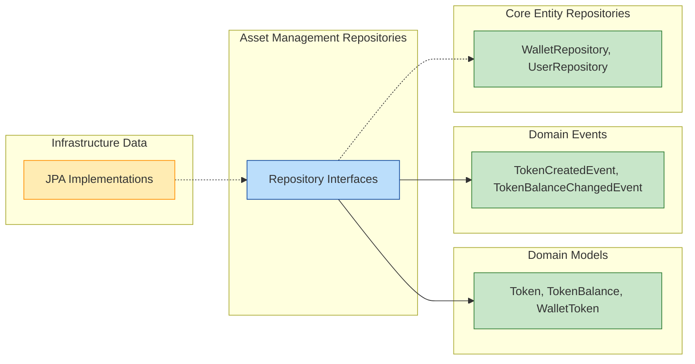
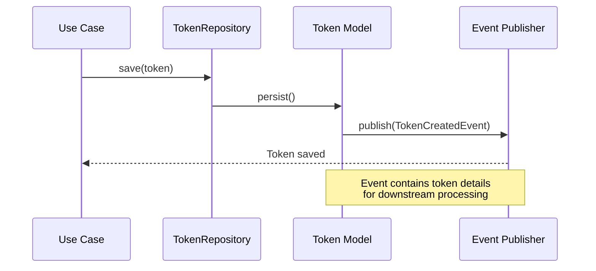
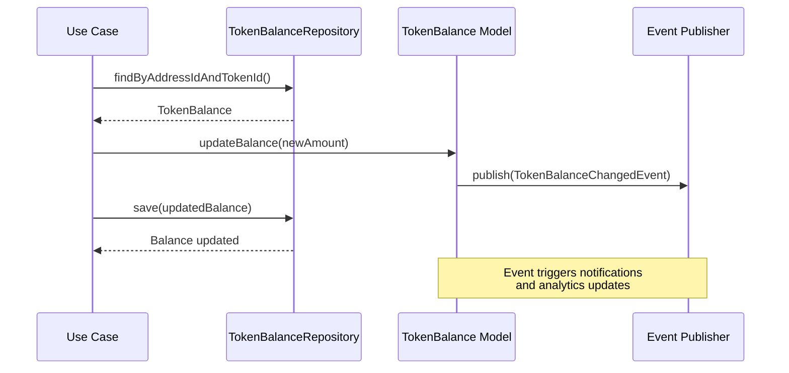
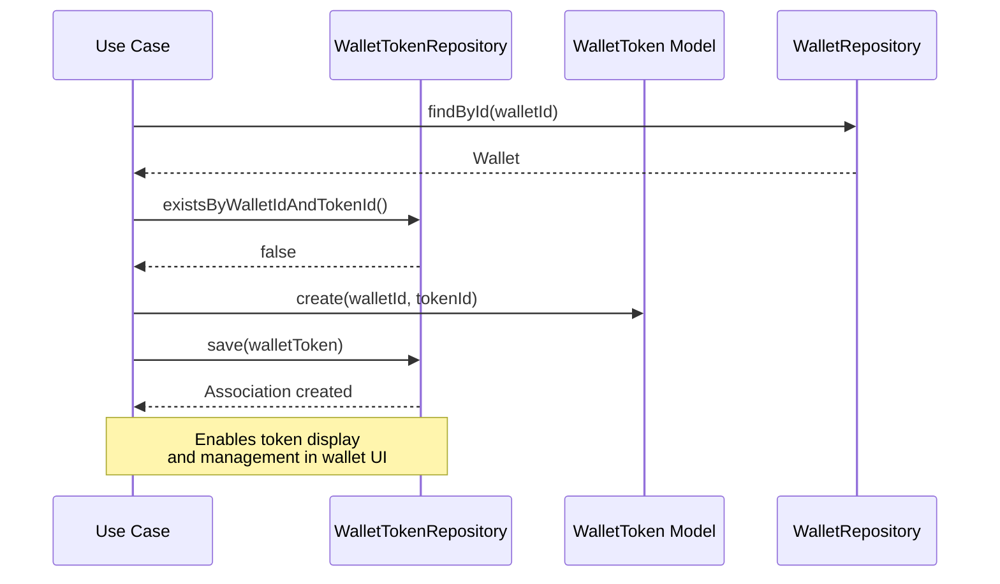

# Asset Management Repositories Module

## Overview

The **Asset Management Repositories** module is a critical component of the Wallet Hub system that manages the persistence and retrieval of digital asset-related data. This module provides repository interfaces for managing tokens, token balances, and wallet-token relationships, forming the foundation for digital asset tracking and management within the wallet ecosystem.

## Module Purpose

The primary purpose of this module is to:
1. **Token Management**: Store and retrieve token definitions across different blockchain networks
2. **Balance Tracking**: Maintain and update token balances for wallet addresses
3. **Wallet-Token Relationships**: Manage which tokens are associated with specific wallets and their display preferences
4. **Data Consistency**: Ensure consistent state management for asset-related operations

## Architecture

### Component Relationships



### Module Dependencies



## Core Components

### 1. TokenRepository

The `TokenRepository` interface manages token definitions across different blockchain networks.

#### Key Operations:
- **CRUD Operations**: Save, find, delete tokens
- **Network-based Queries**: Find tokens by network ID
- **Contract Address Lookup**: Find tokens by network and contract address
- **Token Classification**: Find tokens by type and symbol

#### Interface Definition:
```java
public interface TokenRepository {
    Token save(Token token);
    Optional<Token> findById(UUID id);
    List<Token> findAll();
    void delete(UUID id);
    List<Token> findByNetworkId(UUID networkId);
    Optional<Token> findByNetworkIdAndContractAddress(UUID networkId, String contractAddress);
    List<Token> findByType(TokenType type);
    List<Token> findBySymbol(String symbol);
    boolean existsById(UUID id);
}
```

#### Usage Example:
```java
// Creating and saving a new token
Token token = Token.create(
    UUID.randomUUID(),
    networkId,
    "Ethereum",
    "ETH",
    18,
    TokenType.NATIVE,
    null
);

tokenRepository.save(token);

// Finding tokens by network
List<Token> networkTokens = tokenRepository.findByNetworkId(networkId);

// Looking up by contract address
Optional<Token> erc20Token = tokenRepository.findByNetworkIdAndContractAddress(
    networkId,
    "0x1234..."
);
```

### 2. TokenBalanceRepository

The `TokenBalanceRepository` interface manages token balances for wallet addresses, tracking the amount of each token held at specific addresses.

#### Key Operations:
- **Balance Management**: Save and update token balances
- **Address-based Queries**: Find balances by address ID
- **Token-based Queries**: Find balances by token ID
- **Composite Lookup**: Find specific address-token balance combination

#### Interface Definition:
```java
public interface TokenBalanceRepository {
    TokenBalance save(TokenBalance tokenBalance);
    Optional<TokenBalance> findById(UUID id);
    List<TokenBalance> findAll();
    void delete(UUID id);
    List<TokenBalance> findByAddressId(UUID addressId);
    List<TokenBalance> findByTokenId(UUID tokenId);
    Optional<TokenBalance> findByAddressIdAndTokenId(UUID addressId, UUID tokenId);
    boolean existsById(UUID id);
}
```

#### Usage Example:
```java
// Creating a new token balance
TokenBalance balance = TokenBalance.create(
    UUID.randomUUID(),
    addressId,
    tokenId,
    new BigDecimal("100.0")
);

tokenBalanceRepository.save(balance);

// Updating balance
balance.addToBalance(new BigDecimal("50.0"));
tokenBalanceRepository.save(balance);

// Getting all balances for an address
List<TokenBalance> addressBalances = tokenBalanceRepository.findByAddressId(addressId);

// Getting specific token balance
Optional<TokenBalance> specificBalance = tokenBalanceRepository
    .findByAddressIdAndTokenId(addressId, tokenId);
```

### 3. WalletTokenRepository

The `WalletTokenRepository` interface manages the relationship between wallets and tokens, including display preferences and visibility settings.

#### Key Operations:
- **Relationship Management**: Save and update wallet-token associations
- **Wallet-based Queries**: Find tokens associated with a wallet
- **Token-based Queries**: Find wallets containing a specific token
- **Display Management**: Query enabled and visible tokens
- **Existence Check**: Verify if a wallet contains a specific token

#### Interface Definition:
```java
public interface WalletTokenRepository {
    WalletToken save(WalletToken walletToken);
    Optional<WalletToken> findById(UUID id);
    List<WalletToken> findAll();
    void delete(UUID id);
    List<WalletToken> findByWalletId(UUID walletId);
    List<WalletToken> findByTokenId(UUID tokenId);
    Optional<WalletToken> findByWalletIdAndTokenId(UUID walletId, UUID tokenId);
    List<WalletToken> findEnabledByWalletId(UUID walletId);
    List<WalletToken> findVisibleByWalletId(UUID walletId);
    boolean existsByWalletIdAndTokenId(UUID walletId, UUID tokenId);
    void update(WalletToken walletToken);
}
```

#### Usage Example:
```java
// Adding a token to a wallet
WalletToken walletToken = WalletToken.create(
    UUID.randomUUID(),
    walletId,
    tokenId,
    "My Custom Token Name"
);

walletTokenRepository.save(walletToken);

// Disabling a token in wallet
walletToken.disable();
walletTokenRepository.update(walletToken);

// Getting visible tokens for a wallet
List<WalletToken> visibleTokens = walletTokenRepository.findVisibleByWalletId(walletId);

// Checking if wallet contains token
boolean hasToken = walletTokenRepository.existsByWalletIdAndTokenId(walletId, tokenId);
```

## Data Flow

### Token Creation and Management Flow



### Balance Update Flow



### Wallet-Token Association Flow



## Domain Models

### Token Model
The `Token` class represents a digital asset on a blockchain network:

**Key Attributes:**
- `networkId`: Reference to the blockchain network
- `contractAddress`: Smart contract address (null for native tokens)
- `name`/`symbol`: Human-readable identifiers
- `decimals`: Precision for token amounts
- `type`: Token classification (NATIVE, ERC20, ERC721, ERC1155)

**Key Methods:**
- `isNative()`/`isNFT()`/`isFungible()`: Type classification helpers
- `formatAmount()`/`parseAmount()`: Amount formatting utilities

### TokenBalance Model
The `TokenBalance` class tracks token holdings at specific addresses:

**Key Attributes:**
- `addressId`: Reference to the wallet address
- `tokenId`: Reference to the token
- `balance`: Current token amount
- `lastUpdated`: Timestamp of last update

**Key Methods:**
- `updateBalance()`: Updates balance and publishes event
- `addToBalance()`/`subtractFromBalance()`: Balance modification with validation

### WalletToken Model
The `WalletToken` class manages wallet-token relationships:

**Key Attributes:**
- `walletId`/`tokenId`: Relationship identifiers
- `addedAt`: Timestamp of association
- `isEnabled`/`isVisible`: Display preferences
- `displayName`: Custom name for the token in wallet context

**Key Methods:**
- `enable()`/`disable()`: Toggle token functionality
- `show()`/`hide()`: Control UI visibility
- `setDisplayName()`: Custom naming

## Event-Driven Architecture

### Published Events

#### TokenCreatedEvent
**Triggered when:** A new token is created
**Contains:**
- Token ID and network ID
- Contract address and symbol
- Token type classification
- Correlation ID for tracing

#### TokenBalanceChangedEvent
**Triggered when:** Token balance is updated
**Contains:**
- Token balance ID
- Address and token IDs
- New balance amount
- Correlation ID for tracing

### Event Consumers
These events are consumed by:
- **Notification Service**: Sends balance change alerts
- **Analytics Engine**: Tracks token usage patterns
- **Audit Logging**: Records asset movements
- **Real-time Updates**: Pushes updates to connected clients

## Integration Points

### With Core Entity Repositories
- **WalletRepository**: Validates wallet existence before creating wallet-token associations
- **AddressRepository**: Validates address existence before creating token balances

### With Infrastructure Layer
- **JPA Implementations**: Concrete repository implementations in `infrastructure_data`
- **Event Publishers**: Integration with `DomainEventPublisher` for event propagation
- **Tracing**: Integration with `RepositoryTracingAspect` for observability

### With Use Cases
- **Token Management**: Create, update, and query tokens
- **Balance Tracking**: Monitor and update token holdings
- **Wallet Configuration**: Manage which tokens appear in wallets

## Design Patterns

### Repository Pattern
Each repository interface follows the Repository pattern, providing:
- **Abstraction**: Hides data access implementation details
- **Testability**: Enables easy mocking for unit tests
- **Consistency**: Standardized CRUD operations across entities

### Domain Events Pattern
Event publishing enables:
- **Loose Coupling**: Decouples balance updates from notification logic
- **Extensibility**: New consumers can subscribe without modifying core logic
- **Auditability**: Complete history of asset changes

### Aggregate Root Pattern
`Token` extends `AggregateRoot`, ensuring:
- **Consistency Boundaries**: Token operations maintain internal consistency
- **Transaction Management**: Related operations are atomic
- **Event Sourcing**: State changes are captured as events

## Performance Considerations

### Query Optimization
1. **Indexed Queries**: 
   - `findByNetworkIdAndContractAddress()` for token lookups
   - `findByAddressIdAndTokenId()` for balance checks
   - `findByWalletIdAndTokenId()` for association validation

2. **Pagination Support**: 
   - Consider adding pagination for `findAll()` methods
   - Implement cursor-based pagination for large datasets

3. **Caching Strategies**:
   - Token definitions are good candidates for caching
   - Balance updates require cache invalidation
   - Wallet-token associations benefit from user session caching

### Scalability Patterns
1. **Sharding**: Token balances can be sharded by address ID
2. **Read Replicas**: Balance queries can use read replicas
3. **Eventual Consistency**: Balance updates can be eventually consistent for performance

## Error Handling

### Common Error Scenarios
1. **Duplicate Tokens**: Prevent duplicate contract addresses per network
2. **Negative Balances**: Validate balance operations don't go negative
3. **Orphaned References**: Ensure foreign key constraints are maintained
4. **Concurrent Updates**: Handle optimistic locking for balance updates

### Validation Rules
```java
// Token validation
if (token.isNative() && contractAddress != null) {
    throw new IllegalArgumentException("Native tokens cannot have contract addresses");
}

// Balance validation
if (newBalance.compareTo(BigDecimal.ZERO) < 0) {
    throw new IllegalArgumentException("Balance cannot be negative");
}

// Wallet-token validation
if (walletTokenRepository.existsByWalletIdAndTokenId(walletId, tokenId)) {
    throw new DuplicateAssociationException("Token already exists in wallet");
}
```

## Testing Strategy

### Unit Tests
- **Repository Contracts**: Test interface compliance
- **Domain Logic**: Test token formatting, balance calculations
- **Event Publishing**: Verify events are published correctly

### Integration Tests
- **Database Operations**: Test CRUD operations with real database
- **Transaction Management**: Test atomicity of related operations
- **Event Consumption**: Test end-to-end event flow

### Performance Tests
- **Query Performance**: Test indexed query performance
- **Concurrent Updates**: Test balance update concurrency
- **Load Testing**: Test repository performance under load

## Migration and Evolution

### Versioning Strategy
1. **Backward Compatibility**: Maintain compatibility with existing data
2. **Schema Evolution**: Use migration scripts for database changes
3. **API Versioning**: Version repository interfaces if breaking changes are needed

### Data Migration
```sql
-- Example migration for adding new token type
ALTER TABLE tokens ADD COLUMN IF NOT EXISTS metadata JSONB;

-- Migration for performance optimization
CREATE INDEX IF NOT EXISTS idx_token_balances_address_token 
ON token_balances(address_id, token_id);
```

## Related Documentation

- [Domain Models](../domain_models.md): Detailed documentation of Token, TokenBalance, and WalletToken models
- [Domain Events](../domain_events.md): Comprehensive event system documentation
- [Core Entity Repositories](../core_entity_repositories.md): Documentation of WalletRepository and related repositories
- [Infrastructure Data](../infrastructure_data.md): JPA implementation details
- [Use Cases](../use_cases.md): Business logic that consumes these repositories

## Conclusion

The Asset Management Repositories module provides the foundational data access layer for digital asset management in the Wallet Hub system. By separating concerns through dedicated repositories for tokens, balances, and wallet associations, the module enables clean architecture, testability, and maintainability while supporting the complex requirements of multi-chain digital asset management.

The event-driven design ensures that asset changes are properly propagated throughout the system, enabling real-time updates, notifications, and analytics while maintaining data consistency and auditability.